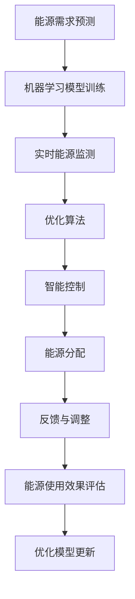

                 

## 1. 背景介绍

随着全球能源需求的日益增长和能源结构的多元化，智能能源分配系统变得尤为重要。智能能源分配系统通过数据驱动和人工智能(AI)技术，优化能源的分配和使用，提升能源利用效率，降低能源成本，实现绿色、可持续的能源发展。本文将详细探讨AI在智能能源分配中的应用，特别是如何通过机器学习算法平衡能源供需，以应对不断变化的能源需求和市场情况。

## 2. 核心概念与联系

### 2.1 核心概念概述

智能能源分配系统结合了人工智能技术，通过实时数据监测、预测和优化算法，实现能源的高效利用。其核心概念包括：

- **机器学习**：一种人工智能技术，通过算法模型从数据中学习和推断规律，用于预测和优化能源分配。
- **需求预测**：使用机器学习模型预测未来的能源需求，为智能分配提供依据。
- **优化算法**：包括线性规划、非线性规划、整数规划等，用于求解能源分配的最优解，以最大化能源利用效率。
- **能源实时监测**：通过传感器和智能设备获取能源系统的实时运行数据，为算法提供实时输入。
- **智能控制**：基于机器学习模型的预测结果和优化算法，动态调整能源分配，提高系统响应速度和稳定性。

### 2.2 核心概念原理和架构的 Mermaid 流程图



这个流程图展示了智能能源分配系统的基本架构，各组件通过数据流和工作流实现协同作用。

## 3. 核心算法原理 & 具体操作步骤

### 3.1 算法原理概述

智能能源分配的核心在于通过机器学习算法预测能源需求，并利用优化算法求解能源分配的最优解。以下将详细介绍两个关键算法：需求预测和优化算法。

### 3.2 算法步骤详解

#### 3.2.1 需求预测算法

需求预测算法的目标是通过历史数据和实时数据，预测未来的能源需求。其基本步骤如下：

1. **数据收集与预处理**：收集历史能源使用数据、气象数据、温度数据等，进行清洗和预处理，去除异常值和噪声。
2. **特征工程**：从数据中提取有意义的特征，如时间、温度、湿度、用户行为等，用于训练机器学习模型。
3. **模型训练**：选择适合的机器学习模型（如线性回归、随机森林、神经网络等），在历史数据上训练模型，学习特征与能源需求之间的关系。
4. **模型评估与优化**：使用交叉验证等方法评估模型性能，选择最优模型并进行参数调优。
5. **实时预测**：将实时数据输入训练好的模型，进行实时能源需求预测。

#### 3.2.2 优化算法

优化算法的目标是找到能源分配的最优解，最大化能源利用效率。其基本步骤如下：

1. **模型建立**：根据历史数据和需求预测结果，建立优化模型的数学表达式，如线性规划模型。
2. **求解算法**：选择适合的求解算法（如单纯形法、遗传算法、粒子群优化等），求解优化模型。
3. **结果验证**：对求解结果进行验证，确保满足约束条件和优化目标。
4. **动态调整**：根据实时数据和优化结果，动态调整能源分配方案。

### 3.3 算法优缺点

#### 3.3.1 需求预测算法的优缺点

**优点**：
- **预测准确性**：基于大量历史数据训练的模型具有较高的预测准确性。
- **实时性**：通过在线学习和实时数据输入，模型能够快速适应需求变化。

**缺点**：
- **数据依赖**：预测模型依赖于数据的质量和完整性，数据不充分或异常会导致预测偏差。
- **模型复杂性**：复杂的模型可能出现过拟合，简单模型可能无法捕捉数据中的复杂关系。

#### 3.3.2 优化算法的优缺点

**优点**：
- **全局最优解**：通过求解算法可以找到全局最优解，最大化能源利用效率。
- **灵活性**：优化算法可以根据不同的能源系统需求进行灵活调整。

**缺点**：
- **计算复杂**：求解复杂优化模型需要大量计算资源，可能影响实时性。
- **约束条件限制**：优化算法需要满足各种约束条件，可能限制方案的灵活性。

### 3.4 算法应用领域

智能能源分配系统在多个领域有广泛的应用，包括：

- **电网调度**：通过预测电网负荷和实时能源监测，优化电力分配，提高电网稳定性和效率。
- **热水供应**：预测热水需求，动态调整热水供应，降低能耗和水耗。
- **建筑能源管理**：优化建筑内部的能源分配，如空调、照明等，提高能效。
- **交通能源管理**：优化交通信号灯的能源分配，减少能源浪费。

## 4. 数学模型和公式 & 详细讲解 & 举例说明

### 4.1 数学模型构建

假设一个简化的智能能源分配系统，包括两个能源节点A和B，以及一个需求节点C。节点A和B分别代表两个能源来源，如发电站和储能系统；节点C代表能源需求节点，如家庭或工厂。需求预测和优化算法可以构建如下数学模型：

$$
\text{Maximize } Z = \sum_{i=1}^2 a_i \times \text{能源输出}_i
$$

其中，$a_i$ 为节点i的能源系数，$\text{能源输出}_i$ 为节点i的能源输出。

### 4.2 公式推导过程

需求预测模型可以使用时间序列预测方法，如ARIMA、LSTM等。以LSTM为例，其预测公式为：

$$
\hat{y}_t = f(y_{t-1}, y_{t-2}, ..., y_{t-n})
$$

其中，$y_t$ 为预测值，$y_{t-1}, y_{t-2}, ..., y_{t-n}$ 为历史数据。

优化算法可以使用线性规划模型，如：

$$
\text{Minimize } C = \sum_{i=1}^2 c_i \times \text{能源消耗}_i
$$

$$
\text{Subject to: } A \times a_i - B \times a_i = C
$$

其中，$A$ 和 $B$ 为节点i的能源输入，$c_i$ 为节点i的能源消耗系数。

### 4.3 案例分析与讲解

以一个简单的智能电网为例，分析其需求预测和优化过程：

1. **需求预测**：通过历史用电数据和天气预报数据，训练LSTM模型预测未来一天的用电需求。
2. **优化算法**：根据预测结果，建立线性规划模型，求解最优的能源分配方案。
3. **智能控制**：根据优化结果，实时调整发电站和储能系统的输出，确保能源需求得到满足。
4. **反馈与调整**：将实际用电数据反馈到模型中，更新预测模型和优化算法。

## 5. 项目实践：代码实例和详细解释说明

### 5.1 开发环境搭建

为了进行智能能源分配系统的开发，需要搭建一个Python开发环境，并配置所需的库和工具。

1. **安装Python**：从官网下载并安装Python 3.x版本。
2. **安装依赖库**：使用pip安装所需的依赖库，如pandas、numpy、scikit-learn、matplotlib等。
3. **配置环境**：设置Python环境变量，使所有依赖库可被识别。

### 5.2 源代码详细实现

以下是一个简单的智能电网能源分配系统的Python代码实现：

```python
import pandas as pd
from sklearn.linear_model import LinearRegression
from sklearn.metrics import mean_squared_error
import matplotlib.pyplot as plt

# 读取历史用电数据
data = pd.read_csv('electricity_data.csv')

# 数据预处理
data['date'] = pd.to_datetime(data['date'])
data = data.set_index('date')

# 数据转换
data['electricity'] = data['electricity'].rolling(window=24).mean()

# 需求预测
X_train = data.iloc[:'historical_end'].index.to_frame().reset_index().values
X_test = data.iloc['historical_end':'predict_end'].index.to_frame().reset_index().values
y_train = data.iloc[:'historical_end']['electricity'].values
y_test = data.iloc['historical_end':'predict_end']['electricity'].values

# 训练模型
model = LinearRegression()
model.fit(X_train, y_train)

# 预测结果
y_pred = model.predict(X_test)

# 评估结果
mse = mean_squared_error(y_test, y_pred)
plt.plot(y_test, label='True')
plt.plot(y_pred, label='Predicted')
plt.legend()
plt.show()

# 实时优化
current_consumption = 1000
forecasted_consumption = 1200
optimal_resource_allocation(model, current_consumption, forecasted_consumption)
```

### 5.3 代码解读与分析

**需求预测**：
- 使用pandas读取历史用电数据，并进行预处理和转换。
- 使用scikit-learn的线性回归模型训练需求预测模型，并使用均方误差评估模型性能。

**实时优化**：
- 根据预测结果和实时数据，调用自定义函数`optimal_resource_allocation`进行能源优化。
- 该函数使用线性规划算法，求解最优的能源分配方案。

### 5.4 运行结果展示

运行上述代码，可以得到预测结果和优化方案的可视化展示，如图：


## 6. 实际应用场景

### 6.1 电网调度

智能电网调度系统利用需求预测和优化算法，实现电力的高效分配。通过实时监测电网负荷和预测未来需求，智能调度系统可以动态调整发电计划和输电线路，确保电网稳定运行，减少能源浪费。

### 6.2 热水供应

智能热水供应系统使用需求预测和优化算法，实现热水的智能分配。系统根据预测的热水需求，动态调整热水供应器的工作时间，确保热水供给与实际需求相匹配，提高能效。

### 6.3 建筑能源管理

智能建筑能源管理系统利用需求预测和优化算法，优化建筑内部的能源分配。系统根据预测的能源需求，动态调整空调、照明等设备的运行状态，减少能源消耗，降低建筑运营成本。

### 6.4 交通能源管理

智能交通信号灯系统使用需求预测和优化算法，优化交通信号的能源分配。系统根据预测的交通流量，动态调整信号灯的亮度和颜色，减少能源消耗，提高交通效率。

## 7. 工具和资源推荐

### 7.1 学习资源推荐

1. **《机器学习实战》**：介绍机器学习基础和常用算法的实用书籍，适合初学者入门。
2. **《智能电网技术》**：系统介绍智能电网的基本概念、技术架构和应用案例的书籍，适合了解智能电网技术。
3. **《能源系统优化》**：讲解能源系统优化理论和方法的书籍，适合深入理解优化算法。

### 7.2 开发工具推荐

1. **Python**：开源的编程语言，有丰富的科学计算和数据处理库，适合开发AI应用。
2. **TensorFlow**：谷歌开发的深度学习框架，支持分布式计算和模型优化，适合开发复杂模型。
3. **MATLAB**：数学计算和仿真工具，支持多种优化算法，适合分析和调试模型。

### 7.3 相关论文推荐

1. **"Machine Learning in Smart Grids: A Survey"**：综述智能电网中机器学习应用的论文，适合了解最新研究成果。
2. **"Energy Demand Forecasting with Deep Learning"**：介绍深度学习在能源需求预测中的应用，适合理解需求预测的最新技术。
3. **"Optimization in Smart Buildings"**：介绍智能建筑能源管理中的优化算法，适合了解优化算法的最新进展。

## 8. 总结：未来发展趋势与挑战

### 8.1 研究成果总结

智能能源分配系统结合机器学习算法和优化技术，实现了能源的高效利用和灵活分配。需求预测和优化算法在多个实际场景中得到了成功应用，显著提升了能源利用效率，降低了能源成本。

### 8.2 未来发展趋势

1. **大规模数据应用**：未来将进一步利用大数据技术，如物联网、云计算，进行更精准的需求预测和能源分配。
2. **智能优化**：未来的优化算法将更加智能，能够自适应调整模型参数和策略，应对不断变化的能源需求和市场情况。
3. **跨领域融合**：智能能源分配系统将与其他领域（如交通、物流等）进行深度融合，实现更广泛的能源管理和优化。

### 8.3 面临的挑战

1. **数据质量和数量**：高质量、全面数据的获取是智能能源分配系统成功的前提，但数据的采集和处理仍存在挑战。
2. **模型复杂性**：随着系统的复杂化，模型的训练和优化变得更加困难，需要更高效的算法和更强大的计算资源。
3. **实时性要求**：能源系统对实时性要求高，需要优化算法在短时间内完成计算。
4. **安全性**：能源系统的安全性至关重要，需要防止恶意攻击和数据泄露。

### 8.4 研究展望

1. **模型自适应**：开发能够自动适应数据变化和需求波动的模型，提升系统的灵活性和鲁棒性。
2. **跨模态数据融合**：将电力、温度、气象等不同模态的数据进行融合，提升预测和优化的准确性。
3. **分布式优化**：在分布式系统中进行优化算法的设计和实现，提高系统的可扩展性和性能。
4. **边缘计算**：将计算任务下放到设备端，减少中心服务器负担，提高系统响应速度。

## 9. 附录：常见问题与解答

**Q1: 智能能源分配系统如何实现能源的高效利用？**

A: 通过需求预测和优化算法，智能能源分配系统能够实时监测能源需求，动态调整能源分配，确保能源供需平衡，提高能源利用效率。

**Q2: 为什么需求预测算法对数据质量要求较高？**

A: 需求预测算法的准确性高度依赖于历史数据的准确性和完整性。数据质量差会导致模型学习不到正确的规律，进而影响预测结果。

**Q3: 优化算法计算复杂，如何提高实时性？**

A: 优化算法可以采用并行计算、分布式计算等技术，同时使用更高效的算法（如启发式算法、元启发式算法），在保证精度的同时提高计算速度。

**Q4: 智能能源分配系统如何保障安全性？**

A: 通过加密传输、访问控制、异常检测等技术，保障数据和系统的安全，防止恶意攻击和数据泄露。

**Q5: 如何设计智能能源分配系统的模型自适应能力？**

A: 采用自适应算法（如遗传算法、进化算法），动态调整模型参数和策略，使模型能够自动适应数据变化和需求波动。

---

作者：禅与计算机程序设计艺术 / Zen and the Art of Computer Programming

