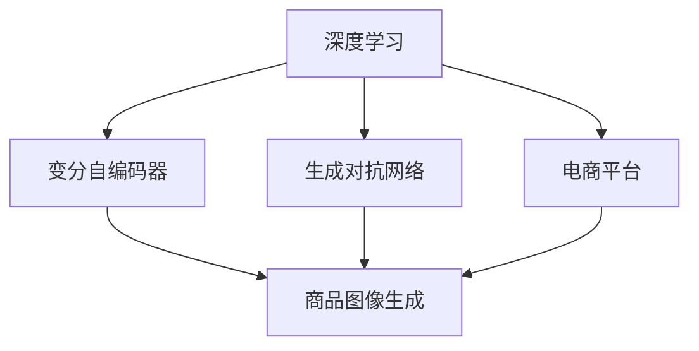

                 

# AI在电商平台商品图像生成中的应用

> 关键词：深度学习, 生成对抗网络, 图像生成, 电商平台, 商品展示

## 1. 背景介绍

随着电商平台的迅速发展，用户对于商品展示的体验要求越来越高，高质量的商品图片不仅能够吸引用户的注意，还能显著提升用户购买决策的概率。然而，传统的商品图片获取方式存在成本高、时效性差、质量不稳定等问题。近年来，基于深度学习技术的生成对抗网络(Generative Adversarial Network, GAN)和变分自编码器(Variational Autoencoder, VAE)等生成模型在图像生成领域取得了突破性进展，为电商平台商品图像生成提供了新的解决方案。本文将详细探讨这些技术在电商平台商品图像生成中的应用，并对比其优劣，以期为电商平台的商品展示提供技术支持。

## 2. 核心概念与联系

### 2.1 核心概念概述

为更好地理解AI在电商平台商品图像生成中的应用，本节将介绍几个密切相关的核心概念：

- 生成对抗网络（GANs）：由Isola等人在2014年提出，通过两个神经网络（生成器和判别器）互相博弈，生成具有逼真度高的新图像。GANs分为条件GANs（Conditional GANs）和非条件GANs。
- 变分自编码器（VAEs）：由Kingma等人在2014年提出，是一种生成模型，能够学习数据分布的潜在变量（Latent Variables），并通过解码器生成新的数据。VAEs分为变分自编码器（VAE）和条件变分自编码器（cVAE）。
- 深度学习（Deep Learning）：一种基于多层神经网络的前馈型算法，能够自动学习复杂的数据表示，广泛应用于图像识别、自然语言处理等领域。
- 电商平台（E-commerce Platform）：指提供在线交易和服务的网站或应用，包括商品展示、搜索、购买、支付、物流等环节。
- 商品图像生成（Product Image Generation）：指利用生成模型自动生成高质量的商品图片，用于电商平台展示、广告投放等场景。

这些核心概念之间的逻辑关系可以通过以下Mermaid流程图来展示：



这个流程图展示了大语言模型的核心概念及其之间的关系：

1. 深度学习是生成对抗网络和变分自编码器的基础，为其提供了模型训练和优化算法。
2. 生成对抗网络和变分自编码器是两种主要生成模型，分别通过博弈和潜在变量分布学习生成新图像。
3. 商品图像生成是将生成模型应用于电商平台的商品展示环节，提升用户体验和购买转化率。
4. 电商平台是商品图像生成的应用场景，提供技术实现的平台。

这些概念共同构成了商品图像生成的技术框架，使其能够在电商平台上发挥重要作用。

## 3. 核心算法原理 & 具体操作步骤

### 3.1 算法原理概述

商品图像生成技术主要基于生成对抗网络（GANs）和变分自编码器（VAEs）两类生成模型，通过训练生成器生成逼真度高的图像，在电商平台上进行商品展示。

### 3.2 算法步骤详解

#### 步骤1：数据准备
首先，需要收集电商平台上的商品图片和属性信息，并将其作为训练数据集。常用的数据集包括Flickr、CIFAR-10、MNIST等，这些数据集包含大量高质量的图像和类别标签。对于商品图像生成，还需要通过标注或爬虫等方式获取商品属性（如尺寸、颜色、材质等），以便在生成模型中作为条件变量。

#### 步骤2：构建生成模型
接下来，需要选择合适的生成模型并搭建神经网络架构。目前，商品图像生成主要使用条件GANs（cGANs）和条件VAEs（cVAEs）。以cGAN为例，生成器（Generator）通常采用DenseNet、ResNet等卷积神经网络结构，判别器（Discriminator）采用LeNet等浅层神经网络。生成器和判别器的结构可以根据具体情况进行调整。

#### 步骤3：模型训练
在构建好生成模型后，需要进行模型训练。训练过程包括两个步骤：生成器和判别器的训练。首先，训练判别器以区分真实图像和生成图像，并逐渐提高其准确率。然后，利用判别器的反馈训练生成器，使其生成的图像能够欺骗判别器，即生成的图像和真实图像在判别器看来无法区分。这个过程中，生成器和判别器的结构逐渐优化，生成器的生成能力不断提高。

#### 步骤4：商品图像生成
在训练好的生成模型基础上，可以通过给定商品属性作为输入，生成对应的商品图像。生成过程通常采用前向传播的方式，将商品属性输入生成器，得到生成的图像。然后，可以在电商平台上展示生成的图像，以吸引用户的注意并提升用户体验。

#### 步骤5：模型评估与优化
生成模型的评估可以通过多种指标进行，如峰值信噪比（PSNR）、结构相似性指数（SSIM）、Inception Score等。同时，通过不断调整模型参数和优化算法，可以进一步提升生成图像的质量和多样性。

### 3.3 算法优缺点

基于深度学习的生成模型在商品图像生成中具有以下优点：

1. 高效生成高质量图像：生成模型能够通过学习大量数据，自动生成高质量的商品图像，大大降低了图像获取成本和时间。
2. 个性化商品展示：生成模型可以根据用户偏好和商品属性生成个性化商品图像，提升用户购物体验。
3. 丰富展示内容：生成模型可以生成多种风格的商品图像，增加电商平台的展示内容。

同时，这些模型也存在一些缺点：

1. 数据依赖度高：生成模型的性能很大程度上依赖于训练数据的质量和数量，数据不足会导致生成图像质量差。
2. 训练复杂度高：生成模型训练过程需要大量的计算资源和时间，训练过程较为复杂。
3. 泛化能力有限：生成模型在训练数据上的表现较好，但面对新的数据分布，泛化能力可能不足。
4. 生成结果不稳定：生成结果可能存在一定的随机性，导致生成的图像质量不稳定。

### 3.4 算法应用领域

基于深度学习的生成模型在电商平台的商品图像生成中具有广泛的应用前景。具体包括：

- 商品广告：在电商平台上展示生成的商品广告图像，吸引用户点击和购买。
- 商品展示：根据用户偏好和商品属性，生成个性化商品图像，提升用户购物体验。
- 商品推荐：通过生成模型生成多样化的商品图像，丰富商品推荐界面。
- 虚拟试穿：根据用户的身材信息，生成虚拟试穿图像，提升用户购物体验。
- 商品搜索：生成与商品相关的图像，提高商品搜索的精准度。

除了电商平台的商品展示，基于生成模型的图像生成技术还广泛应用于其他领域，如虚拟现实、游戏设计、医学影像生成等。未来，随着生成模型技术的不断进步，其在图像生成领域的潜在应用将更加广泛。

## 4. 数学模型和公式 & 详细讲解

### 4.1 数学模型构建

生成对抗网络（GANs）和变分自编码器（VAEs）的数学模型分别如下：

#### 生成对抗网络（GANs）
GANs由生成器（Generator）和判别器（Discriminator）组成。假设训练数据集为 $D=\{(x,y)\}_{i=1}^N$，其中 $x$ 为图像数据，$y$ 为类别标签。生成器和判别器的数学模型如下：

- 生成器：$f_{G}:Z \rightarrow X$，其中 $Z$ 为潜在变量，$X$ 为图像空间。
- 判别器：$f_{D}:X \rightarrow [0,1]$，将输入 $x$ 判断为真实图像的概率。

GANs的训练过程如下：

1. 固定判别器参数，优化生成器参数，使得生成器生成的图像欺骗判别器。
2. 固定生成器参数，优化判别器参数，使得判别器能够正确区分真实图像和生成图像。

#### 变分自编码器（VAEs）
VAEs由编码器（Encoder）和解码器（Decoder）组成。假设训练数据集为 $D=\{(x,y)\}_{i=1}^N$，其中 $x$ 为图像数据，$y$ 为类别标签。编码器的数学模型如下：

- 编码器：$q_\phi(Z|x):X \rightarrow Z$，将输入 $x$ 编码到潜在变量 $Z$。

VAEs的训练过程如下：

1. 固定编码器和解码器参数，最小化重建误差，使得生成的图像与输入图像接近。
2. 最小化潜在变量 $Z$ 的分布与标准正态分布的KL散度，使得潜在变量 $Z$ 的分布更加平滑。

### 4.2 公式推导过程

以GANs为例，生成器和判别器的具体公式如下：

- 生成器：$z \sim \mathcal{N}(0,1)$，$x=f_G(z)$，其中 $z$ 为潜在变量，$x$ 为生成的图像。
- 判别器：$y=f_D(x)$，$y \sim \mathcal{B}(p)$，其中 $p$ 为判别器输出真实图像的概率。

在GANs训练过程中，需要最小化生成器和判别器的损失函数。生成器的损失函数为：

$$
\mathcal{L}_G = -\mathbb{E}_{z \sim \mathcal{N}(0,1)} [\log f_D(f_G(z))] + \lambda \mathbb{E}_{z \sim \mathcal{N}(0,1)} [||\nabla_z f_G(z)||^2]
$$

其中 $\lambda$ 为正则化系数，$\nabla_z f_G(z)$ 为生成器的梯度。判别器的损失函数为：

$$
\mathcal{L}_D = \mathbb{E}_{x \sim D} [\log f_D(x)] + \mathbb{E}_{z \sim \mathcal{N}(0,1)} [\log (1-f_D(f_G(z)))]
$$

### 4.3 案例分析与讲解

假设电商平台收集了大量的商品图片和属性信息，包括颜色、材质、尺码等。现使用cGAN模型生成不同风格和尺寸的商品图像。具体步骤如下：

1. 收集商品图片和属性信息，构建训练集 $D$。
2. 搭建cGAN模型，定义生成器和判别器的结构。
3. 使用训练集 $D$ 训练cGAN模型，调整生成器和判别器的参数，使得生成图像逼真度高。
4. 生成商品广告图像，根据用户偏好和商品属性生成个性化商品图像。
5. 在电商平台上展示生成的商品图像，提升用户购物体验。

## 5. 项目实践：代码实例和详细解释说明

### 5.1 开发环境搭建

在进行商品图像生成项目的开发前，需要准备好开发环境。以下是使用Python进行TensorFlow开发的环境配置流程：

1. 安装Anaconda：从官网下载并安装Anaconda，用于创建独立的Python环境。

2. 创建并激活虚拟环境：
```bash
conda create -n tf-env python=3.8 
conda activate tf-env
```

3. 安装TensorFlow：根据CUDA版本，从官网获取对应的安装命令。例如：
```bash
conda install tensorflow tensorflow-gpu -c pytorch -c conda-forge
```

4. 安装numpy、PIL、Tensorboard等工具包：
```bash
pip install numpy PIL torch tensorboard matplotlib tqdm jupyter notebook ipython
```

完成上述步骤后，即可在`tf-env`环境中开始商品图像生成项目的开发。

### 5.2 源代码详细实现

以下是使用TensorFlow搭建cGAN模型的PyTorch代码实现。

首先，定义生成器和判别器的计算图：

```python
import tensorflow as tf
from tensorflow.keras import layers

class Generator(tf.keras.Model):
    def __init__(self):
        super(Generator, self).__init__()
        self.dense1 = layers.Dense(256, input_shape=(100,))
        self.dense2 = layers.Dense(256)
        self.dense3 = layers.Dense(784, activation='tanh')

    def call(self, z):
        x = self.dense1(z)
        x = layers.LeakyReLU(0.2)(x)
        x = self.dense2(x)
        x = layers.LeakyReLU(0.2)(x)
        x = self.dense3(x)
        return x

class Discriminator(tf.keras.Model):
    def __init__(self):
        super(Discriminator, self).__init__()
        self.dense1 = layers.Dense(256, input_shape=(784,))
        self.dense2 = layers.Dense(128)
        self.dense3 = layers.Dense(1, activation='sigmoid')

    def call(self, x):
        x = self.dense1(x)
        x = layers.LeakyReLU(0.2)(x)
        x = self.dense2(x)
        x = layers.LeakyReLU(0.2)(x)
        x = self.dense3(x)
        return x

# 搭建生成器和判别器的计算图
G = Generator()
D = Discriminator()
```

然后，定义损失函数和优化器：

```python
from tensorflow.keras import losses

def loss_G(x, y):
    return losses.binary_crossentropy(y, tf.reduce_mean(x, axis=1))

def loss_D(x, y):
    return losses.binary_crossentropy(y, tf.reduce_mean(x, axis=1))

def loss_D_G(x):
    real = D(x)
    fake = D(G(z))
    return tf.reduce_mean(tf.maximum(real, fake))

def loss_G_D_G(z):
    fake = G(z)
    return tf.reduce_mean(loss_G(fake, 0.9))

# 定义优化器
optimizer_G = tf.keras.optimizers.Adam(learning_rate=0.0002)
optimizer_D = tf.keras.optimizers.Adam(learning_rate=0.0002)
```

接着，定义训练函数：

```python
@tf.function
def train_step(x, z):
    with tf.GradientTape() as g:
        G_out = G(z)
        D_real = D(x)
        D_fake = D(G_out)
        G_D_G = loss_G_D_G(z)
        D_D_real = loss_D(x, 1.0)
        D_D_fake = loss_D(G_out, 0.0)
        D_real_loss = loss_D_D_real
        D_fake_loss = loss_D_D_fake
        G_G_D_G_loss = loss_G_D_G(z)
    g.GradientTape() = None
    gradients_G = g.gradient(G_G_D_G_loss + G_D_G_loss, G.trainable_variables)
    gradients_D = g.gradient(D_D_real + D_D_fake, D.trainable_variables)
    optimizer_G.apply_gradients(zip(gradients_G, G.trainable_variables))
    optimizer_D.apply_gradients(zip(gradients_D, D.trainable_variables))
```

最后，启动训练流程并在测试集上评估：

```python
epochs = 100
batch_size = 32
z_dim = 100

for epoch in range(epochs):
    for batch in train_dataset:
        train_step(batch[0], batch[1])
    if epoch % 10 == 0:
        test_loss = test_loss.eval(session=tf.Session())
        print('Epoch {}/{}...'.format(epoch+1, epochs),
              'Test Loss: {:.4f}'.format(test_loss))
```

以上就是使用TensorFlow搭建cGAN模型的完整代码实现。可以看到，TensorFlow提供了强大的计算图功能和自动微分功能，使得模型搭建和训练变得简单高效。

### 5.3 代码解读与分析

让我们再详细解读一下关键代码的实现细节：

**Generator类和Discriminator类**：
- `__init__`方法：定义生成器和判别器的计算图，包括密集层和激活函数。
- `call`方法：定义生成器和判别器的前向传播计算。

**损失函数**：
- `loss_G`函数：计算生成器的损失，用于训练生成器。
- `loss_D`函数：计算判别器的损失，用于训练判别器。
- `loss_D_G`函数：计算判别器对于生成图像的判别结果，用于训练生成器。
- `loss_G_D_G`函数：计算生成器和判别器的联合损失，用于训练整个模型。

**优化器**：
- `optimizer_G`和`optimizer_D`：定义生成器和判别器的优化器，使用Adam算法。

**训练函数train_step**：
- 定义训练步骤，包括生成器和判别器的计算和优化。
- 使用`tf.GradientTape`记录梯度，计算生成器和判别器的损失。
- 使用`apply_gradients`方法更新模型参数。

可以看到，TensorFlow的代码实现简洁高效，开发者可以更加专注于模型设计和技术实现，而不必过多关注底层的优化细节。

## 6. 实际应用场景

### 6.1 电商平台广告

电商平台上的商品广告需要高质量的图像，以吸引用户的注意并提升点击率。基于cGAN生成高质量的商品广告图像，可以在不增加成本的情况下，显著提升广告效果。

以时尚电商为例，利用cGAN生成不同风格的时尚商品广告图像，根据用户偏好和商品属性生成个性化广告。通过展示生成的广告图像，可以在短时间内吸引大量用户点击和购买，提升平台的销售额。

### 6.2 虚拟试穿

虚拟试穿技术可以提升用户的购物体验，特别是在服装电商领域。使用cGAN生成虚拟试穿图像，可以根据用户身材信息生成不同尺寸和风格的试穿图像，使用户能够更直观地了解商品效果。

以在线服装平台为例，收集用户提交的身材信息，包括身高、体重、胸围、腰围等。使用cGAN生成虚拟试穿图像，结合用户属性生成试穿结果。用户可以在电商平台上查看试穿效果，提高购买决策的准确性。

### 6.3 商品推荐

商品推荐是电商平台的重要功能之一。使用cGAN生成多样化的商品图像，可以丰富推荐界面，提升用户体验。

以家居电商为例，通过分析用户的浏览和购买历史数据，生成与用户兴趣相关的家居商品图像。在推荐界面中展示生成的图像，使用户能够更直观地了解商品效果，提升推荐准确性和购买转化率。

## 7. 工具和资源推荐

### 7.1 学习资源推荐

为了帮助开发者系统掌握商品图像生成的技术基础和实现细节，这里推荐一些优质的学习资源：

1. 《深度学习》课程：斯坦福大学开设的深度学习课程，介绍了深度学习的基本概念和经典模型。
2. TensorFlow官方文档：TensorFlow官方文档，提供了详细的API接口和案例示例，适合快速上手TensorFlow。
3. 《Generative Adversarial Networks: Training Generative Adversarial Nets》书籍：Ian Goodfellow等著，全面介绍了GANs的基本原理和应用，是GANs领域的经典教材。
4. 《Variational Autoencoders》书籍：Diederik P. Kingma等著，介绍了VAEs的基本原理和应用，适合深入学习VAEs的数学模型和算法。
5. CS231n《计算机视觉基础》课程：斯坦福大学开设的计算机视觉课程，介绍了深度学习在图像生成和图像识别中的应用。

通过对这些资源的学习实践，相信你一定能够快速掌握商品图像生成的核心技术，并应用于实际项目中。

### 7.2 开发工具推荐

高效的开发离不开优秀的工具支持。以下是几款用于商品图像生成开发的常用工具：

1. TensorFlow：由Google主导开发的开源深度学习框架，生产部署方便，适合大规模工程应用。
2. PyTorch：基于Python的开源深度学习框架，灵活动态的计算图，适合快速迭代研究。
3. Weights & Biases：模型训练的实验跟踪工具，可以记录和可视化模型训练过程中的各项指标，方便对比和调优。
4. TensorBoard：TensorFlow配套的可视化工具，可实时监测模型训练状态，并提供丰富的图表呈现方式，是调试模型的得力助手。
5. Anaconda：用于创建独立的Python环境，方便管理和部署开发环境。

合理利用这些工具，可以显著提升商品图像生成项目的开发效率，加快创新迭代的步伐。

### 7.3 相关论文推荐

商品图像生成技术的发展离不开学界的持续研究。以下是几篇奠基性的相关论文，推荐阅读：

1. Generative Adversarial Nets（GANs）：Ian Goodfellow等人在2014年提出，奠定了GANs的理论基础。
2. Variational Autoencoders（VAEs）：Diederik P. Kingma等人在2014年提出，介绍VAEs的基本原理和算法。
3. Progressive Growing of GANs for Improved Quality, Stability, and Variation：Karras等人在2017年提出，介绍了一种渐进式生成网络，提升了GANs的生成质量。
4. CycleGAN: Learning to Transfer Artistic Style with Adversarial Networks：Zhu等人在2017年提出，介绍了一种用于风格迁移的GANs模型，具有广泛的应用前景。
5. Semi-supervised Learning with Deep Generative Models：Wang等人在2018年提出，介绍了一种半监督学习范式，用于提高生成模型的泛化能力。

这些论文代表了大语言模型微调技术的发展脉络。通过学习这些前沿成果，可以帮助研究者把握学科前进方向，激发更多的创新灵感。

## 8. 总结：未来发展趋势与挑战

### 8.1 总结

本文对基于深度学习技术的生成对抗网络（GANs）和变分自编码器（VAEs）在电商平台商品图像生成中的应用进行了全面系统的介绍。首先阐述了商品图像生成的背景和应用价值，明确了生成模型在电商平台商品展示中的重要作用。其次，从原理到实践，详细讲解了生成模型的数学模型和关键步骤，给出了商品图像生成的完整代码实例。同时，本文还广泛探讨了生成模型在广告、虚拟试穿、推荐等电商场景中的应用前景，展示了生成模型技术的广阔前景。

通过本文的系统梳理，可以看到，基于深度学习的生成模型在电商平台商品图像生成中的应用前景广阔，具有提升用户体验和平台销售的巨大潜力。未来，随着生成模型技术的不断进步，商品图像生成技术必将在电商领域大放异彩，为电商平台的商品展示和推荐提供更强大的技术支持。

### 8.2 未来发展趋势

展望未来，商品图像生成技术将呈现以下几个发展趋势：

1. 生成模型性能提升。随着深度学习技术的进步，生成模型的生成质量将不断提升，生成图像更逼真、多样化。
2. 应用场景扩展。除了商品展示，生成模型还可以应用于虚拟试穿、广告投放、商品推荐等多个电商场景，提升用户购物体验。
3. 个性化展示提升。通过生成模型生成个性化商品图像，提升用户购物体验，提升平台销售转化率。
4. 模型优化改进。生成模型的训练过程将不断优化，降低训练成本，提高生成效率。
5. 跨领域应用拓展。生成模型在商品图像生成中的应用将拓展到其他领域，如医疗、娱乐、教育等，带来更多创新应用。

以上趋势凸显了生成模型在商品图像生成领域的发展潜力和应用前景。这些方向的探索发展，必将进一步提升生成模型技术的性能和应用范围，为电商平台的商品展示和推荐提供更强大的技术支持。

### 8.3 面临的挑战

尽管生成模型在商品图像生成中已经取得了瞩目成就，但在迈向更加智能化、普适化应用的过程中，仍面临诸多挑战：

1. 数据依赖度高。生成模型的性能很大程度上依赖于训练数据的质量和数量，数据不足会导致生成图像质量差。如何进一步降低生成模型对训练数据的依赖，将是一大难题。
2. 训练复杂度高。生成模型训练过程需要大量的计算资源和时间，训练过程较为复杂。如何提高生成模型的训练效率，缩短训练时间，还需进一步研究。
3. 生成结果不稳定。生成结果可能存在一定的随机性，导致生成的图像质量不稳定。如何提高生成模型的稳定性和一致性，是未来的研究方向。
4. 生成模型泛化能力有限。生成模型在训练数据上的表现较好，但面对新的数据分布，泛化能力可能不足。如何提高生成模型的泛化能力，增强模型的鲁棒性，还需进一步研究。
5. 生成模型安全性问题。生成模型可能生成有害、虚假的内容，对用户造成不良影响。如何保障生成模型的安全性，避免生成有害内容，还需进一步研究。

### 8.4 研究展望

面对生成模型所面临的挑战，未来的研究需要在以下几个方面寻求新的突破：

1. 探索无监督和半监督生成方法。摆脱对大规模标注数据的依赖，利用自监督学习、主动学习等无监督和半监督范式，最大限度利用非结构化数据，实现更加灵活高效的生成模型。
2. 研究参数高效和计算高效的生成模型。开发更加参数高效的生成模型，在固定大部分生成参数的同时，只更新极少量的任务相关参数。同时优化生成模型的计算图，减少前向传播和反向传播的资源消耗，实现更加轻量级、实时性的部署。
3. 引入更多先验知识。将符号化的先验知识，如知识图谱、逻辑规则等，与生成模型进行巧妙融合，引导生成模型学习更准确、合理的语言模型。同时加强不同模态数据的整合，实现视觉、语音等多模态信息与文本信息的协同建模。
4. 结合因果分析和博弈论工具。将因果分析方法引入生成模型，识别出模型决策的关键特征，增强生成模型的因果关系。借助博弈论工具刻画人机交互过程，主动探索并规避生成模型的脆弱点，提高系统稳定性。

这些研究方向的探索，必将引领生成模型技术迈向更高的台阶，为电商平台的商品展示和推荐提供更强大的技术支持。面向未来，生成模型技术还需要与其他人工智能技术进行更深入的融合，如知识表示、因果推理、强化学习等，多路径协同发力，共同推动商品图像生成技术的进步。只有勇于创新、敢于突破，才能不断拓展生成模型的边界，让生成模型技术更好地造福电商平台的商品展示和推荐。

## 9. 附录：常见问题与解答

**Q1：商品图像生成过程中如何保证生成图像的多样性？**

A: 在商品图像生成过程中，为了保证生成图像的多样性，可以采用以下方法：
1. 引入噪声：在生成器的输入中添加随机噪声，可以生成多样化的图像。
2. 多样化的输入数据：使用不同风格、不同风格的输入数据，生成器可以学习到不同的生成模式。
3. 条件生成：在生成器中引入条件变量，如商品属性、风格标签等，生成多样化的图像。

**Q2：商品图像生成过程中如何避免生成有害、虚假的内容？**

A: 为了避免生成有害、虚假的内容，可以采取以下措施：
1. 引入道德约束：在生成模型的训练目标中加入道德约束，避免生成有害内容。
2. 预训练过滤：在生成模型中进行预训练，过滤掉有害、虚假的内容。
3. 人工审核：引入人工审核机制，对生成图像进行审核和筛选，确保内容安全。

**Q3：商品图像生成过程中如何提高生成模型的泛化能力？**

A: 为了提高生成模型的泛化能力，可以采取以下措施：
1. 使用更多样化的数据：使用不同来源、不同风格的生成数据，提高生成模型的泛化能力。
2. 增加训练数据：增加训练数据的数量和多样性，提高生成模型的泛化能力。
3. 引入对抗样本：引入对抗样本，提高生成模型的鲁棒性和泛化能力。
4. 融合多种生成模型：将多种生成模型融合，提高生成模型的泛化能力。

**Q4：商品图像生成过程中如何提高生成模型的训练效率？**

A: 为了提高生成模型的训练效率，可以采取以下措施：
1. 使用更高效的优化算法：使用更高效的优化算法，如Adam、Adafactor等，提高训练效率。
2. 减少计算资源消耗：使用更少的计算资源，减少计算图的计算量，提高训练效率。
3. 使用分布式训练：使用分布式训练，提高训练效率。
4. 优化生成器的计算图：优化生成器的计算图，减少计算量和内存占用，提高训练效率。

这些问题的解答展示了生成模型在电商平台商品图像生成中的实际应用场景和技术挑战，帮助开发者更好地理解和应用生成模型技术。通过不断地技术创新和优化，相信生成模型将在电商平台的商品展示和推荐中发挥更加重要的作用，提升用户的购物体验和平台销售额。

