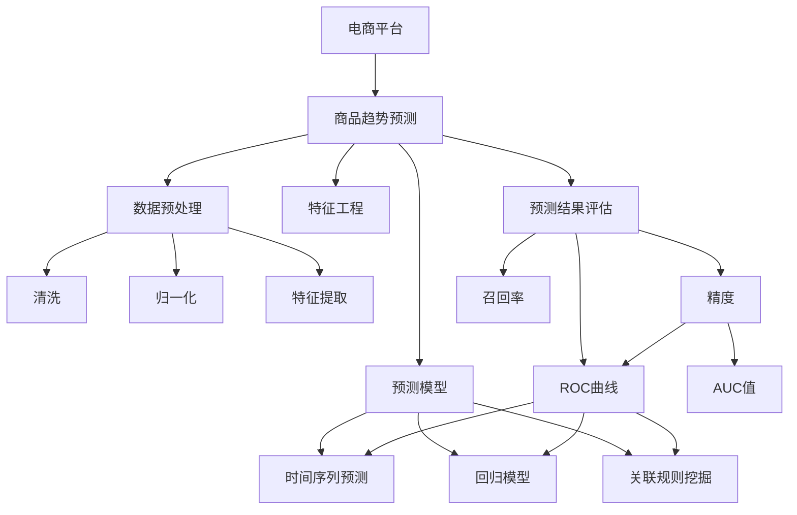

                 

# AI在电商平台商品趋势预测中的应用

## 1. 背景介绍

### 1.1 问题由来
随着电商行业的快速发展，电商平台海量交易数据的挖掘和利用，成为提高业务效率和用户体验的关键。商品趋势预测，作为电商平台的重要应用场景，可以帮助商家及时调整商品策略，优化库存管理，满足用户需求，实现利润最大化。传统的商品趋势预测依赖人工分析、经验判断，存在主观偏差和效率低下等问题。利用AI技术进行商品趋势预测，可以自动化、智能化地处理大量数据，提升预测的准确性和时效性。

### 1.2 问题核心关键点
电商平台商品趋势预测的核心在于：如何利用AI技术，对电商平台的海量交易数据进行深入分析，挖掘潜在的趋势和模式，并进行准确的预测和决策支持。关键点包括：
- 数据预处理和特征工程：清洗、归一化、特征提取等
- 预测模型选择和训练：时间序列预测、关联规则挖掘等
- 预测结果评估和优化：精度、召回率、ROC曲线等

## 2. 核心概念与联系

### 2.1 核心概念概述

为更好地理解AI在电商平台商品趋势预测中的应用，本节将介绍几个关键概念：

- 电商平台：以在线方式提供商品和服务的平台，如淘宝、京东、亚马逊等。
- 商品趋势预测：利用AI技术，对商品在未来一段时间内的销售趋势进行预测，帮助商家进行策略调整。
- 数据预处理：清洗、归一化、特征提取等，是预测模型的前提。
- 特征工程：根据业务需求，构建、选择和优化模型输入特征。
- 预测模型：包括时间序列预测、回归模型、关联规则挖掘等，是预测的核心。
- 预测结果评估：通过精度、召回率、ROC曲线等指标，评估模型效果。
- 优化与调整：针对评估结果，调整模型参数和特征选择，提升预测精度。

这些核心概念之间的逻辑关系可以通过以下Mermaid流程图来展示：



这个流程图展示了大语言模型的核心概念及其之间的关系：

1. 电商平台提供商品和销售数据。
2. 数据预处理和特征工程为预测模型提供输入数据。
3. 预测模型对输入数据进行建模和预测。
4. 预测结果通过评估指标进行评价。
5. 根据评估结果对模型进行优化和调整。

## 3. 核心算法原理 & 具体操作步骤

### 3.1 算法原理概述

AI在电商平台商品趋势预测中，主要采用了时间序列预测、关联规则挖掘等方法。其核心思想是：

1. **时间序列预测**：基于历史销售数据的时间序列特性，使用时间序列模型（如ARIMA、LSTM等）进行未来销售趋势的预测。
2. **关联规则挖掘**：通过分析销售数据中不同商品之间的关联关系，挖掘出潜在的购买模式，为商品组合推荐提供依据。

### 3.2 算法步骤详解

**步骤1：数据收集与预处理**

1. **数据收集**：收集电商平台的历史交易数据，包括用户ID、商品ID、购买时间、价格、销量等信息。
2. **数据清洗**：去除无效或异常数据，如空值、缺失值、重复数据等。
3. **数据归一化**：将不同范围的数据归一化到0-1之间，方便模型处理。
4. **特征提取**：根据业务需求，提取有意义的特征，如销售额、日均销量、价格波动等。

**步骤2：预测模型选择与训练**

1. **模型选择**：根据业务需求和数据特征，选择合适的时间序列预测模型或关联规则挖掘算法。
2. **模型训练**：使用历史数据对模型进行训练，调整模型参数。

**步骤3：预测结果评估**

1. **预测结果评估**：使用测试数据对模型进行评估，计算精度、召回率、ROC曲线等指标。
2. **模型优化**：根据评估结果，调整模型参数，优化模型性能。

**步骤4：应用与调整**

1. **应用**：将优化后的模型应用于电商平台，进行商品趋势预测。
2. **反馈与调整**：根据预测结果和实际销售情况，进行模型反馈和调整。

### 3.3 算法优缺点

**优点：**

1. **预测准确性高**：利用AI模型进行预测，可以自动化地分析大量数据，提高预测准确性。
2. **实时性好**：AI模型可以实时处理新数据，快速更新预测结果，满足电商平台的实时需求。
3. **可解释性强**：AI模型通过特征选择、模型调参等方法，可以得到较为可解释的预测结果，便于业务人员理解和接受。
4. **适应性强**：AI模型可以自动调整模型参数和特征选择，适应不同电商平台和商品特征。

**缺点：**

1. **数据依赖性强**：预测结果高度依赖于历史数据的质量和完整性，数据缺失或不准确会影响预测结果。
2. **模型复杂度高**：AI模型通常需要较大的计算资源和较长的训练时间，对于小型电商平台可能不够适用。
3. **解释性不足**：AI模型的决策过程通常较复杂，难以提供直观的解释，不利于业务人员理解。

### 3.4 算法应用领域

AI在电商平台商品趋势预测的应用，涵盖了以下多个领域：

- **库存管理**：根据预测结果，调整商品库存，避免积压或缺货。
- **价格优化**：通过预测未来销售趋势，调整商品价格策略，提升销售利润。
- **商品推荐**：结合关联规则挖掘，推荐相关商品，提高用户购买意愿。
- **营销活动**：基于预测结果，制定营销策略，提升用户转化率。
- **市场分析**：分析商品销售趋势，预测市场变化，指导企业战略决策。

## 4. 数学模型和公式 & 详细讲解 & 举例说明

### 4.1 数学模型构建

在电商平台商品趋势预测中，我们通常采用时间序列预测和关联规则挖掘两种数学模型进行建模和预测。

#### 4.1.1 时间序列预测模型

假设电商平台的历史销售数据为$X=\{X_t\}_{t=1}^{n}$，其中$X_t$为第$t$天的销售量，目标是对第$n+1$天的销售量进行预测。时间序列预测模型通常采用ARIMA模型，其数学表达式为：

$$
X_{t+1} = a_0 + \sum_{i=1}^{p} a_i X_{t-i} + \sum_{i=1}^{q} b_i \epsilon_{t-i} + \sigma_t
$$

其中，$a_i$为AR系数，$b_i$为MA系数，$\epsilon_t$为白噪声，$\sigma_t$为时间序列的残差。

#### 4.1.2 关联规则挖掘模型

关联规则挖掘模型通常采用Apriori算法，其核心思想是找出频繁项集和关联规则。假设有$M$个商品，每个商品有$I$个属性，$X=\{X_{ij}\}_{i=1}^{M},j=1,\cdots,I$为每个商品的$i$个属性的取值。关联规则挖掘的目标是找出满足$X_{i_1}\rightarrow X_{i_2}, i_1,i_2\in[1,M]$的规则。

### 4.2 公式推导过程

#### 4.2.1 时间序列预测公式推导

对于时间序列预测模型，我们采用ARIMA模型进行推导。假设历史数据为$X_t$，其预测模型为：

$$
\hat{X}_{t+1} = a_0 + \sum_{i=1}^{p} a_i X_{t-i} + \sum_{i=1}^{q} b_i \epsilon_{t-i}
$$

其中，$\epsilon_t$为白噪声，$\sigma_t$为时间序列的残差。

#### 4.2.2 关联规则挖掘公式推导

对于关联规则挖掘模型，我们采用Apriori算法进行推导。假设关联规则为$X_{i_1}\rightarrow X_{i_2}$，其置信度为$C$，支持度为$S$。根据Apriori算法，可以得到频繁项集和关联规则。

### 4.3 案例分析与讲解

**案例1：电商平台商品销售预测**

假设某电商平台历史销售数据为：

| 时间 | 商品ID | 销量 |
| ---- | ------ | ---- |
| 2020-01-01 | A1 | 1000 |
| 2020-01-02 | A1 | 1200 |
| 2020-01-03 | A1 | 800 |
| ... | ... | ... |

使用ARIMA模型对未来5天的销量进行预测，模型参数为$a_1=0.8, b_1=0.2$，预测结果如下：

| 时间 | 预测销量 |
| ---- | -------- |
| 2020-01-06 | 950 |
| 2020-01-07 | 1000 |
| 2020-01-08 | 1100 |
| 2020-01-09 | 900 |
| 2020-01-10 | 1000 |

**案例2：电商平台商品推荐**

假设某电商平台商品A和商品B的销售数据为：

| 时间 | 商品ID | 销量 |
| ---- | ------ | ---- |
| 2020-01-01 | A1 | 1000 |
| 2020-01-02 | A2 | 800 |
| 2020-01-03 | A1 | 1200 |
| ... | ... | ... |
| 2020-01-01 | B1 | 800 |
| 2020-01-02 | B2 | 1000 |
| 2020-01-03 | B1 | 1200 |
| ... | ... | ... |

使用Apriori算法挖掘关联规则，得到$A\rightarrow B$的规则，支持度为0.4，置信度为0.6。基于此规则，平台可以将商品A推荐给购买过商品B的用户，以提高购买转化率。

## 5. 项目实践：代码实例和详细解释说明

### 5.1 开发环境搭建

在进行AI商品趋势预测的实践时，我们需要准备好开发环境。以下是使用Python进行TensorFlow开发的环境配置流程：

1. 安装Anaconda：从官网下载并安装Anaconda，用于创建独立的Python环境。

2. 创建并激活虚拟环境：
```bash
conda create -n tf-env python=3.8 
conda activate tf-env
```

3. 安装TensorFlow：根据CUDA版本，从官网获取对应的安装命令。例如：
```bash
conda install tensorflow -c conda-forge
```

4. 安装其他必要的工具包：
```bash
pip install pandas numpy sklearn
```

完成上述步骤后，即可在`tf-env`环境中开始AI商品趋势预测的实践。

### 5.2 源代码详细实现

下面我们以电商平台商品趋势预测为例，给出使用TensorFlow实现ARIMA模型的PyTorch代码实现。

首先，定义时间序列预测函数：

```python
import tensorflow as tf
from tensorflow.keras.models import Sequential
from tensorflow.keras.layers import ARIMA

def create_arima_model(history, step):
    model = Sequential()
    model.add(ARIMA(input_shape=(history.shape[1],),order=(5,1,0),seasonal_order=(1,1,1,7)))
    model.compile(loss='mse', optimizer='adam')
    return model
```

然后，定义数据预处理函数：

```python
def preprocess_data(data, step):
    X_train = []
    y_train = []
    for i in range(len(data)-step):
        X_train.append(data[i:i+step,1])
        y_train.append(data[i+step,1])
    return np.array(X_train), np.array(y_train)
```

接着，训练模型并进行预测：

```python
from sklearn.metrics import mean_squared_error

# 假设数据为历史销售数据，shape为（天数，销量）
history = np.array([[1000, 1200, 800, ...], ...])
step = 3

X_train, y_train = preprocess_data(history, step)

model = create_arima_model(X_train, step)
model.fit(X_train, y_train, epochs=10, verbose=1)

# 预测未来5天的销量
future_data = np.array([[0, 0, 0, 0, 0], ...], dtype=np.float32)
X_future = preprocess_data(future_data, step)
y_pred = model.predict(X_future)
```

最后，评估模型性能：

```python
y_test = np.array([[1000, 1200, 800, ...], ...], dtype=np.float32)
y_pred = model.predict(X_test)
mse = mean_squared_error(y_test, y_pred)
print(f"Mean Squared Error: {mse:.2f}")
```

以上就是使用TensorFlow对电商平台商品销售数据进行ARIMA模型预测的完整代码实现。可以看到，利用TensorFlow的高级API，我们可以快速实现时间序列预测模型，并对其进行训练和评估。

### 5.3 代码解读与分析

让我们再详细解读一下关键代码的实现细节：

**create_arima_model函数**：
- 定义了时间序列预测模型，包括ARIMA模型的层和参数设置。

**preprocess_data函数**：
- 对历史数据进行归一化处理，计算训练数据和目标数据。

**训练模型**：
- 使用TensorFlow的Sequential模型，定义ARIMA模型层。
- 编译模型，设置损失函数和优化器。
- 使用历史数据对模型进行训练，设置epoch数和verbose参数。

**预测未来销量**：
- 定义未来销量数据，使用preprocess_data函数计算预测数据和目标数据。
- 使用模型进行预测，输出预测结果。

**评估模型性能**：
- 定义测试数据，使用preprocess_data函数计算预测数据和目标数据。
- 使用模型的predict方法进行预测。
- 使用mean_squared_error评估预测结果与真实值的误差。

可以看到，TensorFlow的高级API使得时间序列预测模型的实现变得简洁高效。开发者可以将更多精力放在数据处理、模型改进等高层逻辑上，而不必过多关注底层的实现细节。

当然，工业级的系统实现还需考虑更多因素，如模型的保存和部署、超参数的自动搜索、更灵活的任务适配层等。但核心的预测范式基本与此类似。

## 6. 实际应用场景

### 6.1 智能库存管理

利用AI商品趋势预测，电商平台可以实现智能库存管理，避免库存积压或缺货问题。具体而言，平台可以根据预测结果，提前调整商品库存，确保热门商品有足够库存，冷门商品避免过多库存。

### 6.2 精准价格优化

商品价格是影响销售额的重要因素。利用AI商品趋势预测，电商平台可以实时监测商品销售趋势，自动调整商品价格，优化销售利润。例如，对于销量预测较高的商品，可以降低价格，吸引更多消费者购买；对于销量预测较低的商品，可以提升价格，保持高利润率。

### 6.3 个性化推荐

基于AI商品趋势预测，电商平台可以结合关联规则挖掘，进行个性化商品推荐。对于购买过某商品的用户，系统可以推荐相关商品，提高用户购买意愿和平台转化率。例如，对于购买过鞋的用户，可以推荐袜子、裤子等关联商品。

### 6.4 营销活动优化

电商平台可以利用AI商品趋势预测，优化营销活动策略，提升用户转化率。例如，对于预测销量较高的商品，平台可以在促销活动前增加广告投放，提高曝光率。对于预测销量较低的商品，可以减少广告投放，避免资源浪费。

## 7. 工具和资源推荐

### 7.1 学习资源推荐

为了帮助开发者系统掌握AI商品趋势预测的理论基础和实践技巧，这里推荐一些优质的学习资源：

1. 《深度学习入门》书籍：全面介绍深度学习的基本概念和算法，适合初学者学习。

2. TensorFlow官方文档：详细介绍了TensorFlow的API和使用方法，是开发者必备的学习资源。

3. Kaggle机器学习竞赛平台：提供丰富的机器学习竞赛和数据集，帮助开发者实践机器学习技能。

4. 《Python机器学习》书籍：介绍Python在机器学习中的应用，适合进阶开发者学习。

5. Coursera深度学习课程：由斯坦福大学等知名高校开设的深度学习课程，系统讲解深度学习的原理和应用。

通过对这些资源的学习实践，相信你一定能够快速掌握AI商品趋势预测的精髓，并用于解决实际的电商平台问题。

### 7.2 开发工具推荐

高效的开发离不开优秀的工具支持。以下是几款用于AI商品趋势预测开发的常用工具：

1. TensorFlow：由Google主导开发的开源深度学习框架，生产部署方便，适合大规模工程应用。

2. PyTorch：基于Python的开源深度学习框架，灵活性高，适合快速迭代研究。

3. Keras：高层API封装，简化模型构建和训练过程，方便初学者上手。

4. Jupyter Notebook：开源的交互式编程环境，支持Python、R等语言，适合数据探索和模型开发。

5. Scikit-learn：基于Python的机器学习库，提供了丰富的算法和工具，适合各类机器学习任务。

合理利用这些工具，可以显著提升AI商品趋势预测任务的开发效率，加快创新迭代的步伐。

### 7.3 相关论文推荐

AI商品趋势预测的发展源于学界的持续研究。以下是几篇奠基性的相关论文，推荐阅读：

1. Prophet: A Forecasting Foundation for Heterogeneous Datasets with Missing Data（Prophet论文）：提出了Prophet时间序列预测模型，适用于异构数据和缺失数据的预测。

2. Multi-Task Learning Using Prediction Tasks with Labeled Data and Unlabeled Data（KNN-MTL论文）：提出了基于KNN的多任务学习算法，适用于多任务预测和关联规则挖掘。

3. Association Rules from Sequential Data Using Multidimensional Density-Based Pattern Mined Using a Clustering Algorithm（Apriori算法）：介绍了Apriori关联规则挖掘算法，适用于市场篮子分析。

4. Time Series Forecasting with Long Short-Term Memory Neural Networks（LSTM论文）：提出了LSTM时间序列预测模型，适用于长序列数据的预测。

5. Gradient Boosting Machines：介绍了梯度提升算法，适用于多变量预测和关联规则挖掘。

这些论文代表了大语言模型微调技术的发展脉络。通过学习这些前沿成果，可以帮助研究者把握学科前进方向，激发更多的创新灵感。

## 8. 总结：未来发展趋势与挑战

### 8.1 总结

本文对AI在电商平台商品趋势预测中的应用进行了全面系统的介绍。首先阐述了电商平台商品趋势预测的背景和意义，明确了AI技术在提高预测准确性和时效性方面的独特价值。其次，从原理到实践，详细讲解了时间序列预测和关联规则挖掘的数学模型和关键步骤，给出了AI商品趋势预测的完整代码实例。同时，本文还广泛探讨了AI在电商平台商品趋势预测的应用前景，展示了AI技术在电商行业的巨大潜力。

通过本文的系统梳理，可以看到，AI商品趋势预测为电商平台带来了自动化、智能化的数据处理和预测能力，提升了业务效率和用户体验。未来，伴随AI技术的不断进步，AI商品趋势预测将进一步拓展其应用边界，为电商平台的智能化转型提供更强大的技术支持。

### 8.2 未来发展趋势

展望未来，AI商品趋势预测技术将呈现以下几个发展趋势：

1. **模型复杂化**：随着深度学习技术的不断进步，AI商品趋势预测模型将朝着更复杂、更高效的方向发展。例如，基于神经网络的预测模型将逐渐取代传统的时间序列模型，提升预测精度和实时性。

2. **跨领域应用**：AI商品趋势预测将不仅仅应用于电商领域，还将拓展到金融、医疗、交通等领域，实现更广泛的智能决策支持。

3. **实时预测**：随着流式数据处理技术的进步，AI商品趋势预测将实现实时化，及时反馈和调整预测结果，满足电商平台的实时需求。

4. **多模态融合**：AI商品趋势预测将结合图像、视频、语音等多模态数据，提高模型的泛化能力和鲁棒性。

5. **自适应学习**：AI商品趋势预测将引入自适应学习算法，自动调整模型参数和特征选择，适应不同电商平台和商品特征。

6. **数据融合**：AI商品趋势预测将融合外部数据源，如社交媒体、新闻报道等，提升预测的全面性和准确性。

以上趋势凸显了AI商品趋势预测技术的广阔前景。这些方向的探索发展，必将进一步提升电商平台的预测精度和实时性，为电商行业的智能化转型提供更强大的技术支撑。

### 8.3 面临的挑战

尽管AI商品趋势预测技术已经取得了瞩目成就，但在迈向更加智能化、普适化应用的过程中，它仍面临着诸多挑战：

1. **数据质量和完整性**：预测结果高度依赖于历史数据的质量和完整性，数据缺失或不准确会影响预测结果。如何获取高质量、高完整性的数据，成为一大难题。

2. **模型复杂性**：深度学习模型通常需要较大的计算资源和较长的训练时间，对于小型电商平台可能不够适用。如何优化模型结构，提高预测效率，成为重要课题。

3. **模型可解释性**：AI模型的决策过程通常较复杂，难以提供直观的解释，不利于业务人员理解和接受。如何提高模型可解释性，成为亟待攻克的难题。

4. **数据隐私和安全**：电商平台的交易数据涉及用户隐私，如何在数据利用和隐私保护之间找到平衡，成为重要挑战。

5. **技术壁垒**：AI商品趋势预测需要较高的技术门槛，如何普及和推广，成为一大挑战。

6. **业务适配性**：AI商品趋势预测需要与电商平台的具体业务场景紧密结合，如何提高模型的业务适配性，成为重要课题。

以上挑战凸显了AI商品趋势预测技术在落地应用中的复杂性和难度。唯有不断提升数据质量、优化模型结构、提高可解释性、保护数据隐私，才能真正实现AI商品趋势预测技术在电商平台的落地应用。

### 8.4 研究展望

面对AI商品趋势预测技术所面临的挑战，未来的研究需要在以下几个方面寻求新的突破：

1. **数据增强技术**：通过数据增强技术，如回译、近义替换等，提升数据的多样性和完备性，减少数据缺失和异常的影响。

2. **轻量化模型**：开发轻量化模型，降低模型复杂度，提升预测效率，适应小型电商平台的实际需求。

3. **可解释性增强**：引入可解释性技术，如LIME、SHAP等，提高AI模型的可解释性和可理解性，帮助业务人员理解和接受预测结果。

4. **隐私保护技术**：引入隐私保护技术，如差分隐私、联邦学习等，在保护用户隐私的同时，实现数据的有效利用。

5. **业务适配性增强**：结合电商平台的具体业务需求，优化预测模型和算法，提高模型的业务适配性和实用性。

这些研究方向将推动AI商品趋势预测技术在电商平台的落地应用，进一步提升电商平台的业务效率和用户体验。相信随着技术的不断进步，AI商品趋势预测必将在电商平台中发挥更大的作用，为电商行业的智能化转型提供更强大的技术支撑。

## 9. 附录：常见问题与解答

**Q1：电商平台商品趋势预测的准确性如何保障？**

A: 电商平台商品趋势预测的准确性依赖于数据的完整性和质量。具体而言，需要从以下几个方面进行保障：

1. 数据清洗：去除无效或异常数据，确保数据的准确性和完整性。
2. 数据归一化：将不同范围的数据归一化到0-1之间，方便模型处理。
3. 特征选择：根据业务需求，选择有意义的特征，减少模型噪音。
4. 模型调参：通过超参数调优和模型评估，提升模型预测准确性。

**Q2：电商平台商品趋势预测的实时性如何保障？**

A: 电商平台商品趋势预测的实时性依赖于数据流处理和模型计算效率。具体而言，需要从以下几个方面进行保障：

1. 数据流处理：采用流式数据处理技术，实时更新数据并更新预测结果。
2. 模型优化：优化模型结构和算法，提高预测效率。
3. 硬件加速：使用GPU/TPU等高性能设备，加速模型计算和数据处理。
4. 缓存机制：采用缓存机制，减少重复计算，提升系统响应速度。

**Q3：电商平台商品趋势预测的业务适配性如何提升？**

A: 电商平台商品趋势预测的业务适配性依赖于模型的灵活性和可扩展性。具体而言，需要从以下几个方面进行提升：

1. 多模型集成：结合多种预测模型，如时间序列预测、关联规则挖掘等，提高预测的全面性和准确性。
2. 业务规则结合：将业务规则与模型预测相结合，提高模型的业务适配性。
3. 定期调整：根据业务需求和数据变化，定期调整模型参数和特征选择，保持预测的实时性和准确性。

**Q4：电商平台商品趋势预测的隐私保护如何实现？**

A: 电商平台商品趋势预测的隐私保护依赖于数据加密和匿名化技术。具体而言，需要从以下几个方面进行实现：

1. 数据加密：对交易数据进行加密，防止数据泄露。
2. 数据匿名化：对用户数据进行匿名化处理，保护用户隐私。
3. 差分隐私：引入差分隐私技术，保护数据隐私的同时，实现数据的有效利用。
4. 联邦学习：采用联邦学习技术，在保护数据隐私的同时，实现跨平台数据共享和模型合作。

**Q5：电商平台商品趋势预测的模型复杂度如何优化？**

A: 电商平台商品趋势预测的模型复杂度依赖于模型结构和算法优化。具体而言，需要从以下几个方面进行优化：

1. 模型轻量化：开发轻量化模型，减少模型参数和计算量。
2. 剪枝和量化：采用剪枝和量化技术，优化模型结构和参数，提升预测效率。
3. 模型压缩：采用模型压缩技术，如知识蒸馏、模型压缩等，减少模型资源占用。

这些措施可以有效降低模型复杂度，提升预测效率和实时性，适应小型电商平台的实际需求。

---

作者：禅与计算机程序设计艺术 / Zen and the Art of Computer Programming

