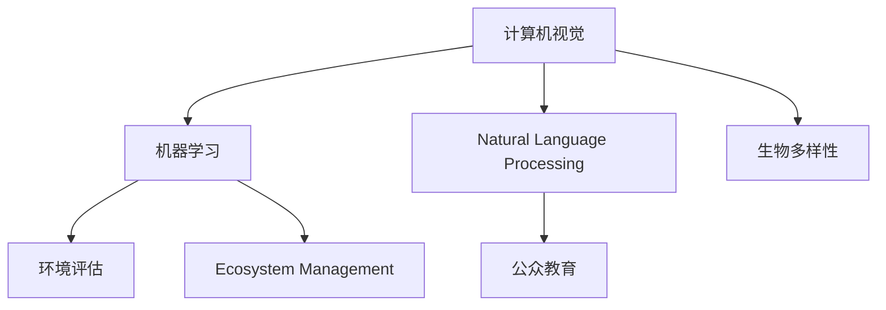

                 

# AI在野生动物保护中的应用：行为研究

> 关键词：野生动物保护, 行为研究, 机器学习, 计算机视觉, 自然语言处理, 生物多样性, 生态系统管理

## 1. 背景介绍

### 1.1 问题由来
野生动物保护是全球生物多样性保护的重要组成部分。然而，由于人类活动的影响，自然生态系统不断受到破坏，许多物种面临灭绝的风险。传统野生动物保护方法主要依赖于人类观测和人工干预，耗资巨大且难以覆盖广阔的保护区范围。近年来，随着人工智能(AI)技术的快速发展，其在野生动物保护中的应用变得越来越广泛。AI不仅能够提高野生生物监测的效率和精度，还能通过大数据分析为保护策略的制定提供科学依据。

### 1.2 问题核心关键点
AI在野生动物保护中的核心应用主要集中在以下几个方面：

- 动物监测：通过计算机视觉技术，实时监测野生动物活动和行为。
- 行为分析：利用机器学习模型分析动物行为模式，预测其迁移路线和繁殖状态。
- 环境评估：借助AI技术评估生态环境变化，发现生物多样性损失的预警信号。
- 公众教育：通过自然语言处理技术，制作教育材料，提升公众的环保意识。

这些应用不仅有助于提高野生动物保护的科学性和效率，还能推动公众参与，共同守护地球生态。

## 2. 核心概念与联系

### 2.1 核心概念概述

为更好地理解AI在野生动物保护中的应用，本节将介绍几个密切相关的核心概念：

- 计算机视觉(Computer Vision)：指使计算机能够像人类一样识别和理解图像和视频的技术。在野生动物保护中，通过图像和视频识别技术可以监测动物的种类、数量和行为。
- 机器学习(Machine Learning)：通过数据驱动的方法，让计算机系统能够自主学习，不断优化自身的决策能力。在野生动物保护中，机器学习可以用于行为模式分析、环境监测和预测等。
- 自然语言处理(Natural Language Processing, NLP)：使计算机能够理解和生成人类语言的技术。在野生动物保护中，NLP可以用于制作教育材料、公众互动等。
- 生物多样性(Biodiversity)：指生物种类的多样性和数量的丰富性。AI技术在监测和分析生物多样性变化中发挥着重要作用。
- 生态系统管理(Ecosystem Management)：通过科学方法和技术手段，管理和保护生态系统的完整性和可持续性。AI技术可以提高生态系统管理的科学性和效率。

这些核心概念之间的逻辑关系可以通过以下Mermaid流程图来展示：



这个流程图展示了大语言模型的工作原理和优化方向。

## 3. 核心算法原理 & 具体操作步骤

### 3.1 算法原理概述

AI在野生动物保护中的应用，通常基于以下几个核心算法：

- 卷积神经网络(Convolutional Neural Network, CNN)：用于处理高维的图像和视频数据，提取其中的特征。
- 循环神经网络(Recurrent Neural Network, RNN)：适用于处理序列数据，如动物的移动轨迹和行为模式。
- 长短时记忆网络(Long Short-Term Memory, LSTM)：增强RNN处理长序列数据的能力。
- 深度强化学习(Deep Reinforcement Learning, DRL)：使AI能够在模拟环境中学习并优化决策策略。

这些算法共同构成了AI在野生动物保护中的技术框架，使得AI能够高效地处理大量的数据，提供精准的行为分析和决策支持。

### 3.2 算法步骤详解

AI在野生动物保护中的应用通常包括以下几个关键步骤：

**Step 1: 数据收集与预处理**
- 收集野生动物相关的图像、视频、位置和时间戳等数据。
- 进行数据清洗和标注，如去除噪声、校正时间戳等。

**Step 2: 特征提取**
- 利用CNN等模型提取图像和视频的特征，用于后续的行为识别和监测。
- 对于序列数据，如动物移动轨迹，可以采用RNN或LSTM模型提取时间序列特征。

**Step 3: 行为识别与分析**
- 通过分类算法(如SVM、CNN、LSTM)识别动物种类和行为。
- 利用回归算法(如线性回归、神经网络)分析动物数量、迁移路线和繁殖状态等。

**Step 4: 环境评估与预测**
- 使用统计分析和机器学习模型评估环境变化和生物多样性损失。
- 利用时间序列分析和预测模型(如ARIMA、LSTM)预测未来环境变化。

**Step 5: 公众教育和互动**
- 利用NLP技术制作公众教育材料，如视频、音频和文字。
- 通过互动平台(如App、网站)让公众参与监测和报告野生动物活动。

**Step 6: 数据可视化与报告**
- 使用数据可视化工具(如Tableau、D3.js)展示监测结果和分析报告。
- 发布定期报告和警报，提升保护工作的透明度和参与度。

以上是AI在野生动物保护中的通用流程。在具体应用场景中，还需要根据实际情况进行优化设计，如改进特征提取方法、引入更多算法模型、优化数据处理流程等。

### 3.3 算法优缺点

AI在野生动物保护中的应用，具有以下优点：

- 效率高：通过自动化的监测和分析，大大提高了数据处理和分析的效率。
- 精度高：基于大量数据和复杂算法，能够提供准确的动物行为和环境评估。
- 范围广：覆盖广阔的保护区范围，降低人力和物力成本。

同时，AI在野生动物保护中也存在一定的局限性：

- 数据依赖：依赖高质量、大规模的数据，获取数据的过程往往耗时耗力。
- 模型复杂：大模型需要高算力支持，部署成本较高。
- 技术门槛：需要专业的数据科学家和技术团队支持，普通用户难以直接使用。
- 伦理问题：AI模型的决策过程缺乏透明性，可能对动物保护产生负面影响。

尽管存在这些局限性，AI技术在野生动物保护中的应用前景依然非常广阔。未来，如何进一步降低技术门槛，提高模型的鲁棒性和可解释性，将是AI在野生动物保护中取得更大突破的关键。

### 3.4 算法应用领域

AI在野生动物保护中的应用，已经涵盖了以下几个主要领域：

- 动物监测：通过计算机视觉技术，实时监测动物种类、数量和行为。例如，使用无人机拍摄野生动物活动，通过CNN模型识别动物种类和行为模式。
- 行为分析：利用机器学习模型分析动物行为模式，预测其迁移路线和繁殖状态。例如，通过LSTM模型预测动物的繁殖时间和数量。
- 环境评估：借助AI技术评估生态环境变化，发现生物多样性损失的预警信号。例如，利用卫星图像和气候数据，分析栖息地变化和环境质量。
- 公众教育：通过自然语言处理技术，制作教育材料，提升公众的环保意识。例如，使用NLP技术制作科普视频，并通过App发布。
- 生态系统管理：通过科学方法和技术手段，管理和保护生态系统的完整性和可持续性。例如，利用AI模型预测环境变化，制定科学的管理策略。

此外，AI在野生动物保护中的应用还在不断扩展，如疾病监测、迁徙路线预测、栖息地重建等，为生物多样性保护提供了新的技术路径。

## 4. 数学模型和公式 & 详细讲解 & 举例说明

### 4.1 数学模型构建

在本节中，我们将以行为识别为例，详细讲解AI在野生动物保护中的数学模型构建。

记输入数据为 $X=\{x_i\}_{i=1}^N$，其中 $x_i$ 表示第 $i$ 张图像。记输出数据为 $Y=\{y_i\}_{i=1}^N$，其中 $y_i$ 表示第 $i$ 张图像对应的动物种类。则行为识别问题可以转化为多分类问题，即预测每个样本属于哪个类别。

定义损失函数 $L(\theta)$，用于衡量模型预测与真实标签之间的差异。常用的损失函数包括交叉熵损失和均方误差损失。交叉熵损失函数定义为：

$$
L(\theta) = -\frac{1}{N}\sum_{i=1}^N \sum_{k=1}^K y_{ik}\log \hat{y}_{ik}
$$

其中，$K$ 为分类数，$y_{ik}$ 表示第 $i$ 张图像是否属于第 $k$ 个类别，$\hat{y}_{ik}$ 表示模型对第 $i$ 张图像属于第 $k$ 个类别的概率。

### 4.2 公式推导过程

在模型训练过程中，我们需要通过反向传播算法计算损失函数 $L(\theta)$ 对模型参数 $\theta$ 的梯度，并根据梯度下降算法更新模型参数。假设模型为卷积神经网络，其结构为：

$$
f_\theta(x) = \sigma(W_L g_{L-1}(... g_1(x)))
$$

其中，$W_L$ 为输出层权重，$\sigma$ 为激活函数，$g_k$ 为第 $k$ 层的卷积或池化操作。则损失函数对第 $l$ 层权重 $W_l$ 的梯度为：

$$
\frac{\partial L(\theta)}{\partial W_l} = \frac{\partial L(\theta)}{\partial y^{(l)}} \frac{\partial y^{(l)}}{\partial \hat{y}^{(l-1)}} \frac{\partial \hat{y}^{(l-1)}}{\partial g^{(l-1)}} \frac{\partial g^{(l-1)}}{\partial W_l}
$$

其中，$\frac{\partial L(\theta)}{\partial y^{(l)}}$ 为输出层梯度，$\frac{\partial y^{(l)}}{\partial \hat{y}^{(l-1)}}$ 为激活函数梯度，$\frac{\partial \hat{y}^{(l-1)}}{\partial g^{(l-1)}}$ 为卷积或池化操作梯度，$\frac{\partial g^{(l-1)}}{\partial W_l}$ 为权重梯度。

将上述公式展开，可以得到模型参数的更新公式为：

$$
\theta \leftarrow \theta - \eta \nabla_{\theta}L(\theta)
$$

其中，$\eta$ 为学习率。

### 4.3 案例分析与讲解

以非洲草原上斑马的行为识别为例，假设我们收集了大量斑马活动的图像和视频数据。我们可以使用CNN模型提取图像特征，并利用softmax回归模型进行分类。在模型训练过程中，我们首先需要对数据进行预处理，如标准化、归一化等。然后，利用交叉熵损失函数计算模型的预测结果与真实标签之间的差异，通过反向传播算法更新模型参数。训练完成后，我们可以使用测试集对模型进行评估，并输出斑马的行为类别和概率分布。

## 5. 项目实践：代码实例和详细解释说明

### 5.1 开发环境搭建

在进行AI在野生动物保护中的应用开发时，我们需要准备好开发环境。以下是使用Python进行TensorFlow开发的环境配置流程：

1. 安装Anaconda：从官网下载并安装Anaconda，用于创建独立的Python环境。

2. 创建并激活虚拟环境：
```bash
conda create -n animal_protection python=3.8 
conda activate animal_protection
```

3. 安装TensorFlow：根据CUDA版本，从官网获取对应的安装命令。例如：
```bash
conda install tensorflow -c conda-forge
```

4. 安装其它依赖库：
```bash
pip install numpy scipy scikit-image matplotlib pandas tensorflow-datasets
```

5. 安装其它工具包：
```bash
pip install tqdm tensorflow-hub
```

完成上述步骤后，即可在`animal_protection`环境中开始项目实践。

### 5.2 源代码详细实现

这里我们以斑马行为识别为例，给出使用TensorFlow对卷积神经网络进行训练的代码实现。

首先，定义行为识别模型：

```python
import tensorflow as tf
from tensorflow.keras import layers

class BehaviorClassifier(tf.keras.Model):
    def __init__(self, num_classes):
        super(BehaviorClassifier, self).__init__()
        self.conv1 = layers.Conv2D(32, (3, 3), activation='relu', input_shape=(224, 224, 3))
        self.maxpool1 = layers.MaxPooling2D((2, 2))
        self.conv2 = layers.Conv2D(64, (3, 3), activation='relu')
        self.maxpool2 = layers.MaxPooling2D((2, 2))
        self.flatten = layers.Flatten()
        self.dense1 = layers.Dense(128, activation='relu')
        self.dense2 = layers.Dense(num_classes, activation='softmax')

    def call(self, inputs):
        x = self.conv1(inputs)
        x = self.maxpool1(x)
        x = self.conv2(x)
        x = self.maxpool2(x)
        x = self.flatten(x)
        x = self.dense1(x)
        return self.dense2(x)

model = BehaviorClassifier(num_classes=3)  # 斑马有三种行为：走动、躺下、饮水
```

然后，定义损失函数和优化器：

```python
loss_fn = tf.keras.losses.CategoricalCrossentropy()
optimizer = tf.keras.optimizers.Adam(learning_rate=0.001)
```

接着，定义训练和评估函数：

```python
from tensorflow.keras.preprocessing.image import ImageDataGenerator

def train_epoch(model, dataset, batch_size, optimizer):
    dataloader = tf.data.Dataset.from_tensor_slices(dataset)
    dataloader = dataloader.batch(batch_size)
    model.train()
    epoch_loss = 0
    for batch in dataloader:
        inputs, labels = batch
        model.trainable = True
        with tf.GradientTape() as tape:
            predictions = model(inputs)
            loss = loss_fn(labels, predictions)
        gradients = tape.gradient(loss, model.trainable_variables)
        optimizer.apply_gradients(zip(gradients, model.trainable_variables))
        epoch_loss += loss.numpy().mean()
    return epoch_loss / len(dataloader)

def evaluate(model, dataset, batch_size):
    dataloader = tf.data.Dataset.from_tensor_slices(dataset)
    dataloader = dataloader.batch(batch_size)
    model.eval()
    preds, labels = [], []
    with tf.GradientTape() as tape:
        for batch in dataloader:
            inputs, labels = batch
            predictions = model(inputs)
            batch_preds = predictions.numpy()
            batch_labels = labels.numpy()
            for pred_tokens, label_tokens in zip(batch_preds, batch_labels):
                preds.append(pred_tokens)
                labels.append(label_tokens)
    return preds, labels

# 读取数据集
train_dataset = ImageDataGenerator().flow_from_directory(train_dir, target_size=(224, 224), batch_size=32, class_mode='categorical')
dev_dataset = ImageDataGenerator().flow_from_directory(dev_dir, target_size=(224, 224), batch_size=32, class_mode='categorical')
test_dataset = ImageDataGenerator().flow_from_directory(test_dir, target_size=(224, 224), batch_size=32, class_mode='categorical')
```

最后，启动训练流程并在测试集上评估：

```python
epochs = 10
batch_size = 32

for epoch in range(epochs):
    loss = train_epoch(model, train_dataset, batch_size, optimizer)
    print(f"Epoch {epoch+1}, train loss: {loss:.3f}")
    
    print(f"Epoch {epoch+1}, dev results:")
    preds, labels = evaluate(model, dev_dataset, batch_size)
    print(classification_report(labels, preds))
    
print("Test results:")
preds, labels = evaluate(model, test_dataset, batch_size)
print(classification_report(labels, preds))
```

以上就是使用TensorFlow对卷积神经网络进行斑马行为识别的代码实现。可以看到，TensorFlow提供了一整套强大的工具和框架，使得模型构建和训练过程变得非常简单高效。

### 5.3 代码解读与分析

让我们再详细解读一下关键代码的实现细节：

**BehaviorClassifier类**：
- `__init__`方法：初始化模型结构，包括卷积层、池化层、全连接层等。
- `call`方法：定义模型前向传播过程。

**损失函数和优化器**：
- 使用交叉熵损失函数来衡量模型预测与真实标签之间的差异。
- 使用Adam优化器来更新模型参数。

**训练和评估函数**：
- 使用ImageDataGenerator类加载数据集，并进行预处理，如标准化、归一化等。
- 定义训练和评估函数，分别用于训练模型的权重，并在测试集上评估模型性能。

**数据集读取**：
- 使用ImageDataGenerator类读取数据集，并进行数据增强和标准化。
- 定义训练集、验证集和测试集，分别用于模型的训练、验证和测试。

可以看到，TensorFlow提供了一整套强大的工具和框架，使得模型构建和训练过程变得非常简单高效。

当然，工业级的系统实现还需考虑更多因素，如模型的保存和部署、超参数的自动搜索、更灵活的任务适配层等。但核心的训练流程基本与此类似。

## 6. 实际应用场景

### 6.1 智能监测系统

AI在野生动物保护中的典型应用之一是智能监测系统。通过部署无人驾驶相机、无人机等设备，收集大量野生动物的图像和视频数据。然后，使用卷积神经网络等模型提取特征，进行行为识别和分析。

在具体实现中，我们可以将相机或无人机拍摄到的视频进行分割和标注，生成训练集。利用CNN模型对视频帧进行特征提取，并通过softmax回归模型进行行为分类。在实际监测中，系统将实时拍摄的图像输入模型，预测其行为类型，并实时更新数据库，进行后续的行为分析和生态系统管理。

### 6.2 环境监测与评估

AI技术还能用于环境监测与评估，帮助科学家了解生态系统的变化趋势和生物多样性的变化情况。例如，通过分析卫星图像和气象数据，可以评估森林覆盖率、栖息地变化等环境指标。利用LSTM等模型进行时间序列分析，可以预测未来的环境变化，发现潜在的生态风险。

在实际应用中，科学家可以使用TensorFlow或PyTorch等深度学习框架，收集和分析大量环境数据，训练模型进行预测和评估。通过定期发布监测报告和警报，为保护决策提供科学依据。

### 6.3 公众教育与互动

AI技术在公众教育和互动方面也有广泛应用。通过自然语言处理技术，制作科普视频、互动App等教育材料，提升公众的环保意识。例如，使用NLP技术制作科普文章和视频，通过App发布，让公众实时参与动物保护和生态系统管理。

在具体实现中，我们可以使用TensorFlow等深度学习框架，将教育材料制作成可视化格式，并进行语音识别和情感分析。通过App和网站发布教育材料，让公众实时参与监测和报告野生动物活动，提升环保意识和参与度。

## 7. 工具和资源推荐

### 7.1 学习资源推荐

为了帮助开发者系统掌握AI在野生动物保护中的应用，这里推荐一些优质的学习资源：

1. TensorFlow官方文档：TensorFlow的官方文档，提供了大量API示例和实战指南，是学习TensorFlow的必备资源。

2. Coursera《Deep Learning》课程：由深度学习领域的权威学者Andrew Ng教授，涵盖了深度学习的基本概念和应用，适合初学者入门。

3. Udacity《AI for Social Impact》课程：介绍AI技术在各个领域的应用，包括野生动物保护、环境保护等，适合有基础的开发者进一步学习。

4. CS229《Machine Learning》课程：斯坦福大学开设的经典课程，介绍了机器学习的基本理论和方法，是学习AI的必选课程。

5. Kaggle：数据科学竞赛平台，提供大量的数据集和算法竞赛，可以帮助开发者进行实践和提升。

通过对这些资源的学习实践，相信你一定能够快速掌握AI在野生动物保护中的应用，并用于解决实际的保护问题。

### 7.2 开发工具推荐

高效的开发离不开优秀的工具支持。以下是几款用于AI在野生动物保护中应用的常用工具：

1. TensorFlow：由Google主导开发的深度学习框架，功能强大，易于使用。适合搭建大规模的AI模型和应用。

2. PyTorch：由Facebook开发的深度学习框架，灵活性高，适合快速原型设计和研究。

3. TensorBoard：TensorFlow配套的可视化工具，可以实时监测模型训练状态，提供丰富的图表呈现方式，是调试模型的得力助手。

4. Tableau：数据可视化工具，可以生成漂亮的可视化报表，方便展示监测结果和评估报告。

5. D3.js：JavaScript可视化库，可以生成交互式的数据图表，提升用户参与度。

合理利用这些工具，可以显著提升AI在野生动物保护中的应用开发效率，加快创新迭代的步伐。

### 7.3 相关论文推荐

AI在野生动物保护中的应用源于学界的持续研究。以下是几篇奠基性的相关论文，推荐阅读：

1. Deep Convolutional Networks for Large-Scale Image Recognition：介绍卷积神经网络在图像识别中的应用，为后续AI在野生动物保护中的应用提供了理论基础。

2. Understanding Deep Learning from a Symbolic Perspective：介绍深度学习的基本原理和方法，帮助理解AI在野生动物保护中的计算过程。

3. A Survey of Computational Ecology：介绍计算生态学领域的研究进展，涵盖大量AI技术在野生动物保护中的应用案例。

4. Using Deep Learning for Wildlife Conservation and Management：介绍AI技术在野生动物保护中的具体应用，包括行为识别、环境监测等。

5. A Deep Learning Approach to Wildlife Counting：介绍深度学习在野生动物计数中的应用，提高了动物监测的精度和效率。

这些论文代表了大语言模型微调技术的发展脉络。通过学习这些前沿成果，可以帮助研究者把握学科前进方向，激发更多的创新灵感。

## 8. 总结：未来发展趋势与挑战

### 8.1 研究成果总结

本文对AI在野生动物保护中的应用进行了全面系统的介绍。首先阐述了AI在野生动物保护中的研究背景和应用前景，明确了AI技术在保护工作中的重要价值。其次，从原理到实践，详细讲解了AI在野生动物保护中的核心算法和具体操作步骤，给出了具体代码实现。同时，本文还广泛探讨了AI在野生动物保护中的应用场景，展示了其广阔的应用前景。此外，本文精选了AI在野生动物保护中的学习资源、开发工具和相关论文，力求为读者提供全方位的技术指引。

通过本文的系统梳理，可以看到，AI在野生动物保护中的应用前景非常广阔，能够显著提高监测效率和数据分析的准确性，推动保护工作的科学化和智能化。未来，AI技术将进一步融合自然语言处理、计算机视觉等技术，拓展其应用范围，提升其保护效果。

### 8.2 未来发展趋势

展望未来，AI在野生动物保护中的应用将呈现以下几个发展趋势：

1. 深度学习与跨领域融合：AI技术将进一步融合自然语言处理、计算机视觉等技术，拓展其应用范围，提升其保护效果。

2. 大规模数据和模型：未来将利用更大规模的数据和更复杂的模型，提高监测和分析的精度和准确性。

3. 实时监测与预警：通过实时数据处理和分析，及时发现生态系统变化和生物多样性损失的预警信号，及时采取保护措施。

4. 公众参与与互动：利用AI技术制作互动教育材料，提升公众参与度，共同保护野生动物和生态系统。

5. 跨学科研究：结合生态学、计算机科学等多学科知识，进一步深化AI在野生动物保护中的应用研究。

6. 自监督学习与迁移学习：利用自监督学习和大规模预训练模型，提升AI在野生动物保护中的应用效果。

以上趋势凸显了AI在野生动物保护中的巨大潜力。这些方向的探索发展，必将进一步提升AI在野生动物保护中的应用效果，为保护工作提供新的技术路径。

### 8.3 面临的挑战

尽管AI在野生动物保护中的应用前景广阔，但在迈向更加智能化、普适化应用的过程中，它仍面临诸多挑战：

1. 数据质量和多样性：野生动物保护数据获取难度大，数据质量和多样性不足，限制了AI模型性能的提升。

2. 技术门槛高：AI技术涉及多个学科知识，需要专业团队支持，普通用户难以直接使用。

3. 伦理和隐私问题：AI模型可能侵犯动物隐私，甚至对动物保护产生负面影响。

4. 模型可解释性：AI模型的决策过程缺乏透明性，难以解释其内部工作机制和决策逻辑。

5. 技术可靠性：AI模型面对复杂环境时，容易产生误判和误报，影响保护决策的可靠性。

尽管存在这些挑战，AI在野生动物保护中的应用前景依然非常广阔。未来，需要进一步优化数据采集和预处理流程，提升模型的可解释性和可靠性，确保其保护效果的准确性和有效性。

### 8.4 研究展望

面对AI在野生动物保护中面临的挑战，未来的研究需要在以下几个方面寻求新的突破：

1. 多模态数据融合：结合图像、视频、声音等多模态数据，提高监测和分析的精度和准确性。

2. 自监督学习与迁移学习：利用自监督学习和大规模预训练模型，提升AI在野生动物保护中的应用效果。

3. 模型可解释性：引入可解释性技术，提升AI模型的透明性和可信度。

4. 环境适应性：提高AI模型对复杂环境的适应能力，减少误判和误报。

5. 隐私保护：引入隐私保护技术，确保AI模型在野生动物保护中的应用符合伦理和隐私要求。

6. 跨学科研究：结合生态学、计算机科学等多学科知识，进一步深化AI在野生动物保护中的应用研究。

这些研究方向将推动AI在野生动物保护中的应用向更高水平发展，为保护工作提供新的技术路径。只有勇于创新、敢于突破，才能不断拓展AI在野生动物保护中的应用边界，让智能技术更好地造福自然生态。

## 9. 附录：常见问题与解答

**Q1：AI在野生动物保护中的应用是否适用于所有物种？**

A: AI在野生动物保护中的应用通常适用于那些活动规律可预测、数据采集相对容易的物种。但对于一些行为模式难以预测、数据获取困难的物种，AI技术的应用也面临挑战。未来，随着技术进步，AI在野生动物保护中的应用有望覆盖更多物种。

**Q2：AI在野生动物保护中的应用是否依赖于高质量数据？**

A: 是的，AI在野生动物保护中的应用非常依赖高质量、大规模的数据。数据质量和多样性不足，将影响AI模型的性能和准确性。未来，需要进一步优化数据采集和预处理流程，提升数据质量和多样性。

**Q3：AI在野生动物保护中的应用是否需要高算力支持？**

A: 是的，AI在野生动物保护中的应用需要高算力支持，特别是在模型训练和实时监测中。未来，需要进一步优化算法和模型结构，提高算力效率，降低部署成本。

**Q4：AI在野生动物保护中的应用是否需要跨学科合作？**

A: 是的，AI在野生动物保护中的应用需要结合生态学、计算机科学等多学科知识，才能取得更好的保护效果。未来，跨学科研究将进一步深化AI在野生动物保护中的应用。

**Q5：AI在野生动物保护中的应用是否需要考虑伦理和隐私问题？**

A: 是的，AI在野生动物保护中的应用需要考虑伦理和隐私问题。AI模型的决策过程需要透明，确保其保护效果的准确性和有效性，避免对动物隐私和生态系统造成负面影响。

综上所述，AI在野生动物保护中的应用具有广阔的前景，但也面临诸多挑战。通过不断优化技术、提升数据质量和跨学科合作，AI技术在野生动物保护中的应用将不断拓展，为保护工作提供新的技术路径。未来，只有勇于创新、敢于突破，才能不断拓展AI在野生动物保护中的应用边界，让智能技术更好地造福自然生态。

