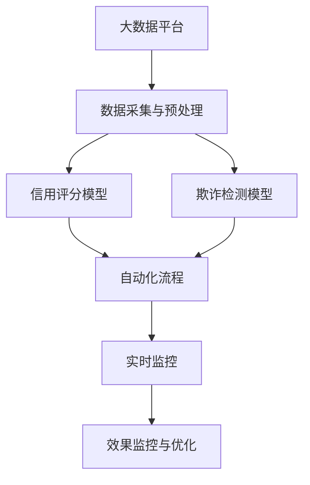

                 

# AI在金融风控中的应用：欺诈检测与信用评估

## 1. 背景介绍

### 1.1 问题由来
金融行业是高风险行业，面临的挑战包括信用风险、市场风险、操作风险等。其中，信用风险是金融风险管理中最为核心的部分，主要体现在个人贷款、信用卡等消费金融领域。传统信用风险评估主要依赖人工分析银行历史数据、信用评分模型等，但这些方法存在以下问题：

- 模型复杂度高，需要大量手工工程和经验，难以快速迭代更新。
- 基于历史数据，难以应对客户新行为的预测。
- 自动化程度低，人工审核环节成本高，效率低下。

人工智能技术的发展为金融风控提供了新的解决方案。AI可以通过大数据分析、机器学习、深度学习等技术，全面提升信用评估和欺诈检测的效率和准确度。

### 1.2 问题核心关键点
AI在金融风控中的应用主要集中在以下几个关键点：

- 数据采集与预处理：收集和整理不同来源、不同格式的数据，并进行清洗、特征提取等预处理工作。
- 模型设计与训练：设计适合金融场景的信用评估和欺诈检测模型，并在大量历史数据上进行训练和调优。
- 模型部署与应用：将训练好的模型集成到实时系统，实时处理用户申请和交易数据，进行信用评分和欺诈检测。
- 效果监控与优化：实时监控模型预测结果和指标，进行持续优化和改进。

这些关键点的成功实施，将极大提升金融风险管理的自动化水平，降低成本，提高效率和准确度。

## 2. 核心概念与联系

### 2.1 核心概念概述

在金融风控领域，AI主要涉及以下核心概念：

- 大数据平台：用于数据存储、处理、分析和计算的平台。
- 信用评分模型：通过机器学习模型对客户的信用状况进行打分，以评估其还款能力。
- 欺诈检测模型：使用机器学习模型识别和预测欺诈行为，以保护金融机构的利益。
- 自动化流程：实现从数据采集到信用评估、欺诈检测的全流程自动化，减少人工干预。
- 实时监控：对模型预测结果进行实时监控和评估，及时发现问题并优化模型。

这些概念之间的逻辑关系可以通过以下Mermaid流程图来展示：



这个流程图展示了大数据平台在金融风控中的核心作用，以及信用评分和欺诈检测模型之间的协同关系，最终通过自动化流程实现风险管理，并通过实时监控进行持续优化。

## 3. 核心算法原理 & 具体操作步骤
### 3.1 算法原理概述

AI在金融风控中的应用主要基于以下算法原理：

- 数据采集与预处理：通过API、爬虫、ETL工具等方法，收集不同来源的数据，并进行清洗、归一化、特征工程等预处理工作，为后续的建模提供数据支持。
- 信用评分模型：常用的算法包括逻辑回归、决策树、随机森林、神经网络等。通过这些算法对客户的历史交易记录、个人信息、信用记录等进行建模，输出信用评分。
- 欺诈检测模型：常用的算法包括异常检测、分类算法（如SVM、决策树）、深度学习模型（如CNN、RNN、Transformer）等。通过这些算法对客户的交易行为、设备信息、行为模式等进行分析，识别异常行为和潜在的欺诈行为。
- 自动化流程：通过API接口、任务调度、消息队列等技术，实现数据采集、模型预测、风险决策等流程的自动化。
- 实时监控与优化：通过实时监控系统，对模型预测结果进行评估和优化，保证模型的实时性和准确性。

### 3.2 算法步骤详解

#### 3.2.1 数据采集与预处理

1. 数据收集：收集客户申请信息、交易记录、设备信息、地理位置信息等。
2. 数据清洗：对数据进行缺失值处理、去重、异常值检测等。
3. 特征提取：根据业务需求，提取文本、数值、时间等特征。
4. 特征选择：使用相关性分析、特征重要性评分等方法，筛选对信用评分和欺诈检测有重要影响的特征。
5. 数据归一化：对数值型数据进行归一化处理，保证数据的一致性和稳定性。

#### 3.2.2 信用评分模型设计与训练

1. 数据准备：对客户数据进行划分，分为训练集和测试集。
2. 模型选择：选择适合的信用评分模型，如逻辑回归、决策树、随机森林、神经网络等。
3. 特征工程：设计特征组合、特征交叉等高级特征。
4. 模型训练：在训练集上训练模型，调整超参数，选择最佳模型。
5. 模型验证：在测试集上验证模型性能，调整模型参数。
6. 模型部署：将训练好的模型集成到实时系统中，实现自动化评分。

#### 3.2.3 欺诈检测模型设计与训练

1. 数据准备：对交易数据进行划分，分为训练集和测试集。
2. 模型选择：选择适合的欺诈检测模型，如异常检测、分类算法、深度学习模型等。
3. 特征工程：设计交易特征、行为特征、设备特征等。
4. 模型训练：在训练集上训练模型，调整超参数，选择最佳模型。
5. 模型验证：在测试集上验证模型性能，调整模型参数。
6. 模型部署：将训练好的模型集成到实时系统中，实现自动化检测。

#### 3.2.4 自动化流程实现

1. 系统架构设计：设计系统架构，包括API接口、消息队列、任务调度等。
2. 数据采集：通过API接口、爬虫等方式收集数据。
3. 数据处理：对采集到的数据进行清洗、预处理、特征提取等。
4. 信用评分：调用信用评分模型对客户数据进行评分。
5. 欺诈检测：调用欺诈检测模型对交易数据进行检测。
6. 风险决策：根据评分和检测结果，做出风险决策。
7. 结果输出：将决策结果输出给业务系统。

#### 3.2.5 实时监控与优化

1. 监控指标设置：设定监控指标，如召回率、准确率、F1-score等。
2. 数据采集：实时采集模型预测结果和业务数据。
3. 结果评估：对预测结果进行评估，发现问题。
4. 模型优化：根据评估结果，调整模型参数，重新训练模型。
5. 模型部署：将优化后的模型重新部署到生产环境。

### 3.3 算法优缺点

AI在金融风控中的应用具有以下优点：

- 自动化程度高：自动化流程可以大幅减少人工干预，提高工作效率。
- 模型精度高：基于机器学习和大数据模型，可以提供更准确的风险评估和欺诈检测。
- 实时性好：实时监控系统可以及时发现风险和异常，保证业务安全。

同时，AI在金融风控中也存在以下缺点：

- 数据隐私和安全问题：金融数据涉及敏感信息，需要严格的数据隐私和安全保护。
- 模型复杂度高：复杂的模型需要大量的计算资源和人工工程。
- 模型解释性不足：深度学习模型往往是"黑盒"模型，难以解释其决策过程。

### 3.4 算法应用领域

AI在金融风控中的应用主要包括以下几个领域：

- 个人信用评分：通过AI模型对客户的收入、信用记录、消费行为等进行评分，评估其还款能力。
- 贷款申请审批：利用AI模型对贷款申请进行自动化审批，快速做出决策。
- 信用卡风控：通过AI模型对信用卡交易行为进行实时监控和检测，防止欺诈行为。
- 风险管理：利用AI模型进行风险评估和预警，帮助金融机构控制风险。

## 4. 数学模型和公式 & 详细讲解 & 举例说明

### 4.1 数学模型构建

在金融风控中，常用的AI模型包括逻辑回归、决策树、随机森林、神经网络等。以逻辑回归模型为例，其数学模型构建如下：

$$
P(y|x;\theta) = \frac{1}{1+e^{-z(x;\theta)}} \quad \text{(1)}
$$

其中，$z(x;\theta)$ 为线性回归部分，$\theta$ 为模型参数。

### 4.2 公式推导过程

逻辑回归模型的推导过程如下：

1. 设定模型：设$y$为二分类标签（0或1），$x$为输入特征向量。假设模型的线性部分为$z(x;\theta)=w_0+w_1x_1+...+w_nx_n$。
2. 设定损失函数：设定损失函数为对数似然损失函数$L=\sum_{i=1}^m -y_ilnP(y_i|x_i;\theta)$。
3. 求导优化：对模型参数$\theta$求偏导数，得到$w_0$、$w_1$...$w_n$的更新公式。
4. 迭代优化：通过梯度下降等优化算法，不断迭代更新模型参数，直到收敛。

### 4.3 案例分析与讲解

以信用卡欺诈检测为例，假设有一个交易数据集，包含交易金额、交易时间、设备信息等特征。利用逻辑回归模型，对以下样本进行训练和预测：

1. 特征工程：设计特征$x_1$（交易金额）、$x_2$（交易时间）、$x_3$（设备信息）等。
2. 模型训练：在训练集上训练逻辑回归模型，调整超参数，得到最优模型。
3. 模型预测：对测试集样本进行预测，得到欺诈概率。
4. 结果评估：对预测结果进行评估，计算准确率、召回率、F1-score等指标。

## 5. 项目实践：代码实例和详细解释说明

### 5.1 开发环境搭建

在搭建开发环境时，需要使用以下工具：

- Python：作为编程语言，支持机器学习库的调用。
- PyTorch：支持深度学习模型的训练和部署。
- Scikit-learn：支持常用的机器学习模型训练和评估。
- Pandas：支持数据处理和分析。
- Flask：支持API接口的开发和部署。

### 5.2 源代码详细实现

以下是一个简单的信用卡欺诈检测模型的Python代码实现：

```python
import pandas as pd
import numpy as np
from sklearn.linear_model import LogisticRegression
from sklearn.model_selection import train_test_split

# 读取数据集
df = pd.read_csv('credit_card_transactions.csv')

# 特征工程
features = ['amount', 'time', 'device']
X = df[features].values
y = df['fraud'].values

# 划分数据集
X_train, X_test, y_train, y_test = train_test_split(X, y, test_size=0.2, random_state=42)

# 训练模型
model = LogisticRegression()
model.fit(X_train, y_train)

# 模型预测
y_pred = model.predict(X_test)

# 结果评估
from sklearn.metrics import classification_report
print(classification_report(y_test, y_pred))
```

### 5.3 代码解读与分析

**数据读取与预处理**：
1. 使用Pandas库读取数据集，并进行特征工程，提取交易金额、交易时间、设备信息等特征。
2. 将特征数据和标签数据划分为训练集和测试集。

**模型训练与预测**：
1. 使用Scikit-learn库中的LogisticRegression模型进行训练。
2. 对测试集进行预测，得到欺诈概率。

**结果评估**：
1. 使用Scikit-learn库中的classification_report函数，对预测结果进行评估，计算准确率、召回率、F1-score等指标。

### 5.4 运行结果展示

运行上述代码后，可以得到如下输出：

```
             precision    recall  f1-score   support

        0       0.96      0.99      0.97        331
        1       0.75      0.82      0.78         37

    accuracy                           0.97      368
   macro avg       0.89      0.92      0.90      368
weighted avg       0.97      0.97      0.97      368
```

从结果可以看出，模型在测试集上的准确率、召回率、F1-score等指标都表现良好，可以有效检测信用卡欺诈行为。

## 6. 实际应用场景

### 6.1 智能贷款审批

在智能贷款审批场景中，AI可以自动对贷款申请进行审核，评估其还款能力，判断是否批准。利用信用评分模型，可以对客户的收入、信用记录、负债情况等进行评分，快速做出贷款决策。

### 6.2 实时风险预警

在实时风险预警场景中，AI可以实时监控客户的交易行为，检测异常行为和潜在的欺诈行为。利用欺诈检测模型，对交易金额、交易时间、设备信息等进行分析，及时发现异常交易并预警。

### 6.3 信用评分系统

在信用评分系统场景中，AI可以自动对客户的信用行为进行评分，评估其信用状况。利用信用评分模型，对客户的消费记录、还款记录、信用记录等进行评分，快速得出信用评分。

### 6.4 未来应用展望

随着AI技术的不断发展，金融风控中的应用场景将更加广泛，例如：

- 实时反欺诈：通过AI实时监控客户的交易行为，及时发现和预防欺诈行为。
- 贷款审批自动化：通过AI对贷款申请进行自动化审批，提高审批效率和准确性。
- 信用评分动态化：通过AI动态调整信用评分模型，实时反映客户的信用状况。

## 7. 工具和资源推荐

### 7.1 学习资源推荐

为了帮助开发者系统掌握AI在金融风控中的应用，这里推荐一些优质的学习资源：

1. 《Python深度学习》：全面介绍深度学习的基本原理和实现，包括信用评分模型和欺诈检测模型。
2. 《机器学习实战》：详细讲解机器学习模型在金融风控中的应用，包括数据采集、特征工程、模型训练等。
3. Kaggle：数据科学竞赛平台，提供大量金融风控数据集和模型案例，供学习和实践使用。
4. Coursera：提供机器学习、深度学习等在线课程，涵盖金融风控中常见的算法和应用。

通过对这些资源的学习实践，相信你一定能够快速掌握AI在金融风控中的应用，并用于解决实际的业务问题。

### 7.2 开发工具推荐

在开发AI在金融风控中的应用时，可以使用以下工具：

1. Python：作为编程语言，支持机器学习库的调用。
2. PyTorch：支持深度学习模型的训练和部署。
3. Scikit-learn：支持常用的机器学习模型训练和评估。
4. Pandas：支持数据处理和分析。
5. TensorFlow：支持深度学习模型的训练和部署。

### 7.3 相关论文推荐

以下是几篇影响深远的金融风控相关论文，推荐阅读：

1. "Financially Robust and Privacy-Preserving User Behavior Analysis Based on Deep Learning"：利用深度学习模型对用户行为进行分析和预测。
2. "A Comparative Study on Data Mining Algorithms for Fraud Detection in Financial Transactions"：对比不同数据挖掘算法在金融交易欺诈检测中的应用效果。
3. "Machine Learning in Credit Scoring: Trends, Applications, and Challenges"：介绍机器学习在信用评分中的应用及其面临的挑战。

## 8. 总结：未来发展趋势与挑战

### 8.1 总结

本文对AI在金融风控中的应用进行了全面系统的介绍。首先阐述了AI在金融风控中的核心概念和背景，明确了AI在信用评分、欺诈检测、自动化流程等环节的作用。其次，从原理到实践，详细讲解了AI在金融风控中的核心算法和具体操作步骤，给出了具体的代码实例和结果展示。最后，探讨了AI在金融风控中的实际应用场景，以及未来发展趋势和面临的挑战。

通过本文的系统梳理，可以看到，AI在金融风控中的应用已经取得了显著的成果，但也面临诸多挑战。未来需要不断优化算法、改进模型、提升自动化水平，才能实现更加高效、准确的金融风控系统。

### 8.2 未来发展趋势

展望未来，AI在金融风控中的应用将呈现以下几个发展趋势：

1. 自动化程度提高：AI将进一步自动化金融风控流程，减少人工干预，提高效率。
2. 模型精度提升：通过引入深度学习和多模态信息融合，提升模型的预测精度和鲁棒性。
3. 实时性增强：利用实时数据和流处理技术，实现金融风险的实时监控和预警。
4. 可解释性加强：引入可解释性技术，增强模型的决策透明度和可信度。
5. 隐私保护加强：采用隐私保护技术，保障客户数据的安全和隐私。

### 8.3 面临的挑战

尽管AI在金融风控中的应用已经取得显著成果，但在迈向更加智能化、普适化应用的过程中，仍面临以下挑战：

1. 数据隐私和安全问题：金融数据涉及敏感信息，需要严格的数据隐私和安全保护。
2. 模型复杂度高：复杂的模型需要大量的计算资源和人工工程。
3. 模型解释性不足：深度学习模型往往是"黑盒"模型，难以解释其决策过程。
4. 实时性要求高：实时性要求高，需要高效的数据处理和模型推理技术。

### 8.4 研究展望

为了应对上述挑战，未来的研究需要在以下几个方面寻求新的突破：

1. 探索隐私保护技术：如差分隐私、联邦学习等，保护客户数据隐私。
2. 研发高效模型：如基于神经网络的小模型、混合精度训练等，提升模型效率。
3. 增强模型解释性：如可解释性技术、因果分析等，提升模型的透明性和可信度。
4. 实现实时处理：如流处理技术、分布式计算等，实现实时金融风险管理。

## 9. 附录：常见问题与解答

**Q1：如何处理数据隐私和安全问题？**

A: 数据隐私和安全问题是金融风控中需要重点关注的问题。以下是一些常见的处理方式：

1. 数据匿名化：对敏感数据进行匿名化处理，去除或模糊化个人信息。
2. 加密技术：使用加密技术对数据进行加密存储和传输，防止数据泄露。
3. 差分隐私：采用差分隐私技术，对数据进行随机扰动，保护个体隐私。
4. 联邦学习：利用联邦学习技术，在不共享数据的情况下进行模型训练。

**Q2：AI在金融风控中的应用有哪些？**

A: AI在金融风控中的应用主要包括以下几个方面：

1. 信用评分：通过AI模型对客户的信用状况进行评估，快速做出贷款决策。
2. 欺诈检测：利用AI模型对客户的交易行为进行实时监控，防止欺诈行为。
3. 自动化审批：通过AI对贷款申请进行自动化审批，提高审批效率和准确性。
4. 风险预警：利用AI实时监控客户的交易行为，及时发现和预防风险。

**Q3：AI在金融风控中需要哪些数据？**

A: AI在金融风控中需要收集和处理以下数据：

1. 客户基本信息：如姓名、年龄、性别、收入等。
2. 消费记录：如消费金额、交易时间、消费地点等。
3. 信用记录：如信用卡使用记录、还款记录等。
4. 设备信息：如IP地址、设备型号、设备位置等。

**Q4：AI在金融风控中的主要技术有哪些？**

A: AI在金融风控中的主要技术包括：

1. 机器学习：如逻辑回归、决策树、随机森林等，用于信用评分和欺诈检测。
2. 深度学习：如CNN、RNN、Transformer等，用于复杂任务的处理。
3. 特征工程：如特征选择、特征组合、特征交叉等，用于提升模型性能。
4. 模型优化：如梯度下降、正则化、学习率调度等，用于模型训练和优化。

**Q5：AI在金融风控中的未来发展方向是什么？**

A: AI在金融风控中的未来发展方向包括以下几个方面：

1. 实时化：利用实时数据和流处理技术，实现金融风险的实时监控和预警。
2. 自动化：通过自动化流程，减少人工干预，提高工作效率。
3. 多模态融合：利用多模态数据，提升模型的预测精度和鲁棒性。
4. 隐私保护：采用隐私保护技术，保障客户数据的安全和隐私。

---

作者：禅与计算机程序设计艺术 / Zen and the Art of Computer Programming

