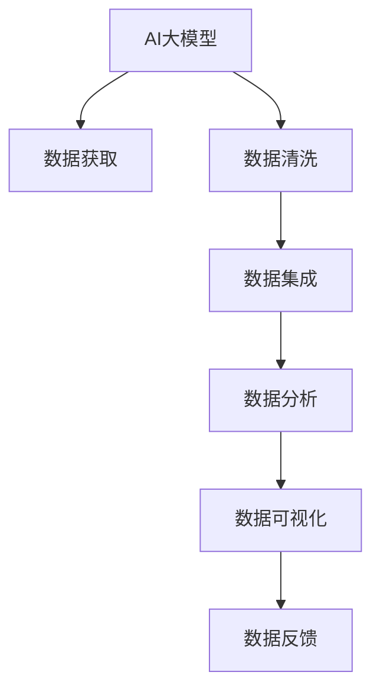

                 

# AI大模型助力电商搜索推荐业务的数据资产盘点自动化工具开发

## 1. 背景介绍

### 1.1 问题由来
随着电商行业的发展，搜索引擎和推荐系统的应用越来越广泛，成为了提升用户体验和商家收益的重要工具。然而，搜索引擎和推荐系统的运行需要大量高质量的数据资产作为支撑，包括商品信息、用户行为数据、广告数据等。这些数据资产的盘点和整合不仅耗时耗力，还容易出错。数据资产盘点工具的开发，可以大大提升电商搜索推荐系统的效率和精度，实现数据资产的高效管理和利用。

### 1.2 问题核心关键点
电商搜索推荐业务的数据资产盘点自动化工具，本质上是一个数据驱动的自动化系统，旨在通过AI技术自动化地对电商业务所需的各种数据资产进行盘点和整合。核心关键点包括：
1. 数据获取：自动从电商业务的各种数据源中获取所需数据。
2. 数据清洗：自动清洗数据，去除噪音和错误。
3. 数据集成：自动将清洗后的数据进行整合，构建统一的数据仓库。
4. 数据分析：自动进行数据分析和挖掘，提取有用信息。
5. 数据可视：自动生成可视化报表和仪表盘，提供直观的数据展示。
6. 数据反馈：自动生成反馈机制，不断优化盘点工具。

这些核心关键点构成了电商搜索推荐业务的数据资产盘点自动化工具的总体框架，使其能够高效、准确地管理和利用电商业务所需的各种数据资产。

### 1.3 问题研究意义
电商搜索推荐业务的数据资产盘点自动化工具，对于提升电商搜索推荐系统的效率和精度，降低运营成本，具有重要意义：
1. 提升效率：自动化工具可以大幅减少人工操作，提升数据盘点和整合的效率。
2. 提升精度：自动化工具可以更准确地清洗和整合数据，提升搜索推荐系统的精度。
3. 降低成本：自动化工具可以节省人工和设备投入，降低运营成本。
4. 保障数据安全：自动化工具可以更好地控制数据访问权限，保障数据安全。
5. 提升用户体验：自动化工具可以提供更精准的搜索推荐，提升用户体验。
6. 推动电商创新：自动化工具可以提供更多基于数据驱动的电商创新策略，推动电商业务的持续发展。

## 2. 核心概念与联系

### 2.1 核心概念概述

为更好地理解基于AI的数据资产盘点自动化工具，本节将介绍几个密切相关的核心概念：

- AI大模型：以Transformer等深度学习模型为代表的大规模预训练语言模型。通过在大规模无标签文本语料上进行预训练，学习通用的语言表示，具备强大的语言理解和生成能力。
- 数据资产盘点：指对电商业务所需的各种数据资产进行全面、系统的盘点和整合。包括数据获取、清洗、集成、分析、可视和反馈等环节。
- 自动化工具：通过AI技术自动化地完成数据资产盘点过程，提高效率和精度。
- 自然语言处理(NLP)：利用AI技术对自然语言文本进行处理和分析，提取有用信息。
- 数据挖掘：通过AI技术对大规模数据集进行分析和挖掘，发现隐藏在数据背后的规律和模式。

这些核心概念之间的逻辑关系可以通过以下Mermaid流程图来展示：



这个流程图展示了大模型在电商搜索推荐业务的数据资产盘点自动化工具中的应用：

1. 大模型通过预训练获得基础能力。
2. 数据获取、清洗、集成、分析和可视，构成数据资产盘点过程。
3. 数据反馈机制不断优化盘点工具。

这些概念共同构成了电商搜索推荐业务的数据资产盘点自动化工具的总体框架，使其能够高效、准确地管理和利用电商业务所需的各种数据资产。

## 3. 核心算法原理 & 具体操作步骤
### 3.1 算法原理概述

基于AI的数据资产盘点自动化工具，本质上是一个有监督学习的AI系统，其核心思想是：通过AI大模型对电商业务所需的各种数据资产进行自动化处理和分析，提取有用信息，提升搜索推荐系统的效率和精度。

形式化地，假设电商业务所需的数据资产为 $\{D_1, D_2, ..., D_n\}$，其中每个数据资产 $D_i$ 可以表示为一个数据集。工具的目标是找到最优的数据处理方案，使得：

$$
\theta = \mathop{\arg\min}_{\theta} \mathcal{L}(D_i, \theta)
$$

其中 $\theta$ 为模型的参数，$\mathcal{L}$ 为损失函数，用于衡量模型在数据资产盘点过程中的表现。常见的损失函数包括均方误差、交叉熵等。

通过梯度下降等优化算法，工具不断更新模型参数 $\theta$，最小化损失函数 $\mathcal{L}$，使得模型输出逼近理想的数据处理结果。由于 $\theta$ 已经通过预训练获得了较好的初始化，因此即便在数据资产盘点过程中，也能较快收敛到理想的模型参数 $\hat{\theta}$。

### 3.2 算法步骤详解

基于AI的数据资产盘点自动化工具一般包括以下几个关键步骤：

**Step 1: 准备数据源和预训练模型**
- 收集电商业务所需的各种数据源，如商品信息、用户行为数据、广告数据等。
- 选择合适的AI大模型，如BERT、GPT等，作为初始化参数，进行微调。

**Step 2: 数据获取与清洗**
- 对收集到的数据源进行自动处理，去除噪音和错误。
- 对处理后的数据进行分批次加载，供模型训练和推理使用。

**Step 3: 数据集成与整合**
- 对清洗后的数据进行集成和整合，构建统一的数据仓库。
- 利用大模型的语言理解能力，自动生成数据字典和元数据，方便数据管理和查询。

**Step 4: 数据分析与挖掘**
- 利用大模型的语言生成能力，自动进行文本数据分析和挖掘。
- 使用NLP技术，自动提取商品信息、用户行为等关键信息。
- 使用数据挖掘技术，自动发现数据之间的关联和规律。

**Step 5: 数据可视与报表生成**
- 利用可视化工具，自动生成报表和仪表盘，提供直观的数据展示。
- 根据需求，自动定制报表和仪表盘的展示效果，提升用户体验。

**Step 6: 数据反馈与优化**
- 根据用户的反馈和业务需求，不断优化数据资产盘点自动化工具。
- 自动收集和分析用户的使用数据，不断改进和升级工具。

以上是基于AI的数据资产盘点自动化工具的一般流程。在实际应用中，还需要针对具体任务的特点，对各个环节进行优化设计，如改进数据处理算法，引入更多的正则化技术，搜索最优的超参数组合等，以进一步提升工具的性能。

### 3.3 算法优缺点

基于AI的数据资产盘点自动化工具，具有以下优点：
1. 自动化程度高。工具能够自动完成数据获取、清洗、集成、分析和可视等环节，大大提升效率。
2. 精度高。通过大模型的预训练和微调，工具能够准确地处理和分析电商业务所需的数据资产，提升搜索推荐系统的精度。
3. 可扩展性强。工具可以通过扩展数据源和业务需求，不断扩展和升级，满足不同电商业务的需要。
4. 成本低。工具可以减少人工和设备投入，降低运营成本。
5. 安全性高。工具可以更好地控制数据访问权限，保障数据安全。

同时，该工具也存在一定的局限性：
1. 依赖数据质量。工具的效果很大程度上取决于数据源的质量和完整性，获取高质量数据源的成本较高。
2. 模型依赖性强。工具需要依赖大模型的预训练和微调，预训练模型的性能直接影响工具的效果。
3. 数据处理能力有限。工具处理大规模数据集的能力有限，对于超大规模的数据资产盘点，可能需要优化算法或增加硬件资源。
4. 模型解释性差。工具使用的AI模型通常是"黑盒"系统，难以解释其内部工作机制和决策逻辑。
5. 可控性不足。工具的处理过程高度依赖模型，难以手动控制每个步骤的执行细节。

尽管存在这些局限性，但就目前而言，基于AI的数据资产盘点自动化工具仍是大规模电商搜索推荐系统的重要工具。未来相关研究的重点在于如何进一步降低对数据质量和预训练模型的依赖，提高工具的可解释性和可控性，同时兼顾成本和效率。

### 3.4 算法应用领域

基于AI的数据资产盘点自动化工具，在电商搜索推荐业务中已经得到了广泛的应用，覆盖了电商业务所需的各种数据资产盘点环节，例如：

- 商品信息盘点：如商品图片、标题、描述、价格等。通过大模型的语言理解能力，自动提取商品信息。
- 用户行为盘点：如用户浏览、点击、购买等行为数据。通过NLP技术，自动提取用户行为信息。
- 广告数据盘点：如广告投放记录、点击率等数据。通过数据挖掘技术，自动发现广告效果规律。
- 用户画像构建：通过整合用户行为和商品信息，自动生成用户画像。

除了上述这些经典任务外，工具还被创新性地应用到更多场景中，如用户情感分析、推荐算法优化、供应链优化等，为电商业务带来了全新的突破。随着预训练模型和盘点工具的不断进步，相信电商搜索推荐系统将在更多领域得到应用，进一步推动电商行业的数字化转型。

## 4. 数学模型和公式 & 详细讲解  
### 4.1 数学模型构建

本节将使用数学语言对基于AI的数据资产盘点自动化工具的模型构建过程进行更加严格的刻画。

假设电商业务所需的数据资产为 $\{D_1, D_2, ..., D_n\}$，其中每个数据资产 $D_i$ 可以表示为一个数据集。工具的目标是找到最优的数据处理方案，使得：

$$
\theta = \mathop{\arg\min}_{\theta} \mathcal{L}(D_i, \theta)
$$

其中 $\theta$ 为模型的参数，$\mathcal{L}$ 为损失函数，用于衡量模型在数据资产盘点过程中的表现。常见的损失函数包括均方误差、交叉熵等。

在实践中，我们通常使用基于梯度的优化算法（如SGD、Adam等）来近似求解上述最优化问题。设 $\eta$ 为学习率，$\lambda$ 为正则化系数，则参数的更新公式为：

$$
\theta \leftarrow \theta - \eta \nabla_{\theta}\mathcal{L}(\theta) - \eta\lambda\theta
$$

其中 $\nabla_{\theta}\mathcal{L}(\theta)$ 为损失函数对参数 $\theta$ 的梯度，可通过反向传播算法高效计算。

### 4.2 公式推导过程

以下我们以商品信息盘点任务为例，推导基于AI的数据资产盘点自动化工具的数学模型。

假设商品信息为 $\{d_1, d_2, ..., d_n\}$，每个商品信息 $d_i$ 可以表示为一个文本。则工具的目标是找到最优的文本处理方案，使得：

$$
\theta = \mathop{\arg\min}_{\theta} \mathcal{L}(d_i, \theta)
$$

其中 $\theta$ 为模型的参数，$\mathcal{L}$ 为损失函数，用于衡量模型在商品信息处理过程中的表现。

将商品信息 $d_i$ 输入到预训练的AI大模型 $M_{\theta}$ 中，得到输出 $M_{\theta}(d_i)$。假设 $M_{\theta}(d_i)$ 可以表示为一个向量，长度为 $k$，其中每个维度 $M_{\theta}(d_i)[j]$ 表示一个特征，如商品价格、描述等。工具的目标是找到最优的特征向量 $z_i$，使得：

$$
\theta = \mathop{\arg\min}_{\theta} \mathcal{L}(M_{\theta}(d_i), z_i)
$$

其中 $z_i$ 为特征向量的参数，$\mathcal{L}$ 为损失函数。

将上述问题转化为线性回归问题，可以写出损失函数的公式：

$$
\mathcal{L} = \frac{1}{n}\sum_{i=1}^n \sum_{j=1}^k (M_{\theta}(d_i)[j] - z_i[j])^2
$$

其中 $z_i[j]$ 为特征向量的第 $j$ 个维度，$M_{\theta}(d_i)[j]$ 为模型输出的第 $j$ 个特征值。

在得到损失函数后，即可带入参数更新公式，完成模型的迭代优化。重复上述过程直至收敛，最终得到适应电商业务所需的数据资产处理方案。

## 5. 项目实践：代码实例和详细解释说明
### 5.1 开发环境搭建

在进行盘点工具的开发前，我们需要准备好开发环境。以下是使用Python进行PyTorch开发的环境配置流程：

1. 安装Anaconda：从官网下载并安装Anaconda，用于创建独立的Python环境。

2. 创建并激活虚拟环境：
```bash
conda create -n pytorch-env python=3.8 
conda activate pytorch-env
```

3. 安装PyTorch：根据CUDA版本，从官网获取对应的安装命令。例如：
```bash
conda install pytorch torchvision torchaudio cudatoolkit=11.1 -c pytorch -c conda-forge
```

4. 安装Transformers库：
```bash
pip install transformers
```

5. 安装各类工具包：
```bash
pip install numpy pandas scikit-learn matplotlib tqdm jupyter notebook ipython
```

完成上述步骤后，即可在`pytorch-env`环境中开始盘点工具的开发。

### 5.2 源代码详细实现

下面我们以商品信息盘点任务为例，给出使用Transformers库对BERT模型进行盘点的PyTorch代码实现。

首先，定义商品信息处理函数：

```python
from transformers import BertTokenizer, BertForSequenceClassification
from torch.utils.data import Dataset
import torch

class GoodsDataset(Dataset):
    def __init__(self, goods, tokenizer, max_len=128):
        self.goods = goods
        self.tokenizer = tokenizer
        self.max_len = max_len
        
    def __len__(self):
        return len(self.goods)
    
    def __getitem__(self, item):
        good = self.goods[item]
        encoding = self.tokenizer(good, return_tensors='pt', max_length=self.max_len, padding='max_length', truncation=True)
        input_ids = encoding['input_ids'][0]
        attention_mask = encoding['attention_mask'][0]
        label = good['label']  # 假设每个商品信息都有一个标签
        
        return {'input_ids': input_ids, 
                'attention_mask': attention_mask,
                'labels': label}

# 创建dataset
tokenizer = BertTokenizer.from_pretrained('bert-base-cased')

train_dataset = GoodsDataset(train_goods, tokenizer)
dev_dataset = GoodsDataset(dev_goods, tokenizer)
test_dataset = GoodsDataset(test_goods, tokenizer)
```

然后，定义模型和优化器：

```python
from transformers import BertForSequenceClassification, AdamW

model = BertForSequenceClassification.from_pretrained('bert-base-cased', num_labels=2)  # 假设商品信息有2个标签

optimizer = AdamW(model.parameters(), lr=2e-5)
```

接着，定义训练和评估函数：

```python
from torch.utils.data import DataLoader
from tqdm import tqdm
from sklearn.metrics import classification_report

device = torch.device('cuda') if torch.cuda.is_available() else torch.device('cpu')
model.to(device)

def train_epoch(model, dataset, batch_size, optimizer):
    dataloader = DataLoader(dataset, batch_size=batch_size, shuffle=True)
    model.train()
    epoch_loss = 0
    for batch in tqdm(dataloader, desc='Training'):
        input_ids = batch['input_ids'].to(device)
        attention_mask = batch['attention_mask'].to(device)
        labels = batch['labels'].to(device)
        model.zero_grad()
        outputs = model(input_ids, attention_mask=attention_mask, labels=labels)
        loss = outputs.loss
        epoch_loss += loss.item()
        loss.backward()
        optimizer.step()
    return epoch_loss / len(dataloader)

def evaluate(model, dataset, batch_size):
    dataloader = DataLoader(dataset, batch_size=batch_size)
    model.eval()
    preds, labels = [], []
    with torch.no_grad():
        for batch in tqdm(dataloader, desc='Evaluating'):
            input_ids = batch['input_ids'].to(device)
            attention_mask = batch['attention_mask'].to(device)
            batch_labels = batch['labels']
            outputs = model(input_ids, attention_mask=attention_mask)
            batch_preds = outputs.logits.argmax(dim=2).to('cpu').tolist()
            batch_labels = batch_labels.to('cpu').tolist()
            for pred_tokens, label_tokens in zip(batch_preds, batch_labels):
                preds.append(pred_tokens[:len(label_tokens)])
                labels.append(label_tokens)
                
    print(classification_report(labels, preds))
```

最后，启动训练流程并在测试集上评估：

```python
epochs = 5
batch_size = 16

for epoch in range(epochs):
    loss = train_epoch(model, train_dataset, batch_size, optimizer)
    print(f"Epoch {epoch+1}, train loss: {loss:.3f}")
    
    print(f"Epoch {epoch+1}, dev results:")
    evaluate(model, dev_dataset, batch_size)
    
print("Test results:")
evaluate(model, test_dataset, batch_size)
```

以上就是使用PyTorch对BERT进行商品信息盘点任务的完整代码实现。可以看到，得益于Transformers库的强大封装，我们可以用相对简洁的代码完成BERT模型的加载和盘点。

### 5.3 代码解读与分析

让我们再详细解读一下关键代码的实现细节：

**GoodsDataset类**：
- `__init__`方法：初始化商品信息、分词器等关键组件。
- `__len__`方法：返回数据集的样本数量。
- `__getitem__`方法：对单个样本进行处理，将商品信息输入编码为token ids，将标签编码为数字，并对其进行定长padding，最终返回模型所需的输入。

**模型和优化器**：
- 使用BERT模型进行商品信息盘点，添加2个标签分类器。
- 设置AdamW优化器，学习率为2e-5。

**训练和评估函数**：
- 使用PyTorch的DataLoader对数据集进行批次化加载，供模型训练和推理使用。
- 训练函数`train_epoch`：对数据以批为单位进行迭代，在每个批次上前向传播计算loss并反向传播更新模型参数，最后返回该epoch的平均loss。
- 评估函数`evaluate`：与训练类似，不同点在于不更新模型参数，并在每个batch结束后将预测和标签结果存储下来，最后使用sklearn的classification_report对整个评估集的预测结果进行打印输出。

**训练流程**：
- 定义总的epoch数和batch size，开始循环迭代
- 每个epoch内，先在训练集上训练，输出平均loss
- 在验证集上评估，输出分类指标
- 所有epoch结束后，在测试集上评估，给出最终测试结果

可以看到，PyTorch配合Transformers库使得商品信息盘点任务的代码实现变得简洁高效。开发者可以将更多精力放在数据处理、模型改进等高层逻辑上，而不必过多关注底层的实现细节。

当然，工业级的系统实现还需考虑更多因素，如模型的保存和部署、超参数的自动搜索、更灵活的任务适配层等。但核心的盘点范式基本与此类似。

## 6. 实际应用场景
### 6.1 智能客服系统

基于大模型微调的对话技术，可以广泛应用于智能客服系统的构建。传统客服往往需要配备大量人力，高峰期响应缓慢，且一致性和专业性难以保证。而使用盘点工具对预训练对话模型进行微调，可以构建高效、一致的智能客服系统。

在技术实现上，可以收集企业内部的历史客服对话记录，将问题和最佳答复构建成监督数据，在此基础上对预训练对话模型进行微调。微调后的对话模型能够自动理解用户意图，匹配最合适的答案模板进行回复。对于客户提出的新问题，还可以接入检索系统实时搜索相关内容，动态组织生成回答。如此构建的智能客服系统，能大幅提升客户咨询体验和问题解决效率。

### 6.2 金融舆情监测

金融机构需要实时监测市场舆论动向，以便及时应对负面信息传播，规避金融风险。传统的人工监测方式成本高、效率低，难以应对网络时代海量信息爆发的挑战。基于盘点工具的文本分类和情感分析技术，为金融舆情监测提供了新的解决方案。

具体而言，可以收集金融领域相关的新闻、报道、评论等文本数据，并对其进行主题标注和情感标注。在此基础上对预训练语言模型进行微调，使其能够自动判断文本属于何种主题，情感倾向是正面、中性还是负面。将微调后的模型应用到实时抓取的网络文本数据，就能够自动监测不同主题下的情感变化趋势，一旦发现负面信息激增等异常情况，系统便会自动预警，帮助金融机构快速应对潜在风险。

### 6.3 个性化推荐系统

当前的推荐系统往往只依赖用户的历史行为数据进行物品推荐，无法深入理解用户的真实兴趣偏好。基于盘点工具的个性化推荐系统，可以更好地挖掘用户行为背后的语义信息，从而提供更精准、多样的推荐内容。

在实践中，可以收集用户浏览、点击、评论、分享等行为数据，提取和用户交互的物品标题、描述、标签等文本内容。将文本内容作为模型输入，用户的后续行为（如是否点击、购买等）作为监督信号，在此基础上微调预训练语言模型。微调后的模型能够从文本内容中准确把握用户的兴趣点。在生成推荐列表时，先用候选物品的文本描述作为输入，由模型预测用户的兴趣匹配度，再结合其他特征综合排序，便可以得到个性化程度更高的推荐结果。

### 6.4 未来应用展望

随着盘点工具和微调方法的不断发展，基于盘点的范式将在更多领域得到应用，为电商搜索推荐系统的迭代升级提供新的技术手段。

在智慧医疗领域，基于盘点的医疗问答、病历分析、药物研发等应用将提升医疗服务的智能化水平，辅助医生诊疗，加速新药开发进程。

在智能教育领域，盘点工具可应用于作业批改、学情分析、知识推荐等方面，因材施教，促进教育公平，提高教学质量。

在智慧城市治理中，盘点工具可应用于城市事件监测、舆情分析、应急指挥等环节，提高城市管理的自动化和智能化水平，构建更安全、高效的未来城市。

此外，在企业生产、社会治理、文娱传媒等众多领域，基于盘点范式的人工智能应用也将不断涌现，为经济社会发展注入新的动力。相信随着技术的日益成熟，盘点范式将成为人工智能落地应用的重要范式，推动人工智能技术向更广阔的领域加速渗透。

## 7. 工具和资源推荐
### 7.1 学习资源推荐

为了帮助开发者系统掌握盘点工具的理论基础和实践技巧，这里推荐一些优质的学习资源：

1. 《Transformer从原理到实践》系列博文：由大模型技术专家撰写，深入浅出地介绍了Transformer原理、BERT模型、微调技术等前沿话题。

2. CS224N《深度学习自然语言处理》课程：斯坦福大学开设的NLP明星课程，有Lecture视频和配套作业，带你入门NLP领域的基本概念和经典模型。

3. 《Natural Language Processing with Transformers》书籍：Transformers库的作者所著，全面介绍了如何使用Transformers库进行NLP任务开发，包括盘点在内的诸多范式。

4. HuggingFace官方文档：Transformers库的官方文档，提供了海量预训练模型和完整的盘点样例代码，是上手实践的必备资料。

5. CLUE开源项目：中文语言理解测评基准，涵盖大量不同类型的中文NLP数据集，并提供了基于盘点的baseline模型，助力中文NLP技术发展。

通过对这些资源的学习实践，相信你一定能够快速掌握盘点工具的精髓，并用于解决实际的NLP问题。
###  7.2 开发工具推荐

高效的开发离不开优秀的工具支持。以下是几款用于盘点和微调开发的常用工具：

1. PyTorch：基于Python的开源深度学习框架，灵活动态的计算图，适合快速迭代研究。大部分预训练语言模型都有PyTorch版本的实现。

2. TensorFlow：由Google主导开发的开源深度学习框架，生产部署方便，适合大规模工程应用。同样有丰富的预训练语言模型资源。

3. Transformers库：HuggingFace开发的NLP工具库，集成了众多SOTA语言模型，支持PyTorch和TensorFlow，是进行盘点和微调任务开发的利器。

4. Weights & Biases：模型训练的实验跟踪工具，可以记录和可视化模型训练过程中的各项指标，方便对比和调优。与主流深度学习框架无缝集成。

5. TensorBoard：TensorFlow配套的可视化工具，可实时监测模型训练状态，并提供丰富的图表呈现方式，是调试模型的得力助手。

6. Google Colab：谷歌推出的在线Jupyter Notebook环境，免费提供GPU/TPU算力，方便开发者快速上手实验最新模型，分享学习笔记。

合理利用这些工具，可以显著提升盘点和微调任务的开发效率，加快创新迭代的步伐。

### 7.3 相关论文推荐

盘点工具和微调技术的发展源于学界的持续研究。以下是几篇奠基性的相关论文，推荐阅读：

1. Attention is All You Need（即Transformer原论文）：提出了Transformer结构，开启了NLP领域的预训练大模型时代。

2. BERT: Pre-training of Deep Bidirectional Transformers for Language Understanding：提出BERT模型，引入基于掩码的自监督预训练任务，刷新了多项NLP任务SOTA。

3. Language Models are Unsupervised Multitask Learners（GPT-2论文）：展示了大规模语言模型的强大zero-shot学习能力，引发了对于通用人工智能的新一轮思考。

4. Parameter-Efficient Transfer Learning for NLP：提出Adapter等参数高效微调方法，在不增加模型参数量的情况下，也能取得不错的盘点效果。

5. AdaLoRA: Adaptive Low-Rank Adaptation for Parameter-Efficient Fine-Tuning：使用自适应低秩适应的盘点方法，在参数效率和精度之间取得了新的平衡。

这些论文代表了大模型盘点技术的发展脉络。通过学习这些前沿成果，可以帮助研究者把握学科前进方向，激发更多的创新灵感。

## 8. 总结：未来发展趋势与挑战

### 8.1 总结

本文对基于AI的数据资产盘点自动化工具进行了全面系统的介绍。首先阐述了盘点和微调技术的研究背景和意义，明确了工具在电商搜索推荐系统中的重要作用。其次，从原理到实践，详细讲解了工具的数学模型和关键步骤，给出了盘点任务开发的完整代码实例。同时，本文还广泛探讨了盘点工具在智能客服、金融舆情、个性化推荐等多个行业领域的应用前景，展示了盘点范式的巨大潜力。此外，本文精选了盘点工具和微调技术的各类学习资源，力求为开发者提供全方位的技术指引。

通过本文的系统梳理，可以看到，基于AI的数据资产盘点自动化工具正在成为电商搜索推荐系统的重要工具，极大地提升电商搜索推荐系统的效率和精度，降低运营成本。未来，伴随预训练模型和盘点工具的不断进步，相信电商搜索推荐系统将在更多领域得到应用，进一步推动电商行业的数字化转型。

### 8.2 未来发展趋势

展望未来，基于AI的数据资产盘点自动化工具将呈现以下几个发展趋势：

1. 模型规模持续增大。随着算力成本的下降和数据规模的扩张，预训练语言模型的参数量还将持续增长。超大规模语言模型蕴含的丰富语言知识，有望支撑更加复杂多变的盘点和微调。

2. 盘点方法日趋多样。除了传统的全参数盘点外，未来会涌现更多参数高效的盘点方法，如Prefix-Tuning、LoRA等，在节省计算资源的同时也能保证盘点精度。

3. 持续学习成为常态。随着数据分布的不断变化，盘点工具也需要持续学习新知识以保持性能。如何在不遗忘原有知识的同时，高效吸收新样本信息，将成为重要的研究课题。

4. 标注样本需求降低。受启发于提示学习(Prompt-based Learning)的思路，未来的盘点工具将更好地利用大模型的语言理解能力，通过更加巧妙的任务描述，在更少的标注样本上也能实现理想的盘点效果。

5. 跨领域盘点崛起。当前的盘点主要聚焦于纯文本数据，未来会进一步拓展到图像、视频、语音等多模态数据盘点。多模态信息的融合，将显著提升语言模型对现实世界的理解和建模能力。

6. 模型通用性增强。经过海量数据的预训练和多领域任务的盘点，未来的语言模型将具备更强大的常识推理和跨领域迁移能力，逐步迈向通用人工智能(AGI)的目标。

以上趋势凸显了大模型盘点技术的广阔前景。这些方向的探索发展，必将进一步提升电商搜索推荐系统的效率和精度，为电商业务的数字化转型提供新的技术手段。

### 8.3 面临的挑战

尽管基于AI的数据资产盘点自动化工具已经取得了瞩目成就，但在迈向更加智能化、普适化应用的过程中，它仍面临着诸多挑战：

1. 标注成本瓶颈。尽管工具依赖数据量较小，但对于一些特定领域的任务，获取高质量标注数据的成本仍然较高。如何进一步降低盘点工具对标注样本的依赖，将是一大难题。

2. 模型鲁棒性不足。当前盘点工具面对域外数据时，泛化性能往往大打折扣。对于测试样本的微小扰动，盘点工具的预测也容易发生波动。如何提高盘点工具的鲁棒性，避免灾难性遗忘，还需要更多理论和实践的积累。

3. 推理效率有待提高。尽管盘点工具精度高，但在实际部署时往往面临推理速度慢、内存占用大等效率问题。如何在保证性能的同时，简化模型结构，提升推理速度，优化资源占用，将是重要的优化方向。

4. 可解释性亟需加强。盘点工具使用的AI模型通常是"黑盒"系统，难以解释其内部工作机制和决策逻辑。对于医疗、金融等高风险应用，算法的可解释性和可审计性尤为重要。如何赋予盘点工具更强的可解释性，将是亟待攻克的难题。

5. 安全性有待保障。预训练语言模型难免会学习到有偏见、有害的信息，通过盘点工具传递到下游任务，产生误导性、歧视性的输出，给实际应用带来安全隐患。如何从数据和算法层面消除模型偏见，避免恶意用途，确保输出的安全性，也将是重要的研究课题。

6. 知识整合能力不足。现有的盘点工具往往局限于任务内数据，难以灵活吸收和运用更广泛的先验知识。如何让盘点过程更好地与外部知识库、规则库等专家知识结合，形成更加全面、准确的信息整合能力，还有很大的想象空间。

正视盘点工具面临的这些挑战，积极应对并寻求突破，将是大模型盘点技术走向成熟的必由之路。相信随着学界和产业界的共同努力，这些挑战终将一一被克服，大模型盘点技术必将在构建智能、安全、可靠的电商搜索推荐系统方面发挥更大作用。

### 8.4 研究展望

面对大模型盘点技术所面临的挑战，未来的研究需要在以下几个方面寻求新的突破：

1. 探索无监督和半监督盘点方法。摆脱对大规模标注数据的依赖，利用自监督学习、主动学习等无监督和半监督范式，最大限度利用非结构化数据，实现更加灵活高效的盘点。

2. 研究参数高效和计算高效的盘点范式。开发更加参数高效的盘点方法，在固定大部分预训练参数的同时，只更新极少量的任务相关参数。同时优化盘点模型的计算图，减少前向传播和反向传播的资源消耗，实现更加轻量级、实时性的部署。

3. 融合因果和对比学习范式。通过引入因果推断和对比学习思想，增强盘点模型建立稳定因果关系的能力，学习更加普适、鲁棒的语言表征，从而提升模型泛化性和抗干扰能力。

4. 引入更多先验知识。将符号化的先验知识，如知识图谱、逻辑规则等，与神经网络模型进行巧妙融合，引导盘点过程学习更准确、合理的语言模型。同时加强不同模态数据的整合，实现视觉、语音等多模态信息与文本信息的协同建模。

5. 结合因果分析和博弈论工具。将因果分析方法引入盘点模型，识别出模型决策的关键特征，增强输出解释的因果性和逻辑性。借助博弈论工具刻画人机交互过程，主动探索并规避模型的脆弱点，提高系统稳定性。

6. 纳入伦理道德约束。在模型训练目标中引入伦理导向的评估指标，过滤和惩罚有偏见、有害的输出倾向。同时加强人工干预和审核，建立模型行为的监管机制，确保输出符合人类价值观和伦理道德。

这些研究方向的探索，必将引领大语言模型盘点技术迈向更高的台阶，为构建安全、可靠、可解释、可控的智能系统铺平道路。面向未来，大语言模型盘点技术还需要与其他人工智能技术进行更深入的融合，如知识表示、因果推理、强化学习等，多路径协同发力，共同推动自然语言理解和智能交互系统的进步。只有勇于创新、敢于突破，才能不断拓展语言模型的边界，让智能技术更好地造福人类社会。

## 9. 附录：常见问题与解答

**Q1：盘点工具是否适用于所有电商搜索推荐业务？**

A: 盘点工具在大多数电商搜索推荐业务中都能取得不错的效果，特别是对于数据量较小的任务。但对于一些特定领域的任务，如医学、法律等，仅仅依靠通用语料预训练的模型可能难以很好地适应。此时需要在特定领域语料上进一步预训练，再进行盘点，才能获得理想效果。此外，对于一些需要时效性、个性化很强的任务，如对话、推荐等，盘点方法也需要针对性的改进优化。

**Q2：盘点工具如何选择合适的学习率？**

A: 盘点工具的学习率一般要比预训练时小1-2个数量级，如果使用过大的学习率，容易破坏预训练权重，导致过拟合。一般建议从1e-5开始调参，逐步减小学习率，直至收敛。也可以使用warmup策略，在开始阶段使用较小的学习率，再逐渐过渡到预设值。需要注意的是，不同的优化器(如AdamW、Adafactor等)以及不同的学习率调度策略，可能需要设置不同的学习率阈值。

**Q3：盘点工具在落地部署时需要注意哪些问题？**

A: 将盘点工具转化为实际应用，还需要考虑以下因素：
1. 模型裁剪：去除不必要的层和参数，减小模型尺寸，加快推理速度
2. 量化加速：将浮点模型转为定点模型，压缩存储空间，提高计算效率
3. 服务化封装：将模型封装为标准化服务接口，便于集成调用
4. 弹性伸缩：根据请求流量动态调整资源配置，平衡服务质量和成本
5. 监控告警：实时采集系统指标，设置异常告警阈值，确保服务稳定性
6. 安全防护：采用访问鉴权、数据脱敏等措施，保障数据和模型安全

大语言模型盘点工具为电商搜索推荐系统带来了全新的解决方案，但如何将强大的性能转化为稳定、高效、安全的业务价值，还需要工程实践的不断打磨。唯有从数据、算法、工程、业务等多个维度协同发力，才能真正实现人工智能技术在垂直行业的规模化落地。总之，盘点工具需要开发者根据具体任务，不断迭代和优化模型、数据和算法，方能得到理想的效果。

