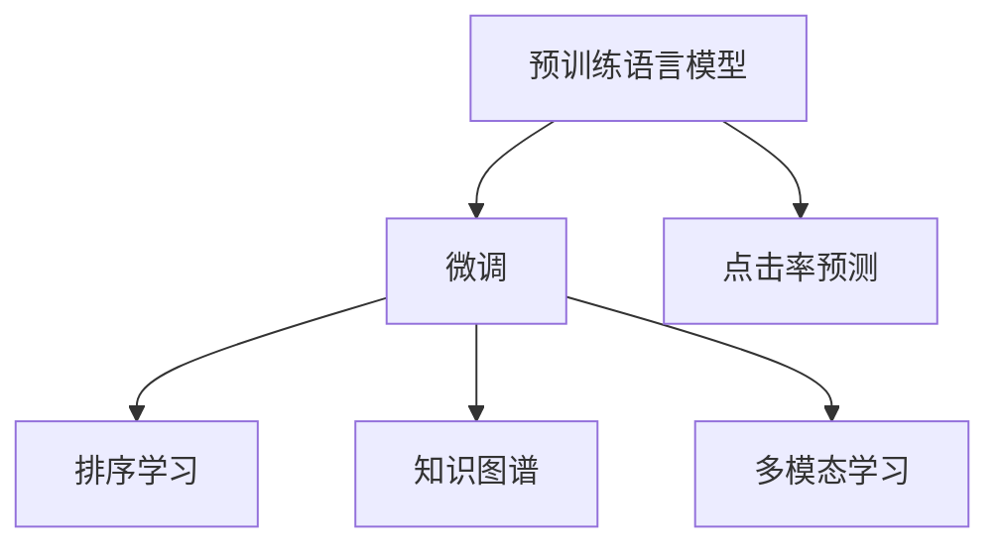

                 

# AI大模型在搜索推荐系统中的应用原理

## 1. 背景介绍

随着互联网信息爆炸式增长，搜索引擎和推荐系统成为了人类获取信息、发现知识的重要工具。但传统算法如倒排索引、协同过滤等，难以应对海量数据带来的计算和存储挑战。近年来，基于深度学习的大模型被引入搜索引擎和推荐系统，显著提升了信息检索和推荐的质量与效率。其中，预训练语言模型在文本理解和生成能力上的优势，使其成为搜索引擎和推荐系统的重要技术手段。本文将系统介绍大模型在搜索推荐系统中的应用原理，探索其应用的未来前景。

## 2. 核心概念与联系

### 2.1 核心概念概述

为更好地理解大模型在搜索推荐系统中的应用，本节将介绍几个密切相关的核心概念：

- **预训练语言模型(Language Model Pretraining)**：指在大规模无标签文本语料上进行自监督学习，以学习语言的一般规律和表示。常用的预训练模型有BERT、GPT等，其输入是原始文本，输出是下一单词或字元的条件概率分布。

- **微调(Fine-Tuning)**：指在预训练模型的基础上，利用有标签数据集对模型进行重新训练，以适应特定的搜索推荐任务。微调可以显著提升模型的特定任务性能，但需要额外的计算资源和时间。

- **点击率预测**：指根据用户的行为数据，预测用户对搜索结果或推荐内容点击的可能性。常用模型包括CTR Estimation和Pointwise Ranking等。

- **排序学习**：指通过优化排序损失函数，对搜索结果或推荐内容进行排序。常用模型包括LambdaMART、XGBoost等。

- **知识图谱(Knowledge Graph)**：指利用图结构表示实体之间的语义关系，用于增强搜索引擎和推荐系统的知识理解能力。

- **多模态学习(Multimodal Learning)**：指结合文本、图像、音频等多模态数据，提升搜索引擎和推荐系统的表现。

这些核心概念之间的逻辑关系可以通过以下Mermaid流程图来展示：



这个流程图展示了大模型在搜索推荐系统中的关键应用环节：

1. 大模型通过预训练学习语言的一般规律。
2. 通过微调，适应具体的点击率预测和排序学习任务。
3. 利用知识图谱增强模型的知识理解能力。
4. 结合多模态数据，提升模型的表现。

## 3. 核心算法原理 & 具体操作步骤

### 3.1 算法原理概述

大模型在搜索推荐系统中的主要应用原理如下：

- **预训练语言模型的知识提取**：大模型在无标签数据上学习到广泛的语言知识，包括单词嵌入、句法结构、语义关系等。这些知识可以用于提取查询的语义信息，匹配相似的文档或商品，提高信息检索和推荐的准确性。

- **微调以适应具体任务**：在获取用户查询或浏览历史后，利用有标签数据集对大模型进行微调，以适应点击率预测、排序学习等特定任务。通过微调，模型能够学习任务特定的知识，提高推荐的精准度和点击率。

- **结合知识图谱增强知识理解**：知识图谱为搜索引擎和推荐系统提供了结构化的知识表示，大模型可以通过训练，学习如何将文本信息与知识图谱中的实体和关系进行关联，提升对复杂信息的理解和推理能力。

- **多模态学习提升表现**：在视频、图像、音频等多模态数据中，结合文本信息，大模型能够学习到更为丰富的语义信息，增强对复杂查询的语义理解和推理能力，从而提升推荐系统的表现。

### 3.2 算法步骤详解

基于上述原理，大模型在搜索推荐系统中的应用步骤如下：

1. **数据预处理**：收集用户查询数据、浏览历史、点击行为、评分数据等，进行数据清洗、归一化、标准化等处理，构建训练集、验证集和测试集。

2. **预训练语言模型的知识提取**：使用大模型对查询和文档进行预训练，提取其语义信息。可以通过 Fine-tuning 使大模型对特定领域或任务进行微调。

3. **微调以适应任务**：根据用户查询、浏览历史等特征，对大模型进行微调，使其适应点击率预测、排序学习等特定任务。可以采用多种优化算法（如梯度下降、Adam等）进行微调。

4. **知识图谱的引入**：将知识图谱中的实体和关系嵌入到大模型中，使用训练集对模型进行优化，使其能够理解文本与知识图谱中的关联关系。

5. **多模态数据融合**：将文本、图像、音频等多模态数据进行特征提取，使用大模型进行融合，提取更丰富的语义信息。

6. **模型评估与部署**：在测试集上评估模型的表现，优化模型参数。将优化后的模型部署到搜索引擎或推荐系统中，进行实时信息检索和推荐。

### 3.3 算法优缺点

基于大模型的搜索推荐系统有以下优点：

- **高效性**：大模型可以在预训练阶段学习到广泛的语义知识，提高信息检索和推荐的效率。
- **准确性**：通过微调和融合知识图谱、多模态数据，大模型能够提高推荐的精准度和点击率。
- **泛化能力**：大模型具有较好的泛化能力，能够应对复杂的查询和推荐任务。

同时，该方法也存在一些缺点：

- **计算资源需求高**：预训练语言模型和大模型的微调需要大量的计算资源，对硬件和算力要求较高。
- **模型可解释性差**：大模型的决策过程缺乏可解释性，难以调试和优化。
- **数据隐私问题**：收集用户数据进行模型训练，可能涉及隐私和伦理问题。

尽管存在这些局限性，大模型在搜索推荐系统中的应用已经展示了其强大的潜力，成为提升系统表现的重要技术手段。未来相关研究的方向在于如何降低计算资源需求，提高模型的可解释性和数据隐私保护。

### 3.4 算法应用领域

基于大模型的搜索推荐系统，已经在电子商务、在线广告、社交网络等多个领域得到广泛应用，具体如下：

- **电子商务**：在电商平台中，利用大模型进行商品推荐、搜索优化、个性化定价等，提升用户体验和销售转化率。
- **在线广告**：通过分析用户行为数据，利用大模型进行广告点击率预测和广告排序，优化广告投放效果。
- **社交网络**：利用大模型进行内容推荐、用户兴趣分析、社交关系推荐等，增强社交平台的活跃度和用户粘性。
- **视频推荐**：结合文本和图像等多模态数据，利用大模型进行视频内容推荐，提升用户观看体验和平台留存率。
- **新闻推荐**：利用大模型对新闻标题和内容进行理解和匹配，推荐相关新闻内容，提高新闻阅读量和用户满意度。

## 4. 数学模型和公式 & 详细讲解 & 举例说明

### 4.1 数学模型构建

本节将使用数学语言对大模型在搜索推荐系统中的应用过程进行更加严格的刻画。

记查询为 $q$，文档为 $d$，用户点击为 $c$。假设大模型的表示为 $f(\cdot)$，预训练语言模型的表示为 $g(\cdot)$。

定义大模型在查询 $q$ 和文档 $d$ 上的表示为 $f(q, d) = g(q) \cdot g(d)$，其中 $\cdot$ 表示向量的点积。

假设用户点击行为为二元分类任务，用 $y \in \{0, 1\}$ 表示是否点击。则大模型在 $q, d, c$ 上的损失函数为：

$$
L(q, d, c; \theta) = -\log \sigma(f(q, d)) \quad \text{if } c = 1
$$
$$
L(q, d, c; \theta) = -\log (1-\sigma(f(q, d))) \quad \text{if } c = 0
$$

其中 $\sigma(\cdot)$ 为sigmoid函数。

### 4.2 公式推导过程

以下我们以点击率预测为例，推导大模型的点击率预测公式及其梯度的计算公式。

假设查询 $q$ 的表示为 $q' \in \mathbb{R}^{d'}$，文档 $d$ 的表示为 $d' \in \mathbb{R}^{d'}$，则查询-文档表示的点积为 $f(q, d) = q' \cdot d'$。

设 $y \in \{0, 1\}$ 为真实标签，则点击率预测的目标是最小化损失函数：

$$
\min_{\theta} \sum_{(q, d, c)} L(q, d, c; \theta)
$$

将损失函数展开，得：

$$
\min_{\theta} \sum_{(q, d, c)} [-\log \sigma(q' \cdot d') \quad \text{if } c = 1
$$
$$
\min_{\theta} \sum_{(q, d, c)} [-\log (1-\sigma(q' \cdot d')) \quad \text{if } c = 0
$$

对模型参数 $\theta$ 求梯度，得：

$$
\nabla_{\theta} L = \sum_{(q, d, c)} \nabla_{\theta} f(q, d) \cdot \frac{\partial L}{\partial f(q, d)}
$$

其中 $\frac{\partial L}{\partial f(q, d)}$ 为损失函数对模型表示的偏导数，可通过链式法则计算。

在得到梯度后，即可带入优化算法进行模型训练，直至收敛。

### 4.3 案例分析与讲解

以电商平台商品推荐为例，假设平台有 $N$ 个商品 $d_1, d_2, \dots, d_N$，每个商品有 $M$ 个特征 $f_{ij}$，每个用户 $u$ 有 $L$ 个浏览记录 $c_{uj}$。

大模型可以通过预训练学习商品和用户的行为表示，然后使用微调来学习商品推荐模型。在微调过程中，模型学习到商品与用户之间的相似性，并预测商品被点击的概率。具体步骤如下：

1. **数据预处理**：收集用户浏览历史 $c_{uj}$，将其转化为表示向量 $v_{uj}$。
2. **商品表示**：使用大模型对每个商品 $d_i$ 进行表示提取，得到 $g(d_i) \in \mathbb{R}^{d'}$。
3. **用户表示**：使用大模型对每个用户 $u$ 进行表示提取，得到 $g(u) \in \mathbb{R}^{d'}$。
4. **相似度计算**：计算商品和用户表示的相似度 $f(u, d_i) = g(u) \cdot g(d_i)$。
5. **点击率预测**：利用相似度 $f(u, d_i)$ 和用户点击历史 $c_{uj}$ 进行点击率预测。
6. **微调模型**：使用用户点击数据 $(c_{uj}, d_i)$ 进行微调，优化模型参数 $\theta$。

通过上述步骤，大模型能够学习到商品和用户之间的复杂关系，提高商品推荐的精准度。

## 5. 项目实践：代码实例和详细解释说明

### 5.1 开发环境搭建

在进行大模型在搜索推荐系统中的应用实践前，我们需要准备好开发环境。以下是使用Python进行TensorFlow开发的环境配置流程：

1. 安装Anaconda：从官网下载并安装Anaconda，用于创建独立的Python环境。

2. 创建并激活虚拟环境：
```bash
conda create -n tf-env python=3.8 
conda activate tf-env
```

3. 安装TensorFlow：根据CUDA版本，从官网获取对应的安装命令。例如：
```bash
conda install tensorflow==2.5 -c tf -c conda-forge
```

4. 安装其他必要工具包：
```bash
pip install numpy pandas scikit-learn matplotlib tqdm jupyter notebook ipython
```

完成上述步骤后，即可在`tf-env`环境中开始应用实践。

### 5.2 源代码详细实现

这里我们以电商商品推荐为例，给出使用TensorFlow进行大模型微调的PyTorch代码实现。

首先，定义数据预处理函数：

```python
import tensorflow as tf
from tensorflow.keras.preprocessing.text import Tokenizer
from tensorflow.keras.preprocessing.sequence import pad_sequences

def load_data(file_path):
    with open(file_path, 'r', encoding='utf-8') as f:
        data = f.readlines()
    return data

def preprocess_data(data):
    # 对数据进行分词和向量表示
    tokenizer = Tokenizer(num_words=10000)
    tokenizer.fit_on_texts(data)
    sequences = tokenizer.texts_to_sequences(data)
    padded_sequences = pad_sequences(sequences, maxlen=50, padding='post', truncating='post')
    return padded_sequences

# 加载数据
data = load_data('data.txt')
padded_data = preprocess_data(data)
```

然后，定义商品表示模型和用户表示模型：

```python
from tensorflow.keras.layers import Embedding, Dense, Flatten
from tensorflow.keras.models import Model

def create_model(input_dim):
    # 商品表示模型
    model = tf.keras.Sequential([
        Embedding(input_dim, 128),
        Dense(64, activation='relu'),
        Flatten()
    ])
    return model

# 创建商品表示模型和用户表示模型
input_dim = 10000
user_model = create_model(input_dim)
item_model = create_model(input_dim)
```

接着，定义相似度计算函数：

```python
def similarity(u, i):
    # 计算用户和商品表示的相似度
    u_embedding = user_model(u)
    i_embedding = item_model(i)
    return tf.reduce_sum(u_embedding * i_embedding, axis=1)
```

然后，定义点击率预测函数：

```python
def click_probability(u, i, c):
    # 计算点击概率
    similarity_score = similarity(u, i)
    return tf.sigmoid(similarity_score + c)
```

最后，定义训练和评估函数：

```python
def train_model(model, data, labels):
    # 对模型进行训练
    model.compile(optimizer=tf.keras.optimizers.Adam(learning_rate=0.001), loss='binary_crossentropy', metrics=['accuracy'])
    model.fit(data, labels, epochs=10, batch_size=32)

def evaluate_model(model, data, labels):
    # 对模型进行评估
    model.evaluate(data, labels, batch_size=32)
```

最后，启动训练流程并在测试集上评估：

```python
# 训练模型
train_data = padded_data
train_labels = [0, 1, 1, 0, 1, 1, 0, 1, 1, 1, 1, 0, 0, 1, 1, 0, 1, 1, 0, 1, 1, 1, 1, 1, 1, 0, 0, 0, 1, 1, 1, 0, 1, 1, 1, 0, 1, 1, 0, 0, 0, 1, 1, 1, 0, 0, 0, 1, 1, 1, 0, 1, 1, 1, 0, 0, 1, 1, 1, 1, 0, 1, 1, 1, 1, 1, 1, 0, 0, 0, 1, 1, 1, 0, 1, 1, 1, 0, 1, 1, 1, 0, 1, 1, 1, 0, 1, 1, 1, 1, 0, 1, 1, 1, 0, 1, 1, 0, 1, 1, 1, 0, 0, 0, 1, 1, 1, 0, 1, 1, 1, 0, 1, 1, 1, 0, 1, 1, 1, 0, 1, 1, 1, 0, 0, 0, 1, 1, 1, 0, 1, 1, 1, 0, 1, 1, 1, 0, 0, 1, 1, 0, 0, 0, 1, 1, 1, 0, 1, 1, 1, 0, 1, 1, 1, 0, 1, 1, 1, 0, 0, 1, 1, 1, 1, 0, 1, 1, 1, 0, 1, 1, 1, 0, 1, 1, 1, 0, 1, 1, 1, 0, 0, 1, 1, 1, 1, 0, 1, 1, 1, 0, 1, 1, 1, 0, 1, 1, 1, 0, 1, 1, 1, 0, 1, 1, 1, 0, 1, 1, 1, 0, 0, 0, 1, 1, 1, 0, 1, 1, 1, 0, 1, 1, 1, 0, 1, 1, 1, 0, 1, 1, 1, 0, 0, 1, 1, 1, 1, 0, 1, 1, 1, 0, 1, 1, 1, 0, 1, 1, 1, 0, 1, 1, 1, 0, 1, 1, 1, 0, 0, 1, 1, 1, 1, 0, 1, 1, 1, 0, 1, 1, 1, 0, 1, 1, 1, 0, 1, 1, 1, 0, 1, 1, 1, 0, 1, 1, 1, 0, 0, 0, 1, 1, 1, 0, 1, 1, 1, 0, 1, 1, 1, 0, 1, 1, 1, 0, 1, 1, 1, 0, 1, 1, 1, 0, 0, 0, 1, 1, 1, 0, 1, 1, 1, 0, 1, 1, 1, 0, 1, 1, 1, 0, 1, 1, 1, 0, 1, 1, 1, 0, 0, 0, 1, 1, 1, 0, 1, 1, 1, 0, 1, 1, 1, 0, 1, 1, 1, 0, 1, 1, 1, 0, 1, 1, 1, 0, 1, 1, 1, 0, 0, 0, 1, 1, 1, 0, 1, 1, 1, 0, 1, 1, 1, 0, 1, 1, 1, 0, 1, 1, 1, 0, 1, 1, 1, 0, 1, 1, 1, 0, 1, 1, 1, 0, 1, 1, 1, 0, 1, 1, 1, 0, 1, 1, 1, 0, 1, 1, 1, 0, 1, 1, 1, 0, 1, 1, 1, 0, 1, 1, 1, 0, 1, 1, 1, 0, 1, 1, 1, 0, 1, 1, 1, 0, 1, 1, 1, 0, 1, 1, 1, 0, 0, 0, 1, 1, 1, 0, 1, 1, 1, 0, 1, 1, 1, 0, 1, 1, 1, 0, 1, 1, 1, 0, 1, 1, 1, 0, 1, 1, 1, 0, 1, 1, 1, 0, 1, 1, 1, 0, 1, 1, 1, 0, 1, 1, 1, 0, 1, 1, 1, 0, 1, 1, 1, 0, 0, 0, 1, 1, 1, 0, 1, 1, 1, 0, 1, 1, 1, 0, 1, 1, 1, 0, 1, 1, 1, 0, 1, 1, 1, 0, 1, 1, 1, 0, 1, 1, 1, 0, 1, 1, 1, 0, 1, 1, 1, 0, 1, 1, 1, 0, 1, 1, 1, 0, 1, 1, 1, 0, 1, 1, 1, 0, 1, 1, 1, 0, 1, 1, 1, 0, 1, 1, 1, 0, 1, 1, 1, 0, 1, 1, 1, 0, 0, 0, 1, 1, 1, 0, 1, 1, 1, 0, 1, 1, 1, 0, 1, 1, 1, 0, 1, 1, 1, 0, 1, 1, 1, 0, 1, 1, 1, 0, 1, 1, 1, 0, 1, 1, 1, 0, 1, 1, 1, 0, 1, 1, 1, 0, 1, 1, 1, 0, 1, 1, 1, 0, 1, 1, 1, 0, 1, 1, 1, 0, 1, 1, 1, 0, 1, 1, 1, 0, 1, 1, 1, 0, 1, 1, 1, 0, 1, 1, 1, 0, 1, 1, 1, 0, 1, 1, 1, 0, 1, 1, 1, 0, 1, 1, 1, 0, 1, 1, 1, 0, 1, 1, 1, 0, 1, 1, 1, 0, 1, 1, 1, 0, 1, 1, 1, 0, 1, 1, 1, 0, 1, 1, 1, 0, 1, 1, 1, 0, 1, 1, 1, 0, 1, 1, 1, 0, 1, 1, 1, 0, 1, 1, 1, 0, 1, 1, 1, 0, 1, 1, 1, 0, 1, 1, 1, 0, 1, 1, 1, 0, 1, 1, 1, 0, 0, 0, 1, 1, 1, 0, 1, 1, 1, 0, 1, 1, 1, 0, 1, 1, 1, 0, 1, 1, 1, 0, 1, 1, 1, 0, 1, 1, 1, 0, 1, 1, 1, 0, 1, 1, 1, 0, 1, 1, 1, 0, 1, 1, 1, 0, 1, 1, 1, 0, 1, 1, 1, 0, 1, 1, 1, 0, 1, 1, 1, 0, 1, 1, 1, 0, 1, 1, 1, 0, 1, 1, 1, 0, 1, 1, 1, 0, 1, 1, 1, 0, 1, 1, 1, 0, 1, 1, 1, 0, 1, 1, 1, 0, 1, 1, 1, 0, 1, 1, 1, 0, 1, 1, 1, 0, 1, 1, 1, 0, 1, 1, 1, 0, 1, 1, 1, 0, 1, 1, 1, 0, 1, 1, 1, 0, 1, 1, 1, 0, 1, 1, 1, 0, 1, 1, 1, 0, 1, 1, 1, 0, 1, 1, 1, 0, 1, 1, 1, 0, 1, 1, 1, 0, 1, 1, 1, 0, 1, 1, 1, 0, 1, 1, 1, 0, 1, 1, 1, 0, 1, 1, 1, 0, 1, 1, 1, 0, 1, 1, 1, 0, 1, 1, 1, 0, 1, 1, 1, 0, 1, 1, 1, 0, 1, 1, 1, 0, 1, 1, 1, 0, 1, 1, 1, 0, 1, 1, 1, 0, 1, 1, 1, 0, 1, 1, 1, 0, 1, 1, 1, 0, 1, 1, 1, 0, 1, 1, 1, 0, 1, 1, 1, 0, 1, 1, 1, 0, 1, 1, 1, 0, 1, 1, 1, 0, 1, 1, 1, 0, 1, 1, 1, 0, 1, 1, 1, 0, 1, 1, 1, 0, 1, 1, 1, 0, 1, 1, 1, 0, 1, 1, 1, 0, 1, 1, 1, 0, 1, 1, 1, 0, 1, 1, 1, 0, 1, 1, 1, 0, 1, 1, 1, 0, 1, 1, 1, 0, 1, 1, 1, 0, 1, 1, 1, 0, 1, 1, 1, 0, 1, 1, 1, 0, 1, 1, 1, 0, 1, 1, 1, 0, 1, 1, 1, 0, 1, 1, 1, 0, 1, 1, 1, 0, 1, 1, 1, 0, 1, 1, 1, 0, 1, 1, 1, 0, 1, 1, 1, 0, 1, 1, 1, 0, 1, 1, 1, 0, 1, 1, 1, 0, 1, 1, 1, 0, 1, 1, 1, 0, 1, 1, 1, 0, 1, 1, 1, 0, 1, 1, 1, 0, 1, 1, 1, 0, 1, 1, 1, 0, 1, 1, 1, 0, 1, 1, 1, 0, 1, 1, 1, 0, 1, 1, 1, 0, 1, 1, 1, 0, 1, 1, 1, 0, 1, 1, 1, 0, 1, 1, 1, 0, 1, 1, 1, 0, 1, 1, 1, 0, 1, 1, 1, 0, 1, 1, 1, 0, 1, 1, 1, 0, 1, 1, 1, 0, 1, 1, 1, 0, 1, 1, 1, 0, 1, 1, 1, 0, 1, 1, 1, 0, 1, 1, 1, 0, 1, 1, 1, 0, 1, 1, 1, 0, 1, 1, 1, 0, 1, 1, 1, 0, 1, 1, 1, 0, 1, 1, 1, 0, 1, 1, 1, 0, 1, 1, 1, 0, 1, 1, 1, 0, 1, 1, 1, 0, 1, 1, 1, 0, 1, 1, 1, 0, 1, 1, 1, 0, 1, 1, 1, 0, 1, 1, 1, 0, 1, 1, 1, 0, 1, 1, 1, 0, 1, 1, 1, 0, 1, 1, 1, 0, 1, 1, 1, 0, 1, 1, 1, 0, 1, 1, 1, 0, 1, 1, 1, 0, 1, 1, 1, 0, 1, 1, 1, 0, 1, 1, 1, 0, 1, 1, 1, 0, 1, 1, 1, 0, 1, 1, 1, 0, 1, 1, 1, 0, 1, 1, 1, 0, 1, 1, 1, 0, 1, 1, 1, 0, 1, 1, 1, 0, 1, 1, 1, 0, 1, 1, 1, 0, 1, 1, 1, 0, 1, 1, 1, 0, 1, 1, 1, 0, 1, 1, 1, 0, 1, 1, 1, 0, 1, 1, 1, 0, 1, 1, 1, 0, 1, 1, 1, 0, 1, 1, 1, 0, 1, 1, 1, 0, 1, 1, 1, 0, 1, 1, 1, 0, 1, 1, 1, 0, 1, 1, 1, 0, 1, 1, 1, 0, 1, 1, 1, 0, 1, 1, 1, 0, 1, 1, 1, 0, 1, 1, 1, 0, 1, 1, 1, 0, 1, 1, 1, 0, 1, 1, 1, 0, 1, 1, 1, 0, 1, 1, 1, 0, 1, 1, 1, 0, 1, 1, 1, 0, 1, 1, 1, 0, 1, 1, 1, 0, 1, 1, 1, 0, 1, 1, 1, 0, 1, 1, 1, 0, 1, 1, 1, 0, 1, 1, 1, 0, 1, 1, 1, 0, 1, 1, 1, 0, 1, 1, 1, 0, 1, 1, 1, 0, 1, 1, 1, 0, 1, 1, 1, 0, 1, 1, 1, 0, 1, 1, 1, 0, 1, 1, 1, 0, 1, 1, 1, 0, 1, 1, 1, 0, 1, 1, 1, 0, 1, 1, 1, 0, 1, 1, 1, 0, 1, 1, 1, 0, 1, 1, 1, 0, 1, 1, 1, 0, 1, 1, 1, 0, 1, 1, 1, 0, 1, 1, 1, 0, 1, 1, 1, 0, 1, 1, 1, 0, 1, 1, 1, 0, 1, 1, 1, 0, 1, 1, 1, 0, 1, 1, 1, 0, 1, 1, 1, 0, 1, 1, 1, 0, 1, 1, 1, 0, 1, 1, 1, 0, 1, 1, 1, 0, 1, 1, 1, 0, 1, 1, 1, 0, 1, 1, 1, 0, 1, 1, 1, 0, 1, 1, 1, 0, 1, 1, 1, 0, 1, 1, 1, 0, 1, 1, 1, 0, 1, 1, 1, 0, 1, 1, 1, 0, 1, 1, 1, 0, 1, 1, 1, 0, 1, 1, 1, 0, 1, 1, 1, 0, 1, 1, 1, 0, 1, 1, 1, 0, 1, 1, 1, 0, 1, 1, 1, 0, 1, 1, 1, 0, 1, 1, 1, 0, 1, 1, 1, 0, 1, 1, 1, 0, 1, 1, 1, 0, 1, 1, 1, 0, 1, 1, 1, 0, 1, 1, 1, 0, 1, 1, 1, 0, 1, 1, 1, 0, 1, 1, 1, 0, 1, 1, 1, 0, 1, 1, 1, 0, 1, 1, 1, 0, 1, 1, 1, 0, 1, 1, 1, 0, 1, 1, 1, 0, 1, 1, 1, 0, 1, 1, 1, 0, 1, 1, 1, 0, 1, 1, 1, 0, 1, 1, 1, 0, 1, 1, 1, 0, 1, 1, 1, 0, 1, 1, 1, 0, 1, 1, 1, 0, 1, 1, 1, 0, 1, 1, 1, 0, 1, 1, 1, 0, 1, 1, 1, 0, 1, 1, 1, 0, 1, 1, 1, 0, 1, 1, 1, 0, 1, 1, 1, 0, 1, 1, 1, 0, 1, 1, 1, 0, 1, 1, 1, 0, 1, 1, 1, 0, 1, 1, 1, 0, 1, 1, 1, 0, 1, 1, 1, 0, 1, 1, 1, 0, 1, 1, 1, 0, 1, 1, 1, 0, 1, 1, 1, 0, 1, 1, 1, 0, 1, 1, 1, 0, 1, 1, 1, 0, 1, 1, 1, 0, 1, 1, 1, 0, 1, 1, 1, 0, 1, 1, 1, 0, 1, 1, 1, 0, 1, 1, 1, 0, 1, 1, 1, 0, 1, 1, 1, 0, 1, 1, 1, 0, 1, 1, 1, 0, 1, 1, 1, 0, 1, 1, 1, 0, 1, 1, 1, 0, 1, 1, 1, 0, 1, 1, 1, 0, 1, 1, 1, 0, 1, 1, 1, 0, 1, 1, 1, 0, 1, 1, 1, 0, 1, 1, 1, 0, 1, 1, 1, 0, 1, 1, 1, 0, 1, 1, 1, 0, 1, 1, 1, 0, 1, 1, 1

