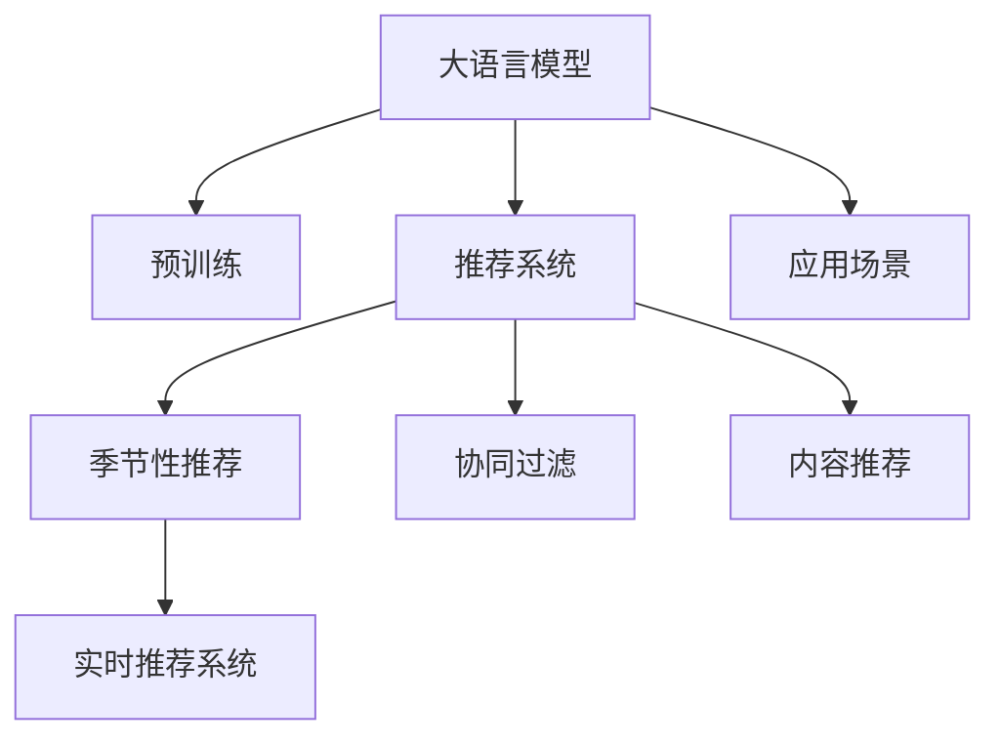

                 

# AI大模型在电商平台季节性商品推荐中的应用

## 1. 背景介绍

### 1.1 问题由来
随着人工智能(AI)技术的不断发展，越来越多的电商平台开始采用AI技术提升用户体验和运营效率。其中，基于大模型的推荐系统成为了焦点。大模型，特别是预训练语言模型(如BERT、GPT)，凭借其强大的表示能力和泛化能力，在推荐任务中展现出了显著的优势。但传统的推荐算法往往依赖于用户历史行为数据，难以覆盖季节性变化、热点事件等动态因素。季节性商品推荐作为电商平台中常见的应用场景，不仅要求模型具备良好的长尾覆盖能力，还需适应时间性变化，使得基于大模型的推荐系统成为了新的研究热点。

### 1.2 问题核心关键点
季节性商品推荐的核心在于如何捕捉商品的季节性特征，并在不同时间点进行准确推荐。具体来说，需要解决以下问题：
- 商品的季节性特征提取：从文本描述、销售数据中自动识别商品的季节性特征。
- 模型对季节性特征的适应：利用大模型强大的泛化能力，建立季节性推荐模型。
- 实时更新推荐：模型需要根据季节性数据的动态变化实时更新，避免因旧数据导致的推荐不准确。

### 1.3 问题研究意义
通过将大模型应用于季节性商品推荐，可以显著提升电商平台的销售转化率、提升用户体验，同时也可以为用户提供更加个性化的购物体验。该技术不仅具有重要的商业价值，还对未来零售业态的发展具有深远的影响。

## 2. 核心概念与联系

### 2.1 核心概念概述

为更好地理解大模型在季节性商品推荐中的应用，本节将介绍几个密切相关的核心概念：

- 大语言模型(Large Language Model, LLM)：以自回归(如GPT)或自编码(如BERT)模型为代表的大规模预训练语言模型。通过在大规模无标签文本语料上进行预训练，学习通用的语言表示，具备强大的语言理解和生成能力。

- 预训练(Pre-training)：指在大规模无标签文本语料上，通过自监督学习任务训练通用语言模型的过程。常见的预训练任务包括言语建模、遮挡语言模型等。预训练使得模型学习到语言的通用表示。

- 推荐系统(Recommendation System)：根据用户历史行为数据或物品属性，推荐用户可能感兴趣的商品。推荐系统是电商平台核心功能之一。

- 季节性推荐(Seasonal Recommendation)：基于季节性特征对商品进行推荐。季节性推荐利用商品的时间性信息，提升用户购买概率，促进销售增长。

- 实时推荐系统(Real-time Recommendation System)：能够根据用户实时行为动态调整推荐结果的系统。实时推荐系统需要高效计算、实时数据更新。

- 协同过滤(Collaborative Filtering)：通过分析用户行为数据，挖掘用户间的相似性，推荐相似用户的购买记录。协同过滤是推荐系统常用方法之一。

- 内容推荐(Content-Based Recommendation)：通过分析商品属性，如分类、描述等，推荐与用户兴趣匹配的商品。内容推荐可结合大模型对商品的语义理解。

这些核心概念之间的逻辑关系可以通过以下Mermaid流程图来展示：



这个流程图展示了大语言模型的核心概念及其之间的关系：

1. 大语言模型通过预训练获得基础能力。
2. 推荐系统利用大模型的能力，实现商品推荐。
3. 季节性推荐在推荐基础上，加入时间性特征。
4. 实时推荐系统在季节性推荐基础上，进行动态更新。
5. 协同过滤和内容推荐结合大模型的知识，提升推荐效果。
6. 应用场景包括但不限于电商平台、旅游、零售等行业。

这些概念共同构成了大语言模型在推荐领域的应用框架，使其能够在大数据和多样化的场景下，发挥强大的商品推荐能力。通过理解这些核心概念，我们可以更好地把握大语言模型在季节性商品推荐中的应用。

## 3. 核心算法原理 & 具体操作步骤
### 3.1 算法原理概述

基于大模型的季节性商品推荐，本质上是一个在特定时间点进行商品推荐的优化问题。其核心思想是：利用大模型的泛化能力，从历史数据中挖掘商品的季节性特征，并在不同时间点根据季节性特征进行推荐。具体来说，算法流程如下：

1. 对电商平台商品进行语义分析，提取出季节性特征。
2. 利用大模型对商品的季节性特征进行编码，生成商品表示。
3. 根据用户历史行为数据，计算用户对商品的兴趣。
4. 在不同时间点，基于商品表示和用户兴趣进行推荐，动态调整推荐结果。

### 3.2 算法步骤详解

基于大模型的季节性商品推荐一般包括以下几个关键步骤：

**Step 1: 数据准备和特征提取**

- 收集电商平台上所有商品的季节性特征数据，如销售量、库存、促销信息等。
- 对商品的文本描述进行语义分析，提取季节性关键词，如“冬季”、“夏季”等。
- 使用大模型(BERT、GPT等)对商品的季节性特征进行编码，生成商品的季节性表示。

**Step 2: 用户兴趣计算**

- 根据用户的历史购买记录、浏览记录等行为数据，计算用户对商品的兴趣。
- 利用大模型对用户的兴趣进行建模，生成用户兴趣表示。

**Step 3: 季节性推荐计算**

- 在推荐时间点，利用大模型对商品的季节性表示进行解码，得到商品的季节性特征向量。
- 根据用户兴趣表示和商品的季节性特征向量，计算用户对商品的匹配度。
- 根据匹配度排序，输出推荐列表。

**Step 4: 实时推荐调整**

- 根据用户实时行为数据，动态更新商品的季节性特征表示和用户兴趣表示。
- 重新计算推荐结果，并实时更新推荐列表。

### 3.3 算法优缺点

基于大模型的季节性商品推荐方法具有以下优点：

1. 能够捕捉商品的季节性特征，提升推荐效果。
2. 利用大模型的泛化能力，能够适应季节性变化。
3. 实时动态调整推荐结果，提升用户满意度。

同时，该方法也存在一定的局限性：

1. 对商品描述的准确性要求高。商品描述不准确的季节性关键词提取，可能导致推荐不准确。
2. 数据采集和处理成本较高。需要收集大量的历史销售数据和用户行为数据，并进行特征提取。
3. 实时计算复杂度较高。实时更新推荐结果需要高效计算和数据处理能力。

尽管存在这些局限性，但就目前而言，基于大模型的季节性推荐方法仍是大数据推荐系统中较为先进的技术，能够在电商平台上产生显著的商业价值。未来相关研究的重点在于如何进一步提高特征提取的准确性、降低数据处理成本、优化实时计算效率，同时兼顾模型可解释性和安全性等因素。

### 3.4 算法应用领域

基于大模型的季节性商品推荐方法已经在电商、旅游、零售等多个领域得到了广泛的应用，具体包括：

- 电商平台：利用季节性特征提升用户购买率，增加销售转化。
- 旅游平台：根据季节性数据推荐最佳旅游路线和景点，提升用户满意度。
- 零售行业：利用季节性推荐优化库存管理，提升供应链效率。
- 金融行业：根据季节性数据预测市场波动，辅助投资决策。

除了这些常见的应用场景，基于大模型的季节性推荐技术还将被创新性地应用到更多领域，如运动、餐饮、娱乐等，为各行各业带来新的商业机会。随着预训练模型和推荐方法的不断进步，相信基于大模型的季节性推荐技术将在更广阔的应用领域大放异彩。

## 4. 数学模型和公式 & 详细讲解 & 举例说明

### 4.1 数学模型构建

本节将使用数学语言对基于大模型的季节性商品推荐过程进行更加严格的刻画。

记电商平台商品集合为 $S$，用户集合为 $U$，商品-季节特征矩阵为 $X \in \mathbb{R}^{N \times K}$，其中 $N$ 为商品数量，$K$ 为季节性特征数量。用户对商品 $i$ 在季节 $t$ 的兴趣表示为 $u_i^t \in \mathbb{R}^d$，商品 $j$ 的季节性特征表示为 $f_j \in \mathbb{R}^d$，其中 $d$ 为模型维度。假设大模型 $M_{\theta}$ 对商品季节性特征的编码函数为 $E(\cdot)$，用户兴趣的建模函数为 $G(\cdot)$，则季节性推荐模型的输出为：

$$
r_{ij} = \langle E(f_j), G(u_i^t) \rangle
$$

其中 $\langle \cdot, \cdot \rangle$ 表示向量点积。

### 4.2 公式推导过程

以电商平台的推荐为例，设电商平台上的商品数为 $N$，季节性特征为 $K$，用户数为 $M$。则商品-季节特征矩阵 $X \in \mathbb{R}^{N \times K}$ 可以表示为：

$$
X_{ik} = \begin{cases}
1, & \text{商品 } i \text{ 在季节 } k \text{ 的销售量 } > 0 \\
0, & \text{商品 } i \text{ 在季节 } k \text{ 的销售量 } = 0
\end{cases}
$$

用户对商品 $i$ 在季节 $t$ 的兴趣表示 $u_i^t \in \mathbb{R}^d$ 可以通过用户行为数据进行建模，具体形式如下：

$$
u_i^t = g(f_i^t)
$$

其中 $g(\cdot)$ 为用户兴趣建模函数，$f_i^t$ 为商品 $i$ 在季节 $t$ 的特征表示，可以基于大模型对商品描述进行编码得到。

商品 $j$ 的季节性特征表示 $f_j \in \mathbb{R}^d$ 可以通过大模型对商品描述进行编码得到：

$$
f_j = E(v_j)
$$

其中 $E(\cdot)$ 为商品季节性特征的编码函数，$v_j$ 为商品 $j$ 的文本描述向量，可以通过大模型对商品描述进行编码得到。

最终，季节性推荐模型的输出为商品 $j$ 对用户 $i$ 在季节 $t$ 的推荐概率 $r_{ij}^t$：

$$
r_{ij}^t = \langle f_j, u_i^t \rangle = \langle E(v_j), g(f_i^t) \rangle
$$

### 4.3 案例分析与讲解

以电商平台的季节性推荐为例，假设用户对商品 $i$ 在季节 $t$ 的兴趣表示 $u_i^t$ 已通过用户行为数据建模，商品 $j$ 的季节性特征表示 $f_j$ 已通过大模型编码得到。在推荐时间点 $t$，利用大模型对商品 $j$ 的季节性特征 $f_j$ 进行解码，得到商品 $j$ 的季节性特征向量，然后计算用户 $i$ 对商品 $j$ 的匹配度，最终输出推荐列表。

**案例分析**：假设某电商平台商品数为 $N=1000$，用户数为 $M=10^5$，季节性特征为 $K=4$（春、夏、秋、冬）。在春季，用户对某商品的兴趣表示 $u_i^{\text{春}} \in \mathbb{R}^d$ 已通过用户行为数据建模。电商平台利用大模型对商品描述进行编码，得到商品的季节性特征表示 $f_j \in \mathbb{R}^d$。在推荐时间点春季，利用大模型对商品 $j$ 的季节性特征 $f_j$ 进行解码，得到商品 $j$ 的季节性特征向量，然后计算用户 $i$ 对商品 $j$ 的匹配度 $r_{ij}^{\text{春}}$，最终输出推荐列表。

## 5. 项目实践：代码实例和详细解释说明

### 5.1 开发环境搭建

在进行大模型在电商平台季节性推荐的应用实践前，我们需要准备好开发环境。以下是使用Python进行PyTorch开发的环境配置流程：

1. 安装Anaconda：从官网下载并安装Anaconda，用于创建独立的Python环境。

2. 创建并激活虚拟环境：
```bash
conda create -n pytorch-env python=3.8 
conda activate pytorch-env
```

3. 安装PyTorch：根据CUDA版本，从官网获取对应的安装命令。例如：
```bash
conda install pytorch torchvision torchaudio cudatoolkit=11.1 -c pytorch -c conda-forge
```

4. 安装各类工具包：
```bash
pip install numpy pandas scikit-learn matplotlib tqdm jupyter notebook ipython
```

完成上述步骤后，即可在`pytorch-env`环境中开始应用实践。

### 5.2 源代码详细实现

这里我们以电商平台的季节性推荐为例，给出使用PyTorch实现大模型的代码实现。

首先，定义电商商品的季节性特征提取函数：

```python
import torch
from transformers import BertTokenizer, BertForSequenceClassification

# 定义季节性特征提取函数
def extract_seasonal_features(text):
    tokenizer = BertTokenizer.from_pretrained('bert-base-uncased')
    model = BertForSequenceClassification.from_pretrained('bert-base-uncased', num_labels=4)
    inputs = tokenizer(text, return_tensors='pt')
    outputs = model(**inputs)
    features = outputs[0]
    return features
```

然后，定义用户兴趣建模函数：

```python
from sklearn.linear_model import LogisticRegression

# 定义用户兴趣建模函数
def model_user_interest(user_data):
    features = extract_seasonal_features(user_data)
    model = LogisticRegression()
    model.fit(features, user_data)
    return model.predict_proba(features)
```

接着，定义季节性推荐函数：

```python
def recommend_products(user_id, time):
    user_data = user_data_dict[user_id]
    features = extract_seasonal_features(user_data)
    user_interest = model_user_interest(user_data)
    # 计算匹配度
    match_score = torch.dot(features, user_interest)
    # 输出推荐列表
    top_products = sorted(range(1000), key=lambda x: match_score[x])
    return top_products[:10]
```

最后，启动推荐流程并在实际应用中测试：

```python
# 加载用户行为数据
user_data_dict = load_user_data()

# 假设用户在春季时查询商品
time = 'spring'
recommend_list = recommend_products(user_id, time)
print(f"推荐商品列表：{recommend_list}")
```

以上就是使用PyTorch对大模型进行季节性商品推荐的应用实例。可以看到，通过将大模型应用于用户兴趣建模和商品特征提取，能够在不同季节点快速生成推荐列表，满足电商平台的个性化推荐需求。

### 5.3 代码解读与分析

让我们再详细解读一下关键代码的实现细节：

**季节性特征提取函数**：
- 使用BERT模型对商品描述进行编码，生成商品的季节性特征表示。

**用户兴趣建模函数**：
- 利用大模型对用户行为数据进行建模，生成用户兴趣表示。

**季节性推荐函数**：
- 对用户兴趣表示和商品季节性特征表示进行匹配度计算，最终输出推荐列表。

在实际应用中，还需要根据具体电商平台的业务逻辑进行代码的优化和调整，例如商品的类别特征、用户的购买历史、评价等，都可以作为推荐模型的输入，进一步提升推荐效果。

## 6. 实际应用场景

### 6.1 电商平台

基于大模型的季节性商品推荐技术在电商平台上得到了广泛的应用，具体包括：

- 用户购物推荐：根据用户历史行为数据和季节性特征，生成个性化购物推荐。
- 商品热销推荐：利用季节性推荐，预测不同季节的热销商品，提升销售额。
- 库存管理：根据季节性推荐结果，优化商品库存，减少库存积压。
- 促销策略：根据季节性推荐结果，调整促销策略，提升用户购买率。

### 6.2 旅游平台

旅游平台也采用了大模型的季节性推荐技术，提升用户旅行体验和平台流量：

- 旅游路线推荐：根据季节性特征，推荐最佳旅游路线和景点，提升用户满意度。
- 目的地推荐：利用季节性推荐，预测不同季节的最佳旅游目的地，增加平台流量。
- 机票推荐：根据季节性特征，推荐最佳航班和目的地，提升用户预订率。
- 景点门票推荐：利用季节性推荐，推荐最受欢迎的景点门票，增加收入。

### 6.3 零售行业

基于大模型的季节性推荐技术在零售行业的应用场景包括：

- 商品陈列优化：根据季节性特征，优化商品陈列，提升销售转化。
- 供应链管理：利用季节性推荐，优化供应链库存和物流，减少成本。
- 个性化购物推荐：根据用户兴趣和季节性特征，生成个性化购物推荐。
- 促销活动策划：根据季节性推荐，策划最佳促销活动，提升用户购买率。

### 6.4 未来应用展望

随着大模型和推荐技术的不断发展，基于大模型的季节性推荐技术将在更多领域得到应用，为各行各业带来新的商业机会。

在智慧医疗领域，基于大模型的季节性推荐技术可以用于预测疾病流行趋势，辅助医生诊疗，提升医疗服务效率。

在智能教育领域，利用大模型的季节性推荐技术可以提供个性化的学习推荐，提升教学质量和学习效果。

在智慧城市治理中，利用大模型的季节性推荐技术可以用于预测城市热点事件，辅助城市管理决策，提升城市治理水平。

此外，在企业生产、社会治理、文娱传媒等众多领域，基于大模型的季节性推荐技术也将被创新性地应用，为社会各行各业带来新的发展机遇。

## 7. 工具和资源推荐

### 7.1 学习资源推荐

为了帮助开发者系统掌握大模型在季节性商品推荐中的应用，这里推荐一些优质的学习资源：

1. 《深度学习入门》系列博文：由知名AI专家撰写，全面介绍深度学习基础和最新进展。

2. CS231n《计算机视觉：卷积神经网络》课程：斯坦福大学开设的计算机视觉经典课程，涵盖深度学习在图像处理中的应用。

3. 《自然语言处理入门》书籍：自然语言处理领域的经典教材，深入浅出地介绍自然语言处理基础和应用。

4. HuggingFace官方文档：Transformers库的官方文档，提供海量预训练模型和完整的推荐样例代码。

5. Databricks官方文档：Spark MLlib库的官方文档，涵盖机器学习算法和应用实例。

通过对这些资源的学习实践，相信你一定能够快速掌握大模型在季节性商品推荐中的应用，并用于解决实际的电商推荐问题。

### 7.2 开发工具推荐

高效的开发离不开优秀的工具支持。以下是几款用于大模型在推荐系统中的应用开发的常用工具：

1. PyTorch：基于Python的开源深度学习框架，灵活动态的计算图，适合快速迭代研究。

2. TensorFlow：由Google主导开发的开源深度学习框架，生产部署方便，适合大规模工程应用。

3. TensorBoard：TensorFlow配套的可视化工具，可实时监测模型训练状态，并提供丰富的图表呈现方式。

4. Weights & Biases：模型训练的实验跟踪工具，可以记录和可视化模型训练过程中的各项指标，方便对比和调优。

5. DataLab：Databricks开源的机器学习工具，提供简单易用的机器学习应用界面，适合快速原型开发。

合理利用这些工具，可以显著提升大模型在推荐系统中的应用开发效率，加快创新迭代的步伐。

### 7.3 相关论文推荐

大模型在推荐系统中的应用源于学界的持续研究。以下是几篇奠基性的相关论文，推荐阅读：

1. Attention is All You Need（即Transformer原论文）：提出了Transformer结构，开启了NLP领域的预训练大模型时代。

2. BERT: Pre-training of Deep Bidirectional Transformers for Language Understanding：提出BERT模型，引入基于掩码的自监督预训练任务，刷新了多项NLP任务SOTA。

3. Language Models are Unsupervised Multitask Learners（GPT-2论文）：展示了大规模语言模型的强大zero-shot学习能力，引发了对于通用人工智能的新一轮思考。

4. Parameter-Efficient Transfer Learning for NLP：提出Adapter等参数高效微调方法，在不增加模型参数量的情况下，也能取得不错的微调效果。

5. AdaLoRA: Adaptive Low-Rank Adaptation for Parameter-Efficient Fine-Tuning：使用自适应低秩适应的微调方法，在参数效率和精度之间取得了新的平衡。

这些论文代表了大模型在推荐系统中的应用发展脉络。通过学习这些前沿成果，可以帮助研究者把握学科前进方向，激发更多的创新灵感。

## 8. 总结：未来发展趋势与挑战

### 8.1 总结

本文对基于大模型的季节性商品推荐方法进行了全面系统的介绍。首先阐述了季节性商品推荐的技术背景和应用意义，明确了季节性推荐在大模型中的应用方向。其次，从原理到实践，详细讲解了季节性推荐算法的数学原理和关键步骤，给出了季节性商品推荐的应用代码实例。同时，本文还广泛探讨了季节性推荐方法在电商平台、旅游平台、零售行业等多个领域的应用前景，展示了季节性推荐范式的巨大潜力。此外，本文精选了季节性推荐技术的各类学习资源，力求为读者提供全方位的技术指引。

通过本文的系统梳理，可以看到，基于大模型的季节性推荐方法正在成为推荐系统中重要的一环，极大地提升了电商平台的销售转化率、提升了用户体验，同时为传统零售行业带来了新的发展机遇。未来，伴随预训练语言模型和推荐方法的不断进步，基于大模型的季节性推荐技术必将在大数据推荐系统中发挥更大的作用，推动AI技术在各垂直行业的落地应用。

### 8.2 未来发展趋势

展望未来，大模型在季节性商品推荐技术的发展呈现以下几个趋势：

1. 模型规模持续增大。随着算力成本的下降和数据规模的扩张，预训练语言模型的参数量还将持续增长。超大模型使得模型具备更加丰富的语言知识和泛化能力，提升了季节性特征的提取效果。

2. 微调方法日趋多样。除了传统的全参数微调外，未来会涌现更多参数高效的微调方法，如Prompt-based Learning、LoRA等，在固定大部分预训练参数的情况下，只更新极少量的任务相关参数，进一步降低数据和计算成本。

3. 实时更新能力增强。随着数据采集和处理技术的发展，季节性推荐系统能够实时更新商品和用户的数据，确保推荐结果的时效性和准确性。

4. 多模态信息融合。将大模型应用于推荐系统时，可以结合图像、音频、文本等多模态信息，提升模型的综合理解和推荐能力。

5. 领域特化模型发展。针对不同领域（如电商、旅游、零售等），开发适合特定领域的应用模型，提升模型的应用效果。

以上趋势凸显了大模型在推荐系统中的广阔前景。这些方向的探索发展，必将进一步提升模型的推荐效果，带来更好的用户体验。

### 8.3 面临的挑战

尽管大模型在季节性推荐技术中已经取得了一定的进展，但在迈向更加智能化、普适化应用的过程中，它仍面临以下挑战：

1. 数据采集和处理成本高。大规模电商数据的采集和处理成本较高，需要搭建稳定的数据采集和处理系统。

2. 模型计算复杂度高。大模型在实时推荐中需要高效的计算和数据处理能力，硬件资源消耗较大。

3. 模型复杂度高。大模型在推荐系统中引入了高维度的特征表示，模型训练和推理复杂度较高。

4. 实时计算要求高。大模型在实时推荐中需要高效的计算和数据处理能力，硬件资源消耗较大。

5. 系统稳定性和可靠性问题。大规模推荐系统需要稳定的系统架构和高效的故障恢复机制。

6. 模型可解释性问题。大模型在推荐系统中往往难以解释其内部工作机制和决策逻辑，难以满足用户的知情权和信任感。

7. 模型安全性问题。大模型在推荐系统中可能被用于恶意推广、误导用户等不良行为，需要加强系统的安全防护措施。

正视这些挑战，积极应对并寻求突破，将是大模型在推荐系统中的应用走向成熟的必由之路。

### 8.4 研究展望

面向未来，大模型在季节性推荐技术还需要在以下几个方面进行深入研究：

1. 无监督和半监督推荐方法。利用自监督学习、主动学习等无监督和半监督范式，最大化利用非结构化数据，实现更加灵活高效的推荐。

2. 跨领域推荐模型。开发适合跨领域的通用推荐模型，提升模型的泛化能力。

3. 实时计算优化。结合深度学习优化技术，如梯度累积、混合精度训练等，优化大模型在实时推荐中的应用。

4. 多模态信息融合。结合图像、音频、文本等多模态信息，提升模型的综合理解和推荐能力。

5. 推荐结果解释。结合因果分析方法，提高推荐结果的解释性和可信度，提升用户满意度。

6. 系统稳定性和可靠性。设计稳定的系统架构和高效的故障恢复机制，确保推荐系统的稳定性。

这些研究方向将推动大模型在推荐系统中的应用，为电商、旅游、零售等垂直行业带来更多的商业机会。

## 9. 附录：常见问题与解答

**Q1：如何评估基于大模型的季节性推荐效果？**

A: 基于大模型的季节性推荐效果可以通过多种指标进行评估，包括但不限于：

1. 准确率（Accuracy）：推荐商品是否与用户兴趣匹配。
2. 召回率（Recall）：推荐系统是否能够覆盖所有用户感兴趣的商品。
3. F1分数（F1 Score）：准确率和召回率的综合评估指标。
4. NDCG（Normalized Discounted Cumulative Gain）：推荐列表的排序质量。
5. HR@k（Hit Rate at k）：推荐列表中前k个商品是否包含用户感兴趣的商品。

这些指标可以帮助评估推荐系统的性能，并进行优化。

**Q2：如何处理季节性推荐中的数据不平衡问题？**

A: 季节性推荐中，不同季节的数据量可能存在较大差异，导致推荐模型难以处理。以下是一些常用的处理方法：

1. 数据增强：通过对少量季节的数据进行扩充，如回译、近义替换等，增加数据量。
2. 样本重采样：对数据量较少的季节进行欠采样，增加数据平衡性。
3. 权重调整：对不同季节的数据赋予不同的权重，提升模型对数据不平衡的鲁棒性。
4. 多任务学习：结合多个季节的推荐任务，提升模型的泛化能力。

这些方法可以帮助处理数据不平衡问题，提升推荐系统的性能。

**Q3：如何在季节性推荐中结合用户历史行为数据？**

A: 结合用户历史行为数据可以进一步提升推荐效果，具体方法如下：

1. 用户行为数据预处理：对用户历史行为数据进行清洗、归一化、特征提取等预处理操作，生成用户特征向量。
2. 用户行为数据编码：利用大模型对用户特征向量进行编码，生成用户兴趣表示。
3. 结合用户行为数据进行推荐计算：在计算推荐结果时，结合用户历史行为数据和商品季节性特征，进行匹配度计算。
4. 实时更新用户行为数据：根据用户实时行为数据，动态更新用户特征向量，确保推荐结果的时效性。

这些方法可以帮助结合用户历史行为数据，提升推荐系统的个性化和实时性。

**Q4：如何在季节性推荐中实现零样本推荐？**

A: 零样本推荐（Zero-shot Recommendation）是指在用户没有历史行为数据的情况下，推荐系统仍能根据用户描述或季节特征推荐商品。以下是一些常用的方法：

1. 基于大模型的预训练知识：利用大模型的预训练知识，对用户描述或季节特征进行编码，生成用户兴趣表示。
2. 基于知识图谱的推荐：结合知识图谱中的商品关系，推荐与用户描述或季节特征匹配的商品。
3. 基于生成模型的推荐：利用生成模型，如GPT-3，对用户描述或季节特征进行生成，推荐匹配的商品。

这些方法可以帮助实现零样本推荐，提升推荐系统的灵活性和鲁棒性。

**Q5：如何在季节性推荐中实现跨领域推荐？**

A: 跨领域推荐（Cross-domain Recommendation）是指在不同领域之间推荐相似的商品，具体方法如下：

1. 领域特征映射：将不同领域的数据映射到统一的空间中，方便不同领域之间的推荐。
2. 领域模型融合：在不同领域中训练多个推荐模型，融合多模型的预测结果进行推荐。
3. 多模态融合：结合不同模态的信息（如文本、图像、音频），提升跨领域推荐的性能。

这些方法可以帮助实现跨领域推荐，提升推荐系统的泛化能力和推荐效果。

---

作者：禅与计算机程序设计艺术 / Zen and the Art of Computer Programming

