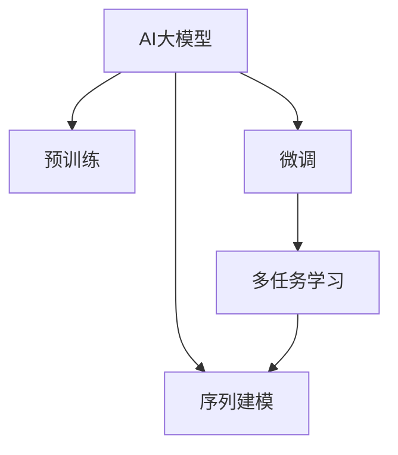

                 

# AI大模型在电商平台用户意图识别与预测中的作用

> 关键词：AI大模型, 用户意图识别, 电商平台, 自然语言处理, 深度学习, 多任务学习, 序列建模

## 1. 背景介绍

在当今数字化时代，电商平台已经成为消费者购物的重要渠道之一。随着个性化推荐、搜索排序等技术的应用，用户体验不断提升，然而在背后，如何准确理解用户意图，提高推荐和搜索的精准度，成为了电商平台面临的重要挑战。AI大模型，尤其是基于深度学习的自然语言处理(NLP)模型，在这方面表现出了强大的潜力。

### 1.1 问题由来

电商平台的用户行为数据包含丰富的信息，如搜索记录、浏览记录、点击记录等，这些数据可以用于理解用户的兴趣和意图。传统的意图识别方法往往依赖于手工设计的特征工程，难以捕捉到用户的复杂需求。而AI大模型通过预训练在大量的文本数据上学习到了通用的语言表示，能够在无需大量标注数据的情况下，快速适应特定任务，实现高精度的意图识别和预测。

### 1.2 问题核心关键点

用户意图识别的核心在于将用户的文本行为数据转化为可操作的意图标签，以便进行推荐、搜索等操作。目前常用的方法包括基于监督学习的微调、基于预训练的语言模型等。以下是我们重点讨论的核心关键点：

1. **预训练语言模型**：通过在大规模无标签数据上预训练得到的语言模型，能够捕捉到丰富的语言表示，适用于多种NLP任务。
2. **微调**：在大规模预训练模型的基础上，通过下游任务的少量标注数据进行微调，获得针对特定任务的模型。
3. **多任务学习**：利用同一模型在不同任务上的联合训练，共享知识，提升模型泛化能力。
4. **序列建模**：考虑文本的顺序关系，采用RNN、Transformer等序列建模技术，捕捉长距离依赖关系。

## 2. 核心概念与联系

### 2.1 核心概念概述

为了更好地理解AI大模型在电商平台用户意图识别中的作用，我们需要对几个核心概念进行介绍：

- **AI大模型**：指在大量数据上预训练得到的深度神经网络模型，能够处理复杂的语言表示。
- **用户意图识别**：指从用户的文本数据中提取意图，将其转化为机器可理解的意图标签。
- **电商平台**：指以互联网为平台，提供商品展示、交易、物流等服务的企业。
- **自然语言处理(NLP)**：涉及文本数据的处理、分析与生成，目标是使计算机能够理解人类语言。
- **深度学习**：指通过多层神经网络学习非线性关系，广泛应用于图像、语音、文本等数据的处理和分析。
- **多任务学习**：指在同一模型上训练多个任务，共享底层特征，提升模型的泛化能力。
- **序列建模**：考虑文本的顺序关系，采用RNN、Transformer等序列建模技术，捕捉长距离依赖关系。

这些概念之间相互关联，共同构成了用户意图识别的技术框架。通过理解这些核心概念，我们可以更好地把握AI大模型在电商平台用户意图识别中的应用。

### 2.2 核心概念原理和架构的 Mermaid 流程图



这个流程图展示了AI大模型在用户意图识别中的基本架构：

1. **预训练**：在大规模无标签数据上预训练得到的语言模型，能够捕捉到丰富的语言表示。
2. **微调**：在大规模预训练模型的基础上，通过下游任务的少量标注数据进行微调，获得针对特定任务的模型。
3. **多任务学习**：利用同一模型在不同任务上的联合训练，共享知识，提升模型泛化能力。
4. **序列建模**：考虑文本的顺序关系，采用RNN、Transformer等序列建模技术，捕捉长距离依赖关系。

这些步骤相互配合，构成了完整的用户意图识别流程。

## 3. 核心算法原理 & 具体操作步骤

### 3.1 算法原理概述

基于AI大模型的用户意图识别，主要依赖于预训练-微调框架。以下是对该框架的详细阐述：

1. **预训练**：在大规模无标签数据上预训练得到的语言模型，能够捕捉到丰富的语言表示。常用的预训练任务包括语言建模、掩码语言模型等。
2. **微调**：在大规模预训练模型的基础上，通过下游任务的少量标注数据进行微调，获得针对特定任务的模型。
3. **多任务学习**：利用同一模型在不同任务上的联合训练，共享知识，提升模型泛化能力。
4. **序列建模**：考虑文本的顺序关系，采用RNN、Transformer等序列建模技术，捕捉长距离依赖关系。

### 3.2 算法步骤详解

基于AI大模型的用户意图识别可以分为以下几个步骤：

**Step 1: 准备数据集**
- 收集电商平台的用户行为数据，如搜索记录、浏览记录、点击记录等。
- 将用户行为数据转换为文本形式，如商品名称、描述、标题等。
- 将文本数据进行标注，如意图类别，如“购买”、“浏览”、“比较”等。

**Step 2: 选择预训练模型**
- 选择合适的预训练模型，如BERT、GPT、RoBERTa等。
- 加载预训练模型，并进行微调任务的适配。

**Step 3: 微调模型**
- 将预训练模型作为初始化参数，通过下游任务的少量标注数据进行微调。
- 设置微调的超参数，如学习率、批量大小、迭代次数等。
- 使用合适的损失函数，如交叉熵损失，进行模型训练。
- 在验证集上评估模型性能，避免过拟合。

**Step 4: 序列建模**
- 考虑文本的顺序关系，采用RNN、Transformer等序列建模技术，捕捉长距离依赖关系。
- 使用序列建模技术，对输入的文本数据进行处理，生成文本表示。

**Step 5: 多任务学习**
- 利用同一模型在不同任务上的联合训练，共享知识，提升模型泛化能力。
- 将意图识别任务与其他任务（如情感分析、实体识别等）联合训练，提升模型性能。

**Step 6: 评估与部署**
- 在测试集上评估微调后模型的性能。
- 将模型部署到电商平台，进行实时意图识别和预测。

### 3.3 算法优缺点

基于AI大模型的用户意图识别方法具有以下优点：

1. **高效性**：利用预训练得到的语言模型，无需大量标注数据，即可实现高效的意图识别。
2. **泛化能力强**：通过多任务学习，模型能够捕捉到不同任务之间的共同特征，提升泛化能力。
3. **序列建模能力强**：采用RNN、Transformer等序列建模技术，能够捕捉长距离依赖关系，提高意图识别的准确性。

同时，该方法也存在以下缺点：

1. **数据质量要求高**：标注数据的质量对模型性能有很大影响，需要保证标注数据的质量。
2. **计算资源需求高**：预训练和微调需要大量的计算资源，对硬件要求较高。
3. **模型复杂度高**：大规模的深度神经网络模型结构复杂，难以调试和解释。

### 3.4 算法应用领域

基于AI大模型的用户意图识别技术在电商平台用户意图识别与预测中有着广泛的应用：

1. **推荐系统**：通过理解用户的搜索、浏览、点击等行为，进行个性化推荐。
2. **搜索排序**：根据用户的意图，调整搜索结果的排序，提高用户的满意度。
3. **广告投放**：分析用户的行为数据，优化广告投放策略，提升广告效果。
4. **客服系统**：通过分析用户咨询内容，提供精准的客服响应。
5. **用户画像构建**：综合用户的多种行为数据，构建用户画像，进行市场分析。

## 4. 数学模型和公式 & 详细讲解

### 4.1 数学模型构建

在电商平台用户意图识别中，我们通常使用BERT等预训练模型作为基础，并在其顶部添加一个全连接层进行意图分类。以下是对该模型的数学建模：

设预训练模型为 $M_{\theta}$，输入为 $x$，输出为 $y$，意图分类任务的目标为最大化模型输出与真实标签之间的交叉熵损失：

$$
L(y, M_{\theta}(x)) = -\sum_{i=1}^n y_i \log M_{\theta}(x)_i
$$

其中，$y$ 为真实标签，$M_{\theta}(x)$ 为模型预测的概率分布。

### 4.2 公式推导过程

以下以BERT为例，推导意图分类的交叉熵损失函数及其梯度计算公式。

假设模型 $M_{\theta}$ 在输入 $x$ 上的输出为 $\hat{y}=M_{\theta}(x) \in [0,1]$，表示样本属于正类的概率。真实标签 $y \in \{0,1\}$。则二分类交叉熵损失函数定义为：

$$
L(M_{\theta}(x),y) = -[y\log \hat{y} + (1-y)\log (1-\hat{y})]
$$

将其代入经验风险公式，得：

$$
\mathcal{L}(\theta) = -\frac{1}{N}\sum_{i=1}^N [y_i\log M_{\theta}(x_i)+(1-y_i)\log(1-M_{\theta}(x_i))]
$$

根据链式法则，损失函数对参数 $\theta$ 的梯度为：

$$
\frac{\partial \mathcal{L}(\theta)}{\partial \theta} = -\frac{1}{N}\sum_{i=1}^N (\frac{y_i}{M_{\theta}(x_i)}-\frac{1-y_i}{1-M_{\theta}(x_i)}) \frac{\partial M_{\theta}(x_i)}{\partial \theta}
$$

其中 $\frac{\partial M_{\theta}(x_i)}{\partial \theta}$ 可进一步递归展开，利用自动微分技术完成计算。

在得到损失函数的梯度后，即可带入参数更新公式，完成模型的迭代优化。重复上述过程直至收敛，最终得到适应电商平台意图识别任务的最优模型参数 $\theta^*$。

## 5. 项目实践：代码实例和详细解释说明

### 5.1 开发环境搭建

在进行意图识别实践前，我们需要准备好开发环境。以下是使用Python进行PyTorch开发的环境配置流程：

1. 安装Anaconda：从官网下载并安装Anaconda，用于创建独立的Python环境。

2. 创建并激活虚拟环境：
```bash
conda create -n pytorch-env python=3.8 
conda activate pytorch-env
```

3. 安装PyTorch：根据CUDA版本，从官网获取对应的安装命令。例如：
```bash
conda install pytorch torchvision torchaudio cudatoolkit=11.1 -c pytorch -c conda-forge
```

4. 安装Transformers库：
```bash
pip install transformers
```

5. 安装各类工具包：
```bash
pip install numpy pandas scikit-learn matplotlib tqdm jupyter notebook ipython
```

完成上述步骤后，即可在`pytorch-env`环境中开始意图识别实践。

### 5.2 源代码详细实现

下面我们以电商平台用户意图识别为例，给出使用Transformers库对BERT模型进行意图识别的PyTorch代码实现。

首先，定义意图识别任务的数据处理函数：

```python
from transformers import BertTokenizer
from torch.utils.data import Dataset
import torch

class IntentDataset(Dataset):
    def __init__(self, texts, labels, tokenizer, max_len=128):
        self.texts = texts
        self.labels = labels
        self.tokenizer = tokenizer
        self.max_len = max_len
        
    def __len__(self):
        return len(self.texts)
    
    def __getitem__(self, item):
        text = self.texts[item]
        label = self.labels[item]
        
        encoding = self.tokenizer(text, return_tensors='pt', max_length=self.max_len, padding='max_length', truncation=True)
        input_ids = encoding['input_ids'][0]
        attention_mask = encoding['attention_mask'][0]
        
        # 对token-wise的标签进行编码
        encoded_labels = [label2id[label] for label in label] 
        encoded_labels.extend([label2id['O']] * (self.max_len - len(encoded_labels)))
        labels = torch.tensor(encoded_labels, dtype=torch.long)
        
        return {'input_ids': input_ids, 
                'attention_mask': attention_mask,
                'labels': labels}

# 标签与id的映射
label2id = {'O': 0, 'purchase': 1, 'browse': 2, 'compare': 3}
id2label = {v: k for k, v in label2id.items()}

# 创建dataset
tokenizer = BertTokenizer.from_pretrained('bert-base-cased')

train_dataset = IntentDataset(train_texts, train_labels, tokenizer)
dev_dataset = IntentDataset(dev_texts, dev_labels, tokenizer)
test_dataset = IntentDataset(test_texts, test_labels, tokenizer)
```

然后，定义模型和优化器：

```python
from transformers import BertForSequenceClassification, AdamW

model = BertForSequenceClassification.from_pretrained('bert-base-cased', num_labels=len(label2id))

optimizer = AdamW(model.parameters(), lr=2e-5)
```

接着，定义训练和评估函数：

```python
from torch.utils.data import DataLoader
from tqdm import tqdm
from sklearn.metrics import classification_report

device = torch.device('cuda') if torch.cuda.is_available() else torch.device('cpu')
model.to(device)

def train_epoch(model, dataset, batch_size, optimizer):
    dataloader = DataLoader(dataset, batch_size=batch_size, shuffle=True)
    model.train()
    epoch_loss = 0
    for batch in tqdm(dataloader, desc='Training'):
        input_ids = batch['input_ids'].to(device)
        attention_mask = batch['attention_mask'].to(device)
        labels = batch['labels'].to(device)
        model.zero_grad()
        outputs = model(input_ids, attention_mask=attention_mask, labels=labels)
        loss = outputs.loss
        epoch_loss += loss.item()
        loss.backward()
        optimizer.step()
    return epoch_loss / len(dataloader)

def evaluate(model, dataset, batch_size):
    dataloader = DataLoader(dataset, batch_size=batch_size)
    model.eval()
    preds, labels = [], []
    with torch.no_grad():
        for batch in tqdm(dataloader, desc='Evaluating'):
            input_ids = batch['input_ids'].to(device)
            attention_mask = batch['attention_mask'].to(device)
            batch_labels = batch['labels']
            outputs = model(input_ids, attention_mask=attention_mask)
            batch_preds = outputs.logits.argmax(dim=2).to('cpu').tolist()
            batch_labels = batch_labels.to('cpu').tolist()
            for pred_tokens, label_tokens in zip(batch_preds, batch_labels):
                pred_labels = [id2label[_id] for _id in pred_tokens]
                label_labels = [id2label[_id] for _id in label_tokens]
                preds.append(pred_labels[:len(label_labels)])
                labels.append(label_labels)
                
    print(classification_report(labels, preds))
```

最后，启动训练流程并在测试集上评估：

```python
epochs = 5
batch_size = 16

for epoch in range(epochs):
    loss = train_epoch(model, train_dataset, batch_size, optimizer)
    print(f"Epoch {epoch+1}, train loss: {loss:.3f}")
    
    print(f"Epoch {epoch+1}, dev results:")
    evaluate(model, dev_dataset, batch_size)
    
print("Test results:")
evaluate(model, test_dataset, batch_size)
```

以上就是使用PyTorch对BERT进行电商平台用户意图识别的完整代码实现。可以看到，得益于Transformers库的强大封装，我们可以用相对简洁的代码完成BERT模型的加载和意图识别。

### 5.3 代码解读与分析

让我们再详细解读一下关键代码的实现细节：

**IntentDataset类**：
- `__init__`方法：初始化文本、标签、分词器等关键组件。
- `__len__`方法：返回数据集的样本数量。
- `__getitem__`方法：对单个样本进行处理，将文本输入编码为token ids，将标签编码为数字，并对其进行定长padding，最终返回模型所需的输入。

**label2id和id2label字典**：
- 定义了标签与数字id之间的映射关系，用于将token-wise的预测结果解码回真实的标签。

**训练和评估函数**：
- 使用PyTorch的DataLoader对数据集进行批次化加载，供模型训练和推理使用。
- 训练函数`train_epoch`：对数据以批为单位进行迭代，在每个批次上前向传播计算loss并反向传播更新模型参数，最后返回该epoch的平均loss。
- 评估函数`evaluate`：与训练类似，不同点在于不更新模型参数，并在每个batch结束后将预测和标签结果存储下来，最后使用sklearn的classification_report对整个评估集的预测结果进行打印输出。

**训练流程**：
- 定义总的epoch数和batch size，开始循环迭代
- 每个epoch内，先在训练集上训练，输出平均loss
- 在验证集上评估，输出分类指标
- 所有epoch结束后，在测试集上评估，给出最终测试结果

可以看到，PyTorch配合Transformers库使得BERT意图识别的代码实现变得简洁高效。开发者可以将更多精力放在数据处理、模型改进等高层逻辑上，而不必过多关注底层的实现细节。

当然，工业级的系统实现还需考虑更多因素，如模型的保存和部署、超参数的自动搜索、更灵活的任务适配层等。但核心的意图识别范式基本与此类似。

## 6. 实际应用场景

### 6.1 智能推荐系统

电商平台用户意图识别可以与个性化推荐系统相结合，进一步提升推荐效果。通过分析用户的搜索、浏览、点击等行为，理解用户的意图，可以提供更加精准的推荐。例如，用户搜索“手机”，可能希望购买最新款，也可能希望查看评测，意图识别可以根据用户的行为数据，预测其真正的需求，提供个性化的推荐。

### 6.2 搜索排序

基于用户意图识别的搜索排序技术，可以显著提升搜索结果的相关性和满意度。通过分析用户的搜索记录，理解用户的意图，可以调整搜索结果的排序，将最相关的商品排在最前面。例如，用户搜索“运动鞋”，意图识别可以预测其希望看到品牌、颜色、尺码等信息，从而优化搜索结果的展示。

### 6.3 用户行为分析

电商平台用户意图识别可以帮助企业更好地理解用户行为，进行市场分析和用户画像构建。通过分析用户的搜索、浏览、点击等行为，可以了解用户的兴趣、偏好和需求，从而进行针对性的市场推广和用户服务。例如，分析用户的购物行为，可以发现不同年龄段、不同地域的消费特征，为营销策略提供数据支撑。

## 7. 工具和资源推荐

### 7.1 学习资源推荐

为了帮助开发者系统掌握AI大模型在电商平台用户意图识别中的应用，这里推荐一些优质的学习资源：

1. 《Transformer从原理到实践》系列博文：由大模型技术专家撰写，深入浅出地介绍了Transformer原理、BERT模型、意图识别技术等前沿话题。

2. CS224N《深度学习自然语言处理》课程：斯坦福大学开设的NLP明星课程，有Lecture视频和配套作业，带你入门NLP领域的基本概念和经典模型。

3. 《Natural Language Processing with Transformers》书籍：Transformers库的作者所著，全面介绍了如何使用Transformers库进行NLP任务开发，包括意图识别在内的多个范式。

4. HuggingFace官方文档：Transformers库的官方文档，提供了海量预训练模型和完整的意图识别样例代码，是上手实践的必备资料。

5. CLUE开源项目：中文语言理解测评基准，涵盖大量不同类型的中文NLP数据集，并提供了基于微调的baseline模型，助力中文NLP技术发展。

通过对这些资源的学习实践，相信你一定能够快速掌握AI大模型在电商平台用户意图识别中的应用，并用于解决实际的NLP问题。

### 7.2 开发工具推荐

高效的开发离不开优秀的工具支持。以下是几款用于AI大模型意图识别开发的常用工具：

1. PyTorch：基于Python的开源深度学习框架，灵活动态的计算图，适合快速迭代研究。大部分预训练语言模型都有PyTorch版本的实现。

2. TensorFlow：由Google主导开发的开源深度学习框架，生产部署方便，适合大规模工程应用。同样有丰富的预训练语言模型资源。

3. Transformers库：HuggingFace开发的NLP工具库，集成了众多SOTA语言模型，支持PyTorch和TensorFlow，是进行意图识别任务开发的利器。

4. Weights & Biases：模型训练的实验跟踪工具，可以记录和可视化模型训练过程中的各项指标，方便对比和调优。与主流深度学习框架无缝集成。

5. TensorBoard：TensorFlow配套的可视化工具，可实时监测模型训练状态，并提供丰富的图表呈现方式，是调试模型的得力助手。

6. Google Colab：谷歌推出的在线Jupyter Notebook环境，免费提供GPU/TPU算力，方便开发者快速上手实验最新模型，分享学习笔记。

合理利用这些工具，可以显著提升意图识别任务的开发效率，加快创新迭代的步伐。

### 7.3 相关论文推荐

AI大模型在电商平台用户意图识别技术的发展源于学界的持续研究。以下是几篇奠基性的相关论文，推荐阅读：

1. Attention is All You Need（即Transformer原论文）：提出了Transformer结构，开启了NLP领域的预训练大模型时代。

2. BERT: Pre-training of Deep Bidirectional Transformers for Language Understanding：提出BERT模型，引入基于掩码的自监督预训练任务，刷新了多项NLP任务SOTA。

3. Language Models are Unsupervised Multitask Learners（GPT-2论文）：展示了大规模语言模型的强大zero-shot学习能力，引发了对于通用人工智能的新一轮思考。

4. Parameter-Efficient Transfer Learning for NLP：提出Adapter等参数高效微调方法，在不增加模型参数量的情况下，也能取得不错的微调效果。

5. Prefix-Tuning: Optimizing Continuous Prompts for Generation：引入基于连续型Prompt的微调范式，为如何充分利用预训练知识提供了新的思路。

6. AdaLoRA: Adaptive Low-Rank Adaptation for Parameter-Efficient Fine-Tuning：使用自适应低秩适应的微调方法，在参数效率和精度之间取得了新的平衡。

这些论文代表了大模型意图识别技术的发展脉络。通过学习这些前沿成果，可以帮助研究者把握学科前进方向，激发更多的创新灵感。

## 8. 总结：未来发展趋势与挑战

### 8.1 总结

本文对AI大模型在电商平台用户意图识别与预测中的应用进行了全面系统的介绍。首先阐述了电商平台用户意图识别的背景和核心关键点，明确了意图识别的目标和现有方法的不足。其次，从原理到实践，详细讲解了预训练-微调框架的数学模型和关键步骤，给出了意图识别任务开发的完整代码实例。同时，本文还广泛探讨了意图识别方法在推荐系统、搜索排序、用户行为分析等实际应用场景中的应用前景，展示了AI大模型的强大潜力。此外，本文精选了意图识别技术的各类学习资源，力求为读者提供全方位的技术指引。

通过本文的系统梳理，可以看到，AI大模型在电商平台用户意图识别中，通过预训练-微调框架，可以高效地理解用户的复杂需求，提升推荐和搜索的精准度，从而显著提升用户的购物体验。未来，伴随预训练语言模型和意图识别方法的持续演进，基于意图识别的智能推荐系统将更加智能化、个性化，为电商平台的数字化转型提供更强大的技术支持。

### 8.2 未来发展趋势

展望未来，AI大模型在电商平台用户意图识别技术将呈现以下几个发展趋势：

1. **模型规模持续增大**：随着算力成本的下降和数据规模的扩张，预训练语言模型的参数量还将持续增长。超大模型能够更好地捕捉到用户的细微需求，提升意图识别的准确性。

2. **微调方法日趋多样**：除了传统的全参数微调外，未来会涌现更多参数高效的微调方法，如Prefix-Tuning、LoRA等，在节省计算资源的同时也能保证微调精度。

3. **序列建模能力增强**：考虑文本的顺序关系，采用RNN、Transformer等序列建模技术，能够捕捉长距离依赖关系，提高意图识别的准确性。

4. **多任务学习提升泛化能力**：利用同一模型在不同任务上的联合训练，共享知识，提升模型泛化能力。

5. **结合先验知识提高效果**：将符号化的先验知识，如知识图谱、逻辑规则等，与神经网络模型进行巧妙融合，引导意图识别过程学习更准确、合理的语言模型。

6. **融合多模态数据提升效果**：结合视觉、语音等多模态信息，提升意图识别的准确性和鲁棒性。

以上趋势凸显了AI大模型在电商平台用户意图识别中的广泛应用前景，这些方向的探索发展，必将进一步提升意图识别系统的性能和应用范围，为电商平台提供更智能、更高效的用户体验。

### 8.3 面临的挑战

尽管AI大模型在电商平台用户意图识别技术已经取得了瞩目成就，但在迈向更加智能化、普适化应用的过程中，仍面临诸多挑战：

1. **标注数据质量要求高**：标注数据的质量对意图识别效果有很大影响，需要保证标注数据的质量。

2. **计算资源需求高**：预训练和微调需要大量的计算资源，对硬件要求较高。

3. **模型复杂度高**：大规模的深度神经网络模型结构复杂，难以调试和解释。

4. **过拟合问题**：在大规模预训练模型上进行微调时，容易过拟合，需要采取正则化等方法避免过拟合。

5. **隐私保护问题**：用户的搜索、浏览等数据属于隐私数据，需要在保护用户隐私的前提下进行意图识别。

6. **可解释性不足**：意图识别模型通常是"黑盒"系统，难以解释其内部工作机制和决策逻辑。

7. **鲁棒性不足**：模型面对域外数据时，泛化性能往往大打折扣。

8. **安全性和可靠性**：模型需要具备鲁棒性，避免误判、错判等问题，确保系统的安全性和可靠性。

正视这些挑战，积极应对并寻求突破，将是大模型意图识别技术迈向成熟的必由之路。相信随着学界和产业界的共同努力，这些挑战终将一一被克服，AI大模型意图识别技术必将走向更广阔的应用领域。

### 8.4 研究展望

面对AI大模型在电商平台用户意图识别技术所面临的诸多挑战，未来的研究需要在以下几个方面寻求新的突破：

1. **探索无监督和半监督意图识别方法**：摆脱对大规模标注数据的依赖，利用自监督学习、主动学习等无监督和半监督范式，最大限度利用非结构化数据，实现更加灵活高效的意图识别。

2. **开发参数高效和计算高效的意图识别方法**：开发更加参数高效的意图识别方法，在固定大部分预训练参数的同时，只更新极少量的任务相关参数。同时优化模型的计算图，减少前向传播和反向传播的资源消耗，实现更加轻量级、实时性的部署。

3. **融合因果分析和博弈论工具**：将因果分析方法引入意图识别模型，识别出模型决策的关键特征，增强输出解释的因果性和逻辑性。借助博弈论工具刻画人机交互过程，主动探索并规避模型的脆弱点，提高系统稳定性。

4. **引入伦理道德约束**：在模型训练目标中引入伦理导向的评估指标，过滤和惩罚有偏见、有害的输出倾向。同时加强人工干预和审核，建立模型行为的监管机制，确保输出符合人类价值观和伦理道德。

这些研究方向的探索，必将引领AI大模型在电商平台用户意图识别技术迈向更高的台阶，为构建安全、可靠、可解释、可控的智能系统铺平道路。面向未来，AI大模型意图识别技术还需要与其他人工智能技术进行更深入的融合，如知识表示、因果推理、强化学习等，多路径协同发力，共同推动智能推荐系统的进步。只有勇于创新、敢于突破，才能不断拓展意图识别技术的边界，让智能技术更好地造福人类社会。

## 9. 附录：常见问题与解答

**Q1：AI大模型在电商平台用户意图识别中是如何进行微调的？**

A: AI大模型在电商平台用户意图识别中的微调主要包括以下几个步骤：

1. **准备数据集**：收集电商平台的用户行为数据，如搜索记录、浏览记录、点击记录等。将用户行为数据转换为文本形式，如商品名称、描述、标题等。

2. **选择预训练模型**：选择合适的预训练模型，如BERT、GPT、RoBERTa等。加载预训练模型，并进行微调任务的适配。

3. **微调模型**：在大规模预训练模型的基础上，通过下游任务的少量标注数据进行微调。设置微调的超参数，如学习率、批量大小、迭代次数等。使用合适的损失函数，如交叉熵损失，进行模型训练。在验证集上评估模型性能，避免过拟合。

4. **序列建模**：考虑文本的顺序关系，采用RNN、Transformer等序列建模技术，捕捉长距离依赖关系。

5. **多任务学习**：利用同一模型在不同任务上的联合训练，共享知识，提升模型泛化能力。

6. **评估与部署**：在测试集上评估微调后模型的性能。将模型部署到电商平台，进行实时意图识别和预测。

**Q2：AI大模型在电商平台用户意图识别中如何避免过拟合？**

A: 避免过拟合是AI大模型在电商平台用户意图识别中的重要问题。以下是一些常见的避免过拟合的方法：

1. **数据增强**：通过对训练样本改写、回译等方式丰富训练集多样性。

2. **正则化技术**：如L2正则、Dropout、Early Stopping等，防止模型过度适应小规模训练集。

3. **对抗训练**：加入对抗样本，提高模型鲁棒性。

4. **参数高效微调**：只调整少量模型参数，而固定大部分预训练权重不变，以提高微调效率，避免过拟合。

5. **多模型集成**：训练多个意图识别模型，取平均输出，抑制过拟合。

**Q3：AI大模型在电商平台用户意图识别中如何进行序列建模？**

A: 在AI大模型在电商平台用户意图识别中，序列建模主要采用RNN、Transformer等序列建模技术。具体步骤如下：

1. **输入处理**：将用户行为数据转换为文本形式，如商品名称、描述、标题等。

2. **文本编码**：使用RNN、Transformer等序列建模技术，对输入的文本数据进行处理，生成文本表示。

3. **意图识别**：在文本表示的基础上，通过全连接层进行意图分类，输出意图标签。

**Q4：AI大模型在电商平台用户意图识别中如何进行多任务学习？**

A: 多任务学习在AI大模型在电商平台用户意图识别中的应用，主要体现在以下方面：

1. **任务设计**：设计多个意图识别任务，如购买、浏览、比较等。

2. **联合训练**：在同一个模型上，对多个任务进行联合训练，共享底层特征，提升模型泛化能力。

3. **任务迁移**：在新的任务上，通过微调或零样本学习等方法，利用已经训练好的模型，快速适应新任务。

**Q5：AI大模型在电商平台用户意图识别中如何进行推理加速？**

A: 推理加速是AI大模型在电商平台用户意图识别中的重要问题。以下是一些常见的推理加速方法：

1. **模型裁剪**：去除不必要的层和参数，减小模型尺寸，加快推理速度。

2. **量化加速**：将浮点模型转为定点模型，压缩存储空间，提高计算效率。

3. **服务化封装**：将模型封装为标准化服务接口，便于集成调用。

4. **弹性伸缩**：根据请求流量动态调整资源配置，平衡服务质量和成本。

5. **模型压缩**：采用模型压缩技术，如剪枝、蒸馏等，减少模型大小，提高推理速度。

6. **硬件优化**：使用GPU/TPU等高性能设备，提高计算速度。

通过这些方法，可以显著提升AI大模型在电商平台用户意图识别中的推理效率，实现更加轻量级、实时性的部署。

