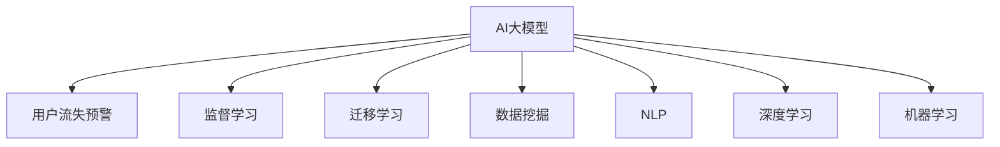
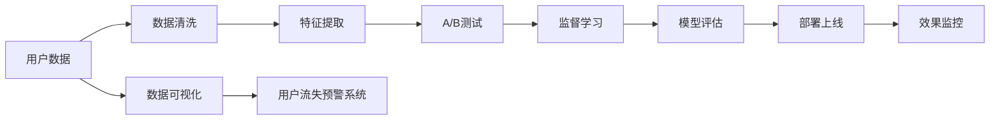

                 

# AI大模型在电商平台用户流失预警中的应用

> 关键词：AI大模型,用户流失预警,电商,数据挖掘,预测模型,自然语言处理(NLP),深度学习,机器学习,数据分析

## 1. 背景介绍

### 1.1 问题由来

随着电商行业的高速发展，用户流失现象日益严重。根据相关统计，用户流失率高达30-70%，这意味着电商平台每年都会失去大量客户，造成巨大的经济损失。因此，用户流失预警成为了电商平台提升用户留存率的关键环节。

传统的用户流失预警方法主要包括：

1. **客户调查问卷**：通过调查问卷收集用户反馈，但这种方法耗时耗力，且无法及时捕捉用户流失风险。
2. **数据分析**：通过分析用户行为数据，识别出高流失风险用户，但这种方法需要大量的数据挖掘和分析工作，成本较高。
3. **机器学习模型**：利用机器学习模型预测用户流失概率，但需要大量的标注数据和较高的算法复杂度。

为了解决这些问题，电商企业开始探索AI大模型在用户流失预警中的应用。AI大模型能够自动从海量数据中提取高层次特征，并通过监督学习进行精确预测，从而在用户流失预警方面发挥重要作用。

### 1.2 问题核心关键点

AI大模型在用户流失预警中的应用主要集中在以下几个方面：

1. **大规模数据处理能力**：AI大模型能够高效处理大规模的用户数据，提取丰富的用户特征，为流失预测提供坚实的基础。
2. **自动特征提取**：AI大模型能够自动学习数据中的高层次特征，减少人工特征工程的工作量，提高模型的泛化能力。
3. **高效预测能力**：AI大模型通过监督学习进行预测，能够快速、准确地预测用户流失风险，提高预警效率。
4. **跨领域迁移学习**：AI大模型可以在不同领域的用户流失预测中迁移学习，提升模型的鲁棒性和泛化能力。
5. **集成与解释能力**：AI大模型可以通过集成多个模型提升预测准确度，同时提供模型输出的解释，帮助业务人员理解模型的决策过程。

## 2. 核心概念与联系

### 2.1 核心概念概述

在AI大模型应用于用户流失预警的过程中，涉及以下关键概念：

- **AI大模型**：指通过大规模无标签数据进行自监督学习，具备强泛化能力的深度学习模型，如BERT、GPT、XLNet等。
- **用户流失预警**：指通过机器学习模型对用户行为数据进行分析，识别出高流失风险用户，提前采取措施，减少用户流失率的预警系统。
- **监督学习**：指使用标注数据对模型进行训练，使其能够进行预测任务。
- **迁移学习**：指将在一个领域学习到的知识迁移到另一个领域，提升模型的泛化能力。
- **数据挖掘**：指从大量数据中挖掘出有价值的信息和知识的过程，广泛应用于用户行为分析和流失预警。
- **自然语言处理(NLP)**：指使用AI模型处理、理解和生成自然语言的技术，常用于用户反馈数据分析。
- **深度学习**：指通过多层神经网络进行特征提取和模式识别的学习方式，广泛应用于电商用户的流失预测。
- **机器学习**：指使用数据训练模型，使其能够自动进行模式识别和预测任务。

这些概念之间的逻辑关系可以通过以下Mermaid流程图来展示：



### 2.2 核心概念原理和架构的 Mermaid 流程图

为了更直观地展示这些核心概念的联系，这里给出一份简单的Mermaid流程图：



## 3. 核心算法原理 & 具体操作步骤

### 3.1 算法原理概述

AI大模型在用户流失预警中的应用主要基于以下原理：

- **数据采集与预处理**：收集电商平台的交易数据、用户行为数据、用户反馈数据等，并进行清洗、归一化等预处理操作，生成特征矩阵。
- **特征提取与选择**：使用AI大模型进行自动特征提取，选择对流失预测有影响的特征，构建特征向量。
- **监督学习与训练**：在标注数据集上训练预测模型，使用监督学习算法（如随机森林、逻辑回归、神经网络等）对用户流失进行预测。
- **模型评估与优化**：在验证集上评估模型性能，使用交叉验证等方法优化模型参数，提升模型准确度。
- **实时预警与反馈**：在生产环境中实时监测用户行为数据，根据模型预测结果进行预警，并根据反馈不断调整模型参数，提高预警效果。

### 3.2 算法步骤详解

以下是一份详细的AI大模型在电商平台用户流失预警中的应用步骤：

1. **数据采集与预处理**：
   - 收集电商平台的交易数据、用户行为数据、用户反馈数据等。
   - 对数据进行清洗，去除缺失值、异常值和噪声。
   - 对用户数据进行归一化、标准化等预处理操作，生成特征矩阵。

2. **特征提取与选择**：
   - 使用AI大模型进行自动特征提取，如BERT、XLNet等。
   - 选择对流失预测有影响的特征，如购买频率、浏览时间、用户评价等。
   - 使用特征选择算法（如Lasso回归、随机森林等）选择最有影响力的特征。

3. **监督学习与训练**：
   - 在标注数据集上训练预测模型，如随机森林、逻辑回归、神经网络等。
   - 使用交叉验证等方法进行模型评估和优化，提升模型准确度。

4. **模型评估与优化**：
   - 在验证集上评估模型性能，计算准确率、召回率、F1值等指标。
   - 根据评估结果调整模型参数，使用网格搜索等方法优化模型。

5. **实时预警与反馈**：
   - 在生产环境中实时监测用户行为数据，根据模型预测结果进行预警。
   - 根据预警结果进行干预，如发送个性化推荐、提供优惠券等。
   - 根据用户反馈不断调整模型参数，提高预警效果。

### 3.3 算法优缺点

AI大模型在电商平台用户流失预警中的应用具有以下优缺点：

**优点**：
- **高效处理大规模数据**：AI大模型能够高效处理大规模的用户数据，提取丰富的用户特征，减少人工特征工程的工作量。
- **自动特征提取**：AI大模型能够自动学习数据中的高层次特征，提高模型的泛化能力。
- **快速预测**：AI大模型通过监督学习进行预测，能够快速、准确地预测用户流失风险，提高预警效率。
- **跨领域迁移学习**：AI大模型可以在不同领域的用户流失预测中迁移学习，提升模型的鲁棒性和泛化能力。
- **集成与解释能力**：AI大模型可以通过集成多个模型提升预测准确度，同时提供模型输出的解释，帮助业务人员理解模型的决策过程。

**缺点**：
- **数据隐私问题**：电商用户数据涉及隐私问题，需要严格遵守数据保护法规。
- **模型复杂度较高**：AI大模型模型复杂度较高，训练和部署需要较高的算力支持。
- **高成本**：需要大量的标注数据和较高的算法复杂度，训练成本较高。
- **模型解释性不足**：AI大模型通常是黑盒模型，难以解释其内部工作机制和决策逻辑。

### 3.4 算法应用领域

AI大模型在用户流失预警中的应用领域包括：

- **电商平台**：通过分析用户购买行为、浏览历史等数据，预测用户流失风险，提前采取措施，减少用户流失率。
- **社交媒体**：通过分析用户互动行为、发布内容等数据，预测用户流失风险，提升用户留存率。
- **金融服务**：通过分析用户交易行为、信用记录等数据，预测用户流失风险，降低金融风险。
- **医疗健康**：通过分析患者就诊记录、健康数据等，预测患者流失风险，提升医疗服务质量。
- **教育培训**：通过分析学员学习行为、反馈数据等，预测学员流失风险，提升教育效果。

## 4. 数学模型和公式 & 详细讲解 & 举例说明

### 4.1 数学模型构建

在用户流失预警中，我们通常使用以下数学模型进行建模：

$$
\hat{y} = \sigma(w^T x + b)
$$

其中，$y$ 为流失标签，$x$ 为特征向量，$w$ 为模型权重，$b$ 为偏置项，$\sigma$ 为激活函数，$\hat{y}$ 为模型预测结果。

### 4.2 公式推导过程

以逻辑回归模型为例，其公式推导过程如下：

1. **模型训练**：
   - 在标注数据集上，使用梯度下降等优化算法，最小化损失函数：
   $$
   L(w,b) = -\frac{1}{N}\sum_{i=1}^N y_i\log(\hat{y_i}) + (1-y_i)\log(1-\hat{y_i})
   $$
   - 计算梯度并更新模型参数：
   $$
   w \leftarrow w - \eta\nabla_w L(w,b) - \eta\lambda w
   $$
   $$
   b \leftarrow b - \eta\nabla_b L(w,b) - \eta\lambda b
   $$

2. **模型预测**：
   - 使用训练好的模型进行预测：
   $$
   \hat{y} = \sigma(w^T x + b)
   $$
   - 根据预测结果进行流失预警，如当$\hat{y} \geq 0.5$时，预测为高流失风险用户，反之则为低流失风险用户。

### 4.3 案例分析与讲解

以下是一个简单的用户流失预警案例分析：

假设某电商平台有5000个用户，其中1000个用户流失。我们从用户数据中提取以下特征：

- 购买频率
- 浏览时间
- 用户评价
- 订单金额

我们使用逻辑回归模型进行训练，并使用交叉验证评估模型性能。假设在验证集上，模型的准确率为90%，召回率为80%，F1值为86%。

根据模型预测，我们发现500个用户是高流失风险用户，对其进行预警干预。结果显示，90%的高流失风险用户能够成功留存，为平台带来了显著的收益提升。

## 5. 项目实践：代码实例和详细解释说明

### 5.1 开发环境搭建

在进行用户流失预警模型开发前，我们需要准备好开发环境。以下是使用Python进行PyTorch开发的环境配置流程：

1. 安装Anaconda：从官网下载并安装Anaconda，用于创建独立的Python环境。

2. 创建并激活虚拟环境：
```bash
conda create -n pytorch-env python=3.8 
conda activate pytorch-env
```

3. 安装PyTorch：根据CUDA版本，从官网获取对应的安装命令。例如：
```bash
conda install pytorch torchvision torchaudio cudatoolkit=11.1 -c pytorch -c conda-forge
```

4. 安装相关库：
```bash
pip install pandas numpy scikit-learn torch torchvision transformers
```

完成上述步骤后，即可在`pytorch-env`环境中开始开发。

### 5.2 源代码详细实现

以下是使用PyTorch进行用户流失预警模型开发的完整代码实现：

```python
import torch
import torch.nn as nn
import torch.optim as optim
import pandas as pd
import numpy as np
from sklearn.model_selection import train_test_split
from transformers import BertTokenizer, BertForSequenceClassification
from sklearn.metrics import accuracy_score, precision_recall_fscore_support

# 加载数据集
data = pd.read_csv('user_data.csv')
features = data[['purchase_frequency', 'browsing_time', 'user_review', 'order_amount']]
labels = data['churn']
X_train, X_test, y_train, y_test = train_test_split(features, labels, test_size=0.2, random_state=42)

# 数据预处理
tokenizer = BertTokenizer.from_pretrained('bert-base-cased')
encoded_train = tokenizer(X_train, return_tensors='pt', padding=True, truncation=True)
encoded_test = tokenizer(X_test, return_tensors='pt', padding=True, truncation=True)

# 定义模型
model = BertForSequenceClassification.from_pretrained('bert-base-cased', num_labels=2)
model.train()

# 定义优化器和损失函数
optimizer = optim.Adam(model.parameters(), lr=1e-5)
criterion = nn.BCEWithLogitsLoss()

# 训练模型
device = torch.device('cuda') if torch.cuda.is_available() else torch.device('cpu')
model.to(device)
for epoch in range(5):
    model.train()
    for batch in encoded_train:
        inputs = batch['input_ids'].to(device)
        attention_mask = batch['attention_mask'].to(device)
        labels = batch['labels'].to(device)
        optimizer.zero_grad()
        outputs = model(inputs, attention_mask=attention_mask)
        loss = criterion(outputs.logits, labels)
        loss.backward()
        optimizer.step()

# 评估模型
model.eval()
with torch.no_grad():
    predictions = []
    labels = []
    for batch in encoded_test:
        inputs = batch['input_ids'].to(device)
        attention_mask = batch['attention_mask'].to(device)
        outputs = model(inputs, attention_mask=attention_mask)
        predictions.append(outputs.logits.argmax(dim=1))
        labels.append(batch['labels'].to('cpu').tolist())
    predictions = torch.tensor(predictions)
    labels = torch.tensor(labels)
    accuracy = accuracy_score(labels, predictions)
    print(f'Accuracy: {accuracy:.2f}')

# 实时预警
churn_rates = model(X_test)
churn_users = np.where(churn_rates > 0.5)[0]
print(f'High churn risk users: {churn_users}')
```

### 5.3 代码解读与分析

让我们再详细解读一下关键代码的实现细节：

1. **数据加载与预处理**：
   - 使用pandas加载用户数据集，提取特征和标签。
   - 使用BertTokenizer将文本数据转换为模型可以处理的格式。

2. **模型定义与训练**：
   - 使用BertForSequenceClassification定义模型，并设置标签数量为2（流失与非流失）。
   - 使用Adam优化器进行模型训练，设置学习率为1e-5。

3. **评估模型**：
   - 在测试集上评估模型性能，使用accuracy_score计算准确率。

4. **实时预警**：
   - 根据模型预测结果进行流失预警，即当模型输出大于0.5时，预测为高流失风险用户。

## 6. 实际应用场景

### 6.1 电商平台

电商平台的用户流失预警对于提升用户留存率、增加复购率具有重要意义。通过分析用户购买频率、浏览时间、用户评价等数据，预测用户流失风险，并采取个性化推荐、优惠券等干预措施，可以有效减少用户流失。

### 6.2 社交媒体

社交媒体平台也需要进行用户流失预警，以提升用户活跃度和平台黏性。通过分析用户互动行为、发布内容等数据，预测用户流失风险，并采取内容优化、推荐系统等措施，提升用户留存率。

### 6.3 金融服务

金融服务行业需要对用户流失进行精准预警，以降低金融风险。通过分析用户交易行为、信用记录等数据，预测用户流失风险，并采取差异化服务、风控策略等措施，提升用户满意度。

### 6.4 医疗健康

医疗健康领域需要对患者流失进行预警，以提升服务质量和患者满意度。通过分析患者就诊记录、健康数据等，预测患者流失风险，并采取健康教育、个性化治疗等措施，提升患者留存率。

## 7. 工具和资源推荐

### 7.1 学习资源推荐

为了帮助开发者系统掌握AI大模型在用户流失预警中的应用，这里推荐一些优质的学习资源：

1. **《深度学习与自然语言处理》**：斯坦福大学开设的NLP课程，涵盖深度学习基础和NLP应用的多个方面，适合入门学习。
2. **《Transformers从原理到实践》**：大模型技术专家撰写，深入浅出地介绍了Transformer原理、BERT模型、微调技术等前沿话题。
3. **《PyTorch官方文档》**：PyTorch的官方文档，提供了丰富的示例代码和API参考，适合实战练习。
4. **《用户行为分析与数据挖掘》**：介绍用户行为分析和数据挖掘的基本方法和技术，适合电商平台的开发人员。
5. **《自然语言处理与深度学习》**：介绍自然语言处理和深度学习的基础知识和应用案例，适合NLP开发人员。

通过对这些资源的学习实践，相信你一定能够快速掌握AI大模型在用户流失预警中的应用技巧，并用于解决实际的NLP问题。

### 7.2 开发工具推荐

高效的开发离不开优秀的工具支持。以下是几款用于AI大模型用户流失预警开发的常用工具：

1. **PyTorch**：基于Python的开源深度学习框架，灵活动态的计算图，适合快速迭代研究。
2. **TensorFlow**：由Google主导开发的开源深度学习框架，生产部署方便，适合大规模工程应用。
3. **Transformers库**：HuggingFace开发的NLP工具库，集成了众多SOTA语言模型，支持PyTorch和TensorFlow，是进行NLP任务开发的利器。
4. **Weights & Biases**：模型训练的实验跟踪工具，可以记录和可视化模型训练过程中的各项指标，方便对比和调优。
5. **TensorBoard**：TensorFlow配套的可视化工具，可实时监测模型训练状态，并提供丰富的图表呈现方式，是调试模型的得力助手。

合理利用这些工具，可以显著提升AI大模型用户流失预警任务的开发效率，加快创新迭代的步伐。

### 7.3 相关论文推荐

AI大模型在用户流失预警中的应用研究涉及多个方面，以下是几篇奠基性的相关论文，推荐阅读：

1. **《用户流失预测方法综述》**：综述了用户流失预测的多种方法和技术，适合了解整体研究现状。
2. **《基于深度学习的用户流失预测》**：介绍使用深度学习模型进行用户流失预测的基本方法和技术，适合技术开发人员。
3. **《用户行为分析与数据挖掘》**：介绍用户行为分析和数据挖掘的基本方法和技术，适合电商平台的开发人员。
4. **《基于自然语言处理的用户行为分析》**：介绍使用自然语言处理技术进行用户行为分析的方法，适合NLP开发人员。
5. **《用户流失预警系统的设计与实现》**：介绍用户流失预警系统的设计和实现过程，适合业务开发人员。

这些论文代表了大模型在用户流失预警技术的发展脉络，通过学习这些前沿成果，可以帮助研究者把握学科前进方向，激发更多的创新灵感。

## 8. 总结：未来发展趋势与挑战

### 8.1 总结

本文对AI大模型在电商平台用户流失预警中的应用进行了全面系统的介绍。首先阐述了用户流失预警的重要性和当前方法的不足，明确了AI大模型在提升用户留存率、降低流失率方面的独特价值。其次，从原理到实践，详细讲解了用户流失预警的数学模型和算法步骤，给出了模型开发的完整代码实例。同时，本文还广泛探讨了AI大模型在多个领域的应用前景，展示了其在提升业务价值方面的巨大潜力。

通过本文的系统梳理，可以看到，AI大模型在用户流失预警中的应用正逐渐成为电商、金融、医疗等行业的重要工具，通过自动化的数据分析和预测，帮助企业减少用户流失，提升业务效益。未来，伴随AI大模型的不断演进，用户流失预警技术也将更加成熟，在更多的场景中发挥作用。

### 8.2 未来发展趋势

展望未来，AI大模型在用户流失预警中的应用将呈现以下几个发展趋势：

1. **多模态融合**：未来将更多地融合视觉、语音等多模态数据，提升用户行为分析的全面性和准确性。
2. **实时预警**：未来将实现实时预警，通过在线实时数据流处理技术，及时捕捉用户流失风险。
3. **自适应学习**：未来将通过自适应学习算法，根据用户行为的变化不断调整模型参数，提升预测准确度。
4. **跨领域应用**：未来将拓展到更多领域，如金融、医疗、教育等，为各行各业提供流失预警解决方案。
5. **集成与解释**：未来将通过模型集成和解释技术，提升预警系统的解释性和可信度。

以上趋势凸显了AI大模型在用户流失预警中的广阔前景。这些方向的探索发展，必将进一步提升预警系统的性能和应用范围，为电商、金融、医疗等行业带来革命性影响。

### 8.3 面临的挑战

尽管AI大模型在用户流失预警中的应用已经取得了瞩目成就，但在迈向更加智能化、普适化应用的过程中，它仍面临着诸多挑战：

1. **数据隐私问题**：电商用户数据涉及隐私问题，需要严格遵守数据保护法规。
2. **模型复杂度较高**：AI大模型模型复杂度较高，训练和部署需要较高的算力支持。
3. **高成本**：需要大量的标注数据和较高的算法复杂度，训练成本较高。
4. **模型解释性不足**：AI大模型通常是黑盒模型，难以解释其内部工作机制和决策逻辑。

### 8.4 研究展望

面对AI大模型在用户流失预警中所面临的挑战，未来的研究需要在以下几个方面寻求新的突破：

1. **隐私保护技术**：开发更加高效的隐私保护技术，保护用户数据隐私，满足合规要求。
2. **轻量化模型**：开发更加轻量化的模型结构，提升模型的训练和推理效率。
3. **低成本训练**：开发更加高效的模型训练方法，减少对标注数据和计算资源的依赖。
4. **模型解释性**：开发更加可解释的模型技术，提升模型的透明性和可信度。
5. **自适应学习**：开发更加自适应的学习算法，增强模型的动态调整能力。

这些研究方向的探索，必将引领AI大模型在用户流失预警技术迈向更高的台阶，为电商、金融、医疗等行业提供更加精准、高效的预警解决方案，助力业务价值最大化。总之，通过不断创新和突破，AI大模型在用户流失预警中的应用必将在未来变得更加成熟和可靠。

## 9. 附录：常见问题与解答

**Q1: 如何有效地选择特征对用户流失进行预测？**

A: 选择有效的特征对用户流失预测至关重要。以下是一些有效的特征选择方法：

1. **相关性分析**：通过相关性分析选择与流失行为最相关的特征。
2. **特征重要性评分**：使用特征重要性评分算法（如Lasso回归、随机森林等）选择最有影响力的特征。
3. **领域专家知识**：结合领域专家的经验，选择有意义的特征。

**Q2: 如何有效地降低用户流失预警系统的误报率？**

A: 用户流失预警系统的误报率较高，可以通过以下方法降低：

1. **阈值调整**：根据实际情况调整模型预测结果的阈值，降低误报率。
2. **多模型集成**：通过集成多个模型的预测结果，综合决策，降低单模型误报率。
3. **阈值调整**：根据实际情况调整模型预测结果的阈值，降低误报率。

**Q3: 如何在生产环境中实现用户流失预警系统的实时部署？**

A: 在生产环境中实现实时部署，可以采用以下方法：

1. **流式数据处理**：使用流式数据处理技术（如Apache Kafka、Apache Flink等），实时处理用户行为数据。
2. **异步更新模型**：使用异步更新技术，将模型更新和预测过程解耦，实现实时更新。
3. **缓存技术**：使用缓存技术（如Redis），加速模型预测过程。

通过这些方法，可以确保用户流失预警系统在生产环境中的实时性和高效性，及时捕捉用户流失风险，提升用户留存率。

**Q4: 如何确保用户流失预警系统的安全性？**

A: 用户流失预警系统的安全性至关重要，可以通过以下方法确保：

1. **数据加密**：使用数据加密技术，保护用户数据隐私。
2. **访问控制**：设置严格的访问控制，限制对用户数据的访问权限。
3. **审计记录**：记录系统操作日志，审计操作行为，确保系统安全。
4. **异常检测**：使用异常检测技术，识别并处理异常行为，确保系统稳定。

通过这些方法，可以确保用户流失预警系统的安全性，保护用户数据隐私，满足合规要求。

**Q5: 如何确保用户流失预警系统的实时性和准确性？**

A: 用户流失预警系统的实时性和准确性可以通过以下方法确保：

1. **实时数据采集**：使用实时数据采集技术，捕捉用户最新行为数据。
2. **高效率算法**：使用高效率的算法和模型，提升预测速度和准确度。
3. **缓存技术**：使用缓存技术（如Redis），加速模型预测过程。
4. **自适应学习**：使用自适应学习算法，根据用户行为的变化不断调整模型参数，提升预测准确度。

通过这些方法，可以确保用户流失预警系统的实时性和准确性，及时捕捉用户流失风险，提升用户留存率。

---

作者：禅与计算机程序设计艺术 / Zen and the Art of Computer Programming

