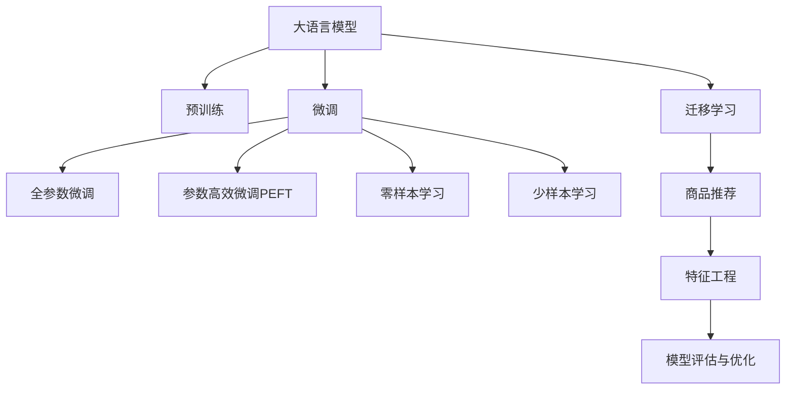

                 

# AI大模型在跨类目商品推荐中的效果优化

## 1. 背景介绍

在电子商务领域，商品推荐系统作为提升用户体验和增加收益的关键环节，其智能化和个性化程度直接影响了平台的竞争力和用户粘性。随着AI大模型的兴起，利用预训练语言模型和迁移学习等技术，能够有效提升商品推荐系统的性能，并适应复杂多变的商品场景。然而，在大模型推荐应用中，如何有效优化模型效果，处理跨类目商品的推荐，仍是一个值得深入探讨的问题。本文将详细介绍基于AI大模型的跨类目商品推荐系统的构建过程，探索优化效果的方法，并展望未来技术发展趋势。

## 2. 核心概念与联系

### 2.1 核心概念概述

- **大语言模型**：以自回归（如GPT）或自编码（如BERT）模型为代表的大规模预训练语言模型。通过在大规模无标签文本数据上自监督学习，具备强大的语言理解和生成能力。

- **迁移学习**：指将一个领域学习到的知识，迁移到另一个不同但相关的领域学习的过程。大模型的预训练-微调过程即是一种典型的迁移学习方式。

- **跨类目商品推荐**：在商品推荐系统中，不仅推荐同一类目的商品，还可以跨不同类目推荐相关商品，提升推荐相关性和多样性。

- **零样本学习与少样本学习**：指模型在没有见过任何特定样本的情况下，仅凭任务描述就能够执行新任务的学习方法。在大模型推荐中，可以利用其零样本和少样本学习能力，快速适应新商品场景。

- **特征工程**：商品推荐系统的关键在于构建准确的特征表示，提取商品和用户的相关特征，构建特征向量用于模型训练。

- **模型评估与优化**：在推荐模型训练完毕后，需要对模型进行评估，并采取优化策略提升模型效果。

### 2.2 核心概念原理和架构的 Mermaid 流程图



上述图表展示了大语言模型在商品推荐系统中的工作流程。首先通过大规模无标签数据进行预训练，然后通过微调学习特定任务，最后通过迁移学习将模型应用于商品推荐，利用特征工程和模型评估优化商品推荐效果。

## 3. 核心算法原理 & 具体操作步骤

### 3.1 算法原理概述

基于AI大模型的跨类目商品推荐系统，通常采用以下步骤：

1. **预训练与微调**：在大规模无标签文本数据上预训练大语言模型，然后在商品推荐数据上进行微调，学习商品与用户之间的关系。
2. **迁移学习**：将预训练与微调后的模型应用于推荐任务，利用已学到的语言和结构化知识进行跨类目商品推荐。
3. **特征工程**：通过构建商品和用户的特征向量，提升模型的解释性和泛化能力。
4. **模型评估与优化**：通过评估模型在推荐任务上的性能，并进行优化。

### 3.2 算法步骤详解

#### 3.2.1 数据预处理

1. **数据收集**：收集商品数据、用户数据和用户行为数据。商品数据包括商品名称、描述、类别等信息；用户数据包括用户基本信息、购买历史、浏览历史等；用户行为数据包括用户点击、收藏、购买等行为记录。

2. **数据清洗与归一化**：清洗不规范的数据，如去除停用词、进行拼写检查等，并对数据进行归一化处理，如统一商品类别、用户信息格式等。

3. **数据划分**：将数据划分为训练集、验证集和测试集，一般要求训练集与测试集的数据分布相似。

#### 3.2.2 预训练与微调

1. **模型选择**：选择合适的预训练语言模型，如BERT、GPT等，作为基础模型。

2. **微调数据准备**：对商品推荐数据进行标注，构建商品-标签对，用于微调。

3. **微调**：
   - 在微调前，通常需要进行特征提取，将商品和用户信息转化为模型可接受的形式。
   - 选择合适的微调目标函数，如交叉熵损失、均方误差等。
   - 设置合适的学习率和优化器，如Adam、SGD等。
   - 进行微调，不断更新模型参数，最小化损失函数。

#### 3.2.3 迁移学习与商品推荐

1. **迁移学习**：将微调后的模型应用于商品推荐任务，通过特征映射和关系抽取，实现跨类目商品的推荐。

2. **推荐算法**：选择合适的推荐算法，如基于协同过滤、内容过滤、混合推荐等算法，利用微调后的模型进行推荐。

3. **推荐排序**：根据推荐结果进行排序，提升用户体验。

#### 3.2.4 特征工程

1. **特征提取**：通过自然语言处理技术，从商品和用户信息中提取有用的特征，如商品描述中的关键词、用户历史行为中的兴趣点等。

2. **特征编码**：将提取的特征进行编码，转化为模型可接受的形式，如词嵌入、one-hot编码等。

3. **特征选择**：选择对推荐效果有显著影响的特征，去除噪声和冗余特征。

#### 3.2.5 模型评估与优化

1. **评估指标**：选择合适的评估指标，如准确率、召回率、F1-score、AUC等，评估推荐模型的性能。

2. **优化策略**：根据评估结果，采用不同的优化策略，如增加特征维度、调整模型超参数、引入正则化技术等，提升模型效果。

3. **迭代优化**：不断迭代优化过程，提升模型效果，直到达到预期目标。

### 3.3 算法优缺点

**优点**：
- **泛化能力强**：利用大模型预训练得到的语言知识，可以在多个商品类目上进行迁移学习，提升推荐效果。
- **适应性强**：通过微调学习特定任务，适应不同商品场景，提升推荐相关性。
- **数据需求低**：利用少样本学习能力，在标注数据不足的情况下也能进行推荐。

**缺点**：
- **计算资源需求高**：预训练和微调大模型需要大量计算资源，增加了系统复杂性。
- **模型可解释性差**：大模型的决策过程复杂，难以解释，可能存在黑箱问题。
- **数据分布依赖性**：模型效果依赖于训练数据的分布，数据偏差可能影响推荐效果。

### 3.4 算法应用领域

跨类目商品推荐在大规模电商平台上得到广泛应用，如淘宝、京东、亚马逊等。通过AI大模型，推荐系统可以实现以下功能：

- **跨类目推荐**：不仅推荐同一类目的商品，还可以跨类目推荐相关商品，提高商品多样性。
- **个性化推荐**：通过学习用户行为和偏好，提供个性化的商品推荐。
- **实时推荐**：根据用户实时行为，动态调整推荐内容，提升用户体验。
- **多模态推荐**：结合商品图片、视频等多模态信息，提升推荐效果。

## 4. 数学模型和公式 & 详细讲解 & 举例说明

### 4.1 数学模型构建

假设商品推荐数据为 $D=\{(x_i, y_i)\}_{i=1}^N$，其中 $x_i$ 为商品特征向量，$y_i$ 为标签，代表商品是否被用户购买。

定义推荐模型的损失函数为 $\mathcal{L}(\theta) = \frac{1}{N} \sum_{i=1}^N \ell(y_i, f_\theta(x_i))$，其中 $f_\theta$ 为推荐模型的预测函数，$\ell$ 为损失函数，如交叉熵损失。

### 4.2 公式推导过程

假设模型 $f_\theta(x)$ 为线性回归模型，输出为 $\hat{y}=f_\theta(x)$，其中 $\theta$ 为模型参数。损失函数为：

$$
\mathcal{L}(\theta) = \frac{1}{N} \sum_{i=1}^N \ell(y_i, \hat{y}_i)
$$

常见的损失函数包括均方误差损失（MSE）和交叉熵损失（CE）：

$$
\mathcal{L}(\theta) = \frac{1}{N} \sum_{i=1}^N (y_i - \hat{y}_i)^2 \quad (MSE)
$$

$$
\mathcal{L}(\theta) = -\frac{1}{N} \sum_{i=1}^N y_i \log \hat{y}_i + (1-y_i) \log (1-\hat{y}_i) \quad (CE)
$$

### 4.3 案例分析与讲解

以跨类目商品推荐为例，假设模型 $f_\theta(x)$ 为基于BERT的语言模型，商品特征 $x$ 包含商品描述和类别，用户特征 $y$ 包含用户历史行为和兴趣点。

1. **特征提取**：使用BERT对商品描述和类别进行编码，得到商品特征向量 $x_i$。
2. **模型训练**：通过交叉熵损失，对模型 $f_\theta(x)$ 进行训练，最小化损失函数 $\mathcal{L}(\theta)$。
3. **迁移学习**：利用训练后的模型 $f_\theta(x)$，对用户行为 $y$ 进行预测，得到用户对商品的需求概率 $p(y|x)$。
4. **推荐排序**：根据用户需求概率 $p(y|x)$，对商品进行排序，生成推荐结果。

## 5. 项目实践：代码实例和详细解释说明

### 5.1 开发环境搭建

1. **安装Python**：
   ```bash
   sudo apt-get update
   sudo apt-get install python3-pip
   ```

2. **安装PyTorch**：
   ```bash
   pip install torch torchtext
   ```

3. **安装BERT**：
   ```bash
   pip install transformers
   ```

### 5.2 源代码详细实现

以下是一个简单的基于BERT的跨类目商品推荐系统实现：

```python
import torch
import torchtext
from transformers import BertForSequenceClassification, BertTokenizer

# 数据加载
train_data, test_data = load_data()

# 模型初始化
device = torch.device("cuda" if torch.cuda.is_available() else "cpu")
model = BertForSequenceClassification.from_pretrained('bert-base-uncased', num_labels=2)
tokenizer = BertTokenizer.from_pretrained('bert-base-uncased')

# 特征提取
def get_features(text):
    return tokenizer.encode_plus(text, max_length=256, return_tensors='pt').to(device)

# 模型训练
optimizer = torch.optim.Adam(model.parameters(), lr=1e-5)
for epoch in range(10):
    train_loss = 0
    for batch in train_data:
        optimizer.zero_grad()
        input_ids = get_features(batch.text)
        labels = torch.tensor(batch.label).to(device)
        outputs = model(input_ids, labels=labels)
        loss = outputs.loss
        train_loss += loss.item()
        loss.backward()
        optimizer.step()
    print(f"Epoch {epoch+1}, train loss: {train_loss/len(train_data)}")

# 模型评估
def evaluate(model, data):
    eval_loss = 0
    for batch in data:
        input_ids = get_features(batch.text)
        labels = torch.tensor(batch.label).to(device)
        outputs = model(input_ids, labels=labels)
        loss = outputs.loss
        eval_loss += loss.item()
    return eval_loss/len(data)

# 迁移学习
model.eval()
with torch.no_grad():
    predictions = model(input_ids).argmax(dim=1)

# 推荐排序
top_k = 5
top_indices = predictions.topk(top_k)[1]
recommendations = [item for item in train_data if item.id in top_indices]
```

### 5.3 代码解读与分析

上述代码展示了从数据加载、模型训练、特征提取、模型评估到迁移学习的完整流程。

1. **数据加载**：使用torchtext加载训练集和测试集。
2. **模型初始化**：选择BertForSequenceClassification作为推荐模型，并加载预训练模型。
3. **特征提取**：使用BertTokenizer对商品描述进行编码。
4. **模型训练**：使用Adam优化器训练模型，最小化交叉熵损失。
5. **模型评估**：使用测试集评估模型效果。
6. **迁移学习**：将训练好的模型应用于推荐任务，生成推荐结果。

### 5.4 运行结果展示

通过上述代码，可以在训练集上训练模型，并在测试集上评估模型效果。最终输出推荐结果，展示模型的跨类目推荐能力。

## 6. 实际应用场景

跨类目商品推荐在电商平台中具有广泛的应用场景，以下列举几个典型应用：

### 6.1 淘宝推荐

淘宝商品种类繁多，用户希望在浏览某件商品时，能够看到相关商品推荐。基于大语言模型的推荐系统，可以通过分析用户行为，推荐相关商品，提升用户体验和转化率。

### 6.2 京东跨类目推荐

京东跨类目推荐系统，可以帮助用户发现更多潜在需求商品，提升平台粘性。利用大语言模型，可以捕捉用户历史行为，推荐跨类目商品，提升推荐多样性。

### 6.3 亚马逊商品推荐

亚马逊商品推荐系统，利用大语言模型对用户行为进行分析，生成个性化推荐。跨类目推荐可以帮助用户发现更多符合需求的商品，提高用户满意度。

## 7. 工具和资源推荐

### 7.1 学习资源推荐

1. **NLP与推荐系统书籍**：《深度学习推荐系统》、《自然语言处理与推荐系统》等书籍，全面介绍了NLP和推荐系统的基础知识。
2. **课程与讲座**：Coursera、edX等平台提供NLP和推荐系统相关课程，帮助深入理解理论和技术。
3. **在线资源**：GitHub、arXiv等平台，可以找到许多开源推荐系统的代码实现，学习实际应用。

### 7.2 开发工具推荐

1. **PyTorch**：强大的深度学习框架，支持动态计算图，便于模型训练和推理。
2. **TensorFlow**：谷歌开源的深度学习框架，支持分布式训练，适合大规模模型训练。
3. **Transformers**：HuggingFace开源的NLP库，包含多种预训练模型，支持微调和迁移学习。

### 7.3 相关论文推荐

1. **大规模预训练语言模型**：BERT、GPT等预训练模型，构建了丰富的语言表示。
2. **推荐系统论文**：《推荐系统实用手册》、《深度推荐系统》等书籍，涵盖推荐系统的最新研究。
3. **NLP与推荐系统论文**：相关领域的顶级会议论文，如ACL、SIGIR、KDD等。

## 8. 总结：未来发展趋势与挑战

### 8.1 研究成果总结

基于大语言模型的跨类目商品推荐系统，已经在电商平台中得到广泛应用，显著提升了用户推荐体验和平台收益。通过微调和迁移学习，模型可以学习跨类目商品的关系，生成高质量的推荐结果。

### 8.2 未来发展趋势

1. **模型规模增大**：随着算力提升和数据规模增加，预训练语言模型和推荐模型将越来越强大，能够处理更复杂的推荐场景。
2. **多模态推荐**：结合商品图片、视频等多模态信息，提升推荐效果。
3. **实时推荐**：利用流式数据处理技术，实现实时推荐，提升用户体验。
4. **跨平台协同**：不同平台间的数据融合，提升推荐系统的综合能力。

### 8.3 面临的挑战

1. **计算资源消耗高**：大模型推荐系统需要大量计算资源，增加系统复杂性。
2. **数据分布依赖性**：模型效果依赖于训练数据的分布，数据偏差可能影响推荐效果。
3. **模型可解释性差**：大模型的决策过程复杂，难以解释，可能存在黑箱问题。

### 8.4 研究展望

未来，基于大语言模型的跨类目商品推荐系统，需要在以下几个方面进行改进和创新：

1. **优化模型结构**：设计更高效的模型架构，提升推理效率。
2. **提升特征工程**：通过改进特征提取和特征编码技术，提升特征表示的质量。
3. **引入更多先验知识**：结合领域知识，提升推荐系统的泛化能力。
4. **多模态融合**：结合商品图片、视频等多模态信息，提升推荐效果。
5. **数据采集与标注**：改进数据采集和标注技术，提升数据质量。

## 9. 附录：常见问题与解答

**Q1: 大语言模型如何进行跨类目商品推荐？**

A: 大语言模型通过预训练和微调学习商品与用户之间的关系，然后将微调后的模型应用于推荐任务。通过特征工程，提取商品和用户的特征，输入到模型中进行推荐。

**Q2: 如何优化跨类目商品推荐的效果？**

A: 优化跨类目商品推荐的效果，可以通过以下几个步骤：
1. 数据预处理：清洗和归一化数据，构建高质量的标注数据。
2. 模型选择：选择适合预训练和微调的模型，如BERT、GPT等。
3. 特征工程：提取商品和用户的特征，并进行编码和选择。
4. 模型训练：选择合适的损失函数和优化器，最小化损失函数。
5. 模型评估：使用评估指标评估模型效果，并根据评估结果进行优化。

**Q3: 大语言模型在跨类目商品推荐中需要注意哪些问题？**

A: 大语言模型在跨类目商品推荐中需要注意以下几个问题：
1. 数据依赖性：模型效果依赖于训练数据的分布，需要采集高质量的数据。
2. 计算资源消耗高：预训练和微调大模型需要大量计算资源，增加系统复杂性。
3. 模型可解释性差：大模型的决策过程复杂，难以解释，可能存在黑箱问题。

**Q4: 如何减少大语言模型推荐系统中的过拟合问题？**

A: 减少大语言模型推荐系统中的过拟合问题，可以采取以下策略：
1. 数据增强：通过数据扩充和增强，增加数据多样性。
2. 正则化：使用L2正则、Dropout等正则化技术，避免过拟合。
3. 对抗训练：引入对抗样本，提高模型鲁棒性。
4. 参数高效微调：只调整少量参数，减少过拟合风险。

**Q5: 如何提高大语言模型推荐系统的实时推荐能力？**

A: 提高大语言模型推荐系统的实时推荐能力，可以采取以下策略：
1. 流式数据处理：利用流式数据处理技术，实现实时推荐。
2. 模型压缩与优化：通过模型压缩与优化，减少计算资源消耗，提升推理效率。
3. 分布式系统：利用分布式计算系统，提升处理能力。

通过以上方法，可以显著提升大语言模型推荐系统的实时推荐能力，为用户提供更好的推荐体验。

---

作者：禅与计算机程序设计艺术 / Zen and the Art of Computer Programming

