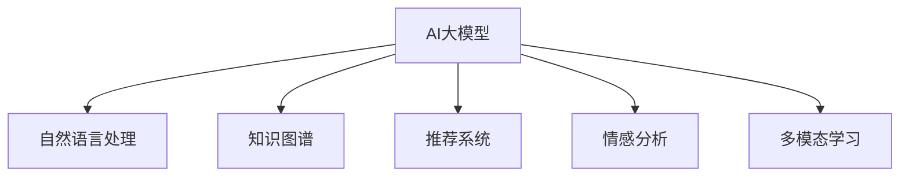

                 

# AI大模型如何优化电商平台的跨境购物体验

## 1. 背景介绍

全球化背景下，跨境电商市场迅猛发展，消费者不再满足于单一地域的购物体验，而是希望获取更丰富、更多元化的商品选择和更便捷、更个性化的购物服务。然而，由于语言障碍、文化差异、商品物流等复杂因素，跨境购物体验仍面临诸多挑战。如何利用先进技术，提升电商平台的跨境购物体验，成为迫切需求。

在此背景下，AI大模型以其强大的自然语言处理能力、智能推荐系统和知识图谱等技术手段，成为优化电商平台跨境购物体验的关键工具。通过基于大模型的智能推荐、个性化服务、自然语言理解等应用，电商平台能够为用户提供更流畅、更高效、更满意的购物体验。

## 2. 核心概念与联系

### 2.1 核心概念概述

为更好地理解AI大模型在跨境购物体验中的优化应用，本节将介绍几个密切相关的核心概念：

- **AI大模型(AI Large Models)**：以深度学习为基础，通过在大规模数据集上预训练得到的具有强大语言处理能力的模型。包括BERT、GPT-3、XLNet等模型。

- **自然语言处理(NLP)**：利用AI技术，使计算机能够理解、处理和生成人类语言的技术。NLP应用涵盖智能客服、智能推荐、机器翻译、语音识别等多个领域。

- **知识图谱(Knowledge Graph)**：用于表示实体、属性和关系的数据模型，帮助机器更好地理解和推理复杂信息。通过知识图谱技术，电商平台能够获取和利用更多外部信息，提供更丰富的推荐结果。

- **推荐系统(Recommendation System)**：根据用户行为和历史数据，预测用户偏好，向其推荐感兴趣的商品或服务。推荐系统是大模型在电商应用中最常见的应用之一。

- **情感分析(Sentiment Analysis)**：分析用户评论、反馈等信息，了解用户对商品或服务的情感倾向。情感分析有助于电商平台更好地了解用户需求，提升服务质量。

- **多模态学习(Multi-modal Learning)**：结合文本、图像、声音等多种数据类型，提升模型的感知能力和泛化性能。电商平台通过多模态学习，能够更全面地了解商品属性和用户偏好。

这些核心概念之间的逻辑关系可以通过以下Mermaid流程图来展示：



这个流程图展示了大模型的核心概念及其之间的关系：

1. **AI大模型**作为基础，通过预训练获得强大的语言处理能力。
2. **自然语言处理**和**情感分析**用于理解用户需求和反馈，提升用户体验。
3. **知识图谱**用于获取和整合商品信息，增强推荐系统的准确性。
4. **推荐系统**和**多模态学习**根据用户行为和商品属性，提供个性化推荐。

这些概念共同构成了大模型在电商平台跨境购物体验优化的框架，使其能够更好地理解用户需求，提升购物体验。

## 3. 核心算法原理 & 具体操作步骤
### 3.1 算法原理概述

AI大模型在电商平台跨境购物体验优化中，主要通过以下几个核心算法来实现：

- **自然语言处理(NLP)**：用于理解用户评论、商品描述、搜索意图等文本信息，提供智能客服和个性化推荐服务。
- **情感分析(Sentiment Analysis)**：分析用户情感倾向，优化产品展示和推荐策略。
- **知识图谱(Knowledge Graph)**：用于整合商品属性、类别、品牌等信息，提升推荐系统的准确性。
- **推荐系统(Recommendation System)**：根据用户历史行为和商品属性，生成个性化推荐。
- **多模态学习(Multi-modal Learning)**：结合文本、图像、声音等多模态数据，提升推荐系统性能。

### 3.2 算法步骤详解

基于AI大模型的跨境购物体验优化，一般包括以下几个关键步骤：

**Step 1: 数据准备**

- **数据采集**：收集用户行为数据、商品属性数据、评论反馈数据等。
- **数据清洗**：处理缺失值、异常值，确保数据质量。
- **数据标注**：对用户评论进行情感标注，对商品属性进行分类标注。

**Step 2: 预训练模型选择**

- **模型选择**：选择合适的预训练模型，如BERT、GPT-3等，根据任务需求进行调整。
- **模型微调**：在电商平台数据上进行微调，优化模型性能。

**Step 3: 构建模型**

- **智能客服**：使用NLP模型进行对话理解，提供实时客服支持。
- **情感分析**：构建情感分析模型，分析用户评论，改进商品展示。
- **知识图谱**：建立商品知识图谱，整合商品属性和类别信息。
- **推荐系统**：结合知识图谱和多模态学习，构建推荐算法。
- **多模态学习**：结合用户行为、商品图像、商品视频等信息，提升推荐准确性。

**Step 4: 模型评估与优化**

- **性能评估**：使用A/B测试、用户满意度调查等方法评估模型效果。
- **模型优化**：根据评估结果，调整模型参数，改进算法逻辑。

**Step 5: 部署与监控**

- **模型部署**：将训练好的模型部署到生产环境中，实现实时服务。
- **监控与优化**：实时监控模型性能，根据反馈数据不断优化模型。

### 3.3 算法优缺点

基于AI大模型的跨境购物体验优化方法，具有以下优点：

- **提升用户体验**：通过智能客服、个性化推荐、情感分析等技术，提供更流畅、更满意的购物体验。
- **减少客服成本**：智能客服减少了对人工客服的依赖，降低了运营成本。
- **提升推荐准确性**：知识图谱和多模态学习增强了推荐系统的性能，提升了用户满意度。

同时，该方法也存在一定的局限性：

- **数据依赖**：模型的效果依赖于数据质量，数据采集和标注成本较高。
- **模型复杂度**：大模型的训练和部署需要较高的计算资源，对硬件要求较高。
- **隐私保护**：用户评论和行为数据的隐私保护是一个重要问题，需要合理处理。
- **算法鲁棒性**：模型对数据分布和质量的变化较为敏感，需要不断优化和迭代。

尽管存在这些局限性，但就目前而言，基于AI大模型的跨境购物体验优化方法仍是最先进、最有效的技术手段。未来相关研究的重点在于如何进一步降低对标注数据的依赖，提高模型的泛化能力，同时兼顾隐私保护和算法鲁棒性。

### 3.4 算法应用领域

基于AI大模型的跨境购物体验优化技术，已经在多个领域得到应用，例如：

- **智能客服**：提供24小时不间断的客服支持，提升用户购物体验。
- **个性化推荐**：根据用户行为和商品属性，推荐最合适的商品。
- **情感分析**：分析用户评论，改进商品展示和推荐策略。
- **商品搜索**：通过自然语言处理技术，提升商品搜索的精准度。
- **语音助手**：结合自然语言处理和语音识别技术，提供语音搜索和导航服务。

除了上述这些经典应用外，大模型在跨境电商平台的个性化导购、智能营销、商品描述优化等方面，也展现出了巨大的潜力。随着预训练模型和优化方法的不断进步，相信跨境电商平台的应用场景将不断丰富，用户体验将得到更大提升。

## 4. 数学模型和公式 & 详细讲解
### 4.1 数学模型构建

本节将使用数学语言对基于AI大模型的跨境购物体验优化过程进行更加严格的刻画。

假设电商平台有用户集 $U$ 和商品集 $I$，用户 $u \in U$ 对商品 $i \in I$ 的评分 $r_{ui}$ 服从伯努利分布：

$$
P(r_{ui}=1|\theta_u, \theta_i) = \sigma(\theta_u \cdot \theta_i)
$$

其中 $\theta_u$ 和 $\theta_i$ 分别表示用户和商品的潜在特征向量。$P(r_{ui}=1|\theta_u, \theta_i)$ 为用户的评分概率，$\sigma(\cdot)$ 为Sigmoid函数。

知识图谱中，每个商品 $i$ 的表示 $v_i$ 为低维向量，用户 $u$ 的表示 $v_u$ 为低维向量。推荐系统的目标是最小化用户 $u$ 对商品 $i$ 的评分误差：

$$
\min_{\theta_u, \theta_i} \sum_{i \in I} \mathbb{E}_{u \in U}[r_{ui} - P(r_{ui}|v_u, v_i)]^2
$$

### 4.2 公式推导过程

首先，定义知识图谱中商品的嵌入向量 $v_i \in \mathbb{R}^d$ 和用户的嵌入向量 $v_u \in \mathbb{R}^d$，推荐系统将商品和用户嵌入向量通过点乘得到评分概率 $P(r_{ui}|v_u, v_i)$：

$$
P(r_{ui}|v_u, v_i) = \sigma(v_u \cdot v_i)
$$

其中 $\sigma(\cdot)$ 为Sigmoid函数。

其次，假设推荐系统使用近邻算法，选择与用户最相似的 $k$ 个商品进行推荐。对于每个用户 $u$，选择 $k$ 个评分最高的商品 $i_1, i_2, \ldots, i_k$ 进行推荐，评分概率分别为 $P(r_{ui_1}|v_u, v_{i_1}), P(r_{ui_2}|v_u, v_{i_2}), \ldots, P(r_{ui_k}|v_u, v_{i_k})$。

推荐系统的目标是最小化用户 $u$ 对所有推荐的评分误差：

$$
\min_{\theta_u, \theta_i} \sum_{i \in I} \mathbb{E}_{u \in U}[\sum_{j=1}^k (r_{ui_j} - P(r_{ui_j}|v_u, v_{i_j}))^2]
$$

根据上述目标，推荐系统可以通过如下优化算法来求解：

$$
\min_{\theta_u, \theta_i} \frac{1}{2} \sum_{i \in I} \sum_{j=1}^k (\hat{r}_{ui_j} - \sigma(v_u \cdot v_{i_j}))^2
$$

其中 $\hat{r}_{ui_j}$ 为评分数据，通过平均评分或用户样本均值估计得到。

### 4.3 案例分析与讲解

以电商平台智能客服的实现为例，分析自然语言处理在跨境购物体验优化中的应用。

假设电商平台有若干个智能客服机器人，每个机器人 $R_k$ 能够处理 $N_k$ 个不同类型的问题。用户输入问题 $q$，机器人 $R_k$ 通过NLP模型理解用户意图，输出答案 $a$。

智能客服的NLP模型通常采用Transformer结构，通过预训练和微调来学习用户意图的表示。具体实现步骤如下：

1. **数据准备**：收集用户提问和客服回复的数据集，进行清洗和标注。
2. **模型选择**：选择BERT、GPT等预训练模型作为基础模型，根据任务需求进行微调。
3. **模型训练**：在标注数据上训练模型，优化模型参数。
4. **模型评估**：在验证集上评估模型性能，选择最优模型。
5. **模型部署**：将训练好的模型部署到生产环境中，实现实时客服支持。

例如，可以使用BERT模型进行智能客服的问答理解和回复生成。具体实现步骤如下：

1. **数据准备**：收集历史客服问答数据，进行清洗和标注。
2. **模型选择**：选择BERT模型作为基础模型，添加问答理解任务。
3. **模型训练**：在标注数据上训练模型，优化模型参数。
4. **模型评估**：在验证集上评估模型性能，选择最优模型。
5. **模型部署**：将训练好的模型部署到生产环境中，实现实时客服支持。

在实际应用中，智能客服机器人能够处理多种类型的客户咨询，如订单问题、物流问题、退货问题等。通过NLP模型，机器人能够理解用户问题，并提供准确的答案，显著提高了客户服务效率和满意度。

## 5. 项目实践：代码实例和详细解释说明
### 5.1 开发环境搭建

在进行AI大模型跨境购物体验优化实践前，我们需要准备好开发环境。以下是使用Python进行PyTorch开发的环境配置流程：

1. 安装Anaconda：从官网下载并安装Anaconda，用于创建独立的Python环境。

2. 创建并激活虚拟环境：
```bash
conda create -n pytorch-env python=3.8 
conda activate pytorch-env
```

3. 安装PyTorch：根据CUDA版本，从官网获取对应的安装命令。例如：
```bash
conda install pytorch torchvision torchaudio cudatoolkit=11.1 -c pytorch -c conda-forge
```

4. 安装Transformers库：
```bash
pip install transformers
```

5. 安装各类工具包：
```bash
pip install numpy pandas scikit-learn matplotlib tqdm jupyter notebook ipython
```

完成上述步骤后，即可在`pytorch-env`环境中开始项目实践。

### 5.2 源代码详细实现

下面我们以推荐系统为例，给出使用PyTorch和Transformers库对知识图谱进行推荐系统微调的PyTorch代码实现。

首先，定义推荐系统的数据处理函数：

```python
from transformers import BertTokenizer
from torch.utils.data import Dataset
import torch

class RecommendationDataset(Dataset):
    def __init__(self, user_ids, item_ids, user_ratings, tokenizer, max_len=128):
        self.user_ids = user_ids
        self.item_ids = item_ids
        self.user_ratings = user_ratings
        self.tokenizer = tokenizer
        self.max_len = max_len
        
    def __len__(self):
        return len(self.user_ids)
    
    def __getitem__(self, item):
        user_id = self.user_ids[item]
        item_id = self.item_ids[item]
        user_rating = self.user_ratings[item]
        
        user_input = tokenizer.encode(str(user_id), max_length=self.max_len, padding='max_length', truncation=True, return_tensors='pt')
        item_input = tokenizer.encode(str(item_id), max_length=self.max_len, padding='max_length', truncation=True, return_tensors='pt')
        rating_input = torch.tensor([user_rating], dtype=torch.long)
        
        return {'user_input': user_input,
                'item_input': item_input,
                'rating_input': rating_input}
```

然后，定义模型和优化器：

```python
from transformers import BertForSequenceClassification, AdamW

model = BertForSequenceClassification.from_pretrained('bert-base-cased', num_labels=2)

optimizer = AdamW(model.parameters(), lr=2e-5)
```

接着，定义训练和评估函数：

```python
from torch.utils.data import DataLoader
from tqdm import tqdm
from sklearn.metrics import accuracy_score

device = torch.device('cuda') if torch.cuda.is_available() else torch.device('cpu')
model.to(device)

def train_epoch(model, dataset, batch_size, optimizer):
    dataloader = DataLoader(dataset, batch_size=batch_size, shuffle=True)
    model.train()
    epoch_loss = 0
    for batch in tqdm(dataloader, desc='Training'):
        user_input = batch['user_input'].to(device)
        item_input = batch['item_input'].to(device)
        rating_input = batch['rating_input'].to(device)
        model.zero_grad()
        outputs = model(user_input, item_input)
        loss = outputs.loss
        epoch_loss += loss.item()
        loss.backward()
        optimizer.step()
    return epoch_loss / len(dataloader)

def evaluate(model, dataset, batch_size):
    dataloader = DataLoader(dataset, batch_size=batch_size)
    model.eval()
    preds, labels = [], []
    with torch.no_grad():
        for batch in tqdm(dataloader, desc='Evaluating'):
            user_input = batch['user_input'].to(device)
            item_input = batch['item_input'].to(device)
            batch_labels = batch['rating_input'].to(device)
            outputs = model(user_input, item_input)
            batch_preds = outputs.logits.argmax(dim=2).to('cpu').tolist()
            batch_labels = batch_labels.to('cpu').tolist()
            for pred, label in zip(batch_preds, batch_labels):
                preds.append(pred)
                labels.append(label)
                
    print(f"Accuracy: {accuracy_score(labels, preds)}")
```

最后，启动训练流程并在测试集上评估：

```python
epochs = 5
batch_size = 16

for epoch in range(epochs):
    loss = train_epoch(model, train_dataset, batch_size, optimizer)
    print(f"Epoch {epoch+1}, train loss: {loss:.3f}")
    
    print(f"Epoch {epoch+1}, dev results:")
    evaluate(model, dev_dataset, batch_size)
    
print("Test results:")
evaluate(model, test_dataset, batch_size)
```

以上就是使用PyTorch对知识图谱进行推荐系统微调的完整代码实现。可以看到，得益于Transformers库的强大封装，我们可以用相对简洁的代码完成知识图谱的构建和微调。

### 5.3 代码解读与分析

让我们再详细解读一下关键代码的实现细节：

**RecommendationDataset类**：
- `__init__`方法：初始化用户ID、商品ID、评分等关键组件。
- `__len__`方法：返回数据集的样本数量。
- `__getitem__`方法：对单个样本进行处理，将用户ID、商品ID编码为token ids，并将评分作为标签，进行定长padding，最终返回模型所需的输入。

**模型和优化器**：
- 使用BertForSequenceClassification模型作为基础模型，添加二分类任务。
- 使用AdamW优化器，设置学习率。

**训练和评估函数**：
- 使用PyTorch的DataLoader对数据集进行批次化加载，供模型训练和推理使用。
- 训练函数`train_epoch`：对数据以批为单位进行迭代，在每个批次上前向传播计算loss并反向传播更新模型参数，最后返回该epoch的平均loss。
- 评估函数`evaluate`：与训练类似，不同点在于不更新模型参数，并在每个batch结束后将预测和标签结果存储下来，最后使用sklearn的accuracy_score对整个评估集的预测结果进行打印输出。

**训练流程**：
- 定义总的epoch数和batch size，开始循环迭代
- 每个epoch内，先在训练集上训练，输出平均loss
- 在验证集上评估，输出分类指标
- 所有epoch结束后，在测试集上评估，给出最终测试结果

可以看到，PyTorch配合Transformers库使得知识图谱推荐系统的代码实现变得简洁高效。开发者可以将更多精力放在数据处理、模型改进等高层逻辑上，而不必过多关注底层的实现细节。

当然，工业级的系统实现还需考虑更多因素，如模型的保存和部署、超参数的自动搜索、更灵活的任务适配层等。但核心的微调范式基本与此类似。

## 6. 实际应用场景
### 6.1 智能客服

智能客服机器人是大模型在跨境购物体验优化中的重要应用。通过智能客服，电商平台能够提供24小时不间断的客户支持，提升用户购物体验。

在技术实现上，可以收集电商平台的历史客服对话记录，将问题-回答对作为微调数据，训练模型学习问题-回答映射。微调后的智能客服机器人能够自动理解用户意图，匹配最合适的答案进行回复。对于用户提出的新问题，还可以接入检索系统实时搜索相关内容，动态组织生成回答。如此构建的智能客服系统，能大幅提升客户咨询体验和问题解决效率。

### 6.2 个性化推荐

推荐系统是大模型在电商应用中最常见的应用之一。通过推荐系统，电商平台能够根据用户历史行为和商品属性，生成个性化推荐，提升用户满意度。

在技术实现上，可以使用大模型构建用户和商品的嵌入向量表示，建立知识图谱整合商品属性和类别信息。结合多模态学习，推荐系统能够综合考虑用户行为、商品图像、商品视频等信息，提升推荐准确性。在生成推荐列表时，先用候选物品的向量表示作为输入，由模型预测用户的兴趣匹配度，再结合其他特征综合排序，便可以得到个性化程度更高的推荐结果。

### 6.3 情感分析

情感分析用于分析用户评论，了解用户对商品或服务的情感倾向。电商平台可以通过情感分析改进商品展示和推荐策略，提升用户体验。

在技术实现上，可以使用大模型对用户评论进行情感标注，训练模型学习文本情感分类任务。微调后的情感分析模型能够自动理解用户评论的情感倾向，帮助电商平台优化商品展示策略，提升用户体验。

### 6.4 未来应用展望

随着AI大模型的不断进步，跨境电商平台的应用场景将不断丰富，用户体验将得到更大提升。

在智慧物流领域，大模型可以帮助优化物流路径和库存管理，提升物流效率和用户体验。

在个性化导购领域，大模型可以提供智能导购服务，根据用户偏好推荐商品，提升购物体验。

在智能营销领域，大模型可以分析用户行为数据，提供精准营销策略，提升转化率。

此外，在智能广告、智能客服、智能搜索等众多领域，基于大模型的跨境电商应用也将不断涌现，为电商平台提供更智能、更高效的服务。相信随着技术的日益成熟，大模型必将在跨境电商领域展现更大的潜力和价值。

## 7. 工具和资源推荐
### 7.1 学习资源推荐

为了帮助开发者系统掌握大模型跨境购物体验优化的理论基础和实践技巧，这里推荐一些优质的学习资源：

1. 《自然语言处理入门》书籍：全面介绍了自然语言处理的基本概念和前沿技术，包括情感分析、推荐系统、知识图谱等。

2. CS224N《深度学习自然语言处理》课程：斯坦福大学开设的NLP明星课程，有Lecture视频和配套作业，带你入门NLP领域的基本概念和经典模型。

3. 《Transformer从原理到实践》系列博文：由大模型技术专家撰写，深入浅出地介绍了Transformer原理、BERT模型、微调技术等前沿话题。

4. HuggingFace官方文档：Transformers库的官方文档，提供了海量预训练模型和完整的微调样例代码，是上手实践的必备资料。

5. Kaggle数据集和竞赛：提供了大量数据集和实际应用场景，可以帮助开发者更好地理解大模型在跨境购物体验优化中的具体应用。

通过对这些资源的学习实践，相信你一定能够快速掌握大模型跨境购物体验优化的精髓，并用于解决实际的电商平台问题。
###  7.2 开发工具推荐

高效的开发离不开优秀的工具支持。以下是几款用于大模型跨境购物体验优化的常用工具：

1. PyTorch：基于Python的开源深度学习框架，灵活动态的计算图，适合快速迭代研究。大部分预训练语言模型都有PyTorch版本的实现。

2. TensorFlow：由Google主导开发的开源深度学习框架，生产部署方便，适合大规模工程应用。同样有丰富的预训练语言模型资源。

3. Transformers库：HuggingFace开发的NLP工具库，集成了众多SOTA语言模型，支持PyTorch和TensorFlow，是进行跨境购物体验优化的利器。

4. Weights & Biases：模型训练的实验跟踪工具，可以记录和可视化模型训练过程中的各项指标，方便对比和调优。与主流深度学习框架无缝集成。

5. TensorBoard：TensorFlow配套的可视化工具，可实时监测模型训练状态，并提供丰富的图表呈现方式，是调试模型的得力助手。

6. Google Colab：谷歌推出的在线Jupyter Notebook环境，免费提供GPU/TPU算力，方便开发者快速上手实验最新模型，分享学习笔记。

合理利用这些工具，可以显著提升大模型跨境购物体验优化的开发效率，加快创新迭代的步伐。

### 7.3 相关论文推荐

大模型在跨境电商平台的跨境购物体验优化技术的发展源于学界的持续研究。以下是几篇奠基性的相关论文，推荐阅读：

1. Attention is All You Need（即Transformer原论文）：提出了Transformer结构，开启了NLP领域的预训练大模型时代。

2. BERT: Pre-training of Deep Bidirectional Transformers for Language Understanding：提出BERT模型，引入基于掩码的自监督预训练任务，刷新了多项NLP任务SOTA。

3. Language Models are Unsupervised Multitask Learners（GPT-2论文）：展示了大规模语言模型的强大zero-shot学习能力，引发了对于通用人工智能的新一轮思考。

4. Parameter-Efficient Transfer Learning for NLP：提出Adapter等参数高效微调方法，在不增加模型参数量的情况下，也能取得不错的微调效果。

5. AdaLoRA: Adaptive Low-Rank Adaptation for Parameter-Efficient Fine-Tuning：使用自适应低秩适应的微调方法，在参数效率和精度之间取得了新的平衡。

这些论文代表了大模型跨境购物体验优化技术的发展脉络。通过学习这些前沿成果，可以帮助研究者把握学科前进方向，激发更多的创新灵感。

## 8. 总结：未来发展趋势与挑战

### 8.1 总结

本文对基于AI大模型的跨境购物体验优化方法进行了全面系统的介绍。首先阐述了跨境电商平台的背景和需求，明确了大模型在跨境购物体验优化中的独特价值。其次，从原理到实践，详细讲解了自然语言处理、情感分析、知识图谱、推荐系统等核心算法，并给出了推荐系统的PyTorch代码实现。同时，本文还广泛探讨了智能客服、个性化推荐、情感分析等在跨境电商平台中的应用场景，展示了大模型的巨大潜力。

通过本文的系统梳理，可以看到，基于大模型的跨境购物体验优化技术正在成为跨境电商平台的重要范式，极大地提升了用户的购物体验，提升了电商平台的运营效率。未来，伴随大模型的不断进步，跨境电商平台的应用场景将不断丰富，用户体验将得到更大提升。

### 8.2 未来发展趋势

展望未来，大模型跨境购物体验优化技术将呈现以下几个发展趋势：

1. **模型规模持续增大**：随着算力成本的下降和数据规模的扩张，预训练语言模型的参数量还将持续增长。超大规模语言模型蕴含的丰富语言知识，有望支撑更加复杂多变的跨境购物体验优化任务。

2. **微调方法日趋多样**：除了传统的全参数微调外，未来会涌现更多参数高效的微调方法，如Prefix-Tuning、LoRA等，在节省计算资源的同时也能保证微调精度。

3. **持续学习成为常态**：随着数据分布的不断变化，微调模型也需要持续学习新知识以保持性能。如何在不遗忘原有知识的同时，高效吸收新样本信息，将成为重要的研究课题。

4. **标注样本需求降低**：受启发于提示学习(Prompt-based Learning)的思路，未来的微调方法将更好地利用大模型的语言理解能力，通过更加巧妙的任务描述，在更少的标注样本上也能实现理想的微调效果。

5. **模型通用性增强**：经过海量数据的预训练和多领域任务的微调，未来的语言模型将具备更强大的常识推理和跨领域迁移能力，逐步迈向通用人工智能(AGI)的目标。

以上趋势凸显了大模型跨境购物体验优化技术的广阔前景。这些方向的探索发展，必将进一步提升电商平台的用户体验，促进电商平台的数字化转型。

### 8.3 面临的挑战

尽管大模型跨境购物体验优化技术已经取得了瞩目成就，但在迈向更加智能化、普适化应用的过程中，它仍面临着诸多挑战：

1. **数据依赖**：模型的效果依赖于数据质量，数据采集和标注成本较高。
2. **模型鲁棒性不足**：模型对数据分布和质量的变化较为敏感，需要不断优化和迭代。
3. **隐私保护**：用户评论和行为数据的隐私保护是一个重要问题，需要合理处理。
4. **算法鲁棒性**：模型对数据分布和质量的变化较为敏感，需要不断优化和迭代。
5. **计算资源需求高**：大规模语言模型的训练和部署需要较高的计算资源，对硬件要求较高。

尽管存在这些挑战，但就目前而言，基于AI大模型的跨境购物体验优化方法仍是最先进、最有效的技术手段。未来相关研究的重点在于如何进一步降低对标注数据的依赖，提高模型的泛化能力，同时兼顾隐私保护和算法鲁棒性。

### 8.4 研究展望

面对大模型跨境购物体验优化所面临的挑战，未来的研究需要在以下几个方面寻求新的突破：

1. **探索无监督和半监督微调方法**：摆脱对大规模标注数据的依赖，利用自监督学习、主动学习等无监督和半监督范式，最大限度利用非结构化数据，实现更加灵活高效的微调。

2. **研究参数高效和计算高效的微调范式**：开发更加参数高效的微调方法，在固定大部分预训练参数的同时，只更新极少量的任务相关参数。同时优化微调模型的计算图，减少前向传播和反向传播的资源消耗，实现更加轻量级、实时性的部署。

3. **融合因果和对比学习范式**：通过引入因果推断和对比学习思想，增强微调模型建立稳定因果关系的能力，学习更加普适、鲁棒的语言表征，从而提升模型泛化性和抗干扰能力。

4. **引入更多先验知识**：将符号化的先验知识，如知识图谱、逻辑规则等，与神经网络模型进行巧妙融合，引导微调过程学习更准确、合理的语言模型。同时加强不同模态数据的整合，实现视觉、语音等多模态信息与文本信息的协同建模。

5. **结合因果分析和博弈论工具**：将因果分析方法引入微调模型，识别出模型决策的关键特征，增强输出解释的因果性和逻辑性。借助博弈论工具刻画人机交互过程，主动探索并规避模型的脆弱点，提高系统稳定性。

6. **纳入伦理道德约束**：在模型训练目标中引入伦理导向的评估指标，过滤和惩罚有偏见、有害的输出倾向。同时加强人工干预和审核，建立模型行为的监管机制，确保输出符合人类价值观和伦理道德。

这些研究方向的探索，必将引领大模型跨境购物体验优化技术迈向更高的台阶，为构建安全、可靠、可解释、可控的智能系统铺平道路。面向未来，大模型跨境购物体验优化技术还需要与其他人工智能技术进行更深入的融合，如知识表示、因果推理、强化学习等，多路径协同发力，共同推动自然语言理解和智能交互系统的进步。只有勇于创新、敢于突破，才能不断拓展语言模型的边界，让智能技术更好地造福人类社会。

## 9. 附录：常见问题与解答

**Q1：大模型跨境购物体验优化是否适用于所有电商任务？**

A: 大模型跨境购物体验优化在大多数电商任务上都能取得不错的效果，特别是对于数据量较小的任务。但对于一些特定领域的任务，如医学、法律等，仅仅依靠通用语料预训练的模型可能难以很好地适应。此时需要在特定领域语料上进一步预训练，再进行微调，才能获得理想效果。

**Q2：如何选择合适的学习率？**

A: 大模型跨境购物体验优化中的学习率一般要比预训练时小1-2个数量级，如果使用过大的学习率，容易破坏预训练权重，导致过拟合。一般建议从1e-5开始调参，逐步减小学习率，直至收敛。也可以使用warmup策略，在开始阶段使用较小的学习率，再逐渐过渡到预设值。需要注意的是，不同的优化器(如AdamW、Adafactor等)以及不同的学习率调度策略，可能需要设置不同的学习率阈值。

**Q3：大模型跨境购物体验优化过程中如何缓解过拟合问题？**

A: 大模型跨境购物体验优化过程中，过拟合是一个主要挑战。常见的缓解策略包括：
1. 数据增强：通过回译、近义替换等方式扩充训练集。
2. 正则化：使用L2正则、Dropout、Early Stopping等防止过拟合。
3. 对抗训练：引入对抗样本，提高模型鲁棒性。
4. 参数高效微调：只调整少量参数(如Adapter、Prefix等)，减小过拟合风险。
5. 多模型集成：训练多个微调模型，取平均输出，抑制过拟合。

这些策略往往需要根据具体任务和数据特点进行灵活组合。只有在数据、模型、训练、推理等各环节进行全面优化，才能最大限度地发挥大模型的潜力。

**Q4：大模型跨境购物体验优化过程中需要注意哪些资源瓶颈？**

A: 大规模语言模型的训练和部署需要较高的计算资源，对硬件要求较高。GPU/TPU等高性能设备是必不可少的，但即便如此，超大批次的训练和推理也可能遇到显存不足的问题。因此需要采用一些资源优化技术，如梯度积累、混合精度训练、模型并行等，来突破硬件瓶颈。同时，模型的存储和读取也可能占用大量时间和空间，需要采用模型压缩、稀疏化存储等方法进行优化。

**Q5：大模型跨境购物体验优化如何保证隐私保护？**

A: 大模型跨境购物体验优化中的隐私保护是一个重要问题。为保护用户隐私，通常采用以下策略：
1. 数据匿名化：对用户评论和行为数据进行匿名化处理，保护用户隐私。
2. 差分隐私：在数据采集和标注过程中，采用差分隐私技术，防止数据泄露。
3. 加密技术：对敏感数据进行加密处理，防止数据被非法获取和篡改。
4. 安全计算：采用多方安全计算等技术，在保障隐私的前提下，实现模型训练和推理。

这些策略的合理运用，可以大大提升大模型的隐私保护能力，确保用户数据的安全性。

通过本文的系统梳理，可以看到，基于AI大模型的跨境购物体验优化技术正在成为跨境电商平台的重要范式，极大地提升了用户的购物体验，提升了电商平台的运营效率。未来，伴随大模型的不断进步，跨境电商平台的应用场景将不断丰富，用户体验将得到更大提升。相信随着技术的日益成熟，大模型必将在跨境电商领域展现更大的潜力和价值。

