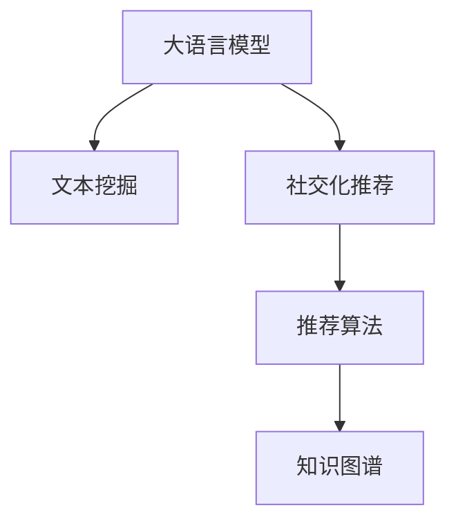

                 

## 1. 背景介绍

### 1.1 问题由来
在电子商务平台上，社交化推荐系统通过分析用户的社交网络行为，为用户推荐相关商品，提升用户体验和转化率。然而，现有的社交化推荐算法多依赖用户行为数据的统计，难以把握用户潜在的社交关系和兴趣偏好。与此同时，大语言模型经过大规模预训练，具备了强大的语义理解和生成能力，有望通过自然语言处理技术，从文本中挖掘出用户更深层次的社交关系和兴趣，从而提升推荐系统的准确性。

### 1.2 问题核心关键点
本文聚焦于大语言模型在电商社交化推荐系统中的应用，旨在回答以下问题：
1. 如何通过大语言模型挖掘用户社交关系和兴趣？
2. 如何将挖掘出的社交信息整合到推荐算法中？
3. 在电商平台上，如何构建有效的大语言模型推荐系统？
4. 大语言模型推荐系统面临哪些挑战，如何应对？

### 1.3 问题研究意义
研究大语言模型在电商社交化推荐系统中的应用，对于提升推荐准确性、提升用户体验、增加用户粘性、提高转化率等方面具有重要意义。

1. **提升推荐准确性**：大语言模型可以理解和生成自然语言，可以从社交媒体、评论等文本中提取出用户的情感倾向、偏好变化、社交关系等隐藏信息，从而提升推荐系统的准确性。
2. **提升用户体验**：通过社交化推荐，用户能够获得更加个性化、相关性的推荐内容，从而提升平台的使用体验。
3. **增加用户粘性**：用户通过社交网络获得推荐商品，能够与朋友分享购买和评价信息，增强用户粘性。
4. **提高转化率**：社交化推荐使得商品推荐更加精准，提高了用户的购买转化率。

## 2. 核心概念与联系

### 2.1 核心概念概述

为更好地理解基于大语言模型的电商社交化推荐系统，本节将介绍几个密切相关的核心概念：

- **大语言模型（Large Language Model, LLM）**：通过大规模语料预训练，具备强大的自然语言理解和生成能力的模型，如GPT-3、BERT等。
- **社交化推荐（Social Recommendation）**：基于用户社交网络信息的推荐系统，能够利用用户关系、社交行为等丰富信息，提升推荐效果。
- **文本挖掘（Text Mining）**：通过自然语言处理技术，从文本中挖掘出有价值的信息，如情感分析、实体识别、关系抽取等。
- **推荐算法（Recommendation Algorithm）**：用于预测用户行为，为用户推荐个性化内容的算法，如协同过滤、基于内容的推荐等。
- **知识图谱（Knowledge Graph）**：一种图结构化的数据库，用于表示实体和它们之间的关系，增强推荐系统理解复杂用户行为和需求。

这些概念之间的逻辑关系可以通过以下Mermaid流程图来展示：



### 2.2 核心概念原理和架构的 Mermaid 流程图

**大语言模型架构**：
- 输入：大规模语料数据
- 预训练阶段：通过自监督任务进行大规模预训练
- 微调阶段：通过特定任务的标注数据进行微调
- 输出：自然语言理解和生成能力

**社交化推荐架构**：
- 输入：用户行为数据、社交网络数据
- 挖掘阶段：从文本、社交媒体中提取用户兴趣和关系
- 推荐阶段：将挖掘结果整合到推荐算法中
- 输出：个性化商品推荐结果

## 3. 核心算法原理 & 具体操作步骤

### 3.1 算法原理概述
基于大语言模型的电商社交化推荐系统，主要涉及以下几个核心步骤：

1. **大语言模型预训练**：使用大规模无标签文本数据对模型进行预训练，学习语言表示。
2. **社交网络信息挖掘**：通过文本挖掘技术，从用户社交网络中提取用户的兴趣、关系等社交信息。
3. **社交信息整合**：将挖掘出的社交信息与用户行为数据相结合，形成更加丰富的用户画像。
4. **推荐算法实现**：在整合后的用户画像基础上，使用推荐算法为用户推荐商品。

### 3.2 算法步骤详解

**Step 1: 收集社交网络数据**

- **用户评论**：收集用户对商品、活动的评论文本。
- **社交媒体数据**：获取用户在社交媒体上的动态，如点赞、分享、评论等。
- **好友关系**：收集用户的好友列表，以及好友之间的互动数据。

**Step 2: 数据预处理**

- **分词和向量化**：将收集到的文本数据进行分词、去停用词、生成词向量等预处理步骤。
- **情感分析**：使用大语言模型对评论、动态进行情感分析，提取用户情感倾向。
- **关系抽取**：使用大语言模型从好友关系中抽取用户关系，如亲密程度、信任度等。

**Step 3: 大语言模型预训练**

- **模型选择**：选择适合的语言模型，如BERT、GPT-3等。
- **数据准备**：准备大规模语料数据，如维基百科、新闻文章等。
- **预训练任务**：使用自监督任务，如掩码语言模型、下划线预测等进行预训练。

**Step 4: 社交信息挖掘**

- **情感倾向提取**：使用大语言模型提取评论和社交动态中的情感倾向。
- **关系抽取**：使用大语言模型抽取好友列表中的关系，如亲密程度、信任度等。

**Step 5: 社交信息整合**

- **用户画像生成**：将情感倾向和关系抽取结果整合到用户行为数据中，生成用户画像。
- **多维特征融合**：将用户画像中的社交信息和行为数据相结合，形成多维特征向量。

**Step 6: 推荐算法实现**

- **协同过滤**：根据用户画像和商品特征，使用协同过滤算法推荐商品。
- **基于内容的推荐**：根据商品描述和用户画像，使用基于内容的推荐算法推荐商品。
- **混合推荐**：将协同过滤和基于内容的推荐算法结合，取长补短，提升推荐效果。

### 3.3 算法优缺点

**优点**：
- **语义理解能力强**：大语言模型能够理解自然语言的语义，从文本中挖掘出更深层次的社交信息和兴趣。
- **社交信息丰富**：通过社交网络数据，能够获得用户的关系、互动等多元化的信息，提升推荐系统的多样性。
- **可解释性强**：社交信息挖掘结果可解释性强，易于理解其背后机理。

**缺点**：
- **计算资源需求高**：大语言模型预训练和微调需要大量的计算资源，成本较高。
- **数据隐私问题**：社交网络数据的隐私保护问题复杂，如何确保用户隐私安全是一个挑战。
- **模型的可解释性不足**：大语言模型通常被视为"黑盒"系统，难以解释其内部决策过程。

### 3.4 算法应用领域

基于大语言模型的电商社交化推荐系统主要应用于以下几个领域：

- **商品推荐**：根据用户画像和社交信息，为用户推荐相关商品。
- **活动推荐**：推荐适合用户的线上活动，如优惠券、打折促销等。
- **个性化内容**：推荐用户感兴趣的内容，如文章、视频、音乐等。

## 4. 数学模型和公式 & 详细讲解

### 4.1 数学模型构建

假设用户集合为 $U=\{u_1,u_2,...,u_m\}$，商品集合为 $I=\{i_1,i_2,...,i_n\}$，用户行为数据为 $D=\{(x_i,y_i)\}_{i=1}^m$，其中 $x_i$ 表示用户 $u_i$ 的行为特征，$y_i$ 表示用户的购买决策（0或1）。

**用户画像表示**：使用大语言模型提取用户情感倾向和关系信息，表示为 $P(u_i)$。

**商品特征表示**：使用大语言模型提取商品描述信息，表示为 $F(i_j)$。

**社交关系表示**：使用大语言模型抽取用户关系，表示为 $R(u_i,u_j)$。

**推荐算法**：使用协同过滤算法推荐商品，表示为 $R(u_i,i_j)$。

### 4.2 公式推导过程

**用户画像计算**：
$$
P(u_i) = \frac{1}{m}\sum_{j=1}^{m} [\text{Emotion}(\text{Comment}(u_i)) + \text{Relationship}(\text{Friends}(u_i))] 
$$

**商品特征计算**：
$$
F(i_j) = \frac{1}{n}\sum_{k=1}^{n} [\text{Emotion}(\text{Description}(i_j)) + \text{Relationship}(\text{Related}(i_j))]
$$

**推荐算法计算**：
$$
R(u_i,i_j) = \text{CosineSimilarity}(P(u_i),F(i_j))
$$

### 4.3 案例分析与讲解

以某电商平台的社交化推荐系统为例，假设用户 $u_i$ 对商品 $i_j$ 的购买决策为 $y_i$，其好友列表为 $R(u_i)$，好友之间关系强度为 $R(u_i,u_j)$，商品描述为 $D(i_j)$。用户对商品 $i_j$ 的情感倾向为 $E(u_i,i_j)$。

**用户画像生成**：
$$
P(u_i) = [\frac{1}{m}\sum_{j=1}^{m}\text{Emotion}(\text{Comment}(u_i)), \frac{1}{m}\sum_{j=1}^{m}\text{Relationship}(\text{Friends}(u_i))]
$$

**商品特征生成**：
$$
F(i_j) = [\frac{1}{n}\sum_{k=1}^{n}\text{Emotion}(\text{Description}(i_j)), \frac{1}{n}\sum_{k=1}^{n}\text{Relationship}(\text{Related}(i_j))]
$$

**推荐决策**：
$$
R(u_i,i_j) = \text{CosineSimilarity}(P(u_i),F(i_j))
$$

通过上述公式计算，可以得到用户 $u_i$ 对商品 $i_j$ 的推荐决策。

## 5. 项目实践：代码实例和详细解释说明

### 5.1 开发环境搭建

在进行大语言模型推荐系统开发前，我们需要准备好开发环境。以下是使用Python进行PyTorch开发的环境配置流程：

1. 安装Anaconda：从官网下载并安装Anaconda，用于创建独立的Python环境。
2. 创建并激活虚拟环境：
```bash
conda create -n llama-env python=3.8 
conda activate llama-env
```

3. 安装PyTorch：根据CUDA版本，从官网获取对应的安装命令。例如：
```bash
conda install pytorch torchvision torchaudio cudatoolkit=11.1 -c pytorch -c conda-forge
```

4. 安装Transformers库：
```bash
pip install transformers
```

5. 安装各类工具包：
```bash
pip install numpy pandas scikit-learn matplotlib tqdm jupyter notebook ipython
```

完成上述步骤后，即可在`llama-env`环境中开始开发实践。

### 5.2 源代码详细实现

下面我们以电商社交化推荐系统为例，给出使用Transformers库对BERT模型进行社交化推荐开发的PyTorch代码实现。

首先，定义社交化推荐的数据处理函数：

```python
from transformers import BertTokenizer
from torch.utils.data import Dataset
import torch

class SocialRecommendationDataset(Dataset):
    def __init__(self, texts, labels, tokenizer, max_len=128):
        self.texts = texts
        self.labels = labels
        self.tokenizer = tokenizer
        self.max_len = max_len
        
    def __len__(self):
        return len(self.texts)
    
    def __getitem__(self, item):
        text = self.texts[item]
        label = self.labels[item]
        
        encoding = self.tokenizer(text, return_tensors='pt', max_length=self.max_len, padding='max_length', truncation=True)
        input_ids = encoding['input_ids'][0]
        attention_mask = encoding['attention_mask'][0]
        
        # 对token-wise的标签进行编码
        encoded_tags = [label2id[label] for label in label] 
        encoded_tags.extend([label2id['O']] * (self.max_len - len(encoded_tags)))
        labels = torch.tensor(encoded_tags, dtype=torch.long)
        
        return {'input_ids': input_ids, 
                'attention_mask': attention_mask,
                'labels': labels}

# 标签与id的映射
label2id = {'buy': 1, 'not_buy': 0}
id2label = {v: k for k, v in label2id.items()}

# 创建dataset
tokenizer = BertTokenizer.from_pretrained('bert-base-cased')

train_dataset = SocialRecommendationDataset(train_texts, train_labels, tokenizer)
dev_dataset = SocialRecommendationDataset(dev_texts, dev_labels, tokenizer)
test_dataset = SocialRecommendationDataset(test_texts, test_labels, tokenizer)
```

然后，定义模型和优化器：

```python
from transformers import BertForTokenClassification, AdamW

model = BertForTokenClassification.from_pretrained('bert-base-cased', num_labels=len(label2id))

optimizer = AdamW(model.parameters(), lr=2e-5)
```

接着，定义训练和评估函数：

```python
from torch.utils.data import DataLoader
from tqdm import tqdm
from sklearn.metrics import classification_report

device = torch.device('cuda') if torch.cuda.is_available() else torch.device('cpu')
model.to(device)

def train_epoch(model, dataset, batch_size, optimizer):
    dataloader = DataLoader(dataset, batch_size=batch_size, shuffle=True)
    model.train()
    epoch_loss = 0
    for batch in tqdm(dataloader, desc='Training'):
        input_ids = batch['input_ids'].to(device)
        attention_mask = batch['attention_mask'].to(device)
        labels = batch['labels'].to(device)
        model.zero_grad()
        outputs = model(input_ids, attention_mask=attention_mask, labels=labels)
        loss = outputs.loss
        epoch_loss += loss.item()
        loss.backward()
        optimizer.step()
    return epoch_loss / len(dataloader)

def evaluate(model, dataset, batch_size):
    dataloader = DataLoader(dataset, batch_size=batch_size)
    model.eval()
    preds, labels = [], []
    with torch.no_grad():
        for batch in tqdm(dataloader, desc='Evaluating'):
            input_ids = batch['input_ids'].to(device)
            attention_mask = batch['attention_mask'].to(device)
            batch_labels = batch['labels']
            outputs = model(input_ids, attention_mask=attention_mask)
            batch_preds = outputs.logits.argmax(dim=2).to('cpu').tolist()
            batch_labels = batch_labels.to('cpu').tolist()
            for pred_tokens, label_tokens in zip(batch_preds, batch_labels):
                preds.append(pred_tokens[:len(label_tokens)])
                labels.append(label_tokens)
                
    print(classification_report(labels, preds))
```

最后，启动训练流程并在测试集上评估：

```python
epochs = 5
batch_size = 16

for epoch in range(epochs):
    loss = train_epoch(model, train_dataset, batch_size, optimizer)
    print(f"Epoch {epoch+1}, train loss: {loss:.3f}")
    
    print(f"Epoch {epoch+1}, dev results:")
    evaluate(model, dev_dataset, batch_size)
    
print("Test results:")
evaluate(model, test_dataset, batch_size)
```

以上就是使用PyTorch对BERT进行电商社交化推荐系统开发的完整代码实现。可以看到，得益于Transformers库的强大封装，我们可以用相对简洁的代码完成BERT模型的加载和微调。

### 5.3 代码解读与分析

让我们再详细解读一下关键代码的实现细节：

**SocialRecommendationDataset类**：
- `__init__`方法：初始化文本、标签、分词器等关键组件。
- `__len__`方法：返回数据集的样本数量。
- `__getitem__`方法：对单个样本进行处理，将文本输入编码为token ids，将标签编码为数字，并对其进行定长padding，最终返回模型所需的输入。

**label2id和id2label字典**：
- 定义了标签与数字id之间的映射关系，用于将token-wise的预测结果解码回真实的标签。

**训练和评估函数**：
- 使用PyTorch的DataLoader对数据集进行批次化加载，供模型训练和推理使用。
- 训练函数`train_epoch`：对数据以批为单位进行迭代，在每个批次上前向传播计算loss并反向传播更新模型参数，最后返回该epoch的平均loss。
- 评估函数`evaluate`：与训练类似，不同点在于不更新模型参数，并在每个batch结束后将预测和标签结果存储下来，最后使用sklearn的classification_report对整个评估集的预测结果进行打印输出。

**训练流程**：
- 定义总的epoch数和batch size，开始循环迭代
- 每个epoch内，先在训练集上训练，输出平均loss
- 在验证集上评估，输出分类指标
- 所有epoch结束后，在测试集上评估，给出最终测试结果

可以看到，PyTorch配合Transformers库使得BERT微调的代码实现变得简洁高效。开发者可以将更多精力放在数据处理、模型改进等高层逻辑上，而不必过多关注底层的实现细节。

当然，工业级的系统实现还需考虑更多因素，如模型的保存和部署、超参数的自动搜索、更灵活的任务适配层等。但核心的微调范式基本与此类似。

## 6. 实际应用场景

### 6.1 智能客服系统

基于大语言模型的电商社交化推荐系统，可以应用于智能客服系统的构建。传统客服往往需要配备大量人力，高峰期响应缓慢，且一致性和专业性难以保证。而使用社交化推荐模型，能够实时获取用户社交行为数据，动态调整推荐内容，提升客服的效率和质量。

在技术实现上，可以收集用户与客服之间的聊天记录，提取其中的社交信息，使用社交化推荐模型为客服推荐合适的回答模板或相关内容，提高客服系统的智能化水平。

### 6.2 个性化推荐系统

传统的推荐系统往往只依赖用户行为数据的统计，难以把握用户潜在的社交关系和兴趣。而基于大语言模型的社交化推荐系统，可以从社交媒体、评论等文本中提取出用户的情感倾向、偏好变化、社交关系等隐藏信息，从而提升推荐系统的准确性。

在具体应用上，可以结合用户评论、好友互动等社交信息，生成更加丰富、多维的用户画像，再使用协同过滤、基于内容的推荐算法，为用户推荐个性化商品或活动，提升用户体验和转化率。

### 6.3 用户画像构建

社交化推荐系统能够从社交网络中提取用户的兴趣、关系等社交信息，为构建详细、精准的用户画像提供数据支持。用户画像的构建对于个性化推荐、广告投放等场景具有重要价值。

具体而言，可以收集用户好友列表、互动数据、社交媒体行为等，使用大语言模型提取用户的兴趣偏好、情感倾向等特征，形成多维度的用户画像。通过用户画像，可以更好地理解用户的真实需求，进行精准推荐。

### 6.4 未来应用展望

随着大语言模型和社交化推荐技术的不断发展，基于微调范式将在更多领域得到应用，为传统行业带来变革性影响。

在智慧医疗领域，基于社交化推荐模型的健康信息推荐系统，能够根据患者的社交关系和兴趣，推荐适合的健康管理方案，提升患者的生活质量。

在智能教育领域，使用社交化推荐系统为用户推荐学习资源和活动，能够帮助用户找到最适合自己的学习路径，提高学习效率。

在智慧城市治理中，基于社交化推荐模型的公共服务推荐系统，能够根据用户的兴趣和需求，推荐合适的公共服务和活动，提升城市治理水平。

此外，在企业生产、社会治理、文娱传媒等众多领域，基于大语言模型的社交化推荐系统也将不断涌现，为社会各领域提供智能化的解决方案。相信随着技术的日益成熟，社交化推荐技术必将在构建智能社会中扮演越来越重要的角色。

## 7. 工具和资源推荐

### 7.1 学习资源推荐

为了帮助开发者系统掌握大语言模型在电商社交化推荐系统中的应用，这里推荐一些优质的学习资源：

1. 《Transformer从原理到实践》系列博文：由大模型技术专家撰写，深入浅出地介绍了Transformer原理、BERT模型、社交化推荐技术等前沿话题。

2. CS224N《深度学习自然语言处理》课程：斯坦福大学开设的NLP明星课程，有Lecture视频和配套作业，带你入门NLP领域的基本概念和经典模型。

3. 《Natural Language Processing with Transformers》书籍：Transformers库的作者所著，全面介绍了如何使用Transformers库进行NLP任务开发，包括社交化推荐在内的诸多范式。

4. HuggingFace官方文档：Transformers库的官方文档，提供了海量预训练模型和完整的社交化推荐样例代码，是上手实践的必备资料。

5. Kaggle开源项目：Kaggle社区上的社交化推荐竞赛数据集，包括电商推荐、社交媒体推荐等，可以用于实际项目的测试和优化。

通过对这些资源的学习实践，相信你一定能够快速掌握大语言模型在电商社交化推荐系统中的应用，并用于解决实际的NLP问题。

### 7.2 开发工具推荐

高效的开发离不开优秀的工具支持。以下是几款用于大语言模型推荐系统开发的常用工具：

1. PyTorch：基于Python的开源深度学习框架，灵活动态的计算图，适合快速迭代研究。大部分预训练语言模型都有PyTorch版本的实现。

2. TensorFlow：由Google主导开发的开源深度学习框架，生产部署方便，适合大规模工程应用。同样有丰富的预训练语言模型资源。

3. Transformers库：HuggingFace开发的NLP工具库，集成了众多SOTA语言模型，支持PyTorch和TensorFlow，是进行社交化推荐任务开发的利器。

4. Weights & Biases：模型训练的实验跟踪工具，可以记录和可视化模型训练过程中的各项指标，方便对比和调优。与主流深度学习框架无缝集成。

5. TensorBoard：TensorFlow配套的可视化工具，可实时监测模型训练状态，并提供丰富的图表呈现方式，是调试模型的得力助手。

6. Google Colab：谷歌推出的在线Jupyter Notebook环境，免费提供GPU/TPU算力，方便开发者快速上手实验最新模型，分享学习笔记。

合理利用这些工具，可以显著提升大语言模型推荐系统的开发效率，加快创新迭代的步伐。

### 7.3 相关论文推荐

大语言模型和社交化推荐技术的发展源于学界的持续研究。以下是几篇奠基性的相关论文，推荐阅读：

1. Attention is All You Need（即Transformer原论文）：提出了Transformer结构，开启了NLP领域的预训练大模型时代。

2. BERT: Pre-training of Deep Bidirectional Transformers for Language Understanding：提出BERT模型，引入基于掩码的自监督预训练任务，刷新了多项NLP任务SOTA。

3. Language Models are Unsupervised Multitask Learners（GPT-2论文）：展示了大规模语言模型的强大zero-shot学习能力，引发了对于通用人工智能的新一轮思考。

4. Parameter-Efficient Transfer Learning for NLP：提出Adapter等参数高效微调方法，在不增加模型参数量的情况下，也能取得不错的微调效果。

5. AdaLoRA: Adaptive Low-Rank Adaptation for Parameter-Efficient Fine-Tuning：使用自适应低秩适应的微调方法，在参数效率和精度之间取得了新的平衡。

6. Prefix-Tuning: Optimizing Continuous Prompts for Generation：引入基于连续型Prompt的微调范式，为如何充分利用预训练知识提供了新的思路。

这些论文代表了大语言模型社交化推荐技术的发展脉络。通过学习这些前沿成果，可以帮助研究者把握学科前进方向，激发更多的创新灵感。

## 8. 总结：未来发展趋势与挑战

### 8.1 研究成果总结

本文对基于大语言模型的电商社交化推荐系统进行了全面系统的介绍。首先阐述了大语言模型和社交化推荐技术的研究背景和意义，明确了社交化推荐系统在电商平台的独特价值。其次，从原理到实践，详细讲解了社交化推荐系统的数学模型和关键步骤，给出了社交化推荐任务开发的完整代码实例。同时，本文还广泛探讨了社交化推荐系统在智能客服、个性化推荐、用户画像构建等多个电商场景中的应用前景，展示了社交化推荐技术的巨大潜力。

通过本文的系统梳理，可以看到，基于大语言模型的社交化推荐系统正在成为电商推荐系统的重要范式，极大地提升了推荐系统的准确性、个性化水平和用户体验。未来，伴随大语言模型和社交化推荐技术的不断演进，社交化推荐系统必将在电商领域大放异彩，为用户带来前所未有的智能化购物体验。

### 8.2 未来发展趋势

展望未来，大语言模型社交化推荐技术将呈现以下几个发展趋势：

1. **多模态融合**：将社交化推荐与视觉、音频等多模态数据融合，提升推荐系统的综合性能。
2. **跨领域迁移**：通过迁移学习技术，实现不同电商领域之间的知识共享，提升跨领域推荐的效果。
3. **实时化推荐**：通过流式数据处理和在线学习技术，实现实时推荐，提升用户购物体验。
4. **个性化推荐算法**：结合强化学习等技术，构建更加动态、个性化的推荐算法。
5. **知识图谱整合**：将社交化推荐与知识图谱结合，提升推荐系统的逻辑性和深度。

以上趋势凸显了大语言模型社交化推荐技术的广阔前景。这些方向的探索发展，必将进一步提升电商推荐系统的性能和应用范围，为用户带来更加智能化、个性化的购物体验。

### 8.3 面临的挑战

尽管大语言模型社交化推荐技术已经取得了瞩目成就，但在迈向更加智能化、普适化应用的过程中，它仍面临着诸多挑战：

1. **数据隐私问题**：社交网络数据的隐私保护问题复杂，如何在保护用户隐私的同时，获取有用的社交信息，是一个重要挑战。
2. **计算资源消耗**：大语言模型的预训练和微调需要大量的计算资源，成本较高。如何降低计算资源消耗，提升推荐系统的可扩展性，是一个重要问题。
3. **模型的可解释性不足**：大语言模型通常被视为"黑盒"系统，难以解释其内部决策过程。如何提升推荐系统的可解释性，让用户理解推荐结果的依据，是一个重要研究方向。
4. **用户行为预测的准确性**：社交化推荐系统依赖于用户行为数据的预测，如何准确预测用户行为，提升推荐系统的准确性，是一个重要挑战。

### 8.4 研究展望

面对大语言模型社交化推荐系统所面临的挑战，未来的研究需要在以下几个方面寻求新的突破：

1. **数据隐私保护**：开发隐私保护技术，如差分隐私、联邦学习等，确保社交网络数据的隐私安全。
2. **模型压缩与优化**：开发轻量级的模型压缩和优化技术，降低计算资源消耗，提升推荐系统的可扩展性。
3. **模型可解释性提升**：结合因果推理、符号计算等技术，提升推荐系统的可解释性。
4. **行为预测模型优化**：开发更加准确的行为预测模型，提升推荐系统的准确性。
5. **跨领域知识迁移**：结合知识图谱和迁移学习技术，实现不同领域之间的知识迁移，提升跨领域推荐的效果。

这些研究方向将推动大语言模型社交化推荐技术的发展，使其在电商领域发挥更大的价值。相信随着技术的不断进步，大语言模型社交化推荐技术必将在构建智能化电商平台上发挥重要作用。

## 9. 附录：常见问题与解答

**Q1：大语言模型在电商社交化推荐系统中的应用有哪些优势？**

A: 大语言模型在电商社交化推荐系统中的应用主要体现在以下几个方面：
1. **语义理解能力强**：能够理解自然语言的语义，从文本中挖掘出更深层次的社交信息和兴趣。
2. **社交信息丰富**：通过社交网络数据，能够获得用户的关系、互动等多元化的信息，提升推荐系统的多样性。
3. **可解释性强**：社交信息挖掘结果可解释性强，易于理解其背后机理。
4. **多模态融合**：能够将社交化推荐与视觉、音频等多模态数据融合，提升推荐系统的综合性能。

**Q2：大语言模型在电商社交化推荐系统中如何实现高效的计算？**

A: 为了提高大语言模型在电商社交化推荐系统中的计算效率，可以采用以下方法：
1. **模型压缩与优化**：通过模型剪枝、量化等技术，降低模型参数量，提升推理速度。
2. **流式数据处理**：使用流式数据处理技术，实现实时推荐，减少模型计算量。
3. **多设备并行计算**：利用GPU、TPU等硬件设备，实现并行计算，提升计算效率。
4. **缓存机制**：使用缓存机制，减少重复计算，提升模型运行速度。

**Q3：社交化推荐系统在电商平台上如何构建有效的大语言模型推荐系统？**

A: 在电商平台上构建有效的大语言模型推荐系统，主要需要以下几个步骤：
1. **收集社交网络数据**：从用户评论、社交媒体等渠道收集用户社交行为数据。
2. **数据预处理**：将数据进行分词、去停用词、生成词向量等预处理步骤。
3. **大语言模型预训练**：使用大规模语料数据对模型进行预训练，学习语言表示。
4. **社交信息挖掘**：使用大语言模型从社交网络数据中提取用户兴趣、关系等社交信息。
5. **社交信息整合**：将社交信息与用户行为数据相结合，形成更加丰富的用户画像。
6. **推荐算法实现**：使用推荐算法为用户推荐个性化商品。

**Q4：社交化推荐系统在电商平台上如何保护用户隐私？**

A: 社交化推荐系统在电商平台上保护用户隐私，需要采取以下措施：
1. **数据匿名化**：对用户社交行为数据进行匿名化处理，确保用户隐私安全。
2. **差分隐私**：使用差分隐私技术，在数据收集和处理过程中，保护用户隐私。
3. **联邦学习**：在分布式环境下，使用联邦学习技术，保护用户数据隐私。
4. **访问控制**：对用户数据进行严格访问控制，确保数据仅被授权人员访问。

**Q5：社交化推荐系统在电商平台上如何提升推荐准确性？**

A: 社交化推荐系统在电商平台上提升推荐准确性，可以采取以下措施：
1. **多维特征融合**：将用户画像中的社交信息和行为数据相结合，形成多维特征向量。
2. **实时数据更新**：实时更新用户社交行为数据，动态调整推荐内容。
3. **个性化推荐算法**：结合强化学习等技术，构建更加动态、个性化的推荐算法。
4. **行为预测模型优化**：开发更加准确的行为预测模型，提升推荐系统的准确性。

**Q6：社交化推荐系统在电商平台上如何提升用户体验？**

A: 社交化推荐系统在电商平台上提升用户体验，可以采取以下措施：
1. **个性化推荐**：根据用户画像和社交信息，为用户推荐个性化商品或活动。
2. **实时推荐**：通过流式数据处理和在线学习技术，实现实时推荐，提升用户购物体验。
3. **用户交互优化**：优化用户界面和交互体验，提高用户使用满意度。
4. **反馈机制**：引入用户反馈机制，根据用户反馈调整推荐内容。

---

作者：禅与计算机程序设计艺术 / Zen and the Art of Computer Programming

