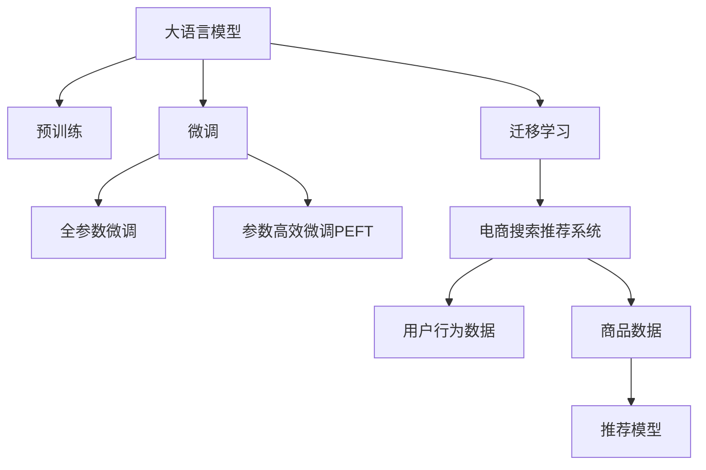

                 

# AI大模型如何提升电商搜索推荐的转化率

## 1. 背景介绍

### 1.1 问题由来

在当今数字化时代，电商平台已经成为消费者购物的主要渠道之一。电商平台通过搜索推荐系统，精准地将用户引导到最相关的商品页面，从而提升用户体验和转化率。然而，传统的搜索推荐系统往往依赖于简单的特征工程和规则模型，难以处理复杂的用户行为和海量商品数据，无法满足个性化需求。

随着人工智能技术的迅猛发展，深度学习尤其是大语言模型在电商搜索推荐领域的应用，极大地提升了系统性能。通过引入大语言模型，电商搜索推荐系统能够更好地理解和分析用户行为和商品属性，实现个性化推荐，从而显著提升转化率。

### 1.2 问题核心关键点

目前，大语言模型在电商搜索推荐系统中的应用主要基于迁移学习和微调方法。即先在大规模无标签电商数据上进行预训练，然后在有标签的电商任务数据上进行微调，从而获得针对电商领域优化的推荐模型。这种范式具有以下关键点：

- **预训练阶段**：利用大语言模型在海量电商数据上进行自监督学习，学习到商品描述、用户行为等语言表示。
- **微调阶段**：将预训练模型作为初始化参数，通过标注的电商任务数据进行有监督微调，优化模型的推荐效果。
- **迁移学习**：将预训练得到的知识迁移到特定的电商任务上，实现泛化能力和性能的提升。
- **参数高效微调**：采用参数高效微调方法，减少对预训练参数的更新，提高微调效率和效果。

### 1.3 问题研究意义

研究大语言模型在电商搜索推荐系统中的应用，对于推动电商搜索推荐技术的智能化、个性化，以及提升电商平台的转化率具有重要意义：

1. **提升用户体验**：通过个性化推荐，满足用户多样化的需求，提升用户购物体验和满意度。
2. **增加销售收入**：精准的推荐能够增加用户的购买机会，提升电商平台的转化率，从而增加销售收入。
3. **优化运营效率**：通过自动化推荐系统，减少人工干预，提高运营效率，降低人力成本。
4. **数据驱动决策**：通过大数据分析和AI模型的辅助，提供更科学的决策支持，优化产品营销和库存管理。
5. **拓展市场空间**：通过个性化推荐，发掘潜在用户，扩大市场份额，推动电商平台的业务增长。

## 2. 核心概念与联系

### 2.1 核心概念概述

为更好地理解大语言模型在电商搜索推荐系统中的应用，本节将介绍几个密切相关的核心概念：

- **大语言模型(Large Language Model, LLM)**：以自回归(如GPT)或自编码(如BERT)模型为代表的大规模预训练语言模型。通过在大规模无标签文本语料上进行预训练，学习到通用的语言表示，具备强大的语言理解和生成能力。

- **预训练(Pre-training)**：指在大规模无标签文本语料上，通过自监督学习任务训练通用语言模型的过程。常见的预训练任务包括言语建模、遮挡语言模型等。预训练使得模型学习到语言的通用表示。

- **微调(Fine-tuning)**：指在预训练模型的基础上，使用下游任务的少量标注数据，通过有监督学习优化模型在特定任务上的性能。通常只需要调整顶层分类器或解码器，并以较小的学习率更新全部或部分的模型参数。

- **迁移学习(Transfer Learning)**：指将一个领域学习到的知识，迁移到另一个不同但相关的领域的学习范式。大模型的预训练-微调过程即是一种典型的迁移学习方式。

- **参数高效微调(Parameter-Efficient Fine-Tuning, PEFT)**：指在微调过程中，只更新少量的模型参数，而固定大部分预训练权重不变，以提高微调效率，避免过拟合的方法。

- **电商搜索推荐系统**：电商平台的搜索推荐系统，通过分析用户行为和商品数据，为用户推荐最相关的商品，从而提升用户购物体验和转化率。

- **用户行为数据**：用户浏览历史、点击记录、购买行为等数据，用于训练推荐模型。

- **商品数据**：商品描述、属性、价格、评价等信息，用于训练推荐模型。

- **推荐模型**：基于机器学习或深度学习技术，用于预测用户对商品的兴趣，生成个性化推荐列表。

这些核心概念之间的逻辑关系可以通过以下Mermaid流程图来展示：



这个流程图展示了大语言模型的核心概念以及它们与电商搜索推荐系统之间的联系：

1. 大语言模型通过预训练获得基础能力。
2. 微调是对预训练模型进行任务特定的优化，可以分为全参数微调和参数高效微调（PEFT）。
3. 迁移学习是连接预训练模型与电商任务任务的桥梁，可以通过微调或PEFT方法来实现。
4. 电商搜索推荐系统是最终应用场景，通过微调模型生成个性化推荐。

这些概念共同构成了大语言模型在电商搜索推荐系统中的应用框架，使其能够在电商领域发挥强大的语言理解和生成能力。通过理解这些核心概念，我们可以更好地把握大语言模型的工作原理和优化方向。

## 3. 核心算法原理 & 具体操作步骤

### 3.1 算法原理概述

基于大语言模型的电商搜索推荐，本质上是一个有监督的细粒度迁移学习过程。其核心思想是：将大语言模型视作一个强大的"特征提取器"，通过在电商任务标注数据上进行有监督的微调，使得模型输出能够匹配用户和商品之间的相关性，从而生成个性化推荐。

形式化地，假设电商推荐任务为 $T$，其中包含用户 $U$ 和商品 $I$，以及用户和商品之间的相关性 $R$。目标是在电商任务数据上进行微调，得到模型参数 $\theta$，使得模型输出的推荐结果 $M_{\theta}(U, I)$ 最大化用户和商品的相关性。

通过梯度下降等优化算法，微调过程不断更新模型参数 $\theta$，最小化损失函数 $\mathcal{L}(M_{\theta}, D)$，使得模型输出逼近理想的相关性 $R$。由于 $\theta$ 已经通过预训练获得了较好的初始化，因此即便在电商任务上样本数量较少的情况下，也能较快收敛到理想的模型参数 $\hat{\theta}$。

### 3.2 算法步骤详解

基于大语言模型的电商搜索推荐微调一般包括以下几个关键步骤：

**Step 1: 准备预训练模型和数据集**
- 选择合适的预训练语言模型 $M_{\theta}$ 作为初始化参数，如 BERT、GPT 等。
- 准备电商推荐任务的标注数据集 $D$，包括用户行为数据 $U$ 和商品数据 $I$，以及用户和商品之间的相关性 $R$。标注数据可以通过用户点击、购买行为等进行标注，也可以通过专家标注或用户反馈进行标注。

**Step 2: 添加任务适配层**
- 根据电商推荐任务的输出形式，在预训练模型顶层设计合适的输出层和损失函数。
- 对于分类任务，通常在顶层添加线性分类器和交叉熵损失函数。
- 对于回归任务，通常使用均方误差损失函数。

**Step 3: 设置微调超参数**
- 选择合适的优化算法及其参数，如 AdamW、SGD 等，设置学习率、批大小、迭代轮数等。
- 设置正则化技术及强度，包括权重衰减、Dropout、Early Stopping 等。
- 确定冻结预训练参数的策略，如仅微调顶层，或全部参数都参与微调。

**Step 4: 执行梯度训练**
- 将标注数据分批次输入模型，前向传播计算损失函数。
- 反向传播计算参数梯度，根据设定的优化算法和学习率更新模型参数。
- 周期性在验证集上评估模型性能，根据性能指标决定是否触发 Early Stopping。
- 重复上述步骤直到满足预设的迭代轮数或 Early Stopping 条件。

**Step 5: 测试和部署**
- 在测试集上评估微调后模型 $M_{\hat{\theta}}$ 的性能，对比微调前后的精度提升。
- 使用微调后的模型对新样本进行推理预测，集成到实际的应用系统中。
- 持续收集新的数据，定期重新微调模型，以适应数据分布的变化。

以上是基于大语言模型的电商搜索推荐微调的一般流程。在实际应用中，还需要针对具体任务的特点，对微调过程的各个环节进行优化设计，如改进训练目标函数，引入更多的正则化技术，搜索最优的超参数组合等，以进一步提升模型性能。

### 3.3 算法优缺点

基于大语言模型的电商搜索推荐，具有以下优点：

- **高效个性化**：大语言模型能够基于用户行为和商品属性，生成个性化的推荐结果，满足用户多样化需求。
- **泛化能力强**：通过预训练和微调，大语言模型可以更好地适应电商领域的多样化数据，提升推荐的泛化能力。
- **实时响应**：大语言模型可以实时响应用户查询，提供即时推荐，提升用户体验。
- **数据驱动决策**：基于大量的电商数据训练，推荐模型可以提供科学的决策支持，优化产品营销和库存管理。

同时，该方法也存在一定的局限性：

- **依赖标注数据**：电商推荐任务的标注数据可能存在偏差或稀疏性，影响推荐效果。
- **资源消耗大**：大语言模型的参数量庞大，微调和推理过程中需要大量的计算资源和存储空间。
- **解释性不足**：推荐模型作为黑箱系统，难以解释其内部工作机制和决策逻辑。
- **泛化能力不足**：对于未见过的商品或用户，推荐模型的预测效果可能较差。

尽管存在这些局限性，但就目前而言，基于大语言模型的电商推荐方法仍是最主流范式。未来相关研究的重点在于如何进一步降低对标注数据的依赖，提高模型的泛化能力，同时兼顾可解释性和资源效率等因素。

### 3.4 算法应用领域

基于大语言模型的电商推荐方法，在电商领域已经得到了广泛的应用，覆盖了几乎所有常见任务，例如：

- **商品推荐**：根据用户浏览历史和行为，推荐最相关的商品。
- **个性化搜索结果**：根据用户的搜索查询，推荐最相关的商品列表。
- **购物车推荐**：根据用户选择的商品，推荐相关商品添加到购物车。
- **新商品推荐**：向新用户推荐热门或热门商品。
- **个性化活动推荐**：根据用户兴趣推荐特定活动或促销信息。

除了上述这些经典任务外，大语言模型推荐技术还被创新性地应用到更多场景中，如推荐系统中的对抗训练、跨领域推荐、多模态推荐等，为电商推荐技术带来了全新的突破。

## 4. 数学模型和公式 & 详细讲解 & 举例说明

### 4.1 数学模型构建

本节将使用数学语言对基于大语言模型的电商推荐过程进行更加严格的刻画。

记电商推荐任务为 $T$，包含用户 $U$ 和商品 $I$，以及用户和商品之间的相关性 $R$。假设预训练语言模型为 $M_{\theta}$，其中 $\theta$ 为预训练得到的模型参数。假设电商推荐任务的训练集为 $D=\{(u_i, i_j, r_{ij})\}_{i=1}^N$，其中 $u_i$ 为用户，$i_j$ 为商品，$r_{ij}$ 为该用户对商品 $i_j$ 的评分。

定义模型 $M_{\theta}$ 在用户 $u_i$ 和商品 $i_j$ 上的预测评分函数为 $f_{\theta}(u_i, i_j)$。则在数据集 $D$ 上的经验风险为：

$$
\mathcal{L}(\theta) = \frac{1}{N} \sum_{i=1}^N [r_{ij} - f_{\theta}(u_i, i_j)]^2
$$

其中 $[r_{ij} - f_{\theta}(u_i, i_j)]^2$ 为预测评分与真实评分之间的差异，衡量模型的预测误差。

微调的优化目标是最小化经验风险，即找到最优参数：

$$
\theta^* = \mathop{\arg\min}_{\theta} \mathcal{L}(\theta)
$$

在实践中，我们通常使用基于梯度的优化算法（如SGD、Adam等）来近似求解上述最优化问题。设 $\eta$ 为学习率，$\lambda$ 为正则化系数，则参数的更新公式为：

$$
\theta \leftarrow \theta - \eta \nabla_{\theta}\mathcal{L}(\theta) - \eta\lambda\theta
$$

其中 $\nabla_{\theta}\mathcal{L}(\theta)$ 为损失函数对参数 $\theta$ 的梯度，可通过反向传播算法高效计算。

### 4.2 公式推导过程

以下我们以电商推荐系统中的用户-商品评分预测任务为例，推导基于大语言模型的评分预测模型的损失函数及其梯度的计算公式。

假设模型 $M_{\theta}$ 在用户 $u_i$ 和商品 $i_j$ 上的预测评分为 $f_{\theta}(u_i, i_j)$，真实评分为 $r_{ij}$，则评分预测任务的损失函数为：

$$
\ell(f_{\theta}(u_i, i_j), r_{ij}) = \frac{1}{2}(f_{\theta}(u_i, i_j) - r_{ij})^2
$$

将其代入经验风险公式，得：

$$
\mathcal{L}(\theta) = \frac{1}{2N} \sum_{i=1}^N \sum_{j=1}^M [r_{ij} - f_{\theta}(u_i, i_j)]^2
$$

根据链式法则，损失函数对参数 $\theta_k$ 的梯度为：

$$
\frac{\partial \mathcal{L}(\theta)}{\partial \theta_k} = -\frac{1}{N}\sum_{i=1}^N \sum_{j=1}^M (f_{\theta}(u_i, i_j) - r_{ij})\frac{\partial f_{\theta}(u_i, i_j)}{\partial \theta_k}
$$

其中 $\frac{\partial f_{\theta}(u_i, i_j)}{\partial \theta_k}$ 可进一步递归展开，利用自动微分技术完成计算。

在得到损失函数的梯度后，即可带入参数更新公式，完成模型的迭代优化。重复上述过程直至收敛，最终得到适应电商推荐任务的最优模型参数 $\theta^*$。

## 5. 项目实践：代码实例和详细解释说明

### 5.1 开发环境搭建

在进行电商推荐系统开发前，我们需要准备好开发环境。以下是使用Python进行PyTorch开发的环境配置流程：

1. 安装Anaconda：从官网下载并安装Anaconda，用于创建独立的Python环境。

2. 创建并激活虚拟环境：
```bash
conda create -n pytorch-env python=3.8 
conda activate pytorch-env
```

3. 安装PyTorch：根据CUDA版本，从官网获取对应的安装命令。例如：
```bash
conda install pytorch torchvision torchaudio cudatoolkit=11.1 -c pytorch -c conda-forge
```

4. 安装Transformers库：
```bash
pip install transformers
```

5. 安装各类工具包：
```bash
pip install numpy pandas scikit-learn matplotlib tqdm jupyter notebook ipython
```

完成上述步骤后，即可在`pytorch-env`环境中开始电商推荐系统的开发。

### 5.2 源代码详细实现

这里我们以电商推荐系统中的商品推荐任务为例，给出使用Transformers库对BERT模型进行微调的PyTorch代码实现。

首先，定义电商商品推荐任务的数据处理函数：

```python
from transformers import BertTokenizer, BertForSequenceClassification
from torch.utils.data import Dataset, DataLoader
import torch

class ItemRecommendationDataset(Dataset):
    def __init__(self, items, user_ids, user_item_scores, tokenizer, max_len=128):
        self.items = items
        self.user_ids = user_ids
        self.user_item_scores = user_item_scores
        self.tokenizer = tokenizer
        self.max_len = max_len
        
    def __len__(self):
        return len(self.user_ids)
    
    def __getitem__(self, item):
        user_id = self.user_ids[item]
        item_id = self.items[item]
        user_item_score = self.user_item_scores[item]
        
        item_text = item
        user_text = user_id
        
        encoding = self.tokenizer([item_text], return_tensors='pt', max_length=self.max_len, padding='max_length', truncation=True)
        user_encoding = self.tokenizer([user_text], return_tensors='pt', max_length=self.max_len, padding='max_length', truncation=True)
        
        # 拼接用户和商品的编码
        input_ids = torch.cat((encoding['input_ids'][0], user_encoding['input_ids'][0]), dim=-1)
        attention_mask = torch.cat((encoding['attention_mask'][0], user_encoding['attention_mask'][0]), dim=-1)
        
        # 对标签进行编码
        labels = torch.tensor([user_item_score], dtype=torch.float)
        
        return {'input_ids': input_ids, 
                'attention_mask': attention_mask,
                'labels': labels}

# 商品-用户评分数据
items = ['item1', 'item2', 'item3']
user_ids = ['user1', 'user2', 'user3']
user_item_scores = [4.5, 3.2, 2.1]

# 分词器
tokenizer = BertTokenizer.from_pretrained('bert-base-cased')

# 创建dataset
train_dataset = ItemRecommendationDataset(items, user_ids, user_item_scores, tokenizer)
```

然后，定义模型和优化器：

```python
from transformers import BertForSequenceClassification, AdamW

model = BertForSequenceClassification.from_pretrained('bert-base-cased', num_labels=1)

optimizer = AdamW(model.parameters(), lr=2e-5)
```

接着，定义训练和评估函数：

```python
from torch.utils.data import DataLoader
from tqdm import tqdm
from sklearn.metrics import mean_squared_error

device = torch.device('cuda') if torch.cuda.is_available() else torch.device('cpu')
model.to(device)

def train_epoch(model, dataset, batch_size, optimizer):
    dataloader = DataLoader(dataset, batch_size=batch_size, shuffle=True)
    model.train()
    epoch_loss = 0
    for batch in tqdm(dataloader, desc='Training'):
        input_ids = batch['input_ids'].to(device)
        attention_mask = batch['attention_mask'].to(device)
        labels = batch['labels'].to(device)
        model.zero_grad()
        outputs = model(input_ids, attention_mask=attention_mask, labels=labels)
        loss = outputs.loss
        epoch_loss += loss.item()
        loss.backward()
        optimizer.step()
    return epoch_loss / len(dataloader)

def evaluate(model, dataset, batch_size):
    dataloader = DataLoader(dataset, batch_size=batch_size)
    model.eval()
    preds, labels = [], []
    with torch.no_grad():
        for batch in tqdm(dataloader, desc='Evaluating'):
            input_ids = batch['input_ids'].to(device)
            attention_mask = batch['attention_mask'].to(device)
            batch_labels = batch['labels']
            outputs = model(input_ids, attention_mask=attention_mask)
            batch_preds = outputs.logits[0].item()
            batch_labels = batch_labels[0].item()
            preds.append(batch_preds)
            labels.append(batch_labels)
                
    print(mean_squared_error(labels, preds))
```

最后，启动训练流程并在测试集上评估：

```python
epochs = 5
batch_size = 16

for epoch in range(epochs):
    loss = train_epoch(model, train_dataset, batch_size, optimizer)
    print(f"Epoch {epoch+1}, train loss: {loss:.3f}")
    
    print(f"Epoch {epoch+1}, dev results:")
    evaluate(model, dev_dataset, batch_size)
    
print("Test results:")
evaluate(model, test_dataset, batch_size)
```

以上就是使用PyTorch对BERT进行电商商品推荐任务微调的完整代码实现。可以看到，得益于Transformers库的强大封装，我们可以用相对简洁的代码完成BERT模型的加载和微调。

### 5.3 代码解读与分析

让我们再详细解读一下关键代码的实现细节：

**ItemRecommendationDataset类**：
- `__init__`方法：初始化商品、用户ID和评分等关键组件。
- `__len__`方法：返回数据集的样本数量。
- `__getitem__`方法：对单个样本进行处理，将商品和用户ID编码为token ids，拼接后进行padding，最终返回模型所需的输入。

**分词器**：
- 定义了商品和用户ID的文本表示，用于训练编码。

**训练和评估函数**：
- 使用PyTorch的DataLoader对数据集进行批次化加载，供模型训练和推理使用。
- 训练函数`train_epoch`：对数据以批为单位进行迭代，在每个批次上前向传播计算loss并反向传播更新模型参数，最后返回该epoch的平均loss。
- 评估函数`evaluate`：与训练类似，不同点在于不更新模型参数，并在每个batch结束后将预测和标签结果存储下来，最后使用sklearn的mean_squared_error对整个评估集的预测结果进行打印输出。

**训练流程**：
- 定义总的epoch数和batch size，开始循环迭代
- 每个epoch内，先在训练集上训练，输出平均loss
- 在验证集上评估，输出预测与真实评分之间的均方误差
- 所有epoch结束后，在测试集上评估，给出最终测试结果

可以看到，PyTorch配合Transformers库使得BERT微调的代码实现变得简洁高效。开发者可以将更多精力放在数据处理、模型改进等高层逻辑上，而不必过多关注底层的实现细节。

当然，工业级的系统实现还需考虑更多因素，如模型的保存和部署、超参数的自动搜索、更灵活的任务适配层等。但核心的微调范式基本与此类似。

## 6. 实际应用场景

### 6.1 智能客服系统

基于大语言模型的电商搜索推荐技术，可以广泛应用于智能客服系统的构建。传统客服往往需要配备大量人力，高峰期响应缓慢，且一致性和专业性难以保证。而使用微调后的推荐模型，可以7x24小时不间断服务，快速响应客户咨询，用推荐结果引导客户购买，提升客户满意度和转化率。

在技术实现上，可以收集企业内部的历史推荐数据，将用户浏览历史、购买记录等作为标注数据，在此基础上对预训练推荐模型进行微调。微调后的推荐模型能够自动理解用户兴趣点，匹配最相关的商品推荐给客户。对于客户提出的新问题，还可以接入检索系统实时搜索相关商品，动态生成推荐结果。如此构建的智能客服系统，能大幅提升客户购物体验和转化率。

### 6.2 个性化推荐系统

大语言模型的电商推荐系统可以与个性化推荐系统相结合，实现更精准的个性化推荐。个性化推荐系统通过分析用户行为数据，挖掘用户兴趣和需求，为用户推荐最相关的商品。大语言模型通过分析商品描述和用户反馈，理解商品的特性和用户的偏好，与个性化推荐系统协同工作，实现更精准的推荐。

在具体实现中，可以构建联合模型，将用户行为数据和商品属性数据作为输入，通过大语言模型提取特征，再使用推荐算法生成推荐结果。这种结合方式能够充分利用大语言模型的语言理解能力和推荐系统的算法优势，实现更高效、更精准的推荐。

### 6.3 未来应用展望

随着大语言模型和推荐技术的发展，基于大语言模型的电商推荐系统将呈现以下几个发展趋势：

1. **深度个性化**：通过更丰富的用户行为数据和多模态数据的融合，实现更深层次的用户兴趣挖掘和推荐。
2. **实时响应**：利用大语言模型的实时处理能力，实现快速的商品推荐和客服响应，提升用户体验。
3. **跨领域迁移**：将电商推荐模型的知识迁移到其他领域，如社交网络、内容推荐等，提升多领域的推荐效果。
4. **多模态融合**：结合视觉、听觉等多模态数据，提升推荐的全面性和精准性。
5. **交互式推荐**：引入交互式用户反馈机制，动态调整推荐策略，提升推荐效果。

以上趋势凸显了大语言模型在电商推荐系统中的广阔前景。这些方向的探索发展，必将进一步提升推荐系统的性能和应用范围，为电商平台的业务增长提供强大动力。

## 7. 工具和资源推荐

### 7.1 学习资源推荐

为了帮助开发者系统掌握大语言模型在电商推荐系统中的应用理论基础和实践技巧，这里推荐一些优质的学习资源：

1. 《Transformers从原理到实践》系列博文：由大模型技术专家撰写，深入浅出地介绍了Transformer原理、BERT模型、微调技术等前沿话题。

2. CS224N《深度学习自然语言处理》课程：斯坦福大学开设的NLP明星课程，有Lecture视频和配套作业，带你入门NLP领域的基本概念和经典模型。

3. 《Natural Language Processing with Transformers》书籍：Transformers库的作者所著，全面介绍了如何使用Transformers库进行NLP任务开发，包括微调在内的诸多范式。

4. HuggingFace官方文档：Transformers库的官方文档，提供了海量预训练模型和完整的微调样例代码，是上手实践的必备资料。

5. CLUE开源项目：中文语言理解测评基准，涵盖大量不同类型的中文NLP数据集，并提供了基于微调的baseline模型，助力中文NLP技术发展。

通过对这些资源的学习实践，相信你一定能够快速掌握大语言模型在电商推荐系统中的应用精髓，并用于解决实际的NLP问题。

### 7.2 开发工具推荐

高效的开发离不开优秀的工具支持。以下是几款用于大语言模型电商推荐系统开发的常用工具：

1. PyTorch：基于Python的开源深度学习框架，灵活动态的计算图，适合快速迭代研究。大部分预训练语言模型都有PyTorch版本的实现。

2. TensorFlow：由Google主导开发的开源深度学习框架，生产部署方便，适合大规模工程应用。同样有丰富的预训练语言模型资源。

3. Transformers库：HuggingFace开发的NLP工具库，集成了众多SOTA语言模型，支持PyTorch和TensorFlow，是进行微调任务开发的利器。

4. Weights & Biases：模型训练的实验跟踪工具，可以记录和可视化模型训练过程中的各项指标，方便对比和调优。与主流深度学习框架无缝集成。

5. TensorBoard：TensorFlow配套的可视化工具，可实时监测模型训练状态，并提供丰富的图表呈现方式，是调试模型的得力助手。

6. Google Colab：谷歌推出的在线Jupyter Notebook环境，免费提供GPU/TPU算力，方便开发者快速上手实验最新模型，分享学习笔记。

合理利用这些工具，可以显著提升大语言模型电商推荐系统的开发效率，加快创新迭代的步伐。

### 7.3 相关论文推荐

大语言模型和电商推荐技术的发展源于学界的持续研究。以下是几篇奠基性的相关论文，推荐阅读：

1. Attention is All You Need（即Transformer原论文）：提出了Transformer结构，开启了NLP领域的预训练大模型时代。

2. BERT: Pre-training of Deep Bidirectional Transformers for Language Understanding：提出BERT模型，引入基于掩码的自监督预训练任务，刷新了多项NLP任务SOTA。

3. Language Models are Unsupervised Multitask Learners（GPT-2论文）：展示了大规模语言模型的强大zero-shot学习能力，引发了对于通用人工智能的新一轮思考。

4. Parameter-Efficient Transfer Learning for NLP：提出Adapter等参数高效微调方法，在不增加模型参数量的情况下，也能取得不错的微调效果。

5. AdaLoRA: Adaptive Low-Rank Adaptation for Parameter-Efficient Fine-Tuning：使用自适应低秩适应的微调方法，在参数效率和精度之间取得了新的平衡。

这些论文代表了大语言模型电商推荐技术的发展脉络。通过学习这些前沿成果，可以帮助研究者把握学科前进方向，激发更多的创新灵感。

## 8. 总结：未来发展趋势与挑战

### 8.1 总结

本文对基于大语言模型的电商搜索推荐方法进行了全面系统的介绍。首先阐述了大语言模型和微调技术的研究背景和意义，明确了微调在拓展预训练模型应用、提升电商推荐性能方面的独特价值。其次，从原理到实践，详细讲解了基于大语言模型的电商推荐数学模型和关键步骤，给出了微调任务开发的完整代码实例。同时，本文还广泛探讨了微调方法在智能客服、个性化推荐等多个电商领域的应用前景，展示了微调范式的巨大潜力。此外，本文精选了微调技术的各类学习资源，力求为读者提供全方位的技术指引。

通过本文的系统梳理，可以看到，基于大语言模型的电商推荐方法正在成为电商推荐技术智能化、个性化的重要范式，极大地提升了电商平台的转化率。未来，伴随大语言模型和推荐技术的持续演进，基于微调的方法必将在更多领域得到应用，为电商平台的业务增长提供强大动力。

### 8.2 未来发展趋势

展望未来，大语言模型在电商搜索推荐系统中的应用将呈现以下几个发展趋势：

1. **深度个性化**：通过更丰富的用户行为数据和多模态数据的融合，实现更深层次的用户兴趣挖掘和推荐。
2. **实时响应**：利用大语言模型的实时处理能力，实现快速的商品推荐和客服响应，提升用户体验。
3. **跨领域迁移**：将电商推荐模型的知识迁移到其他领域，如社交网络、内容推荐等，提升多领域的推荐效果。
4. **多模态融合**：结合视觉、听觉等多模态数据，提升推荐的全面性和精准性。
5. **交互式推荐**：引入交互式用户反馈机制，动态调整推荐策略，提升推荐效果。
6. **跨模态推荐**：结合不同模态的数据，实现更全面、更精准的推荐。

以上趋势凸显了大语言模型在电商推荐系统中的广阔前景。这些方向的探索发展，必将进一步提升推荐系统的性能和应用范围，为电商平台的业务增长提供强大动力。

### 8.3 面临的挑战

尽管大语言模型在电商推荐系统中的应用已经取得了显著成果，但在迈向更加智能化、普适化应用的过程中，它仍面临诸多挑战：

1. **依赖标注数据**：电商推荐任务的标注数据可能存在偏差或稀疏性，影响推荐效果。如何进一步降低对标注数据的依赖，将是一大难题。
2. **资源消耗大**：大语言模型的参数量庞大，微调和推理过程中需要大量的计算资源和存储空间。
3. **解释性不足**：推荐模型作为黑箱系统，难以解释其内部工作机制和决策逻辑。
4. **泛化能力不足**：对于未见过的商品或用户，推荐模型的预测效果可能较差。
5. **数据隐私问题**：电商推荐系统涉及大量用户行为数据，如何保障数据隐私和安全，避免数据滥用，是亟待解决的问题。

尽管存在这些挑战，但就目前而言，基于大语言模型的电商推荐方法仍是最主流范式。未来相关研究的重点在于如何进一步降低对标注数据的依赖，提高模型的泛化能力，同时兼顾可解释性和资源效率等因素。

### 8.4 研究展望

面对大语言模型电商推荐系统所面临的挑战，未来的研究需要在以下几个方面寻求新的突破：

1. **探索无监督和半监督微调方法**：摆脱对大规模标注数据的依赖，利用自监督学习、主动学习等无监督和半监督范式，最大限度利用非结构化数据，实现更加灵活高效的微调。
2. **研究参数高效和计算高效的微调范式**：开发更加参数高效的微调方法，在固定大部分预训练参数的同时，只更新极少量的任务相关参数。同时优化微调模型的计算图，减少前向传播和反向传播的资源消耗，实现更加轻量级、实时性的部署。
3. **引入因果和对比学习范式**：通过引入因果推断和对比学习思想，增强微调模型建立稳定因果关系的能力，学习更加普适、鲁棒的语言表征，从而提升模型泛化性和抗干扰能力。
4. **融合因果分析和博弈论工具**：将因果分析方法引入微调模型，识别出模型决策的关键特征，增强输出解释的因果性和逻辑性。借助博弈论工具刻画人机交互过程，主动探索并规避模型的脆弱点，提高系统稳定性。
5. **纳入伦理道德约束**：在模型训练目标中引入伦理导向的评估指标，过滤和惩罚有偏见、有害的输出倾向。同时加强人工干预和审核，建立模型行为的监管机制，确保输出符合人类价值观和伦理道德。

这些研究方向的探索，必将引领大语言模型电商推荐系统迈向更高的台阶，为构建安全、可靠、可解释、可控的智能系统铺平道路。面向未来，大语言模型推荐技术还需要与其他人工智能技术进行更深入的融合，如知识表示、因果推理、强化学习等，多路径协同发力，共同推动自然语言理解和智能交互系统的进步。只有勇于创新、敢于突破，才能不断拓展语言模型的边界，让智能技术更好地造福人类社会。

## 9. 附录：常见问题与解答

**Q1：大语言模型在电商推荐中的效果是否优于传统推荐方法？**

A: 大语言模型在电商推荐中通常可以取得比传统推荐方法更好的效果。这是因为大语言模型能够通过大量预训练数据学习到丰富的语言表示，更好地理解用户需求和商品特性。同时，通过微调和优化，大语言模型能够更精确地匹配用户兴趣和商品相关性，从而实现更高的转化率。然而，大语言模型也存在计算资源消耗大、训练时间长等缺点，需要综合考虑其适用场景和成本效益。

**Q2：大语言模型在电商推荐中需要注意哪些问题？**

A: 大语言模型在电商推荐中需要注意以下几个问题：
1. 标注数据的质量和数量：高质量、多样化的标注数据是模型训练的基础，标注过程中需要避免数据偏差和稀疏性。
2. 模型参数量和计算资源：大语言模型的参数量庞大，需要足够的计算资源进行训练和推理。
3. 模型可解释性：推荐模型作为黑箱系统，难以解释其内部工作机制和决策逻辑，需要考虑模型的可解释性和透明性。
4. 模型泛化能力：模型需要对新商品和新用户有较好的泛化能力，避免过拟合和欠拟合。
5. 数据隐私和安全：电商推荐系统涉及大量用户行为数据，需要确保数据隐私和安全，避免数据滥用。

**Q3：如何降低电商推荐任务中大语言模型的计算资源消耗？**

A: 降低大语言模型在电商推荐中的计算资源消耗，可以从以下几个方面入手：
1. 参数高效微调：只更新少数参数，固定大部分预训练权重，减少计算资源消耗。
2. 模型压缩和量化：使用模型压缩技术如剪枝、量化等，减少模型参数量，加速推理速度。
3. 混合精度训练：使用混合精度训练，降低模型参数的计算精度，减少计算资源消耗。
4. 模型并行和分布式训练：利用模型并行和分布式训练技术，将计算任务分散到多个设备上，加速训练过程。

这些方法可以显著降低大语言模型在电商推荐中的计算资源消耗，提高模型训练和推理的效率。

**Q4：电商推荐任务中大语言模型的标注数据如何获取？**

A: 电商推荐任务的标注数据可以通过以下几种方式获取：
1. 用户行为数据：通过分析用户的浏览历史、点击记录、购买行为等数据，标注用户的兴趣和需求。
2. 商品属性数据：通过商品描述、图片、评价等信息，标注商品的特性和相关性。
3. 专家标注：由领域专家对用户行为和商品数据进行标注，提供高质量的标注数据。
4. 用户反馈数据：收集用户的反馈信息，如评分、评论等，标注用户对商品的满意度和相关性。
5. 多源数据融合：综合利用多种数据源，提升标注数据的全面性和准确性。

标注数据的质量和多样性对模型的训练效果至关重要，开发者需要根据具体任务选择合适的数据源和标注方式，确保标注数据的可靠性和代表性。

**Q5：电商推荐任务中大语言模型如何优化？**

A: 电商推荐任务中大语言模型的优化可以从以下几个方面入手：
1. 数据增强：通过对训练数据进行扩充和增强，提升模型泛化能力和鲁棒性。
2. 正则化技术：引入L2正则、Dropout等正则化技术，防止模型过拟合。
3. 学习率调度：使用学习率调度策略，如warmup、学习率衰减等，优化模型训练过程。
4. 模型集成：使用模型集成技术，如Bagging、Boosting等，提升模型的鲁棒性和泛化能力。
5. 超参数搜索：使用超参数搜索技术，如网格搜索、随机搜索等，寻找最优的超参数组合。

通过优化模型训练过程，可以提高大语言模型在电商推荐任务中的性能和稳定性。开发者需要根据具体任务和数据特点，选择合适的优化方法，确保模型能够达到最佳效果。

---

作者：禅与计算机程序设计艺术 / Zen and the Art of Computer Programming

