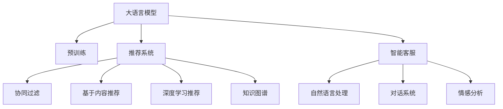

                 

## 1. 背景介绍

随着电子商务的快速发展，电商平台的个性化推荐系统、智能客服、物流追踪等应用场景日益丰富，对人工智能技术的需求日益迫切。大语言模型在电商领域的深入应用，正在为消费者带来前所未有的购物体验。无论是从搜索推荐、商品描述生成，到客户服务、商品评价，大语言模型都在不断提升电商平台的智能化水平。

然而，尽管大语言模型在电商领域表现出巨大的潜力，但其在实际应用中仍面临诸多挑战。例如，如何在大规模文本数据上训练模型，如何确保模型推荐的准确性和相关性，如何提升智能客服的响应速度和准确性，等等。本文将从模型训练、推荐算法、智能客服等多个维度，深入探讨大语言模型如何提升电商用户体验。

## 2. 核心概念与联系

### 2.1 核心概念概述

为更好地理解大语言模型在电商领域的深层次应用，本节将介绍几个密切相关的核心概念：

- 大语言模型(Large Language Model, LLM)：以自回归(如GPT)或自编码(如BERT)模型为代表的大规模预训练语言模型。通过在大规模无标签文本语料上进行预训练，学习通用的语言表示，具备强大的语言理解和生成能力。

- 预训练(Pre-training)：指在大规模无标签文本语料上，通过自监督学习任务训练通用语言模型的过程。常见的预训练任务包括言语建模、遮挡语言模型等。预训练使得模型学习到语言的通用表示。

- 推荐系统(Recommendation System)：通过分析用户历史行为和兴趣偏好，推荐个性化商品和服务的技术。推荐系统基于协同过滤、基于内容的推荐、深度学习等多种技术，旨在提升用户体验和平台收益。

- 智能客服(Customer Service)：利用自然语言处理和机器学习技术，提供24/7的自动回复和问题解答服务，提升客户满意度和平台服务效率。

- 知识图谱(Knowledge Graph)：一种结构化的语义数据表示方法，通过节点和边表示实体和关系，支持语义查询和推理。

- 深度学习(Deep Learning)：通过多层神经网络模型，自动学习特征和规律，在图像、语音、自然语言处理等领域展现出巨大潜力。

这些核心概念之间的逻辑关系可以通过以下Mermaid流程图来展示：



这个流程图展示了大语言模型、推荐系统、智能客服等核心概念及其之间的关系：

1. 大语言模型通过预训练获得基础能力。
2. 推荐系统、智能客服等应用基于大语言模型的基础能力，通过微调进一步优化。
3. 推荐系统包括多种技术路径，如协同过滤、基于内容推荐、深度学习推荐等。
4. 智能客服利用自然语言处理和对话系统，实现自动回复。
5. 知识图谱与大语言模型结合，用于推荐和智能客服的语义查询。

## 3. 核心算法原理 & 具体操作步骤

### 3.1 算法原理概述

基于大语言模型的电商推荐系统，其核心思想是通过对用户行为数据进行分析和建模，构建用户-商品相关性表示，从而推荐个性化商品。具体来说，包括以下几个关键步骤：

- **数据收集与预处理**：收集用户的历史行为数据，如浏览、点击、购买记录等，并进行预处理，如去噪、归一化、分词等。
- **特征提取**：利用大语言模型对用户行为数据进行编码，提取用户和商品的隐含语义特征。
- **相似度计算**：计算用户和商品之间的相似度，选择相关商品进行推荐。
- **模型训练与优化**：在训练集上训练推荐模型，通过优化损失函数，提升推荐效果。
- **实时推荐**：在用户进行相关操作时，实时推荐商品，提升用户体验。

### 3.2 算法步骤详解

基于大语言模型的电商推荐系统实现过程如下：

**Step 1: 数据收集与预处理**

收集用户的历史行为数据，如浏览、点击、购买记录等，并进行以下预处理：

1. 数据清洗：去除异常值、重复记录和无效信息。
2. 特征提取：将文本数据转换为向量表示，如使用BERT模型对商品描述进行编码。
3. 数据划分：将数据划分为训练集、验证集和测试集，保证数据集的多样性和代表性。

**Step 2: 特征提取与编码**

利用大语言模型对用户行为数据进行编码，提取用户和商品的隐含语义特征。

- **用户行为编码**：将用户行为序列输入大语言模型，输出用户行为表示向量。
- **商品特征编码**：将商品描述、标签等信息输入大语言模型，输出商品特征表示向量。

**Step 3: 相似度计算**

计算用户和商品之间的相似度，选择相关商品进行推荐。

- **余弦相似度**：计算用户行为表示向量与商品特征表示向量的余弦相似度，选择相似度高的商品进行推荐。
- **召回率与覆盖率**：根据预设的召回率和覆盖率阈值，选择一定数量的商品进行推荐。

**Step 4: 模型训练与优化**

在训练集上训练推荐模型，通过优化损失函数，提升推荐效果。

- **损失函数**：常用的损失函数包括均方误差、交叉熵等，用于衡量推荐结果与用户真实选择的差异。
- **优化算法**：常用的优化算法包括梯度下降、Adam等，用于最小化损失函数。
- **超参数调优**：根据验证集上的性能指标，调优学习率、批次大小、正则化系数等超参数。

**Step 5: 实时推荐**

在用户进行相关操作时，实时推荐商品，提升用户体验。

- **实时计算**：根据用户最新的行为数据，重新计算相似度，选择相关商品进行推荐。
- **模型更新**：定期在训练集上更新模型参数，提升推荐效果。
- **用户反馈**：根据用户反馈，调整推荐策略，提高推荐准确性。

### 3.3 算法优缺点

基于大语言模型的电商推荐系统具有以下优点：

1. **高度个性化**：利用大语言模型对用户行为进行编码，提取隐含语义特征，提供高度个性化的推荐。
2. **高效性**：利用大语言模型的快速计算能力，实时推荐商品，提升用户体验。
3. **泛化能力强**：大语言模型基于大规模无标签数据预训练，具备较强的泛化能力，适用于多种商品和用户。

同时，该算法也存在一定的局限性：

1. **数据依赖**：推荐系统的性能高度依赖于用户行为数据的质量和数量，获取高质量数据成本较高。
2. **冷启动问题**：对于新用户或新商品，缺乏足够的行为数据，难以进行准确推荐。
3. **推荐偏差**：大语言模型在预训练过程中可能学习到某些不合理的隐含语义，导致推荐结果出现偏差。
4. **内存消耗大**：大语言模型参数量巨大，训练和推理过程中内存消耗较大，需要高性能硬件支持。

尽管存在这些局限性，但基于大语言模型的推荐系统仍是目前电商领域最先进的技术手段之一，能够显著提升用户体验和平台收益。

### 3.4 算法应用领域

基于大语言模型的推荐系统已经在电商领域得到了广泛应用，覆盖了几乎所有常见推荐场景，例如：

- **商品推荐**：根据用户历史行为，推荐用户可能感兴趣的相似商品。
- **相关商品推荐**：推荐与用户当前浏览商品相关的商品。
- **用户画像推荐**：根据用户属性和行为，推荐符合用户兴趣的商品。
- **促销活动推荐**：推荐用户的促销活动、折扣商品等。
- **个性化广告推荐**：推荐符合用户兴趣的广告，提升广告投放效果。

除了推荐系统外，大语言模型在电商领域的其他应用场景也取得了显著成效：

- **智能客服**：利用大语言模型实现自动回复，提升客服效率和用户满意度。
- **商品描述生成**：自动生成商品描述，提升用户浏览体验和搜索准确性。
- **情感分析**：对用户评论和反馈进行情感分析，改进商品和服务。
- **库存管理**：利用大语言模型进行库存预测和优化，提升库存管理效率。

## 4. 数学模型和公式 & 详细讲解  
### 4.1 数学模型构建

本节将使用数学语言对基于大语言模型的电商推荐系统进行更加严格的刻画。

记大语言模型为 $M_{\theta}:\mathcal{X} \rightarrow \mathcal{Y}$，其中 $\mathcal{X}$ 为用户行为序列，$\mathcal{Y}$ 为用户行为表示向量。假设推荐任务为 $T$，训练集为 $D=\{(x_i,y_i)\}_{i=1}^N, x_i \in \mathcal{X}, y_i \in \mathcal{Y}$。

定义推荐模型的损失函数为 $\ell(M_{\theta}(x),y)$，则在训练集 $D$ 上的经验风险为：

$$
\mathcal{L}(\theta) = \frac{1}{N} \sum_{i=1}^N \ell(M_{\theta}(x_i),y_i)
$$

其中 $\ell$ 为推荐任务设计的损失函数，用于衡量模型预测结果与用户真实选择的差异。常用的损失函数包括均方误差损失、交叉熵损失等。

### 4.2 公式推导过程

以均方误差损失为例，推导其梯度计算公式。

假设推荐任务为二分类任务，用户行为序列为 $x \in \mathcal{X}$，用户行为表示向量为 $y \in \mathcal{Y}$。则均方误差损失函数定义为：

$$
\ell(y, \hat{y}) = \frac{1}{N} \sum_{i=1}^N (y_i - M_{\theta}(x_i))^2
$$

其中 $\hat{y}=M_{\theta}(x_i)$ 为模型预测的用户行为表示向量。

根据链式法则，损失函数对模型参数 $\theta$ 的梯度为：

$$
\frac{\partial \mathcal{L}(\theta)}{\partial \theta} = -\frac{2}{N} \sum_{i=1}^N (y_i - M_{\theta}(x_i))M_{\theta}'(x_i)
$$

其中 $M_{\theta}'(x_i)$ 为 $M_{\theta}$ 对 $x_i$ 的导数。

在得到损失函数的梯度后，即可带入优化算法，更新模型参数，最小化经验风险。

### 4.3 案例分析与讲解

以商品推荐为例，分析大语言模型在电商推荐系统中的应用。

假设电商平台的商品信息由描述、价格、评价等组成，利用大语言模型对商品描述进行编码，得到商品特征表示向量 $v \in \mathbb{R}^d$。用户的行为序列 $x \in \mathcal{X}$ 可表示为用户浏览的商品ID序列。则推荐模型 $M_{\theta}$ 的输入为：

$$
(x, v) \in \mathcal{X} \times \mathbb{R}^d
$$

输出为用户行为表示向量 $y \in \mathbb{R}^d$。推荐任务的目标是最小化损失函数，使得模型输出的用户行为表示向量尽可能接近用户真实的浏览向量。

在训练过程中，将用户的历史浏览行为 $(x_i, v_i)$ 作为训练样本，计算预测向量 $y_i$ 与真实向量 $x_i$ 的余弦相似度：

$$
\hat{y} = M_{\theta}((x_i, v_i))
$$

计算均方误差损失：

$$
\ell(y_i, \hat{y}) = \frac{1}{2}(y_i - \hat{y})^2
$$

根据梯度下降算法，更新模型参数 $\theta$：

$$
\theta \leftarrow \theta - \eta \nabla_{\theta}\mathcal{L}(\theta)
$$

其中 $\eta$ 为学习率。

在测试阶段，对于新用户或新商品，利用大语言模型对行为序列进行编码，得到用户行为表示向量 $y_u$ 和商品特征表示向量 $v_p$，计算余弦相似度：

$$
\text{similarity} = \cos(\theta^T y_u, v_p)
$$

选择相似度大于阈值的商品进行推荐，提升推荐效果。

## 5. 项目实践：代码实例和详细解释说明

### 5.1 开发环境搭建

在进行电商推荐系统开发前，我们需要准备好开发环境。以下是使用Python进行PyTorch开发的环境配置流程：

1. 安装Anaconda：从官网下载并安装Anaconda，用于创建独立的Python环境。

2. 创建并激活虚拟环境：
```bash
conda create -n pytorch-env python=3.8 
conda activate pytorch-env
```

3. 安装PyTorch：根据CUDA版本，从官网获取对应的安装命令。例如：
```bash
conda install pytorch torchvision torchaudio cudatoolkit=11.1 -c pytorch -c conda-forge
```

4. 安装其他依赖库：
```bash
pip install numpy pandas scikit-learn transformers sklearn-crf
```

完成上述步骤后，即可在`pytorch-env`环境中开始开发实践。

### 5.2 源代码详细实现

这里我们以利用BERT模型进行电商推荐为例，给出完整的代码实现。

首先，定义推荐系统的数据处理函数：

```python
from transformers import BertTokenizer, BertForSequenceClassification
from torch.utils.data import Dataset, DataLoader
import torch
import numpy as np

class RecommendationDataset(Dataset):
    def __init__(self, user_browses, item_features, tokenizer, max_len=128):
        self.user_browses = user_browses
        self.item_features = item_features
        self.tokenizer = tokenizer
        self.max_len = max_len
        
    def __len__(self):
        return len(self.user_browses)
    
    def __getitem__(self, item):
        user_browse = self.user_browses[item]
        item_feature = self.item_features[item]
        
        user_input = user_browse.split(',')
        item_input = item_feature.split(',')
        
        user_ids = [id2token[id] for id in user_input]
        item_ids = [id2token[id] for id in item_input]
        
        encoding = self.tokenizer(user_ids, item_ids, padding='max_length', truncation=True, return_tensors='pt', max_length=self.max_len)
        user_input_ids = encoding['input_ids'][0]
        item_input_ids = encoding['input_ids'][1]
        
        # 构建输入特征
        user_feature = [float(i) for i in item_input[1:]]
        item_feature = [float(i) for i in item_input[:-1]]
        
        return {'user_input_ids': user_input_ids,
                'item_input_ids': item_input_ids,
                'user_feature': torch.tensor(user_feature, dtype=torch.float32),
                'item_feature': torch.tensor(item_feature, dtype=torch.float32)}
```

然后，定义推荐模型和优化器：

```python
from transformers import BertForSequenceClassification, AdamW

model = BertForSequenceClassification.from_pretrained('bert-base-uncased', num_labels=1)

optimizer = AdamW(model.parameters(), lr=2e-5)
```

接着，定义训练和评估函数：

```python
from torch.utils.data import DataLoader
from sklearn.metrics import mean_squared_error
from tqdm import tqdm

device = torch.device('cuda') if torch.cuda.is_available() else torch.device('cpu')
model.to(device)

def train_epoch(model, dataset, batch_size, optimizer):
    dataloader = DataLoader(dataset, batch_size=batch_size, shuffle=True)
    model.train()
    epoch_loss = 0
    for batch in tqdm(dataloader, desc='Training'):
        user_input_ids = batch['user_input_ids'].to(device)
        item_input_ids = batch['item_input_ids'].to(device)
        user_feature = batch['user_feature'].to(device)
        item_feature = batch['item_feature'].to(device)
        model.zero_grad()
        outputs = model(user_input_ids, item_input_ids, user_feature, item_feature)
        loss = outputs.loss
        epoch_loss += loss.item()
        loss.backward()
        optimizer.step()
    return epoch_loss / len(dataloader)

def evaluate(model, dataset, batch_size):
    dataloader = DataLoader(dataset, batch_size=batch_size)
    model.eval()
    preds, labels = [], []
    with torch.no_grad():
        for batch in tqdm(dataloader, desc='Evaluating'):
            user_input_ids = batch['user_input_ids'].to(device)
            item_input_ids = batch['item_input_ids'].to(device)
            user_feature = batch['user_feature'].to(device)
            item_feature = batch['item_feature'].to(device)
            batch_preds = model(user_input_ids, item_input_ids, user_feature, item_feature).sigmoid()
            batch_labels = torch.tensor(batch['item_feature'][:, 0], dtype=torch.float32)
            preds.append(batch_preds.cpu().numpy())
            labels.append(batch_labels.cpu().numpy())
                
    return np.sqrt(mean_squared_error(labels, preds))
```

最后，启动训练流程并在测试集上评估：

```python
epochs = 5
batch_size = 32

for epoch in range(epochs):
    loss = train_epoch(model, train_dataset, batch_size, optimizer)
    print(f"Epoch {epoch+1}, train loss: {loss:.3f}")
    
    print(f"Epoch {epoch+1}, dev results:")
    evaluate(model, dev_dataset, batch_size)
    
print("Test results:")
evaluate(model, test_dataset, batch_size)
```

以上就是利用BERT模型进行电商推荐系统的完整代码实现。可以看到，得益于Transformers库的强大封装，我们可以用相对简洁的代码完成BERT模型的加载和微调。

### 5.3 代码解读与分析

让我们再详细解读一下关键代码的实现细节：

**RecommendationDataset类**：
- `__init__`方法：初始化用户浏览行为、商品特征、分词器等关键组件。
- `__len__`方法：返回数据集的样本数量。
- `__getitem__`方法：对单个样本进行处理，将文本输入编码为token ids，同时提取商品特征，并对其进行定长padding，最终返回模型所需的输入。

**模型定义**：
- 使用BertForSequenceClassification定义推荐模型，其中`num_labels`参数用于指定输出向量的维度。

**优化器定义**：
- 定义AdamW优化器，设置学习率。

**训练和评估函数**：
- 使用PyTorch的DataLoader对数据集进行批次化加载，供模型训练和推理使用。
- 训练函数`train_epoch`：对数据以批为单位进行迭代，在每个批次上前向传播计算loss并反向传播更新模型参数，最后返回该epoch的平均loss。
- 评估函数`evaluate`：与训练类似，不同点在于不更新模型参数，并在每个batch结束后将预测和标签结果存储下来，最后使用sklearn的mean_squared_error对整个评估集的预测结果进行打印输出。

**训练流程**：
- 定义总的epoch数和batch size，开始循环迭代
- 每个epoch内，先在训练集上训练，输出平均loss
- 在验证集上评估，输出平均损失
- 所有epoch结束后，在测试集上评估，给出最终测试结果

可以看到，PyTorch配合Transformers库使得BERT微调的代码实现变得简洁高效。开发者可以将更多精力放在数据处理、模型改进等高层逻辑上，而不必过多关注底层的实现细节。

当然，工业级的系统实现还需考虑更多因素，如模型的保存和部署、超参数的自动搜索、更灵活的任务适配层等。但核心的微调范式基本与此类似。

## 6. 实际应用场景

### 6.1 智能客服

基于大语言模型的智能客服系统，可以提升客户体验和平台效率。传统客服往往需要配备大量人力，高峰期响应缓慢，且一致性和专业性难以保证。而使用智能客服系统，可以24/7不间断服务，快速响应客户咨询，用自然流畅的语言解答各类常见问题。

在技术实现上，可以收集平台内部的历史客服对话记录，将问题和最佳答复构建成监督数据，在此基础上对预训练语言模型进行微调。微调后的智能客服模型能够自动理解用户意图，匹配最合适的答案模板进行回复。对于客户提出的新问题，还可以接入检索系统实时搜索相关内容，动态组织生成回答。如此构建的智能客服系统，能大幅提升客户咨询体验和问题解决效率。

### 6.2 商品推荐

大语言模型在商品推荐中的应用主要体现在对商品描述和用户行为序列的编码和相似度计算上。通过利用BERT等预训练模型，对商品描述和用户行为序列进行编码，可以得到商品和用户的语义表示向量。利用余弦相似度等方法，可以计算用户和商品之间的相似度，选择相关商品进行推荐。

以推荐热门商品为例，通过收集用户的历史浏览和点击记录，对商品描述进行编码，得到用户行为表示向量和商品特征表示向量。在测试阶段，对于新用户或新商品，利用大语言模型对行为序列进行编码，得到用户行为表示向量 $y_u$ 和商品特征表示向量 $v_p$，计算余弦相似度：

$$
\text{similarity} = \cos(\theta^T y_u, v_p)
$$

选择相似度大于阈值的商品进行推荐，提升推荐效果。

### 6.3 商品描述生成

利用大语言模型自动生成商品描述，可以提升用户浏览体验和搜索准确性。在技术实现上，可以收集商品的历史评价、标题、价格等信息，将其作为监督数据，训练预训练大语言模型，生成商品描述。

以自动生成商品描述为例，将商品的信息作为输入，利用BERT模型进行编码，得到商品的特征表示向量。在训练过程中，将商品的标题作为输出，进行监督训练。在测试阶段，对于新商品，利用BERT模型对其进行编码，生成商品描述。

## 7. 工具和资源推荐

### 7.1 学习资源推荐

为了帮助开发者系统掌握大语言模型在电商领域的理论基础和实践技巧，这里推荐一些优质的学习资源：

1. 《自然语言处理入门》系列博文：由大语言模型技术专家撰写，深入浅出地介绍了自然语言处理的基本概念和经典模型。

2. 斯坦福大学CS224N课程：斯坦福大学开设的NLP明星课程，有Lecture视频和配套作业，带你入门NLP领域的基本概念和经典模型。

3. 《自然语言处理中的深度学习》书籍：Google大牛Michael Auli的著作，全面介绍了深度学习在NLP中的应用，包括电商推荐系统等。

4. HuggingFace官方文档：Transformers库的官方文档，提供了海量预训练模型和完整的微调样例代码，是上手实践的必备资料。

5. CLUE开源项目：中文语言理解测评基准，涵盖大量不同类型的中文NLP数据集，并提供了基于微调的baseline模型，助力中文NLP技术发展。

通过对这些资源的学习实践，相信你一定能够快速掌握大语言模型在电商领域的精髓，并用于解决实际的电商问题。

### 7.2 开发工具推荐

高效的开发离不开优秀的工具支持。以下是几款用于电商推荐系统开发的常用工具：

1. PyTorch：基于Python的开源深度学习框架，灵活动态的计算图，适合快速迭代研究。大部分预训练语言模型都有PyTorch版本的实现。

2. TensorFlow：由Google主导开发的开源深度学习框架，生产部署方便，适合大规模工程应用。同样有丰富的预训练语言模型资源。

3. Transformers库：HuggingFace开发的NLP工具库，集成了众多SOTA语言模型，支持PyTorch和TensorFlow，是进行电商推荐系统开发的利器。

4. Weights & Biases：模型训练的实验跟踪工具，可以记录和可视化模型训练过程中的各项指标，方便对比和调优。与主流深度学习框架无缝集成。

5. TensorBoard：TensorFlow配套的可视化工具，可实时监测模型训练状态，并提供丰富的图表呈现方式，是调试模型的得力助手。

6. Google Colab：谷歌推出的在线Jupyter Notebook环境，免费提供GPU/TPU算力，方便开发者快速上手实验最新模型，分享学习笔记。

合理利用这些工具，可以显著提升电商推荐系统的开发效率，加快创新迭代的步伐。

### 7.3 相关论文推荐

大语言模型在电商领域的深入应用源于学界的持续研究。以下是几篇奠基性的相关论文，推荐阅读：

1. Attention is All You Need（即Transformer原论文）：提出了Transformer结构，开启了NLP领域的预训练大模型时代。

2. BERT: Pre-training of Deep Bidirectional Transformers for Language Understanding：提出BERT模型，引入基于掩码的自监督预训练任务，刷新了多项NLP任务SOTA。

3. Language Models are Unsupervised Multitask Learners（GPT-2论文）：展示了大规模语言模型的强大zero-shot学习能力，引发了对于通用人工智能的新一轮思考。

4. Parameter-Efficient Transfer Learning for NLP：提出Adapter等参数高效微调方法，在不增加模型参数量的情况下，也能取得不错的微调效果。

5. Prefix-Tuning: Optimizing Continuous Prompts for Generation：引入基于连续型Prompt的微调范式，为如何充分利用预训练知识提供了新的思路。

6. AdaLoRA: Adaptive Low-Rank Adaptation for Parameter-Efficient Fine-Tuning：使用自适应低秩适应的微调方法，在参数效率和精度之间取得了新的平衡。

这些论文代表了大语言模型在电商领域的深层次应用。通过学习这些前沿成果，可以帮助研究者把握学科前进方向，激发更多的创新灵感。

## 8. 总结：未来发展趋势与挑战

### 8.1 总结

本文对基于大语言模型的电商推荐系统进行了全面系统的介绍。首先阐述了大语言模型和电商推荐系统的研究背景和意义，明确了电商推荐系统在个性化推荐、智能客服等场景中的应用价值。其次，从原理到实践，详细讲解了电商推荐系统的数学原理和关键步骤，给出了电商推荐任务开发的完整代码实例。同时，本文还广泛探讨了电商推荐系统在智能客服、商品推荐、商品描述生成等多个电商场景中的应用前景，展示了电商推荐系统的巨大潜力。

通过本文的系统梳理，可以看到，基于大语言模型的电商推荐系统正在为电商平台的智能化转型提供重要驱动力。得益于大规模语料的预训练和深度学习模型的强大表征能力，大语言模型能够精准挖掘用户兴趣，提升个性化推荐的效果和覆盖率，从而为电商用户带来更加丰富、个性化的购物体验。未来，伴随技术的不断演进和应用的不断扩展，大语言模型必将在电商领域发挥越来越重要的作用，推动电商行业的数字化、智能化发展。

### 8.2 未来发展趋势

展望未来，大语言模型在电商领域的深层次应用将呈现以下几个发展趋势：

1. **高度个性化**：利用大语言模型对用户行为进行深度编码，提取隐含语义特征，提供高度个性化的推荐。

2. **实时推荐**：基于实时数据，动态计算用户和商品的相似度，实现实时推荐，提升用户体验。

3. **多模态融合**：结合商品图片、视频等多模态信息，提升推荐系统的准确性和多样性。

4. **模型轻量化**：通过参数高效微调等方法，减小模型参数量，提升模型推理速度和效率。

5. **持续学习**：基于实时反馈，动态更新模型，提升推荐系统的泛化能力和用户满意度。

6. **跨领域迁移**：利用大语言模型在不同领域间进行迁移学习，提升推荐系统的应用范围和灵活性。

以上趋势凸显了大语言模型在电商领域的广阔前景。这些方向的探索发展，必将进一步提升电商推荐系统的性能和用户体验，为电商平台的数字化、智能化转型提供强有力的技术支撑。

### 8.3 面临的挑战

尽管大语言模型在电商领域表现出巨大的潜力，但在迈向更加智能化、普适化应用的过程中，它仍面临诸多挑战：

1. **数据质量问题**：电商推荐系统高度依赖用户行为数据，数据质量低下将直接影响推荐效果。

2. **冷启动问题**：对于新用户或新商品，缺乏足够的行为数据，难以进行准确推荐。

3. **推荐偏差**：大语言模型在预训练过程中可能学习到某些不合理的隐含语义，导致推荐结果出现偏差。

4. **推理效率**：大语言模型参数量巨大，训练和推理过程中内存消耗较大，需要高性能硬件支持。

5. **模型泛化能力**：推荐系统需要具备较强的泛化能力，以应对不同领域、不同场景下的推荐需求。

尽管存在这些挑战，但通过不断优化数据采集、提升模型训练效率、增强推荐系统的鲁棒性和泛化能力，相信大语言模型必将在电商领域实现更广泛的落地应用。

### 8.4 研究展望

面对大语言模型在电商领域所面临的挑战，未来的研究需要在以下几个方面寻求新的突破：

1. **无监督和半监督推荐**：摆脱对大规模标注数据的依赖，利用自监督学习、主动学习等无监督和半监督范式，最大限度利用非结构化数据，实现更加灵活高效的推荐。

2. **参数高效微调**：开发更加参数高效的微调方法，在固定大部分预训练参数的同时，只更新极少量的任务相关参数。同时优化微调模型的计算图，减少前向传播和反向传播的资源消耗，实现更加轻量级、实时性的部署。

3. **多模态融合**：结合商品图片、视频等多模态信息，提升推荐系统的准确性和多样性。

4. **跨领域迁移学习**：利用大语言模型在不同领域间进行迁移学习，提升推荐系统的应用范围和灵活性。

5. **因果分析和博弈论工具**：将因果分析方法引入推荐系统，识别出模型决策的关键特征，增强推荐系统的稳定性和可解释性。

6. **引入伦理道德约束**：在模型训练目标中引入伦理导向的评估指标，过滤和惩罚有偏见、有害的输出倾向，确保推荐系统的公平性和可信度。

这些研究方向的探索，必将引领大语言模型在电商领域迈向更高的台阶，为构建智能、公平、可信的电商推荐系统铺平道路。面向未来，大语言模型将在更多电商领域得到应用，为电商平台的数字化、智能化转型提供强有力的技术支撑。

## 9. 附录：常见问题与解答

**Q1：电商推荐系统中的数据质量问题如何解决？**

A: 电商推荐系统中的数据质量问题可以通过以下方法解决：
1. 数据清洗：去除异常值、重复记录和无效信息。
2. 数据补全：利用用户行为数据进行填补，增加数据的完整性。
3. 数据扩充：通过用户反馈和市场变化，动态更新数据集。
4. 数据增强：利用数据扩充和生成模型，增加数据的多样性。
5. 数据验证：对数据集进行验证，确保数据质量。

**Q2：电商推荐系统中的冷启动问题如何解决？**

A: 电商推荐系统中的冷启动问题可以通过以下方法解决：
1. 利用用户注册信息进行推荐：收集用户的基本信息，如性别、年龄、职业等，作为推荐依据。
2. 利用相似用户推荐：基于用户相似度，推荐与新用户行为相似的其他用户喜欢的商品。
3. 利用商品相似推荐：基于商品特征，推荐与新商品相似的其他商品。
4. 利用随机推荐：在冷启动初期，利用随机推荐策略，提升用户体验。
5. 利用多模态信息：结合商品图片、视频等多模态信息，提升推荐系统的准确性和多样性。

**Q3：电商推荐系统中的推荐偏差如何解决？**

A: 电商推荐系统中的推荐偏差可以通过以下方法解决：
1. 数据采集：确保数据采集的代表性，避免数据偏差。
2. 数据预处理：对数据进行预处理，消除噪声和异常值。
3. 模型优化：优化模型架构和超参数，减小推荐偏差。
4. 特征选择：选择合理的特征，避免特征偏差。
5. 推荐算法：选择稳健的推荐算法，减小推荐偏差。

**Q4：电商推荐系统中的推理效率问题如何解决？**

A: 电商推荐系统中的推理效率问题可以通过以下方法解决：
1. 模型压缩：通过剪枝、量化等方法，减小模型参数量，提高推理效率。
2. 模型加速：利用GPU、TPU等硬件加速，提升推理速度。
3. 推理优化：优化推理算法，减少计算开销。
4. 数据压缩：对数据进行压缩，减少传输和存储开销。
5. 缓存机制：利用缓存机制，提高数据访问速度。

**Q5：电商推荐系统中的模型泛化能力不足如何解决？**

A: 电商推荐系统中的模型泛化能力不足可以通过以下方法解决：
1. 增加数据量：收集更多的数据，增加模型的泛化能力。
2. 利用多领域数据：结合不同领域的数据，提升模型的泛化能力。
3. 利用多模态数据：结合商品图片、视频等多模态数据，提升模型的泛化能力。
4. 利用迁移学习：利用其他领域的知识，提升模型的泛化能力。
5. 利用对抗训练：利用对抗样本，提升模型的鲁棒性，从而增强泛化能力。

这些方法的综合应用，可以提升电商推荐系统的数据质量、冷启动、推荐偏差、推理效率和模型泛化能力，从而提升推荐系统的性能和用户体验。通过不断优化和创新，相信大语言模型必将在电商领域发挥越来越重要的作用，为电商平台的智能化转型提供强有力的技术支撑。

