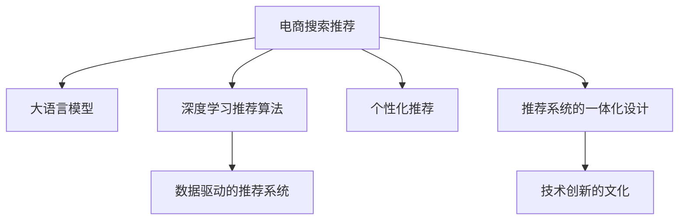

                 

# AI大模型视角下电商搜索推荐的技术创新文化建设

> 关键词：电商搜索推荐,大语言模型,技术创新,推荐算法,数据驱动,个性化,用户体验

## 1. 背景介绍

### 1.1 问题由来

随着互联网和电子商务的迅猛发展，电商平台的规模日益庞大，用户行为数据的累积量也急剧增加。如何利用这些海量数据，为用户提供个性化的搜索和推荐服务，已成为电商平台的核心竞争力之一。传统推荐系统依赖于基于用户历史行为的协同过滤算法，如矩阵分解、隐语义模型等。然而，这些算法往往存在数据稀疏性、冷启动问题，且无法充分捕捉用户多维度的兴趣和需求。

### 1.2 问题核心关键点

1. **推荐算法的多样化需求**：传统的协同过滤算法难以适应大模型时代多维度的个性化需求，需要融合深度学习等先进技术。
2. **搜索和推荐的一体化设计**：搜索和推荐系统的紧密联系，需要从一体化视角出发，设计高效、精准的推荐算法。
3. **数据驱动与AI融合**：大规模数据驱动的个性化推荐需要与AI大模型技术深度融合，提高推荐精度和实时性。
4. **用户体验的极致优化**：推荐系统的目标不仅是提高转化率，更在于提升用户的满意度和忠诚度。
5. **技术创新的文化建设**：构建技术创新的生态系统，鼓励持续的技术探索和算法优化。

### 1.3 问题研究意义

基于大模型的电商搜索推荐技术创新文化建设，对于提升电商平台的用户体验、增加用户粘性、提高转化率具有重要意义：

1. **用户体验的全面提升**：大模型的推荐算法可以捕捉用户的深度兴趣和复杂需求，提供更精准的个性化服务。
2. **业务增长的有力驱动**：通过精准推荐，增加用户的购物频次和消费金额，推动电商平台业绩的持续增长。
3. **市场竞争的领先优势**：构建技术创新文化，不断迭代优化推荐算法，保持市场领先地位。
4. **社会影响力的积极展现**：技术创新不仅能提升企业效益，还能引领行业发展，具有广泛的社会影响力。

## 2. 核心概念与联系

### 2.1 核心概念概述

为了更好地理解电商搜索推荐中的技术创新文化，本节将介绍几个关键概念：

- **电商搜索推荐**：电商平台中，用户输入搜索关键词后，系统返回最相关商品的过程，以及基于用户行为数据推荐商品的技术。
- **大语言模型**：以自回归模型(如GPT)或自编码模型(如BERT)为代表，通过大规模无标签文本语料预训练得到的通用语言模型，具备强大的语言理解和生成能力。
- **深度学习推荐算法**：基于神经网络等深度学习技术，从用户行为数据中学习到用户兴趣和商品相关性，进行个性化推荐。
- **数据驱动的推荐系统**：以用户行为数据为驱动，通过数据挖掘和机器学习，构建推荐模型，不断优化推荐效果。
- **个性化推荐**：根据用户的历史行为和属性，提供量身定制的推荐结果，满足用户个性化需求。
- **推荐系统的一体化设计**：将搜索和推荐系统进行深度融合，提升推荐的实时性和精准度。
- **技术创新的文化**：鼓励持续的技术探索和算法优化，构建开放、协作的技术生态系统。

这些概念之间的逻辑关系可以通过以下Mermaid流程图来展示：



这个流程图展示了大模型时代的电商搜索推荐技术框架：

1. 大语言模型作为预训练基础，提供强大的语言理解能力。
2. 深度学习推荐算法在大模型的基础上进行微调，学习用户兴趣和商品相关性。
3. 数据驱动的推荐系统基于用户行为数据，不断优化推荐模型。
4. 个性化推荐系统满足用户的个性化需求，提升用户体验。
5. 推荐系统的一体化设计提升推荐的实时性和精准度。
6. 技术创新的文化推动持续的技术探索和算法优化。

这些概念共同构成了电商搜索推荐技术的核心框架，为大模型时代的技术创新提供了方向和动力。

## 3. 核心算法原理 & 具体操作步骤

### 3.1 算法原理概述

基于大模型的电商搜索推荐技术，本质上是一个数据驱动、深度学习的推荐算法流程。其核心思想是：将用户行为数据与大语言模型相结合，通过深度学习算法学习用户兴趣和商品相关性，实现个性化推荐。

形式化地，假设电商平台收集到用户的历史行为数据 $D=\{(x_i, y_i)\}_{i=1}^N$，其中 $x_i$ 为用户的特征向量，$y_i$ 为用户的兴趣标签。则推荐系统可以表示为：

$$
\hat{y} = f_{\theta}(x)
$$

其中，$f_{\theta}$ 为深度学习推荐模型，$\theta$ 为模型参数。推荐系统的目标是最小化预测错误率，即：

$$
\min_{\theta} \frac{1}{N} \sum_{i=1}^N \ell(y_i, \hat{y}_i)
$$

其中，$\ell$ 为损失函数，如均方误差、交叉熵等。

### 3.2 算法步骤详解

基于大模型的电商搜索推荐技术，一般包括以下几个关键步骤：

**Step 1: 数据预处理与特征工程**
- 收集用户的历史行为数据，如浏览记录、点击记录、购买记录等。
- 对数据进行清洗、归一化、编码等预处理操作。
- 设计合适的特征工程流程，提取用户和商品的特征向量。

**Step 2: 大语言模型预训练**
- 选择合适的预训练语言模型，如BERT、GPT等，在大规模无标签文本数据上进行预训练。
- 通过自监督学习任务，学习到语言的通用表示。

**Step 3: 深度学习推荐模型训练**
- 将预训练语言模型作为初始化参数，构建深度学习推荐模型。
- 使用用户行为数据作为监督信号，训练推荐模型。
- 选择合适的优化算法，如Adam、SGD等，设置合适的学习率和迭代轮数。

**Step 4: 推荐系统的一体化设计**
- 将搜索和推荐系统进行深度融合，构建一体化的推荐引擎。
- 实时捕捉用户的搜索意图，根据上下文信息进行动态推荐。
- 设计高效的推荐算法，如基于Transformer的推荐模型。

**Step 5: 技术创新的持续优化**
- 持续收集用户反馈和行为数据，优化推荐模型。
- 引入先进技术，如对抗训练、模型压缩等，提高推荐性能。
- 构建技术创新的文化生态，鼓励持续的技术探索和算法优化。

### 3.3 算法优缺点

基于大模型的电商搜索推荐技术具有以下优点：
1. 深度学习推荐算法能够捕捉用户的复杂兴趣和需求，提供更精准的个性化服务。
2. 数据驱动的推荐系统能够实时更新，适应用户行为的变化。
3. 大语言模型提供强大的语言理解能力，能够更好地理解和生成文本。
4. 推荐系统的一体化设计提升了推荐的实时性和精准度。
5. 技术创新的文化推动了持续的技术探索和算法优化。

同时，该方法也存在一定的局限性：
1. 依赖高质量的标注数据，标注成本较高。
2. 预训练模型和深度学习模型的计算资源消耗大，需要高性能设备支持。
3. 模型的复杂度和训练难度较大，需要丰富的技术储备和工程经验。
4. 模型的可解释性不足，难以解释推荐结果的逻辑和依据。
5. 对于冷启动用户和长尾商品，推荐效果可能较差。

尽管存在这些局限性，但就目前而言，基于大模型的电商搜索推荐技术仍然是电商领域最具潜力的推荐方式。未来相关研究的重点在于如何进一步降低对标注数据的依赖，提高模型的计算效率和可解释性，解决冷启动和长尾商品问题，以实现更全面的推荐效果。

### 3.4 算法应用领域

基于大模型的电商搜索推荐技术，在电商领域已经得到了广泛的应用，覆盖了从商品搜索、个性化推荐到商品广告投放等多个环节，具体应用场景如下：

- **商品搜索优化**：将用户输入的搜索关键词输入到大语言模型中进行理解，提供更精准的搜索结果。
- **个性化推荐**：基于用户的历史行为数据，推荐符合用户兴趣的商品，提升用户体验和购买转化率。
- **内容生成**：利用大语言模型的文本生成能力，自动生成商品描述、广告文案等，丰富电商平台的展示内容。
- **用户画像构建**：通过分析用户的历史行为数据，构建详细的用户画像，为个性化推荐提供依据。
- **广告投放优化**：利用大模型的文本生成能力，自动生成广告文案，并进行广告投放效果的优化。

除了上述这些经典应用外，大模型的推荐技术还被创新性地应用于社交电商、二手交易平台等场景，为电商领域带来了更多的业务创新和增长点。

## 4. 数学模型和公式 & 详细讲解 & 举例说明

### 4.1 数学模型构建

本节将使用数学语言对基于大模型的电商搜索推荐过程进行更加严格的刻画。

假设电商平台的商品集为 $I=\{1,2,...,N\}$，用户集为 $U=\{1,2,...,M\}$。用户 $u$ 对商品 $i$ 的评分向量为 $r_{ui} \in \mathbb{R}^d$，其中 $d$ 为向量维度。用户 $u$ 对商品 $i$ 的评分矩阵为 $R_{ui} \in \mathbb{R}^{M\times N}$。则推荐系统可以表示为：

$$
\hat{y} = f_{\theta}(x)
$$

其中，$f_{\theta}$ 为深度学习推荐模型，$\theta$ 为模型参数。推荐系统的目标是最小化预测错误率，即：

$$
\min_{\theta} \frac{1}{N} \sum_{i=1}^N \ell(y_i, \hat{y}_i)
$$

其中，$\ell$ 为损失函数，如均方误差、交叉熵等。

### 4.2 公式推导过程

以下我们以基于深度学习推荐算法的评分预测模型为例，推导评分预测模型的计算公式。

假设模型 $f_{\theta}$ 在用户特征 $x_u$ 和商品特征 $x_i$ 上的输出为 $\hat{r}_{ui}=f_{\theta}(x_u, x_i)$，与用户对商品的真实评分 $r_{ui}$ 的误差为 $\epsilon_{ui}$。则均方误差损失函数为：

$$
\ell(r_{ui}, \hat{r}_{ui}) = \frac{1}{2}\|r_{ui} - \hat{r}_{ui}\|^2
$$

将上述误差函数代入目标函数，得：

$$
\min_{\theta} \frac{1}{NM} \sum_{u,i} \|r_{ui} - f_{\theta}(x_u, x_i)\|^2
$$

使用梯度下降等优化算法，求解上述目标函数，即：

$$
\theta \leftarrow \theta - \eta \nabla_{\theta}\mathcal{L}(\theta)
$$

其中 $\eta$ 为学习率，$\nabla_{\theta}\mathcal{L}(\theta)$ 为损失函数对模型参数的梯度，可通过反向传播算法高效计算。

在得到评分预测模型的梯度后，即可带入参数更新公式，完成模型的迭代优化。重复上述过程直至收敛，最终得到推荐模型 $\theta^*$。

### 4.3 案例分析与讲解

假设电商平台收集到用户的历史行为数据，包括浏览记录、点击记录、购买记录等。以用户 $u$ 为例，可以提取用户的特征向量 $x_u$，包括年龄、性别、历史浏览记录等。对于用户 $u$ 浏览的商品 $i$，可以提取商品的特征向量 $x_i$，包括商品名称、类别、价格等。

使用大语言模型对用户输入的搜索关键词进行理解，得到用户的意图 $x_u$。将用户的意图输入到深度学习推荐模型中，计算用户对商品 $i$ 的评分预测 $\hat{r}_{ui}$。最后，将预测评分 $\hat{r}_{ui}$ 与用户对商品的真实评分 $r_{ui}$ 进行对比，计算均方误差损失，并更新模型参数。

通过上述过程，电商平台可以实现对用户个性化需求的精准推荐，提升用户体验和购买转化率。

## 5. 项目实践：代码实例和详细解释说明

### 5.1 开发环境搭建

在进行电商搜索推荐系统开发前，我们需要准备好开发环境。以下是使用Python进行TensorFlow和Keras开发的环境配置流程：

1. 安装Anaconda：从官网下载并安装Anaconda，用于创建独立的Python环境。

2. 创建并激活虚拟环境：
```bash
conda create -n tf-env python=3.8 
conda activate tf-env
```

3. 安装TensorFlow和Keras：根据CUDA版本，从官网获取对应的安装命令。例如：
```bash
conda install tensorflow==2.8.0 
conda install keras
```

4. 安装各类工具包：
```bash
pip install numpy pandas scikit-learn matplotlib tqdm jupyter notebook ipython
```

完成上述步骤后，即可在`tf-env`环境中开始电商搜索推荐系统的开发。

### 5.2 源代码详细实现

这里我们以基于Transformer的推荐模型为例，给出使用TensorFlow和Keras对电商搜索推荐系统进行代码实现。

首先，定义推荐模型的输入输出：

```python
from tensorflow.keras.layers import Input, Dense, Embedding, LSTM, Dropout
from tensorflow.keras.models import Model

input_u = Input(shape=(d_u,), name='user_input')
input_i = Input(shape=(d_i,), name='item_input')
user_embedding = Embedding(d_u, d_h)(input_u)
item_embedding = Embedding(d_i, d_h)(input_i)
concat = concatenate([user_embedding, item_embedding])
lstm = LSTM(d_h, dropout=0.2, recurrent_dropout=0.2)(concat)
output = Dense(1, activation='sigmoid')(lstm)

model = Model(inputs=[input_u, input_i], outputs=output)
```

然后，定义模型和优化器：

```python
model.compile(loss='mse', optimizer='adam', metrics=['mae'])
```

接着，定义训练和评估函数：

```python
def train_epoch(model, train_data, batch_size):
    model.fit(x=train_data, y=train_labels, batch_size=batch_size, epochs=1, verbose=1)

def evaluate(model, dev_data, batch_size):
    dev_loss = model.evaluate(dev_data, dev_labels, batch_size=batch_size)
    print('Dev loss:', dev_loss)
```

最后，启动训练流程并在验证集上评估：

```python
epochs = 5
batch_size = 16

for epoch in range(epochs):
    train_epoch(model, train_data, batch_size)
    
    print(f"Epoch {epoch+1}, train loss: {train_loss:.4f}")
    
    print(f"Epoch {epoch+1}, dev results:")
    evaluate(model, dev_data, batch_size)
    
print("Test results:")
evaluate(model, test_data, batch_size)
```

以上就是使用TensorFlow和Keras对基于Transformer的电商搜索推荐系统进行代码实现的完整流程。可以看到，通过Keras的高层抽象和TensorFlow的底层计算能力，电商搜索推荐系统的构建变得简洁高效。

### 5.3 代码解读与分析

让我们再详细解读一下关键代码的实现细节：

**输入输出定义**：
- `Input`层用于定义输入特征，包括用户特征 `input_u` 和商品特征 `input_i`。
- `Embedding`层用于将用户和商品特征映射到高维空间，减少维度灾难。
- `Dense`层用于连接LSTM层，并输出评分预测。
- `Model`层用于定义完整的推荐模型。

**模型和优化器定义**：
- 使用均方误差损失函数 `loss='mse'` 和Adam优化器 `optimizer='adam'` 进行模型训练。

**训练和评估函数**：
- 使用`fit`方法对模型进行训练，设置单次迭代批大小 `batch_size` 和训练轮数 `epochs`。
- 训练函数 `train_epoch` ：对数据以批为单位进行迭代，在每个批次上前向传播计算loss并反向传播更新模型参数。
- 评估函数 `evaluate` ：在验证集上评估模型性能，返回模型在验证集上的loss。

**训练流程**：
- 定义总的epoch数和批大小，开始循环迭代
- 每个epoch内，先在训练集上训练，输出平均loss
- 在验证集上评估，输出平均loss
- 重复上述步骤直至收敛

通过上述过程，电商平台可以实现对用户个性化需求的精准推荐，提升用户体验和购买转化率。

## 6. 实际应用场景

### 6.1 智能客服系统

电商平台的智能客服系统，能够实时响应用户的咨询请求，提供个性化的商品推荐和导购服务。智能客服系统可以集成到电商平台的前端页面或移动应用中，提升用户的购物体验和满意度。

智能客服系统中的推荐算法，可以通过大语言模型预训练和微调，获取用户的意图和需求。根据用户的意图，推荐系统可以实时生成符合用户需求的商品列表，并进行多轮对话交互，提升用户体验。

### 6.2 个性化推荐系统

电商平台的个性化推荐系统，能够根据用户的历史行为数据，提供个性化的商品推荐。推荐系统中的评分预测模型，可以通过大语言模型预训练和微调，学习到用户的深度兴趣和复杂需求。

推荐系统可以集成到电商平台的商品详情页、浏览记录页等多个环节，提升用户的购物体验和转化率。推荐系统的实时性要求高，需要与搜索系统紧密集成，动态生成推荐结果。

### 6.3 用户画像构建系统

电商平台的推荐系统需要构建详细的用户画像，为个性化推荐提供依据。用户画像系统可以基于用户的浏览、点击、购买等行为数据，构建用户兴趣、消费习惯等特征向量。

用户画像系统中的特征工程流程，可以基于大语言模型的文本生成能力，自动生成用户画像描述，提升特征提取的准确性。用户画像系统的构建，需要与推荐系统深度集成，实时更新用户画像信息，提升推荐效果。

### 6.4 未来应用展望

随着大语言模型和推荐技术的不断发展，基于大模型的电商搜索推荐系统将呈现以下几个发展趋势：

1. **推荐算法的智能化**：未来的推荐算法将更加智能化，能够自动学习用户需求的多维度和复杂性，提供更精准的个性化服务。
2. **推荐系统的实时化**：推荐系统的实时性要求更高，需要与搜索系统深度集成，动态生成推荐结果。
3. **推荐内容的多样化**：推荐内容不仅包括商品，还应涵盖多模态信息，如视频、图片、文章等，提升用户体验。
4. **推荐过程的个性化**：推荐系统需要根据用户的行为数据和上下文信息，进行个性化推荐，提升推荐效果。
5. **推荐效果的评估**：推荐效果的评估不仅包括转化率，还应包括用户满意度和忠诚度等指标，综合评估推荐效果。

## 7. 工具和资源推荐

### 7.1 学习资源推荐

为了帮助开发者系统掌握电商搜索推荐技术的理论基础和实践技巧，这里推荐一些优质的学习资源：

1. 《深度学习推荐系统》系列博文：由大模型技术专家撰写，深入浅出地介绍了推荐系统的发展历史、经典算法和最新进展。

2. CS231n《卷积神经网络和视觉识别》课程：斯坦福大学开设的经典课程，涵盖了深度学习推荐系统的基本原理和经典模型。

3. 《推荐系统：理论与算法》书籍：全面介绍了推荐系统的理论和算法，适合深度学习和推荐系统的学习者。

4. 《深度学习推荐系统实践》书籍：介绍了深度学习推荐系统的实践方法和案例，适合实际应用开发。

5. Kaggle推荐系统竞赛：参与Kaggle推荐系统竞赛，积累实战经验和算法优化技巧。

通过对这些资源的学习实践，相信你一定能够快速掌握电商搜索推荐技术的精髓，并用于解决实际的推荐问题。

### 7.2 开发工具推荐

高效的开发离不开优秀的工具支持。以下是几款用于电商搜索推荐系统开发的常用工具：

1. TensorFlow：由Google主导开发的开源深度学习框架，生产部署方便，适合大规模工程应用。

2. PyTorch：基于Python的开源深度学习框架，灵活动态的计算图，适合快速迭代研究。

3. Keras：高级神经网络API，易于使用，适合初学者和快速原型设计。

4. Scikit-learn：Python机器学习库，提供了丰富的算法和工具，适合数据预处理和特征工程。

5. Jupyter Notebook：交互式编程环境，适合数据探索和算法实验。

合理利用这些工具，可以显著提升电商搜索推荐系统的开发效率，加快创新迭代的步伐。

### 7.3 相关论文推荐

电商搜索推荐技术的发展源于学界的持续研究。以下是几篇奠基性的相关论文，推荐阅读：

1. "BPR: Bayesian Personalized Ranking from Log-Data"：提出了BPR算法，通过协同过滤进行推荐，是推荐系统中的经典算法之一。

2. "Learning Deep Architectures for AI"：深度学习技术的奠基之作，介绍了深度神经网络的基本原理和应用场景。

3. "Hierarchical Probabilistic Matrix Factorization"：提出HDMF算法，通过多层级的矩阵分解进行推荐，提升了推荐精度。

4. "The Matrix Factorization Recommendation Model"：介绍了矩阵分解推荐算法的基本原理和应用。

5. "Transformers: Exploring the Limits of Language Modeling"：Transformer模型的经典论文，介绍了自注意力机制和大模型的预训练方法。

这些论文代表了大语言模型推荐技术的发展脉络。通过学习这些前沿成果，可以帮助研究者把握学科前进方向，激发更多的创新灵感。

## 8. 总结：未来发展趋势与挑战

### 8.1 总结

本文对基于大模型的电商搜索推荐技术进行了全面系统的介绍。首先阐述了电商搜索推荐技术的背景和意义，明确了推荐系统中的核心概念和技术细节。其次，从原理到实践，详细讲解了推荐系统的数学模型和关键步骤，给出了电商搜索推荐系统的代码实现。同时，本文还广泛探讨了推荐系统在智能客服、个性化推荐、用户画像构建等多个行业领域的应用前景，展示了推荐技术的广阔前景。此外，本文精选了推荐技术的各类学习资源，力求为读者提供全方位的技术指引。

通过本文的系统梳理，可以看到，基于大模型的电商搜索推荐技术在大模型时代具有广阔的应用前景，能够为电商平台带来显著的用户体验和业务增长。未来，伴随大语言模型和推荐技术的不断演进，电商搜索推荐系统必将实现更智能、更高效、更个性化的推荐效果，为电商平台提供有力的技术支持。

### 8.2 未来发展趋势

展望未来，电商搜索推荐技术将呈现以下几个发展趋势：

1. **推荐算法的智能化**：未来的推荐算法将更加智能化，能够自动学习用户需求的多维度和复杂性，提供更精准的个性化服务。

2. **推荐系统的实时化**：推荐系统的实时性要求更高，需要与搜索系统深度集成，动态生成推荐结果。

3. **推荐内容的多样化**：推荐内容不仅包括商品，还应涵盖多模态信息，如视频、图片、文章等，提升用户体验。

4. **推荐过程的个性化**：推荐系统需要根据用户的行为数据和上下文信息，进行个性化推荐，提升推荐效果。

5. **推荐效果的评估**：推荐效果的评估不仅包括转化率，还应包括用户满意度和忠诚度等指标，综合评估推荐效果。

这些趋势凸显了电商搜索推荐技术的前景和潜力，为电商平台带来了更多的业务增长和用户价值。

### 8.3 面临的挑战

尽管电商搜索推荐技术已经取得了显著进展，但在迈向更加智能化、个性化应用的过程中，仍面临诸多挑战：

1. **数据质量与多样性**：推荐系统的效果很大程度上依赖于数据质量，高质量标注数据的获取成本较高。同时，如何处理多模态数据，提升推荐系统的多样性，仍是重要问题。

2. **冷启动问题**：对于新用户和新商品，推荐系统无法充分利用其行为数据，推荐效果较差。如何通过用户画像和商品标签，解决冷启动问题，是推荐系统的关键挑战。

3. **模型复杂度与计算效率**：大模型的推荐系统计算复杂度高，对计算资源消耗大，需要高效的计算图优化和模型压缩技术。

4. **可解释性与公平性**：推荐系统的决策过程复杂，难以解释其内部工作机制和逻辑依据。同时，如何避免推荐偏见，确保推荐公平性，也是重要问题。

5. **多模态融合**：多模态数据的融合和处理，是推荐系统面临的重大挑战之一。如何高效地处理多模态数据，提升推荐效果，是未来的研究方向。

正视这些挑战，积极应对并寻求突破，将是大模型时代推荐技术的关键。

### 8.4 研究展望

未来的研究需要在以下几个方面寻求新的突破：

1. **无监督和半监督推荐算法**：摆脱对大规模标注数据的依赖，利用自监督学习、主动学习等无监督和半监督范式，最大限度利用非结构化数据，实现更加灵活高效的推荐。

2. **参数高效推荐算法**：开发更加参数高效的推荐方法，在固定大部分预训练参数的同时，只更新极少量的任务相关参数。同时优化推荐模型的计算图，减少前向传播和反向传播的资源消耗，实现更加轻量级、实时性的部署。

3. **因果推断与对比学习**：通过引入因果推断和对比学习思想，增强推荐模型建立稳定因果关系的能力，学习更加普适、鲁棒的语言表征，从而提升模型泛化性和抗干扰能力。

4. **多模态推荐算法**：将符号化的先验知识，如知识图谱、逻辑规则等，与神经网络模型进行巧妙融合，引导推荐过程学习更准确、合理的语言模型。同时加强不同模态数据的整合，实现视觉、语音等多模态信息与文本信息的协同建模。

5. **集成学习与强化学习**：将集成学习和强化学习等技术引入推荐系统，提升推荐效果。

6. **伦理道德约束**：在模型训练目标中引入伦理导向的评估指标，过滤和惩罚有偏见、有害的输出倾向。同时加强人工干预和审核，建立模型行为的监管机制，确保输出符合人类价值观和伦理道德。

这些研究方向的探索，必将引领电商搜索推荐技术迈向更高的台阶，为构建安全、可靠、可解释、可控的智能系统铺平道路。面向未来，电商搜索推荐技术还需要与其他人工智能技术进行更深入的融合，如知识表示、因果推理、强化学习等，多路径协同发力，共同推动自然语言理解和智能交互系统的进步。只有勇于创新、敢于突破，才能不断拓展语言模型的边界，让智能技术更好地造福人类社会。

## 9. 附录：常见问题与解答

**Q1：电商搜索推荐中如何利用大语言模型？**

A: 大语言模型可以用于电商搜索推荐中的搜索意图理解、用户画像构建、商品相关性分析等多个环节。

1. **搜索意图理解**：通过大语言模型对用户输入的搜索关键词进行理解，获取用户的意图，进行更精准的搜索。
2. **用户画像构建**：利用大语言模型的文本生成能力，自动生成用户画像描述，提升特征提取的准确性。
3. **商品相关性分析**：通过大语言模型对商品描述进行语义理解，分析商品的相关性和标签信息，提升推荐效果。

**Q2：电商搜索推荐中的推荐算法有哪些？**

A: 电商搜索推荐中的推荐算法主要包括以下几种：

1. **协同过滤算法**：基于用户历史行为数据，通过矩阵分解、隐语义模型等方法，学习用户兴趣和商品相关性，进行推荐。
2. **基于深度学习的推荐算法**：如基于Transformer的推荐模型、深度神经网络模型等，利用深度学习技术，学习用户和商品的复杂关系。
3. **混合推荐算法**：将协同过滤和深度学习算法结合，提升推荐效果。

**Q3：电商搜索推荐中的数据预处理流程有哪些？**

A: 电商搜索推荐中的数据预处理流程主要包括以下几个步骤：

1. **数据清洗**：去除噪声数据、缺失值等。
2. **特征工程**：提取用户和商品的特征向量，如年龄、性别、商品名称、类别、价格等。
3. **归一化和编码**：对特征进行归一化、编码等预处理操作。
4. **数据划分**：将数据划分为训练集、验证集和测试集。

通过上述预处理流程，电商搜索推荐系统可以更高效地利用用户行为数据，提升推荐效果。

**Q4：电商搜索推荐中的推荐系统如何设计？**

A: 电商搜索推荐系统可以设计为以下几个关键组件：

1. **搜索组件**：用户输入搜索关键词，获取搜索结果。
2. **推荐组件**：根据用户历史行为数据，推荐符合用户兴趣的商品。
3. **用户画像组件**：构建详细的用户画像，为推荐提供依据。
4. **个性化组件**：根据用户的行为数据和上下文信息，进行个性化推荐。
5. **评估组件**：评估推荐系统的性能，进行持续优化。

通过设计这些关键组件，电商搜索推荐系统可以实现高效、精准的推荐服务。

**Q5：电商搜索推荐中的推荐效果评估指标有哪些？**

A: 电商搜索推荐中的推荐效果评估指标主要包括以下几个：

1. **精确率(Precision)**：推荐结果中相关商品的比例。
2. **召回率(Recall)**：相关商品被推荐出来的比例。
3. **F1值(F1 Score)**：精确率和召回率的调和平均数。
4. **点击率(CTR)**：用户点击推荐结果的比例。
5. **转化率(Conversion Rate)**：用户购买推荐商品的比例。

通过这些评估指标，可以全面评估推荐系统的性能和效果。

---

作者：禅与计算机程序设计艺术 / Zen and the Art of Computer Programming

