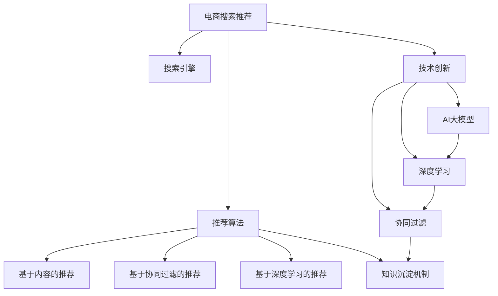

                 

# AI大模型视角下电商搜索推荐的技术创新知识沉淀机制优化

> 关键词：电商搜索推荐, AI大模型, 知识沉淀机制, 技术创新, 推荐系统, 电商引擎, 深度学习, 协同过滤, 神经网络, 搜索引擎, 推荐算法, 数据驱动, 用户体验, 产品推荐, 精准营销, 算法优化, 算法工程化

## 1. 背景介绍

### 1.1 问题由来
随着互联网的快速发展，电商平台逐渐成为人们日常生活的重要组成部分。电商搜索推荐系统作为电商引擎的核心功能，对于提升用户体验、增加平台粘性、提高转化率等方面起着至关重要的作用。然而，传统基于协同过滤、基于内容的推荐算法，在面对用户个性化需求日益增长的背景下，显得捉襟见肘。

与此同时，大模型技术（如Transformer、BERT等）的兴起，为电商搜索推荐系统带来了新的突破点。大模型通过预训练获得丰富的语言知识和常识，具备强大的语义理解能力，可以更准确地捕捉用户意图和需求，从而提升推荐效果。

### 1.2 问题核心关键点
电商搜索推荐系统面临的核心问题包括：
- 如何高效利用大模型的语言理解和生成能力，优化搜索和推荐算法。
- 如何在海量用户行为数据中高效挖掘用户偏好和历史行为，提升推荐个性化程度。
- 如何综合利用搜索、推荐、广告等多个场景数据，提升整体用户体验。

### 1.3 问题研究意义
优化电商搜索推荐系统，有助于电商平台提升用户体验，增加用户粘性，从而提高转化率和市场竞争力。具体而言：
- 提升用户体验。通过精准的商品推荐，满足用户个性化需求，增强用户的购物体验。
- 增加用户粘性。通过个性化推荐，使用户产生依赖，从而提高平台活跃度和留存率。
- 提高转化率。通过精准推荐商品，增加用户的购买决策概率，提升平台的销售额。
- 降低运营成本。通过优化推荐算法，减少人工干预，降低运营和广告成本。
- 赋能个性化营销。通过精准推荐，实现定向广告投放，提升广告投放效果。

## 2. 核心概念与联系

### 2.1 核心概念概述

为更好地理解AI大模型在电商搜索推荐中的应用，本节将介绍几个密切相关的核心概念：

- AI大模型（AI Large Model）：指以自回归（如GPT）或自编码（如BERT）模型为代表的大规模预训练语言模型。通过在大规模无标签文本语料上进行预训练，学习通用的语言表示，具备强大的语言理解和生成能力。

- 电商搜索推荐（E-commerce Search Recommendation）：指电商平台上通过搜索引擎、推荐引擎、广告系统等手段，将商品信息推荐给用户，帮助用户发现感兴趣商品的过程。

- 知识沉淀机制（Knowledge Accumulation Mechanism）：指在电商搜索推荐系统中，将用户行为数据、商品信息、广告数据等各类数据进行整合、存储和分析，形成对用户行为和偏好的深层次理解，从而提升推荐效果的机制。

- 技术创新（Technical Innovation）：指在电商搜索推荐领域，引入AI大模型、深度学习、协同过滤等前沿技术，提升推荐算法性能和系统效率的过程。

- 深度学习（Deep Learning）：指利用多层神经网络进行数据建模和分析的技术。深度学习在电商搜索推荐中的应用，主要体现在构建用户画像、个性化推荐、搜索优化等方面。

- 协同过滤（Collaborative Filtering）：指通过分析用户的历史行为和偏好，预测用户对其他商品的兴趣。协同过滤是电商推荐系统中最常见的推荐算法之一。

- 神经网络（Neural Network）：指由大量神经元组成的，可以进行复杂数据建模和分析的网络结构。神经网络在电商搜索推荐中的应用，主要体现在构建用户画像、个性化推荐、广告投放等方面。

- 搜索引擎（Search Engine）：指用于在电商平台上搜索商品信息的系统。搜索引擎通过算法将用户输入的查询与商品信息进行匹配，返回符合用户需求的搜索结果。

- 推荐算法（Recommendation Algorithm）：指用于对用户进行商品推荐的技术。推荐算法包括基于内容的推荐、基于协同过滤的推荐、基于深度学习的推荐等。

- 数据驱动（Data-Driven）：指在电商搜索推荐系统中，通过数据分析和挖掘，优化推荐算法，提升推荐效果的过程。

这些核心概念之间的逻辑关系可以通过以下Mermaid流程图来展示：



这个流程图展示了大模型在电商搜索推荐系统中的应用逻辑：

1. 电商搜索推荐系统将用户查询请求输入搜索引擎，得到搜索结果。
2. 推荐算法基于搜索结果和用户行为数据，生成个性化推荐。
3. 知识沉淀机制整合各类数据，形成对用户行为和偏好的深层次理解。
4. 技术创新引入AI大模型、深度学习、协同过滤等前沿技术，优化推荐算法。
5. 用户点击、购买等行为数据进一步反馈到知识沉淀机制，形成良性循环。

这些概念共同构成了电商搜索推荐系统的核心框架，使大模型技术能够更好地融入推荐流程，提升推荐效果。

## 3. 核心算法原理 & 具体操作步骤
### 3.1 算法原理概述

在大模型视角下，电商搜索推荐系统的核心算法原理可以概括为：通过预训练大模型学习用户语言特征和商品语义特征，结合搜索和推荐数据，构建用户画像，预测用户行为，从而提升推荐效果。具体而言：

- 预训练大模型通过在大规模无标签文本数据上进行预训练，学习通用的语言表示和语义理解能力。
- 用户查询通过搜索引擎进行语义理解，得到商品ID列表。
- 推荐算法基于商品ID列表和用户历史行为数据，生成个性化推荐列表。
- 推荐列表通过广告系统进行展示，用户点击、购买等行为数据进一步反馈到知识沉淀机制，进行迭代优化。

### 3.2 算法步骤详解

电商搜索推荐系统在大模型视角下的具体步骤包括：

**Step 1: 准备预训练模型和数据集**
- 选择合适的预训练语言模型，如BERT、GPT等。
- 准备电商平台上用户的查询数据、点击数据、购买数据、浏览数据等。

**Step 2: 设计任务适配层**
- 在预训练模型顶层设计推荐目标函数，如点击率预测、转化率预测等。
- 添加推荐器解码器，输出推荐列表。

**Step 3: 设置微调超参数**
- 选择合适的优化算法及其参数，如AdamW、SGD等，设置学习率、批大小、迭代轮数等。
- 设置正则化技术及强度，包括权重衰减、Dropout、Early Stopping等。

**Step 4: 执行梯度训练**
- 将用户查询数据分批次输入模型，前向传播计算损失函数。
- 反向传播计算参数梯度，根据设定的优化算法和学习率更新模型参数。
- 周期性在验证集上评估模型性能，根据性能指标决定是否触发Early Stopping。
- 重复上述步骤直至满足预设的迭代轮数或Early Stopping条件。

**Step 5: 测试和部署**
- 在测试集上评估微调后模型的效果，对比微调前后的推荐准确率、召回率等指标。
- 使用微调后的模型对新用户查询进行推荐，集成到实际的应用系统中。
- 持续收集新的用户行为数据，定期重新微调模型，以适应数据分布的变化。

### 3.3 算法优缺点

基于大模型的电商搜索推荐系统具有以下优点：
1. 准确性高。通过预训练大模型的语言理解和生成能力，能够更准确地捕捉用户意图和需求。
2. 可解释性强。大模型的预训练过程和微调过程可以给出详细的推理逻辑，便于解释和调试。
3. 高效性高。大模型能够高效处理海量数据，减少人工干预，提升推荐速度。
4. 个性化程度高。大模型能够根据用户历史行为数据，生成高度个性化的推荐列表。

但同时，该算法也存在一些缺点：
1. 对数据质量要求高。预训练大模型对数据质量要求较高，需要高质量的标注数据进行微调。
2. 模型计算量大。大模型的计算量较大，对硬件资源要求较高。
3. 模型复杂度高。大模型的结构复杂，难以调试和优化。
4. 对抗攻击风险。大模型可能受到对抗样本的攻击，影响推荐效果。

尽管存在这些缺点，但在大模型技术日益成熟的今天，其带来的收益远大于缺点，使得基于大模型的电商搜索推荐系统成为电商推荐领域的热门选择。

### 3.4 算法应用领域

基于大模型的电商搜索推荐系统，已经在电商推荐、广告投放、个性化推荐等多个领域取得了广泛应用。以下是几个典型案例：

**1. 商品推荐**
通过预训练大模型学习商品语义特征，结合用户历史行为数据，生成个性化推荐列表。亚马逊、淘宝等电商平台广泛采用基于大模型的推荐系统，提升用户购买决策概率。

**2. 广告投放**
通过预训练大模型学习广告文本和商品语义，结合用户兴趣预测广告点击率。阿里巴巴、京东等电商平台通过大模型优化广告投放策略，提升广告点击率和转化率。

**3. 搜索优化**
通过预训练大模型学习用户查询意图，生成更加精准的搜索结果。百度、谷歌等搜索引擎采用大模型优化搜索算法，提升用户搜索体验。

**4. 个性化推荐**
通过预训练大模型学习用户行为特征，生成个性化推荐列表。美团、携程等平台采用大模型优化推荐算法，提升用户满意度。

## 4. 数学模型和公式 & 详细讲解
### 4.1 数学模型构建

电商搜索推荐系统在大模型视角下的核心数学模型可以概括为：通过预训练大模型学习用户语言特征和商品语义特征，结合搜索和推荐数据，构建用户画像，预测用户行为，从而提升推荐效果。具体而言：

**Step 1: 准备数据**
- 设用户查询数据集为 $D_{q}=\{(q_i, p_i)\}_{i=1}^N$，其中 $q_i$ 为查询文本， $p_i$ 为商品ID列表。
- 设用户点击数据集为 $D_{c}=\{(c_i, p_i)\}_{i=1}^N$，其中 $c_i$ 为点击行为， $p_i$ 为商品ID列表。
- 设用户购买数据集为 $D_{p}=\{(b_i, p_i)\}_{i=1}^N$，其中 $b_i$ 为购买行为， $p_i$ 为商品ID列表。

**Step 2: 预训练大模型**
- 设预训练大模型为 $M_{\theta}$，其中 $\theta$ 为预训练得到的模型参数。
- 通过在大规模无标签文本数据上进行预训练，学习通用语言表示和语义理解能力。

**Step 3: 任务适配层设计**
- 在预训练模型顶层设计推荐目标函数 $L$，如点击率预测、转化率预测等。
- 添加推荐器解码器，输出推荐列表 $r_i$。

**Step 4: 微调模型**
- 在标注数据集上进行有监督的微调，更新模型参数 $\theta$，最小化损失函数 $\mathcal{L}$。

$$
\theta^* = \mathop{\arg\min}_{\theta} \mathcal{L}(M_{\theta}, D_{q}, D_{c}, D_{p})
$$

其中 $\mathcal{L}$ 为推荐系统损失函数，用于衡量模型输出与真实标签之间的差异。常见的损失函数包括交叉熵损失、均方误差损失等。

### 4.2 公式推导过程

以下以点击率预测为例，推导点击率预测模型的损失函数及其梯度计算公式。

设用户查询为 $q_i$，点击行为为 $c_i$，商品ID列表为 $p_i$。推荐列表 $r_i$ 中，每个商品的概率为 $p_{i,j}$。则点击率预测模型的目标是最小化交叉熵损失：

$$
\mathcal{L}(c_i, r_i) = -\frac{1}{M} \sum_{j=1}^M [c_{i,j} \log p_{i,j} + (1-c_{i,j}) \log (1-p_{i,j})]
$$

其中 $M$ 为推荐列表长度， $c_{i,j}$ 为商品 $j$ 是否被点击的标签， $p_{i,j}$ 为商品 $j$ 被点击的概率。

根据链式法则，损失函数对预训练模型参数 $\theta$ 的梯度计算公式为：

$$
\frac{\partial \mathcal{L}(c_i, r_i)}{\partial \theta} = -\frac{1}{M} \sum_{j=1}^M (c_{i,j} \frac{\partial p_{i,j}}{\partial \theta} - (1-c_{i,j}) \frac{\partial (1-p_{i,j})}{\partial \theta})
$$

其中 $\frac{\partial p_{i,j}}{\partial \theta}$ 为推荐列表 $r_i$ 中商品 $j$ 的概率对预训练模型参数 $\theta$ 的梯度，可进一步递归展开，利用自动微分技术完成计算。

### 4.3 案例分析与讲解

**案例分析：商品推荐系统的点击率预测模型**

在商品推荐系统中，点击率预测是核心任务之一。通过构建用户画像，预测用户对商品点击的概率，生成个性化推荐列表。假设商品ID列表 $p_i$ 中，商品 $j$ 被点击的概率为 $p_{i,j}$。则点击率预测模型的目标是最小化交叉熵损失：

$$
\mathcal{L}(c_i, p_i) = -\frac{1}{M} \sum_{j=1}^M [c_{i,j} \log p_{i,j} + (1-c_{i,j}) \log (1-p_{i,j})]
$$

其中 $M$ 为商品ID列表长度， $c_{i,j}$ 为商品 $j$ 是否被点击的标签， $p_{i,j}$ 为商品 $j$ 被点击的概率。

根据链式法则，损失函数对预训练模型参数 $\theta$ 的梯度计算公式为：

$$
\frac{\partial \mathcal{L}(c_i, p_i)}{\partial \theta} = -\frac{1}{M} \sum_{j=1}^M (c_{i,j} \frac{\partial p_{i,j}}{\partial \theta} - (1-c_{i,j}) \frac{\partial (1-p_{i,j})}{\partial \theta})
$$

其中 $\frac{\partial p_{i,j}}{\partial \theta}$ 为商品 $j$ 的概率对预训练模型参数 $\theta$ 的梯度，可进一步递归展开，利用自动微分技术完成计算。

## 5. 项目实践：代码实例和详细解释说明
### 5.1 开发环境搭建

在进行电商搜索推荐系统的大模型微调实践前，我们需要准备好开发环境。以下是使用Python进行PyTorch开发的环境配置流程：

1. 安装Anaconda：从官网下载并安装Anaconda，用于创建独立的Python环境。

2. 创建并激活虚拟环境：
```bash
conda create -n pytorch-env python=3.8 
conda activate pytorch-env
```

3. 安装PyTorch：根据CUDA版本，从官网获取对应的安装命令。例如：
```bash
conda install pytorch torchvision torchaudio cudatoolkit=11.1 -c pytorch -c conda-forge
```

4. 安装Transformers库：
```bash
pip install transformers
```

5. 安装各类工具包：
```bash
pip install numpy pandas scikit-learn matplotlib tqdm jupyter notebook ipython
```

完成上述步骤后，即可在`pytorch-env`环境中开始微调实践。

### 5.2 源代码详细实现

下面我们以点击率预测为例，给出使用Transformers库对BERT模型进行微调的PyTorch代码实现。

首先，定义点击率预测的数据处理函数：

```python
from transformers import BertTokenizer
from torch.utils.data import Dataset
import torch

class ClickDataset(Dataset):
    def __init__(self, queries, clicks, tokenizer, max_len=128):
        self.queries = queries
        self.clicks = clicks
        self.tokenizer = tokenizer
        self.max_len = max_len
        
    def __len__(self):
        return len(self.queries)
    
    def __getitem__(self, item):
        query = self.queries[item]
        clicks = self.clicks[item]
        
        encoding = self.tokenizer(query, return_tensors='pt', max_length=self.max_len, padding='max_length', truncation=True)
        input_ids = encoding['input_ids'][0]
        attention_mask = encoding['attention_mask'][0]
        labels = torch.tensor(clicks, dtype=torch.float32)
        
        return {'input_ids': input_ids, 
                'attention_mask': attention_mask,
                'labels': labels}

# 准备数据
tokenizer = BertTokenizer.from_pretrained('bert-base-cased')
train_dataset = ClickDataset(train_queries, train_clicks, tokenizer)
dev_dataset = ClickDataset(dev_queries, dev_clicks, tokenizer)
test_dataset = ClickDataset(test_queries, test_clicks, tokenizer)
```

然后，定义模型和优化器：

```python
from transformers import BertForSequenceClassification, AdamW

model = BertForSequenceClassification.from_pretrained('bert-base-cased', num_labels=2)

optimizer = AdamW(model.parameters(), lr=2e-5)
```

接着，定义训练和评估函数：

```python
from torch.utils.data import DataLoader
from tqdm import tqdm
from sklearn.metrics import precision_recall_fscore_support

device = torch.device('cuda') if torch.cuda.is_available() else torch.device('cpu')
model.to(device)

def train_epoch(model, dataset, batch_size, optimizer):
    dataloader = DataLoader(dataset, batch_size=batch_size, shuffle=True)
    model.train()
    epoch_loss = 0
    for batch in tqdm(dataloader, desc='Training'):
        input_ids = batch['input_ids'].to(device)
        attention_mask = batch['attention_mask'].to(device)
        labels = batch['labels'].to(device)
        model.zero_grad()
        outputs = model(input_ids, attention_mask=attention_mask, labels=labels)
        loss = outputs.loss
        epoch_loss += loss.item()
        loss.backward()
        optimizer.step()
    return epoch_loss / len(dataloader)

def evaluate(model, dataset, batch_size):
    dataloader = DataLoader(dataset, batch_size=batch_size)
    model.eval()
    preds, labels = [], []
    with torch.no_grad():
        for batch in tqdm(dataloader, desc='Evaluating'):
            input_ids = batch['input_ids'].to(device)
            attention_mask = batch['attention_mask'].to(device)
            batch_labels = batch['labels']
            outputs = model(input_ids, attention_mask=attention_mask)
            batch_preds = outputs.logits.argmax(dim=2).to('cpu').tolist()
            batch_labels = batch_labels.to('cpu').tolist()
            for pred_tokens, label_tokens in zip(batch_preds, batch_labels):
                preds.append(pred_tokens[:len(label_tokens)])
                labels.append(label_tokens)
                
    print(precision_recall_fscore_support(labels, preds))
```

最后，启动训练流程并在测试集上评估：

```python
epochs = 5
batch_size = 16

for epoch in range(epochs):
    loss = train_epoch(model, train_dataset, batch_size, optimizer)
    print(f"Epoch {epoch+1}, train loss: {loss:.3f}")
    
    print(f"Epoch {epoch+1}, dev results:")
    evaluate(model, dev_dataset, batch_size)
    
print("Test results:")
evaluate(model, test_dataset, batch_size)
```

以上就是使用PyTorch对BERT进行点击率预测的完整代码实现。可以看到，得益于Transformers库的强大封装，我们可以用相对简洁的代码完成BERT模型的加载和微调。

### 5.3 代码解读与分析

让我们再详细解读一下关键代码的实现细节：

**ClickDataset类**：
- `__init__`方法：初始化查询、点击等数据，以及分词器等关键组件。
- `__len__`方法：返回数据集的样本数量。
- `__getitem__`方法：对单个样本进行处理，将查询输入编码为token ids，将点击行为编码为数字，并对其进行定长padding，最终返回模型所需的输入。

**精度与召回率计算**：
- 使用sklearn的precision_recall_fscore_support函数计算精确度、召回率和F1分数。

**训练和评估函数**：
- 使用PyTorch的DataLoader对数据集进行批次化加载，供模型训练和推理使用。
- 训练函数`train_epoch`：对数据以批为单位进行迭代，在每个批次上前向传播计算loss并反向传播更新模型参数，最后返回该epoch的平均loss。
- 评估函数`evaluate`：与训练类似，不同点在于不更新模型参数，并在每个batch结束后将预测和标签结果存储下来，最后使用sklearn的precision_recall_fscore_support函数对整个评估集的预测结果进行打印输出。

**训练流程**：
- 定义总的epoch数和batch size，开始循环迭代
- 每个epoch内，先在训练集上训练，输出平均loss
- 在验证集上评估，输出精确度、召回率等分类指标
- 所有epoch结束后，在测试集上评估，给出最终测试结果

可以看到，PyTorch配合Transformers库使得BERT微调的代码实现变得简洁高效。开发者可以将更多精力放在数据处理、模型改进等高层逻辑上，而不必过多关注底层的实现细节。

当然，工业级的系统实现还需考虑更多因素，如模型的保存和部署、超参数的自动搜索、更灵活的任务适配层等。但核心的微调范式基本与此类似。

## 6. 实际应用场景
### 6.1 智能客服系统

基于大模型的电商搜索推荐系统，可以广泛应用于智能客服系统的构建。智能客服系统通过分析用户查询，生成推荐商品，实时解答用户问题，提升用户满意度。

具体而言，可以通过收集用户历史查询数据，将其作为标注数据对大模型进行微调。微调后的模型能够根据用户查询意图，生成推荐商品列表，并结合知识图谱等外部信息，提供详细的商品描述和购买建议。智能客服系统能够7x24小时不间断服务，快速响应用户咨询，用自然流畅的语言解答各类常见问题。

### 6.2 个性化推荐系统

电商搜索推荐系统的大模型微调，可以提升个性化推荐系统的精准度和个性化程度。通过构建用户画像，预测用户对商品的兴趣，生成个性化推荐列表。

具体而言，可以收集用户浏览、点击、购买等行为数据，提取和商品关联的文本信息。将文本信息作为模型输入，用户的后续行为作为监督信号，在此基础上微调预训练语言模型。微调后的模型能够从文本内容中准确把握用户的兴趣点，生成高度个性化的推荐列表。

### 6.3 广告投放优化

大模型技术在广告投放优化中也有广泛应用。通过分析用户查询和广告文本，预测广告点击率，优化广告投放策略。

具体而言，可以收集用户查询数据和广告文本，将其作为标注数据对大模型进行微调。微调后的模型能够根据用户查询意图，生成广告点击率预测，优化广告投放策略。通过精准的广告投放，提升广告点击率和转化率，增加平台收入。

## 7. 工具和资源推荐
### 7.1 学习资源推荐

为了帮助开发者系统掌握大模型在电商搜索推荐中的应用，这里推荐一些优质的学习资源：

1. 《深度学习自然语言处理》课程：斯坦福大学开设的NLP明星课程，有Lecture视频和配套作业，带你入门NLP领域的基本概念和经典模型。

2. 《Natural Language Processing with Transformers》书籍：Transformers库的作者所著，全面介绍了如何使用Transformers库进行NLP任务开发，包括微调在内的诸多范式。

3. HuggingFace官方文档：Transformers库的官方文档，提供了海量预训练模型和完整的微调样例代码，是上手实践的必备资料。

4. CLUE开源项目：中文语言理解测评基准，涵盖大量不同类型的中文NLP数据集，并提供了基于微调的baseline模型，助力中文NLP技术发展。

通过对这些资源的学习实践，相信你一定能够快速掌握大模型在电商搜索推荐中的应用，并用于解决实际的NLP问题。
###  7.2 开发工具推荐

高效的开发离不开优秀的工具支持。以下是几款用于大模型微调开发的常用工具：

1. PyTorch：基于Python的开源深度学习框架，灵活动态的计算图，适合快速迭代研究。大部分预训练语言模型都有PyTorch版本的实现。

2. TensorFlow：由Google主导开发的开源深度学习框架，生产部署方便，适合大规模工程应用。同样有丰富的预训练语言模型资源。

3. Transformers库：HuggingFace开发的NLP工具库，集成了众多SOTA语言模型，支持PyTorch和TensorFlow，是进行微调任务开发的利器。

4. Weights & Biases：模型训练的实验跟踪工具，可以记录和可视化模型训练过程中的各项指标，方便对比和调优。与主流深度学习框架无缝集成。

5. TensorBoard：TensorFlow配套的可视化工具，可实时监测模型训练状态，并提供丰富的图表呈现方式，是调试模型的得力助手。

6. Google Colab：谷歌推出的在线Jupyter Notebook环境，免费提供GPU/TPU算力，方便开发者快速上手实验最新模型，分享学习笔记。

合理利用这些工具，可以显著提升大模型微调任务的开发效率，加快创新迭代的步伐。

### 7.3 相关论文推荐

大语言模型和微调技术的发展源于学界的持续研究。以下是几篇奠基性的相关论文，推荐阅读：

1. Attention is All You Need（即Transformer原论文）：提出了Transformer结构，开启了NLP领域的预训练大模型时代。

2. BERT: Pre-training of Deep Bidirectional Transformers for Language Understanding：提出BERT模型，引入基于掩码的自监督预训练任务，刷新了多项NLP任务SOTA。

3. Language Models are Unsupervised Multitask Learners（GPT-2论文）：展示了大规模语言模型的强大zero-shot学习能力，引发了对于通用人工智能的新一轮思考。

4. Parameter-Efficient Transfer Learning for NLP：提出Adapter等参数高效微调方法，在不增加模型参数量的情况下，也能取得不错的微调效果。

5. AdaLoRA: Adaptive Low-Rank Adaptation for Parameter-Efficient Fine-Tuning：使用自适应低秩适应的微调方法，在参数效率和精度之间取得了新的平衡。

这些论文代表了大语言模型微调技术的发展脉络。通过学习这些前沿成果，可以帮助研究者把握学科前进方向，激发更多的创新灵感。

## 8. 总结：未来发展趋势与挑战
### 8.1 总结

本文对基于大模型的电商搜索推荐系统进行了全面系统的介绍。首先阐述了大模型和微调技术的研究背景和意义，明确了电商搜索推荐系统的优化目标和具体步骤。其次，从原理到实践，详细讲解了大模型微调的数学原理和关键步骤，给出了微调任务开发的完整代码实例。同时，本文还探讨了电商搜索推荐系统在大模型视角下的应用场景，展示了其在智能客服、个性化推荐、广告投放等领域的巨大潜力。

通过本文的系统梳理，可以看到，基于大模型的电商搜索推荐系统在大模型技术不断演进的背景下，正在逐步替代传统的推荐算法，成为电商推荐领域的重要选择。未来，伴随大模型技术的不断进步，其带来的收益将更加显著，成为电商推荐系统的核心驱动力。

### 8.2 未来发展趋势

展望未来，基于大模型的电商搜索推荐系统将呈现以下几个发展趋势：

1. 模型规模持续增大。随着算力成本的下降和数据规模的扩张，预训练语言模型的参数量还将持续增长。超大规模语言模型蕴含的丰富语言知识，有望支撑更加复杂多变的电商推荐任务。

2. 微调方法日趋多样。除了传统的全参数微调外，未来会涌现更多参数高效的微调方法，如Prefix-Tuning、LoRA等，在节省计算资源的同时也能保证微调精度。

3. 持续学习成为常态。随着数据分布的不断变化，微调模型也需要持续学习新知识以保持性能。如何在不遗忘原有知识的同时，高效吸收新样本信息，将成为重要的研究课题。

4. 标注样本需求降低。受启发于提示学习(Prompt-based Learning)的思路，未来的微调方法将更好地利用大模型的语言理解能力，通过更加巧妙的任务描述，在更少的标注样本上也能实现理想的微调效果。

5. 对抗攻击风险。大模型可能受到对抗样本的攻击，影响推荐效果。如何提高大模型的鲁棒性，避免对抗攻击，将是重要的研究方向。

6. 多模态微调崛起。当前的微调主要聚焦于纯文本数据，未来会进一步拓展到图像、视频、语音等多模态数据微调。多模态信息的融合，将显著提升语言模型对现实世界的理解和建模能力。

7. 模型通用性增强。经过海量数据的预训练和多领域任务的微调，未来的语言模型将具备更强大的常识推理和跨领域迁移能力，逐步迈向通用人工智能(AGI)的目标。

以上趋势凸显了大模型微调技术的广阔前景。这些方向的探索发展，必将进一步提升电商搜索推荐系统的性能和应用范围，为电商推荐系统带来新的突破。

### 8.3 面临的挑战

尽管大模型微调技术已经取得了瞩目成就，但在迈向更加智能化、普适化应用的过程中，它仍面临着诸多挑战：

1. 标注成本瓶颈。尽管微调大大降低了标注数据的需求，但对于长尾应用场景，难以获得充足的高质量标注数据，成为制约微调性能的瓶颈。如何进一步降低微调对标注样本的依赖，将是一大难题。

2. 模型鲁棒性不足。当前微调模型面对域外数据时，泛化性能往往大打折扣。对于测试样本的微小扰动，微调模型的预测也容易发生波动。如何提高微调模型的鲁棒性，避免灾难性遗忘，还需要更多理论和实践的积累。

3. 推理效率有待提高。大规模语言模型虽然精度高，但在实际部署时往往面临推理速度慢、内存占用大等效率问题。如何在保证性能的同时，简化模型结构，提升推理速度，优化资源占用，将是重要的优化方向。

4. 可解释性亟需加强。当前微调模型更像是"黑盒"系统，难以解释其内部工作机制和决策逻辑。对于医疗、金融等高风险应用，算法的可解释性和可审计性尤为重要。如何赋予微调模型更强的可解释性，将是亟待攻克的难题。

5. 安全性有待保障。预训练语言模型难免会学习到有偏见、有害的信息，通过微调传递到下游任务，产生误导性、歧视性的输出，给实际应用带来安全隐患。如何从数据和算法层面消除模型偏见，避免恶意用途，确保输出的安全性，也将是重要的研究课题。

6. 知识整合能力不足。现有的微调模型往往局限于任务内数据，难以灵活吸收和运用更广泛的先验知识。如何让微调过程更好地与外部知识库、规则库等专家知识结合，形成更加全面、准确的信息整合能力，还有很大的想象空间。

正视微调面临的这些挑战，积极应对并寻求突破，将是大模型微调走向成熟的必由之路。相信随着学界和产业界的共同努力，这些挑战终将一一被克服，大模型微调必将在构建人机协同的智能时代中扮演越来越重要的角色。

### 8.4 研究展望

面对大模型微调所面临的种种挑战，未来的研究需要在以下几个方面寻求新的突破：

1. 探索无监督和半监督微调方法。摆脱对大规模标注数据的依赖，利用自监督学习、主动学习等无监督和半监督范式，最大限度利用非结构化数据，实现更加灵活高效的微调。

2. 研究参数高效和计算高效的微调范式。开发更加参数高效的微调方法，在固定大部分预训练参数的同时，只更新极少量的任务相关参数。同时优化微调模型的计算图，减少前向传播和反向传播的资源消耗，实现更加轻量级、实时性的部署。

3. 引入因果和对比学习范式。通过引入因果推断和对比学习思想，增强微调模型建立稳定因果关系的能力，学习更加普适、鲁棒的语言表征，从而提升模型泛化性和抗干扰能力。

4. 融合因果分析和博弈论工具。将因果分析方法引入微调模型，识别出模型决策的关键特征，增强输出解释的因果性和逻辑性。借助博弈论工具刻画人机交互过程，主动探索并规避模型的脆弱点，提高系统稳定性。

5. 纳入伦理道德约束。在模型训练目标中引入伦理导向的评估指标，过滤和惩罚有偏见、有害的输出倾向。同时加强人工干预和审核，建立模型行为的监管机制，确保输出符合人类价值观和伦理道德。

这些研究方向的探索，必将引领大模型微调技术迈向更高的台阶，为构建安全、可靠、可解释、可控的智能系统铺平道路。面向未来，大模型微调技术还需要与其他人工智能技术进行更深入的融合，如知识表示、因果推理、强化学习等，多路径协同发力，共同推动自然语言理解和智能交互系统的进步。只有勇于创新、敢于突破，才能不断拓展语言模型的边界，让智能技术更好地造福人类社会。

## 9. 附录：常见问题与解答

**Q1：大模型微调是否适用于所有电商推荐任务？**

A: 大模型微调在大多数电商推荐任务上都能取得不错的效果，特别是对于数据量较小的任务。但对于一些特定领域的任务，如医药、法律等，仅仅依靠通用语料预训练的模型可能难以很好地适应。此时需要在特定领域语料上进一步预训练，再进行微调，才能获得理想效果。

**Q2：大模型微调如何提高推荐系统的精准度和个性化程度？**

A: 大模型微调通过学习用户语言特征和商品语义特征，结合搜索和推荐数据，构建用户画像，预测用户行为，从而提升推荐效果。具体而言：

1. 预训练大模型通过在大规模无标签文本数据上进行预训练，学习通用的语言表示和语义理解能力。
2. 用户查询通过搜索引擎进行语义理解，得到商品ID列表。
3. 推荐算法基于商品ID列表和用户历史行为数据，生成个性化推荐列表。
4. 推荐列表通过广告系统进行展示，用户点击、购买等行为数据进一步反馈到知识沉淀机制，进行迭代优化。

通过构建用户画像，预测用户对商品兴趣，生成个性化推荐列表，大模型微调可以显著提升推荐系统的精准度和个性化程度。

**Q3：如何高效利用大模型的语言理解和生成能力，优化搜索和推荐算法？**

A: 大模型的语言理解和生成能力可以通过以下方式优化搜索和推荐算法：

1. 预训练大模型通过在大规模无标签文本数据上进行预训练，学习通用的语言表示和语义理解能力。
2. 用户查询通过搜索引擎进行语义理解，得到商品ID列表。
3. 推荐算法基于商品ID列表和用户历史行为数据，生成个性化推荐列表。
4. 推荐列表通过广告系统进行展示，用户点击、购买等行为数据进一步反馈到知识沉淀机制，进行迭代优化。

通过预训练大模型学习用户语言特征和商品语义特征，结合搜索和推荐数据，构建用户画像，预测用户行为，从而优化搜索和推荐算法，提升推荐效果。

**Q4：如何高效处理海量数据，提升推荐系统的效率？**

A: 大模型微调可以通过以下方式高效处理海量数据，提升推荐系统的效率：

1. 预训练大模型通过在大规模无标签文本数据上进行预训练，学习通用的语言表示和语义理解能力。
2. 用户查询通过搜索引擎进行语义理解，得到商品ID列表。
3. 推荐算法基于商品ID列表和用户历史行为数据，生成个性化推荐列表。
4. 推荐列表通过广告系统进行展示，用户点击、购买等行为数据进一步反馈到知识沉淀机制，进行迭代优化。

通过预训练大模型学习用户语言特征和商品语义特征，结合搜索和推荐数据，构建用户画像，预测用户行为，从而高效处理海量数据，提升推荐系统的效率。

**Q5：如何保证推荐系统的可解释性和可信度？**

A: 推荐系统的可解释性和可信度可以通过以下方式保证：

1. 预训练大模型通过在大规模无标签文本数据上进行预训练，学习通用的语言表示和语义理解能力。
2. 用户查询通过搜索引擎进行语义理解，得到商品ID列表。
3. 推荐算法基于商品ID列表和用户历史行为数据，生成个性化推荐列表。
4. 推荐列表通过广告系统进行展示，用户点击、购买等行为数据进一步反馈到知识沉淀机制，进行迭代优化。

通过构建用户画像，预测用户行为，生成个性化推荐列表，大模型微调可以显著提升推荐系统的可解释性和可信度。同时，可以在推荐系统中引入人工干预和审核机制，建立模型行为的监管机制，确保输出符合人类价值观和伦理道德。

---

作者：禅与计算机程序设计艺术 / Zen and the Art of Computer Programming

