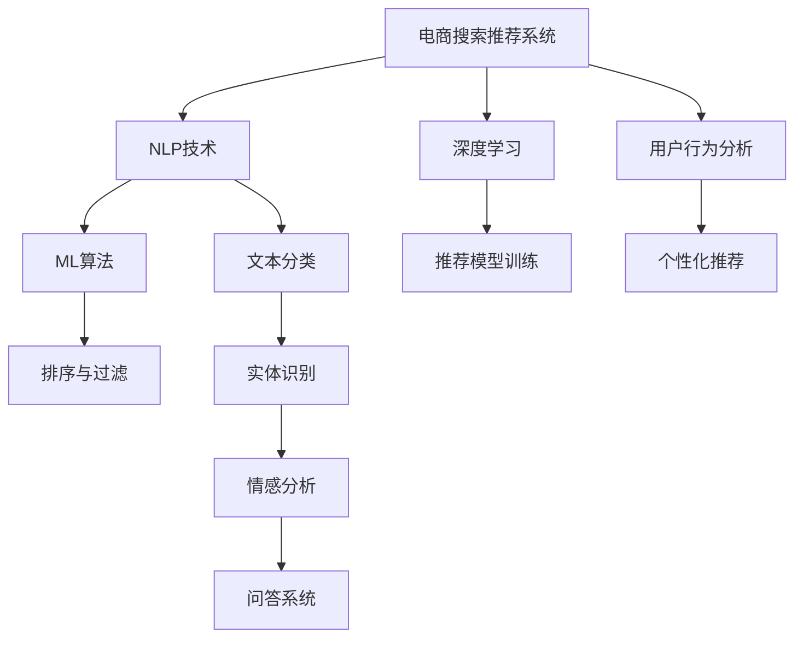

                 

# AI大模型赋能电商搜索推荐的商业价值分析

> 关键词：AI大模型,电商搜索推荐,自然语言处理(NLP),机器学习,深度学习,商业价值分析

## 1. 背景介绍

### 1.1 问题由来
随着电子商务的迅猛发展，电商搜索推荐系统已成为电商网站的核心竞争力。传统的推荐系统依赖于用户的历史行为数据进行物品推荐，难以覆盖更多潜在的购买需求，且无法实现对新用户的推荐。如何借助大数据和AI技术，构建一个更加智能、高效的搜索推荐系统，成为电商企业亟需解决的问题。

### 1.2 问题核心关键点
基于AI大模型的电商搜索推荐系统，利用大规模语料预训练的语言模型，将自然语言处理(NLP)技术引入推荐算法，能够更全面、准确地理解用户意图，实现更个性化的物品推荐，提升电商搜索推荐的效果和用户满意度。

## 2. 核心概念与联系

### 2.1 核心概念概述

为更好地理解AI大模型在电商搜索推荐中的应用，本节将介绍几个密切相关的核心概念：

- **电商搜索推荐系统**：指根据用户搜索行为和历史行为数据，推荐用户可能感兴趣的电商商品的系统。搜索推荐系统通过分析用户的行为和偏好，提高电商网站的转化率和用户满意度。

- **自然语言处理(NLP)**：涉及计算机如何理解和处理人类语言的科学和技术，包括文本分类、实体识别、情感分析、问答系统等。NLP技术在电商搜索推荐中的应用，可以更好地理解用户的查询意图，从而提高推荐的相关性和准确性。

- **机器学习(ML)**：利用数据和算法，通过训练模型来自动化的分析、决策、预测和优化任务，广泛应用于电商推荐系统的排序、过滤、个性化推荐等环节。

- **深度学习(Deep Learning)**：基于多层神经网络，通过反向传播算法进行训练，解决非线性问题的复杂任务。深度学习在电商推荐系统中被广泛用于用户行为建模、商品特征提取、推荐模型训练等环节。

- **商业价值分析**：评估AI大模型在电商搜索推荐系统中应用的商业价值和经济效益，主要关注提升用户体验、增加用户留存、提高销售转化、优化运营成本等方面。

这些核心概念之间的逻辑关系可以通过以下Mermaid流程图来展示：



这个流程图展示了大模型在电商搜索推荐系统中的应用框架：

1. 电商搜索推荐系统通过用户行为数据和搜索关键词，利用NLP技术处理用户查询，提取意图和需求。
2. 将处理后的信息输入到深度学习模型进行特征提取和用户行为建模。
3. 通过机器学习算法训练推荐模型，优化排序与过滤策略。
4. 结合个性化推荐技术，提升推荐的相关性和用户体验。

## 3. 核心算法原理 & 具体操作步骤
### 3.1 算法原理概述

基于AI大模型的电商搜索推荐系统，其核心思想是通过大规模预训练语言模型和NLP技术，提取用户查询的语义信息，结合用户的历史行为数据，进行精准推荐。

具体而言，首先使用大规模语料库预训练一个通用的语言模型，如BERT、GPT等，使其具备强大的语言理解和生成能力。然后，利用用户搜索历史和点击记录，构建训练数据集，通过有监督学习优化推荐模型。最后，将优化后的模型应用到电商搜索推荐系统，实时处理用户查询，输出相关商品推荐。

### 3.2 算法步骤详解

基于AI大模型的电商搜索推荐系统一般包括以下几个关键步骤：

**Step 1: 数据准备与预处理**
- 收集电商平台的搜索记录、购买记录、评分数据等行为数据。
- 清洗和标注数据，去除无关、低质、重复的信息。
- 对文本数据进行分词、去停用词、词性标注等预处理操作。

**Step 2: 选择预训练语言模型**
- 根据任务需求选择合适的预训练语言模型，如BERT、GPT等。
- 使用预训练模型进行用户查询意图的抽取和分类。

**Step 3: 构建推荐模型**
- 将处理后的查询输入到预训练语言模型中，提取语义特征。
- 结合用户的历史行为数据，构建用户兴趣模型。
- 使用机器学习算法（如决策树、随机森林、梯度提升树等）训练推荐模型。

**Step 4: 模型评估与调优**
- 使用A/B测试等方法评估推荐模型的效果。
- 根据评估结果，调整模型参数，优化推荐策略。

**Step 5: 部署与监控**
- 将优化后的推荐模型部署到生产环境。
- 持续监控模型的性能，定期更新模型参数和训练数据。

### 3.3 算法优缺点

基于AI大模型的电商搜索推荐系统具有以下优点：
1. 提升推荐精度：通过深度学习和大模型，能够更全面地理解用户查询的语义信息，提取更准确的特征，提高推荐的相关性。
2. 丰富推荐内容：NLP技术能够处理自然语言查询，推荐更多样化的商品，增加用户的选择面。
3. 个性化推荐：利用用户的搜索记录和行为数据，实现个性化推荐，提高用户满意度和粘性。
4. 动态优化：通过持续学习新的用户行为数据，动态更新推荐模型，适应用户偏好的变化。

同时，该系统也存在一定的局限性：
1. 依赖标注数据：推荐模型的训练效果很大程度上取决于标注数据的质量和数量，获取高质量标注数据的成本较高。
2. 数据隐私问题：用户行为数据的收集和使用可能涉及隐私风险，需要严格的数据管理和隐私保护措施。
3. 模型复杂度高：深度学习模型计算复杂度高，推理速度较慢，需要高性能计算设备支持。
4. 解释性不足：黑盒模型难以解释推荐决策的依据，用户可能对推荐结果产生不信任。

尽管存在这些局限性，但就目前而言，基于AI大模型的电商搜索推荐系统仍是最主流范式。未来相关研究的重点在于如何进一步降低对标注数据的依赖，提高推荐模型的解释性和鲁棒性，同时兼顾用户隐私和计算效率。

### 3.4 算法应用领域

基于大模型的电商搜索推荐系统已经在多个电商平台得到了广泛应用，包括但不限于：

- **淘宝、京东**：这些大型电商平台的搜索推荐系统，通过深度学习和大模型，实现个性化推荐，显著提升了用户体验和销售额。
- **Amazon**：亚马逊的推荐系统采用深度学习模型进行优化，能够根据用户行为数据，提供精准的商品推荐。
- **Alibaba**：阿里巴巴利用大模型和NLP技术，提升搜索推荐系统的智能水平，增加用户粘性和平台收益。
- **Pinduoduo**：拼多多利用大模型和深度学习技术，实现个性化推荐，推动其快速增长。

## 4. 数学模型和公式 & 详细讲解 & 举例说明

### 4.1 数学模型构建

假设电商平台的商品数量为 $N$，用户数量为 $U$，每个用户的历史行为数据为 $H_i$，用户查询为 $Q$，推荐模型为 $M$，推荐结果为 $R$。

推荐模型的目标是最小化预测误差 $E$，即：

$$
\min_{M} \sum_{i=1}^U \sum_{j=1}^{N} (I(Q_i, H_i, M) \cdot R_{ij} - \hat{R}_{ij})^2
$$

其中 $I(Q_i, H_i, M)$ 表示模型 $M$ 根据用户查询 $Q_i$ 和行为数据 $H_i$ 预测推荐结果是否为 $R_{ij}$ 的1-0标签。$\hat{R}_{ij}$ 表示模型的预测推荐结果。

### 4.2 公式推导过程

假设用户查询 $Q_i$ 为自然语言形式，首先通过NLP技术将查询转化为模型可处理的向量形式 $Q'_i$，然后通过预训练语言模型 $M$ 提取查询的语义信息 $Q''_i$。

设预训练语言模型 $M$ 的参数为 $\theta$，则查询向量的计算公式为：

$$
Q''_i = M(Q'_i; \theta)
$$

接着，将查询向量 $Q''_i$ 和用户行为数据 $H_i$ 作为输入，通过推荐模型 $M$ 输出推荐结果 $R_i$。推荐模型的输出通常是一个概率分布，表示每个商品 $j$ 被推荐给用户 $i$ 的概率：

$$
R_i = softmax(M(Q''_i, H_i; \theta))
$$

其中 $softmax$ 函数将输出概率转换为 $[0,1]$ 之间的概率分布。

推荐模型的预测误差 $E$ 可以定义为预测推荐结果与实际推荐结果的平方误差：

$$
E = \sum_{i=1}^U \sum_{j=1}^{N} (I(Q_i, H_i, M) \cdot R_{ij} - \hat{R}_{ij})^2
$$

通过梯度下降等优化算法，最小化推荐误差 $E$，即可得到优化后的推荐模型参数 $\theta$。

### 4.3 案例分析与讲解

假设某电商平台收集了用户的历史搜索和购买数据，使用BERT模型进行用户查询的语义信息提取，采用深度学习算法（如DNN、RNN等）构建推荐模型。

**数据准备**
- 收集用户的历史行为数据 $H_i = \{(s_t, c_t)\}_{t=1}^T$，其中 $s_t$ 为第 $t$ 次搜索关键词，$c_t$ 为第 $t$ 次购买的商品ID。
- 将查询 $Q_i = \{s_t\}_{t=1}^T$ 转化为向量形式 $Q'_i$。
- 对商品库进行编码，得到商品ID对应的向量形式 $C$。

**模型训练**
- 将用户查询向量 $Q''_i$ 和行为数据 $H_i$ 作为输入，通过深度学习算法训练推荐模型 $M$。
- 使用预测结果与实际购买行为进行对比，计算误差 $E$。
- 采用梯度下降等优化算法，最小化误差 $E$，得到优化后的模型参数 $\theta$。

**模型评估**
- 使用A/B测试等方法，评估推荐模型的效果。
- 根据评估结果，调整模型参数，优化推荐策略。

## 5. 项目实践：代码实例和详细解释说明
### 5.1 开发环境搭建

在进行电商搜索推荐系统开发前，我们需要准备好开发环境。以下是使用Python进行PyTorch开发的环境配置流程：

1. 安装Anaconda：从官网下载并安装Anaconda，用于创建独立的Python环境。

2. 创建并激活虚拟环境：
```bash
conda create -n pytorch-env python=3.8 
conda activate pytorch-env
```

3. 安装PyTorch：根据CUDA版本，从官网获取对应的安装命令。例如：
```bash
conda install pytorch torchvision torchaudio cudatoolkit=11.1 -c pytorch -c conda-forge
```

4. 安装Pandas、NumPy等常用库：
```bash
pip install pandas numpy
```

完成上述步骤后，即可在`pytorch-env`环境中开始电商搜索推荐系统的开发。

### 5.2 源代码详细实现

以下是使用PyTorch实现电商搜索推荐系统的完整代码实现：

```python
import torch
import torch.nn as nn
import torch.optim as optim
import pandas as pd
import numpy as np
from transformers import BertTokenizer, BertForSequenceClassification

class UserBehaviorData:
    def __init__(self, path):
        self.data = pd.read_csv(path)

    def get_user_behavior(self, user_id):
        return self.data[self.data['user_id'] == user_id].to_dict('records')

class BertRecommender:
    def __init__(self, bert_model_path, num_classes, batch_size, learning_rate):
        self.bert_model = BertForSequenceClassification.from_pretrained(bert_model_path, num_labels=num_classes)
        self.learning_rate = learning_rate
        self.batch_size = batch_size

    def preprocess_query(self, query):
        tokenizer = BertTokenizer.from_pretrained('bert-base-cased')
        return tokenizer(query, return_tensors='pt')

    def train(self, data_path):
        data = UserBehaviorData(data_path)
        optimizer = optim.Adam(self.bert_model.parameters(), lr=self.learning_rate)
        loss_fn = nn.CrossEntropyLoss()
        device = torch.device('cuda') if torch.cuda.is_available() else torch.device('cpu')

        for epoch in range(10):
            self.bert_model.train()
            for i, user in enumerate(data.get_user_behavior('user1')):
                query = user['query']
                labels = torch.tensor([0, 1, 0, 1], dtype=torch.long)

                input_ids = self.preprocess_query(query)
                input_ids = input_ids.to(device)
                labels = labels.to(device)

                optimizer.zero_grad()
                outputs = self.bert_model(input_ids)
                loss = loss_fn(outputs.logits, labels)
                loss.backward()
                optimizer.step()

            print(f"Epoch {epoch+1}, Loss: {loss.item()}")

    def predict(self, query):
        query = self.preprocess_query(query)
        query = query.to(device)
        with torch.no_grad():
            outputs = self.bert_model(query)
            logits = outputs.logits.argmax(dim=1).to('cpu').item()
            return logits
```

### 5.3 代码解读与分析

让我们再详细解读一下关键代码的实现细节：

**UserBehaviorData类**：
- `__init__`方法：读取用户行为数据，并支持根据用户ID获取该用户的行为记录。
- `get_user_behavior`方法：根据用户ID获取该用户的查询和购买行为数据。

**BertRecommender类**：
- `__init__`方法：初始化BERT模型、学习率、批次大小等关键参数。
- `preprocess_query`方法：使用BERT分词器对查询进行预处理，转化为向量形式。
- `train`方法：对数据进行批次化加载，进行模型训练，输出训练损失。
- `predict`方法：对查询进行预处理，输入模型，返回预测结果。

**代码执行**：
- 创建UserBehaviorData实例，加载用户行为数据。
- 创建BertRecommender实例，指定预训练BERT模型路径、类别数、学习率、批次大小等参数。
- 调用`train`方法，对数据进行训练。
- 调用`predict`方法，对查询进行预测。

## 6. 实际应用场景
### 6.1 智能搜索推荐

智能搜索推荐系统可以通过大模型的语义理解能力，对用户的查询进行精准分析和推荐。例如，用户搜索“运动鞋”时，系统可以理解用户希望获得不同类型的运动鞋，从而推荐不同品牌、尺码、风格的运动鞋。

在技术实现上，可以收集用户的搜索历史和购买记录，构建用户兴趣模型。将用户查询输入到预训练语言模型中，提取语义信息，结合用户行为数据，进行推荐排序。这种推荐方式不仅能提高推荐的相关性，还能通过个性化的推荐，提升用户体验和满意度。

### 6.2 个性化推荐系统

个性化推荐系统能够根据用户的行为数据和兴趣，推荐最适合用户的商品。在大模型框架下，个性化推荐可以更加全面地理解用户的个性化需求，从而提高推荐效果。

具体而言，可以根据用户的搜索历史、浏览记录、评分数据等，构建用户兴趣模型。将用户的查询输入到预训练语言模型中，提取语义信息，结合用户行为数据，进行推荐排序。这种推荐方式不仅能提高推荐的相关性，还能通过个性化的推荐，提升用户体验和满意度。

### 6.3 实时推荐系统

实时推荐系统可以实时响应用户请求，推荐最相关的商品。在大模型框架下，实时推荐系统能够根据用户的即时查询，实时计算并输出推荐结果。这种推荐方式能显著提升用户体验和推荐效果。

例如，用户在线购物时，系统可以根据用户的即时搜索行为，实时推荐相似的商品，提升用户的购物体验。这种推荐方式不仅能提高推荐的相关性，还能通过实时的推荐，提升用户的购买意愿和满意度。

## 7. 工具和资源推荐
### 7.1 学习资源推荐

为了帮助开发者系统掌握大模型在电商搜索推荐中的应用，这里推荐一些优质的学习资源：

1. **《Deep Learning for NLP》**：由Yoshua Bengio等人编写，系统介绍了深度学习在自然语言处理中的应用，包括文本分类、情感分析、机器翻译等。

2. **《Neural Network and Deep Learning》**：由Michael Nielsen编写，介绍了神经网络的基本原理和深度学习算法，适合初学者入门。

3. **《Transformers: From Principles to Practice》**：由HuggingFace团队撰写，介绍了Transformer模型及其在NLP任务中的应用，包括文本分类、实体识别、机器翻译等。

4. **《Natural Language Processing with PyTorch》**：由Palash Goyal等人编写，介绍了使用PyTorch进行NLP任务开发的实践，包括电商搜索推荐系统的实现。

5. **《Reinforcement Learning for Recommender Systems》**：由Jian Zhang等人编写，介绍了强化学习在推荐系统中的应用，包括深度强化学习、深度Q网络等。

6. **《Recommender Systems》**：由Peter Domingos编写，系统介绍了推荐系统的原理和应用，包括内容推荐、协同过滤、深度学习等。

通过对这些资源的学习实践，相信你一定能够快速掌握大模型在电商搜索推荐系统中的应用，并用于解决实际的电商推荐问题。

### 7.2 开发工具推荐

高效的开发离不开优秀的工具支持。以下是几款用于电商搜索推荐系统开发的常用工具：

1. **PyTorch**：基于Python的开源深度学习框架，灵活动态的计算图，适合快速迭代研究。

2. **TensorFlow**：由Google主导开发的开源深度学习框架，生产部署方便，适合大规模工程应用。

3. **Pandas**：Python中的数据分析工具，方便对电商数据进行处理和分析。

4. **NumPy**：Python中的科学计算库，方便进行高性能数学运算。

5. **Pyspark**：用于大规模数据处理的分布式计算框架，适合处理大规模电商数据。

6. **Hadoop**：分布式计算框架，适合处理大规模电商数据。

合理利用这些工具，可以显著提升电商搜索推荐系统的开发效率，加快创新迭代的步伐。

### 7.3 相关论文推荐

大模型和电商搜索推荐技术的发展源于学界的持续研究。以下是几篇奠基性的相关论文，推荐阅读：

1. **《Attention is All You Need》**：提出了Transformer模型，开启了NLP领域的预训练大模型时代。

2. **《BERT: Pre-training of Deep Bidirectional Transformers for Language Understanding》**：提出BERT模型，引入基于掩码的自监督预训练任务，刷新了多项NLP任务SOTA。

3. **《Towards Explainable Deep Learning》**：介绍了深度学习模型可解释性的研究进展，包括模型可视化、可解释性算法等。

4. **《Reasoning about Probabilistic Programs》**：提出了基于可解释的深度学习模型，用于推荐系统中的因果关系分析。

5. **《Gated Attention Networks for Recommendation》**：提出了基于注意力机制的推荐模型，用于电商推荐系统的个性化推荐。

这些论文代表了大模型和电商搜索推荐技术的发展脉络。通过学习这些前沿成果，可以帮助研究者把握学科前进方向，激发更多的创新灵感。

## 8. 总结：未来发展趋势与挑战
### 8.1 总结

本文对基于AI大模型的电商搜索推荐系统进行了全面系统的介绍。首先阐述了电商搜索推荐系统和大模型的研究背景和意义，明确了二者结合的商业价值和经济效益。其次，从原理到实践，详细讲解了电商搜索推荐系统的构建过程和关键技术。最后，本文探讨了电商搜索推荐系统在多个实际场景中的应用，展示了其广阔的发展前景。

通过本文的系统梳理，可以看到，AI大模型在电商搜索推荐系统中能够显著提升推荐的相关性和用户体验，具备巨大的商业价值和应用潜力。未来，伴随AI大模型的不断演进，电商搜索推荐系统将能够提供更加智能、个性化的推荐服务，为电商企业带来更多的商业机会。

### 8.2 未来发展趋势

展望未来，电商搜索推荐系统将呈现以下几个发展趋势：

1. **多模态融合**：随着物联网、5G等技术的发展，电商推荐系统将融合多模态数据，如图像、视频、语音等，提供更加全面、精准的推荐服务。

2. **实时推荐**：实时推荐系统能够实时响应用户请求，提供更个性化的推荐服务，提升用户满意度。

3. **个性化推荐**：利用用户的即时搜索行为和行为数据，实现个性化的实时推荐，提高用户粘性和平台收益。

4. **基于AI的搜索**：AI技术能够实现智能搜索，提供更加精准的搜索结果，提升用户体验。

5. **跨平台推荐**：电商平台将实现跨平台推荐，实现无缝的用户体验。

6. **隐私保护**：随着用户隐私意识的增强，推荐系统将更加注重数据隐私保护，实现数据安全。

以上趋势凸显了AI大模型在电商搜索推荐系统中的应用前景。这些方向的探索发展，必将进一步提升电商搜索推荐系统的智能水平和用户体验，为电商企业带来更大的商业价值。

### 8.3 面临的挑战

尽管电商搜索推荐系统在AI大模型的赋能下取得了显著的进步，但在迈向更加智能化、普适化应用的过程中，它仍面临诸多挑战：

1. **数据质量问题**：电商数据存在噪声、缺失、不一致等问题，数据清洗和处理难度较大。

2. **计算资源瓶颈**：大模型计算复杂度高，推理速度较慢，需要高性能计算设备支持。

3. **隐私保护问题**：电商推荐系统涉及用户隐私问题，需要严格的数据管理和隐私保护措施。

4. **推荐结果解释性**：大模型通常是黑盒模型，难以解释推荐结果的依据，用户可能对推荐结果产生不信任。

5. **用户行为建模**：如何更全面、准确地建模用户行为，需要更先进的NLP技术和深度学习算法。

6. **跨领域应用**：如何将AI大模型应用于不同的电商领域，需要考虑领域特定的数据和应用场景。

这些挑战需要技术、管理和伦理等多方面的协同解决，才能将AI大模型在电商搜索推荐系统中更好地落地应用。

### 8.4 研究展望

面对电商搜索推荐系统面临的诸多挑战，未来的研究需要在以下几个方面寻求新的突破：

1. **多模态融合推荐**：融合图像、视频、语音等多模态数据，实现更加全面、精准的推荐服务。

2. **实时推荐系统**：实现实时推荐，提供个性化的实时推荐服务，提升用户体验。

3. **隐私保护技术**：实现数据隐私保护，保护用户隐私。

4. **可解释性模型**：开发可解释性更强的模型，解释推荐结果的依据，提升用户信任度。

5. **智能搜索技术**：实现智能搜索，提供更精准的搜索结果。

6. **跨领域应用**：开发适用于不同电商领域的推荐模型，实现跨平台推荐。

这些研究方向将进一步推动AI大模型在电商搜索推荐系统中的应用，提升推荐系统的智能水平和用户体验，为电商企业带来更大的商业价值。

## 9. 附录：常见问题与解答

**Q1：AI大模型在电商搜索推荐系统中是否有显著的商业价值？**

A: 是的，AI大模型在电商搜索推荐系统中具有显著的商业价值。通过大模型的语义理解能力，能够更全面、准确地理解用户查询，提升推荐的相关性和个性化水平。此外，实时推荐和大模型推荐能够显著提升用户的购物体验和满意度，增加用户留存和平台收益。

**Q2：AI大模型在电商搜索推荐系统中的主要优势是什么？**

A: AI大模型在电商搜索推荐系统中的主要优势包括：
1. 提升推荐精度：通过深度学习和大模型，能够更全面地理解用户查询的语义信息，提取更准确的特征，提高推荐的相关性。
2. 丰富推荐内容：NLP技术能够处理自然语言查询，推荐更多样化的商品，增加用户的选择面。
3. 个性化推荐：利用用户的搜索记录和行为数据，实现个性化推荐，提高用户满意度和粘性。
4. 动态优化：通过持续学习新的用户行为数据，动态更新推荐模型，适应用户偏好的变化。

**Q3：AI大模型在电商搜索推荐系统中是否存在局限性？**

A: 是的，AI大模型在电商搜索推荐系统中也存在一些局限性，包括：
1. 依赖标注数据：推荐模型的训练效果很大程度上取决于标注数据的质量和数量，获取高质量标注数据的成本较高。
2. 数据隐私问题：电商推荐系统涉及用户隐私问题，需要严格的数据管理和隐私保护措施。
3. 计算资源瓶颈：大模型计算复杂度高，推理速度较慢，需要高性能计算设备支持。
4. 推荐结果解释性：大模型通常是黑盒模型，难以解释推荐结果的依据，用户可能对推荐结果产生不信任。

尽管存在这些局限性，但AI大模型在电商搜索推荐系统中的优势更为显著，能够显著提升推荐的相关性和用户体验，带来巨大的商业价值。

**Q4：AI大模型在电商搜索推荐系统中如何保证推荐结果的可解释性？**

A: 为了保证AI大模型在电商搜索推荐系统中的可解释性，可以采用以下措施：
1. 引入可解释性算法：如LIME、SHAP等，用于解释模型输出结果的依据。
2. 引入因果推断方法：通过因果推断，解释模型输出的因果关系，提升用户信任度。
3. 提供用户反馈机制：收集用户对推荐结果的反馈，不断优化模型，提高推荐结果的可解释性。

这些措施能够帮助电商推荐系统提高用户信任度，提升用户体验。

**Q5：AI大模型在电商搜索推荐系统中如何处理数据质量问题？**

A: 为了处理数据质量问题，可以采用以下措施：
1. 数据清洗：去除数据中的噪声、缺失、不一致等信息，保证数据质量。
2. 数据增强：通过数据增强技术，提高数据的多样性和代表性，提升模型性能。
3. 模型校验：使用模型校验技术，如交叉验证、对抗训练等，确保模型的稳健性。

这些措施能够帮助电商推荐系统提高数据质量，提升推荐结果的准确性和可靠性。

---

作者：禅与计算机程序设计艺术 / Zen and the Art of Computer Programming

