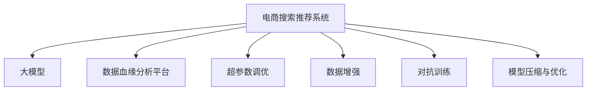

                 

# AI大模型重构电商搜索推荐的数据血缘分析平台功能优化方案

## 1. 背景介绍

### 1.1 问题由来
在电商领域，搜索和推荐系统是用户获取商品信息和推荐商品的重要手段。随着电商行业竞争的加剧，对搜索推荐系统的精确度和个性化水平提出了更高的要求。传统基于规则或统计特征的搜索推荐方法，由于数据不足和规则复杂性，难以满足当前用户的需求。

近年来，大模型在自然语言处理(NLP)、计算机视觉(CV)等领域的成功应用，激发了研究者尝试使用AI大模型改进电商搜索推荐系统。大模型基于大规模数据预训练，具备强大的语言理解、图像分析等能力，能够处理海量用户数据，生成高质量推荐结果。

然而，电商搜索推荐系统涉及数据复杂性高、实时性要求高、可解释性需求高等特性，传统的大模型微调方法在电商场景中难以取得最优效果。因此，如何结合电商场景特点，高效利用大模型的能力，构建基于AI大模型的电商搜索推荐系统，成为了电商领域的一大挑战。

### 1.2 问题核心关键点
为了构建基于AI大模型的电商搜索推荐系统，我们需要解决以下几个关键问题：

1. **数据高效获取与处理**：电商领域用户数据量庞大且复杂，如何高效获取并处理数据，是提高搜索推荐系统效率的基础。
2. **模型训练与优化**：电商数据分布多变且需求实时性高，如何在有限时间内训练出高性能模型，并进行高效优化。
3. **结果解释与监控**：电商用户对推荐结果的可解释性有较高需求，如何构建系统解释机制，实时监控推荐效果，提升用户体验。
4. **系统可扩展与维护**：电商系统用户量级大、交互频繁，系统需要具备高可扩展性和高维护性。

本文将从数据获取与处理、模型训练与优化、结果解释与监控、系统可扩展与维护等方面，系统介绍大模型在电商搜索推荐系统的应用，并提出相应的优化方案。

## 2. 核心概念与联系

### 2.1 核心概念概述

为更好地理解大模型在电商搜索推荐系统中的应用，本节将介绍几个密切相关的核心概念：

- **大模型**：基于大规模数据预训练的人工智能模型，具备强大的自然语言处理、图像分析等能力，能够生成高质量推荐结果。
- **电商搜索推荐系统**：利用人工智能技术，根据用户历史行为、浏览记录、搜索记录等数据，为用户提供个性化推荐和搜索结果的电商应用系统。
- **数据血缘分析平台**：用于记录和分析数据来源、处理过程、存储位置等信息，帮助用户理解数据流向和使用情况的数据分析平台。
- **超参数调优**：在模型训练过程中，调整学习率、批大小、迭代次数等参数，以优化模型性能的过程。
- **数据增强**：通过数据扩充、回译等方式，增加训练集的多样性和复杂度，提升模型泛化能力。
- **对抗训练**：在训练过程中引入对抗样本，提高模型的鲁棒性和泛化能力。
- **模型压缩与优化**：通过剪枝、量化、低秩分解等方式，减少模型参数和计算量，提升推理速度和效率。

这些核心概念之间的逻辑关系可以通过以下Mermaid流程图来展示：



这个流程图展示了大模型在电商搜索推荐系统中的应用框架：

1. 电商搜索推荐系统将用户数据输入大模型进行预训练和微调。
2. 数据血缘分析平台用于记录和分析数据来源、处理过程、存储位置等信息，帮助理解数据流向和使用情况。
3. 超参数调优、数据增强、对抗训练、模型压缩与优化等技术，用于提升模型的性能和效率。

这些概念共同构成了大模型在电商搜索推荐系统中的应用范式，使其能够在电商场景中发挥强大的能力。通过理解这些核心概念，我们可以更好地把握大模型在电商搜索推荐系统中的优化方向。

## 3. 核心算法原理 & 具体操作步骤
### 3.1 算法原理概述

基于大模型的电商搜索推荐系统，本质上是一个有监督的机器学习过程。其核心思想是：将大模型作为强大的"特征提取器"，通过电商用户数据的监督训练，优化模型在电商推荐任务上的性能。

形式化地，假设电商推荐任务的数据集为 $D=\{(x_i,y_i)\}_{i=1}^N$，其中 $x_i$ 为电商用户行为数据，$y_i$ 为对应的推荐结果。模型的目标是最小化损失函数 $\mathcal{L}$，使得模型输出逼近真实标签。

具体而言，假设预训练模型为 $M_{\theta}$，其中 $\theta$ 为模型参数。则电商推荐任务的目标为：

$$
\hat{\theta}=\mathop{\arg\min}_{\theta} \mathcal{L}(M_{\theta},D)
$$

其中 $\mathcal{L}$ 为电商推荐任务的损失函数，常用的损失函数包括交叉熵损失、均方误差损失等。

通过梯度下降等优化算法，微调过程不断更新模型参数 $\theta$，最小化损失函数 $\mathcal{L}$，使得模型输出逼近真实标签。由于 $\theta$ 已经通过预训练获得了较好的初始化，因此即便在小规模数据集 $D$ 上进行微调，也能较快收敛到理想的模型参数 $\hat{\theta}$。

### 3.2 算法步骤详解

基于大模型的电商搜索推荐系统，一般包括以下几个关键步骤：

**Step 1: 数据获取与处理**

电商用户行为数据包括浏览记录、搜索记录、购买记录、评价记录等，数据量庞大且分布复杂。为高效处理这些数据，需要采用以下技术：

1. **数据清洗**：去除缺失值、异常值、重复值等，确保数据质量。
2. **数据去重**：去重用户行为数据，避免重复数据对模型的干扰。
3. **数据分片**：将数据划分为多个批次进行处理，提高处理效率。
4. **数据标注**：将电商用户行为数据标注为推荐结果，如点击率、转化率等。

**Step 2: 模型选择与训练**

选择合适的预训练大模型作为初始化参数，如BERT、GPT等。在电商推荐任务上，需要设计合适的输出层和损失函数。

1. **输出层设计**：根据电商推荐任务的特点，设计合适的输出层。对于点击率预测任务，通常使用线性分类器输出概率分布，并以交叉熵损失函数。
2. **模型微调**：将电商推荐数据输入预训练模型进行微调。选择合适的优化算法及其参数，如 AdamW、SGD 等，设置学习率、批大小、迭代轮数等。
3. **模型优化**：应用正则化技术，如L2正则、Dropout、Early Stopping等，防止模型过度适应小规模训练集。

**Step 3: 结果解释与监控**

电商用户对推荐结果的可解释性有较高需求，为满足这一需求，需要构建系统解释机制，实时监控推荐效果。

1. **特征重要性分析**：通过重要性评分，分析影响推荐结果的关键特征。
2. **用户行为分析**：通过用户行为分析，理解用户偏好和行为模式。
3. **推荐结果监控**：实时监控推荐结果的质量和效果，及时调整模型参数。

**Step 4: 系统可扩展与维护**

电商系统用户量级大、交互频繁，系统需要具备高可扩展性和高维护性。

1. **水平扩展**：采用分布式计算，提高系统的处理能力。
2. **垂直扩展**：使用高性能硬件，提升系统的计算能力。
3. **模块化设计**：采用模块化设计，提高系统的灵活性和可扩展性。
4. **自动化运维**：采用自动化运维工具，提高系统的稳定性和维护效率。

以上是基于大模型的电商搜索推荐系统的一般流程。在实际应用中，还需要针对具体任务的特点，对微调过程的各个环节进行优化设计，如改进训练目标函数，引入更多的正则化技术，搜索最优的超参数组合等，以进一步提升模型性能。

### 3.3 算法优缺点

基于大模型的电商搜索推荐系统具有以下优点：

1. **高性能**：利用大模型的强大能力，在少量标注数据下也能生成高质量推荐结果。
2. **泛化能力强**：大模型基于大规模数据预训练，具有较强的泛化能力，适用于不同电商场景和用户行为。
3. **实时性强**：大模型训练和推理速度快，能够实时响应用户查询，提升用户体验。

同时，该方法也存在一定的局限性：

1. **数据依赖大**：电商推荐系统对数据质量要求高，数据获取和处理复杂。
2. **训练成本高**：大模型训练和推理成本高，需要高性能硬件和算法优化。
3. **可解释性不足**：大模型"黑盒"特性，难以解释推荐结果的逻辑和原因。
4. **系统复杂性高**：电商搜索推荐系统涉及多模块协同，系统设计复杂。

尽管存在这些局限性，但就目前而言，基于大模型的电商推荐方法仍是电商领域的重要技术手段。未来相关研究的重点在于如何进一步降低数据依赖，提高系统的可解释性和维护性，同时兼顾性能和实时性。

### 3.4 算法应用领域

基于大模型的电商搜索推荐系统，在电商领域已经得到了广泛的应用，覆盖了从商品推荐到智能客服等多个场景：

1. **商品推荐**：根据用户浏览记录和搜索历史，推荐相关商品。通过微调大模型，生成高质量推荐结果，提高用户满意度。
2. **个性化定制**：根据用户行为数据，生成个性化商品推荐。通过超参数调优，生成满足用户需求的推荐结果。
3. **智能客服**：通过微调大模型，构建智能客服系统。智能客服能够理解用户查询，提供个性化建议，提升用户体验。
4. **内容生成**：根据用户浏览记录，生成相关内容推荐。通过数据增强和对抗训练，生成多样化的推荐内容。
5. **广告投放**：根据用户行为数据，生成广告推荐。通过模型压缩与优化，提升广告投放效率。

除了上述这些经典场景外，大模型在电商领域的应用还在不断创新。随着预训练模型和微调方法的持续演进，相信大模型在电商搜索推荐系统中将发挥更加重要的作用。

## 4. 数学模型和公式 & 详细讲解 & 举例说明

### 4.1 数学模型构建

本节将使用数学语言对基于大模型的电商搜索推荐系统进行更加严格的刻画。

记电商推荐任务的数据集为 $D=\{(x_i,y_i)\}_{i=1}^N$，其中 $x_i$ 为电商用户行为数据，$y_i$ 为对应的推荐结果。定义模型 $M_{\theta}$ 在输入 $x$ 上的输出为 $\hat{y}=M_{\theta}(x)$，表示模型预测结果。则电商推荐任务的损失函数为：

$$
\mathcal{L}(\theta) = -\frac{1}{N}\sum_{i=1}^N \ell(M_{\theta}(x_i),y_i)
$$

其中 $\ell$ 为损失函数，常用的损失函数包括交叉熵损失、均方误差损失等。

### 4.2 公式推导过程

以电商点击率预测任务为例，推导交叉熵损失函数及其梯度的计算公式。

假设模型 $M_{\theta}$ 在输入 $x$ 上的输出为 $\hat{y}=M_{\theta}(x) \in [0,1]$，表示用户点击的概率。真实标签 $y \in \{0,1\}$。则二分类交叉熵损失函数定义为：

$$
\ell(M_{\theta}(x),y) = -[y\log \hat{y} + (1-y)\log (1-\hat{y})]
$$

将其代入经验风险公式，得：

$$
\mathcal{L}(\theta) = -\frac{1}{N}\sum_{i=1}^N [y_i\log M_{\theta}(x_i)+(1-y_i)\log(1-M_{\theta}(x_i))]
$$

根据链式法则，损失函数对参数 $\theta_k$ 的梯度为：

$$
\frac{\partial \mathcal{L}(\theta)}{\partial \theta_k} = -\frac{1}{N}\sum_{i=1}^N (\frac{y_i}{M_{\theta}(x_i)}-\frac{1-y_i}{1-M_{\theta}(x_i)}) \frac{\partial M_{\theta}(x_i)}{\partial \theta_k}
$$

其中 $\frac{\partial M_{\theta}(x_i)}{\partial \theta_k}$ 可进一步递归展开，利用自动微分技术完成计算。

在得到损失函数的梯度后，即可带入参数更新公式，完成模型的迭代优化。重复上述过程直至收敛，最终得到适应电商推荐任务的最优模型参数 $\theta^*$。

## 5. 项目实践：代码实例和详细解释说明
### 5.1 开发环境搭建

在进行电商搜索推荐系统的大模型微调实践前，我们需要准备好开发环境。以下是使用Python进行PyTorch开发的环境配置流程：

1. 安装Anaconda：从官网下载并安装Anaconda，用于创建独立的Python环境。

2. 创建并激活虚拟环境：
```bash
conda create -n pytorch-env python=3.8 
conda activate pytorch-env
```

3. 安装PyTorch：根据CUDA版本，从官网获取对应的安装命令。例如：
```bash
conda install pytorch torchvision torchaudio cudatoolkit=11.1 -c pytorch -c conda-forge
```

4. 安装Transformers库：
```bash
pip install transformers
```

5. 安装各类工具包：
```bash
pip install numpy pandas scikit-learn matplotlib tqdm jupyter notebook ipython
```

完成上述步骤后，即可在`pytorch-env`环境中开始微调实践。

### 5.2 源代码详细实现

这里我们以电商商品推荐系统为例，给出使用Transformers库对BERT模型进行微调的PyTorch代码实现。

首先，定义商品推荐任务的数据处理函数：

```python
from transformers import BertTokenizer
from torch.utils.data import Dataset
import torch

class ShoppingDataset(Dataset):
    def __init__(self, items, labels, tokenizer, max_len=128):
        self.items = items
        self.labels = labels
        self.tokenizer = tokenizer
        self.max_len = max_len
        
    def __len__(self):
        return len(self.items)
    
    def __getitem__(self, item):
        item = self.items[item]
        label = self.labels[item]
        
        encoding = self.tokenizer(item, return_tensors='pt', max_length=self.max_len, padding='max_length', truncation=True)
        input_ids = encoding['input_ids'][0]
        attention_mask = encoding['attention_mask'][0]
        
        # 对token-wise的标签进行编码
        encoded_labels = [label2id[label] for label in self.labels] 
        encoded_labels.extend([label2id['O']] * (self.max_len - len(encoded_labels)))
        labels = torch.tensor(encoded_labels, dtype=torch.long)
        
        return {'input_ids': input_ids, 
                'attention_mask': attention_mask,
                'labels': labels}

# 标签与id的映射
label2id = {'O': 0, 'buy': 1}
id2label = {v: k for k, v in label2id.items()}

# 创建dataset
tokenizer = BertTokenizer.from_pretrained('bert-base-cased')

train_dataset = ShoppingDataset(train_items, train_labels, tokenizer)
dev_dataset = ShoppingDataset(dev_items, dev_labels, tokenizer)
test_dataset = ShoppingDataset(test_items, test_labels, tokenizer)
```

然后，定义模型和优化器：

```python
from transformers import BertForTokenClassification, AdamW

model = BertForTokenClassification.from_pretrained('bert-base-cased', num_labels=len(label2id))

optimizer = AdamW(model.parameters(), lr=2e-5)
```

接着，定义训练和评估函数：

```python
from torch.utils.data import DataLoader
from tqdm import tqdm
from sklearn.metrics import classification_report

device = torch.device('cuda') if torch.cuda.is_available() else torch.device('cpu')
model.to(device)

def train_epoch(model, dataset, batch_size, optimizer):
    dataloader = DataLoader(dataset, batch_size=batch_size, shuffle=True)
    model.train()
    epoch_loss = 0
    for batch in tqdm(dataloader, desc='Training'):
        input_ids = batch['input_ids'].to(device)
        attention_mask = batch['attention_mask'].to(device)
        labels = batch['labels'].to(device)
        model.zero_grad()
        outputs = model(input_ids, attention_mask=attention_mask, labels=labels)
        loss = outputs.loss
        epoch_loss += loss.item()
        loss.backward()
        optimizer.step()
    return epoch_loss / len(dataloader)

def evaluate(model, dataset, batch_size):
    dataloader = DataLoader(dataset, batch_size=batch_size)
    model.eval()
    preds, labels = [], []
    with torch.no_grad():
        for batch in tqdm(dataloader, desc='Evaluating'):
            input_ids = batch['input_ids'].to(device)
            attention_mask = batch['attention_mask'].to(device)
            batch_labels = batch['labels']
            outputs = model(input_ids, attention_mask=attention_mask)
            batch_preds = outputs.logits.argmax(dim=2).to('cpu').tolist()
            batch_labels = batch_labels.to('cpu').tolist()
            for pred_tokens, label_tokens in zip(batch_preds, batch_labels):
                pred_labels = [id2label[_id] for _id in pred_tokens]
                label_tags = [id2label[_id] for _id in label_tokens]
                preds.append(pred_labels[:len(label_tags)])
                labels.append(label_tags)
                
    print(classification_report(labels, preds))
```

最后，启动训练流程并在测试集上评估：

```python
epochs = 5
batch_size = 16

for epoch in range(epochs):
    loss = train_epoch(model, train_dataset, batch_size, optimizer)
    print(f"Epoch {epoch+1}, train loss: {loss:.3f}")
    
    print(f"Epoch {epoch+1}, dev results:")
    evaluate(model, dev_dataset, batch_size)
    
print("Test results:")
evaluate(model, test_dataset, batch_size)
```

以上就是使用PyTorch对BERT进行电商商品推荐系统微调的完整代码实现。可以看到，得益于Transformers库的强大封装，我们可以用相对简洁的代码完成BERT模型的加载和微调。

### 5.3 代码解读与分析

让我们再详细解读一下关键代码的实现细节：

**ShoppingDataset类**：
- `__init__`方法：初始化商品、标签、分词器等关键组件。
- `__len__`方法：返回数据集的样本数量。
- `__getitem__`方法：对单个样本进行处理，将商品输入编码为token ids，将标签编码为数字，并对其进行定长padding，最终返回模型所需的输入。

**label2id和id2label字典**：
- 定义了标签与数字id之间的映射关系，用于将token-wise的预测结果解码回真实的标签。

**训练和评估函数**：
- 使用PyTorch的DataLoader对数据集进行批次化加载，供模型训练和推理使用。
- 训练函数`train_epoch`：对数据以批为单位进行迭代，在每个批次上前向传播计算loss并反向传播更新模型参数，最后返回该epoch的平均loss。
- 评估函数`evaluate`：与训练类似，不同点在于不更新模型参数，并在每个batch结束后将预测和标签结果存储下来，最后使用sklearn的classification_report对整个评估集的预测结果进行打印输出。

**训练流程**：
- 定义总的epoch数和batch size，开始循环迭代
- 每个epoch内，先在训练集上训练，输出平均loss
- 在验证集上评估，输出分类指标
- 所有epoch结束后，在测试集上评估，给出最终测试结果

可以看到，PyTorch配合Transformers库使得BERT微调的代码实现变得简洁高效。开发者可以将更多精力放在数据处理、模型改进等高层逻辑上，而不必过多关注底层的实现细节。

当然，工业级的系统实现还需考虑更多因素，如模型的保存和部署、超参数的自动搜索、更灵活的任务适配层等。但核心的微调范式基本与此类似。

## 6. 实际应用场景
### 6.1 智能客服系统

基于大语言模型微调的对话技术，可以广泛应用于智能客服系统的构建。传统客服往往需要配备大量人力，高峰期响应缓慢，且一致性和专业性难以保证。而使用微调后的对话模型，可以7x24小时不间断服务，快速响应客户咨询，用自然流畅的语言解答各类常见问题。

在技术实现上，可以收集企业内部的历史客服对话记录，将问题和最佳答复构建成监督数据，在此基础上对预训练对话模型进行微调。微调后的对话模型能够自动理解用户意图，匹配最合适的答案模板进行回复。对于客户提出的新问题，还可以接入检索系统实时搜索相关内容，动态组织生成回答。如此构建的智能客服系统，能大幅提升客户咨询体验和问题解决效率。

### 6.2 金融舆情监测

金融机构需要实时监测市场舆论动向，以便及时应对负面信息传播，规避金融风险。传统的人工监测方式成本高、效率低，难以应对网络时代海量信息爆发的挑战。基于大语言模型微调的文本分类和情感分析技术，为金融舆情监测提供了新的解决方案。

具体而言，可以收集金融领域相关的新闻、报道、评论等文本数据，并对其进行主题标注和情感标注。在此基础上对预训练语言模型进行微调，使其能够自动判断文本属于何种主题，情感倾向是正面、中性还是负面。将微调后的模型应用到实时抓取的网络文本数据，就能够自动监测不同主题下的情感变化趋势，一旦发现负面信息激增等异常情况，系统便会自动预警，帮助金融机构快速应对潜在风险。

### 6.3 个性化推荐系统

当前的推荐系统往往只依赖用户的历史行为数据进行物品推荐，无法深入理解用户的真实兴趣偏好。基于大语言模型微调技术，个性化推荐系统可以更好地挖掘用户行为背后的语义信息，从而提供更精准、多样的推荐内容。

在实践中，可以收集用户浏览、点击、评论、分享等行为数据，提取和用户交互的物品标题、描述、标签等文本内容。将文本内容作为模型输入，用户的后续行为（如是否点击、购买等）作为监督信号，在此基础上微调预训练语言模型。微调后的模型能够从文本内容中准确把握用户的兴趣点。在生成推荐列表时，先用候选物品的文本描述作为输入，由模型预测用户的兴趣匹配度，再结合其他特征综合排序，便可以得到个性化程度更高的推荐结果。

### 6.4 未来应用展望

随着大语言模型和微调方法的不断发展，基于微调范式将在更多领域得到应用，为传统行业带来变革性影响。

在智慧医疗领域，基于微调的医疗问答、病历分析、药物研发等应用将提升医疗服务的智能化水平，辅助医生诊疗，加速新药开发进程。

在智能教育领域，微调技术可应用于作业批改、学情分析、知识推荐等方面，因材施教，促进教育公平，提高教学质量。

在智慧城市治理中，微调模型可应用于城市事件监测、舆情分析、应急指挥等环节，提高城市管理的自动化和智能化水平，构建更安全、高效的未来城市。

此外，在企业生产、社会治理、文娱传媒等众多领域，基于大模型微调的人工智能应用也将不断涌现，为经济社会发展注入新的动力。相信随着技术的日益成熟，微调方法将成为人工智能落地应用的重要范式，推动人工智能技术在垂直行业的规模化落地。总之，微调需要开发者根据具体任务，不断迭代和优化模型、数据和算法，方能得到理想的效果。

## 7. 工具和资源推荐
### 7.1 学习资源推荐

为了帮助开发者系统掌握大语言模型微调的理论基础和实践技巧，这里推荐一些优质的学习资源：

1. 《Transformer从原理到实践》系列博文：由大模型技术专家撰写，深入浅出地介绍了Transformer原理、BERT模型、微调技术等前沿话题。

2. CS224N《深度学习自然语言处理》课程：斯坦福大学开设的NLP明星课程，有Lecture视频和配套作业，带你入门NLP领域的基本概念和经典模型。

3. 《Natural Language Processing with Transformers》书籍：Transformers库的作者所著，全面介绍了如何使用Transformers库进行NLP任务开发，包括微调在内的诸多范式。

4. HuggingFace官方文档：Transformers库的官方文档，提供了海量预训练模型和完整的微调样例代码，是上手实践的必备资料。

5. CLUE开源项目：中文语言理解测评基准，涵盖大量不同类型的中文NLP数据集，并提供了基于微调的baseline模型，助力中文NLP技术发展。

通过对这些资源的学习实践，相信你一定能够快速掌握大语言模型微调的精髓，并用于解决实际的NLP问题。
###  7.2 开发工具推荐

高效的开发离不开优秀的工具支持。以下是几款用于大语言模型微调开发的常用工具：

1. PyTorch：基于Python的开源深度学习框架，灵活动态的计算图，适合快速迭代研究。大部分预训练语言模型都有PyTorch版本的实现。

2. TensorFlow：由Google主导开发的开源深度学习框架，生产部署方便，适合大规模工程应用。同样有丰富的预训练语言模型资源。

3. Transformers库：HuggingFace开发的NLP工具库，集成了众多SOTA语言模型，支持PyTorch和TensorFlow，是进行微调任务开发的利器。

4. Weights & Biases：模型训练的实验跟踪工具，可以记录和可视化模型训练过程中的各项指标，方便对比和调优。与主流深度学习框架无缝集成。

5. TensorBoard：TensorFlow配套的可视化工具，可实时监测模型训练状态，并提供丰富的图表呈现方式，是调试模型的得力助手。

6. Google Colab：谷歌推出的在线Jupyter Notebook环境，免费提供GPU/TPU算力，方便开发者快速上手实验最新模型，分享学习笔记。

合理利用这些工具，可以显著提升大语言模型微调任务的开发效率，加快创新迭代的步伐。

### 7.3 相关论文推荐

大语言模型和微调技术的发展源于学界的持续研究。以下是几篇奠基性的相关论文，推荐阅读：

1. Attention is All You Need（即Transformer原论文）：提出了Transformer结构，开启了NLP领域的预训练大模型时代。

2. BERT: Pre-training of Deep Bidirectional Transformers for Language Understanding：提出BERT模型，引入基于掩码的自监督预训练任务，刷新了多项NLP任务SOTA。

3. Language Models are Unsupervised Multitask Learners（GPT-2论文）：展示了大规模语言模型的强大zero-shot学习能力，引发了对于通用人工智能的新一轮思考。

4. Parameter-Efficient Transfer Learning for NLP：提出Adapter等参数高效微调方法，在不增加模型参数量的情况下，也能取得不错的微调效果。

5. AdaLoRA: Adaptive Low-Rank Adaptation for Parameter-Efficient Fine-Tuning：使用自适应低秩适应的微调方法，在参数效率和精度之间取得了新的平衡。

这些论文代表了大语言模型微调技术的发展脉络。通过学习这些前沿成果，可以帮助研究者把握学科前进方向，激发更多的创新灵感。

## 8. 总结：未来发展趋势与挑战

### 8.1 总结

本文对基于大模型的电商搜索推荐系统进行了全面系统的介绍。首先阐述了大模型和微调技术的研究背景和意义，明确了微调在电商搜索推荐系统中的应用价值。其次，从原理到实践，详细讲解了电商搜索推荐系统的数学原理和关键步骤，给出了电商推荐任务开发的完整代码实例。同时，本文还广泛探讨了微调方法在智能客服、金融舆情、个性化推荐等多个行业领域的应用前景，展示了微调范式的巨大潜力。此外，本文精选了微调技术的各类学习资源，力求为读者提供全方位的技术指引。

通过本文的系统梳理，可以看到，基于大模型的电商搜索推荐系统正在成为电商领域的重要技术手段，极大地拓展了电商搜索推荐系统的性能和应用范围，催生了更多的落地场景。受益于大规模语料的预训练，微调模型在电商推荐任务中取得不俗的效果，显著提高了用户满意度。未来，伴随预训练语言模型和微调方法的持续演进，相信大模型在电商搜索推荐系统中将发挥更加重要的作用。

### 8.2 未来发展趋势

展望未来，大语言模型微调技术将呈现以下几个发展趋势：

1. **数据效率提升**：随着自动化标注工具和数据增强技术的进步，微调对标注数据的依赖将进一步降低。大模型将能够在更少标注样本下取得理想效果。

2. **模型优化加速**：超参数调优、模型压缩与优化等技术将进一步提升微调模型的性能和效率，缩短训练时间。

3. **系统可解释性增强**：基于解释性生成模型和对抗样本分析，将提高微调模型的可解释性，帮助用户理解推荐结果的依据。

4. **多模态融合**：多模态融合技术将结合文本、图像、语音等多种信息，提升电商搜索推荐系统的表现。

5. **个性化推荐深化**：基于用户行为数据和知识图谱的深度融合，将生成更加个性化和精准的推荐结果。

6. **实时性提升**：分布式计算和流计算技术的应用，将提高电商搜索推荐系统的实时性，满足用户的即时需求。

7. **用户体验优化**：智能客服、个性化推荐等技术的应用，将提升电商用户的购物体验，增强用户粘性。

以上趋势凸显了大语言模型微调技术的广阔前景。这些方向的探索发展，必将进一步提升电商搜索推荐系统的性能和用户体验，推动电商行业数字化转型的进程。

### 8.3 面临的挑战

尽管大语言模型微调技术已经取得了瞩目成就，但在迈向更加智能化、普适化应用的过程中，它仍面临着诸多挑战：

1. **数据质量要求高**：电商推荐系统对数据质量要求高，数据获取和处理复杂。
2. **训练成本高**：大模型训练和推理成本高，需要高性能硬件和算法优化。
3. **可解释性不足**：大模型"黑盒"特性，难以解释推荐结果的逻辑和原因。
4. **系统复杂性高**：电商搜索推荐系统涉及多模块协同，系统设计复杂。

尽管存在这些挑战，但就目前而言，基于大模型的电商推荐方法仍是电商领域的重要技术手段。未来相关研究的重点在于如何进一步降低数据依赖，提高系统的可解释性和维护性，同时兼顾性能和实时性。

### 8.4 研究展望

面对大语言模型微调所面临的挑战，未来的研究需要在以下几个方面寻求新的突破：

1. **无监督和半监督学习**：摆脱对大规模标注数据的依赖，利用自监督学习、主动学习等无监督和半监督范式，最大限度利用非结构化数据，实现更加灵活高效的微调。

2. **参数高效和计算高效**：开发更加参数高效的微调方法，在固定大部分预训练参数的同时，只更新极少量的任务相关参数。同时优化微调模型的计算图，减少前向传播和反向传播的资源消耗，实现更加轻量级、实时性的部署。

3. **因果学习和对抗学习**：通过引入因果推断和对抗学习思想，增强微调模型建立稳定因果关系的能力，学习更加普适、鲁棒的语言表征，从而提升模型泛化性和抗干扰能力。

4. **知识图谱与深度融合**：将符号化的先验知识，如知识图谱、逻辑规则等，与神经网络模型进行巧妙融合，引导微调过程学习更准确、合理的语言模型。同时加强不同模态数据的整合，实现视觉、语音等多模态信息与文本信息的协同建模。

5. **解释性生成模型**：结合因果分析方法和对抗样本分析，提高微调模型的可解释性，帮助用户理解推荐结果的依据。

6. **分布式计算与流计算**：结合分布式计算和流计算技术，提高电商搜索推荐系统的实时性，满足用户的即时需求。

7. **智能客服与个性化推荐**：通过微调大模型，构建智能客服系统和个性化推荐系统，提升电商用户的购物体验，增强用户粘性。

这些研究方向的探索，必将引领大语言模型微调技术迈向更高的台阶，为构建安全、可靠、可解释、可控的智能系统铺平道路。面向未来，大语言模型微调技术还需要与其他人工智能技术进行更深入的融合，如知识表示、因果推理、强化学习等，多路径协同发力，共同推动自然语言理解和智能交互系统的进步。只有勇于创新、敢于突破，才能不断拓展语言模型的边界，让智能技术更好地造福人类社会。

## 9. 附录：常见问题与解答

**Q1：大模型微调是否适用于所有NLP任务？**

A: 大模型微调在大多数NLP任务上都能取得不错的效果，特别是对于数据量较小的任务。但对于一些特定领域的任务，如医学、法律等，仅仅依靠通用语料预训练的模型可能难以很好地适应。此时需要在特定领域语料上进一步预训练，再进行微调，才能获得理想效果。此外，对于一些需要时效性、个性化很强的任务，如对话、推荐等，微调方法也需要针对性的改进优化。

**Q2：微调过程中如何选择合适的学习率？**

A: 微调的学习率一般要比预训练时小1-2个数量级，如果使用过大的学习率，容易破坏预训练权重，导致过拟合。一般建议从1e-5开始调参，逐步减小学习率，直至收敛。也可以使用warmup策略，在开始阶段使用较小的学习率，再逐渐过渡到预设值。需要注意的是，不同的优化器(如AdamW、Adafactor等)以及不同的学习率调度策略，可能需要设置不同的学习率阈值。

**Q3：采用大模型微调时会面临哪些资源瓶颈？**

A: 目前主流的预训练大模型动辄以亿计的参数规模，对算力、内存、存储都提出了很高的要求。GPU/TPU等高性能设备是必不可少的，但即便如此，超大批次的训练和推理也可能遇到显存不足的问题。因此需要采用一些资源优化技术，如梯度积累、混合精度训练、模型并行等，来突破硬件瓶颈。同时，模型的存储和读取也可能占用大量时间和空间，需要采用模型压缩、稀疏化存储等方法进行优化。

**Q4：如何缓解微调过程中的过拟合问题？**

A: 过拟合是微调面临的主要挑战，尤其是在标注数据不足的情况下。常见的缓解策略包括：
1. 数据增强：通过数据扩充、回译等方式扩充训练集
2. 正则化：使用L2正则、Dropout、Early Stopping等避免过拟合
3. 对抗训练：引入对抗样本，提高模型的鲁棒性和泛化能力
4. 参数高效微调：只调整少量参数(如Adapter、Prefix等)，减小过拟合风险
5. 多模型集成：训练多个微调模型，取平均输出，抑制过拟合

这些策略往往需要根据具体任务和数据特点进行灵活组合。只有在数据、模型、训练、推理等各环节进行全面优化，才能最大限度地发挥大模型微调的威力。

**Q5：微调模型在落地部署时需要注意哪些问题？**

A: 将微调模型转化为实际应用，还需要考虑以下因素：
1. 模型裁剪：去除不必要的层和参数，减小模型尺寸，加快推理速度
2. 量化加速：将浮点模型转为定点模型，压缩存储空间，提高计算效率
3. 服务化封装：将模型封装为标准化服务接口，便于集成调用
4. 弹性伸缩：根据请求流量动态调整资源配置，平衡服务质量和成本
5. 监控告警：实时采集系统指标，设置异常告警阈值，确保服务稳定性
6. 安全防护：采用访问鉴权、数据脱敏等措施，保障数据和模型安全

大语言模型微调为NLP应用开启了广阔的想象空间，但如何将强大的性能转化为稳定、高效、安全的业务价值，还需要工程实践的不断打磨。唯有从数据、算法、工程、业务等多个维度协同发力，才能真正实现人工智能技术在垂直行业的规模化落地。总之，微调需要开发者根据具体任务，不断迭代和优化模型、数据和算法，方能得到理想的效果。

---

作者：禅与计算机程序设计艺术 / Zen and the Art of Computer Programming

