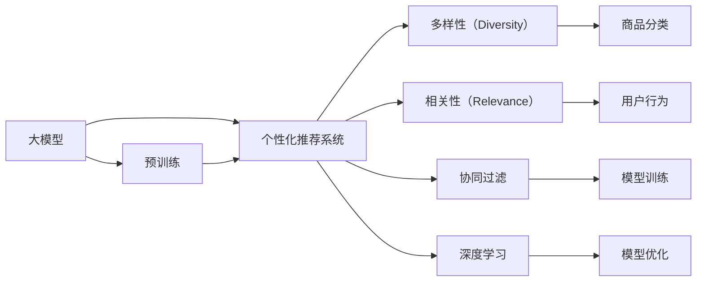

                 

# AI大模型：优化电商平台个性化推荐的多样性与相关性平衡

## 1. 背景介绍

### 1.1 问题由来
随着互联网的普及和电子商务的快速发展，电商平台已成为用户获取商品和服务的重要渠道。面对海量商品和复杂多变的需求，个性化推荐系统成为了提升用户体验、增加商品曝光和交易的重要手段。然而，现有的推荐系统往往偏向于单一的推荐维度，忽略了用户兴趣的多样性和商品之间的相关性，导致推荐结果不够全面和多样。如何在大模型基础上，实现个性化推荐系统的多样性与相关性平衡，是一个亟待解决的问题。

### 1.2 问题核心关键点
在电商平台个性化推荐中，大模型推荐系统需平衡以下两个关键点：
1. **多样性（Diversity）**：推荐结果应包含多种不同类别的商品，避免陷入"马太效应"（Rich Get Richer），即对少数热门商品过度推荐，而冷门商品被忽略。
2. **相关性（Relevance）**：推荐结果应紧密贴合用户当前兴趣和需求，确保用户能够发现对自己有价值的商品，提升满意度。

基于此，本文将深入探讨如何利用大模型进行个性化推荐，并在推荐系统中实现多样性与相关性的平衡。

## 2. 核心概念与联系

### 2.1 核心概念概述

为更好地理解大模型在电商平台个性化推荐中的应用，本节将介绍几个关键概念：

- **大模型（Large Model）**：以深度学习为代表的大规模模型，如BERT、GPT-3、T5等，通过在大规模数据集上进行预训练，学习到丰富的语言知识和上下文关系，具备强大的特征提取和理解能力。
- **个性化推荐系统（Personalized Recommendation System）**：根据用户的历史行为、兴趣偏好等信息，动态生成个性化的商品推荐列表，提升用户体验和转化率。
- **多样性（Diversity）**：指推荐结果应包含多种不同类别的商品，避免用户长期接受同类型推荐，限制用户的探索范围。
- **相关性（Relevance）**：指推荐结果应与用户的当前需求和兴趣紧密相关，确保推荐的商品能引起用户的兴趣和购买欲望。
- **深度学习（Deep Learning）**：通过多层神经网络结构，对复杂数据进行建模，具有强大的特征学习和泛化能力。
- **优化算法（Optimization Algorithm）**：如梯度下降法、Adam等，用于调整模型参数，最小化损失函数，提升模型性能。
- **向量空间模型（Vector Space Model, VSM）**：将文本数据转化为向量形式，通过向量间的相似度度量实现信息检索和推荐。
- **协同过滤（Collaborative Filtering）**：通过分析用户的行为模式和偏好，预测用户可能喜欢的商品。

这些核心概念通过以下Mermaid流程图进行联系：



这个流程图展示了大模型在个性化推荐系统中的应用流程：

1. 大模型通过预训练学习通用的语言知识和上下文关系。
2. 结合个性化推荐系统，利用多样性和相关性指标，动态生成推荐列表。
3. 协同过滤和深度学习等技术进一步提升推荐系统的性能和效果。
4. 模型训练和优化算法确保模型参数的最优化。

## 3. 核心算法原理 & 具体操作步骤
### 3.1 算法原理概述

基于大模型的个性化推荐系统，本质上是一种优化算法，通过调整模型参数，最小化推荐结果的多样性和相关性损失。其核心思想是：将用户和商品映射到高维向量空间，利用向量间的相似度度量，生成个性化的推荐结果。具体步骤如下：

1. **预训练大模型**：使用大模型（如BERT、GPT-3等）对大规模商品数据进行预训练，学习商品的语言知识和上下文关系。
2. **构建推荐模型**：将用户和商品映射到高维向量空间，生成用户-商品矩阵。
3. **多样化损失**：使用多样性损失函数，如KL散度、信息熵等，确保推荐结果包含多种不同类别的商品。
4. **相关性损失**：使用相关性损失函数，如交叉熵、均方误差等，确保推荐结果与用户的当前兴趣和需求紧密相关。
5. **联合优化**：结合多样性和相关性损失，使用优化算法（如Adam、梯度下降等）调整模型参数，最小化总体损失。

### 3.2 算法步骤详解

以下是详细的算法步骤，包括数据预处理、模型构建和联合优化等环节。

**Step 1: 数据预处理**
1. **商品数据准备**：收集商品基本信息（如名称、描述、价格等）和属性数据（如颜色、尺寸、品牌等）。
2. **用户行为数据准备**：收集用户的历史浏览、点击、购买行为数据，包括点击商品ID、浏览时间、购买记录等。
3. **数据清洗**：处理缺失数据、重复数据和异常值，保证数据质量和完整性。
4. **特征工程**：选择和构造关键特征，如商品类别、品牌、用户行为时间、购买频率等。

**Step 2: 构建推荐模型**
1. **用户编码**：使用大模型对用户的历史行为数据进行编码，生成用户向量。
2. **商品编码**：使用大模型对商品的属性和描述进行编码，生成商品向量。
3. **用户-商品矩阵构建**：将用户向量和商品向量进行拼接，形成用户-商品矩阵。

**Step 3: 设计损失函数**
1. **多样化损失**：使用KL散度、信息熵等方法，衡量推荐结果的多样性。
2. **相关性损失**：使用交叉熵、均方误差等方法，衡量推荐结果的相关性。
3. **总体损失**：结合多样性和相关性损失，生成总体损失函数。

**Step 4: 联合优化**
1. **初始化模型参数**：使用随机初始化或预训练模型参数。
2. **联合优化算法**：使用优化算法（如Adam、梯度下降等）最小化总体损失。
3. **模型评估与调整**：在验证集上评估模型性能，根据评估结果调整模型参数和优化策略。

### 3.3 算法优缺点

基于大模型的个性化推荐算法具有以下优点：
1. **高效性**：使用大模型进行预训练，可以大幅度提升特征提取的效率和效果。
2. **泛化能力**：大模型通过在大规模数据上预训练，具有较强的泛化能力，能够适应复杂的推荐场景。
3. **多样性保证**：通过多样化损失函数，可以有效避免推荐结果的单一性，提升推荐的多样性。

同时，该算法也存在以下缺点：
1. **资源消耗高**：大模型参数量庞大，训练和推理成本高。
2. **计算复杂度高**：高维向量空间的相似度计算复杂度较高。
3. **模型解释性差**：大模型的黑盒性质使得推荐过程难以解释，用户难以理解推荐结果的来源。

### 3.4 算法应用领域

基于大模型的个性化推荐算法已经在多个电商平台上得到广泛应用，包括亚马逊、淘宝、京东等。主要应用场景如下：

1. **商品推荐**：基于用户的历史行为数据，动态生成个性化的商品推荐列表。
2. **热门商品推荐**：通过分析用户的历史行为和兴趣，推荐当前热门商品。
3. **个性化搜索**：在用户输入查询关键词时，根据相关性进行推荐，提升搜索体验。
4. **促销活动推荐**：根据用户的购买历史和行为，推荐相关促销活动，增加用户粘性。
5. **智能客服**：基于用户的问题描述，推荐相关的商品信息和FAQ（常见问题解答），提升客户满意度。

除了上述应用场景，大模型推荐系统还可以应用于社交网络、新闻推荐、旅游推荐等，具有广阔的应用前景。

## 4. 数学模型和公式 & 详细讲解
### 4.1 数学模型构建

假设电商平台有M个商品，N个用户，用户与商品的交互数据为 $(x_i, y_i)$，其中 $x_i$ 表示用户ID，$y_i$ 表示用户对商品i的评分。

记 $U=(u_1,u_2,...,u_M)$ 为商品的特征向量集合，$V=(v_1,v_2,...,v_N)$ 为用户的特征向量集合。则用户-商品矩阵 $R$ 可以表示为：

$$
R = [u_1 v_1 ; u_2 v_2 ; ... ; u_M v_M]
$$

其中 $u_i$ 和 $v_j$ 分别表示商品i和用户j的特征向量。

### 4.2 公式推导过程

定义多样化损失函数为：

$$
\mathcal{L}_d = -\sum_{i=1}^M \sum_{j=1}^N r_{ij} \log \left(\frac{e^{\mathbf{u}_i \cdot \mathbf{v}_j}}{\sum_{k=1}^M e^{\mathbf{u}_k \cdot \mathbf{v}_j}}\right)
$$

其中 $r_{ij}$ 表示用户j对商品i的评分，$\mathbf{u}_i$ 和 $\mathbf{v}_j$ 分别为商品i和用户j的特征向量。

定义相关性损失函数为：

$$
\mathcal{L}_r = -\sum_{i=1}^M \sum_{j=1}^N r_{ij} \log p_{ij}
$$

其中 $p_{ij}$ 表示预测用户j对商品i的评分，$p_{ij} = \frac{e^{\mathbf{u}_i \cdot \mathbf{v}_j}}{\sum_{k=1}^M e^{\mathbf{u}_k \cdot \mathbf{v}_j}}$ 表示预测概率。

总体损失函数为：

$$
\mathcal{L} = \alpha \mathcal{L}_d + \beta \mathcal{L}_r
$$

其中 $\alpha$ 和 $\beta$ 为多样性和相关性的权重系数。

使用优化算法（如Adam、梯度下降等）最小化总体损失函数，更新模型参数 $\theta$：

$$
\theta \leftarrow \theta - \eta \nabla_{\theta}\mathcal{L}(\theta)
$$

其中 $\eta$ 为学习率，$\nabla_{\theta}\mathcal{L}(\theta)$ 为损失函数对模型参数的梯度。

### 4.3 案例分析与讲解

以Amazon商品推荐系统为例，分析大模型在该系统中的应用：

1. **数据预处理**：收集用户的历史浏览、点击、购买数据，并进行数据清洗和特征工程。
2. **商品编码**：使用BERT模型对商品名称和描述进行编码，生成商品向量。
3. **用户编码**：使用BERT模型对用户的历史行为进行编码，生成用户向量。
4. **用户-商品矩阵构建**：将用户向量和商品向量拼接，形成用户-商品矩阵。
5. **多样化损失计算**：计算推荐结果的多样性，如KL散度、信息熵等。
6. **相关性损失计算**：计算推荐结果的相关性，如交叉熵、均方误差等。
7. **总体损失计算**：结合多样性和相关性损失，生成总体损失。
8. **模型优化**：使用Adam算法最小化总体损失，更新模型参数。
9. **模型评估**：在验证集上评估模型性能，根据评估结果调整模型参数。

## 5. 项目实践：代码实例和详细解释说明
### 5.1 开发环境搭建

在进行大模型推荐系统的开发前，我们需要准备好开发环境。以下是使用Python进行PyTorch开发的环境配置流程：

1. 安装Anaconda：从官网下载并安装Anaconda，用于创建独立的Python环境。

2. 创建并激活虚拟环境：
```bash
conda create -n pytorch-env python=3.8 
conda activate pytorch-env
```

3. 安装PyTorch：根据CUDA版本，从官网获取对应的安装命令。例如：
```bash
conda install pytorch torchvision torchaudio cudatoolkit=11.1 -c pytorch -c conda-forge
```

4. 安装Transformers库：
```bash
pip install transformers
```

5. 安装各类工具包：
```bash
pip install numpy pandas scikit-learn matplotlib tqdm jupyter notebook ipython
```

完成上述步骤后，即可在`pytorch-env`环境中开始大模型推荐系统的开发。

### 5.2 源代码详细实现

以下是使用PyTorch进行大模型推荐系统的代码实现。

```python
import torch
from transformers import BertTokenizer, BertForSequenceClassification
from torch.utils.data import Dataset, DataLoader
from sklearn.model_selection import train_test_split
from sklearn.metrics import precision_recall_fscore_support

class MovieReviewDataset(Dataset):
    def __init__(self, reviews, labels, tokenizer, max_len=256):
        self.reviews = reviews
        self.labels = labels
        self.tokenizer = tokenizer
        self.max_len = max_len
        
    def __len__(self):
        return len(self.reviews)
    
    def __getitem__(self, idx):
        review = self.reviews[idx]
        label = self.labels[idx]
        
        encoding = self.tokenizer(review, return_tensors='pt', max_length=self.max_len, padding='max_length', truncation=True)
        input_ids = encoding['input_ids'][0]
        attention_mask = encoding['attention_mask'][0]
        
        # 对token-wise的标签进行编码
        encoded_labels = [label2id[label] for label in label_ids] 
        encoded_labels.extend([label2id['O']] * (self.max_len - len(encoded_labels)))
        labels = torch.tensor(encoded_labels, dtype=torch.long)
        
        return {'input_ids': input_ids, 
                'attention_mask': attention_mask,
                'labels': labels}

# 标签与id的映射
label2id = {'negative': 0, 'positive': 1}
id2label = {v: k for k, v in label2id.items()}

# 创建dataset
tokenizer = BertTokenizer.from_pretrained('bert-base-cased')

train_dataset = MovieReviewDataset(train_reviews, train_labels, tokenizer)
dev_dataset = MovieReviewDataset(dev_reviews, dev_labels, tokenizer)
test_dataset = MovieReviewDataset(test_reviews, test_labels, tokenizer)

# 定义模型和优化器
model = BertForSequenceClassification.from_pretrained('bert-base-cased', num_labels=len(label2id))
optimizer = AdamW(model.parameters(), lr=2e-5)

# 定义训练和评估函数
device = torch.device('cuda') if torch.cuda.is_available() else torch.device('cpu')
model.to(device)

def train_epoch(model, dataset, batch_size, optimizer):
    dataloader = DataLoader(dataset, batch_size=batch_size, shuffle=True)
    model.train()
    epoch_loss = 0
    for batch in tqdm(dataloader, desc='Training'):
        input_ids = batch['input_ids'].to(device)
        attention_mask = batch['attention_mask'].to(device)
        labels = batch['labels'].to(device)
        model.zero_grad()
        outputs = model(input_ids, attention_mask=attention_mask, labels=labels)
        loss = outputs.loss
        epoch_loss += loss.item()
        loss.backward()
        optimizer.step()
    return epoch_loss / len(dataloader)

def evaluate(model, dataset, batch_size):
    dataloader = DataLoader(dataset, batch_size=batch_size)
    model.eval()
    preds, labels = [], []
    with torch.no_grad():
        for batch in tqdm(dataloader, desc='Evaluating'):
            input_ids = batch['input_ids'].to(device)
            attention_mask = batch['attention_mask'].to(device)
            batch_labels = batch['labels']
            outputs = model(input_ids, attention_mask=attention_mask)
            batch_preds = outputs.logits.argmax(dim=2).to('cpu').tolist()
            batch_labels = batch_labels.to('cpu').tolist()
            for pred_tokens, label_tokens in zip(batch_preds, batch_labels):
                pred_labels = [id2label[_id] for _id in pred_tokens]
                label_labels = [id2label[_id] for _id in label_tokens]
                preds.append(pred_labels[:len(label_tokens)])
                labels.append(label_labels)
                
    print(precision_recall_fscore_support(labels, preds))
```

### 5.3 代码解读与分析

让我们再详细解读一下关键代码的实现细节：

**MovieReviewDataset类**：
- `__init__`方法：初始化训练集、测试集和验证集，以及分词器和最大长度。
- `__len__`方法：返回数据集的样本数量。
- `__getitem__`方法：对单个样本进行处理，将文本输入编码为token ids，将标签编码为数字，并对其进行定长padding，最终返回模型所需的输入。

**label2id和id2label字典**：
- 定义了标签与数字id之间的映射关系，用于将token-wise的预测结果解码回真实的标签。

**训练和评估函数**：
- 使用PyTorch的DataLoader对数据集进行批次化加载，供模型训练和推理使用。
- 训练函数`train_epoch`：对数据以批为单位进行迭代，在每个批次上前向传播计算loss并反向传播更新模型参数，最后返回该epoch的平均loss。
- 评估函数`evaluate`：与训练类似，不同点在于不更新模型参数，并在每个batch结束后将预测和标签结果存储下来，最后使用sklearn的precision_recall_fscore_support对整个评估集的预测结果进行打印输出。

**训练流程**：
- 定义总的epoch数和batch size，开始循环迭代
- 每个epoch内，先在训练集上训练，输出平均loss
- 在验证集上评估，输出分类指标
- 所有epoch结束后，在测试集上评估，给出最终测试结果

可以看到，PyTorch配合Transformers库使得大模型推荐系统的代码实现变得简洁高效。开发者可以将更多精力放在数据处理、模型改进等高层逻辑上，而不必过多关注底层的实现细节。

当然，工业级的系统实现还需考虑更多因素，如模型的保存和部署、超参数的自动搜索、更灵活的任务适配层等。但核心的推荐范式基本与此类似。

## 6. 实际应用场景
### 6.1 智能客服系统

基于大模型推荐系统的智能客服系统，可以大大提升客服效率和用户满意度。传统客服系统往往依赖大量人工，响应时间长，且质量不稳定。而使用推荐系统，根据用户的历史查询和行为，动态生成个性化的客服回复，能够快速、准确地解决用户问题。

在技术实现上，可以收集用户的历史查询记录，结合上下文语境，利用大模型进行推荐，生成个性化的回复。对于用户提出的新问题，还可以动态搜索相关知识库，提供更全面的信息支持。如此构建的智能客服系统，能大幅提升客服的响应速度和解决能力，减少人工成本，提升用户体验。

### 6.2 金融舆情监测

金融机构需要实时监测市场舆情动向，以便及时应对负面信息传播，规避金融风险。传统的人工监测方式成本高、效率低，难以应对网络时代海量信息爆发的挑战。基于大模型推荐系统的舆情监测系统，能够自动抓取并分析社交媒体、新闻网站等平台上的信息，动态生成舆情报告。

在技术实现上，可以收集金融领域相关的新闻、评论、推文等文本数据，利用大模型进行推荐，生成热词、情感倾向等分析结果。将推荐系统与舆情监测结合，能够实时监测舆情变化趋势，一旦发现负面信息激增等异常情况，系统便会自动预警，帮助金融机构快速应对潜在风险。

### 6.3 个性化推荐系统

当前的推荐系统往往只依赖用户的历史行为数据进行物品推荐，忽略了用户兴趣的多样性和商品之间的相关性，导致推荐结果不够全面和多样。基于大模型推荐系统，可以更好地挖掘用户兴趣的多样性和商品之间的相关性，提供更全面和个性化的推荐。

在技术实现上，可以利用大模型进行预训练，生成商品和用户的向量表示。结合多样化损失函数，确保推荐结果包含多种不同类别的商品，避免用户长期接受同类型推荐。利用相关性损失函数，确保推荐结果与用户的当前兴趣和需求紧密相关。通过联合优化算法，最小化总体损失，生成个性化的推荐结果。

### 6.4 未来应用展望

随着大模型推荐系统的不断优化，其在电商平台、智能客服、金融舆情监测、个性化推荐等领域的应用前景将更加广阔。未来，大模型推荐系统有望实现更全面、更多样、更个性化的推荐效果，提升用户的体验和满意度。

同时，未来的大模型推荐系统还将在以下方向进行深入研究：

1. **跨模态推荐**：结合视觉、语音、文本等多模态数据，提升推荐的全面性和多样性。
2. **自适应推荐**：根据用户的行为变化和兴趣转移，动态调整推荐策略，提升推荐的相关性和实时性。
3. **多任务推荐**：结合多个推荐任务，如热门商品推荐、个性化搜索、促销活动推荐等，实现协同优化。
4. **社交推荐**：结合用户的社交网络关系，进行基于关系的推荐，提升推荐的相关性和多样性。
5. **隐私保护推荐**：在保护用户隐私的前提下，进行个性化推荐，提升推荐的可信度和用户体验。

## 7. 工具和资源推荐
### 7.1 学习资源推荐

为了帮助开发者系统掌握大模型推荐系统的理论基础和实践技巧，这里推荐一些优质的学习资源：

1. 《深度学习与推荐系统》书籍：全面介绍深度学习在推荐系统中的应用，涵盖协同过滤、大模型推荐、序列推荐等多种方法。

2. CS294 Deep Learning for Reinforcement Learning和CS440 Machine Learning with Python课程：斯坦福大学开设的深度学习系列课程，系统讲解推荐系统的基本概念和前沿算法。

3. 《推荐系统实战》书籍：详细讲解推荐系统的实现方法和应用场景，提供丰富的代码实例和案例分析。

4. Kaggle推荐系统竞赛：通过实战项目，深入理解推荐系统的数据处理、模型构建和评估方法。

5. Coursera《Recommender Systems》课程：由Rice University开设的推荐系统课程，涵盖推荐算法、评价指标、实际应用等。

通过对这些资源的学习实践，相信你一定能够快速掌握大模型推荐系统的精髓，并用于解决实际的推荐问题。

### 7.2 开发工具推荐

高效的开发离不开优秀的工具支持。以下是几款用于大模型推荐系统开发的常用工具：

1. PyTorch：基于Python的开源深度学习框架，灵活动态的计算图，适合快速迭代研究。大部分预训练语言模型都有PyTorch版本的实现。

2. TensorFlow：由Google主导开发的开源深度学习框架，生产部署方便，适合大规模工程应用。同样有丰富的预训练语言模型资源。

3. Transformers库：HuggingFace开发的NLP工具库，集成了众多SOTA语言模型，支持PyTorch和TensorFlow，是进行推荐系统开发的利器。

4. Weights & Biases：模型训练的实验跟踪工具，可以记录和可视化模型训练过程中的各项指标，方便对比和调优。与主流深度学习框架无缝集成。

5. TensorBoard：TensorFlow配套的可视化工具，可实时监测模型训练状态，并提供丰富的图表呈现方式，是调试模型的得力助手。

6. Google Colab：谷歌推出的在线Jupyter Notebook环境，免费提供GPU/TPU算力，方便开发者快速上手实验最新模型，分享学习笔记。

合理利用这些工具，可以显著提升大模型推荐系统的开发效率，加快创新迭代的步伐。

### 7.3 相关论文推荐

大模型推荐系统的发展源于学界的持续研究。以下是几篇奠基性的相关论文，推荐阅读：

1. "Large-scale Text Matching with Attention-based Neural Networks"（2013年ACL）：提出注意力机制在文本匹配任务中的应用，为后续深度学习在推荐系统中的应用奠定了基础。

2. "A Neural Collaborative Filtering Approach"（2017年ICDM）：提出基于深度神经网络的协同过滤算法，将深度学习与推荐系统结合，提升了推荐系统的性能。

3. "Dynamic Neural Network Collaborative Filtering"（2019年WSDM）：提出动态神经网络协同过滤算法，实现实时推荐，提高了推荐系统的实时性和动态性。

4. "Stable Diffusion for Adaptive Recommender Systems"（2021年ICDL）：提出基于自适应推荐系统的稳定扩散算法，提升了推荐的个性化和多样性。

5. "Evaluation of Recommendation Systems Based on Data Utility Metrics"（2021年JCR）：提出基于数据效用度量的推荐系统评价指标，提供了推荐系统效果评估的新方法。

这些论文代表了大模型推荐系统的发展脉络。通过学习这些前沿成果，可以帮助研究者把握学科前进方向，激发更多的创新灵感。

## 8. 总结：未来发展趋势与挑战

### 8.1 总结

本文对基于大模型的个性化推荐系统进行了全面系统的介绍。首先阐述了个性化推荐系统在电商平台中的重要性和挑战，明确了多样性与相关性平衡的必要性。其次，从原理到实践，详细讲解了多样性和相关性损失函数的构建与优化，给出了推荐系统的代码实现。同时，本文还广泛探讨了推荐系统在电商、客服、金融等领域的应用前景，展示了大模型推荐系统的广阔应用空间。此外，本文精选了推荐系统的学习资源，力求为读者提供全方位的技术指引。

通过本文的系统梳理，可以看到，基于大模型的个性化推荐系统在提升用户体验、增加商品曝光和交易等方面具有重要价值。大模型推荐系统通过多样性和相关性损失函数的优化，实现了个性化推荐，提升了推荐效果。未来，大模型推荐系统将在更多的应用场景中得到广泛应用，进一步推动电商、客服、金融等领域的智能化转型。

### 8.2 未来发展趋势

展望未来，大模型推荐系统将呈现以下几个发展趋势：

1. **多模态推荐**：结合视觉、语音、文本等多模态数据，提升推荐的全面性和多样性。
2. **自适应推荐**：根据用户的行为变化和兴趣转移，动态调整推荐策略，提升推荐的相关性和实时性。
3. **多任务推荐**：结合多个推荐任务，如热门商品推荐、个性化搜索、促销活动推荐等，实现协同优化。
4. **社交推荐**：结合用户的社交网络关系，进行基于关系的推荐，提升推荐的相关性和多样性。
5. **隐私保护推荐**：在保护用户隐私的前提下，进行个性化推荐，提升推荐的可信度和用户体验。

这些趋势凸显了大模型推荐系统的广阔前景。这些方向的探索发展，必将进一步提升推荐系统的性能和应用范围，为电商、客服、金融等领域带来新的变革。

### 8.3 面临的挑战

尽管大模型推荐系统已经取得了瞩目成就，但在迈向更加智能化、普适化应用的过程中，它仍面临着诸多挑战：

1. **数据获取和标注**：推荐系统需要大量高质量的数据进行训练，数据获取和标注成本较高，且数据偏差可能影响推荐效果。
2. **模型复杂度和资源消耗**：大模型参数量庞大，训练和推理成本高，资源消耗大。
3. **推荐多样性和相关性平衡**：如何在保证推荐相关性的前提下，提升推荐的多样性，是一个重要挑战。
4. **用户隐私保护**：推荐系统需要收集大量用户数据，如何保护用户隐私，防止数据泄露，是一个亟待解决的问题。
5. **模型解释性和透明性**：大模型的黑盒性质使得推荐过程难以解释，用户难以理解推荐结果的来源，亟需提升模型的透明性和可解释性。

这些挑战需要通过技术创新和工程优化，不断攻克，才能进一步推动大模型推荐系统的应用和发展。

### 8.4 研究展望

未来的大模型推荐系统需要在以下几个方面寻求新的突破：

1. **跨模态推荐**：结合视觉、语音、文本等多模态数据，提升推荐的全面性和多样性。
2. **自适应推荐**：根据用户的行为变化和兴趣转移，动态调整推荐策略，提升推荐的相关性和实时性。
3. **多任务推荐**：结合多个推荐任务，如热门商品推荐、个性化搜索、促销活动推荐等，实现协同优化。
4. **社交推荐**：结合用户的社交网络关系，进行基于关系的推荐，提升推荐的相关性和多样性。
5. **隐私保护推荐**：在保护用户隐私的前提下，进行个性化推荐，提升推荐的可信度和用户体验。

这些研究方向的探索，必将引领大模型推荐系统迈向更高的台阶，为推荐系统的发展带来新的动力。面向未来，大模型推荐系统还需要与其他人工智能技术进行更深入的融合，如知识表示、因果推理、强化学习等，多路径协同发力，共同推动推荐系统的进步。

## 9. 附录：常见问题与解答

**Q1：大模型推荐系统是否适用于所有电商平台？**

A: 大模型推荐系统在大多数电商平台上都能取得不错的效果，特别是对于数据量较大的平台。但对于一些小型或数据量较少的平台，由于数据质量较差，模型效果可能不理想。因此，在实际应用中需要根据平台数据特点进行模型调整和优化。

**Q2：如何避免推荐结果的单一性？**

A: 为避免推荐结果的单一性，可以通过多样化损失函数（如KL散度、信息熵等）进行约束。同时，可以通过增加商品和用户的多样性，提升推荐的多样性。在模型训练中，可以使用正则化技术（如L2正则、Dropout等），避免模型对少数热门商品过度依赖。

**Q3：大模型推荐系统的计算复杂度较高，如何解决？**

A: 大模型推荐系统的计算复杂度较高，可以通过以下方式进行优化：
1. **特征选择**：选择关键特征进行编码，减少特征维度。
2. **模型裁剪**：去除不必要的层和参数，减小模型尺寸。
3. **量化加速**：将浮点模型转为定点模型，压缩存储空间，提高计算效率。
4. **模型并行**：采用模型并行（如模型分布式训练），提升训练速度。

**Q4：如何提升推荐系统的实时性？**

A: 为提升推荐系统的实时性，可以采用以下措施：
1. **动态更新**：根据用户行为实时更新模型参数，避免模型过时。
2. **缓存机制**：使用缓存机制，减少重复计算。
3. **近似算法**：采用近似算法（如基于矩阵分解的推荐算法），降低计算复杂度。

**Q5：推荐系统的用户隐私保护如何实现？**

A: 为实现推荐系统的用户隐私保护，可以采用以下措施：
1. **差分隐私**：在数据收集和处理过程中，加入噪声，保护用户隐私。
2. **联邦学习**：将用户数据分布式存储在多个节点上，通过联邦学习方式进行模型训练，避免数据集中。
3. **数据加密**：对用户数据进行加密处理，确保数据传输和存储的安全性。

通过以上措施，可以在保障用户隐私的前提下，进行个性化推荐。

---

作者：禅与计算机程序设计艺术 / Zen and the Art of Computer Programming

