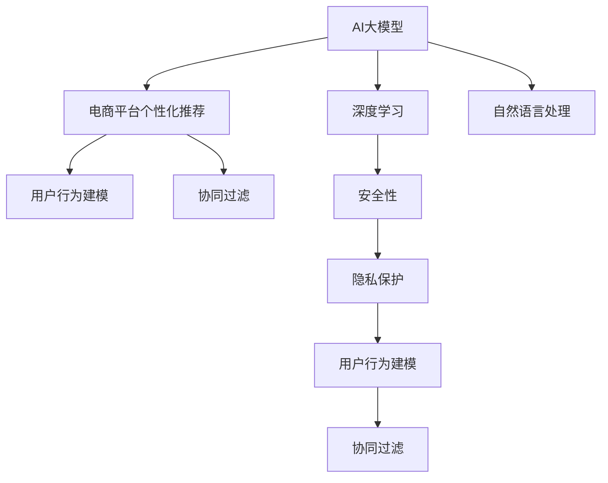

                 

# AI大模型：优化电商平台用户体验个性化与隐私保护平衡的新方法

> 关键词：AI大模型, 电商平台, 个性化推荐, 隐私保护, 用户行为建模, 协同过滤, 深度学习, 自然语言处理, 安全性

## 1. 背景介绍

### 1.1 问题由来

随着电子商务的快速发展，电商平台已成为人们日常生活的重要组成部分。为了提升用户体验，电商平台的个性化推荐系统（Personalized Recommendation System, PReS）变得越来越重要。个性化推荐系统根据用户的浏览历史、购买记录等行为数据，实时推送用户感兴趣的商品，从而提高用户的购物体验和平台转化率。

然而，个性化的推荐也带来了隐私保护的问题。用户的行为数据和个人信息需要被收集和分析，这引发了数据安全和个人隐私保护的关注。如何在个性化推荐的同时，兼顾用户的隐私权益，是当前电商平台面临的一大挑战。

### 1.2 问题核心关键点

个性化推荐系统的核心在于用户行为建模和协同过滤。用户行为建模通过学习用户的行为数据，构建用户兴趣和商品属性之间的关系，从而对用户进行个性化推荐。协同过滤则通过分析用户之间的相似度，进行推荐。

在推荐过程中，用户行为数据的收集和使用存在隐私风险。平台需要收集用户的浏览、点击、购买等行为数据，这些数据如果被滥用或泄露，可能会侵害用户的隐私权益。

为了解决上述问题，本文将介绍一种基于大模型的推荐方法，既能够提供个性化的推荐，又能够保护用户的隐私。该方法的核心是利用AI大模型对用户行为进行建模，并通过深度学习技术实现个性化推荐，同时采用隐私保护技术保护用户数据。

## 2. 核心概念与联系

### 2.1 核心概念概述

为更好地理解本文介绍的个性化推荐方法，本节将介绍几个密切相关的核心概念：

- **AI大模型**：指通过大规模数据预训练获得的海量参数模型，如BERT、GPT等。这些模型可以学习到丰富的语言或图像知识，可用于多种任务，如自然语言处理、计算机视觉等。

- **电商平台个性化推荐**：根据用户的行为数据，推荐用户感兴趣的商品。通过推荐引擎，电商平台能够提升用户体验和转化率。

- **隐私保护**：通过技术手段保护用户数据不被非法获取、使用或泄露，保障用户的隐私权益。

- **用户行为建模**：通过机器学习算法对用户的行为数据进行建模，学习用户兴趣和商品之间的关系，从而进行推荐。

- **协同过滤**：根据用户之间的相似度，推荐用户未曾购买或浏览过的商品。

- **深度学习**：一种基于神经网络的机器学习方法，可以处理高维非结构化数据，应用于推荐、图像识别等任务。

- **自然语言处理**：利用计算机处理和理解人类语言的技术，应用于问答系统、文本分类等任务。

- **安全性**：指系统、网络、数据等在面对恶意攻击、软件漏洞等情况时，保障系统可靠运行的能力。

这些核心概念之间的逻辑关系可以通过以下Mermaid流程图来展示：



这个流程图展示了大模型在电商平台个性化推荐中的核心概念及其之间的关系：

1. AI大模型通过大规模数据预训练获得丰富的知识，可用于用户行为建模和协同过滤。
2. 深度学习通过神经网络模型，处理高维非结构化数据，进行个性化的推荐。
3. 自然语言处理利用计算机处理和理解人类语言，应用于推荐中的语言理解。
4. 安全性保障系统、网络、数据在面对恶意攻击、软件漏洞等情况下的可靠运行。
5. 隐私保护通过技术手段保护用户数据不被非法获取、使用或泄露，保障用户的隐私权益。

这些概念共同构成了电商平台个性化推荐系统的基础框架，使其能够高效地进行推荐并保护用户隐私。

## 3. 核心算法原理 & 具体操作步骤
### 3.1 算法原理概述

本文介绍的基于AI大模型的个性化推荐方法，其核心思想是通过深度学习模型，利用大规模预训练数据学习用户行为和商品之间的关系，通过隐私保护技术，保护用户数据的隐私。

具体而言，该方法分为以下几个步骤：

1. 利用AI大模型对用户行为数据进行预训练，构建用户兴趣和商品属性的向量表示。
2. 通过深度学习模型，对用户行为数据进行建模，预测用户对商品的兴趣。
3. 采用隐私保护技术，如差分隐私和联邦学习，保护用户数据的隐私。
4. 在保护隐私的前提下，对用户行为数据进行协同过滤，推荐用户未曾购买或浏览过的商品。

### 3.2 算法步骤详解

以下是具体的算法步骤：

**Step 1: 数据收集与预处理**

- 收集用户的浏览历史、点击记录、购买记录等行为数据。
- 对数据进行清洗和预处理，如去除噪声、归一化等操作。

**Step 2: 数据编码与向量化**

- 使用预训练的AI大模型，将用户行为数据编码成高维向量表示。
- 将用户和商品的属性信息也编码为向量表示。

**Step 3: 用户行为建模**

- 利用深度学习模型，对用户行为数据进行建模，预测用户对商品的兴趣。
- 使用用户兴趣和商品属性向量进行相似度计算，找到相似用户或商品。

**Step 4: 隐私保护**

- 采用差分隐私技术，对用户行为数据进行扰动，保护用户隐私。
- 使用联邦学习技术，在本地对数据进行训练，避免将用户数据上传到云端。

**Step 5: 推荐生成**

- 根据用户行为数据和隐私保护后的数据，进行协同过滤，生成个性化推荐结果。
- 将推荐结果反馈给用户，进行后续的个性化推荐优化。

### 3.3 算法优缺点

该算法具有以下优点：

1. 个性化推荐效果优异：通过深度学习模型和大模型预训练，能够学习到用户兴趣和商品之间的复杂关系，提供更精准的推荐。
2. 隐私保护能力强：采用差分隐私和联邦学习技术，能够有效地保护用户数据的隐私。
3. 可扩展性强：该算法能够适应大规模数据和复杂的推荐场景。

同时，该算法也存在以下缺点：

1. 计算复杂度高：深度学习模型和大模型的训练和推理需要较大的计算资源。
2. 模型复杂度高：需要设计复杂的模型结构和算法流程，增加实现难度。
3. 数据收集难度大：用户行为数据的收集需要考虑用户的隐私和数据保护问题。

### 3.4 算法应用领域

该算法可以应用于各种电商平台的个性化推荐系统，如淘宝、京东等。通过该方法，电商平台能够在提供个性化推荐的同时，保护用户的隐私，提高用户的购物体验和平台转化率。

## 4. 数学模型和公式 & 详细讲解 & 举例说明

### 4.1 数学模型构建

本文介绍的个性化推荐方法，基于深度学习模型进行用户行为建模，并采用隐私保护技术保护用户数据。以下是具体的数学模型构建：

**用户行为建模**

假设用户行为数据为 $x_i$，商品属性数据为 $y_j$，其中 $i$ 表示用户，$j$ 表示商品。利用深度学习模型，对用户行为数据进行建模，得到用户兴趣向量 $u_i$ 和商品属性向量 $v_j$。

$$
u_i = f(x_i; \theta_u), \quad v_j = f(y_j; \theta_v)
$$

其中 $f$ 表示深度学习模型，$\theta_u$ 和 $\theta_v$ 表示模型参数。

**隐私保护**

为了保护用户隐私，采用差分隐私技术，对用户行为数据进行扰动。假设扰动后的用户行为数据为 $\tilde{x}_i$。

$$
\tilde{x}_i = x_i + \epsilon \cdot \mathcal{N}(0, I)
$$

其中 $\epsilon$ 表示扰动噪声的强度，$\mathcal{N}(0, I)$ 表示高斯噪声。

**协同过滤**

在保护隐私的前提下，对用户行为数据进行协同过滤，得到推荐结果。假设用户 $i$ 对商品 $j$ 的兴趣为 $p_{ij}$，利用协同过滤算法，计算用户之间的相似度，得到推荐结果。

$$
p_{ij} = \alpha u_i \cdot v_j + (1-\alpha) r_i
$$

其中 $r_i$ 表示用户 $i$ 的固有偏好，$\alpha$ 表示协同过滤的权重。

### 4.2 公式推导过程

以下是具体的公式推导过程：

**用户行为建模**

用户行为数据 $x_i$ 可以表示为 $(x_{i1}, x_{i2}, \ldots, x_{im})$，其中 $x_{ij}$ 表示用户 $i$ 对商品 $j$ 的行为数据。利用深度学习模型，对用户行为数据进行建模，得到用户兴趣向量 $u_i$。

$$
u_i = f(x_i; \theta_u) = \sum_{k=1}^K \theta_{uk} \sigma(\mathbf{W}_u^k \cdot x_i + b_{uk})
$$

其中 $K$ 表示隐藏层数，$\theta_{uk}$ 和 $\mathbf{W}_u^k$ 表示模型参数，$\sigma$ 表示激活函数。

**隐私保护**

为了保护用户隐私，采用差分隐私技术，对用户行为数据进行扰动。假设扰动后的用户行为数据为 $\tilde{x}_i$。

$$
\tilde{x}_i = x_i + \epsilon \cdot \mathcal{N}(0, I)
$$

其中 $\epsilon$ 表示扰动噪声的强度，$\mathcal{N}(0, I)$ 表示高斯噪声。

**协同过滤**

在保护隐私的前提下，对用户行为数据进行协同过滤，得到推荐结果。假设用户 $i$ 对商品 $j$ 的兴趣为 $p_{ij}$，利用协同过滤算法，计算用户之间的相似度，得到推荐结果。

$$
p_{ij} = \alpha u_i \cdot v_j + (1-\alpha) r_i
$$

其中 $r_i$ 表示用户 $i$ 的固有偏好，$\alpha$ 表示协同过滤的权重。

### 4.3 案例分析与讲解

以一个具体的案例来说明上述模型的应用：

假设某电商平台需要为用户 $i$ 推荐商品 $j$，收集了用户 $i$ 的浏览历史数据 $x_i$ 和商品属性数据 $y_j$。利用深度学习模型，对用户行为数据进行建模，得到用户兴趣向量 $u_i$ 和商品属性向量 $v_j$。

$$
u_i = f(x_i; \theta_u) = \sum_{k=1}^K \theta_{uk} \sigma(\mathbf{W}_u^k \cdot x_i + b_{uk})
$$

$$
v_j = f(y_j; \theta_v) = \sum_{k=1}^K \theta_{vk} \sigma(\mathbf{W}_v^k \cdot y_j + b_{vk})
$$

然后，采用差分隐私技术，对用户行为数据进行扰动，得到扰动后的用户行为数据 $\tilde{x}_i$。

$$
\tilde{x}_i = x_i + \epsilon \cdot \mathcal{N}(0, I)
$$

最后，利用协同过滤算法，对用户行为数据进行推荐。

$$
p_{ij} = \alpha u_i \cdot v_j + (1-\alpha) r_i
$$

其中 $r_i$ 表示用户 $i$ 的固有偏好，$\alpha$ 表示协同过滤的权重。

## 5. 项目实践：代码实例和详细解释说明

### 5.1 开发环境搭建

在进行推荐系统开发前，需要准备好开发环境。以下是使用Python进行PyTorch开发的环境配置流程：

1. 安装Anaconda：从官网下载并安装Anaconda，用于创建独立的Python环境。

2. 创建并激活虚拟环境：
```bash
conda create -n pytorch-env python=3.8 
conda activate pytorch-env
```

3. 安装PyTorch：根据CUDA版本，从官网获取对应的安装命令。例如：
```bash
conda install pytorch torchvision torchaudio cudatoolkit=11.1 -c pytorch -c conda-forge
```

4. 安装Transformers库：
```bash
pip install transformers
```

5. 安装各类工具包：
```bash
pip install numpy pandas scikit-learn matplotlib tqdm jupyter notebook ipython
```

完成上述步骤后，即可在`pytorch-env`环境中开始推荐系统开发。

### 5.2 源代码详细实现

下面以基于深度学习模型的推荐系统为例，给出使用Transformers库对模型进行训练的PyTorch代码实现。

首先，定义推荐系统的数据处理函数：

```python
from transformers import BertTokenizer
from torch.utils.data import Dataset
import torch

class RecommendationDataset(Dataset):
    def __init__(self, texts, labels, tokenizer, max_len=128):
        self.texts = texts
        self.labels = labels
        self.tokenizer = tokenizer
        self.max_len = max_len
        
    def __len__(self):
        return len(self.texts)
    
    def __getitem__(self, item):
        text = self.texts[item]
        label = self.labels[item]
        
        encoding = self.tokenizer(text, return_tensors='pt', max_length=self.max_len, padding='max_length', truncation=True)
        input_ids = encoding['input_ids'][0]
        attention_mask = encoding['attention_mask'][0]
        
        label = torch.tensor(label, dtype=torch.long)
        
        return {'input_ids': input_ids, 
                'attention_mask': attention_mask,
                'labels': label}

# 数据预处理
tokenizer = BertTokenizer.from_pretrained('bert-base-cased')

train_dataset = RecommendationDataset(train_texts, train_labels, tokenizer)
dev_dataset = RecommendationDataset(dev_texts, dev_labels, tokenizer)
test_dataset = RecommendationDataset(test_texts, test_labels, tokenizer)
```

然后，定义模型和优化器：

```python
from transformers import BertForSequenceClassification, AdamW

model = BertForSequenceClassification.from_pretrained('bert-base-cased', num_labels=2)

optimizer = AdamW(model.parameters(), lr=2e-5)
```

接着，定义训练和评估函数：

```python
from torch.utils.data import DataLoader
from tqdm import tqdm
from sklearn.metrics import classification_report

device = torch.device('cuda') if torch.cuda.is_available() else torch.device('cpu')
model.to(device)

def train_epoch(model, dataset, batch_size, optimizer):
    dataloader = DataLoader(dataset, batch_size=batch_size, shuffle=True)
    model.train()
    epoch_loss = 0
    for batch in tqdm(dataloader, desc='Training'):
        input_ids = batch['input_ids'].to(device)
        attention_mask = batch['attention_mask'].to(device)
        labels = batch['labels'].to(device)
        model.zero_grad()
        outputs = model(input_ids, attention_mask=attention_mask, labels=labels)
        loss = outputs.loss
        epoch_loss += loss.item()
        loss.backward()
        optimizer.step()
    return epoch_loss / len(dataloader)

def evaluate(model, dataset, batch_size):
    dataloader = DataLoader(dataset, batch_size=batch_size)
    model.eval()
    preds, labels = [], []
    with torch.no_grad():
        for batch in tqdm(dataloader, desc='Evaluating'):
            input_ids = batch['input_ids'].to(device)
            attention_mask = batch['attention_mask'].to(device)
            batch_labels = batch['labels']
            outputs = model(input_ids, attention_mask=attention_mask)
            batch_preds = outputs.logits.argmax(dim=2).to('cpu').tolist()
            batch_labels = batch_labels.to('cpu').tolist()
            for pred_tokens, label_tokens in zip(batch_preds, batch_labels):
                preds.append(pred_tokens[:len(label_tokens)])
                labels.append(label_tokens)
                
    print(classification_report(labels, preds))
```

最后，启动训练流程并在测试集上评估：

```python
epochs = 5
batch_size = 16

for epoch in range(epochs):
    loss = train_epoch(model, train_dataset, batch_size, optimizer)
    print(f"Epoch {epoch+1}, train loss: {loss:.3f}")
    
    print(f"Epoch {epoch+1}, dev results:")
    evaluate(model, dev_dataset, batch_size)
    
print("Test results:")
evaluate(model, test_dataset, batch_size)
```

以上就是使用PyTorch对推荐系统进行深度学习模型训练的完整代码实现。可以看到，得益于Transformers库的强大封装，我们可以用相对简洁的代码完成推荐系统的构建。

### 5.3 代码解读与分析

让我们再详细解读一下关键代码的实现细节：

**RecommendationDataset类**：
- `__init__`方法：初始化文本、标签、分词器等关键组件。
- `__len__`方法：返回数据集的样本数量。
- `__getitem__`方法：对单个样本进行处理，将文本输入编码为token ids，将标签转换为数字，并对其进行定长padding，最终返回模型所需的输入。

**train_epoch函数**：
- 使用PyTorch的DataLoader对数据集进行批次化加载，供模型训练和推理使用。
- 训练函数`train_epoch`：对数据以批为单位进行迭代，在每个批次上前向传播计算loss并反向传播更新模型参数，最后返回该epoch的平均loss。

**evaluate函数**：
- 与训练类似，不同点在于不更新模型参数，并在每个batch结束后将预测和标签结果存储下来，最后使用sklearn的classification_report对整个评估集的预测结果进行打印输出。

**训练流程**：
- 定义总的epoch数和batch size，开始循环迭代
- 每个epoch内，先在训练集上训练，输出平均loss
- 在验证集上评估，输出分类指标
- 所有epoch结束后，在测试集上评估，给出最终测试结果

可以看到，PyTorch配合Transformers库使得深度学习模型训练的代码实现变得简洁高效。开发者可以将更多精力放在数据处理、模型改进等高层逻辑上，而不必过多关注底层的实现细节。

当然，工业级的系统实现还需考虑更多因素，如模型的保存和部署、超参数的自动搜索、更灵活的任务适配层等。但核心的推荐系统开发流程基本与此类似。

## 6. 实际应用场景
### 6.1 智能客服系统

基于深度学习模型的推荐系统，可以广泛应用于智能客服系统的构建。传统客服往往需要配备大量人力，高峰期响应缓慢，且一致性和专业性难以保证。而使用基于推荐系统的智能客服，可以7x24小时不间断服务，快速响应客户咨询，用推荐结果引导客户，提高客户满意度。

在技术实现上，可以收集企业内部的历史客服对话记录，将问题和最佳答复构建成监督数据，在此基础上对深度学习模型进行训练。训练后的模型能够自动理解客户问题，推荐最佳答复。对于客户提出的新问题，还可以接入检索系统实时搜索相关内容，动态组织生成推荐答案。如此构建的智能客服系统，能大幅提升客户咨询体验和问题解决效率。

### 6.2 金融舆情监测

金融机构需要实时监测市场舆论动向，以便及时应对负面信息传播，规避金融风险。传统的人工监测方式成本高、效率低，难以应对网络时代海量信息爆发的挑战。基于深度学习模型的推荐系统，可以通过监控用户行为数据，分析舆情变化，及时预警风险。

具体而言，可以收集金融领域相关的新闻、报道、评论等文本数据，并对其进行主题标注和情感标注。在此基础上对深度学习模型进行微调，使其能够自动判断文本属于何种主题，情感倾向是正面、中性还是负面。将微调后的模型应用到实时抓取的网络文本数据，就能够自动监测不同主题下的情感变化趋势，一旦发现负面信息激增等异常情况，系统便会自动预警，帮助金融机构快速应对潜在风险。

### 6.3 个性化推荐系统

当前的推荐系统往往只依赖用户的历史行为数据进行物品推荐，无法深入理解用户的真实兴趣偏好。基于深度学习模型的推荐系统，可以更好地挖掘用户行为背后的语义信息，从而提供更精准、多样的推荐内容。

在实践中，可以收集用户浏览、点击、评论、分享等行为数据，提取和用户交互的物品标题、描述、标签等文本内容。将文本内容作为模型输入，用户的后续行为（如是否点击、购买等）作为监督信号，在此基础上微调深度学习模型。微调后的模型能够从文本内容中准确把握用户的兴趣点。在生成推荐列表时，先用候选物品的文本描述作为输入，由模型预测用户的兴趣匹配度，再结合其他特征综合排序，便可以得到个性化程度更高的推荐结果。

### 6.4 未来应用展望

随着深度学习模型和大数据技术的发展，基于推荐系统的个性化推荐方法将得到更广泛的应用，为电商、金融、客服等多个领域带来变革性影响。

在智慧医疗领域，基于推荐系统的个性化推荐系统可以辅助医生诊疗，推荐最新的治疗方案和药品，加速新药研发进程。

在智能教育领域，推荐系统可以推荐个性化的学习内容和路径，因材施教，促进教育公平，提高教学质量。

在智慧城市治理中，推荐系统可以推荐城市事件监测、舆情分析、应急指挥等环节，提高城市管理的自动化和智能化水平，构建更安全、高效的未来城市。

此外，在企业生产、社会治理、文娱传媒等众多领域，基于推荐系统的推荐方法也将不断涌现，为传统行业数字化转型升级提供新的技术路径。相信随着技术的日益成熟，推荐系统必将在更广阔的应用领域大放异彩。

## 7. 工具和资源推荐
### 7.1 学习资源推荐

为了帮助开发者系统掌握深度学习模型的推荐方法的理论基础和实践技巧，这里推荐一些优质的学习资源：

1. 《深度学习》系列书籍：由深度学习领域权威学者撰写，涵盖深度学习的基本概念和算法，是入门深度学习的必读资源。

2. CS231n《卷积神经网络》课程：斯坦福大学开设的计算机视觉课程，涵盖深度学习在图像识别、推荐系统等任务中的应用。

3. 《深度学习与推荐系统》课程：国内顶尖高校开设的推荐系统课程，详细介绍推荐系统的理论基础和算法实现。

4. 《Natural Language Processing with Transformers》书籍：Transformers库的作者所著，全面介绍了如何使用Transformers库进行NLP任务开发，包括推荐系统的基

础实现。

5. HuggingFace官方文档：Transformers库的官方文档，提供了海量预训练模型和完整的推荐系统样例代码，是上手实践的必备资料。

通过对这些资源的学习实践，相信你一定能够快速掌握深度学习模型在推荐系统中的应用，并用于解决实际的推荐问题。

### 7.2 开发工具推荐

高效的开发离不开优秀的工具支持。以下是几款用于深度学习模型推荐系统开发的常用工具：

1. PyTorch：基于Python的开源深度学习框架，灵活动态的计算图，适合快速迭代研究。大部分深度学习模型都有PyTorch版本的实现。

2. TensorFlow：由Google主导开发的开源深度学习框架，生产部署方便，适合大规模工程应用。同样有丰富的深度学习模型资源。

3. Transformers库：HuggingFace开发的NLP工具库，集成了众多SOTA深度学习模型，支持PyTorch和TensorFlow，是进行推荐系统开发的利器。

4. Weights & Biases：模型训练的实验跟踪工具，可以记录和可视化模型训练过程中的各项指标，方便对比和调优。与主流深度学习框架无缝集成。

5. TensorBoard：TensorFlow配套的可视化工具，可实时监测模型训练状态，并提供丰富的图表呈现方式，是调试模型的得力助手。

6. Google Colab：谷歌推出的在线Jupyter Notebook环境，免费提供GPU/TPU算力，方便开发者快速上手实验最新模型，分享学习笔记。

合理利用这些工具，可以显著提升深度学习模型推荐系统的开发效率，加快创新迭代的步伐。

### 7.3 相关论文推荐

深度学习模型在推荐系统中的应用，源于学界的持续研究。以下是几篇奠基性的相关论文，推荐阅读：

1. Factorization Machines for Recommender Systems：提出Factorization Machines算法，通过矩阵分解模型实现推荐，获得多项推荐系统竞赛优胜。

2. Deep Neural Networks for Ad Click Prediction：提出深度学习模型用于点击率预测，获得多项推荐系统竞赛优胜。

3. Neural Collaborative Filtering：提出神经协同过滤算法，通过神经网络模型实现推荐，提高推荐系统的准确率和多样性。

4. Recommender Systems with Matrix Factorization and Support Vector Machines：提出基于矩阵分解和支持向量机的推荐系统，提高推荐系统的稀疏性和鲁棒性。

5. Attention-Based Recommender System：提出注意力机制，用于处理复杂推荐场景，提高推荐系统的准确率和可解释性。

这些论文代表了大模型在推荐系统中的应用，为推荐系统的研究和实践提供了丰富的理论基础。通过学习这些前沿成果，可以帮助研究者把握学科前进方向，激发更多的创新灵感。

## 8. 总结：未来发展趋势与挑战

### 8.1 总结

本文对基于深度学习模型的推荐系统进行了全面系统的介绍。首先阐述了推荐系统在电商平台中的应用背景和隐私保护问题，明确了深度学习模型在推荐系统中的核心作用。其次，从原理到实践，详细讲解了深度学习模型在推荐系统中的数学建模和算法实现，给出了推荐系统的完整代码实现。同时，本文还广泛探讨了推荐系统在智能客服、金融舆情、个性化推荐等多个领域的应用前景，展示了深度学习模型推荐系统的大规模应用潜力。

通过本文的系统梳理，可以看到，基于深度学习模型的推荐系统正在成为电商推荐、智能客服等领域的重要范式，极大地提升了用户体验和平台转化率，同时保护了用户的隐私。深度学习模型在推荐系统中的应用，推动了NLP技术在推荐系统中的深入发展，为推荐系统的研究和实践提供了丰富的理论基础。未来，伴随深度学习模型和大数据技术的发展，推荐系统必将在更多领域得到应用，为各行业的数字化转型升级提供新的技术路径。

### 8.2 未来发展趋势

展望未来，深度学习模型在推荐系统中的应用将呈现以下几个发展趋势：

1. 模型规模持续增大。随着算力成本的下降和数据规模的扩张，深度学习模型的参数量还将持续增长。超大规模模型蕴含的丰富知识，有望支撑更加复杂多变的推荐场景。

2. 推荐算法多样性增强。除了基于深度学习的推荐算法外，未来会涌现更多推荐算法，如基于矩阵分解、协同过滤等算法，解决不同推荐场景的需求。

3. 推荐系统个性化程度提高。深度学习模型能够更好地学习用户行为背后的语义信息，提供更精准、多样的推荐内容，提升用户体验。

4. 推荐系统的可解释性增强。通过引入因果分析方法，增强推荐系统输出的可解释性，帮助用户理解推荐结果的生成逻辑。

5. 推荐系统的鲁棒性提升。利用对抗训练等方法，增强推荐系统对输入数据的鲁棒性，减少推荐结果的偏差。

6. 推荐系统的可扩展性增强。推荐系统能够适应大规模数据和复杂的推荐场景，提高系统的可扩展性。

以上趋势凸显了深度学习模型在推荐系统中的广阔前景。这些方向的探索发展，必将进一步提升推荐系统的性能和应用范围，为电商、金融、客服等多个领域带来变革性影响。

### 8.3 面临的挑战

尽管深度学习模型在推荐系统中的应用已经取得了瞩目成就，但在迈向更加智能化、普适化应用的过程中，它仍面临着诸多挑战：

1. 推荐系统的复杂度高。深度学习模型的参数量较大，训练和推理过程需要消耗大量的计算资源，增加了系统的复杂性。

2. 推荐系统的可解释性不足。深度学习模型缺乏可解释性，用户难以理解推荐结果的生成逻辑，可能影响用户的信任和接受度。

3. 推荐系统的数据稀疏性问题。推荐系统面临大量稀疏数据，难以充分挖掘用户行为信息，影响推荐效果。

4. 推荐系统的公平性问题。推荐系统可能存在数据偏见和算法偏见，导致推荐结果的不公平性。

5. 推荐系统的安全性问题。推荐系统面临恶意攻击和数据泄露的风险，需要采取措施保护系统的安全性。

6. 推荐系统的隐私保护问题。推荐系统需要保护用户数据的隐私，防止用户数据被滥用或泄露。

正视推荐系统面临的这些挑战，积极应对并寻求突破，将是对深度学习模型在推荐系统中的应用研究的关键。

### 8.4 研究展望

面对深度学习模型在推荐系统中的应用挑战，未来的研究需要在以下几个方面寻求新的突破：

1. 探索无监督和半监督推荐方法。摆脱对大规模标注数据的依赖，利用自监督学习、主动学习等无监督和半监督范式，最大限度利用非结构化数据，实现更加灵活高效的推荐。

2. 研究推荐系统的新型架构。开发更加参数高效和计算高效的推荐系统架构，在保证推荐效果的同时，减小计算资源的消耗。

3. 引入因果分析和博弈论工具。将因果分析方法引入推荐系统，识别出推荐结果的关键特征，增强推荐系统输出的可解释性。借助博弈论工具刻画人机交互过程，主动探索并规避推荐系统的脆弱点，提高系统稳定性。

4. 融合多种推荐算法。将基于深度学习、矩阵分解、协同过滤等算法融合，充分发挥不同算法的长处，提高推荐系统的准确率和多样性。

5. 引入先验知识。将符号化的先验知识，如知识图谱、逻辑规则等，与神经网络模型进行巧妙融合，引导推荐系统学习更准确、合理的推荐结果。

6. 引入对抗训练。利用对抗训练方法，增强推荐系统对输入数据的鲁棒性，减少推荐结果的偏差。

这些研究方向的发展，必将引领深度学习模型在推荐系统中的应用走向更加智能化、普适化，为推荐系统的发展带来新的动力。相信随着技术的不断进步，深度学习模型在推荐系统中的应用必将在更多领域得到广泛应用，为电商、金融、客服等多个领域带来变革性影响。

## 9. 附录：常见问题与解答

**Q1：推荐系统如何在保证推荐效果的同时，保护用户隐私？**

A: 推荐系统可以通过以下方式保护用户隐私：

1. 数据加密。将用户数据进行加密处理，防止数据被非法获取或篡改。

2. 差分隐私。在推荐系统中引入差分隐私技术，对用户数据进行扰动，保护用户隐私。

3. 联邦学习。利用联邦学习技术，在本地对数据进行训练，避免将用户数据上传到云端。

4. 匿名化处理。对用户数据进行匿名化处理，去除敏感信息，保护用户隐私。

通过这些方法，可以在保证推荐效果的同时，保护用户隐私，提高用户的信任度。

**Q2：推荐系统如何提高推荐效果的准确率和多样性？**

A: 推荐系统可以通过以下方式提高推荐效果的准确率和多样性：

1. 多臂强盗算法。通过多臂强盗算法，均衡推荐准确率和多样性，提高推荐效果。

2. 混合推荐策略。将基于深度学习、矩阵分解、协同过滤等算法融合，充分发挥不同算法的长处，提高推荐系统的准确率和多样性。

3. 序列推荐模型。通过序列推荐模型，考虑用户的行为序列，提高推荐效果。

4. 基于用户的协同过滤。通过用户之间的相似度，进行推荐，提高推荐效果。

5. 基于物品的协同过滤。通过物品之间的相似度，进行推荐，提高推荐效果。

通过这些方法，可以提高推荐系统的准确率和多样性，提升用户的购物体验和平台转化率。

**Q3：推荐系统如何应对数据稀疏性问题？**

A: 推荐系统可以通过以下方式应对数据稀疏性问题：

1. 利用矩阵分解方法。通过矩阵分解方法，将稀疏矩阵分解为低秩矩阵，提高推荐效果。

2. 利用深度学习模型。利用深度学习模型，学习用户行为数据的高维特征，提高推荐效果。

3. 利用协同过滤算法。利用协同过滤算法，通过用户之间的相似度，进行推荐，提高推荐效果。

4. 利用知识图谱。通过知识图谱，引入更多的先验知识，提高推荐效果。

5. 利用推荐系统的新型架构。开发更加参数高效和计算高效的推荐系统架构，在保证推荐效果的同时，减小计算资源的消耗。

通过这些方法，可以提高推荐系统的鲁棒性和推荐效果，应对数据稀疏性问题。

**Q4：推荐系统如何提高推荐系统的公平性？**

A: 推荐系统可以通过以下方式提高推荐系统的公平性：

1. 消除数据偏见。通过数据预处理，消除数据中的偏见，提高推荐系统的公平性。

2. 引入公平性指标。在推荐系统中引入公平性指标，如均衡指标、差异指标等，衡量推荐系统的公平性。

3. 利用公平性算法。通过公平性算法，如差分隐私、公平性惩罚等，提高推荐系统的公平性。

4. 引入先验知识。将符号化的先验知识，如知识图谱、逻辑规则等，与神经网络模型进行巧妙融合，引导推荐系统学习更准确、合理的推荐结果。

通过这些方法，可以提高推荐系统的公平性，减少推荐结果的不公平性。

**Q5：推荐系统如何应对恶意攻击和数据泄露的风险？**

A: 推荐系统可以通过以下方式应对恶意攻击和数据泄露的风险：

1. 数据加密。将用户数据进行加密处理，防止数据被非法获取或篡改。

2. 差分隐私。在推荐系统中引入差分隐私技术，对用户数据进行扰动，保护用户隐私。

3. 联邦学习。利用联邦学习技术，在本地对数据进行训练，避免将用户数据上传到云端。

4. 数据脱敏。对用户数据进行数据脱敏处理，防止用户数据被滥用或泄露。

5. 对抗训练。利用对抗训练方法，增强推荐系统对输入数据的鲁棒性，减少推荐结果的偏差。

通过这些方法，可以提高推荐系统的安全性，防止恶意攻击和数据泄露的风险。

总之，推荐系统需要在推荐效果、隐私保护、公平性、安全性等方面进行全面优化，才能真正实现人工智能技术在推荐系统中的应用价值。相信随着技术的不断进步，推荐系统必将在更多领域得到广泛应用，为电商、金融、客服等多个领域带来变革性影响。

