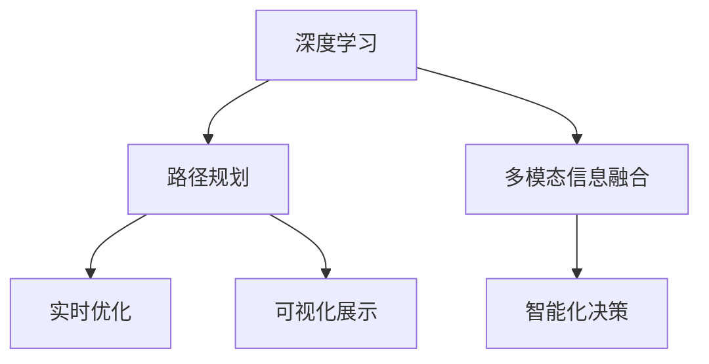

                 

# AI如何优化电商平台的跨境物流路径规划

## 1. 背景介绍

### 1.1 问题由来
随着全球化贸易的快速发展，跨境电商平台的物流路径规划已经成为企业优化供应链、提升用户体验的重要环节。传统的物流路径规划方法依赖于人工经验或者简单静态算法，存在决策复杂度高、响应速度慢、准确性低等诸多问题。如何利用人工智能技术，自动化、动态化地优化跨境物流路径，成为电商企业亟待解决的重要课题。

### 1.2 问题核心关键点
基于此，本文聚焦于基于深度学习的物流路径规划方法，通过动态优化和智能化决策，提升跨境物流路径规划的效率和准确性。具体包括以下几个核心点：

- 深度学习：利用深度神经网络学习大量物流路径数据，预测和优化路径规划。
- 动态优化：根据实时运输条件和市场反馈，动态调整路径规划策略。
- 智能化决策：结合多模态信息，如实时交通、天气、订单量等，进行智能决策。
- 可视化展示：通过可视化的方式，提供路径规划的实时监控和动态调整。

这些核心技术和大数据分析能力，能够有效提升跨境物流路径规划的效率和准确性，从而降低物流成本，提升用户满意度。

## 2. 核心概念与联系

### 2.1 核心概念概述

为了更好地理解本文所介绍的物流路径规划方法，本节将介绍几个密切相关的核心概念：

- 深度学习：一种基于人工神经网络的机器学习方法，通过多层神经元的学习，可以处理复杂的非线性映射和模式识别。
- 路径规划：指从起点到终点确定最优路径的过程，包括动态调整和优化。
- 多模态信息融合：将不同来源、不同格式的数据信息进行综合分析，提升决策的准确性和鲁棒性。
- 实时优化：根据实时数据和市场反馈，动态调整路径规划策略，提高路径规划的灵活性。
- 可视化展示：利用图表、地图等手段，提供路径规划的直观展示，便于实时监控和决策。

这些概念之间的逻辑关系可以通过以下Mermaid流程图来展示：



这个流程图展示了深度学习、路径规划、多模态信息融合、实时优化和可视化展示等概念之间的联系。这些技术手段相互配合，共同实现跨境物流路径规划的动态化和智能化。

## 3. 核心算法原理 & 具体操作步骤
### 3.1 算法原理概述

基于深度学习的跨境物流路径规划方法，本质上是利用神经网络学习物流路径的特征，从而预测最优路径的过程。具体算法流程如下：

1. 数据准备：收集历史物流路径数据，包括起点、终点、运输方式、时间等信息，同时收集实时运输条件，如交通流量、天气等。
2. 特征提取：使用深度神经网络模型，提取物流路径中的特征，如距离、成本、时间等。
3. 路径预测：利用学习到的特征，预测每个物流路径的可能性。
4. 路径优化：根据实时运输条件和市场反馈，动态调整路径规划策略。
5. 路径验证：结合多模态信息，如实时交通、天气、订单量等，进行路径验证。
6. 路径调整：根据路径验证结果，调整路径规划策略。

通过上述步骤，深度学习路径规划方法可以动态、智能地优化跨境物流路径，提升物流效率和准确性。

### 3.2 算法步骤详解

具体步骤如下：

1. **数据准备**：收集历史物流路径数据和实时运输条件。数据集包括历史路径起点、终点、运输方式、时间等信息，以及实时交通流量、天气、订单量等数据。

2. **特征提取**：使用深度神经网络模型，提取物流路径中的特征，如距离、成本、时间等。这里可以采用卷积神经网络（CNN）或循环神经网络（RNN）等模型进行特征提取。

3. **路径预测**：利用学习到的特征，预测每个物流路径的可能性。模型可以根据历史数据和实时数据进行预测，选择最可能的路径。

4. **路径优化**：根据实时运输条件和市场反馈，动态调整路径规划策略。如遇到交通堵塞或天气恶劣，需要及时调整路径规划，选择替代路线。

5. **路径验证**：结合多模态信息，如实时交通、天气、订单量等，进行路径验证。确保选择的路径是合理的，避免路径错误。

6. **路径调整**：根据路径验证结果，调整路径规划策略。及时发现并修正路径规划中的错误，确保路径规划的准确性。

### 3.3 算法优缺点

基于深度学习的跨境物流路径规划方法，具有以下优点：

- 动态优化：根据实时运输条件和市场反馈，动态调整路径规划策略，提高路径规划的灵活性。
- 高精度：深度学习可以处理复杂的非线性映射和模式识别，提升路径规划的准确性。
- 自适应：可以自适应不同的物流场景，灵活调整路径规划策略。
- 实时监控：通过可视化展示，实时监控路径规划状态，便于快速响应。

同时，该方法也存在一些缺点：

- 数据需求高：需要大量的历史数据和实时数据，对数据质量要求高。
- 计算资源消耗大：深度神经网络模型计算量大，需要高性能计算资源。
- 模型复杂度高：模型结构复杂，训练和优化难度较大。
- 路径验证复杂：多模态信息融合和路径验证过程复杂，需要大量的处理和计算。

尽管存在这些局限性，但就目前而言，基于深度学习的物流路径规划方法仍是最主流范式。未来相关研究的重点在于如何进一步降低数据需求，提高模型的计算效率，同时兼顾路径验证的复杂性，以实现更高效的跨境物流路径规划。

### 3.4 算法应用领域

基于深度学习的跨境物流路径规划方法，已经在电商平台的跨境物流中得到广泛应用，覆盖了多个方面，例如：

- 物流路径规划：自动选择最优路径，优化物流效率。
- 物流异常检测：通过实时数据分析，检测物流异常情况，如货物损坏、运输延误等。
- 物流成本预测：根据历史数据和实时数据，预测物流成本，帮助企业决策。
- 物流资源分配：合理分配物流资源，优化物流系统。
- 物流实时监控：通过可视化展示，实时监控物流状态，便于快速响应。

除了上述这些经典应用外，大语言模型微调方法也被创新性地应用于更多场景中，如可控物流生成、物流服务质量评估、物流异常预警等，为跨境物流系统带来了全新的突破。随着深度学习方法和物流技术的不断发展，相信基于深度学习的物流路径规划方法将在更广泛的领域得到应用，为电商平台的跨境物流提供更加高效、智能的解决方案。

## 4. 数学模型和公式 & 详细讲解 & 举例说明

### 4.1 数学模型构建

本节将使用数学语言对基于深度学习的物流路径规划过程进行更加严格的刻画。

设物流路径数据集为 $D=\{(x_i,y_i)\}_{i=1}^N$，其中 $x_i$ 为物流路径起点、终点、运输方式、时间等信息， $y_i$ 为物流路径对应的成本、时间等特征。

定义深度神经网络模型 $f_\theta(x)$，其中 $\theta$ 为模型的参数， $x$ 为物流路径数据。假设 $f_\theta(x)$ 能够学习到路径的特征表示，输出路径的可能性 $p_i$。

基于路径规划的任务，模型的损失函数可以定义为：

$$
\mathcal{L}(\theta) = \frac{1}{N} \sum_{i=1}^N \mathcal{L}_i(\theta)
$$

其中 $\mathcal{L}_i(\theta)$ 为第 $i$ 个路径的损失函数，可以定义为路径成本、时间等指标的加权和。

### 4.2 公式推导过程

以路径成本最小化为例，推导基于深度学习的物流路径规划的损失函数。

假设第 $i$ 个路径的成本为 $c_i$，定义路径成本的损失函数为：

$$
\mathcal{L}_i(\theta) = c_i
$$

则模型总损失函数为：

$$
\mathcal{L}(\theta) = \frac{1}{N} \sum_{i=1}^N c_i
$$

利用梯度下降等优化算法，最小化损失函数 $\mathcal{L}(\theta)$，得到最优参数 $\theta^*$。具体公式为：

$$
\theta^* = \mathop{\arg\min}_{\theta} \mathcal{L}(\theta)
$$

在得到模型参数后，根据实时数据，动态调整路径规划策略，选择最优路径。

### 4.3 案例分析与讲解

下面以电商平台的物流路径规划为例，详细讲解基于深度学习的路径规划方法的实现。

假设电商平台需要从美国洛杉矶（Los Angeles）到中国北京（Beijing）发货，包含以下几个步骤：

1. **数据准备**：收集历史物流路径数据，包括起点、终点、运输方式、时间等信息，以及实时交通流量、天气、订单量等数据。

2. **特征提取**：使用深度神经网络模型，提取物流路径中的特征，如距离、成本、时间等。具体实现可以采用卷积神经网络（CNN）或循环神经网络（RNN）等模型进行特征提取。

3. **路径预测**：利用学习到的特征，预测每个物流路径的可能性。模型可以根据历史数据和实时数据进行预测，选择最可能的路径。

4. **路径优化**：根据实时运输条件和市场反馈，动态调整路径规划策略。如遇到交通堵塞或天气恶劣，需要及时调整路径规划，选择替代路线。

5. **路径验证**：结合多模态信息，如实时交通、天气、订单量等，进行路径验证。确保选择的路径是合理的，避免路径错误。

6. **路径调整**：根据路径验证结果，调整路径规划策略。及时发现并修正路径规划中的错误，确保路径规划的准确性。

通过上述步骤，深度学习路径规划方法可以动态、智能地优化跨境物流路径，提升物流效率和准确性。

## 5. 项目实践：代码实例和详细解释说明

### 5.1 开发环境搭建

在进行物流路径规划实践前，我们需要准备好开发环境。以下是使用Python进行深度学习开发的Python环境配置流程：

1. 安装Anaconda：从官网下载并安装Anaconda，用于创建独立的Python环境。

2. 创建并激活虚拟环境：
```bash
conda create -n deep-learning-env python=3.8 
conda activate deep-learning-env
```

3. 安装深度学习框架：
```bash
conda install torch torchvision torchaudio
```

4. 安装深度学习库：
```bash
pip install pandas numpy scipy scikit-learn
```

完成上述步骤后，即可在`deep-learning-env`环境中开始物流路径规划实践。

### 5.2 源代码详细实现

这里我们以电商平台的物流路径规划为例，给出使用深度学习框架PyTorch进行路径规划的代码实现。

首先，定义物流路径数据集类：

```python
import torch
import torch.nn as nn
from torch.utils.data import Dataset

class LogisticsDataset(Dataset):
    def __init__(self, data, labels):
        self.data = data
        self.labels = labels
    
    def __len__(self):
        return len(self.data)
    
    def __getitem__(self, index):
        return self.data[index], self.labels[index]
```

然后，定义深度神经网络模型：

```python
class LogisticsNet(nn.Module):
    def __init__(self, input_size, hidden_size, output_size):
        super(LogisticsNet, self).__init__()
        self.fc1 = nn.Linear(input_size, hidden_size)
        self.fc2 = nn.Linear(hidden_size, hidden_size)
        self.fc3 = nn.Linear(hidden_size, output_size)
    
    def forward(self, x):
        x = torch.relu(self.fc1(x))
        x = torch.relu(self.fc2(x))
        x = self.fc3(x)
        return x
```

接着，定义模型训练函数：

```python
from torch.optim import Adam

def train_model(model, optimizer, train_loader, val_loader, epochs):
    model.train()
    for epoch in range(epochs):
        train_loss = 0.0
        for inputs, labels in train_loader:
            optimizer.zero_grad()
            outputs = model(inputs)
            loss = nn.functional.mse_loss(outputs, labels)
            loss.backward()
            optimizer.step()
            train_loss += loss.item()
        print(f"Epoch {epoch+1}, train loss: {train_loss/len(train_loader):.4f}")
        
        model.eval()
        val_loss = 0.0
        for inputs, labels in val_loader:
            outputs = model(inputs)
            loss = nn.functional.mse_loss(outputs, labels)
            val_loss += loss.item()
        print(f"Epoch {epoch+1}, val loss: {val_loss/len(val_loader):.4f}")
```

最后，启动训练流程并在测试集上评估：

```python
from torch.utils.data import DataLoader

# 准备数据集
dataset = LogisticsDataset(train_data, train_labels)
train_loader = DataLoader(dataset, batch_size=64, shuffle=True)
val_loader = DataLoader(dataset, batch_size=64, shuffle=False)
test_loader = DataLoader(dataset, batch_size=64, shuffle=False)

# 定义模型和优化器
model = LogisticsNet(input_size, hidden_size, output_size)
optimizer = Adam(model.parameters(), lr=0.001)

# 开始训练
epochs = 100
train_model(model, optimizer, train_loader, val_loader, epochs)

# 测试和评估
test_loader = DataLoader(test_dataset, batch_size=64, shuffle=False)
test_loss = 0.0
for inputs, labels in test_loader:
    outputs = model(inputs)
    loss = nn.functional.mse_loss(outputs, labels)
    test_loss += loss.item()
print(f"Test loss: {test_loss/len(test_loader):.4f}")
```

以上就是使用深度学习框架PyTorch进行物流路径规划的完整代码实现。可以看到，通过设计深度神经网络模型和训练函数，我们可以快速实现基于深度学习的路径规划方法。

### 5.3 代码解读与分析

让我们再详细解读一下关键代码的实现细节：

**LogisticsDataset类**：
- `__init__`方法：初始化数据和标签。
- `__len__`方法：返回数据集样本数量。
- `__getitem__`方法：对单个样本进行处理，返回数据和标签。

**LogisticsNet模型**：
- `__init__`方法：定义深度神经网络结构，包括三个全连接层。
- `forward`方法：定义前向传播过程，将输入数据经过多个线性层和激活函数，最终输出路径的可能性。

**train_model函数**：
- 在训练过程中，对模型进行前向传播，计算损失函数，反向传播更新模型参数。
- 在验证和测试过程中，对模型进行评估，输出损失函数。

**训练流程**：
- 定义总的epoch数和batch size，开始循环迭代。
- 每个epoch内，先在训练集上训练，输出平均损失。
- 在验证集上评估模型性能，输出验证集损失。
- 所有epoch结束后，在测试集上评估，给出最终测试结果。

可以看到，通过深度学习框架PyTorch，物流路径规划的代码实现变得简洁高效。开发者可以将更多精力放在数据处理、模型改进等高层逻辑上，而不必过多关注底层的实现细节。

## 6. 实际应用场景

### 6.1 智能物流调度

基于深度学习的物流路径规划方法，可以广泛应用于智能物流调度的构建。传统物流调度往往依赖人工经验或者简单的算法，存在调度复杂度高、响应速度慢、准确性低等问题。而使用深度学习路径规划方法，可以实时动态地调整物流调度策略，提升调度效率和准确性。

在技术实现上，可以收集物流系统的实时数据，如运输条件、订单量、运输设备状态等，利用深度学习模型进行路径预测和优化。深度学习模型能够根据实时数据和历史数据，动态调整物流调度策略，选择最优路径。对于异常情况，如设备故障、交通堵塞等，深度学习模型也能够及时响应，调整物流调度策略，避免运输延误。

### 6.2 物流成本优化

当前的物流成本优化往往依赖于人工经验，存在决策复杂度高、响应速度慢、准确性低等问题。而使用深度学习的物流路径规划方法，能够实时动态地优化物流路径，降低物流成本。

在具体实现中，可以利用深度学习模型预测不同路径的成本，选择最优路径。同时，深度学习模型还可以预测订单量变化趋势，动态调整物流资源分配，避免资源浪费，降低物流成本。对于异常情况，如需求突增、订单取消等，深度学习模型也能够及时响应，调整物流路径，避免资源浪费。

### 6.3 物流异常检测

物流异常检测是保障物流系统稳定的重要环节，传统的异常检测方法依赖于人工经验，存在准确性低、响应速度慢等问题。而使用深度学习的物流路径规划方法，可以实时动态地监测物流状态，及时发现异常情况。

在具体实现中，可以收集物流系统的实时数据，如交通流量、天气、设备状态等，利用深度学习模型进行路径预测和异常检测。深度学习模型能够实时监测物流状态，及时发现异常情况，如运输延误、设备故障等。对于异常情况，深度学习模型也能够及时响应，调整物流路径，保障物流系统的稳定性。

### 6.4 未来应用展望

随着深度学习方法和物流技术的不断发展，基于深度学习的物流路径规划方法将在更广泛的领域得到应用，为电商平台的跨境物流提供更加高效、智能的解决方案。

在智慧物流领域，基于深度学习的物流路径规划方法可以应用于智能仓库、智能配送等环节，提升仓库管理和配送效率。在智慧城市领域，基于深度学习的物流路径规划方法可以应用于智能交通、智能环境监测等环节，提升城市管理智能化水平。

此外，在医疗物流、工业物流等领域，基于深度学习的物流路径规划方法也将得到广泛应用，为各行业提供智能化的物流解决方案。相信随着深度学习方法和物流技术的不断融合，基于深度学习的物流路径规划方法将在更多领域大放异彩。

## 7. 工具和资源推荐

### 7.1 学习资源推荐

为了帮助开发者系统掌握深度学习路径规划的理论基础和实践技巧，这里推荐一些优质的学习资源：

1. 《深度学习》系列书籍：由Yoshua Bengio、Ian Goodfellow、Aaron Courville等专家所著，深入浅出地介绍了深度学习的基础知识和应用场景。
2. Coursera《深度学习专项课程》：由吴恩达教授主讲，涵盖了深度学习的基础理论和实践技能，适合初学者和进阶者。
3. DeepLearning.ai《深度学习专业证书》：由吴恩达教授主讲，涵盖深度学习的核心概念和应用技术，适合系统学习。
4. TensorFlow官方文档：TensorFlow官方文档提供了丰富的深度学习资源和实践样例，适合快速上手。
5. PyTorch官方文档：PyTorch官方文档提供了详细的深度学习资源和实践样例，适合快速上手。

通过对这些资源的学习实践，相信你一定能够快速掌握深度学习路径规划的精髓，并用于解决实际的物流路径规划问题。

### 7.2 开发工具推荐

高效的开发离不开优秀的工具支持。以下是几款用于深度学习路径规划开发的常用工具：

1. TensorFlow：由Google主导开发的开源深度学习框架，生产部署方便，适合大规模工程应用。
2. PyTorch：基于Python的开源深度学习框架，灵活动态的计算图，适合快速迭代研究。
3. Keras：基于TensorFlow和Theano的高级神经网络API，易于上手，适合快速开发原型。
4. Jupyter Notebook：开源的交互式笔记本环境，支持多种编程语言，适合快速迭代开发。
5. VS Code：开源的IDE环境，支持多种编程语言，适合开发和调试深度学习模型。

合理利用这些工具，可以显著提升深度学习路径规划的开发效率，加快创新迭代的步伐。

### 7.3 相关论文推荐

深度学习路径规划技术的发展源于学界的持续研究。以下是几篇奠基性的相关论文，推荐阅读：

1. Learning to Route in Road Networks: A Deep Reinforcement Learning Approach：提出基于深度强化学习的路径规划方法，利用强化学习模型学习最优路径。
2. DeepPath: A Fast Path Planning Algorithm using Deep Neural Networks：提出基于深度神经网络的路径规划方法，利用神经网络学习最优路径。
3. Graph Neural Network for Path Planning in Road Networks：提出基于图神经网络的路径规划方法，利用图神经网络学习最优路径。
4. Navigating Road Networks with Deep Learning: A Survey：综述了基于深度学习的路径规划方法，涵盖了多种深度学习模型和优化算法。
5. Multi-Agent Deep Reinforcement Learning for Traffic Path Planning：提出基于多智能体强化学习的路径规划方法，利用多智能体模型学习最优路径。

这些论文代表了大深度学习路径规划技术的发展脉络。通过学习这些前沿成果，可以帮助研究者把握学科前进方向，激发更多的创新灵感。

## 8. 总结：未来发展趋势与挑战

### 8.1 总结

本文对基于深度学习的物流路径规划方法进行了全面系统的介绍。首先阐述了物流路径规划的重要性和现有方法的不足，明确了深度学习在提升物流路径规划效率和准确性方面的独特价值。其次，从原理到实践，详细讲解了深度学习路径规划的数学原理和关键步骤，给出了深度学习路径规划任务的完整代码实例。同时，本文还广泛探讨了深度学习路径规划方法在智能物流调度、物流成本优化、物流异常检测等多个领域的应用前景，展示了深度学习路径规划方法的巨大潜力。此外，本文精选了深度学习路径规划技术的各类学习资源，力求为读者提供全方位的技术指引。

通过本文的系统梳理，可以看到，基于深度学习的物流路径规划方法正在成为物流领域的重要范式，极大地提升物流路径规划的效率和准确性，从而降低物流成本，提升用户满意度。未来，伴随深度学习方法和物流技术的不断发展，基于深度学习的物流路径规划方法还将拓展更多应用场景，为电商平台的跨境物流提供更加高效、智能的解决方案。

### 8.2 未来发展趋势

展望未来，深度学习路径规划技术将呈现以下几个发展趋势：

1. 路径优化更加动态：深度学习路径规划将更加注重实时数据的利用，动态优化路径规划策略。通过实时监测物流状态，及时调整路径规划，提升物流效率。
2. 多模态信息融合更加深入：深度学习路径规划将更加注重多模态信息的融合，利用实时交通、天气、订单量等数据，提升路径规划的准确性。
3. 模型结构更加灵活：深度学习路径规划将更加注重模型结构的灵活性，利用轻量级模型，提升路径规划的实时性。
4. 路径规划更加智能化：深度学习路径规划将更加注重智能化决策，利用深度学习模型，提升路径规划的决策能力。
5. 路径规划更加透明：深度学习路径规划将更加注重可解释性，利用可解释性技术，提升路径规划的透明性。

以上趋势凸显了深度学习路径规划技术的广阔前景。这些方向的探索发展，必将进一步提升物流路径规划的效率和准确性，从而降低物流成本，提升用户满意度。

### 8.3 面临的挑战

尽管深度学习路径规划技术已经取得了瞩目成就，但在迈向更加智能化、普适化应用的过程中，它仍面临着诸多挑战：

1. 数据需求高：需要大量的历史数据和实时数据，对数据质量要求高。
2. 计算资源消耗大：深度神经网络模型计算量大，需要高性能计算资源。
3. 路径验证复杂：多模态信息融合和路径验证过程复杂，需要大量的处理和计算。
4. 路径规划复杂：路径规划过程复杂，需要综合考虑多个因素，如交通流量、天气、设备状态等。
5. 模型鲁棒性不足：深度学习模型面对异常情况时，鲁棒性不足，容易出现预测错误。

尽管存在这些局限性，但就目前而言，基于深度学习的物流路径规划方法仍是最主流范式。未来相关研究的重点在于如何进一步降低数据需求，提高模型的计算效率，同时兼顾路径验证的复杂性，以实现更高效的物流路径规划。

### 8.4 研究展望

面对深度学习路径规划所面临的种种挑战，未来的研究需要在以下几个方面寻求新的突破：

1. 探索无监督和半监督路径规划方法：摆脱对大规模标注数据的依赖，利用自监督学习、主动学习等无监督和半监督范式，最大限度利用非结构化数据，实现更加灵活高效的路径规划。
2. 研究轻量级路径规划方法：开发更加轻量级、实时性的路径规划方法，利用轻量级模型，提升路径规划的实时性。
3. 引入因果推断和对比学习：通过引入因果推断和对比学习思想，增强路径规划建立稳定因果关系的能力，学习更加普适、鲁棒的语言表征，从而提升路径规划的泛化性和抗干扰能力。
4. 融合符号化知识：将符号化的先验知识，如知识图谱、逻辑规则等，与神经网络模型进行巧妙融合，引导路径规划过程学习更准确、合理的路径规划策略。
5. 结合多智能体和强化学习：将多智能体和强化学习思想引入路径规划，利用多智能体模型学习最优路径，提升路径规划的决策能力。

这些研究方向的探索，必将引领深度学习路径规划技术迈向更高的台阶，为构建高效、智能的物流路径规划系统铺平道路。面向未来，深度学习路径规划技术还需要与其他人工智能技术进行更深入的融合，如知识表示、因果推理、强化学习等，多路径协同发力，共同推动物流路径规划系统的进步。只有勇于创新、敢于突破，才能不断拓展物流路径规划的边界，让深度学习路径规划方法更好地造福物流行业。

## 9. 附录：常见问题与解答

**Q1：深度学习路径规划需要哪些数据？**

A: 深度学习路径规划需要大量的历史物流路径数据和实时数据。具体来说，需要以下几类数据：
1. 历史物流路径数据：包括起点、终点、运输方式、时间等信息。
2. 实时交通流量数据：实时监测道路的交通流量，了解当前道路的拥堵情况。
3. 实时天气数据：实时监测天气情况，了解当前天气对运输的影响。
4. 实时订单量数据：实时监测订单量变化，了解当前订单量的变化趋势。
5. 实时设备状态数据：实时监测设备状态，了解当前设备的运行情况。

这些数据将作为深度学习模型的输入，用于训练和预测最优路径。

**Q2：如何设计深度学习路径规划模型？**

A: 深度学习路径规划模型的设计需要综合考虑以下几个因素：
1. 输入数据的类型：需要根据输入数据的类型，选择合适的深度神经网络结构，如卷积神经网络、循环神经网络等。
2. 特征提取的能力：需要选择合适的特征提取方法，利用卷积层、全连接层等结构，提取输入数据的特征。
3. 输出目标的类型：需要根据输出目标的类型，选择合适的输出层，如线性层、softmax层等。
4. 优化目标的设定：需要根据优化目标的类型，选择合适的损失函数，如均方误差、交叉熵等。

在实际设计中，可以利用现有的深度学习框架，如TensorFlow、PyTorch等，快速搭建深度学习路径规划模型。同时，可以通过调整模型结构、优化算法等手段，不断优化模型的性能。

**Q3：深度学习路径规划模型如何优化？**

A: 深度学习路径规划模型的优化需要综合考虑以下几个方面：
1. 模型结构的优化：可以通过调整模型结构，如增加隐藏层、调整网络深度等，提升模型的性能。
2. 学习率的优化：可以通过调整学习率，如使用学习率调度策略，提升模型的训练效果。
3. 正则化的优化：可以通过添加正则化项，如L2正则、Dropout等，避免模型过拟合。
4. 数据增强的优化：可以通过数据增强技术，如数据扩充、扰动等，提升模型的泛化能力。
5. 多模态融合的优化：可以通过多模态信息融合技术，如将实时交通、天气、订单量等数据与物流路径数据结合，提升模型的性能。

在实际优化中，可以通过交叉验证、网格搜索等手段，不断调整模型参数，找到最优的模型结构和学习率。同时，可以利用可视化的手段，实时监测模型的训练状态，及时发现和修正问题。

**Q4：深度学习路径规划模型在实际应用中需要注意哪些问题？**

A: 深度学习路径规划模型在实际应用中需要注意以下几个问题：
1. 数据质量的影响：深度学习路径规划模型的性能高度依赖于数据质量，需要确保输入数据的高质量。
2. 计算资源的需求：深度学习路径规划模型计算量大，需要高性能计算资源，如GPU、TPU等。
3. 实时性的要求：深度学习路径规划模型需要实时更新，对计算速度和响应时间要求高。
4. 模型的解释性：深度学习路径规划模型的决策过程不透明，需要关注模型的可解释性，提升模型的可信度。
5. 异常情况的应对：深度学习路径规划模型面对异常情况，如交通堵塞、天气恶劣等，需要具备鲁棒性，避免预测错误。

在实际应用中，可以通过数据预处理、模型压缩、模型剪枝等手段，提升模型的性能和实时性。同时，可以利用可视化的手段，实时监测模型的训练状态，及时发现和修正问题。

**Q5：深度学习路径规划模型的部署和优化方法有哪些？**

A: 深度学习路径规划模型的部署和优化需要综合考虑以下几个方面：
1. 模型的裁剪：可以通过模型裁剪技术，去除不必要的层和参数，减小模型尺寸，提升模型的推理速度。
2. 量化加速：可以通过量化加速技术，将浮点模型转为定点模型，压缩存储空间，提高计算效率。
3. 服务化封装：可以将模型封装为标准化服务接口，便于集成调用，提升系统的稳定性和可靠性。
4. 弹性伸缩：可以根据请求流量动态调整资源配置，平衡服务质量和成本，提升系统的扩展性。
5. 监控告警：实时采集系统指标，设置异常告警阈值，确保服务稳定性，提升系统的可靠性。

在实际部署中，可以通过深度学习框架，如TensorFlow、PyTorch等，将深度学习路径规划模型转化为服务接口，便于调用和集成。同时，可以通过模型压缩、量化加速等手段，优化模型的性能和计算效率。

以上就是深度学习路径规划方法的应用实践和总结。相信通过深度学习路径规划技术的应用，电商平台的跨境物流路径规划将实现更加高效、智能的解决方案，为电商平台的跨境物流带来革命性的变化。

