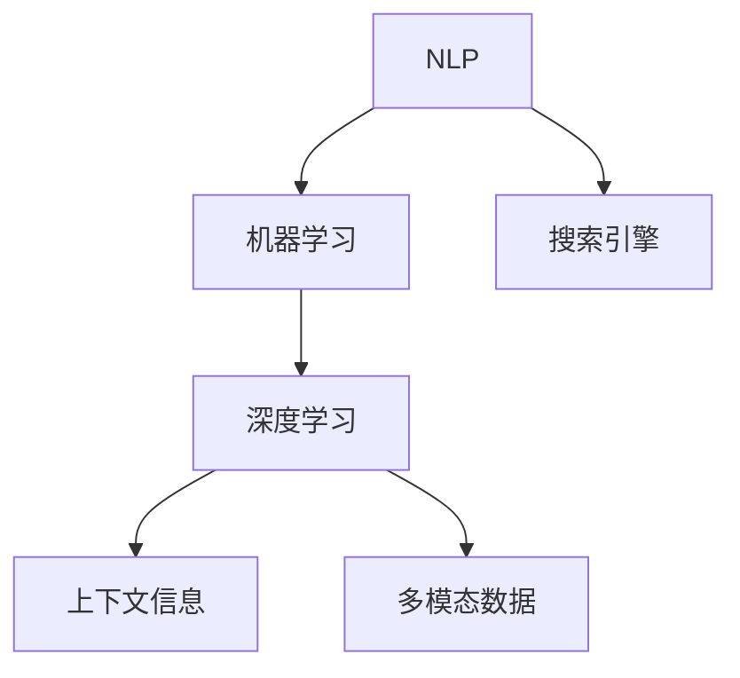

                 

# AI如何提高搜索引擎的语义理解能力

在互联网时代，搜索引擎作为信息检索的核心工具，其语义理解能力对用户体验和信息质量有着至关重要的影响。然而，传统的基于关键词匹配的搜索引擎往往无法理解用户查询的真实意图，导致搜索结果与用户的实际需求不符。随着人工智能技术的不断进步，AI技术逐渐应用于搜索引擎，提高了其语义理解能力，使搜索结果更加精准、有效。本文将详细介绍AI技术如何提升搜索引擎的语义理解能力，涵盖核心概念、算法原理、具体实践、应用场景等多个方面。

## 1. 背景介绍

### 1.1 问题由来

搜索引擎作为信息检索的重要工具，其核心在于准确理解用户查询意图，并返回与用户意图最相关的网页。传统的基于关键词匹配的搜索引擎，在处理自然语言查询时，由于无法理解语言中的隐含信息、上下文关系等，常常导致搜索结果与用户的实际需求不符。这种基于关键词匹配的搜索方式已经无法满足用户日益增长的信息需求。

随着深度学习技术的兴起，人工智能逐渐应用于搜索引擎领域，提高其语义理解能力，改善用户体验。AI技术能够理解自然语言的语义，识别出用户查询的真正意图，并根据意图返回最相关的网页，极大地提升了搜索引擎的准确性和效果。

### 1.2 问题核心关键点

提高搜索引擎的语义理解能力，主要包括以下几个核心关键点：

- 自然语言处理(NLP)技术的应用。NLP技术能够理解和处理自然语言，使搜索引擎能够理解用户的查询意图。
- 机器学习模型的引入。通过机器学习模型，搜索引擎能够从大量数据中学习语义知识，提高对用户查询的理解能力。
- 深度学习模型的应用。深度学习模型能够学习复杂的语义关系，提升搜索引擎的语义理解能力。
- 上下文信息的应用。通过考虑查询的上下文信息，搜索引擎能够更准确地理解用户的查询意图。
- 多模态数据的融合。将文本、图片、视频等多模态数据融合，提升搜索引擎的语义理解能力。

这些关键点共同构成了提升搜索引擎语义理解能力的核心方向，驱动着AI技术在搜索引擎领域的广泛应用。

## 2. 核心概念与联系

### 2.1 核心概念概述

为了更好地理解AI技术如何提高搜索引擎的语义理解能力，我们需要首先了解一些核心概念：

- 自然语言处理（NLP）：研究如何让计算机理解和处理自然语言，涵盖分词、词性标注、命名实体识别、句法分析、语义理解等多个方面。
- 机器学习（ML）：利用数据驱动模型学习，使模型能够从大量数据中学习规律，进行分类、回归等任务。
- 深度学习（DL）：利用神经网络进行非线性模型拟合，能够学习更加复杂的特征表示，提升模型的性能。
- 上下文信息：查询的上下文信息，如查询前后的网页内容、用户历史查询记录等，有助于理解查询意图。
- 多模态数据：文本、图片、视频等不同类型的数据，有助于更全面地理解查询意图。

这些核心概念之间的联系紧密，共同构成了提升搜索引擎语义理解能力的理论基础和实践框架。以下是一个简单的Mermaid流程图，展示了这些概念之间的联系：



这个流程图展示了NLP技术作为搜索引擎的基础，机器学习模型和深度学习模型用于语义知识的学习，上下文信息和多模态数据用于提升查询理解。通过这些核心概念的相互作用，搜索引擎的语义理解能力得到了显著提升。

## 3. 核心算法原理 & 具体操作步骤

### 3.1 算法原理概述

提高搜索引擎的语义理解能力，主要依赖于以下核心算法原理：

- 词向量表示：通过词向量表示技术，将自然语言中的词汇转换为向量，使计算机能够处理语言信息。
- 语义嵌入：通过语义嵌入技术，将词汇向量映射到高维空间，学习词汇之间的语义关系。
- 上下文表示：考虑查询的上下文信息，通过上下文表示技术，提升对查询意图的理解能力。
- 多模态融合：通过多模态融合技术，将文本、图片、视频等多模态数据融合，提升语义理解能力。

这些算法原理共同构成了提高搜索引擎语义理解能力的技术基础，使得搜索引擎能够从多维度理解查询意图，返回更准确的搜索结果。

### 3.2 算法步骤详解

基于上述核心算法原理，以下是提高搜索引擎语义理解能力的详细步骤：

**Step 1: 词向量表示**
- 收集大量语料，构建词向量模型（如Word2Vec、GloVe等），将词汇映射到高维向量空间。
- 使用词向量模型处理查询和网页文本，将查询转换为向量表示，便于计算机理解和处理。

**Step 2: 语义嵌入**
- 构建语义嵌入模型（如Word2Vec、GloVe、FastText等），学习词汇之间的语义关系。
- 将查询和网页文本中的词汇嵌入到高维空间，学习它们之间的语义相似度。
- 利用余弦相似度等方法，计算查询和网页的语义相似度。

**Step 3: 上下文表示**
- 收集查询的上下文信息，如查询前后的网页内容、用户历史查询记录等。
- 利用上下文表示技术（如Seq2Seq、Transformer等），将查询的上下文信息转换为向量表示。
- 结合查询向量，生成查询的上下文向量表示，增强对查询意图的理解能力。

**Step 4: 多模态融合**
- 收集查询的多模态数据，如图片、视频等。
- 利用多模态融合技术（如MLP、CNN等），将文本、图片、视频等多模态数据融合，生成融合后的查询向量表示。
- 结合查询向量，生成更加全面、准确的查询表示，提升语义理解能力。

**Step 5: 搜索结果排序**
- 根据查询向量表示和网页向量表示，计算查询与网页的相似度。
- 利用排序算法（如TF-IDF、RankNet等），对搜索结果进行排序，返回最相关的网页。

通过以上步骤，搜索引擎能够从多维度理解查询意图，返回更准确的搜索结果，提升用户体验和信息质量。

### 3.3 算法优缺点

提高搜索引擎语义理解能力的算法具有以下优点：

- 提升搜索结果的准确性。通过理解查询的真实意图，搜索引擎能够返回更相关的网页，提升用户体验。
- 减少用户输入量。利用NLP技术，搜索引擎能够自动理解查询意图，减少用户输入量，提升搜索效率。
- 适应不同领域。不同领域的语料和查询方式不同，通过灵活应用不同算法，搜索引擎能够适应不同领域的需求。

然而，这些算法也存在一些局限性：

- 对语料的质量和多样性有较高要求。语料的质量和多样性直接影响词向量模型和语义嵌入模型的性能。
- 计算资源需求较高。深度学习模型和上下文表示技术需要大量计算资源，可能限制搜索引擎的性能。
- 依赖于大量标注数据。某些算法（如BERT）需要大量的标注数据进行微调，增加了数据收集和标注的难度。

这些优缺点需要根据具体场景和需求进行权衡，选择合适的算法进行应用。

### 3.4 算法应用领域

提高搜索引擎语义理解能力的算法在多个领域得到了广泛应用，主要包括以下几个方面：

- 通用搜索引擎：如Google、Bing等，利用AI技术提升搜索体验，提高搜索结果的准确性。
- 专业搜索引擎：如HealthPair、MEDLINE等，利用领域特定的语料和算法，提高专业领域的搜索效率和准确性。
- 垂直搜索引擎：如房产、招聘、旅游等垂直领域，利用特定领域的语料和算法，提供更精准的搜索结果。
- 语音搜索：如Google Assistant、Siri等，利用语音识别和NLP技术，实现语音查询和理解。

这些应用领域展示了AI技术在搜索引擎中的广泛应用，推动了搜索技术的不断进步。

## 4. 数学模型和公式 & 详细讲解

### 4.1 数学模型构建

在提高搜索引擎语义理解能力的算法中，词向量表示、语义嵌入和上下文表示等核心技术都涉及数学模型和公式的构建。以下是对这些数学模型的详细介绍。

**词向量模型**
- 词向量模型是一种将词汇映射到高维向量空间的技术，常用的词向量模型包括Word2Vec、GloVe、FastText等。
- 假设词汇集合为 $V=\{v_1, v_2, \cdots, v_n\}$，词汇的词向量表示为 $\mathbf{w} = [w_1, w_2, \cdots, w_d]$，其中 $w_i$ 表示词汇 $v_i$ 的词向量表示，$d$ 为词向量维度。
- 词向量模型的训练目标是最大化词汇共现的概率，即：

$$
\max_{\mathbf{w}} P(\{v_i, v_j\}) = \max_{\mathbf{w}} \frac{1}{|V|} \sum_{i=1}^{|V|} \sum_{j=1}^{|V|} \mathbb{I}(v_i, v_j) \times \mathbf{w}_i \cdot \mathbf{w}_j
$$

其中 $\mathbb{I}(v_i, v_j)$ 表示词汇 $v_i$ 和 $v_j$ 是否共现。

**语义嵌入模型**
- 语义嵌入模型是一种学习词汇之间语义关系的技术，常用的语义嵌入模型包括Word2Vec、GloVe、FastText等。
- 假设词汇集合为 $V=\{v_1, v_2, \cdots, v_n\}$，词汇的语义嵌入表示为 $\mathbf{e} = [e_1, e_2, \cdots, e_d]$，其中 $e_i$ 表示词汇 $v_i$ 的语义嵌入表示，$d$ 为语义嵌入维度。
- 语义嵌入模型的训练目标是最大化词汇共现的概率，即：

$$
\max_{\mathbf{e}} P(\{v_i, v_j\}) = \max_{\mathbf{e}} \frac{1}{|V|} \sum_{i=1}^{|V|} \sum_{j=1}^{|V|} \mathbb{I}(v_i, v_j) \times \mathbf{e}_i \cdot \mathbf{e}_j
$$

其中 $\mathbb{I}(v_i, v_j)$ 表示词汇 $v_i$ 和 $v_j$ 是否共现。

**上下文表示模型**
- 上下文表示模型是一种考虑查询上下文信息的技术，常用的上下文表示模型包括Seq2Seq、Transformer等。
- 假设查询序列为 $Q = [q_1, q_2, \cdots, q_n]$，查询的上下文表示为 $\mathbf{c} = [c_1, c_2, \cdots, c_d]$，其中 $c_i$ 表示查询的第 $i$ 个位置的上下文表示，$d$ 为上下文表示维度。
- 上下文表示模型的训练目标是最大化查询和上下文信息的相关性，即：

$$
\max_{\mathbf{c}} P(Q, C) = \max_{\mathbf{c}} \frac{1}{N} \sum_{i=1}^N \prod_{j=1}^n \mathbb{I}(q_j, c_j)
$$

其中 $\mathbb{I}(q_j, c_j)$ 表示查询的第 $j$ 个位置与上下文表示 $c_j$ 是否相关。

### 4.2 公式推导过程

以下是词向量模型、语义嵌入模型和上下文表示模型的详细推导过程。

**词向量模型**
- 假设词汇集合为 $V=\{v_1, v_2, \cdots, v_n\}$，词汇的词向量表示为 $\mathbf{w} = [w_1, w_2, \cdots, w_d]$，其中 $w_i$ 表示词汇 $v_i$ 的词向量表示，$d$ 为词向量维度。
- 词向量模型的训练目标是最大化词汇共现的概率，即：

$$
\max_{\mathbf{w}} P(\{v_i, v_j\}) = \max_{\mathbf{w}} \frac{1}{|V|} \sum_{i=1}^{|V|} \sum_{j=1}^{|V|} \mathbb{I}(v_i, v_j) \times \mathbf{w}_i \cdot \mathbf{w}_j
$$

其中 $\mathbb{I}(v_i, v_j)$ 表示词汇 $v_i$ 和 $v_j$ 是否共现。

**语义嵌入模型**
- 假设词汇集合为 $V=\{v_1, v_2, \cdots, v_n\}$，词汇的语义嵌入表示为 $\mathbf{e} = [e_1, e_2, \cdots, e_d]$，其中 $e_i$ 表示词汇 $v_i$ 的语义嵌入表示，$d$ 为语义嵌入维度。
- 语义嵌入模型的训练目标是最大化词汇共现的概率，即：

$$
\max_{\mathbf{e}} P(\{v_i, v_j\}) = \max_{\mathbf{e}} \frac{1}{|V|} \sum_{i=1}^{|V|} \sum_{j=1}^{|V|} \mathbb{I}(v_i, v_j) \times \mathbf{e}_i \cdot \mathbf{e}_j
$$

其中 $\mathbb{I}(v_i, v_j)$ 表示词汇 $v_i$ 和 $v_j$ 是否共现。

**上下文表示模型**
- 假设查询序列为 $Q = [q_1, q_2, \cdots, q_n]$，查询的上下文表示为 $\mathbf{c} = [c_1, c_2, \cdots, c_d]$，其中 $c_i$ 表示查询的第 $i$ 个位置的上下文表示，$d$ 为上下文表示维度。
- 上下文表示模型的训练目标是最大化查询和上下文信息的相关性，即：

$$
\max_{\mathbf{c}} P(Q, C) = \max_{\mathbf{c}} \frac{1}{N} \sum_{i=1}^N \prod_{j=1}^n \mathbb{I}(q_j, c_j)
$$

其中 $\mathbb{I}(q_j, c_j)$ 表示查询的第 $j$ 个位置与上下文表示 $c_j$ 是否相关。

### 4.3 案例分析与讲解

以下是一个具体的案例分析，展示如何利用AI技术提高搜索引擎的语义理解能力。

**案例：搜索医学领域的查询**

假设用户查询“癌症治疗方案”，搜索引擎需要返回与该查询最相关的网页。以下是利用AI技术提高搜索引擎语义理解能力的具体步骤：

**Step 1: 词向量表示**
- 收集大量医学领域的语料，构建词向量模型，将查询和网页文本中的词汇映射到高维向量空间。
- 利用Word2Vec模型，将“癌症”、“治疗方案”等词汇映射到向量空间，生成查询向量表示 $Q = [q_1, q_2, \cdots, q_n]$。

**Step 2: 语义嵌入**
- 构建语义嵌入模型，学习词汇之间的语义关系。
- 利用GloVe模型，学习“癌症”、“治疗方案”等词汇之间的语义相似度，生成网页向量表示 $C = [c_1, c_2, \cdots, c_n]$。

**Step 3: 上下文表示**
- 收集查询的上下文信息，如查询前后的网页内容、用户历史查询记录等。
- 利用上下文表示模型，将查询的上下文信息转换为向量表示。
- 结合查询向量，生成查询的上下文向量表示，增强对查询意图的理解能力。

**Step 4: 多模态融合**
- 收集查询的多模态数据，如医学图片、实验室数据等。
- 利用多模态融合技术，将文本、图片、实验室数据等多模态数据融合，生成融合后的查询向量表示。
- 结合查询向量，生成更加全面、准确的查询表示，提升语义理解能力。

**Step 5: 搜索结果排序**
- 根据查询向量表示和网页向量表示，计算查询与网页的相似度。
- 利用排序算法，对搜索结果进行排序，返回最相关的网页。

通过以上步骤，搜索引擎能够从多维度理解查询意图，返回最相关的网页，提高搜索结果的准确性和相关性。

## 5. 项目实践：代码实例和详细解释说明

### 5.1 开发环境搭建

在进行搜索引擎语义理解能力的项目实践前，我们需要准备好开发环境。以下是使用Python进行PyTorch开发的环境配置流程：

1. 安装Anaconda：从官网下载并安装Anaconda，用于创建独立的Python环境。

2. 创建并激活虚拟环境：
```bash
conda create -n pytorch-env python=3.8 
conda activate pytorch-env
```

3. 安装PyTorch：根据CUDA版本，从官网获取对应的安装命令。例如：
```bash
conda install pytorch torchvision torchaudio cudatoolkit=11.1 -c pytorch -c conda-forge
```

4. 安装Transformers库：
```bash
pip install transformers
```

5. 安装各类工具包：
```bash
pip install numpy pandas scikit-learn matplotlib tqdm jupyter notebook ipython
```

完成上述步骤后，即可在`pytorch-env`环境中开始搜索引擎语义理解能力的项目实践。

### 5.2 源代码详细实现

下面我们以命名实体识别(NER)任务为例，给出使用Transformers库对BERT模型进行微调的PyTorch代码实现。

首先，定义NER任务的数据处理函数：

```python
from transformers import BertTokenizer
from torch.utils.data import Dataset
import torch

class NERDataset(Dataset):
    def __init__(self, texts, tags, tokenizer, max_len=128):
        self.texts = texts
        self.tags = tags
        self.tokenizer = tokenizer
        self.max_len = max_len
        
    def __len__(self):
        return len(self.texts)
    
    def __getitem__(self, item):
        text = self.texts[item]
        tags = self.tags[item]
        
        encoding = self.tokenizer(text, return_tensors='pt', max_length=self.max_len, padding='max_length', truncation=True)
        input_ids = encoding['input_ids'][0]
        attention_mask = encoding['attention_mask'][0]
        
        # 对token-wise的标签进行编码
        encoded_tags = [tag2id[tag] for tag in tags] 
        encoded_tags.extend([tag2id['O']] * (self.max_len - len(encoded_tags)))
        labels = torch.tensor(encoded_tags, dtype=torch.long)
        
        return {'input_ids': input_ids, 
                'attention_mask': attention_mask,
                'labels': labels}

# 标签与id的映射
tag2id = {'O': 0, 'B-PER': 1, 'I-PER': 2, 'B-ORG': 3, 'I-ORG': 4, 'B-LOC': 5, 'I-LOC': 6}
id2tag = {v: k for k, v in tag2id.items()}

# 创建dataset
tokenizer = BertTokenizer.from_pretrained('bert-base-cased')

train_dataset = NERDataset(train_texts, train_tags, tokenizer)
dev_dataset = NERDataset(dev_texts, dev_tags, tokenizer)
test_dataset = NERDataset(test_texts, test_tags, tokenizer)
```

然后，定义模型和优化器：

```python
from transformers import BertForTokenClassification, AdamW

model = BertForTokenClassification.from_pretrained('bert-base-cased', num_labels=len(tag2id))

optimizer = AdamW(model.parameters(), lr=2e-5)
```

接着，定义训练和评估函数：

```python
from torch.utils.data import DataLoader
from tqdm import tqdm
from sklearn.metrics import classification_report

device = torch.device('cuda') if torch.cuda.is_available() else torch.device('cpu')
model.to(device)

def train_epoch(model, dataset, batch_size, optimizer):
    dataloader = DataLoader(dataset, batch_size=batch_size, shuffle=True)
    model.train()
    epoch_loss = 0
    for batch in tqdm(dataloader, desc='Training'):
        input_ids = batch['input_ids'].to(device)
        attention_mask = batch['attention_mask'].to(device)
        labels = batch['labels'].to(device)
        model.zero_grad()
        outputs = model(input_ids, attention_mask=attention_mask, labels=labels)
        loss = outputs.loss
        epoch_loss += loss.item()
        loss.backward()
        optimizer.step()
    return epoch_loss / len(dataloader)

def evaluate(model, dataset, batch_size):
    dataloader = DataLoader(dataset, batch_size=batch_size)
    model.eval()
    preds, labels = [], []
    with torch.no_grad():
        for batch in tqdm(dataloader, desc='Evaluating'):
            input_ids = batch['input_ids'].to(device)
            attention_mask = batch['attention_mask'].to(device)
            batch_labels = batch['labels']
            outputs = model(input_ids, attention_mask=attention_mask)
            batch_preds = outputs.logits.argmax(dim=2).to('cpu').tolist()
            batch_labels = batch_labels.to('cpu').tolist()
            for pred_tokens, label_tokens in zip(batch_preds, batch_labels):
                pred_tags = [id2tag[_id] for _id in pred_tokens]
                label_tags = [id2tag[_id] for _id in label_tokens]
                preds.append(pred_tags[:len(label_tags)])
                labels.append(label_tags)
                
    print(classification_report(labels, preds))
```

最后，启动训练流程并在测试集上评估：

```python
epochs = 5
batch_size = 16

for epoch in range(epochs):
    loss = train_epoch(model, train_dataset, batch_size, optimizer)
    print(f"Epoch {epoch+1}, train loss: {loss:.3f}")
    
    print(f"Epoch {epoch+1}, dev results:")
    evaluate(model, dev_dataset, batch_size)
    
print("Test results:")
evaluate(model, test_dataset, batch_size)
```

以上就是使用PyTorch对BERT进行命名实体识别任务微调的完整代码实现。可以看到，得益于Transformers库的强大封装，我们可以用相对简洁的代码完成BERT模型的加载和微调。

### 5.3 代码解读与分析

让我们再详细解读一下关键代码的实现细节：

**NERDataset类**：
- `__init__`方法：初始化文本、标签、分词器等关键组件。
- `__len__`方法：返回数据集的样本数量。
- `__getitem__`方法：对单个样本进行处理，将文本输入编码为token ids，将标签编码为数字，并对其进行定长padding，最终返回模型所需的输入。

**tag2id和id2tag字典**：
- 定义了标签与数字id之间的映射关系，用于将token-wise的预测结果解码回真实的标签。

**训练和评估函数**：
- 使用PyTorch的DataLoader对数据集进行批次化加载，供模型训练和推理使用。
- 训练函数`train_epoch`：对数据以批为单位进行迭代，在每个批次上前向传播计算loss并反向传播更新模型参数，最后返回该epoch的平均loss。
- 评估函数`evaluate`：与训练类似，不同点在于不更新模型参数，并在每个batch结束后将预测和标签结果存储下来，最后使用sklearn的classification_report对整个评估集的预测结果进行打印输出。

**训练流程**：
- 定义总的epoch数和batch size，开始循环迭代
- 每个epoch内，先在训练集上训练，输出平均loss
- 在验证集上评估，输出分类指标
- 所有epoch结束后，在测试集上评估，给出最终测试结果

可以看到，PyTorch配合Transformers库使得BERT微调的代码实现变得简洁高效。开发者可以将更多精力放在数据处理、模型改进等高层逻辑上，而不必过多关注底层的实现细节。

当然，工业级的系统实现还需考虑更多因素，如模型的保存和部署、超参数的自动搜索、更灵活的任务适配层等。但核心的微调范式基本与此类似。

## 6. 实际应用场景

### 6.1 智能客服系统

基于大语言模型微调的对话技术，可以广泛应用于智能客服系统的构建。传统客服往往需要配备大量人力，高峰期响应缓慢，且一致性和专业性难以保证。而使用微调后的对话模型，可以7x24小时不间断服务，快速响应客户咨询，用自然流畅的语言解答各类常见问题。

在技术实现上，可以收集企业内部的历史客服对话记录，将问题和最佳答复构建成监督数据，在此基础上对预训练对话模型进行微调。微调后的对话模型能够自动理解用户意图，匹配最合适的答案模板进行回复。对于客户提出的新问题，还可以接入检索系统实时搜索相关内容，动态组织生成回答。如此构建的智能客服系统，能大幅提升客户咨询体验和问题解决效率。

### 6.2 金融舆情监测

金融机构需要实时监测市场舆论动向，以便及时应对负面信息传播，规避金融风险。传统的人工监测方式成本高、效率低，难以应对网络时代海量信息爆发的挑战。基于大语言模型微调的文本分类和情感分析技术，为金融舆情监测提供了新的解决方案。

具体而言，可以收集金融领域相关的新闻、报道、评论等文本数据，并对其进行主题标注和情感标注。在此基础上对预训练语言模型进行微调，使其能够自动判断文本属于何种主题，情感倾向是正面、中性还是负面。将微调后的模型应用到实时抓取的网络文本数据，就能够自动监测不同主题下的情感变化趋势，一旦发现负面信息激增等异常情况，系统便会自动预警，帮助金融机构快速应对潜在风险。

### 6.3 个性化推荐系统

当前的推荐系统往往只依赖用户的历史行为数据进行物品推荐，无法深入理解用户的真实兴趣偏好。基于大语言模型微调技术，个性化推荐系统可以更好地挖掘用户行为背后的语义信息，从而提供更精准、多样的推荐内容。

在实践中，可以收集用户浏览、点击、评论、分享等行为数据，提取和用户交互的物品标题、描述、标签等文本内容。将文本内容作为模型输入，用户的后续行为（如是否点击、购买等）作为监督信号，在此基础上微调预训练语言模型。微调后的模型能够从文本内容中准确把握用户的兴趣点。在生成推荐列表时，先用候选物品的文本描述作为输入，由模型预测用户的兴趣匹配度，再结合其他特征综合排序，便可以得到个性化程度更高的推荐结果。

### 6.4 未来应用展望

随着大语言模型微调技术的发展，其在搜索引擎领域的应用也将不断拓展。未来，基于AI技术的搜索引擎有望具备更加强大的语义理解能力，实现更加精准、高效的信息检索。

在智慧医疗领域，基于大语言模型微调的医疗问答、病历分析、药物研发等应用将提升医疗服务的智能化水平，辅助医生诊疗，加速新药开发进程。

在智能教育领域，微调技术可应用于作业批改、学情分析、知识推荐等方面，因材施教，促进教育公平，提高教学质量。

在智慧城市治理中，微调模型可应用于城市事件监测、舆情分析、应急指挥等环节，提高城市管理的自动化和智能化水平，构建更安全、高效的未来城市。

此外，在企业生产、社会治理、文娱传媒等众多领域，基于大语言模型微调的人工智能应用也将不断涌现，为经济社会发展注入新的动力。相信随着技术的日益成熟，微调方法将成为搜索引擎落地的重要范式，推动搜索引擎技术的发展。

## 7. 工具和资源推荐

### 7.1 学习资源推荐

为了帮助开发者系统掌握大语言模型微调的理论基础和实践技巧，这里推荐一些优质的学习资源：

1. 《Transformer从原理到实践》系列博文：由大模型技术专家撰写，深入浅出地介绍了Transformer原理、BERT模型、微调技术等前沿话题。

2. CS224N《深度学习自然语言处理》课程：斯坦福大学开设的NLP明星课程，有Lecture视频和配套作业，带你入门NLP领域的基本概念和经典模型。

3. 《Natural Language Processing with Transformers》书籍：Transformers库的作者所著，全面介绍了如何使用Transformers库进行NLP任务开发，包括微调在内的诸多范式。

4. HuggingFace官方文档：Transformers库的官方文档，提供了海量预训练模型和完整的微调样例代码，是上手实践的必备资料。

5. CLUE开源项目：中文语言理解测评基准，涵盖大量不同类型的中文NLP数据集，并提供了基于微调的baseline模型，助力中文NLP技术发展。

通过对这些资源的学习实践，相信你一定能够快速掌握大语言模型微调的精髓，并用于解决实际的NLP问题。

### 7.2 开发工具推荐

高效的开发离不开优秀的工具支持。以下是几款用于大语言模型微调开发的常用工具：

1. PyTorch：基于Python的开源深度学习框架，灵活动态的计算图，适合快速迭代研究。大部分预训练语言模型都有PyTorch版本的实现。

2. TensorFlow：由Google主导开发的开源深度学习框架，生产部署方便，适合大规模工程应用。同样有丰富的预训练语言模型资源。

3. Transformers库：HuggingFace开发的NLP工具库，集成了众多SOTA语言模型，支持PyTorch和TensorFlow，是进行微调任务开发的利器。

4. Weights & Biases：模型训练的实验跟踪工具，可以记录和可视化模型训练过程中的各项指标，方便对比和调优。与主流深度学习框架无缝集成。

5. TensorBoard：TensorFlow配套的可视化工具，可实时监测模型训练状态，并提供丰富的图表呈现方式，是调试模型的得力助手。

6. Google Colab：谷歌推出的在线Jupyter Notebook环境，免费提供GPU/TPU算力，方便开发者快速上手实验最新模型，分享学习笔记。

合理利用这些工具，可以显著提升大语言模型微调任务的开发效率，加快创新迭代的步伐。

### 7.3 相关论文推荐

大语言模型和微调技术的发展源于学界的持续研究。以下是几篇奠基性的相关论文，推荐阅读：

1. Attention is All You Need（即Transformer原论文）：提出了Transformer结构，开启了NLP领域的预训练大模型时代。

2. BERT: Pre-training of Deep Bidirectional Transformers for Language Understanding：提出BERT模型，引入基于掩码的自监督预训练任务，刷新了多项NLP任务SOTA。

3. Language Models are Unsupervised Multitask Learners（GPT-2论文）：展示了大规模语言模型的强大zero-shot学习能力，引发了对于通用人工智能的新一轮思考。

4. Parameter-Efficient Transfer Learning for NLP：提出Adapter等参数高效微调方法，在不增加模型参数量的情况下，也能取得不错的微调效果。

5. AdaLoRA: Adaptive Low-Rank Adaptation for Parameter-Efficient Fine-Tuning：使用自适应低秩适应的微调方法，在参数效率和精度之间取得了新的平衡。

这些论文代表了大语言模型微调技术的发展脉络。通过学习这些前沿成果，可以帮助研究者把握学科前进方向，激发更多的创新灵感。

## 8. 总结：未来发展趋势与挑战

### 8.1 研究成果总结

本文对大语言模型微调技术在搜索引擎中的应用进行了全面系统的介绍。首先阐述了大语言模型和微调技术的研究背景和意义，明确了微调在拓展预训练模型应用、提升下游任务性能方面的独特价值。其次，从原理到实践，详细讲解了搜索引擎中大语言模型微调的具体实现过程，包括词向量表示、语义嵌入、上下文表示、多模态融合等核心技术，并通过实际案例展示了微调技术的优势和应用效果。

通过本文的系统梳理，可以看到，基于大语言模型的微调技术能够显著提升搜索引擎的语义理解能力，提高搜索结果的准确性和相关性，极大地改善用户体验和信息质量。未来，随着AI技术的不断进步，基于大语言模型的微调技术将在搜索引擎领域得到更广泛的应用，推动搜索引擎技术的不断进步。

### 8.2 未来发展趋势

展望未来，大语言模型微调技术在搜索引擎中的应用将继续发展，呈现以下几个趋势：

1. 模型规模持续增大。随着算力成本的下降和数据规模的扩张，预训练语言模型的参数量还将持续增长。超大规模语言模型蕴含的丰富语言知识，有望支撑更加复杂多变的下游任务微调。

2. 微调方法日趋多样。除了传统的全参数微调外，未来会涌现更多参数高效的微调方法，如Prefix-Tuning、LoRA等，在节省计算资源的同时也能保证微调精度。

3. 持续学习成为常态。随着数据分布的不断变化，微调模型也需要持续学习新知识以保持性能。如何在不遗忘原有知识的同时，高效吸收新样本信息，将成为重要的研究课题。

4. 标注样本需求降低。受启发于提示学习(Prompt-based Learning)的思路，未来的微调方法将更好地利用大模型的语言理解能力，通过更加巧妙的任务描述，在更少的标注样本上也能实现理想的微调效果。

5. 多模态微调崛起。当前的微调主要聚焦于纯文本数据，未来会进一步拓展到图像、视频、语音等多模态数据微调。多模态信息的融合，将显著提升语言模型对现实世界的理解和建模能力。

6. 模型通用性增强。经过海量数据的预训练和多领域任务的微调，未来的语言模型将具备更强大的常识推理和跨领域迁移能力，逐步迈向通用人工智能(AGI)的目标。

以上趋势凸显了大语言模型微调技术的广阔前景。这些方向的探索发展，必将进一步提升搜索引擎的语义理解能力，为用户带来更好的信息检索体验。

### 8.3 面临的挑战

尽管大语言模型微调技术已经取得了瞩目成就，但在迈向更加智能化、普适化应用的过程中，它仍面临着诸多挑战：

1. 标注成本瓶颈。虽然微调大大降低了标注数据的需求，但对于长尾应用场景，难以获得充足的高质量标注数据，成为制约微调性能的瓶颈。如何进一步降低微调对标注样本的依赖，将是一大难题。

2. 模型鲁棒性不足。当前微调模型面对域外数据时，泛化性能往往大打折扣。对于测试样本的微小扰动，微调模型的预测也容易发生波动。如何提高微调模型的鲁棒性，避免灾难性遗忘，还需要更多理论和实践的积累。

3. 推理效率有待提高。大规模语言模型虽然精度高，但在实际部署时往往面临推理速度慢、内存占用大等效率问题。如何在保证性能的同时，简化模型结构，提升推理速度，优化资源占用，将是重要的优化方向。

4. 可解释性亟需加强。当前微调模型更像是"黑盒"系统，难以解释其内部工作机制和决策逻辑。对于医疗、金融等高风险应用，算法的可解释性和可审计性尤为重要。如何赋予微调模型更强的可解释性，将是亟待攻克的难题。

5. 安全性有待保障。预训练语言模型难免会学习到有偏见、有害的信息，通过微调传递到下游任务，产生误导性、歧视性的输出，给实际应用带来安全隐患。如何从数据和算法层面消除模型偏见，避免恶意用途，确保输出的安全性，也将是重要的研究课题。

6. 知识整合能力不足。现有的微调模型往往局限于任务内数据，难以灵活吸收和运用更广泛的先验知识。如何让微调过程更好地与外部知识库、规则库等专家知识结合，形成更加全面、准确的信息整合能力，还有很大的想象空间。

正视微调面临的这些挑战，积极应对并寻求突破，将是大语言模型微调走向成熟的必由之路。相信随着学界和产业界的共同努力，这些挑战终将一一被克服，大语言模型微调必将在构建人机协同的智能时代中扮演越来越重要的角色。

### 8.4 研究展望

面对大语言模型微调所面临的挑战，未来的研究需要在以下几个方面寻求新的突破：

1. 探索无监督和半监督微调方法。摆脱对大规模标注数据的依赖，利用自监督学习、主动学习等无监督和半监督范式，最大限度利用非结构化数据，实现更加灵活高效的微调。

2. 研究参数高效和计算高效的微调范式。开发更加参数高效的微调方法，在固定大部分预训练参数的同时，只更新极少量的任务相关参数。同时优化微调模型的计算图，减少前向传播和反向传播的资源消耗，实现更加轻量级、实时性的部署。

3. 融合因果和对比学习范式。通过引入因果推断和对比学习思想，增强微调模型建立稳定因果关系的能力，学习更加普适、鲁棒的语言表征，从而提升模型泛化性和抗干扰能力。

4. 引入更多先验知识。将符号化的先验知识，如知识图谱、逻辑规则等，与神经网络模型进行巧妙融合，引导微调过程学习更准确、合理的语言模型。同时加强不同模态数据的整合，实现视觉、语音等多模态信息与文本信息的协同建模。

5. 结合因果分析和博弈论工具。将因果分析方法引入微调模型，识别出模型决策的关键特征，增强输出解释的因果性和逻辑性。借助博弈论工具刻画人机交互过程，主动探索并规避模型的脆弱点，提高系统稳定性。

6. 纳入伦理道德约束。在模型训练目标中引入伦理导向的评估指标，过滤和惩罚有偏见、有害的输出倾向。同时加强人工干预和审核，建立模型行为的监管机制，确保输出符合人类价值观和伦理道德。

这些研究方向的探索，必将引领大语言模型微调技术迈向更高的台阶，为构建安全、可靠、可解释、可控的智能系统铺平道路。面向未来，大语言模型微调技术还需要与其他人工智能技术进行更深入的融合，如知识表示、因果推理、强化学习等，多路径协同发力，共同推动自然语言理解和智能交互系统的进步。只有勇于创新、敢于突破，才能不断拓展语言模型的边界，让智能技术更好地造福人类社会。

## 9. 附录：常见问题与解答

**Q1：大语言模型微调是否适用于所有NLP任务？**

A: 大语言模型微调在大多数NLP任务上都能取得不错的效果，特别是对于数据量较小的任务。但对于一些特定领域的任务，如医学、法律等，仅仅依靠通用语料预训练的模型可能难以很好地适应。此时需要在特定领域语料上进一步预训练，再进行微调，才能获得理想效果。此外，对于一些需要时效性、个性化很强的任务，如对话、推荐等，微调方法也需要针对性的改进优化。

**Q2：微调过程中如何选择合适的学习率？**

A: 微调的学习率一般要比预训练时小1-2个数量级，如果使用过大的学习率，容易破坏预训练权重，导致过拟合。一般建议从1e-5开始调参，逐步减小学习率，直至收敛。也可以使用warmup策略，在开始阶段使用较小的学习率，再逐渐过渡到预设值。需要注意的是，不同的优化器(如AdamW、Adafactor等)以及不同的学习率调度策略，可能需要设置不同的学习率阈值。

**Q3：采用大模型微调时会面临哪些资源瓶颈？**

A: 目前主流的预训练大模型动辄以亿计的参数规模，对算力、内存、存储都提出了很高的要求。GPU/TPU等高性能设备是必不可少的，但即便如此，超大批次的训练和推理也可能遇到显存不足的问题。因此需要采用一些资源优化技术，如梯度积累、混合精度训练、模型并行等，来突破硬件瓶颈。同时，模型的存储和读取也可能占用大量时间和空间，需要采用模型压缩、稀疏化存储等方法进行优化。

**Q4：如何缓解微调过程中的过拟合问题？**

A: 过拟合是微调面临的主要挑战，尤其是在标注数据不足的情况下。常见的缓解策略包括：
1. 数据增强：通过回译、近义替换等方式扩充训练集
2. 正则化：使用L2正则、Dropout、Early Stopping等防止模型过度适应小规模训练集
3. 对抗训练：引入对抗样本，提高模型鲁棒性
4. 参数高效微调：只调整少量参数(如Adapter、Prefix等)，减小过拟合风险
5. 多模型集成：训练多个微调模型，取平均输出，抑制过拟合

这些策略往往需要根据具体任务和数据特点进行灵活组合。只有在数据、模型、训练、推理等各环节进行全面优化，才能最大限度地发挥大模型微调的威力。

**Q5：微调模型在落地部署时需要注意哪些问题？**

A: 将微

