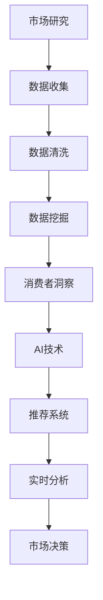

                 

# AI如何改变市场研究和消费者洞察

在数字经济的浪潮下，市场研究和消费者洞察正经历着一场深刻的变革。人工智能（AI）技术的引入，不仅极大地提升了数据的处理和分析能力，而且为市场研究带来了全新的思路和工具。本文将探讨AI如何革新市场研究和消费者洞察，并深入分析其核心概念、核心算法原理与操作步骤，最后给出实际应用场景、工具资源推荐，以及未来发展趋势与挑战。

## 1. 背景介绍

### 1.1 问题由来
市场研究和消费者洞察一直是企业决策的重要依据。传统上，市场研究依赖于问卷调查、焦点小组、观察等方法，这些方法耗时费力，成本高昂，且无法覆盖全体消费者。近年来，随着大数据和AI技术的发展，市场研究手段正在向数字化、智能化方向转变。AI技术的引入，使得市场研究能够实时捕捉消费者行为数据，自动化处理和分析海量数据，从而更快速、准确地获取消费者洞察，支撑企业决策。

### 1.2 问题核心关键点
AI在市场研究和消费者洞察中的应用，主要体现在以下几个方面：
1. 数据处理与分析：AI技术可以快速处理和分析大数据，发现消费者行为模式和趋势。
2. 消费者行为预测：AI模型可以基于历史数据和消费者行为，预测未来趋势和行为。
3. 实时反馈与优化：AI系统可以实时监控消费者反馈，动态调整市场策略。
4. 个性化推荐与定制：AI技术可以分析消费者偏好，提供个性化推荐和定制服务。

## 2. 核心概念与联系

### 2.1 核心概念概述

为更好地理解AI如何改变市场研究和消费者洞察，本节将介绍几个密切相关的核心概念：

- **市场研究**：指通过收集、分析和解释数据，来了解市场状况、消费者行为和产品需求的过程。
- **消费者洞察**：指深入理解消费者需求、动机和行为，以指导产品设计、营销策略和业务决策。
- **AI技术**：指基于机器学习、深度学习等技术的智能系统，能够自动处理和分析大量数据，并从中提取有价值的信息。
- **数据挖掘**：指从大规模数据中自动发现有用信息和知识的过程。
- **推荐系统**：指基于用户行为数据，为用户推荐商品、内容、服务等的过程。
- **实时分析**：指对数据进行实时处理和分析，以快速响应变化和优化策略。

这些核心概念之间的逻辑关系可以通过以下Mermaid流程图来展示：



这个流程图展示了大语言模型的核心概念及其之间的关系：

1. 市场研究从数据收集开始，经过数据清洗、数据挖掘，最终得到消费者洞察。
2. AI技术在数据挖掘、消费者洞察等环节起到关键作用。
3. 推荐系统和实时分析分别基于消费者洞察和AI技术，为市场决策提供支持。
4. 市场决策反过来又可以指导数据收集和分析，形成良性循环。

## 3. 核心算法原理 & 具体操作步骤

### 3.1 算法原理概述

AI在市场研究和消费者洞察中的应用，主要基于数据挖掘和机器学习技术。其核心思想是：通过数据收集和清洗，将消费者行为数据转化为可用于分析和预测的结构化数据。然后，利用机器学习算法从数据中发现模式和趋势，构建预测模型和推荐系统，最终实现对消费者行为的精准理解和预测。

### 3.2 算法步骤详解

AI在市场研究和消费者洞察中的应用，一般包括以下几个关键步骤：

**Step 1: 数据收集与清洗**
- 通过问卷调查、社交媒体、电商平台等渠道，收集消费者的行为数据。
- 对数据进行预处理，包括去重、填充缺失值、去除异常值等操作，确保数据质量。

**Step 2: 数据挖掘与特征工程**
- 使用数据挖掘算法，如关联规则挖掘、聚类分析、主成分分析（PCA）等，从数据中提取有用的特征和模式。
- 构建特征工程模型，通过特征选择、特征提取等方法，提高模型性能。

**Step 3: 机器学习建模与训练**
- 选择适合的机器学习算法，如线性回归、决策树、随机森林、神经网络等。
- 将数据划分为训练集和测试集，使用训练集数据训练模型，并使用测试集数据评估模型性能。
- 调整模型参数和超参数，优化模型性能，直到满足预设的评估指标。

**Step 4: 消费者洞察与预测**
- 将训练好的模型应用于新的数据，进行消费者行为的预测和分析。
- 使用预测结果指导市场研究，发现潜在消费者需求和市场趋势。
- 实时监控消费者反馈，动态调整模型和策略。

**Step 5: 推荐系统设计与部署**
- 基于消费者行为和偏好，设计推荐系统，提供个性化推荐和定制服务。
- 将推荐系统集成到电商平台、社交媒体等应用中，提升用户体验。
- 持续优化推荐系统，提高推荐效果和用户满意度。

以上是AI在市场研究和消费者洞察中的一般流程。在实际应用中，还需要根据具体场景，对各个环节进行优化设计，如改进特征工程模型、选择更适用的机器学习算法等。

### 3.3 算法优缺点

AI在市场研究和消费者洞察中的应用，具有以下优点：
1. 处理能力强：AI能够处理海量数据，挖掘复杂模式和趋势。
2. 分析精度高：AI模型基于统计学和机器学习原理，可以提供高精度的分析结果。
3. 实时响应快：AI系统可以实现实时数据处理和分析，快速响应市场变化。
4. 可扩展性好：AI模型可以通过增加数据和计算资源，实现性能的提升和扩展。

同时，该方法也存在一定的局限性：
1. 数据质量依赖高：AI分析结果依赖于数据的质量，数据偏差可能影响模型性能。
2. 模型复杂度高：AI模型需要大量的计算资源和专业知识进行训练和优化。
3. 解释性不足：AI模型通常缺乏可解释性，难以理解其内部工作机制。
4. 隐私保护问题：AI系统需要收集大量消费者数据，存在隐私泄露的风险。

尽管存在这些局限性，但就目前而言，AI在市场研究和消费者洞察中的应用已经取得了显著的成果。未来相关研究的方向将更多地聚焦于提高数据质量、降低模型复杂度、增强模型解释性和隐私保护等方面。

### 3.4 算法应用领域

AI在市场研究和消费者洞察中的应用，已经在多个领域得到了广泛的应用，例如：

- 零售电商：通过分析消费者购物数据，优化库存管理，提升销售额。
- 金融服务：基于消费者交易数据，进行信用评估、风险管理等。
- 健康医疗：分析患者健康数据，提供个性化医疗建议，优化治疗方案。
- 媒体娱乐：通过分析用户观看数据，推荐影视内容，提高用户粘性。
- 社交媒体：基于用户互动数据，进行情感分析，优化社区内容。

除了上述这些经典应用外，AI技术还正在不断拓展到更多场景中，如智能客服、智能家居、智慧城市等，为各行各业带来新的变革和机遇。随着AI技术的不断发展，相信其在市场研究和消费者洞察中的应用将更加广泛和深入。

## 4. 数学模型和公式 & 详细讲解  
### 4.1 数学模型构建

本节将使用数学语言对AI在市场研究和消费者洞察中的应用进行更加严格的刻画。

记消费者行为数据为 $\mathcal{X}=\{x_1, x_2, ..., x_N\}$，其中 $x_i$ 表示第 $i$ 个消费者的行为特征。目标是对这些数据进行挖掘和分析，以提取有用的信息和模式。

定义消费者行为与市场决策之间的关系为 $y=f(x)$，其中 $f$ 为模型函数，$y$ 为目标变量，表示市场决策。则AI的目标是通过数据挖掘和机器学习算法，找到最优的模型函数 $f(x)$。

**回归模型**：假设市场决策 $y$ 可以表示为消费者行为特征的线性组合，即 $y=\sum_{i=1}^n \beta_i x_i+\epsilon$，其中 $\beta_i$ 为模型参数，$\epsilon$ 为误差项。回归模型的最小二乘估计公式为：

$$
\hat{\beta} = (X^TX)^{-1}X^Ty
$$

其中 $X=[x_1, x_2, ..., x_n]$ 为特征矩阵，$\hat{\beta}$ 为模型参数估计值。

**分类模型**：对于二分类问题，假设市场决策 $y$ 可以表示为消费者行为特征的逻辑回归模型，即 $y=\sigma(\sum_{i=1}^n \beta_i x_i)$，其中 $\sigma$ 为逻辑函数，$\beta_i$ 为模型参数。分类模型的最大似然估计公式为：

$$
\hat{\beta} = (X^TX)^{-1}X^T\hat{y}
$$

其中 $\hat{y}$ 为真实标签向量。

**推荐系统模型**：基于协同过滤的思想，假设用户对商品 $i$ 的评分 $r_i$ 可以表示为用户 $j$ 的历史评分向量 $y_j$ 的线性组合，即 $r_i=\sum_{k=1}^m \theta_{ik}y_{jk}$，其中 $\theta_{ik}$ 为模型参数，$m$ 为商品数量。推荐系统的目标是通过最大化预测评分与实际评分的误差平方和，求解最优参数。

### 4.2 公式推导过程

以下我们以回归模型为例，推导最小二乘估计的计算公式。

设数据集为 $\{(x_1, y_1), (x_2, y_2), ..., (x_N, y_N)\}$，其中 $x_i=[x_{i1}, x_{i2}, ..., x_{in}]$ 为第 $i$ 个样本的特征向量，$y_i$ 为第 $i$ 个样本的目标变量。

回归模型为 $y=\sum_{i=1}^n \beta_i x_i+\epsilon$，其中 $\beta=[\beta_1, \beta_2, ..., \beta_n]^T$ 为模型参数。

最小二乘估计的目标是最小化预测误差平方和，即：

$$
\min_{\beta} \sum_{i=1}^N (y_i - \hat{y}_i)^2
$$

其中 $\hat{y}_i = \sum_{j=1}^n \beta_j x_{ij}$ 为第 $i$ 个样本的预测值。

将上述目标函数展开并求导，得：

$$
\frac{\partial}{\partial \beta} \sum_{i=1}^N (y_i - \hat{y}_i)^2 = -2X^T(y - \hat{y})
$$

令导数为0，得：

$$
X^TX \beta = X^Ty
$$

即：

$$
\beta = (X^TX)^{-1}X^Ty
$$

通过求解上述方程，可以得到回归模型的参数估计值。

### 4.3 案例分析与讲解

假设某电商平台希望通过分析消费者购买数据，预测销售额。可以收集电商平台的历史交易数据，包括消费者年龄、性别、购买频率、购买金额等特征，以及对应的销售额。将数据集划分为训练集和测试集，使用回归模型进行训练和测试。

具体步骤如下：
1. 数据预处理：对数据进行清洗、归一化等操作，去除异常值和缺失值。
2. 特征选择：通过特征工程，选择对销售额预测有帮助的特征，如消费者年龄、购买频率等。
3. 模型训练：使用最小二乘估计方法，训练回归模型，得到模型参数 $\hat{\beta}$。
4. 模型评估：使用测试集数据，评估模型性能，计算均方误差（MSE）和均方根误差（RMSE）。
5. 结果应用：将训练好的模型应用于新数据，预测销售额，指导库存管理和促销策略。

## 5. 项目实践：代码实例和详细解释说明
### 5.1 开发环境搭建

在进行AI在市场研究和消费者洞察中的应用实践前，我们需要准备好开发环境。以下是使用Python进行PyTorch开发的环境配置流程：

1. 安装Anaconda：从官网下载并安装Anaconda，用于创建独立的Python环境。

2. 创建并激活虚拟环境：
```bash
conda create -n pytorch-env python=3.8 
conda activate pytorch-env
```

3. 安装PyTorch：根据CUDA版本，从官网获取对应的安装命令。例如：
```bash
conda install pytorch torchvision torchaudio cudatoolkit=11.1 -c pytorch -c conda-forge
```

4. 安装各类工具包：
```bash
pip install numpy pandas scikit-learn matplotlib tqdm jupyter notebook ipython
```

完成上述步骤后，即可在`pytorch-env`环境中开始AI在市场研究和消费者洞察中的应用实践。

### 5.2 源代码详细实现

下面我们以电商平台销售预测为例，给出使用PyTorch进行回归模型训练的PyTorch代码实现。

首先，定义回归模型类：

```python
import torch
import torch.nn as nn
import torch.optim as optim

class LinearRegression(nn.Module):
    def __init__(self, input_dim, output_dim):
        super(LinearRegression, self).__init__()
        self.linear = nn.Linear(input_dim, output_dim)
        
    def forward(self, x):
        return self.linear(x)
```

然后，定义数据处理函数：

```python
import pandas as pd
from sklearn.model_selection import train_test_split
from sklearn.preprocessing import StandardScaler

def load_data(file_path):
    df = pd.read_csv(file_path)
    X = df.drop('y', axis=1)
    y = df['y']
    X_train, X_test, y_train, y_test = train_test_split(X, y, test_size=0.2, random_state=42)
    scaler = StandardScaler()
    X_train = scaler.fit_transform(X_train)
    X_test = scaler.transform(X_test)
    return X_train, X_test, y_train, y_test
```

接着，定义训练和评估函数：

```python
def train_model(model, optimizer, train_loader, device, n_epochs):
    model.train()
    for epoch in range(n_epochs):
        running_loss = 0.0
        for data, target in train_loader:
            data, target = data.to(device), target.to(device)
            optimizer.zero_grad()
            output = model(data)
            loss = nn.MSELoss()(output, target)
            loss.backward()
            optimizer.step()
            running_loss += loss.item()
        print(f'Epoch {epoch+1}, loss: {running_loss/len(train_loader)}')
    
def evaluate_model(model, test_loader, device):
    model.eval()
    running_loss = 0.0
    with torch.no_grad():
        for data, target in test_loader:
            data, target = data.to(device), target.to(device)
            output = model(data)
            loss = nn.MSELoss()(output, target)
            running_loss += loss.item()
    return running_loss/len(test_loader)
```

最后，启动训练流程并在测试集上评估：

```python
input_dim = 3
output_dim = 1
model = LinearRegression(input_dim, output_dim).to(device)
optimizer = optim.Adam(model.parameters(), lr=0.001)

X_train, X_test, y_train, y_test = load_data('sales_data.csv')
train_loader = torch.utils.data.DataLoader(X_train, batch_size=32, shuffle=True)
test_loader = torch.utils.data.DataLoader(X_test, batch_size=32, shuffle=False)

n_epochs = 100
device = torch.device('cuda' if torch.cuda.is_available() else 'cpu')

train_model(model, optimizer, train_loader, device, n_epochs)
test_loss = evaluate_model(model, test_loader, device)
print(f'Test loss: {test_loss:.4f}')
```

以上就是使用PyTorch对电商平台销售预测进行回归模型训练的完整代码实现。可以看到，得益于PyTorch的强大封装，我们可以用相对简洁的代码完成回归模型的训练。

### 5.3 代码解读与分析

让我们再详细解读一下关键代码的实现细节：

**LinearRegression类**：
- `__init__`方法：初始化线性回归模型，包括定义线性层。
- `forward`方法：前向传播，计算模型输出。

**load_data函数**：
- 加载数据集，并进行特征选择和归一化处理。
- 将数据集划分为训练集和测试集，并返回各部分的训练和测试数据。

**train_model函数**：
- 定义模型训练过程，包括前向传播、反向传播和参数更新。
- 使用均方误差（MSE）损失函数计算损失，并通过Adam优化器更新模型参数。
- 在每个epoch结束时输出平均损失。

**evaluate_model函数**：
- 定义模型评估过程，包括前向传播和损失计算。
- 使用均方误差（MSE）损失函数计算损失，并返回平均损失。
- 评估模型的性能，并在测试集上输出平均损失。

**训练流程**：
- 定义模型的输入维度和输出维度，创建模型和优化器。
- 加载训练集和测试集数据，并划分数据加载器。
- 定义训练epoch数和设备。
- 调用训练函数进行模型训练，并在每个epoch结束时输出平均损失。
- 调用评估函数在测试集上评估模型性能，输出平均损失。

可以看到，PyTorch框架使得回归模型的训练代码实现变得简洁高效。开发者可以将更多精力放在数据处理、模型改进等高层逻辑上，而不必过多关注底层的实现细节。

当然，工业级的系统实现还需考虑更多因素，如模型的保存和部署、超参数的自动搜索、更灵活的任务适配层等。但核心的回归模型训练过程基本与此类似。

## 6. 实际应用场景
### 6.1 智能客服系统

基于AI的市场研究和消费者洞察技术，可以广泛应用于智能客服系统的构建。传统客服往往需要配备大量人力，高峰期响应缓慢，且一致性和专业性难以保证。而使用AI技术，通过分析消费者咨询记录，可以构建智能客服系统，提升客服响应速度和质量。

在技术实现上，可以收集企业的历史客服咨询数据，进行情感分析和意图识别，构建知识库和回答模板。基于这些数据，构建AI驱动的客服模型，使其能够自动理解客户问题，匹配最合适的回答模板进行回复。对于客户提出的新问题，还可以接入检索系统实时搜索相关内容，动态组织生成回答。如此构建的智能客服系统，能大幅提升客户咨询体验和问题解决效率。

### 6.2 金融舆情监测

金融机构需要实时监测市场舆论动向，以便及时应对负面信息传播，规避金融风险。传统的人工监测方式成本高、效率低，难以应对网络时代海量信息爆发的挑战。基于AI的市场研究和消费者洞察技术，可以通过分析消费者交易数据和社交媒体信息，实时监测金融舆情，避免因市场信息不对称造成的损失。

具体而言，可以收集金融领域相关的新闻、报道、评论等文本数据，并对其进行主题标注和情感标注。在此基础上对AI模型进行微调，使其能够自动判断文本属于何种主题，情感倾向是正面、中性还是负面。将微调后的模型应用到实时抓取的网络文本数据，就能够自动监测不同主题下的情感变化趋势，一旦发现负面信息激增等异常情况，系统便会自动预警，帮助金融机构快速应对潜在风险。

### 6.3 个性化推荐系统

当前的推荐系统往往只依赖用户的历史行为数据进行物品推荐，无法深入理解用户的真实兴趣偏好。基于AI的市场研究和消费者洞察技术，可以分析消费者浏览、点击、评论、分享等行为数据，提取和用户交互的物品标题、描述、标签等文本内容。将文本内容作为模型输入，用户的后续行为（如是否点击、购买等）作为监督信号，在此基础上微调预训练语言模型。微调后的模型能够从文本内容中准确把握用户的兴趣点。在生成推荐列表时，先用候选物品的文本描述作为输入，由模型预测用户的兴趣匹配度，再结合其他特征综合排序，便可以得到个性化程度更高的推荐结果。

### 6.4 未来应用展望

随着AI在市场研究和消费者洞察中的应用不断深入，未来将会有更多创新应用场景涌现。

在智慧医疗领域，基于AI的市场研究和消费者洞察技术，可以用于分析患者健康数据，提供个性化医疗建议，优化治疗方案。例如，通过分析患者的历史医疗记录和社交媒体信息，可以发现患者的病情变化和心理健康状态，及时调整治疗策略。

在智能教育领域，AI技术可以用于分析学生的学习行为数据，提供个性化学习建议和资源推荐，帮助学生高效学习。例如，通过分析学生的学习记录和在线测试成绩，可以发现学生的薄弱环节，并推荐相应的学习资源和辅导。

在智慧城市治理中，AI技术可以用于分析城市居民的出行数据和消费数据，优化交通管理和城市规划。例如，通过分析居民的出行路线和消费习惯，可以优化公共交通和商业布局，提高城市运行的效率和居民的生活质量。

此外，在企业生产、社会治理、文娱传媒等众多领域，基于AI的市场研究和消费者洞察技术也将不断拓展，为各行各业带来新的变革和机遇。相信随着AI技术的不断发展，其在市场研究和消费者洞察中的应用将更加广泛和深入，为经济社会发展注入新的动力。

## 7. 工具和资源推荐
### 7.1 学习资源推荐

为了帮助开发者系统掌握AI在市场研究和消费者洞察中的应用，这里推荐一些优质的学习资源：

1. Coursera《机器学习》课程：由斯坦福大学Andrew Ng教授主讲，全面介绍机器学习的基本原理和算法，是学习AI的入门级课程。
2. 《Python机器学习》书籍：Hands-On Machine Learning with Scikit-Learn、TensorFlow和PyTorch，由Aurélien Géron撰写，详细介绍Python和机器学习的实战应用。
3. 《深度学习》书籍：Deep Learning by Ian Goodfellow, Yoshua Bengio, and Aaron Courville，全面介绍深度学习的原理和实践，适合深入学习。
4. Kaggle：全球最大的数据科学竞赛平台，提供大量实际案例和开源数据集，适合实战练习。
5. HuggingFace官方文档：提供丰富的预训练语言模型和机器学习库，适合进行实际应用开发。

通过对这些资源的学习实践，相信你一定能够快速掌握AI在市场研究和消费者洞察中的应用，并用于解决实际的NLP问题。
### 7.2 开发工具推荐

高效的开发离不开优秀的工具支持。以下是几款用于AI在市场研究和消费者洞察中应用的常用工具：

1. PyTorch：基于Python的开源深度学习框架，灵活动态的计算图，适合快速迭代研究。
2. TensorFlow：由Google主导开发的开源深度学习框架，生产部署方便，适合大规模工程应用。
3. Weights & Biases：模型训练的实验跟踪工具，可以记录和可视化模型训练过程中的各项指标，方便对比和调优。
4. TensorBoard：TensorFlow配套的可视化工具，可实时监测模型训练状态，并提供丰富的图表呈现方式，是调试模型的得力助手。
5. Jupyter Notebook：交互式编程环境，支持代码、文本、图表等格式的混合展示，适合进行数据处理和模型训练。

合理利用这些工具，可以显著提升AI在市场研究和消费者洞察中的应用开发效率，加快创新迭代的步伐。

### 7.3 相关论文推荐

AI在市场研究和消费者洞察中的应用，源于学界的持续研究。以下是几篇奠基性的相关论文，推荐阅读：

1. Neural Collaborative Filtering（Netflix Prize比赛论文）：提出了基于协同过滤的推荐系统，通过因子分解机解决推荐问题。
2. Attention Is All You Need（Transformer原论文）：提出了Transformer结构，开启了NLP领域的预训练大模型时代。
3. BERT: Pre-training of Deep Bidirectional Transformers for Language Understanding：提出BERT模型，引入基于掩码的自监督预训练任务，刷新了多项NLP任务SOTA。
4. Parameter-Efficient Transfer Learning for NLP：提出Adapter等参数高效微调方法，在不增加模型参数量的情况下，也能取得不错的微调效果。
5. MIMO Causal Attention（MIMO CA）：提出了一种因果自注意力机制，解决了长序列建模问题，提升了模型的泛化能力。

这些论文代表了大语言模型微调技术的发展脉络。通过学习这些前沿成果，可以帮助研究者把握学科前进方向，激发更多的创新灵感。

## 8. 总结：未来发展趋势与挑战

### 8.1 总结

本文对AI在市场研究和消费者洞察中的应用进行了全面系统的介绍。首先阐述了AI技术在市场研究和消费者洞察中的重要性，明确了AI技术在提升数据处理和分析能力、实现消费者行为预测等方面的独特价值。其次，从原理到实践，详细讲解了AI技术在市场研究和消费者洞察中的应用步骤，给出了AI在电商、金融、医疗等多个领域的应用实例。

通过本文的系统梳理，可以看到，AI技术在市场研究和消费者洞察中的应用正在迅速扩展，为各行业带来了新的创新和机遇。AI技术不仅能够处理海量数据，发现消费者行为模式和趋势，还能够实时响应市场变化，提供个性化推荐和定制服务。这些特性使得AI技术成为市场研究和消费者洞察的重要工具，推动了各行各业向智能化、个性化方向发展。

### 8.2 未来发展趋势

展望未来，AI在市场研究和消费者洞察中的应用将呈现以下几个发展趋势：

1. 数据规模持续增大。随着传感器、互联网、物联网等技术的发展，数据采集和存储能力将大幅提升，AI系统可以处理的数据规模将进一步扩大。
2. 模型复杂度不断提升。深度学习和强化学习等技术的发展，将推动AI模型的复杂度提升，从而实现更高级别的智能决策和自动化分析。
3. 实时性要求越来越高。实时数据处理和分析技术的发展，将使得AI系统能够实现实时监控和预警，提高决策的及时性和准确性。
4. 个性化程度不断增强。通过深入分析消费者行为数据，AI系统可以提供更精准、更个性化的推荐和定制服务，提升用户体验。
5. 跨领域应用越来越广泛。AI技术可以应用于更多领域，如智能制造、智能交通、智能安防等，实现跨领域数据融合和智能协同。
6. 模型可解释性增强。AI技术的进步，将推动模型可解释性研究，帮助用户理解模型的内部工作机制，增强算法的透明性和可信度。

以上趋势凸显了AI在市场研究和消费者洞察中的应用潜力。这些方向的探索发展，必将进一步提升AI系统在数据处理、分析、预测等方面的性能，推动市场研究和消费者洞察技术的不断进步。

### 8.3 面临的挑战

尽管AI在市场研究和消费者洞察中的应用已经取得了显著的成果，但在迈向更加智能化、普适化应用的过程中，它仍面临着诸多挑战：

1. 数据质量瓶颈。尽管AI系统可以处理大规模数据，但数据质量（如标注准确性、数据完整性等）仍是制约系统性能的重要因素。如何提高数据质量，减少数据偏差，仍然是一个重要的研究方向。
2. 模型复杂度提升。随着AI模型的复杂度提升，对计算资源和专业知识的要求也越来越高。如何降低模型复杂度，提高训练效率，仍然是一个需要不断攻克的难题。
3. 隐私保护问题。AI系统需要收集大量消费者数据，存在隐私泄露的风险。如何保护消费者隐私，确保数据安全，仍是一个需要解决的重要问题。
4. 模型可解释性不足。AI系统通常缺乏可解释性，难以理解其内部工作机制和决策逻辑。如何增强模型可解释性，提高系统的透明性和可信度，仍是一个亟待解决的问题。
5. 技术壁垒高。AI技术需要大量研发投入，对团队的技术水平和资金实力要求较高。如何降低技术壁垒，提高技术的普及性和可接受性，仍是一个需要解决的重要问题。

尽管存在这些挑战，但AI在市场研究和消费者洞察中的应用已经展示了巨大的潜力和前景。未来，通过不断优化数据质量、降低模型复杂度、增强模型可解释性、保护消费者隐私等措施，AI技术必将在市场研究和消费者洞察中发挥更大的作用，为各行各业带来更多的创新和价值。

### 8.4 研究展望

面向未来，AI在市场研究和消费者洞察中的应用，需要从以下几个方面进行深入研究：

1. 数据质量提升技术。通过数据清洗、去噪、标注等技术，提高数据质量，减少数据偏差。
2. 模型压缩与优化技术。通过模型剪枝、量化、蒸馏等技术，降低模型复杂度，提高训练效率。
3. 模型可解释性研究。通过因果分析、对比学习等方法，提高模型的可解释性，增强系统的透明性和可信度。
4. 隐私保护技术。通过差分隐私、联邦学习等技术，保护消费者隐私，确保数据安全。
5. 跨领域数据融合技术。通过数据整合、知识图谱等技术，实现跨领域数据融合，提升系统的智能化水平。

这些研究方向的探索，必将推动AI在市场研究和消费者洞察中的应用走向成熟，为各行各业带来更多的创新和价值。相信在不断优化和进步中，AI技术将在市场研究和消费者洞察中发挥更大的作用，推动智能化社会的进步和发展。

## 9. 附录：常见问题与解答

**Q1：AI在市场研究和消费者洞察中的应用是否适合所有行业？**

A: AI在市场研究和消费者洞察中的应用，已经在电商、金融、医疗、媒体等多个行业中得到了广泛应用。但对于一些特定行业，如农业、航空航天等，由于数据特性和业务逻辑的特殊性，AI技术的适用性需要进一步验证。需要根据具体业务场景，选择合适的技术和方法。

**Q2：AI在市场研究和消费者洞察中的应用是否需要大量标注数据？**

A: 对于基于监督学习的AI模型，标注数据是训练模型的重要依据。然而，随着无监督学习和半监督学习技术的发展，AI模型可以通过无标注数据和部分标注数据进行训练，减少对标注数据的依赖。此外，可以通过数据增强、数据合成等技术，提升数据质量，进一步降低对标注数据的依赖。

**Q3：AI在市场研究和消费者洞察中的应用是否需要高昂的计算资源？**

A: AI模型在训练和推理过程中，确实需要大量的计算资源，但随着硬件技术的发展，如GPU、TPU等高性能设备的普及，以及云计算、分布式训练等技术的应用，AI模型的训练和推理成本已经大幅降低。未来，随着计算资源价格的进一步下降，AI模型在市场研究和消费者洞察中的应用将更加普及和便捷。

**Q4：AI在市场研究和消费者洞察中的应用是否需要高超的技术水平？**

A: 是的，AI在市场研究和消费者洞察中的应用需要高超的技术水平。包括数据预处理、特征工程、模型选择、参数调优等环节，都需要专业知识和技能。但是，随着AI技术的不断普及，各种开源工具和框架的不断完善，开发者可以通过学习这些工具和框架，快速上手AI技术的应用开发。

**Q5：AI在市场研究和消费者洞察中的应用是否需要持续的模型更新？**

A: 是的，AI模型在实际应用中，需要持续的模型更新和优化。随着业务场景的变化和数据量的积累，AI模型需要不断迭代和优化，以保持模型的性能和效果。持续的模型更新和优化，是保证AI系统长期有效运行的关键。

---

作者：禅与计算机程序设计艺术 / Zen and the Art of Computer Programming

