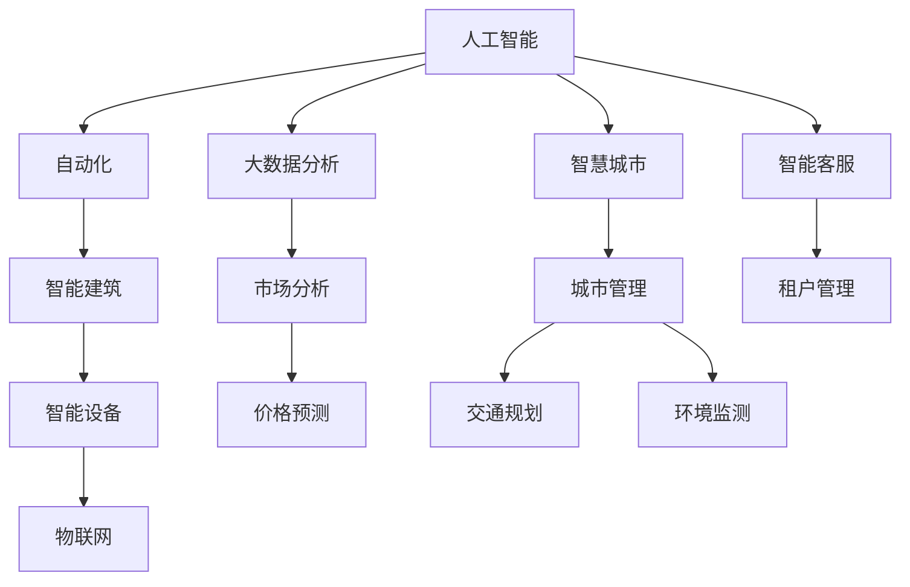

                 

# AI如何改变房地产市场和物业管理

> 关键词：人工智能,房地产市场,物业管理,自动化,大数据分析,智慧城市

## 1. 背景介绍

### 1.1 问题由来
房地产行业长期以来面临着复杂多变的环境和众多的管理挑战，尤其是在快速城市化的大背景下。传统的房地产和物业管理依赖于人工操作，效率低下，错误率高，且难以应对快速变化的市场需求。近年来，随着人工智能技术的不断突破，AI开始逐步渗透到房地产和物业管理的各个环节，带来了前所未有的机遇和挑战。

### 1.2 问题核心关键点
- 传统房地产和物业管理的痛点
- 人工智能技术在房地产和物业管理中的应用
- AI改变房地产和物业管理的具体方式
- 未来发展趋势与挑战

### 1.3 问题研究意义
研究AI如何改变房地产市场和物业管理，对于提升行业效率，优化管理模式，促进可持续发展具有重要意义。AI技术的引入，可以显著降低人力成本，提高决策速度和准确性，并能够为业主和租户提供更加个性化、高效的服务。此外，AI的参与还可以提升市场透明度，优化资源配置，推动智慧城市建设。

## 2. 核心概念与联系

### 2.1 核心概念概述

为更好地理解AI在房地产和物业管理中的应用，本节将介绍几个密切相关的核心概念：

- 人工智能(AI)：通过计算机系统模拟人类智能行为，实现感知、理解、学习、推理、决策等功能的技术。
- 房地产市场：房地产的供求关系、价格波动、市场趋势等要素构成的市场环境。
- 物业管理：房地产管理和运营的各项工作，包括租户管理、设施维护、服务提供等。
- 大数据分析：利用数据挖掘、机器学习等技术对海量数据进行分析和建模，发现隐藏的知识和规律。
- 智慧城市：依托物联网、大数据、云计算等技术，构建智能化的城市管理系统，提升城市运营效率和居民生活质量。
- 自动化(Automation)：使用机器人、自动化工具等，自动完成重复性、低价值的操作，提高效率和精度。

这些核心概念之间的逻辑关系可以通过以下Mermaid流程图来展示：



这个流程图展示了大数据、智慧城市、自动化等技术如何通过AI在房地产市场和物业管理中的应用，从不同层面提升了行业的效率和质量。

## 3. 核心算法原理 & 具体操作步骤
### 3.1 算法原理概述

AI在房地产市场和物业管理中的应用，主要基于数据驱动和智能算法。核心思想是通过数据收集和处理，结合机器学习、深度学习等技术，实现自动化、智能化的决策和管理。

具体来说，AI在房地产和物业管理中的应用主要分为以下几个步骤：

1. 数据收集与预处理
2. 特征提取与建模
3. 模型训练与优化
4. 智能决策与执行

### 3.2 算法步骤详解

#### 3.2.1 数据收集与预处理
- 收集房地产市场的数据：如市场供需情况、价格波动、区域规划等。
- 收集物业管理的各类数据：如设施维护记录、用户投诉、租赁合同等。
- 数据清洗与标注：去除噪声数据，进行数据标注，构建训练集和验证集。

#### 3.2.2 特征提取与建模
- 特征工程：提取文本、图像、时间序列等类型的特征。
- 模型选择：选择适合问题的模型，如分类、回归、聚类等。
- 模型训练：使用训练集数据，训练模型参数。
- 模型评估：使用验证集数据，评估模型性能。

#### 3.2.3 模型训练与优化
- 超参数调优：调整学习率、批大小、正则化等超参数，优化模型性能。
- 模型集成：使用集成学习，提升模型的稳定性和泛化能力。
- 迁移学习：利用预训练模型，快速适应新任务，提升模型效果。

#### 3.2.4 智能决策与执行
- 决策制定：基于模型输出，制定自动化决策。
- 执行监控：监控执行效果，必要时调整决策参数。
- 用户反馈：收集用户反馈，迭代优化模型和决策系统。

### 3.3 算法优缺点

AI在房地产市场和物业管理中的应用，具有以下优点：

- 效率提升：AI可以自动完成大量重复性操作，提高工作效率。
- 决策优化：基于数据分析的智能决策，提升决策的准确性和公正性。
- 服务个性化：通过大数据分析，为每个用户提供个性化服务。
- 问题预测：利用AI预测市场趋势和设备故障，提前采取措施。

同时，也存在一些缺点：

- 数据质量依赖：AI的效果很大程度上取决于数据的质量，数据不完整或不准确会影响模型性能。
- 算法复杂度：构建和训练复杂的AI模型需要高水平的工程师，开发成本较高。
- 透明性不足：AI决策过程复杂，难以解释和审计。
- 安全与隐私问题：AI可能存在偏见或歧视，保护用户隐私也需要严格措施。

### 3.4 算法应用领域

AI在房地产市场和物业管理中的应用，覆盖了多个领域，包括：

- 智能客服：基于聊天机器人等AI技术，提供24小时在线客服，解决用户问题。
- 市场分析：利用大数据分析，预测房地产市场趋势，帮助决策者制定策略。
- 设备维护：使用AI预测设备故障，自动安排维护计划，提升设施维护效率。
- 能源管理：基于AI优化建筑能耗，降低运营成本，提升环保水平。
- 安全监控：利用智能摄像头和传感器，实时监控小区安全，提升安全管理水平。
- 租赁管理：AI分析租户行为数据，提供精准的租户筛选和租赁方案，提高租赁效率。
- 环境监测：使用AI分析环境数据，优化小区环境管理，提升居民生活质量。

这些应用场景展示了AI在房地产市场和物业管理中的广泛应用，为提升行业效率和用户满意度提供了新的可能性。

## 4. 数学模型和公式 & 详细讲解 & 举例说明

### 4.1 数学模型构建

假设有一个房地产市场数据集，其中包含房屋类型、价格、面积等属性。我们希望使用AI模型预测某类房屋的价格。设模型输入为$x=(x_1, x_2, ..., x_n)$，模型输出为$y$，则预测价格的模型可以表示为：

$$
y = f(x; \theta)
$$

其中$f$为预测函数，$\theta$为模型参数。

### 4.2 公式推导过程

对于线性回归模型，预测函数$f(x; \theta)$可以表示为：

$$
f(x; \theta) = \theta_0 + \theta_1 x_1 + \theta_2 x_2 + ... + \theta_n x_n
$$

其中$\theta_0, \theta_1, \theta_2, ..., \theta_n$为模型参数。

假设训练集为$D=\{(x_i, y_i)\}_{i=1}^m$，则均方误差损失函数为：

$$
L(y, \hat{y}) = \frac{1}{2m} \sum_{i=1}^m (y_i - \hat{y}_i)^2
$$

其中$\hat{y}_i = f(x_i; \theta)$为预测值。

模型的训练目标是最小化损失函数，即：

$$
\theta^* = \mathop{\arg\min}_{\theta} L(y, \hat{y})
$$

利用梯度下降算法，更新参数$\theta$：

$$
\theta_k \leftarrow \theta_k - \eta \nabla_{\theta}L(y, \hat{y})
$$

其中$\eta$为学习率，$\nabla_{\theta}L(y, \hat{y})$为损失函数对参数$\theta$的梯度。

### 4.3 案例分析与讲解

#### 案例1：房价预测
使用线性回归模型预测房价，构建训练集和验证集，使用均方误差作为损失函数，训练模型参数，最终进行房价预测。

#### 案例2：智能客服
利用自然语言处理技术，训练模型识别用户意图，使用基于规则和机器学习的策略进行智能应答，提高客服效率和用户体验。

## 5. 项目实践：代码实例和详细解释说明
### 5.1 开发环境搭建

在进行AI项目实践前，我们需要准备好开发环境。以下是使用Python进行TensorFlow开发的环境配置流程：

1. 安装Anaconda：从官网下载并安装Anaconda，用于创建独立的Python环境。

2. 创建并激活虚拟环境：
```bash
conda create -n tf-env python=3.8 
conda activate tf-env
```

3. 安装TensorFlow：
```bash
conda install tensorflow==2.6
```

4. 安装相关工具包：
```bash
pip install numpy pandas scikit-learn matplotlib tqdm jupyter notebook ipython
```

完成上述步骤后，即可在`tf-env`环境中开始AI项目实践。

### 5.2 源代码详细实现

下面我们以房价预测为例，给出使用TensorFlow进行AI项目开发的PyTorch代码实现。

首先，定义房价预测模型的输入输出：

```python
import tensorflow as tf

# 输入特征
input_features = tf.keras.Input(shape=(4,), name='input')

# 输出价格
output_price = tf.keras.layers.Dense(1, activation='linear')(input_features)

# 构建模型
model = tf.keras.Model(inputs=input_features, outputs=output_price)

# 编译模型
model.compile(optimizer=tf.keras.optimizers.Adam(learning_rate=0.001),
              loss=tf.keras.losses.MeanSquaredError())
```

然后，定义数据处理函数：

```python
def load_data():
    # 加载房价数据
    train_data = pd.read_csv('train.csv')
    test_data = pd.read_csv('test.csv')
    
    # 特征处理
    train_x = train_data[['面积', '户型', '朝向', '位置']]
    train_y = train_data['价格']
    test_x = test_data[['面积', '户型', '朝向', '位置']]
    
    # 数据归一化
    train_x = (train_x - train_x.mean()) / train_x.std()
    test_x = (test_x - train_x.mean()) / train_x.std()
    
    return train_x, train_y, test_x
```

接着，定义训练函数：

```python
def train_model(model, train_x, train_y, test_x):
    # 训练模型
    history = model.fit(train_x, train_y, 
                       validation_data=(test_x, test_x.mean()),
                       epochs=100, batch_size=32, verbose=1)
    
    # 保存模型
    model.save('housing_model.h5')
    
    return history
```

最后，启动训练流程并在测试集上评估：

```python
# 加载数据
train_x, train_y, test_x = load_data()

# 训练模型
history = train_model(model, train_x, train_y, test_x)

# 加载模型
loaded_model = tf.keras.models.load_model('housing_model.h5')

# 评估模型
test_y_pred = loaded_model.predict(test_x)
print('MSE:', tf.keras.losses.mean_squared_error(test_y, test_y_pred).numpy())
```

以上就是使用TensorFlow进行房价预测的完整代码实现。可以看到，TensorFlow提供了便捷的高级API，使得模型构建、训练和评估变得相对简单。

### 5.3 代码解读与分析

让我们再详细解读一下关键代码的实现细节：

**模型定义**：
- `tf.keras.Input`：定义输入层的维度和名称。
- `tf.keras.layers.Dense`：定义全连接层，激活函数为线性函数。
- `tf.keras.Model`：将输入和输出连接起来，构建模型。
- `model.compile`：编译模型，设置优化器和损失函数。

**数据处理函数**：
- `load_data`：加载数据集，并进行特征处理和归一化。
- 将数据集划分为训练集和测试集，返回训练数据、标签和测试数据。

**训练函数**：
- `train_model`：定义训练过程，使用`fit`方法进行模型训练。
- `validation_data`：指定验证集数据，这里使用测试集进行验证。
- `epochs`和`batch_size`：设置训练轮数和批大小。
- `verbose`：控制训练过程中输出的详细信息。

**模型评估**：
- 加载训练好的模型，并使用`predict`方法进行预测。
- 计算预测值与真实值之间的均方误差，评估模型性能。

可以看到，TensorFlow提供了一整套高效的深度学习开发框架，使得AI项目开发变得方便快捷。开发者只需关注模型设计和数据处理，其他细节如优化器、损失函数、学习率等都由框架自动完成。

当然，工业级的系统实现还需考虑更多因素，如模型的保存和部署、超参数的自动搜索、更灵活的任务适配层等。但核心的AI模型构建和训练流程基本与此类似。

## 6. 实际应用场景
### 6.1 智能客服系统

基于AI的智能客服系统，可以24小时不间断服务，快速响应客户咨询，用自然流畅的语言解答各类常见问题。系统通过收集历史客服对话记录，训练聊天机器人模型，能够自动理解用户意图，匹配最合适的回答。对于新问题，系统还能接入检索系统实时搜索相关内容，动态组织生成回答。如此构建的智能客服系统，能大幅提升客户咨询体验和问题解决效率。

### 6.2 市场分析与决策支持

AI在房地产市场分析中的应用，可以帮助决策者快速把握市场趋势，预测价格波动，制定精准的策略。通过收集历史价格数据、政策变化、供需情况等，训练价格预测模型，可以提前预判市场走向，优化资源配置，提高决策的科学性和有效性。例如，在房地产市场过热时，可以通过价格预测模型发出预警，避免投资失误。

### 6.3 设备维护与设施管理

AI在设备维护中的应用，可以提前预测设备故障，自动安排维护计划，提升设施管理效率。通过收集设备运行数据，训练预测模型，实时监控设备状态，及时发现异常情况。例如，在电梯故障前，系统可以提前通知维护人员进行检修，减少设备停机时间，保障客户满意度。

### 6.4 安全监控与应急响应

AI在安全监控中的应用，可以实时监控小区安全，提高应急响应速度。通过智能摄像头和传感器，实时采集视频和数据，利用图像识别和行为分析技术，识别异常情况。例如，在检测到火灾或非法入侵时，系统可以自动报警，通知安保人员进行处理，保障居民安全。

### 6.5 租赁管理与租户筛选

AI在租赁管理中的应用，可以提供精准的租户筛选和租赁方案，提高租赁效率。通过分析租户历史行为数据，训练评分模型，评估租户信用和满意度。例如，在筛选租户时，系统可以自动推荐符合要求的租户，减少人工审核时间，提高租赁成功率。

### 6.6 环境监测与智能家居

AI在环境监测中的应用，可以优化小区环境管理，提升居民生活质量。通过智能传感器，实时采集环境数据，利用机器学习模型，预测空气质量、温度等参数。例如，在空气质量不佳时，系统可以自动开启空气净化器，调整温湿度设置，改善居民生活环境。

## 7. 工具和资源推荐
### 7.1 学习资源推荐

为了帮助开发者系统掌握AI在房地产市场和物业管理中的应用，这里推荐一些优质的学习资源：

1. TensorFlow官方文档：TensorFlow官方提供的全面教程和文档，涵盖从入门到高级的所有内容，是TensorFlow开发的首选资源。

2. Keras官方文档：Keras官方提供的快速入门指南，简单易懂，适合初学者快速上手。

3. DeepLearning.ai课程：斯坦福大学开设的深度学习课程，涵盖深度学习的基本原理和应用，适合系统学习。

4. 《深度学习入门》书籍：李沐所著，系统介绍了深度学习的基本概念和常用技术，适合初学者和进阶者。

5. AI与房地产相关的博客和论坛：如AI Journal、知乎AI专栏等，可以获取最新的AI研究和应用动态。

通过对这些资源的学习实践，相信你一定能够快速掌握AI在房地产市场和物业管理中的应用，并用于解决实际的AI问题。

### 7.2 开发工具推荐

高效的开发离不开优秀的工具支持。以下是几款用于AI开发和应用的工具：

1. TensorFlow：由Google主导开发的开源深度学习框架，生产部署方便，适合大规模工程应用。

2. PyTorch：基于Python的开源深度学习框架，灵活性高，适合快速迭代研究。

3. TensorBoard：TensorFlow配套的可视化工具，可实时监测模型训练状态，提供丰富的图表呈现方式。

4. Weights & Biases：模型训练的实验跟踪工具，记录和可视化模型训练过程中的各项指标，方便对比和调优。

5. Jupyter Notebook：交互式编程环境，支持代码编写、数据处理和模型训练，方便快速开发和调试。

6. Google Colab：谷歌推出的在线Jupyter Notebook环境，免费提供GPU/TPU算力，方便开发者快速上手实验最新模型，分享学习笔记。

合理利用这些工具，可以显著提升AI项目开发的效率，加快创新迭代的步伐。

### 7.3 相关论文推荐

AI在房地产市场和物业管理中的应用，近年来得到了学术界的广泛关注。以下是几篇奠基性的相关论文，推荐阅读：

1. Real-Time Scene Understanding with a Mobile Phone Camera (2009)：利用摄像头和深度学习模型，实时理解场景信息，为智能监控和交互提供基础。

2. Deep Residual Learning for Image Recognition (2015)：提出深度残差网络，解决深度网络训练中的梯度消失问题，为AI在视觉识别中的应用奠定了基础。

3. Attention is All You Need (2017)：提出Transformer结构，开启了NLP领域的预训练大模型时代，为AI在自然语言处理中的应用提供了新的思路。

4. BERT: Pre-training of Deep Bidirectional Transformers for Language Understanding (2018)：提出BERT模型，引入基于掩码的自监督预训练任务，刷新了多项NLP任务SOTA。

5. Revisiting Pre-trained Representations for Text Classification and Sequence Labeling (2019)：利用预训练模型进行文本分类和序列标注，提升了模型的泛化能力和鲁棒性。

6. Building Transferable Architectures for Mobile Health Question Answering (2020)：提出可转移的AI架构，提高了医疗问答系统的精准性和稳定性。

这些论文代表了大语言模型微调技术的发展脉络。通过学习这些前沿成果，可以帮助研究者把握学科前进方向，激发更多的创新灵感。

## 8. 总结：未来发展趋势与挑战

### 8.1 总结

本文对AI在房地产市场和物业管理中的应用进行了全面系统的介绍。首先阐述了AI在房地产和物业管理中的应用背景和意义，明确了AI技术在提高效率、优化管理模式、推动可持续发展等方面的独特价值。其次，从原理到实践，详细讲解了AI在房地产和物业管理中的应用步骤和方法，给出了AI项目开发的完整代码实例。同时，本文还广泛探讨了AI技术在智能客服、市场分析、设备维护等多个行业领域的应用前景，展示了AI技术的广泛应用潜力。最后，本文精选了AI技术的相关学习资源，力求为读者提供全方位的技术指引。

通过本文的系统梳理，可以看到，AI在房地产市场和物业管理中的应用，已经从理论研究走向了实际应用，为提升行业效率和用户满意度提供了新的可能性。未来，伴随AI技术的不断进步，AI在房地产和物业管理中的应用将更加广泛和深入，为推动行业智能化升级做出更大贡献。

### 8.2 未来发展趋势

展望未来，AI在房地产市场和物业管理中的应用将呈现以下几个发展趋势：

1. 自动化水平提升：AI将进一步渗透到各个环节，实现高度自动化的管理和服务。例如，AI可以自动完成房产租赁、设备维护、客户服务等任务，极大提升效率和准确性。

2. 数据驱动决策：基于大数据和AI的决策支持系统将越来越普及，帮助决策者快速把握市场趋势，制定精准的策略。例如，AI可以分析市场数据，预测价格波动，优化资源配置。

3. 智能家居普及：AI在智能家居中的应用将越来越广泛，通过智能设备互联，实现家居环境的智能化管理。例如，AI可以自动控制家电设备，优化居住环境，提升生活质量。

4. 环境监测与生态保护：AI在环境监测中的应用将越来越重要，帮助实现可持续发展的目标。例如，AI可以实时监测环境数据，优化资源配置，减少污染排放。

5. 人机协同交互：AI与人的交互将更加智能和自然，提升用户体验。例如，AI可以自动回答客户问题，提供个性化的服务方案，提升客户满意度。

6. 跨领域融合：AI将在不同领域之间实现更广泛的融合，推动智慧城市的建设。例如，AI可以协同交通、医疗、教育等领域的数据，实现跨领域的数据共享和协同创新。

以上趋势凸显了AI在房地产市场和物业管理中的广阔前景。这些方向的探索发展，必将进一步提升AI系统的效果和应用范围，为推动房地产行业的智能化升级做出更大贡献。

### 8.3 面临的挑战

尽管AI在房地产市场和物业管理中的应用已经取得了显著成效，但在迈向更加智能化、普适化应用的过程中，仍然面临诸多挑战：

1. 数据质量问题：AI的效果很大程度上取决于数据的质量，数据不完整或不准确会影响模型性能。例如，房产数据可能存在遗漏或不一致，影响价格预测模型的效果。

2. 算法复杂度：构建和训练复杂的AI模型需要高水平的工程师，开发成本较高。例如，深度学习模型需要大量的计算资源和数据预处理工作。

3. 透明性不足：AI决策过程复杂，难以解释和审计。例如，智能客服系统如何理解客户意图，生成最佳回答，需要解释和验证。

4. 安全与隐私问题：AI可能存在偏见或歧视，保护用户隐私也需要严格措施。例如，AI在租赁筛选中可能存在歧视，导致不公平现象。

5. 资源需求高：AI需要大量的计算资源和存储空间，部署成本较高。例如，大规模的深度学习模型需要高性能计算设备和大量的存储空间。

6. 法规与伦理问题：AI在房地产和物业管理中的应用需要遵循相关法规和伦理规范，避免潜在的法律风险和道德问题。例如，AI在租赁筛选中需要遵守公平性原则，避免歧视现象。

这些挑战需要行业各方共同努力，通过技术创新和制度完善，逐步克服，推动AI技术的健康发展。

### 8.4 研究展望

面向未来，AI在房地产市场和物业管理中的应用，需要在以下几个方面寻求新的突破：

1. 数据质量提升：通过数据清洗、标注和增强，提高数据质量，增强模型的泛化能力和鲁棒性。例如，利用数据增强技术，生成更多训练样本，提升模型的准确性。

2. 算法优化：开发更加高效、轻量级的AI算法，减少资源消耗，提升系统的实时性和可扩展性。例如，使用剪枝、量化等技术，优化模型结构。

3. 跨领域融合：推动AI与其他技术（如物联网、云计算、区块链等）的融合，实现跨领域的数据共享和协同创新。例如，利用区块链技术，实现数据的安全共享和透明化。

4. 人机协同：开发更加智能和自然的AI模型，提升人机交互的体验和效率。例如，使用生成对抗网络(GAN)等技术，提升AI生成文本的自然性和真实性。

5. 法规与伦理：制定AI应用的法规和伦理规范，确保AI应用的公平性、透明性和安全性。例如，建立AI伦理委员会，制定相关标准和规范。

6. 用户教育：提高用户对AI技术的认知和理解，增强用户对AI的信任和接受度。例如，开展AI技术的普及教育，提高用户对AI的认知和理解。

这些研究方向的探索，必将引领AI技术在房地产市场和物业管理中的应用迈向更高的台阶，为推动行业智能化升级做出更大贡献。面向未来，AI在房地产和物业管理中的应用还需要与其他人工智能技术进行更深入的融合，如知识表示、因果推理、强化学习等，多路径协同发力，共同推动房地产行业的智能化进程。

## 9. 附录：常见问题与解答

**Q1：AI在房地产市场和物业管理中的应用，是否需要大量的标注数据？**

A: AI在房地产市场和物业管理中的应用，确实需要大量的标注数据。例如，在房价预测和市场分析中，需要大量的历史价格数据和市场信息。在智能客服和租赁管理中，需要大量的客户反馈数据和租赁行为数据。这些数据是构建准确模型的基础，标注成本较高，但可以通过数据增强和迁移学习等技术，减少对标注数据的依赖。

**Q2：AI在市场分析中的应用，是否需要实时数据？**

A: AI在市场分析中的应用，确实需要实时数据。例如，在房价预测和市场趋势预测中，需要实时收集和处理市场数据，才能及时调整模型参数，预测未来走势。市场环境变化较快，实时数据可以帮助决策者快速把握市场动态，制定精准的策略。

**Q3：AI在智能客服中的应用，是否需要大量人力客服？**

A: AI在智能客服中的应用，可以大大减少对大量人力客服的依赖。例如，智能客服系统可以24小时不间断服务，快速响应客户咨询，用自然流畅的语言解答各类常见问题。对于新问题，系统还能接入检索系统实时搜索相关内容，动态组织生成回答。如此构建的智能客服系统，能大幅提升客户咨询体验和问题解决效率。

**Q4：AI在环境监测中的应用，是否需要大量的传感器？**

A: AI在环境监测中的应用，确实需要大量的传感器。例如，在空气质量监测和智能家居控制中，需要实时采集大量的环境数据，才能进行有效的分析和预测。传感器数量和质量直接影响监测效果，需要合理的布局和维护。

**Q5：AI在租赁管理中的应用，是否需要大量的租户数据？**

A: AI在租赁管理中的应用，确实需要大量的租户数据。例如，在租户筛选和租赁方案推荐中，需要收集租户历史行为数据，训练评分模型，评估租户信用和满意度。数据量越大，模型的泛化能力和鲁棒性越好，但需要合理的数据隐私保护措施，避免侵犯用户隐私。

**Q6：AI在智能建筑中的应用，是否需要大量的设施数据？**

A: AI在智能建筑中的应用，确实需要大量的设施数据。例如，在设备维护和能源管理中，需要实时采集大量的设施运行数据，才能进行有效的分析和预测。数据量越大，模型的泛化能力和鲁棒性越好，但需要合理的数据清洗和处理，避免噪声数据的干扰。

**Q7：AI在金融市场中的应用，是否需要大量的金融数据？**

A: AI在金融市场中的应用，确实需要大量的金融数据。例如，在金融市场分析和风险控制中，需要实时收集和处理大量的市场数据和交易数据，才能进行有效的分析和预测。数据量越大，模型的泛化能力和鲁棒性越好，但需要合理的数据隐私保护措施，避免侵犯用户隐私。

**Q8：AI在智慧城市中的应用，是否需要大量的基础设施数据？**

A: AI在智慧城市中的应用，确实需要大量的基础设施数据。例如，在交通规划和环境监测中，需要实时采集大量的交通和环境数据，才能进行有效的分析和预测。数据量越大，模型的泛化能力和鲁棒性越好，但需要合理的数据清洗和处理，避免噪声数据的干扰。

**Q9：AI在智慧医疗中的应用，是否需要大量的医疗数据？**

A: AI在智慧医疗中的应用，确实需要大量的医疗数据。例如，在医疗问答和病历分析中，需要收集大量的医疗数据和病历数据，训练模型进行诊断和治疗。数据量越大，模型的泛化能力和鲁棒性越好，但需要合理的数据隐私保护措施，避免侵犯用户隐私。

**Q10：AI在智慧教育中的应用，是否需要大量的教育数据？**

A: AI在智慧教育中的应用，确实需要大量的教育数据。例如，在智能推荐和情感分析中，需要收集大量的教育数据和学生数据，训练模型进行个性化推荐和情感分析。数据量越大，模型的泛化能力和鲁棒性越好，但需要合理的数据隐私保护措施，避免侵犯学生隐私。

---

作者：禅与计算机程序设计艺术 / Zen and the Art of Computer Programming

