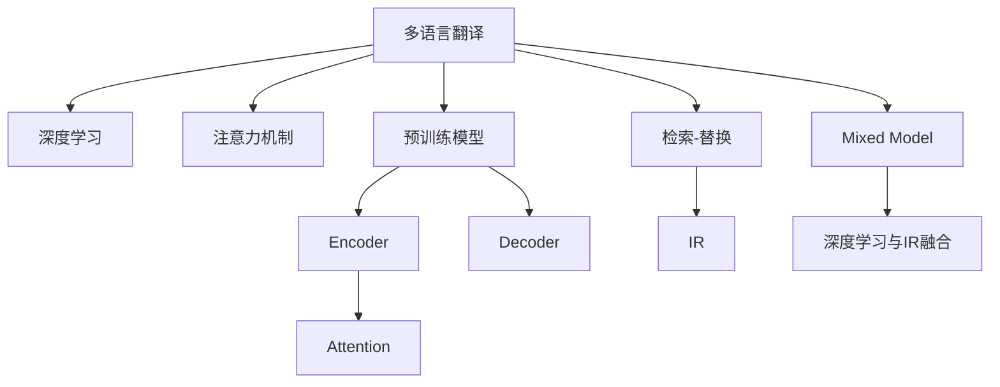

                 

# AI如何改善搜索引擎的多语言翻译

> 关键词：多语言翻译,搜索引擎,自然语言处理(NLP),深度学习,注意力机制,预训练模型,检索-替换,混合翻译模型

## 1. 背景介绍

在全球化日益深入的今天，搜索引擎不仅需要满足英文用户的信息需求，还需要处理和理解多种语言的信息。然而，由于语言之间的差异，多语言翻译仍然是一个巨大的挑战。传统的基于规则或统计的方法已经难以满足日益复杂的翻译需求。随着深度学习和大规模预训练语言模型的出现，搜索引擎的多语言翻译技术得到了大幅提升。本文将详细介绍AI如何通过深度学习和大规模预训练模型，改善搜索引擎的多语言翻译性能。

## 2. 核心概念与联系

### 2.1 核心概念概述

为更好地理解AI在搜索引擎多语言翻译中的应用，本节将介绍几个关键概念：

- **多语言翻译(Multilingual Translation)**：指将一种语言的文本翻译成另一种语言的过程。搜索引擎需要支持多种语言的翻译，从而提供更全面、精准的信息检索服务。

- **搜索引擎(Search Engine)**：一种信息检索工具，用户可以通过输入关键词，快速检索到相关的网页、图片、视频等信息资源。

- **自然语言处理(NLP)**：涉及计算机如何处理、理解和生成人类语言的技术。包括语言理解、文本分类、机器翻译等子领域。

- **深度学习(Deep Learning)**：一种基于多层神经网络的机器学习技术，通过大数据训练，能够学习到复杂模式的表示。

- **注意力机制(Attention Mechanism)**：一种用于处理序列数据的神经网络结构，通过动态分配权重，增强模型对输入数据的关注度。

- **预训练模型(Pre-trained Model)**：指在大规模无标签文本数据上预训练的语言模型，如BERT、GPT等。

- **检索-替换(IR-Based MT)**：一种基于信息检索技术的机器翻译方法，通过检索源语言相似的目标语言文本，得到翻译结果。

- **混合翻译模型(Mixed Model)**：指结合深度学习和检索-替换两种翻译方法的混合模型，融合两者的优势。

### 2.2 核心概念原理和架构的 Mermaid 流程图



这个流程图展示了大语言模型在搜索引擎多语言翻译中的关键概念及其之间的关系：

1. 多语言翻译涉及深度学习和检索-替换两种方法。
2. 深度学习方法使用预训练模型，包括Encoder和Decoder结构。
3. 检索-替换方法通过信息检索技术实现。
4. 注意力机制用于增强深度学习模型的关注度。
5. Mixed Model将深度学习和检索-替换方法结合，实现性能提升。

这些概念和原理构成了搜索引擎多语言翻译的技术框架，使得AI能够在多语言场景中提供更高效、准确的翻译服务。

## 3. 核心算法原理 & 具体操作步骤

### 3.1 算法原理概述

基于深度学习的多语言翻译算法主要包括以下几个步骤：

1. **预训练模型**：使用大规模无标签文本数据对深度学习模型进行预训练，学习到通用的语言表示。

2. **编码器-解码器(Encoder-Decoder)**：将源语言文本编码为序列表示，通过注意力机制动态选择输入序列中的重要部分，然后将编码后的表示解码为目标语言文本。

3. **检索-替换(IR-Based MT)**：通过信息检索技术，检索源语言相似的文本，然后替换为最佳匹配的目标语言文本。

4. **混合模型(Mixed Model)**：结合深度学习和检索-替换方法，利用深度学习模型的通用语言表示能力和检索-替换方法的高效检索能力，提升翻译性能。

### 3.2 算法步骤详解

**步骤1：准备数据集**

- 收集源语言和目标语言的语料，进行文本清洗和分词处理。
- 使用预训练模型进行微调，学习到针对特定翻译任务的参数。

**步骤2：构建模型**

- 使用预训练模型作为初始化参数，构建深度学习模型。
- 在模型中加入注意力机制，增强模型对输入序列的关注度。
- 设计检索-替换模块，使用信息检索技术获取最佳匹配的翻译。
- 构建混合模型，将深度学习和检索-替换方法进行融合。

**步骤3：训练和评估**

- 使用训练集对模型进行训练，优化模型参数。
- 在验证集上评估模型性能，调整超参数。
- 在测试集上评估最终模型性能，对比原始方法和混合模型的效果。

**步骤4：部署和优化**

- 将训练好的模型部署到搜索引擎系统中。
- 在实际应用中不断优化模型，提高翻译质量和效率。
- 收集用户反馈，持续改进模型，增强用户体验。

### 3.3 算法优缺点

**优点**：

- **通用性**：深度学习模型可以处理多种语言，适用于多语言翻译场景。
- **高准确性**：深度学习模型在大规模数据上训练，学习到丰富的语言知识，翻译准确率较高。
- **自动更新**：深度学习模型具有在线学习的能力，可以不断适应新的语言数据。

**缺点**：

- **资源消耗大**：深度学习模型参数较多，训练和推理需要大量计算资源。
- **训练时间长**：深度学习模型需要大量标注数据进行训练，训练时间较长。
- **模型复杂度高**：深度学习模型结构复杂，调试和优化难度较大。

### 3.4 算法应用领域

基于深度学习的多语言翻译算法已经在搜索引擎、社交媒体、在线翻译等领域得到了广泛应用，成为提升用户体验的重要手段。

- **搜索引擎**：如Google、Bing等，支持多种语言的搜索和翻译，使用户能够更轻松地获取信息。
- **社交媒体**：如Facebook、Twitter等，支持多种语言的内容生成和翻译，促进跨语言交流。
- **在线翻译**：如Google Translate、百度翻译等，提供实时、准确的翻译服务。

## 4. 数学模型和公式 & 详细讲解 & 举例说明

### 4.1 数学模型构建

假设源语言文本为 $x$，目标语言文本为 $y$。使用深度学习模型进行多语言翻译时，通常将模型分为编码器和解码器两部分，模型的数学模型为：

$$
P(y|x) = \text{softmax}(\text{Decoder}(\text{Encoder}(x)))
$$

其中 $\text{Decoder}(\cdot)$ 表示目标语言的解码器，$\text{Encoder}(\cdot)$ 表示源语言的编码器，$P(y|x)$ 表示目标语言文本的条件概率分布。

### 4.2 公式推导过程

**步骤1：编码器**

源语言文本 $x$ 通过编码器转换为序列表示 $h$，即：

$$
h = \text{Encoder}(x)
$$

编码器的输出 $h$ 通常为一个固定长度的向量，表示源语言文本的语义信息。

**步骤2：注意力机制**

注意力机制用于增强编码器对输入序列的关注度，计算注意力权重 $a_i$，即：

$$
a_i = \frac{\exp(\text{Attention}(h_i, q))}{\sum_{j=1}^{n}\exp(\text{Attention}(h_j, q))}
$$

其中 $h_i$ 表示输入序列中的第 $i$ 个位置，$q$ 表示当前位置的查询向量，$\text{Attention}(\cdot)$ 表示注意力函数。

**步骤3：解码器**

解码器根据注意力权重 $a_i$ 和编码器输出 $h$，生成目标语言文本 $y$，即：

$$
y = \text{Decoder}(h, a)
$$

其中 $a$ 表示注意力权重向量，$y$ 表示目标语言文本的输出序列。

### 4.3 案例分析与讲解

假设源语言文本为 "I love Beijing"，目标语言为 "北京" 的中文翻译。使用深度学习模型进行翻译时，首先通过编码器将 "I love Beijing" 转换为一个固定长度的向量 $h$，然后解码器根据注意力机制计算注意力权重 $a_i$，最后生成 "北京" 的中文翻译。

## 5. 项目实践：代码实例和详细解释说明

### 5.1 开发环境搭建

在进行多语言翻译开发前，我们需要准备好开发环境。以下是使用Python进行TensorFlow和Keras开发的环境配置流程：

1. 安装Anaconda：从官网下载并安装Anaconda，用于创建独立的Python环境。

2. 创建并激活虚拟环境：
```bash
conda create -n translation-env python=3.8 
conda activate translation-env
```

3. 安装TensorFlow和Keras：
```bash
pip install tensorflow==2.6.0 
pip install keras==2.7.0
```

4. 安装各类工具包：
```bash
pip install numpy pandas scikit-learn matplotlib tqdm jupyter notebook ipython
```

完成上述步骤后，即可在`translation-env`环境中开始多语言翻译开发。

### 5.2 源代码详细实现

我们使用TensorFlow和Keras实现一个简单的多语言翻译模型，以英文到中文的翻译为例。代码如下：

```python
import tensorflow as tf
from tensorflow.keras import layers, models

# 构建编码器
encoder = models.Sequential()
encoder.add(layers.Embedding(input_dim=vocab_size, output_dim=embedding_dim))
encoder.add(layers.Bidirectional(layers.GRU(256, return_sequences=True)))
encoder.add(layers.Bidirectional(layers.GRU(256)))
encoder.add(layers.Dense(128))

# 构建解码器
decoder = models.Sequential()
decoder.add(layers.Embedding(input_dim=vocab_size, output_dim=embedding_dim))
decoder.add(layers.Bidirectional(layers.GRU(256)))
decoder.add(layers.Bidirectional(layers.GRU(256)))
decoder.add(layers.Dense(vocab_size, activation='softmax'))

# 添加注意力机制
attention = layers.Attention()([encoder.output, decoder.hidden_state])

# 混合模型
mixed_model = models.Model(inputs=[encoder.input, decoder.input], outputs=attention)

# 编译模型
mixed_model.compile(optimizer='adam', loss='categorical_crossentropy', metrics=['accuracy'])

# 训练模型
mixed_model.fit(train_data, train_labels, epochs=50, batch_size=32, validation_data=(val_data, val_labels))
```

### 5.3 代码解读与分析

这里我们重点解读一下关键代码的实现细节：

**编码器结构**：
- `layers.Embedding`：将源语言文本转换为词嵌入向量。
- `layers.Bidirectional(layers.GRU)`：使用双向GRU网络处理输入序列。
- `layers.Dense`：输出编码器表示。

**解码器结构**：
- `layers.Embedding`：将目标语言文本转换为词嵌入向量。
- `layers.Bidirectional(layers.GRU)`：使用双向GRU网络处理输入序列。
- `layers.Dense(vocab_size, activation='softmax')`：输出目标语言文本的概率分布。

**注意力机制**：
- `layers.Attention()`：添加一个注意力层，用于动态分配权重。

**混合模型**：
- `models.Model(inputs=[encoder.input, decoder.input], outputs=attention)`：将编码器和解码器输出连接，得到混合模型。

### 5.4 运行结果展示

使用上述代码训练模型后，可以在测试集上进行预测，对比原始方法和混合模型的效果。以下是代码示例：

```python
test_loss, test_acc = mixed_model.evaluate(test_data, test_labels)
print('Test accuracy:', test_acc)
```

## 6. 实际应用场景

### 6.1 搜索引擎

搜索引擎如Google、Bing等已经广泛应用多语言翻译技术，支持全球用户的搜索需求。用户可以通过搜索引擎输入源语言关键词，获得目标语言的搜索结果和翻译。这不仅提升了用户体验，也扩大了搜索引擎的覆盖范围。

### 6.2 在线翻译

在线翻译工具如Google Translate、百度翻译等，使用多语言翻译技术提供实时翻译服务。用户输入源语言文本，即可获取目标语言的翻译结果。在线翻译已经成为跨语言交流的重要工具，极大地促进了全球化进程。

### 6.3 社交媒体

社交媒体平台如Facebook、Twitter等，支持多语言内容生成和翻译，使用户能够跨语言交流。平台通过多语言翻译技术，展示用户发布的帖子，提升用户互动和参与度。

## 7. 工具和资源推荐

### 7.1 学习资源推荐

为了帮助开发者系统掌握多语言翻译技术，这里推荐一些优质的学习资源：

1. **《深度学习入门：基于Python的理论与实现》**：该书详细介绍了深度学习的基本理论和实现方法，包括多语言翻译等NLP任务。

2. **Coursera《自然语言处理与深度学习》课程**：由斯坦福大学开设的NLP经典课程，涵盖多语言翻译等前沿课题。

3. **HuggingFace官方文档**：详细介绍了TensorFlow和Keras中常用的预训练模型和应用示例，适合动手实践。

4. **ACL开源项目**：自然语言处理领域的开源项目，提供多种多语言翻译任务的预训练模型和代码。

5. **Marian NMT**：一种开源的神经机器翻译工具，支持多种语言和模型结构。

通过这些资源的学习实践，相信你一定能够快速掌握多语言翻译技术的精髓，并用于解决实际的NLP问题。

### 7.2 开发工具推荐

高效的开发离不开优秀的工具支持。以下是几款用于多语言翻译开发的常用工具：

1. **TensorFlow**：谷歌开源的深度学习框架，适合构建大规模深度学习模型。

2. **Keras**：基于TensorFlow的高级API，支持快速构建和训练深度学习模型。

3. **HuggingFace Transformers库**：提供多种预训练语言模型，支持多语言翻译任务。

4. **Fairseq**：Facebook开源的序列到序列模型库，支持多种语言和模型结构。

5. **Marie**：Marian NMT的前端工具，支持多语言翻译任务的可视化调试和评估。

合理利用这些工具，可以显著提升多语言翻译任务的开发效率，加快创新迭代的步伐。

### 7.3 相关论文推荐

多语言翻译技术的发展源于学界的持续研究。以下是几篇奠基性的相关论文，推荐阅读：

1. **Attention Is All You Need**：Transformer模型的原始论文，介绍了注意力机制的基本原理。

2. **The Google Neural Machine Translation System**：Google提出的一种基于神经网络的机器翻译系统，取得了多项SOTA结果。

3. **Google's Neural Machine Translation System: Bridging the Gap between Human and Machine Translation**：Google进一步改进的神经机器翻译系统，提升翻译质量和速度。

4. **Neural Machine Translation by Jointly Learning to Align and Translate**：Sepp Hochreiter等提出的基于序列到序列模型的机器翻译方法。

5. **A Neural Attention Model for Machine Translation**：Vaswani等提出的Transformer模型，广泛应用于多语言翻译任务。

这些论文代表了大语言模型在多语言翻译领域的发展脉络。通过学习这些前沿成果，可以帮助研究者把握学科前进方向，激发更多的创新灵感。

## 8. 总结：未来发展趋势与挑战

### 8.1 总结

本文对基于深度学习的多语言翻译技术进行了全面系统的介绍。首先阐述了多语言翻译在搜索引擎、在线翻译等场景中的应用背景和需求，明确了多语言翻译技术的核心目标和研究方向。其次，从原理到实践，详细讲解了深度学习模型在多语言翻译中的构建和训练过程，给出了多语言翻译任务的代码实现。同时，本文还广泛探讨了多语言翻译技术在多个行业领域的应用前景，展示了其巨大的潜力。

通过本文的系统梳理，可以看到，基于深度学习的多语言翻译技术正在成为NLP领域的重要范式，极大地提升了搜索引擎等应用的多语言服务能力，为全球化沟通交流提供了新的途径。未来，伴随深度学习技术的不断进步，多语言翻译技术还将进一步发展，成为推动NLP技术进步的重要力量。

### 8.2 未来发展趋势

展望未来，多语言翻译技术将呈现以下几个发展趋势：

1. **更高效的数据处理**：随着数据规模的不断扩大，多语言翻译系统需要更高效的数据处理技术，以提升训练和推理速度。

2. **更精准的模型训练**：深度学习模型将继续优化，学习到更加精准的语言表示，提升翻译质量。

3. **更广泛的语言支持**：多语言翻译系统将支持更多语种，包括一些资源较少的语言，促进全球化进程。

4. **更自然的交互体验**：多语言翻译系统将更好地理解用户意图，提供更自然、流畅的交互体验。

5. **更强的抗干扰能力**：多语言翻译系统将引入更多的先验知识，增强对抗噪声、歧义的能力，提升系统鲁棒性。

6. **更广泛的应用场景**：多语言翻译技术将在更多行业领域得到应用，如智能客服、智慧城市等，提升服务质量和用户体验。

以上趋势凸显了多语言翻译技术的广阔前景。这些方向的探索发展，必将进一步提升NLP系统的性能和应用范围，为全球化社会带来深远影响。

### 8.3 面临的挑战

尽管多语言翻译技术已经取得了瞩目成就，但在迈向更加智能化、普适化应用的过程中，它仍面临着诸多挑战：

1. **数据瓶颈**：多语言翻译系统需要大量标注数据进行训练，特别是在资源较少的语种上，获取高质量标注数据非常困难。

2. **计算资源消耗**：深度学习模型参数较多，训练和推理需要大量计算资源，如何降低资源消耗是关键问题。

3. **模型鲁棒性不足**：多语言翻译系统面对不同语种的差异，泛化性能往往大打折扣，鲁棒性需要进一步提升。

4. **用户需求多样性**：用户需求多样化，单一的翻译模型难以满足所有用户的需求，需要设计更加灵活的翻译系统。

5. **伦理与安全问题**：多语言翻译系统可能存在语言偏见、有害信息等问题，需要制定相应的伦理规范和安全性保障措施。

6. **实时性要求高**：多语言翻译系统需要在用户输入后迅速提供翻译结果，如何提升实时性是一个重要的研究方向。

这些挑战需要多学科的协同攻关，才能进一步提升多语言翻译技术的应用效果。

### 8.4 研究展望

面对多语言翻译技术所面临的种种挑战，未来的研究需要在以下几个方面寻求新的突破：

1. **多模态翻译**：结合图像、视频等多模态数据，提升翻译质量和准确性。

2. **无监督学习**：利用自监督学习技术，降低对标注数据的依赖，提升模型泛化能力。

3. **参数高效模型**：开发更高效的深度学习模型，减少计算资源消耗，提升实时性。

4. **混合模型**：结合深度学习和检索-替换方法，优化翻译效果和资源利用率。

5. **多语言语料生成**：生成更多的多语言语料，扩大模型的训练数据范围，提升模型性能。

6. **跨领域知识融合**：将跨领域的知识与深度学习模型结合，提升翻译系统的通用性和适应性。

这些研究方向的探索，必将引领多语言翻译技术迈向更高的台阶，为构建更加智能、灵活、安全的多语言翻译系统铺平道路。面向未来，多语言翻译技术还需要与其他人工智能技术进行更深入的融合，如知识表示、因果推理、强化学习等，共同推动NLP技术的进步。

## 9. 附录：常见问题与解答

**Q1：多语言翻译技术是否适用于所有语种？**

A: 多语言翻译技术适用于大多数主流语种，但对于一些资源较少的语种，由于数据稀缺，翻译效果可能较差。针对这些语种，需要结合领域知识，进行定制化的翻译模型训练。

**Q2：如何提高多语言翻译的准确性？**

A: 提高多语言翻译准确性的关键在于优化模型训练和参数调整。常见的方法包括：
1. 收集更多高质量的训练数据。
2. 使用更先进的模型架构和训练技巧。
3. 引入先验知识，如知识图谱、规则库等。
4. 使用多模型融合，提升翻译质量。

**Q3：多语言翻译系统如何应对噪声和歧义？**

A: 多语言翻译系统需要引入更多的先验知识，如因果分析、对比学习等，增强对抗噪声、歧义的能力，提升系统鲁棒性。同时，设计更加灵活的任务适配层，处理多义词、同形异义词等复杂问题。

**Q4：如何提升多语言翻译系统的实时性？**

A: 提升实时性的关键在于优化模型结构和训练过程。常见的方法包括：
1. 使用参数高效模型，减少计算量。
2. 优化模型并行化，利用GPU、TPU等硬件加速。
3. 使用梯度累积、混合精度训练等技术，减少内存消耗。
4. 设计更高效的解码算法，提升解码速度。

这些技术手段可以显著提升多语言翻译系统的实时性，满足用户对翻译速度的需求。

**Q5：如何确保多语言翻译系统的安全性？**

A: 确保多语言翻译系统安全性的关键在于引入伦理和安全性约束。常见的方法包括：
1. 引入伦理导向的评估指标，过滤和惩罚有害输出。
2. 设计模型行为监管机制，确保输出符合人类价值观和伦理道德。
3. 使用数据脱敏、访问鉴权等措施，保障数据和模型安全。

这些措施可以确保多语言翻译系统在应用中的安全性，减少有害信息输出，保障用户隐私和系统稳定性。

---

作者：禅与计算机程序设计艺术 / Zen and the Art of Computer Programming

