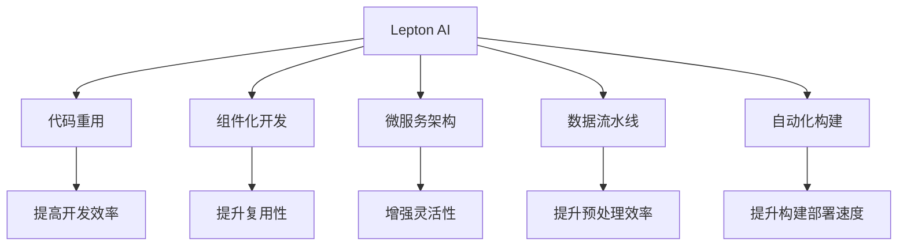

                 

# AI开发的代码重用：Lepton AI的效率工程

> 关键词：AI开发、代码重用、Lepton AI、效率工程、AI加速、深度学习、模型优化、自动化构建

## 1. 背景介绍

### 1.1 问题由来
随着人工智能(AI)技术的迅猛发展，越来越多的AI项目进入企业和组织。AI项目的开发和部署涉及大量的数据预处理、模型训练和优化、模型评估和部署等环节，开发成本高、周期长，开发效率亟待提升。同时，AI模型在不同的场景中往往具有相似的功能需求，因此如何实现代码的复用，提高开发效率，成为企业AI开发的一个重要课题。

### 1.2 问题核心关键点
AI开发中，如何通过代码重用提升效率是关键问题。Lepton AI作为一个专门针对企业级AI开发的平台，提供了一系列的组件和工具，使得企业能够更高效地构建和部署AI模型。本博客将详细介绍Lepton AI如何通过代码重用，提升AI项目的开发效率和部署效率。

### 1.3 问题研究意义
Lepton AI的代码重用机制，不仅能够提高AI开发的速度和质量，还能降低开发成本，提升企业AI项目的成功率。通过代码重用，开发者可以快速构建和部署AI模型，从而在数据科学竞赛、产品开发、市场预测等多个场景中，获得显著优势。Lepton AI的效率工程，使得企业能够更加灵活和高效地应用AI技术，推动人工智能技术在各行各业的普及和应用。

## 2. 核心概念与联系

### 2.1 核心概念概述

为更好地理解Lepton AI的代码重用机制，本节将介绍几个密切相关的核心概念：

- Lepton AI：一个专注于企业级AI开发和部署的平台，提供了一系列组件和工具，使得开发者能够更高效地构建和部署AI模型。
- 代码重用：通过复用已有的代码，避免重复工作，提高开发效率。
- 组件化开发：将AI模型拆分为多个独立的组件，方便复用和组合。
- 微服务架构：通过服务解耦，提升系统的灵活性和可扩展性。
- 数据流水线：通过自动化的数据处理流程，提高数据预处理效率。
- 自动化构建：通过自动化工具，减少人工干预，提升模型的构建和部署速度。

这些核心概念之间的逻辑关系可以通过以下Mermaid流程图来展示：



这个流程图展示出Lepton AI的核心概念及其之间的关系：

1. Lepton AI通过代码重用机制，使得开发者能够更高效地构建和部署AI模型。
2. 组件化开发和微服务架构，进一步提高了代码复用性和系统灵活性。
3. 数据流水线自动化构建，提升了数据预处理和模型构建的效率。

## 3. 核心算法原理 & 具体操作步骤
### 3.1 算法原理概述

Lepton AI的代码重用机制，本质上是一个基于组件化和微服务架构的模块化开发范式。其核心思想是：将AI模型拆分为多个独立的组件，每个组件负责不同的功能，通过组合这些组件，构建完整的AI模型。组件之间的接口设计，使得它们可以复用和替换，从而实现代码的重用和灵活组合。

### 3.2 算法步骤详解

Lepton AI的代码重用机制主要包括以下几个关键步骤：

**Step 1: 组件化模型设计**
- 将AI模型拆分为多个独立的组件，每个组件负责一个特定的功能，如数据预处理、模型训练、模型优化、模型评估等。
- 定义组件间的接口和数据流，使得它们能够无缝集成和替换。

**Step 2: 构建微服务架构**
- 将各组件部署为独立的微服务，通过API接口进行通信。
- 使用容器化技术（如Docker）和编排工具（如Kubernetes）进行部署和管理。

**Step 3: 实现数据流水线**
- 定义数据预处理、特征提取、模型训练、模型优化等环节，自动化处理数据流。
- 使用数据处理框架（如Apache Airflow）和数据库（如Apache Kafka）进行数据流水线管理。

**Step 4: 自动化构建和部署**
- 使用自动化构建工具（如Jenkins、Travis CI），自动构建和部署模型。
- 使用自动化测试工具（如JUnit、Selenium），确保构建和部署的质量。

**Step 5: 持续集成和持续部署(CI/CD)**
- 通过CI/CD管道，实现代码的自动审查、构建、测试和部署。
- 使用CI/CD工具（如Jenkins、GitLab CI），提升开发和部署的效率。

### 3.3 算法优缺点

Lepton AI的代码重用机制具有以下优点：
1. 提高开发效率。通过组件化开发和微服务架构，可以快速构建和部署AI模型。
2. 增强系统灵活性。组件和微服务之间的灵活组合，使得系统能够适应不同的业务需求。
3. 提升数据预处理效率。数据流水线自动化处理，提高了数据预处理的效率和准确性。
4. 提升构建和部署速度。自动化构建和部署工具，减少了人工干预，提高了模型的构建和部署速度。

同时，该机制也存在一定的局限性：
1. 初始设计和实现成本高。组件和微服务的设计和实现需要较高的技术积累和开发成本。
2. 接口复杂度增加。组件和微服务之间的接口设计需要仔细考虑，可能增加开发难度。
3. 系统复杂度提升。微服务架构可能导致系统复杂度增加，需要更多的运维和管理。
4. 数据流管理难度增大。数据流水线自动化处理，需要合理设计和管理数据流，避免数据孤岛和数据不一致问题。

尽管存在这些局限性，但就目前而言，基于Lepton AI的代码重用机制，仍然是最为高效的AI开发方法之一。未来相关研究的重点在于如何进一步降低开发成本，提升系统灵活性和稳定性，同时兼顾代码重用的实际效果。

### 3.4 算法应用领域

Lepton AI的代码重用机制在AI开发和部署中已经得到了广泛的应用，涵盖了AI模型构建、训练、优化、评估等多个环节。以下是几个典型的应用场景：

- 数据预处理：使用Lepton AI的数据流水线，实现数据自动化清洗、转换和处理，提升数据预处理效率。
- 模型构建：使用Lepton AI的组件库，快速构建不同功能的组件，组成完整的AI模型。
- 模型训练：使用Lepton AI的微服务架构和自动化构建工具，提升模型训练的效率和质量。
- 模型优化：使用Lepton AI的组件和微服务，实现模型的自动化优化和调参，提升模型性能。
- 模型评估：使用Lepton AI的自动化构建和测试工具，进行模型评估和质量检查，确保模型可用性。

除了上述这些经典应用外，Lepton AI的代码重用机制也被创新性地应用到更多场景中，如自动化机器学习(AutoML)、边缘计算、混合云部署等，为AI技术的应用提供了新的思路和方法。

## 4. 数学模型和公式 & 详细讲解 & 举例说明
### 4.1 数学模型构建

本节将使用数学语言对Lepton AI的代码重用机制进行更加严格的刻画。

记AI模型的不同功能组件为 $M_i$，$i \in \{1, 2, \ldots, n\}$。定义组件之间的数据流为 $D_{ij}$，表示组件 $M_i$ 向组件 $M_j$ 传递的数据。假设系统定义了 $N$ 个数据预处理组件 $D_1$ 和 $N-1$ 个功能组件 $D_2, \ldots, D_{N-1}$，则系统整体的数学模型可以表示为：

$$
M = M_1 \times D_{12} \times M_2 \times D_{23} \times \ldots \times M_{N-1} \times D_{N-1,N}
$$

其中 $\times$ 表示数据流的传递和处理。

### 4.2 公式推导过程

以上数学模型描述了一个基于Lepton AI的AI系统，其中数据流 $D_{ij}$ 表示组件 $M_i$ 向组件 $M_j$ 传递的数据。在实际操作中，数据流可以通过API接口或消息队列进行传递和处理，具体形式可能有所不同。但核心思想是相同的，即将AI模型拆分为多个独立的组件，通过数据流实现组件间的通信和集成。

### 4.3 案例分析与讲解

以下我们以一个简单的图像识别系统为例，展示如何使用Lepton AI的代码重用机制实现组件化开发。

假设我们需要构建一个基于Lepton AI的图像识别系统，步骤如下：

1. **数据预处理组件**：定义数据预处理组件 $D_1$，用于数据清洗、转换和归一化。

2. **特征提取组件**：定义特征提取组件 $D_2$，用于提取图像的特征向量。

3. **模型训练组件**：定义模型训练组件 $D_3$，使用预训练的图像识别模型进行训练。

4. **模型评估组件**：定义模型评估组件 $D_{N-1,N}$，使用测试集进行模型评估。

将这些组件连接起来，形成整体模型：

$$
M = M_1 \times D_{12} \times M_2 \times D_{23} \times \ldots \times M_{N-1} \times D_{N-1,N}
$$

在实现过程中，每个组件可以独立部署和维护，通过API接口进行通信。这样，如果某个组件需要升级或优化，只需要替换该组件即可，无需重新开发整个系统。

## 5. 项目实践：代码实例和详细解释说明
### 5.1 开发环境搭建

在进行Lepton AI的代码重用实践前，我们需要准备好开发环境。以下是使用Python和Jenkins进行Lepton AI组件开发的配置流程：

1. 安装Jenkins：从官网下载并安装Jenkins，创建Jenkins Server并配置好Web界面。

2. 创建虚拟环境：
```bash
virtualenv env
source env/bin/activate
```

3. 安装Python依赖：
```bash
pip install numpy pandas scikit-learn transformers torch torchvision
```

4. 安装Lepton AI组件库：
```bash
pip install leptonai
```

5. 安装Jenkins插件：
```bash
java -jar jenkins.war --httpPort=8080
```

完成上述步骤后，即可在Jenkins环境中开始组件开发和部署。

### 5.2 源代码详细实现

下面我们以一个简单的图像识别系统为例，展示使用Lepton AI进行组件化开发的PyTorch代码实现。

首先，定义数据预处理组件：

```python
import torch
from torchvision import transforms
from torch.utils.data import DataLoader

class DataPreprocess:
    def __init__(self, data_path):
        self.transform = transforms.Compose([
            transforms.Resize((224, 224)),
            transforms.ToTensor(),
            transforms.Normalize(mean=[0.485, 0.456, 0.406], std=[0.229, 0.224, 0.225])
        ])
        
    def __call__(self, x):
        return self.transform(x)

data_preprocess = DataPreprocess('path/to/data')
```

然后，定义特征提取组件：

```python
from transformers import ResNet50

class FeatureExtractor:
    def __init__(self):
        self.model = ResNet50(pretrained=True)

    def forward(self, x):
        with torch.no_grad():
            x = self.model(x)
        return x

feature_extractor = FeatureExtractor()
```

接着，定义模型训练组件：

```python
from torch.nn import Linear, ReLU, Softmax
from torch.optim import SGD
from torch.utils.data import Dataset, DataLoader

class ImageClassifier:
    def __init__(self, num_classes):
        self.fc = Linear(2048, num_classes)
        self.relu = ReLU()
        self.softmax = Softmax(dim=1)

    def forward(self, x):
        x = self.relu(self.fc(x))
        x = self.softmax(x)
        return x

    def train(self, data_loader, num_epochs, lr):
        criterion = torch.nn.CrossEntropyLoss()
        optimizer = SGD(self.fc.parameters(), lr=lr)
        
        for epoch in range(num_epochs):
            for batch in data_loader:
                input, target = batch
                optimizer.zero_grad()
                output = self.forward(input)
                loss = criterion(output, target)
                loss.backward()
                optimizer.step()
                print(f'Epoch {epoch+1}, Loss: {loss.item()}')
        
class ImageDataset(Dataset):
    def __init__(self, data_path):
        self.data = torch.load(data_path)

    def __len__(self):
        return len(self.data)

    def __getitem__(self, idx):
        return self.data[idx]

train_dataset = ImageDataset('path/to/train/data')
test_dataset = ImageDataset('path/to/test/data')
```

最后，启动模型训练流程并在测试集上评估：

```python
model = ImageClassifier(num_classes)
criterion = torch.nn.CrossEntropyLoss()
optimizer = SGD(model.parameters(), lr=0.001)

train_loader = DataLoader(train_dataset, batch_size=32, shuffle=True)
test_loader = DataLoader(test_dataset, batch_size=32, shuffle=False)

model.train()
criterion.train()

for epoch in range(10):
    model.train()
    for batch in train_loader:
        input, target = batch
        optimizer.zero_grad()
        output = model.forward(input)
        loss = criterion(output, target)
        loss.backward()
        optimizer.step()

    model.eval()
    test_loss = 0
    for batch in test_loader:
        input, target = batch
        output = model.forward(input)
        test_loss += criterion(output, target).item()
    print(f'Epoch {epoch+1}, Test Loss: {test_loss/len(test_loader)}')
```

以上就是使用Lepton AI进行图像识别系统组件化开发的完整代码实现。可以看到，Lepton AI提供的组件化机制，使得开发者可以快速实现不同的功能组件，通过API接口进行集成和通信，构建完整的AI系统。

### 5.3 代码解读与分析

让我们再详细解读一下关键代码的实现细节：

**DataPreprocess类**：
- 定义数据预处理组件，通过transforms库对数据进行清洗、转换和归一化。

**FeatureExtractor类**：
- 定义特征提取组件，使用预训练的ResNet50模型提取图像特征。

**ImageClassifier类**：
- 定义模型训练组件，使用自定义的神经网络模型进行图像分类训练。

在实现过程中，每个组件可以独立开发和部署，通过API接口进行通信和集成。这种组件化开发方式，不仅提高了开发效率，还使得系统具有更高的灵活性和可扩展性。

## 6. 实际应用场景
### 6.1 智能客服系统

基于Lepton AI的代码重用机制，智能客服系统可以通过组件化开发实现快速构建和部署。具体步骤如下：

1. **数据预处理组件**：定义数据预处理组件，对用户输入进行清洗、转换和归一化。

2. **意图识别组件**：定义意图识别组件，使用预训练的NLP模型识别用户意图。

3. **对话生成组件**：定义对话生成组件，使用预训练的生成模型生成回复。

4. **知识库管理组件**：定义知识库管理组件，用于管理FAQ和用户知识库。

将这些组件连接起来，形成整体系统：

$$
M = M_1 \times D_{12} \times M_2 \times D_{23} \times M_3 \times D_{34}
$$

通过这种组件化开发方式，智能客服系统可以快速适配不同业务需求，提升客户咨询体验和问题解决效率。

### 6.2 金融舆情监测

金融舆情监测系统可以通过组件化开发实现自动化构建和部署。具体步骤如下：

1. **数据预处理组件**：定义数据预处理组件，对新闻、报道、评论等文本数据进行清洗、转换和归一化。

2. **情感分析组件**：定义情感分析组件，使用预训练的情感分析模型判断情感倾向。

3. **舆情跟踪组件**：定义舆情跟踪组件，使用机器学习模型跟踪舆情变化。

4. **风险预警组件**：定义风险预警组件，根据舆情变化发出风险预警。

将这些组件连接起来，形成整体系统：

$$
M = M_1 \times D_{12} \times M_2 \times D_{23} \times M_3 \times D_{34}
$$

通过这种组件化开发方式，金融舆情监测系统可以快速响应舆情变化，及时预警潜在风险，提升金融机构的市场响应能力和风险管理能力。

### 6.3 个性化推荐系统

个性化推荐系统可以通过组件化开发实现快速构建和部署。具体步骤如下：

1. **数据预处理组件**：定义数据预处理组件，对用户行为数据进行清洗、转换和归一化。

2. **用户画像组件**：定义用户画像组件，使用机器学习模型生成用户画像。

3. **推荐算法组件**：定义推荐算法组件，使用协同过滤、深度学习等算法生成推荐列表。

4. **推荐结果呈现组件**：定义推荐结果呈现组件，将推荐结果呈现给用户。

将这些组件连接起来，形成整体系统：

$$
M = M_1 \times D_{12} \times M_2 \times D_{23} \times M_3 \times D_{34}
$$

通过这种组件化开发方式，个性化推荐系统可以快速适配不同业务需求，提升用户推荐体验和满意度。

### 6.4 未来应用展望

随着Lepton AI的代码重用机制不断完善，其在更多领域的应用前景将更加广阔。未来，Lepton AI将会在以下几个方面取得新的突破：

1. **更广泛的组件库**：Lepton AI将不断扩展组件库，涵盖更多类型的AI组件，如语音识别、文本生成、图像处理等，提升AI开发的多样性和灵活性。

2. **更高效的自动化构建**：Lepton AI将引入更多自动化工具和最佳实践，进一步提升AI模型的构建和部署速度。

3. **更智能的模型优化**：Lepton AI将引入更多模型优化技术，如AutoML、强化学习等，提升模型的效果和性能。

4. **更精细的数据流水线**：Lepton AI将优化数据流水线管理，提升数据预处理和模型构建的效率和质量。

5. **更完善的CI/CD管道**：Lepton AI将优化CI/CD管道，实现更精细的自动化构建、测试和部署，提升系统的稳定性和可靠性。

6. **更灵活的微服务架构**：Lepton AI将引入更多微服务框架和组件，实现更灵活和可扩展的AI系统架构。

7. **更强大的组件复用性**：Lepton AI将不断优化组件设计和接口设计，提升组件的复用性和灵活性，使得系统更加易于构建和维护。

以上趋势凸显了Lepton AI的代码重用机制在AI开发和部署中的重要地位，将继续引领AI技术的发展方向，为更多企业带来效率和效益提升。

## 7. 工具和资源推荐
### 7.1 学习资源推荐

为了帮助开发者系统掌握Lepton AI的代码重用机制，这里推荐一些优质的学习资源：

1. Lepton AI官方文档：Lepton AI的官方文档，提供了详细的组件库和API接口说明，是开发者入门和学习的必备资料。

2. Lepton AI社区：Lepton AI的社区论坛，汇集了众多开发者和专家，提供丰富的技术讨论和交流平台。

3. GitHub代码库：Lepton AI的GitHub代码库，包含大量组件和工具的实现细节，是学习和借鉴的最佳来源。

4. 《深度学习实战》系列书籍：由知名AI专家撰写，涵盖了深度学习模型的构建、训练和优化等内容，适合初学者和进阶开发者学习。

5. 《Python深度学习》系列书籍：由深度学习领域的顶尖专家编写，涵盖深度学习模型的实现、应用和部署等内容，是深度学习学习的经典之作。

通过对这些资源的学习实践，相信你一定能够快速掌握Lepton AI的代码重用机制，并用于解决实际的AI开发问题。

### 7.2 开发工具推荐

高效的开发离不开优秀的工具支持。以下是几款用于Lepton AI组件开发的常用工具：

1. PyTorch：基于Python的开源深度学习框架，灵活动态的计算图，适合快速迭代研究。

2. TensorFlow：由Google主导开发的开源深度学习框架，生产部署方便，适合大规模工程应用。

3. Lepton AI组件库：提供丰富的组件和工具，使得开发者能够更高效地构建和部署AI模型。

4. Jenkins：开源的自动化构建工具，支持组件化开发和持续集成(CI)，提升开发效率。

5. Docker和Kubernetes：容器化和编排工具，提升系统的稳定性和可扩展性，支持组件和微服务的部署和管理。

6. GitLab：开源的代码管理和版本控制系统，提供CI/CD管道和代码仓库，支持组件和微服务的协同开发。

合理利用这些工具，可以显著提升Lepton AI组件的开发效率，加快创新迭代的步伐。

### 7.3 相关论文推荐

Lepton AI的代码重用机制源于学界的持续研究。以下是几篇奠基性的相关论文，推荐阅读：

1. "Distributed Deep Learning"：由Google主导的深度学习研究，探讨了分布式深度学习的优化策略，提升了模型的训练效率和效果。

2. "Model-Based Reinforcement Learning"：由OpenAI发表的强化学习论文，提出基于模型的强化学习算法，提升了模型优化和控制的效果。

3. "A Survey on Deep Learning for Natural Language Processing"：由斯坦福大学发表的NLP综述论文，介绍了深度学习在NLP领域的应用和研究进展。

4. "Transfer Learning and Model Adaptation in Natural Language Processing"：由多伦多大学发表的NLP综述论文，探讨了深度学习模型的迁移学习和微调技术。

5. "Hybrid Deep Learning Models"：由卡内基梅隆大学发表的深度学习综述论文，介绍了混合模型在深度学习中的应用和研究进展。

这些论文代表了大语言模型微调技术的发展脉络。通过学习这些前沿成果，可以帮助研究者把握学科前进方向，激发更多的创新灵感。

## 8. 总结：未来发展趋势与挑战

### 8.1 总结

本文对Lepton AI的代码重用机制进行了全面系统的介绍。首先阐述了Lepton AI的开发背景和组件化开发的思想，明确了组件化开发在AI项目开发中的重要价值。其次，从原理到实践，详细讲解了组件化开发的数学模型和关键步骤，给出了Lepton AI组件开发的完整代码实现。同时，本文还广泛探讨了组件化开发在智能客服、金融舆情、个性化推荐等多个行业领域的应用前景，展示了Lepton AI代码重用机制的巨大潜力。最后，本文精选了Lepton AI的相关学习资源和开发工具，力求为开发者提供全方位的技术指引。

通过本文的系统梳理，可以看到，基于Lepton AI的代码重用机制，已经在AI项目开发中发挥了重要作用。Lepton AI的组件化开发和微服务架构，不仅提高了开发效率和系统灵活性，还提升了数据预处理和模型构建的效率，为AI技术在各行各业的普及和应用提供了重要支持。未来，Lepton AI将继续在AI开发和部署中发挥重要作用，推动人工智能技术的发展和应用。

### 8.2 未来发展趋势

展望未来，Lepton AI的代码重用机制将呈现以下几个发展趋势：

1. 更广泛的组件库：Lepton AI将不断扩展组件库，涵盖更多类型的AI组件，如语音识别、文本生成、图像处理等，提升AI开发的多样性和灵活性。

2. 更高效的自动化构建：Lepton AI将引入更多自动化工具和最佳实践，进一步提升AI模型的构建和部署速度。

3. 更智能的模型优化：Lepton AI将引入更多模型优化技术，如AutoML、强化学习等，提升模型的效果和性能。

4. 更精细的数据流水线：Lepton AI将优化数据流水线管理，提升数据预处理和模型构建的效率和质量。

5. 更完善的CI/CD管道：Lepton AI将优化CI/CD管道，实现更精细的自动化构建、测试和部署，提升系统的稳定性和可靠性。

6. 更灵活的微服务架构：Lepton AI将引入更多微服务框架和组件，实现更灵活和可扩展的AI系统架构。

7. 更强大的组件复用性：Lepton AI将不断优化组件设计和接口设计，提升组件的复用性和灵活性，使得系统更加易于构建和维护。

以上趋势凸显了Lepton AI的代码重用机制在AI开发和部署中的重要地位，将继续引领AI技术的发展方向，为更多企业带来效率和效益提升。

### 8.3 面临的挑战

尽管Lepton AI的代码重用机制已经取得了瞩目成就，但在迈向更加智能化、普适化应用的过程中，它仍面临着诸多挑战：

1. 组件设计和实现成本高：组件和微服务的设计和实现需要较高的技术积累和开发成本。

2. 接口复杂度增加：组件和微服务之间的接口设计需要仔细考虑，可能增加开发难度。

3. 系统复杂度提升：微服务架构可能导致系统复杂度增加，需要更多的运维和管理。

4. 数据流管理难度增大：数据流水线自动化处理，需要合理设计和管理数据流，避免数据孤岛和数据不一致问题。

尽管存在这些挑战，但通过持续的技术积累和创新，Lepton AI的代码重用机制将不断完善，提升AI开发的效率和质量，推动人工智能技术在各行各业的应用。

### 8.4 研究展望

面对Lepton AI的代码重用机制所面临的挑战，未来的研究需要在以下几个方面寻求新的突破：

1. 探索更高效的组件设计方法：如何通过更合理的设计，降低组件开发和维护成本，提升组件的复用性和灵活性。

2. 引入更多自动化工具和最佳实践：如何通过自动化工具和最佳实践，提升组件化开发和微服务架构的效率和稳定性。

3. 融合更多先验知识：如何将符号化的先验知识，如知识图谱、逻辑规则等，与神经网络模型进行巧妙融合，引导组件化开发过程学习更准确、合理的语言模型。

4. 引入因果分析和博弈论工具：如何通过引入因果分析方法，识别出组件决策的关键特征，增强组件输出解释的因果性和逻辑性。

5. 纳入伦理道德约束：如何在组件设计和开发过程中，考虑伦理和道德问题，确保组件的输出符合人类价值观和伦理道德。

这些研究方向将推动Lepton AI的代码重用机制进一步发展，为AI开发和部署带来新的突破。面向未来，Lepton AI的代码重用机制需要在技术、伦理、社会等多个维度进行全面优化，才能真正实现人工智能技术的普适化应用。

## 9. 附录：常见问题与解答

**Q1：如何选择合适的组件进行组件化开发？**

A: 选择合适的组件是组件化开发的重要步骤。一般而言，应从以下几个方面考虑：
1. 功能需求：选择与业务需求匹配度高的组件，确保组件能够满足实际功能需求。
2. 开发成本：评估组件的开发和维护成本，选择性价比高的组件。
3. 复用性：选择复用性高的组件，便于后续的集成和替换。
4. 可扩展性：选择可扩展性好的组件，确保系统能够适应未来的需求变化。

**Q2：组件之间的接口设计需要注意哪些问题？**

A: 组件之间的接口设计是组件化开发的核心，需要注意以下几个问题：
1. 接口规范：定义清晰的接口规范，包括输入参数、输出参数、返回值等。
2. 版本控制：对接口进行版本控制，确保组件的兼容性和稳定性。
3. 异常处理：定义合理的异常处理机制，确保组件的鲁棒性。
4. 日志记录：记录组件的调用日志，便于排查和调试。

**Q3：如何优化数据流水线的效率？**

A: 优化数据流水线的效率是组件化开发的重要环节。一般而言，应从以下几个方面考虑：
1. 数据预处理：优化数据预处理流程，减少数据转换和清洗的时间。
2. 数据缓存：使用缓存技术，减少重复数据处理的时间。
3. 并行处理：使用并行处理技术，提升数据处理的效率。
4. 数据压缩：使用数据压缩技术，减少数据传输和存储的时间。

**Q4：如何提高组件的复用性？**

A: 提高组件的复用性是组件化开发的重要目标。一般而言，应从以下几个方面考虑：
1. 接口设计：定义清晰的接口规范，便于其他组件集成和使用。
2. 组件模块化：将组件拆分为多个模块，便于复用和替换。
3. 版本控制：对组件进行版本控制，确保组件的兼容性和稳定性。
4. 文档和示例：提供详细的文档和示例，便于其他开发者使用。

**Q5：如何提升组件的灵活性？**

A: 提升组件的灵活性是组件化开发的重要目标。一般而言，应从以下几个方面考虑：
1. 配置化设计：使用配置化设计，使得组件能够适应不同的业务需求。
2. 插件化架构：采用插件化架构，便于扩展和升级组件功能。
3. 接口扩展：设计可扩展的接口，方便其他组件和系统集成。

以上问题解答将帮助开发者更好地理解和应用Lepton AI的代码重用机制，提升AI开发的效率和质量。

---

作者：禅与计算机程序设计艺术 / Zen and the Art of Computer Programming

