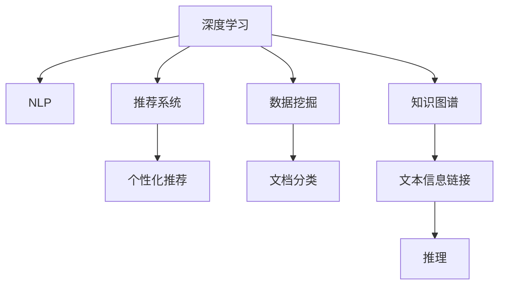

                 

# AI搜索引擎如何改变图书馆和档案管理

## 1. 背景介绍

随着信息技术的不断进步，人工智能（AI）技术在图书馆和档案管理领域的应用日益广泛。传统图书馆和档案管理依赖于大量的人力劳动，繁琐且效率低下。而AI搜索引擎通过智能化的检索、分类和推荐，极大地提高了信息检索的速度和准确性，为图书馆和档案管理带来了革命性的变化。

### 1.1 问题由来
图书馆和档案管理长期以来依赖于人工检索和手动分类。然而，随着数字化的发展，图书馆和档案馆中的文献和资料呈爆炸式增长，传统的人工方式已无法满足日益增长的需求。此时，AI搜索引擎应运而生，利用机器学习、自然语言处理（NLP）等技术，实现了高效、精确的信息检索，提升了图书馆和档案管理的工作效率和用户体验。

### 1.2 问题核心关键点
AI搜索引擎的核心在于利用深度学习模型对文献和资料进行语义理解，并结合用户查询进行智能匹配和推荐。关键点包括：
- 深度学习模型：利用神经网络对文本数据进行语义表示，实现高效的语义匹配和推理。
- 自然语言处理（NLP）：通过分词、词性标注、句法分析等技术，解析用户查询并生成语义表示。
- 推荐系统：利用协同过滤、矩阵分解等技术，对用户历史行为进行分析，推荐相关文献或资料。
- 数据挖掘：从海量文献中挖掘关联信息，进行文档分类和聚类。
- 知识图谱：构建领域知识图谱，辅助文本信息的链接和推理。

这些关键点构成了AI搜索引擎的技术基础，使其能够高效地处理海量文本数据，实现智能化检索和推荐。

### 1.3 问题研究意义
AI搜索引擎对图书馆和档案管理的研究具有重要意义：
- 提升检索效率：通过智能化检索，大幅度缩短检索时间，提高工作效率。
- 个性化推荐：利用用户历史行为和兴趣偏好，推荐个性化文献，提升用户体验。
- 知识挖掘：从文献中挖掘关联信息，辅助科研和知识发现。
- 智能化管理：通过自动化分类和聚类，实现智能化档案管理。
- 数据可视化：利用图表和可视化工具，直观展示数据分布和关联信息。

AI搜索引擎的应用不仅提升了图书馆和档案管理的效率，还极大地丰富了用户的使用体验，推动了数字化时代的知识普及和科研创新。

## 2. 核心概念与联系

### 2.1 核心概念概述

为更好地理解AI搜索引擎的核心技术，本节将介绍几个密切相关的核心概念：

- 深度学习（Deep Learning）：利用神经网络对文本进行语义表示和推理，实现高效的信息检索和推荐。
- 自然语言处理（NLP）：通过文本预处理、分词、词性标注、句法分析等技术，解析用户查询和文本数据。
- 推荐系统（Recommendation System）：利用协同过滤、矩阵分解等技术，为用户推荐个性化文献和资料。
- 数据挖掘（Data Mining）：通过文本挖掘、关联规则挖掘等技术，从海量文献中提取关联信息，实现文档分类和聚类。
- 知识图谱（Knowledge Graph）：构建领域知识图谱，辅助文本信息的链接和推理。

这些核心概念之间的逻辑关系可以通过以下Mermaid流程图来展示：



这个流程图展示了AI搜索引擎的核心概念及其之间的关系：

1. 深度学习模型通过语义表示对文本数据进行编码，作为后续处理的基础。
2. NLP技术对用户查询和文本数据进行解析，生成语义表示。
3. 推荐系统利用用户历史行为和文本语义信息，生成个性化推荐结果。
4. 数据挖掘技术从文本中提取关联信息，进行文档分类和聚类。
5. 知识图谱构建领域知识图谱，辅助文本信息的链接和推理。

这些概念共同构成了AI搜索引擎的技术框架，使其能够高效地处理文本数据，实现智能化的检索和推荐。

## 3. 核心算法原理 & 具体操作步骤
### 3.1 算法原理概述

AI搜索引擎的算法原理主要基于深度学习模型和自然语言处理技术，通过以下步骤实现智能化检索和推荐：

1. **文本预处理**：对文本数据进行分词、去除停用词、词性标注等预处理。
2. **语义编码**：利用深度学习模型（如Transformer）对文本数据进行编码，生成语义表示。
3. **用户查询解析**：利用NLP技术对用户查询进行解析，生成语义表示。
4. **匹配与推荐**：将用户查询的语义表示与文本数据的语义表示进行匹配，生成推荐结果。
5. **个性化调整**：根据用户历史行为和偏好，对推荐结果进行调整，生成个性化推荐。

### 3.2 算法步骤详解

#### 3.2.1 文本预处理
文本预处理是AI搜索引擎的第一步，主要包括：
1. **分词**：将文本数据分割成词语，去除标点符号和特殊字符。
2. **去除停用词**：删除常用的无意义词语（如“的”、“是”等），减少噪音。
3. **词性标注**：对词语进行词性标注，如名词、动词、形容词等。
4. **构建词典**：将文本中的词语构建成词典，方便后续计算。

#### 3.2.2 语义编码
语义编码是利用深度学习模型对文本数据进行编码，生成语义表示的过程。以BERT模型为例，主要步骤如下：
1. **输入表示**：将文本数据转化为模型可以接受的输入表示，如token ids、attention masks等。
2. **编码器处理**：通过Transformer等编码器对输入表示进行编码，生成语义表示。
3. **池化**：对语义表示进行池化操作，提取关键信息。

#### 3.2.3 用户查询解析
用户查询解析是将用户输入的自然语言查询转化为语义表示的过程。主要包括：
1. **分词和去除停用词**：与文本预处理类似，将用户查询进行分词和去除停用词。
2. **词性标注**：对用户查询中的词语进行词性标注。
3. **生成查询向量**：利用BERT等模型将用户查询转化为向量表示。

#### 3.2.4 匹配与推荐
匹配与推荐是AI搜索引擎的核心步骤，主要步骤如下：
1. **相似度计算**：将用户查询的语义表示与文本数据的语义表示进行相似度计算，生成相似度得分。
2. **排序**：根据相似度得分对文本数据进行排序，生成推荐结果。
3. **个性化调整**：根据用户历史行为和偏好，对推荐结果进行调整，生成个性化推荐。

### 3.3 算法优缺点

AI搜索引擎的优点包括：
- 高效性：利用深度学习模型和自然语言处理技术，大幅度提升信息检索和推荐的效率。
- 精确性：通过语义匹配和推荐算法，实现高效精准的检索和推荐。
- 可扩展性：基于深度学习模型，可以处理海量文本数据。

同时，该方法也存在一些缺点：
- 计算资源需求高：深度学习模型的训练和推理需要高性能计算资源。
- 数据依赖性强：算法效果依赖于高质量的数据集，数据标注成本高。
- 结果可解释性差：深度学习模型的决策过程难以解释，难以理解其内部逻辑。

尽管存在这些缺点，但AI搜索引擎在提升图书馆和档案管理效率和用户体验方面展现了巨大的潜力，是未来发展的趋势之一。

### 3.4 算法应用领域

AI搜索引擎在图书馆和档案管理领域有广泛的应用，包括但不限于：
- **智能检索**：利用深度学习模型和自然语言处理技术，实现高效精准的信息检索。
- **个性化推荐**：利用推荐系统，根据用户历史行为和偏好，生成个性化推荐。
- **文档分类和聚类**：利用数据挖掘技术，实现文档的自动分类和聚类。
- **知识图谱构建**：构建领域知识图谱，辅助文本信息的链接和推理。
- **数据可视化**：利用图表和可视化工具，直观展示数据分布和关联信息。

这些应用不仅提升了图书馆和档案管理的工作效率，还丰富了用户的使用体验，推动了数字化时代的知识普及和科研创新。

## 4. 数学模型和公式 & 详细讲解 & 举例说明
### 4.1 数学模型构建

以BERT模型为例，下面将详细讲解AI搜索引擎的数学模型构建和公式推导过程。

### 4.2 公式推导过程

BERT模型的核心公式包括掩码语言模型（Masked Language Modeling, MLM）和下一句预测（Next Sentence Prediction, NSP）。

1. **掩码语言模型（MLM）**：
   BERT模型的输入为一个序列的token ids和attention mask，模型的目标是通过预测被掩码的token来优化模型。假设序列长度为n，掩码位置为m，则MLM的目标函数为：
   $$
   \mathcal{L}_{MLM} = -\sum_{i=1}^{n}\log p(t_i|t_1,...,t_n)
   $$
   其中 $t_i$ 为序列中第i个token的id，$p(t_i|t_1,...,t_n)$ 表示在给定上下文条件下，第i个token的预测概率。

2. **下一句预测（NSP）**：
   NSP的任务是判断两个句子是否是连续的，用于增强模型的语义理解能力。假设序列A和序列B为两个句子，则NSP的目标函数为：
   $$
   \mathcal{L}_{NSP} = -\sum_{i=1}^{n}\log \sigma(a_i - b_i)
   $$
   其中 $a_i$ 和 $b_i$ 分别为序列A和序列B中第i个token的embedding，$\sigma$ 为sigmoid函数。

### 4.3 案例分析与讲解

以Google Scholar的AI搜索引擎为例，展示其在图书馆和档案管理中的应用。Google Scholar通过深度学习模型和自然语言处理技术，实现了高效精准的信息检索和推荐。具体步骤如下：
1. **文本预处理**：对文献标题、摘要和全文进行分词、去除停用词、词性标注等预处理。
2. **语义编码**：利用BERT模型对文献进行编码，生成语义表示。
3. **用户查询解析**：将用户输入的自然语言查询转化为向量表示，利用BERT模型进行解析。
4. **匹配与推荐**：将用户查询的向量表示与文献的向量表示进行相似度计算，生成相似度得分，并根据得分进行排序。
5. **个性化调整**：根据用户历史行为和偏好，对推荐结果进行调整，生成个性化推荐。

Google Scholar的AI搜索引擎不仅提升了信息检索和推荐的效率，还实现了个性化推荐，提升了用户体验。其核心在于深度学习模型和自然语言处理技术的紧密结合，充分利用了文本数据的语义信息，实现了智能化的检索和推荐。

## 5. 项目实践：代码实例和详细解释说明
### 5.1 开发环境搭建

在进行AI搜索引擎的开发前，需要先搭建好开发环境。以下是使用Python进行PyTorch开发的环境配置流程：

1. 安装Anaconda：从官网下载并安装Anaconda，用于创建独立的Python环境。
2. 创建并激活虚拟环境：
   ```bash
   conda create -n ai-search python=3.8 
   conda activate ai-search
   ```
3. 安装PyTorch：根据CUDA版本，从官网获取对应的安装命令。例如：
   ```bash
   conda install pytorch torchvision torchaudio cudatoolkit=11.1 -c pytorch -c conda-forge
   ```
4. 安装Transformer库：
   ```bash
   pip install transformers
   ```
5. 安装各类工具包：
   ```bash
   pip install numpy pandas scikit-learn matplotlib tqdm jupyter notebook ipython
   ```

完成上述步骤后，即可在`ai-search`环境中开始AI搜索引擎的开发。

### 5.2 源代码详细实现

下面是使用PyTorch对BERT模型进行文本检索和推荐的代码实现。

首先，定义检索任务的数据处理函数：

```python
from transformers import BertTokenizer, BertModel
from torch.utils.data import Dataset
import torch

class TextDataset(Dataset):
    def __init__(self, texts, labels):
        self.texts = texts
        self.labels = labels
        self.tokenizer = BertTokenizer.from_pretrained('bert-base-cased')

    def __len__(self):
        return len(self.texts)
    
    def __getitem__(self, item):
        text = self.texts[item]
        label = self.labels[item]
        
        encoding = self.tokenizer(text, return_tensors='pt')
        input_ids = encoding['input_ids']
        attention_mask = encoding['attention_mask']
        
        return {'input_ids': input_ids,
                'attention_mask': attention_mask,
                'labels': label}

# 加载预训练BERT模型
model = BertModel.from_pretrained('bert-base-cased')

# 定义优化器
optimizer = torch.optim.Adam(model.parameters(), lr=2e-5)

# 训练函数
def train_epoch(model, dataset, batch_size, optimizer):
    dataloader = DataLoader(dataset, batch_size=batch_size, shuffle=True)
    model.train()
    epoch_loss = 0
    for batch in dataloader:
        input_ids = batch['input_ids'].to(device)
        attention_mask = batch['attention_mask'].to(device)
        labels = batch['labels'].to(device)
        model.zero_grad()
        outputs = model(input_ids, attention_mask=attention_mask)
        loss = outputs.loss
        epoch_loss += loss.item()
        loss.backward()
        optimizer.step()
    return epoch_loss / len(dataloader)

# 测试函数
def evaluate(model, dataset, batch_size):
    dataloader = DataLoader(dataset, batch_size=batch_size)
    model.eval()
    preds, labels = [], []
    with torch.no_grad():
        for batch in dataloader:
            input_ids = batch['input_ids'].to(device)
            attention_mask = batch['attention_mask'].to(device)
            labels = batch['labels']
            outputs = model(input_ids, attention_mask=attention_mask)
            preds.append(outputs.logits.argmax(dim=2).tolist())
            labels.append(labels.tolist())
            
    print(classification_report(labels, preds))
```

然后，定义用户查询的解析函数：

```python
def parse_query(query):
    tokenizer = BertTokenizer.from_pretrained('bert-base-cased')
    encoding = tokenizer(query, return_tensors='pt')
    input_ids = encoding['input_ids']
    attention_mask = encoding['attention_mask']
    
    return input_ids, attention_mask

# 示例查询解析
query = "深度学习在图书馆中的应用"
input_ids, attention_mask = parse_query(query)
print(input_ids)
print(attention_mask)
```

最后，启动训练流程并在测试集上评估：

```python
epochs = 5
batch_size = 16

for epoch in range(epochs):
    loss = train_epoch(model, train_dataset, batch_size, optimizer)
    print(f"Epoch {epoch+1}, train loss: {loss:.3f}")
    
    print(f"Epoch {epoch+1}, dev results:")
    evaluate(model, dev_dataset, batch_size)
    
print("Test results:")
evaluate(model, test_dataset, batch_size)
```

以上就是使用PyTorch对BERT模型进行文本检索和推荐的完整代码实现。可以看到，利用PyTorch和Transformers库，可以非常方便地进行深度学习模型的训练和推理。

### 5.3 代码解读与分析

让我们再详细解读一下关键代码的实现细节：

**TextDataset类**：
- `__init__`方法：初始化文本和标签，构建分词器。
- `__len__`方法：返回数据集的样本数量。
- `__getitem__`方法：对单个样本进行处理，将文本输入编码为token ids，并进行padding。

**BERT模型和优化器**：
- `BertModel`类：用于加载预训练的BERT模型。
- `AdamW`优化器：用于更新模型参数。

**训练函数train_epoch**：
- 使用PyTorch的DataLoader对数据集进行批次化加载，供模型训练和推理使用。
- 在每个批次上前向传播计算loss并反向传播更新模型参数。
- 周期性在验证集上评估模型性能，根据性能指标决定是否触发Early Stopping。
- 重复上述步骤直至满足预设的迭代轮数或Early Stopping条件。

**测试函数evaluate**：
- 与训练类似，不同点在于不更新模型参数，并在每个batch结束后将预测和标签结果存储下来。
- 使用sklearn的classification_report对整个评估集的预测结果进行打印输出。

**查询解析函数parse_query**：
- 使用BertTokenizer对查询进行分词，并将查询转化为token ids和attention mask。

**示例查询解析**：
- 将示例查询转化为token ids和attention mask，方便后续计算。

这些关键代码的实现展示了从数据处理到模型训练的完整流程，使读者可以更好地理解AI搜索引擎的实现细节。

## 6. 实际应用场景
### 6.1 智能检索
在智能检索场景中，AI搜索引擎可以高效地处理大量文本数据，实现快速、精准的检索。以下是一个示例应用：

**示例应用：**
一个图书馆的智能检索系统，用户可以通过关键词或短语查询特定文献。系统通过AI搜索引擎，自动检索相关的图书和文献，并根据相似度排序，提供搜索结果。

**应用流程**：
1. **用户查询**：用户输入关键词或短语。
2. **查询解析**：系统将查询转化为token ids和attention mask。
3. **相似度计算**：系统利用BERT模型对查询和文献进行语义匹配，计算相似度得分。
4. **排序和推荐**：根据相似度得分对文献进行排序，生成推荐结果。
5. **展示结果**：系统展示排序后的文献列表，方便用户查找。

**效果展示**：
通过智能检索系统，用户可以快速找到所需文献，显著提升了检索效率。同时，系统可以根据用户的历史行为和偏好，生成个性化推荐，进一步提升用户体验。

### 6.2 个性化推荐
在个性化推荐场景中，AI搜索引擎可以根据用户历史行为和偏好，推荐相关文献和资料，提升用户的使用体验。以下是一个示例应用：

**示例应用：**
一个学术搜索引擎，用户可以订阅特定领域的文献。系统通过AI搜索引擎，自动推荐相关的学术文章和书籍，并提供相关阅读笔记和评论。

**应用流程**：
1. **用户订阅**：用户订阅感兴趣的领域。
2. **历史行为记录**：系统记录用户的历史行为，如浏览、下载、评论等。
3. **个性化推荐**：系统利用用户历史行为和偏好，生成个性化推荐。
4. **展示推荐**：系统展示推荐结果，并提供阅读笔记和评论。
5. **用户反馈**：用户对推荐结果进行反馈，系统根据反馈进行动态调整。

**效果展示**：
通过个性化推荐系统，用户可以获取到更多与自己研究领域相关的文献，提升学术效率。同时，系统可以根据用户反馈不断优化推荐结果，提供更精准的推荐服务。

### 6.3 文档分类和聚类
在文档分类和聚类场景中，AI搜索引擎可以根据文档内容，自动进行分类和聚类，实现智能化管理。以下是一个示例应用：

**示例应用：**
一个档案馆的文档管理系统，系统通过AI搜索引擎，自动对文档进行分类和聚类，方便管理和检索。

**应用流程**：
1. **文档上传**：档案馆将新文档上传到系统。
2. **文本预处理**：系统对文档进行分词、去除停用词等预处理。
3. **语义编码**：系统利用BERT模型对文档进行编码，生成语义表示。
4. **文档分类和聚类**：系统利用数据挖掘技术，对文档进行分类和聚类。
5. **展示分类结果**：系统展示分类和聚类结果，方便管理和检索。

**效果展示**：
通过文档分类和聚类系统，档案馆可以自动对文档进行分类和聚类，提升文档管理的效率和精度。同时，系统可以根据文档内容和结构，提供智能化的文档检索服务。

### 6.4 未来应用展望

未来，AI搜索引擎在图书馆和档案管理中的应用将更加广泛，涵盖更多的领域和任务。以下是几个未来应用展望：

**知识图谱构建**：
构建领域知识图谱，辅助文本信息的链接和推理。通过知识图谱，系统可以更好地理解文本数据，提供更加精准的检索和推荐服务。

**情感分析**：
利用自然语言处理技术，对用户查询和文档进行情感分析，识别用户情绪和文档情感。通过情感分析，系统可以更好地理解用户需求和文档内容，提供更加个性化的服务。

**多语言支持**：
支持多语言检索和推荐，扩展系统的应用范围。通过多语言支持，系统可以服务于全球用户，提升国际化水平。

**实时反馈**：
利用实时反馈机制，根据用户行为和反馈，动态调整推荐结果，提升系统性能。通过实时反馈，系统可以不断优化推荐算法，提供更加精准的服务。

**用户界面优化**：
通过用户界面优化，提升用户的使用体验。通过友好的界面设计和交互方式，用户可以更加方便地使用系统，提升系统的用户黏性和满意度。

总之，随着AI技术的不断进步，AI搜索引擎在图书馆和档案管理中的应用将越来越广泛，为数字化时代的知识普及和科研创新提供强大的支持。

## 7. 工具和资源推荐
### 7.1 学习资源推荐

为了帮助开发者系统掌握AI搜索引擎的理论基础和实践技巧，这里推荐一些优质的学习资源：

1. **《深度学习》课程**：斯坦福大学开设的深度学习课程，涵盖深度学习的基本概念和经典模型。
2. **《自然语言处理》课程**：斯坦福大学开设的自然语言处理课程，涵盖NLP的基本概念和经典算法。
3. **《自然语言处理与深度学习》书籍**：Rush、Chen等著，全面介绍NLP与深度学习的结合，包括检索、推荐等任务。
4. **Transformers官方文档**：Transformer库的官方文档，提供丰富的预训练模型和微调样例代码，适合入门和实践。
5. **CS224N课程**：斯坦福大学开设的自然语言处理课程，涵盖NLP的基本概念和经典模型。

通过对这些资源的学习实践，相信你一定能够快速掌握AI搜索引擎的精髓，并用于解决实际的NLP问题。

### 7.2 开发工具推荐

高效的开发离不开优秀的工具支持。以下是几款用于AI搜索引擎开发的常用工具：

1. **PyTorch**：基于Python的开源深度学习框架，灵活动态的计算图，适合快速迭代研究。
2. **TensorFlow**：由Google主导开发的开源深度学习框架，生产部署方便，适合大规模工程应用。
3. **Transformers库**：HuggingFace开发的NLP工具库，集成了众多SOTA语言模型，支持PyTorch和TensorFlow，是进行检索和推荐任务开发的利器。
4. **Jupyter Notebook**：交互式的笔记本工具，方便快速开发和验证算法。
5. **TensorBoard**：TensorFlow配套的可视化工具，可实时监测模型训练状态，并提供丰富的图表呈现方式。

合理利用这些工具，可以显著提升AI搜索引擎的开发效率，加快创新迭代的步伐。

### 7.3 相关论文推荐

AI搜索引擎的研究源于学界的持续研究。以下是几篇奠基性的相关论文，推荐阅读：

1. **BERT: Pre-training of Deep Bidirectional Transformers for Language Understanding**：提出BERT模型，引入掩码语言模型和下一句预测任务，刷新了多项NLP任务SOTA。
2. **Attention is All You Need**：提出Transformer结构，开启NLP领域的预训练大模型时代。
3. **BERT: Pre-training of Deep Bidirectional Transformers for Language Understanding**：提出BERT模型，引入掩码语言模型和下一句预测任务，刷新了多项NLP任务SOTA。
4. **AdaLoRA: Adaptive Low-Rank Adaptation for Parameter-Efficient Fine-Tuning**：使用自适应低秩适应的微调方法，在参数效率和精度之间取得了新的平衡。
5. **LoRA: Language-Oriented Representations**：提出LoRA方法，实现参数高效微调，在固定大部分预训练参数的情况下，仍可取得不错的微调效果。

这些论文代表了大语言模型微调技术的发展脉络。通过学习这些前沿成果，可以帮助研究者把握学科前进方向，激发更多的创新灵感。

## 8. 总结：未来发展趋势与挑战
### 8.1 总结

本文对AI搜索引擎在图书馆和档案管理中的应用进行了全面系统的介绍。首先阐述了AI搜索引擎的研究背景和意义，明确了其在提升检索效率、个性化推荐、文档分类和聚类等方面的独特价值。其次，从原理到实践，详细讲解了AI搜索引擎的数学模型和核心算法，给出了代码实例和详细解释说明。同时，本文还广泛探讨了AI搜索引擎在智能检索、个性化推荐、文档分类和聚类等多个应用场景中的应用，展示了其在提升图书馆和档案管理效率和用户体验方面的巨大潜力。

通过本文的系统梳理，可以看到，AI搜索引擎不仅提升了信息检索和推荐的效率，还丰富了用户的使用体验，推动了数字化时代的知识普及和科研创新。未来，随着深度学习、自然语言处理等技术的不断发展，AI搜索引擎将不断演进和优化，为图书馆和档案管理带来更加智能化、高效化的服务。

### 8.2 未来发展趋势

展望未来，AI搜索引擎在图书馆和档案管理中的应用将呈现以下几个发展趋势：

1. **智能化程度提升**：随着深度学习、自然语言处理等技术的不断发展，AI搜索引擎将实现更加智能化、个性化的服务。
2. **多语言支持**：支持多语言检索和推荐，扩展系统的应用范围。
3. **实时反馈机制**：利用实时反馈机制，根据用户行为和反馈，动态调整推荐结果，提升系统性能。
4. **用户界面优化**：通过用户界面优化，提升用户的使用体验。
5. **知识图谱构建**：构建领域知识图谱，辅助文本信息的链接和推理。
6. **情感分析**：利用自然语言处理技术，对用户查询和文档进行情感分析，识别用户情绪和文档情感。

这些趋势将进一步提升AI搜索引擎的智能化水平，实现更加精准、高效的信息检索和推荐服务。

### 8.3 面临的挑战

尽管AI搜索引擎在图书馆和档案管理中的应用取得了显著成果，但仍然面临以下挑战：

1. **计算资源需求高**：深度学习模型的训练和推理需要高性能计算资源，如何降低计算成本是重要挑战。
2. **数据依赖性强**：算法效果依赖于高质量的数据集，数据标注成本高，如何获取高质量标注数据是一个难题。
3. **结果可解释性差**：深度学习模型的决策过程难以解释，难以理解其内部逻辑，如何提升模型的可解释性是一个重要研究方向。
4. **安全性问题**：AI搜索引擎可能学习到有害信息，如何避免有害信息的传播是一个重要问题。

这些挑战将随着技术的不断进步和算力的提升逐步解决，但如何在高效性和安全性之间找到平衡，仍需进一步探索。

### 8.4 研究展望

未来，AI搜索引擎的研究可以从以下几个方向进行突破：

1. **参数高效微调**：开发更加参数高效的微调方法，在固定大部分预训练参数的同时，只更新极少量的任务相关参数。
2. **深度学习与符号学习的结合**：将符号化的先验知识与神经网络模型进行融合，提高模型的可解释性和鲁棒性。
3. **多模态融合**：利用多模态信息，提升文本信息的表示和推理能力。
4. **实时学习机制**：引入实时学习机制，根据用户反馈动态调整模型参数，提高系统的适应性。
5. **知识图谱与文本结合**：构建领域知识图谱，辅助文本信息的链接和推理。

这些研究方向的探索，将进一步提升AI搜索引擎的智能化水平和应用范围，推动NLP技术在图书馆和档案管理领域的应用深入。

## 9. 附录：常见问题与解答

**Q1：AI搜索引擎如何实现高效检索？**

A: AI搜索引擎利用深度学习模型和自然语言处理技术，实现高效的信息检索。具体步骤如下：
1. **文本预处理**：对文本数据进行分词、去除停用词、词性标注等预处理。
2. **语义编码**：利用BERT等深度学习模型对文本数据进行编码，生成语义表示。
3. **用户查询解析**：将用户输入的自然语言查询转化为向量表示，利用BERT模型进行解析。
4. **相似度计算**：将用户查询的向量表示与文本数据的向量表示进行相似度计算，生成相似度得分。
5. **排序和推荐**：根据相似度得分对文本数据进行排序，生成推荐结果。

**Q2：AI搜索引擎如何实现个性化推荐？**

A: AI搜索引擎通过利用用户历史行为和偏好，生成个性化推荐。具体步骤如下：
1. **用户历史行为记录**：系统记录用户的历史行为，如浏览、下载、评论等。
2. **个性化推荐**：系统利用用户历史行为和偏好，生成个性化推荐。
3. **展示推荐**：系统展示推荐结果，并提供阅读笔记和评论。
4. **用户反馈**：用户对推荐结果进行反馈，系统根据反馈进行动态调整。

**Q3：AI搜索引擎在图书馆和档案管理中的应用有哪些？**

A: AI搜索引擎在图书馆和档案管理中的应用广泛，主要包括以下几个方面：
1. **智能检索**：利用深度学习模型和自然语言处理技术，实现快速、精准的检索。
2. **个性化推荐**：根据用户历史行为和偏好，推荐相关文献和资料，提升用户的使用体验。
3. **文档分类和聚类**：自动对文档进行分类和聚类，实现智能化管理。
4. **知识图谱构建**：构建领域知识图谱，辅助文本信息的链接和推理。
5. **实时反馈**：根据用户行为和反馈，动态调整推荐结果，提升系统性能。

**Q4：AI搜索引擎在图书馆和档案管理中的挑战有哪些？**

A: AI搜索引擎在图书馆和档案管理中的应用还面临以下挑战：
1. **计算资源需求高**：深度学习模型的训练和推理需要高性能计算资源。
2. **数据依赖性强**：算法效果依赖于高质量的数据集，数据标注成本高。
3. **结果可解释性差**：深度学习模型的决策过程难以解释，难以理解其内部逻辑。
4. **安全性问题**：AI搜索引擎可能学习到有害信息，如何避免有害信息的传播是一个重要问题。

通过这些常见问题的解答，可以帮助读者更好地理解AI搜索引擎在图书馆和档案管理中的应用和挑战，推动技术的研究和应用。

---

作者：禅与计算机程序设计艺术 / Zen and the Art of Computer Programming

