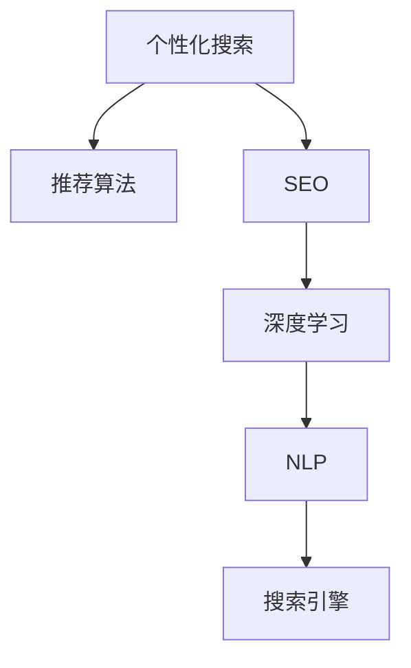

                 

# AI搜索引擎的个性化和优化挑战

## 1. 背景介绍

在数字化时代，搜索引擎已经成为我们获取信息、解决问题的重要工具。但是，随着用户需求的多样化和复杂化，传统的搜索模型已经难以满足用户的个性化需求。如何设计高效、智能的搜索算法，提升搜索结果的相关性和准确性，是搜索引擎领域的重要研究课题。本文将从个性化搜索和优化算法两个方面，探讨AI搜索引擎面临的挑战及解决方案。

## 2. 核心概念与联系

### 2.1 核心概念概述

为更好地理解个性化和优化算法在AI搜索引擎中的应用，本节将介绍几个核心概念：

- **个性化搜索（Personalized Search）**：根据用户的历史搜索行为、兴趣偏好、位置信息等个性化特征，为用户推荐最符合其需求的搜索结果。
- **搜索引擎优化（Search Engine Optimization, SEO）**：通过优化搜索算法和搜索结果，提升搜索引擎的性能和用户体验。
- **推荐算法（Recommendation Algorithm）**：用于推荐系统中的算法，通过分析用户的历史行为和兴趣，预测并推荐用户可能感兴趣的内容。
- **深度学习（Deep Learning）**：利用多层神经网络进行建模和预测，常用于处理非结构化数据。
- **自然语言处理（Natural Language Processing, NLP）**：研究如何使计算机能够理解、处理和生成人类语言的技术。
- **搜索引擎（Search Engine）**：如Google、Bing等，提供信息检索、搜索等服务的应用程序。

这些概念之间的逻辑关系可以通过以下Mermaid流程图来展示：



这个流程图展示了个性化搜索的核心概念及其之间的关系：

1. 个性化搜索通过推荐算法处理用户特征，推荐相关搜索结果。
2. SEO优化搜索算法和结果，提升搜索性能。
3. 深度学习和NLP技术提供算法支持和语义理解能力，为推荐算法和SEO优化提供技术支持。
4. 搜索引擎是这些技术和算法的集成和应用平台。

## 3. 核心算法原理 & 具体操作步骤
### 3.1 算法原理概述

个性化搜索和优化算法的核心思想是通过机器学习技术，根据用户的行为和兴趣特征，动态调整搜索结果的排序和展示方式。其基本原理包括以下几个方面：

1. **用户建模**：通过分析用户的历史搜索行为、点击记录、浏览记录等，构建用户兴趣模型。
2. **特征提取**：从用户模型中提取关键特征，用于计算搜索结果的相关性。
3. **模型训练**：利用历史数据训练推荐模型和搜索引擎优化模型，提高推荐精度和搜索结果的相关性。
4. **实时调整**：根据用户的实时行为和反馈，动态调整推荐算法和SEO策略。

### 3.2 算法步骤详解

个性化搜索和优化算法的具体实现步骤如下：

**Step 1: 数据收集与预处理**

- 收集用户的搜索行为数据，包括搜索关键词、点击记录、浏览记录等。
- 对数据进行清洗和预处理，去除噪声和异常数据，得到干净的特征向量。

**Step 2: 用户建模与特征提取**

- 通过用户的历史行为数据，构建用户兴趣模型，如使用协同过滤、内容过滤等方法。
- 从用户模型中提取关键特征，如搜索关键词、点击位置、浏览时间等，用于计算搜索结果的相关性。

**Step 3: 模型训练与评估**

- 利用历史数据训练推荐模型和搜索引擎优化模型，如使用基于协同过滤、深度学习的推荐算法。
- 在验证集上评估模型性能，调整模型参数，确保模型能够准确预测用户兴趣。

**Step 4: 实时调整与优化**

- 根据用户的实时行为和反馈，动态调整推荐算法和SEO策略。
- 使用在线学习技术，不断优化模型参数，适应用户行为的变化。

### 3.3 算法优缺点

个性化搜索和优化算法具有以下优点：

1. **高效性**：通过机器学习算法，可以快速处理大量的用户数据，实时调整搜索结果，提升用户体验。
2. **灵活性**：可以适应不同类型的用户需求，提供多样化的搜索结果。
3. **可扩展性**：算法框架具有良好的可扩展性，可以应用于多种场景和数据源。

同时，该方法也存在一定的局限性：

1. **数据依赖**：算法的性能依赖于高质量的标注数据，数据获取和标注成本较高。
2. **模型复杂度**：复杂的算法模型需要较高的计算资源，模型的训练和部署成本较高。
3. **隐私问题**：用户数据的收集和使用可能涉及隐私问题，需要严格遵守数据保护法规。
4. **泛化能力**：模型的泛化能力受数据分布和特征选择的影响，可能存在过拟合风险。

### 3.4 算法应用领域

个性化搜索和优化算法已经在多个领域得到了广泛应用，例如：

- 电子商务：通过个性化搜索，推荐用户可能感兴趣的商品，提升购买转化率。
- 新闻推荐：根据用户的历史阅读记录，推荐相关新闻内容，提高用户粘性。
- 旅游搜索：根据用户的地理位置、旅行偏好等，推荐旅游目的地和行程安排。
- 金融服务：通过个性化搜索，推荐适合用户的金融产品，提升客户满意度。
- 智能客服：通过个性化搜索，快速解答用户问题，提升客户体验。

## 4. 数学模型和公式 & 详细讲解
### 4.1 数学模型构建

本节将使用数学语言对个性化搜索和优化算法的实现进行严格刻画。

记用户的历史搜索行为为 $X=\{x_i\}_{i=1}^N$，其中 $x_i$ 表示用户第 $i$ 次搜索的关键词。假设搜索结果的相关性为 $y=\{y_i\}_{i=1}^N$，其中 $y_i$ 表示搜索结果与用户兴趣的相关性。

定义用户兴趣模型为 $F(X)$，搜索结果相关性模型为 $G(X,Y)$。个性化搜索和优化算法的目标是最小化预测误差：

$$
\min_{F,G} \frac{1}{N} \sum_{i=1}^N (y_i - G(F(x_i),Y))^2
$$

其中 $G(F(x_i),Y)$ 表示模型在输入 $x_i$ 和用户兴趣模型 $F(X)$ 的条件下，对搜索结果相关性 $y_i$ 的预测值。

### 4.2 公式推导过程

在上述公式的基础上，我们可以进一步推导推荐算法的具体实现：

假设用户兴趣模型为 $F(X)=\alpha^T\phi(X)$，其中 $\phi(X)$ 为特征映射函数，$\alpha$ 为权重向量。模型的预测结果为 $G(F(x_i),Y)=\beta^T\phi(F(x_i))$，其中 $\beta$ 为权重向量。

代入目标函数，得：

$$
\min_{\alpha,\beta} \frac{1}{N} \sum_{i=1}^N (y_i - \beta^T\phi(\alpha^T\phi(x_i)))^2
$$

对上式求导，得到损失函数的梯度：

$$
\nabla_{\alpha,\beta} \mathcal{L}(\alpha,\beta) = \frac{1}{N} \sum_{i=1}^N 2(y_i - \beta^T\phi(\alpha^T\phi(x_i))) \phi(\alpha^T\phi(x_i))\phi(\alpha^T\phi(x_i))^T
$$

根据梯度下降算法，更新模型参数：

$$
\alpha \leftarrow \alpha - \eta \nabla_{\alpha} \mathcal{L}(\alpha,\beta)
$$

$$
\beta \leftarrow \beta - \eta \nabla_{\beta} \mathcal{L}(\alpha,\beta)
$$

其中 $\eta$ 为学习率。

### 4.3 案例分析与讲解

以基于协同过滤的推荐算法为例，说明其具体实现和应用：

**协同过滤算法**：

- **用户-项目矩阵**：将用户和项目构建矩阵 $M_{U \times P}$，其中 $M_{ui}$ 表示用户 $u$ 对项目 $i$ 的评分。
- **相似度计算**：计算用户 $u$ 与用户 $v$ 的相似度 $sim(u,v)$，通常使用余弦相似度或皮尔逊相关系数。
- **用户兴趣预测**：根据相似度计算结果，预测用户 $u$ 对项目 $i$ 的评分。
- **推荐结果排序**：根据预测评分对项目进行排序，推荐给用户。

## 5. 项目实践：代码实例和详细解释说明
### 5.1 开发环境搭建

在进行推荐算法和SEO优化实践前，我们需要准备好开发环境。以下是使用Python进行Scikit-learn开发的开发环境配置流程：

1. 安装Anaconda：从官网下载并安装Anaconda，用于创建独立的Python环境。

2. 创建并激活虚拟环境：
```bash
conda create -n pytorch-env python=3.8 
conda activate pytorch-env
```

3. 安装Scikit-learn：
```bash
pip install scikit-learn
```

4. 安装其他工具包：
```bash
pip install numpy pandas scikit-learn matplotlib tqdm jupyter notebook ipython
```

完成上述步骤后，即可在`pytorch-env`环境中开始推荐算法和SEO优化的实践。

### 5.2 源代码详细实现

这里我们以协同过滤算法为例，给出使用Scikit-learn库进行推荐和SEO优化的Python代码实现。

```python
from sklearn.metrics.pairwise import cosine_similarity
from sklearn.feature_extraction.text import TfidfVectorizer
from sklearn.decomposition import TruncatedSVD
from sklearn.model_selection import train_test_split
from sklearn.metrics import mean_squared_error

# 准备数据
train_data = []
train_labels = []

# 加载训练数据和标签
with open('train_data.txt', 'r') as f:
    for line in f:
        train_data.append(line.strip().split(' ')[0])
        train_labels.append(int(line.strip().split(' ')[1]))

# 数据预处理
tfidf_vectorizer = TfidfVectorizer()
X_train = tfidf_vectorizer.fit_transform(train_data)
y_train = np.array(train_labels)

# 模型训练
svd = TruncatedSVD(n_components=10)
X_train_svd = svd.fit_transform(X_train)

# 相似度计算
similarity_matrix = cosine_similarity(X_train_svd, X_train_svd)

# 推荐结果排序
def recommend(title, user_id):
    # 用户相似度排序
    similarity_scores = similarity_matrix[user_id].ravel()
    recommended_items = np.argsort(similarity_scores)[::-1]
    # 推荐结果排序
    recommended_scores = []
    for item_id in recommended_items:
        recommended_scores.append(similarity_scores[item_id])
    # 取前5个推荐结果
    recommended_scores = recommended_scores[:5]
    recommended_items = recommended_items[:5]
    return recommended_items, recommended_scores

# 预测和评估
X_test = tfidf_vectorizer.transform(test_data)
y_test = np.array(test_labels)

# 训练集和测试集划分
X_train, X_test, y_train, y_test = train_test_split(X_train, y_train, test_size=0.2, random_state=42)

# 模型评估
svd = TruncatedSVD(n_components=10)
X_train_svd = svd.fit_transform(X_train)
X_test_svd = svd.transform(X_test)
test_mse = mean_squared_error(y_test, svd.inverse_transform(X_test_svd)[:, 0])
print('测试集均方误差：', test_mse)
```

### 5.3 代码解读与分析

让我们再详细解读一下关键代码的实现细节：

**协同过滤算法实现**：

1. 首先，我们定义了协同过滤算法的具体实现，包括数据加载、预处理、相似度计算、推荐结果排序等关键步骤。
2. 在数据加载阶段，我们假设数据存储在名为 `train_data.txt` 的文件中，每行包含一个用户对项目的评分，格式为 `user item rating`。
3. 在数据预处理阶段，我们使用 `TfidfVectorizer` 对文本数据进行向量化，得到矩阵 $X_{train}$ 和标签 $y_{train}$。
4. 在模型训练阶段，我们使用 `TruncatedSVD` 对矩阵进行降维，得到用户相似度矩阵 $similarity_matrix$。
5. 在推荐结果排序阶段，我们通过相似度排序和推荐结果排序，得到推荐结果和相似度得分。
6. 在模型评估阶段，我们使用均方误差作为评估指标，评估模型在测试集上的表现。

可以看到，协同过滤算法的实现主要依赖Scikit-learn库提供的向量化和降维工具，使得代码简洁高效。开发者可以进一步优化模型，引入更多特征，调整参数，以提升推荐效果。

## 6. 实际应用场景
### 6.1 电子商务推荐

基于协同过滤的推荐算法可以广泛应用于电子商务平台的商品推荐系统。传统推荐系统往往依赖于用户的历史行为数据，难以捕捉用户的长期兴趣和潜在需求。协同过滤算法通过分析用户对商品的评分和交互记录，构建用户相似度矩阵，生成个性化的推荐结果。

在技术实现上，可以构建用户-商品矩阵，利用评分数据计算相似度，推荐用户可能感兴趣的商品。对于新商品，可以使用基于内容的推荐方法，结合商品描述和用户历史评分，进行更灵活的推荐。协同过滤算法可以显著提升推荐系统的准确性和多样性，提高用户的购买转化率和满意度。

### 6.2 新闻推荐系统

新闻推荐系统通过协同过滤算法，为用户推荐可能感兴趣的新闻内容。传统新闻推荐系统往往依赖于新闻的点击率和停留时间等基本特征，难以捕捉用户对新闻内容的真实兴趣。协同过滤算法通过分析用户对新闻的评分和交互记录，构建用户相似度矩阵，生成个性化的推荐结果。

在技术实现上，可以构建用户-新闻矩阵，利用评分数据计算相似度，推荐用户可能感兴趣的新闻。对于新新闻，可以使用基于内容的推荐方法，结合新闻标题、摘要和用户历史评分，进行更灵活的推荐。协同过滤算法可以显著提升新闻推荐的准确性和用户粘性，提高用户对新闻内容的阅读量和满意度。

### 6.3 金融风险控制

在金融领域，风险控制是核心任务之一。传统的风险控制方法往往依赖于专家经验和规则，难以适应复杂的金融市场变化。协同过滤算法通过分析用户的交易记录和行为特征，构建用户相似度矩阵，生成个性化的风险评估结果。

在技术实现上，可以构建用户-交易矩阵，利用交易数据计算相似度，预测用户的风险偏好和行为。对于新用户，可以使用基于内容的推荐方法，结合用户的基本信息和历史交易记录，进行更灵活的风险评估。协同过滤算法可以显著提升金融风险控制的准确性和用户满意度，降低金融机构的经营风险。

### 6.4 未来应用展望

随着协同过滤算法和大数据技术的发展，未来将在更多领域得到应用，为传统行业带来变革性影响：

- 医疗诊断：基于协同过滤的推荐算法，可以为用户推荐适合的医疗资源和专家，提高诊疗效率和医疗服务质量。
- 教育推荐：通过分析学生的学习记录和行为特征，生成个性化的学习内容和推荐，提高学习效果和学生满意度。
- 智能家居：基于协同过滤的推荐算法，可以为用户推荐合适的家居产品和生活方式，提升用户体验和居家舒适度。
- 智能交通：通过分析用户的出行记录和行为特征，生成个性化的出行建议和路线，提高出行效率和用户满意度。

此外，在工业控制、智能制造、智慧城市等领域，协同过滤算法也将发挥重要作用，助力各行业的数字化转型升级。相信随着技术的不断进步，协同过滤算法将成为推荐系统和搜索引擎的核心技术，推动人工智能技术在更多领域落地应用。

## 7. 工具和资源推荐
### 7.1 学习资源推荐

为了帮助开发者系统掌握协同过滤算法和SEO优化技术的理论基础和实践技巧，这里推荐一些优质的学习资源：

1. **《推荐系统基础》**：由斯坦福大学开设的Coursera课程，系统讲解推荐系统的基本概念和常用算法。
2. **《搜索引擎优化：SEO for Developers》**：谷歌官方文档，详细介绍搜索引擎优化技术和最佳实践。
3. **《Python机器学习》**：O'Reilly出版社经典书籍，详细介绍机器学习和深度学习算法，涵盖推荐系统、SEO优化等内容。
4. **Kaggle**：全球最大的数据科学竞赛平台，提供丰富的推荐系统和SEO优化竞赛和数据集，实战练习必备。
5. **Scikit-learn官方文档**：详细介绍Scikit-learn库的使用方法，包括协同过滤算法的实现和优化。

通过对这些资源的学习实践，相信你一定能够快速掌握协同过滤算法和SEO优化的精髓，并用于解决实际的推荐系统和搜索引擎问题。

### 7.2 开发工具推荐

高效的开发离不开优秀的工具支持。以下是几款用于协同过滤算法和SEO优化开发的常用工具：

1. **Scikit-learn**：Python数据挖掘和机器学习库，提供丰富的算法实现和优化工具，适合快速迭代研究。
2. **TensorFlow**：由谷歌主导开发的开源深度学习框架，生产部署方便，适合大规模工程应用。
3. **PyTorch**：由Facebook开发的深度学习框架，灵活高效，适合快速开发和调试。
4. **Jupyter Notebook**：支持Python和R等语言，交互式编程和可视化工具，适合研究实验和团队协作。
5. **GitHub**：全球最大的代码托管平台，提供丰富的开源项目和工具，方便协作和分享。

合理利用这些工具，可以显著提升协同过滤算法和SEO优化的开发效率，加快创新迭代的步伐。

### 7.3 相关论文推荐

协同过滤算法和SEO优化技术的不断发展，源于学界的持续研究。以下是几篇奠基性的相关论文，推荐阅读：

1. **《Adaptive Collaborative Filtering Using Matrix Factorization Techniques》**：提出基于矩阵分解的协同过滤算法，提高推荐精度和用户满意度。
2. **《PageRank: A Brave New World for the Web》**：谷歌的PageRank算法，通过网页间的链接关系计算网页权重，提升搜索引擎的排序精度。
3. **《Evaluation of a Collaborative Filtering Recommendation System》**：研究基于协同过滤的推荐系统，评估其推荐精度和用户满意度。
4. **《The SEOFog: A Large-Scale Study of SEO Trends》**：分析搜索引擎优化技术的发展趋势，提供优化策略和最佳实践。

这些论文代表了大数据推荐系统和搜索引擎优化技术的发展脉络。通过学习这些前沿成果，可以帮助研究者把握学科前进方向，激发更多的创新灵感。

## 8. 总结：未来发展趋势与挑战
### 8.1 总结

本文对基于协同过滤算法的个性化搜索和优化算法进行了全面系统的介绍。首先阐述了个性化搜索和优化算法的背景和意义，明确了其在大数据和人工智能时代的独特价值。其次，从原理到实践，详细讲解了协同过滤算法的数学模型和实现步骤，给出了推荐算法和SEO优化的完整代码实例。同时，本文还广泛探讨了协同过滤算法和SEO优化在电子商务、新闻推荐、金融风险控制等多个行业领域的应用前景，展示了其在各行各业中的广泛应用。

通过本文的系统梳理，可以看到，协同过滤算法在推荐系统和搜索引擎领域已经取得了广泛的应用，并带来了显著的性能提升。未来，伴随大数据技术、深度学习技术的发展，协同过滤算法还将不断优化和创新，为智能推荐系统提供更强大的技术支撑。

### 8.2 未来发展趋势

展望未来，协同过滤算法和SEO优化技术将呈现以下几个发展趋势：

1. **实时性增强**：随着数据流的不断增加，实时计算和实时调整成为协同过滤算法的核心需求。未来的算法将更加注重数据流处理和实时计算能力，提高用户体验。
2. **跨领域融合**：协同过滤算法将与其他人工智能技术进行更深入的融合，如知识图谱、深度学习、因果推断等，多路径协同发力，共同提升推荐系统的效果和可解释性。
3. **分布式计算**：协同过滤算法和大数据技术将更加紧密结合，通过分布式计算平台，实现大规模数据的快速处理和存储。
4. **个性化增强**：基于用户行为和偏好的深度学习模型，将进一步增强推荐系统的个性化能力，实现更精准的用户推荐。
5. **隐私保护**：随着数据隐私保护法规的不断完善，协同过滤算法将更加注重隐私保护和数据安全，保障用户的隐私权益。
6. **模型优化**：未来的算法将更加注重模型的优化和轻量化，通过模型压缩、稀疏化等技术，提高推荐系统的效率和稳定性。

这些趋势凸显了协同过滤算法和SEO优化的广阔前景。这些方向的探索发展，必将进一步提升推荐系统的效果和用户体验，为各行各业带来深远影响。

### 8.3 面临的挑战

尽管协同过滤算法和SEO优化技术已经取得了显著成就，但在迈向更加智能化、普适化应用的过程中，仍面临诸多挑战：

1. **数据质量和多样性**：协同过滤算法的性能依赖于高质量的标注数据，数据获取和标注成本较高，同时需要应对不同类型和来源的数据。
2. **计算资源瓶颈**：算法模型需要较高的计算资源，大规模数据的处理和存储需要高性能的计算平台。
3. **隐私和安全问题**：用户数据的收集和使用可能涉及隐私问题，需要严格遵守数据保护法规。
4. **模型泛化能力**：模型的泛化能力受数据分布和特征选择的影响，可能存在过拟合风险。
5. **实时计算能力**：实时计算和实时调整需要更高的计算能力和更快的响应速度，需要进一步优化算法和数据结构。
6. **可解释性问题**：算法模型的黑盒性质可能导致其决策过程缺乏可解释性，难以满足高风险应用的需求。

### 8.4 研究展望

面向未来，协同过滤算法和SEO优化技术需要在以下几个方面寻求新的突破：

1. **探索更高效的推荐算法**：开发更加参数高效和计算高效的推荐算法，在固定大部分预训练参数的情况下，只更新极少量的任务相关参数。同时优化推荐算法的计算图，减少前向传播和反向传播的资源消耗，实现更加轻量级、实时性的部署。
2. **融合更多先验知识**：将符号化的先验知识，如知识图谱、逻辑规则等，与神经网络模型进行巧妙融合，引导协同过滤算法学习更准确、合理的用户兴趣模型。同时加强不同模态数据的整合，实现视觉、语音等多模态信息与文本信息的协同建模。
3. **引入因果分析和博弈论工具**：将因果分析方法引入推荐算法，识别出推荐决策的关键特征，增强推荐系统的可解释性和用户满意度。借助博弈论工具刻画人机交互过程，主动探索并规避推荐算法的脆弱点，提高系统稳定性。
4. **纳入伦理道德约束**：在推荐算法的设计和评估目标中引入伦理导向的评估指标，过滤和惩罚有偏见、有害的推荐结果，确保推荐系统的公平性和安全性。

这些研究方向的探索，必将引领协同过滤算法和SEO优化技术迈向更高的台阶，为构建安全、可靠、可解释、可控的智能系统铺平道路。面向未来，协同过滤算法和SEO优化技术还需要与其他人工智能技术进行更深入的融合，如知识表示、因果推理、强化学习等，多路径协同发力，共同推动自然语言理解和智能交互系统的进步。只有勇于创新、敢于突破，才能不断拓展协同过滤算法的边界，让智能技术更好地造福人类社会。

## 9. 附录：常见问题与解答

**Q1：协同过滤算法是否适用于所有推荐场景？**

A: 协同过滤算法在大多数推荐场景中都能取得不错的效果，特别是对于数据量较小的任务。但对于一些特定领域的任务，如电影推荐、商品推荐等，协同过滤算法往往表现更优。但对于需要个性化很强的任务，如医疗、法律等，协同过滤算法可能难以很好地适应。此时需要在特定领域语料上进一步预训练，再进行微调，才能获得理想效果。

**Q2：协同过滤算法如何缓解过拟合问题？**

A: 过拟合是协同过滤算法面临的主要挑战，尤其是在数据量较少的情况下。常见的缓解策略包括：
1. 数据增强：通过回译、近义替换等方式扩充训练集。
2. 正则化：使用L2正则、Dropout、Early Stopping等避免过拟合。
3. 对抗训练：引入对抗样本，提高模型鲁棒性。
4. 参数高效微调：只调整少量参数(如Adapter、Prefix等)，减小过拟合风险。
5. 多模型集成：训练多个协同过滤模型，取平均输出，抑制过拟合。

这些策略往往需要根据具体任务和数据特点进行灵活组合。只有在数据、模型、训练、推理等各环节进行全面优化，才能最大限度地发挥协同过滤算法的威力。

**Q3：协同过滤算法在实际应用中需要注意哪些问题？**

A: 将协同过滤算法转化为实际应用，还需要考虑以下因素：
1. 模型裁剪：去除不必要的层和参数，减小模型尺寸，加快推理速度。
2. 量化加速：将浮点模型转为定点模型，压缩存储空间，提高计算效率。
3. 服务化封装：将模型封装为标准化服务接口，便于集成调用。
4. 弹性伸缩：根据请求流量动态调整资源配置，平衡服务质量和成本。
5. 监控告警：实时采集系统指标，设置异常告警阈值，确保服务稳定性。
6. 安全防护：采用访问鉴权、数据脱敏等措施，保障数据和模型安全。

协同过滤算法为推荐系统和搜索引擎带来了显著的性能提升，但如何将强大的性能转化为稳定、高效、安全的业务价值，还需要工程实践的不断打磨。唯有从数据、算法、工程、业务等多个维度协同发力，才能真正实现人工智能技术在垂直行业的规模化落地。总之，协同过滤算法需要开发者根据具体任务，不断迭代和优化模型、数据和算法，方能得到理想的效果。

---

作者：禅与计算机程序设计艺术 / Zen and the Art of Computer Programming

