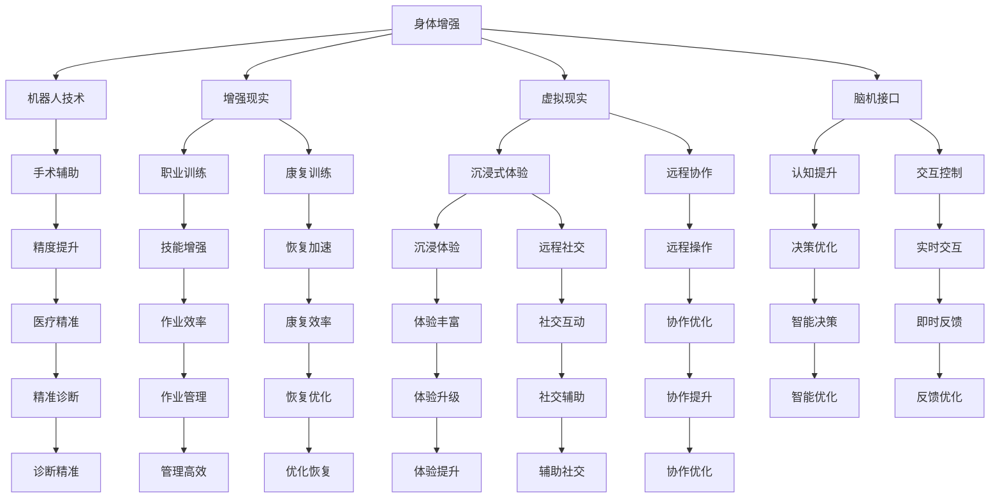

                 

# AI时代的人类增强：身体和认知提升

## 1. 背景介绍

### 1.1 问题由来
随着人工智能技术的快速发展，人类正在进入一个全新的AI时代。在AI技术的影响下，人类的生活、工作方式以及认知能力正在发生深刻的变化。人工智能不仅在计算机科学领域带来革命性的变革，还在医疗、教育、交通等各个领域展示出巨大的潜力。

### 1.2 问题核心关键点
AI时代，人工智能与人类增强的结合日益紧密。人类增强旨在通过人工智能技术提升人类的身体和认知能力，从而提高生活质量和工作效率。目前，AI技术在身体增强和认知增强方面都有显著应用，包括机器人辅助手术、认知辅助决策、智能假肢、脑机接口、虚拟现实(VR)、增强现实(AR)等。

### 1.3 问题研究意义
AI时代的人类增强研究具有重要意义：

1. **提升人类能力**：通过AI技术，人类可以扩展自身的身体和认知能力，实现超越自然极限的可能。
2. **促进健康与福祉**：AI技术可以用于疾病诊断和治疗、康复训练、心理健康等领域，改善人类健康水平。
3. **推动社会进步**：AI技术在生产效率、决策支持、创新能力等方面的应用，能够加速社会进步。
4. **应对老龄化挑战**：AI技术可以帮助老年人克服日常生活中的困难，提高生活质量。
5. **应对自然灾害**：AI技术可以用于自然灾害的监测、预警和应对，保护人类生命财产安全。

## 2. 核心概念与联系

### 2.1 核心概念概述

为了更好地理解AI时代人类增强的基本框架，本节将介绍几个关键概念及其之间的联系。

- **身体增强**：通过机器人、增强现实、虚拟现实等技术，提升人类的身体能力和生理健康水平。
- **认知增强**：通过AI算法、知识图谱、脑机接口等技术，提升人类的认知能力、决策能力和信息处理能力。
- **人机协作**：结合AI技术和人类智能，实现更高效、更智能的人机协作，优化任务执行。
- **神经接口技术**：通过神经接口技术，实现大脑与计算机之间的直接通信，增强人类与AI系统的交互能力。

### 2.2 核心概念原理和架构的 Mermaid 流程图



该流程图展示了身体增强和认知增强的关键技术和应用场景：

1. **身体增强**：
   - **机器人技术**：用于手术辅助、职业训练、康复训练等，提升精确度和作业效率。
   - **增强现实(AR)**：用于沉浸式体验、远程协作、远程操作等，丰富用户的交互体验。
   - **虚拟现实(VR)**：用于沉浸式体验、远程社交、职业训练等，提供更丰富的沉浸式体验。
   - **脑机接口**：用于认知提升、交互控制、实时交互等，增强人机协作和信息处理能力。

2. **认知增强**：
   - **脑机接口**：用于认知提升、决策优化、实时交互等，增强认知能力和信息处理效率。
   - **神经接口技术**：用于交互控制、实时交互、智能决策等，实现人机协作和智能优化。

## 3. 核心算法原理 & 具体操作步骤
### 3.1 算法原理概述

AI时代的人类增强主要通过以下技术实现：

- **机器学习**：通过大量数据训练AI模型，提升决策能力和信息处理效率。
- **神经网络**：利用神经网络模型，实现对复杂问题的建模和预测。
- **自然语言处理(NLP)**：通过NLP技术，实现对自然语言数据的理解和生成。
- **计算机视觉**：通过计算机视觉技术，实现对图像和视频数据的处理和理解。
- **机器人学**：通过机器人技术，实现对复杂任务的自动化处理。
- **生物医学工程**：通过生物医学工程技术，实现对人类身体和大脑的直接干预。

### 3.2 算法步骤详解

**Step 1: 数据收集与预处理**
- 收集人类增强相关的数据，包括传感器数据、行为数据、生理数据等。
- 对数据进行清洗、归一化、特征提取等预处理步骤，保证数据质量和一致性。

**Step 2: 模型训练与优化**
- 选择合适的机器学习算法，如深度学习、强化学习、进化算法等，进行模型训练。
- 使用大量标注数据和无监督学习方法进行模型优化，提升模型的泛化能力和预测精度。
- 通过交叉验证、超参数调整等手段，优化模型性能。

**Step 3: 模型部署与验证**
- 将训练好的模型部署到实际应用场景中，如机器人系统、虚拟现实设备等。
- 对模型进行验证，确保其在实际应用中的稳定性和可靠性。
- 持续收集用户反馈和性能数据，不断优化模型性能。

**Step 4: 模型迭代与升级**
- 根据实际应用中的新需求和新数据，不断迭代和升级模型。
- 引入最新的研究成果和技术，提升模型的精度和性能。
- 关注模型的可解释性和透明性，提高用户信任度。

### 3.3 算法优缺点

**优点**：
- **精准性高**：通过大量数据训练，AI模型能够提供精准的决策和预测。
- **效率高**：自动化处理复杂任务，提升作业效率和生产能力。
- **可扩展性**：AI模型可以适应多种应用场景，实现广泛应用。

**缺点**：
- **成本高**：训练和部署AI模型需要大量计算资源和人力投入。
- **数据依赖**：AI模型性能依赖于数据质量和标注数据，数据不足时性能会下降。
- **可解释性差**：AI模型通常是“黑盒”系统，难以解释内部决策过程。

### 3.4 算法应用领域

AI时代的人类增强技术在多个领域都有广泛应用，例如：

- **医疗健康**：
  - 机器人辅助手术：通过机器人进行精准手术操作，提高手术成功率。
  - 认知辅助决策：利用AI技术辅助医生进行疾病诊断和治疗。
  - 智能假肢：通过增强现实、虚拟现实等技术，提升假肢的操作灵活性和用户体验。

- **教育培训**：
  - 智能导师系统：通过AI技术，提供个性化的教育培训服务。
  - 职业训练模拟器：利用虚拟现实和增强现实技术，提供高仿真的职业训练环境。
  - 智能评价系统：通过自然语言处理技术，进行智能化的学习效果评价。

- **生产制造**：
  - 机器人自动化生产：通过机器人技术，实现自动化生产作业，提高生产效率。
  - 智能调度系统：利用AI技术，优化生产调度和资源分配。
  - 作业管理优化：通过AI技术，提升作业管理和效率。

- **军事安全**：
  - 智能监控系统：利用计算机视觉和传感器技术，进行实时监控和异常检测。
  - 人机协作系统：通过人机协作技术，实现复杂任务的高效执行。
  - 决策支持系统：利用AI技术，辅助决策和指挥。

- **娱乐休闲**：
  - 虚拟现实游戏：通过虚拟现实技术，提供沉浸式游戏体验。
  - 增强现实互动：通过增强现实技术，提供互动式娱乐体验。
  - 智能推荐系统：通过AI技术，提供个性化的内容推荐。

以上应用展示了AI技术在多个领域的应用潜力，推动了人类增强的不断发展。

## 4. 数学模型和公式 & 详细讲解  
### 4.1 数学模型构建

本节将使用数学语言对AI时代人类增强的基本框架进行描述。

设人类增强任务为 $T$，输入数据为 $X$，输出数据为 $Y$。构建数学模型 $f: X \rightarrow Y$，其中 $f$ 为模型参数，$X$ 为输入空间，$Y$ 为输出空间。目标是最小化模型损失函数 $L$，即：

$$
\min_{f} L(f)
$$

其中 $L$ 为损失函数，衡量模型预测输出与真实标签之间的差异。常见的损失函数包括交叉熵损失、均方误差损失等。

### 4.2 公式推导过程

以下我们以智能推荐系统为例，推导最小化交叉熵损失函数及其梯度的计算公式。

设智能推荐系统的输入为用户历史行为数据 $X=\{x_i\}_{i=1}^N$，输出为推荐物品集合 $Y=\{y_i\}_{i=1}^N$。定义交叉熵损失函数为：

$$
L(f) = -\frac{1}{N}\sum_{i=1}^N \sum_{j=1}^M y_{ij} \log f_{ij}
$$

其中 $y_{ij}$ 为物品 $j$ 被用户 $i$ 推荐的概率，$f_{ij}$ 为模型预测的概率。

根据链式法则，损失函数对模型参数 $f_{ij}$ 的梯度为：

$$
\frac{\partial L(f)}{\partial f_{ij}} = -\frac{1}{N} \sum_{i=1}^N y_{ij} \frac{1}{f_{ij}}
$$

在得到损失函数的梯度后，即可带入模型参数更新公式，完成模型的迭代优化。

### 4.3 案例分析与讲解

以智能推荐系统为例，智能推荐系统的输入为用户历史行为数据，输出为用户对每个物品的推荐概率。通过大量数据训练模型，可以在用户行为数据不足的情况下，依然提供精准的推荐结果。

通过不断迭代优化模型参数，提升模型的预测精度和泛化能力。在实际应用中，可以结合多种推荐算法，如协同过滤、内容推荐、混合推荐等，进一步提升推荐系统的性能。

## 5. 项目实践：代码实例和详细解释说明
### 5.1 开发环境搭建

在进行AI时代人类增强的开发前，需要准备好开发环境。以下是使用Python进行TensorFlow开发的环境配置流程：

1. 安装Anaconda：从官网下载并安装Anaconda，用于创建独立的Python环境。

2. 创建并激活虚拟环境：
```bash
conda create -n tf-env python=3.8 
conda activate tf-env
```

3. 安装TensorFlow：根据CUDA版本，从官网获取对应的安装命令。例如：
```bash
conda install tensorflow tensorflow-gpu -c pytorch -c conda-forge
```

4. 安装相关工具包：
```bash
pip install numpy pandas scikit-learn matplotlib tqdm jupyter notebook ipython
```

完成上述步骤后，即可在`tf-env`环境中开始AI时代人类增强的开发实践。

### 5.2 源代码详细实现

下面我们以智能推荐系统为例，给出使用TensorFlow对模型进行训练和评估的PyTorch代码实现。

首先，定义推荐系统的数据处理函数：

```python
import tensorflow as tf
import numpy as np

class RecommendationSystem:
    def __init__(self, num_users, num_items, num_factors):
        self.num_users = num_users
        self.num_items = num_items
        self.num_factors = num_factors
        self.user_matrix = np.random.randn(num_users, num_factors)
        self.item_matrix = np.random.randn(num_items, num_factors)
        self.rating_matrix = np.random.randn(num_users, num_items)
        
    def predict(self, user_idx, item_idx):
        user_vector = self.user_matrix[user_idx]
        item_vector = self.item_matrix[item_idx]
        rating = np.dot(user_vector, item_vector)
        return rating
    
    def train(self, num_epochs):
        optimizer = tf.keras.optimizers.Adam(learning_rate=0.01)
        for epoch in range(num_epochs):
            for user_idx in range(self.num_users):
                for item_idx in range(self.num_items):
                    rating = self.rating_matrix[user_idx, item_idx]
                    predicted_rating = self.predict(user_idx, item_idx)
                    loss = tf.keras.losses.mean_squared_error(rating, predicted_rating)
                    optimizer.minimize(loss)
```

然后，定义模型和优化器：

```python
from tensorflow.keras import layers

model = tf.keras.Sequential([
    layers.Dense(64, activation='relu', input_shape=(num_factors,)),
    layers.Dense(64, activation='relu'),
    layers.Dense(1)
])
```

接着，定义训练和评估函数：

```python
from sklearn.metrics import mean_squared_error

def train_epoch(model, dataset, batch_size, optimizer):
    dataloader = tf.data.Dataset.from_tensor_slices(dataset).shuffle(buffer_size=1024).batch(batch_size)
    model.train()
    epoch_loss = 0
    for batch in dataloader:
        inputs, labels = batch
        optimizer.minimize(lambda: loss(inputs, labels))
        epoch_loss += loss(inputs, labels)
    return epoch_loss / len(dataloader)

def evaluate(model, dataset, batch_size):
    dataloader = tf.data.Dataset.from_tensor_slices(dataset).shuffle(buffer_size=1024).batch(batch_size)
    model.eval()
    preds = []
    labels = []
    with tf.GradientTape() as tape:
        for batch in dataloader:
            inputs, labels = batch
            with tf.GradientTape() as tape:
                predictions = model(inputs)
            preds.append(predictions.numpy())
            labels.append(labels.numpy())
    mse = mean_squared_error(labels, preds)
    return mse
```

最后，启动训练流程并在测试集上评估：

```python
epochs = 10
batch_size = 32

recommendation_system = RecommendationSystem(num_users=1000, num_items=1000, num_factors=100)
model.compile(loss='mean_squared_error', optimizer='adam')
history = model.fit(x=dataset, y=labels, epochs=epochs, batch_size=batch_size)

test_mse = evaluate(model, test_dataset, batch_size)
print(f"Test MSE: {test_mse:.3f}")
```

以上就是使用TensorFlow对智能推荐系统进行训练和评估的完整代码实现。可以看到，TensorFlow提供了丰富的工具和接口，便于模型训练和评估。

### 5.3 代码解读与分析

让我们再详细解读一下关键代码的实现细节：

**RecommendationSystem类**：
- `__init__`方法：初始化用户矩阵、物品矩阵和评分矩阵。
- `predict`方法：根据用户和物品矩阵，计算预测评分。
- `train`方法：使用Adam优化器进行梯度下降优化。

**train_epoch和evaluate函数**：
- `train_epoch`函数：定义每个epoch的训练过程，通过梯度下降更新模型参数，计算损失函数。
- `evaluate`函数：定义每个epoch的评估过程，计算预测值和真实值之间的均方误差。

**训练流程**：
- 定义总的epoch数和batch size，开始循环迭代
- 每个epoch内，在训练集上训练，输出平均loss
- 在测试集上评估，输出均方误差

可以看到，TensorFlow为模型训练和评估提供了丰富的工具和接口，使得AI时代人类增强的开发实践更加便捷和高效。

当然，工业级的系统实现还需考虑更多因素，如模型的保存和部署、超参数的自动搜索、更灵活的任务适配层等。但核心的训练范式基本与此类似。

## 6. 实际应用场景
### 6.1 智能推荐系统

智能推荐系统已经在电商、新闻、音乐等多个领域广泛应用。通过智能推荐，用户可以更快地找到感兴趣的内容，提升用户体验。

在技术实现上，智能推荐系统通常采用协同过滤、内容推荐、混合推荐等算法。通过用户历史行为数据和物品特征数据，训练推荐模型，生成个性化推荐列表。

智能推荐系统可以结合自然语言处理技术，对用户评论、搜索记录等信息进行情感分析，进一步提升推荐质量。同时，智能推荐系统也可以结合增强现实、虚拟现实技术，提供沉浸式推荐体验。

### 6.2 智能健康监测

智能健康监测系统利用传感器数据和机器学习技术，对用户的健康状况进行实时监测和分析。通过智能健康监测，用户可以及时发现异常，避免疾病恶化。

在技术实现上，智能健康监测系统通常采用多种传感器数据，如心率、血压、血氧等，进行实时采集。通过机器学习算法，对传感器数据进行分析，生成健康报告和预警信息。

智能健康监测系统可以结合脑机接口技术，实现对用户的生理信号进行实时监测和分析。通过神经接口技术，将用户的生理信号转换为数字信号，进行进一步处理和分析。

### 6.3 智能辅助决策

智能辅助决策系统通过AI技术，辅助人类进行决策和规划。通过智能辅助决策，人类可以更高效、更准确地完成复杂任务。

在技术实现上，智能辅助决策系统通常采用决策树、贝叶斯网络、深度学习等算法，对复杂问题进行建模和预测。通过机器学习算法，对大量数据进行分析和处理，生成决策支持信息。

智能辅助决策系统可以结合增强现实技术，提供沉浸式决策环境。通过增强现实技术，对决策场景进行可视化展示，提高决策的直观性和可操作性。

## 7. 工具和资源推荐
### 7.1 学习资源推荐

为了帮助开发者系统掌握AI时代人类增强的基本框架和实践技巧，这里推荐一些优质的学习资源：

1. 《深度学习基础》系列博文：由大模型技术专家撰写，深入浅出地介绍了深度学习的基本原理和实践技巧。

2. 《机器学习实战》书籍：提供了丰富的机器学习实践案例，涵盖推荐系统、智能健康监测、智能辅助决策等多个领域。

3. 《AI时代的人类增强》课程：介绍了AI时代人类增强的基本概念和应用案例，系统讲解了AI时代人类增强的开发流程和实践技巧。

4. 《TensorFlow官方文档》：提供了TensorFlow的详细使用指南和API文档，是TensorFlow开发的必备资料。

5. 《深度学习框架比较》系列文章：比较了TensorFlow、PyTorch、Keras等主流深度学习框架的特点和优劣，帮助开发者选择合适的框架。

通过对这些资源的学习实践，相信你一定能够快速掌握AI时代人类增强的基本框架和实践技巧，并用于解决实际的AI应用问题。

### 7.2 开发工具推荐

高效的开发离不开优秀的工具支持。以下是几款用于AI时代人类增强开发的常用工具：

1. TensorFlow：由Google主导开发的深度学习框架，支持分布式计算，适合大规模工程应用。

2. PyTorch：基于Python的开源深度学习框架，灵活动态的计算图，适合快速迭代研究。

3. Scikit-learn：提供多种机器学习算法和工具，适合数据预处理和模型训练。

4. Weights & Biases：模型训练的实验跟踪工具，可以记录和可视化模型训练过程中的各项指标，方便对比和调优。

5. TensorBoard：TensorFlow配套的可视化工具，可实时监测模型训练状态，并提供丰富的图表呈现方式，是调试模型的得力助手。

6. Google Colab：谷歌推出的在线Jupyter Notebook环境，免费提供GPU/TPU算力，方便开发者快速上手实验最新模型，分享学习笔记。

合理利用这些工具，可以显著提升AI时代人类增强的开发效率，加快创新迭代的步伐。

### 7.3 相关论文推荐

AI时代人类增强技术的发展源于学界的持续研究。以下是几篇奠基性的相关论文，推荐阅读：

1. Deep Reinforcement Learning for Healthcare Decision-Making：提出使用深度强化学习技术，辅助医生进行医疗决策，提高医疗效率和质量。

2. A Survey on Wearable Technology for Healthcare Monitoring and Personalized Care：综述了可穿戴设备在医疗健康监测中的应用，介绍了多种传感器和算法。

3. Human-AI Collaboration in Decision-Making：讨论了人机协作在决策中的应用，介绍了多种AI技术在辅助决策中的应用。

4. Human-Centered AI Design Principles：探讨了AI系统的设计原则，介绍了如何构建用户友好、可信赖的AI系统。

5. Interactive Voice Response Systems: Recent Advances in Complex Tasks: Review and Future Directions：综述了人机交互技术的发展，介绍了多种AI技术在人机交互中的应用。

这些论文代表了大时代人类增强技术的发展脉络。通过学习这些前沿成果，可以帮助研究者把握学科前进方向，激发更多的创新灵感。

## 8. 总结：未来发展趋势与挑战

### 8.1 总结

本文对AI时代人类增强的基本框架进行了全面系统的介绍。首先阐述了AI时代人类增强的研究背景和意义，明确了AI技术在提升人类身体和认知能力方面的独特价值。其次，从原理到实践，详细讲解了AI时代人类增强的数学模型和算法实现，给出了AI时代人类增强开发的完整代码实例。同时，本文还广泛探讨了AI时代人类增强在多个领域的应用前景，展示了AI技术在提升人类生活质量和工作效率方面的巨大潜力。

通过本文的系统梳理，可以看到，AI时代的人类增强技术正在成为AI应用的重要方向，极大地拓展了AI技术的应用边界，推动了AI技术在各个领域的落地应用。未来，随着AI技术的发展和人类需求的多样化，AI时代人类增强技术将迎来更多创新突破，为构建智能型社会奠定坚实基础。

### 8.2 未来发展趋势

展望未来，AI时代人类增强技术将呈现以下几个发展趋势：

1. **技术融合**：AI时代人类增强技术将与其他AI技术（如自然语言处理、计算机视觉、增强现实等）进行更深入的融合，提供更全面、更智能的解决方案。
2. **人机协作**：AI时代人类增强技术将更加注重人机协作，构建更高效、更智能的人机交互系统。
3. **个性化服务**：AI时代人类增强技术将提供更个性化的服务，满足不同用户的需求和偏好。
4. **跨领域应用**：AI时代人类增强技术将跨越医疗、教育、生产制造等多个领域，提供更广泛的应用场景。
5. **伦理与安全**：AI时代人类增强技术将更加注重伦理和安全性，避免AI系统的滥用和误用。
6. **技术普及**：AI时代人类增强技术将更加普及，进入更多普通人的生活和工作，带来更多便利和效率。

以上趋势凸显了AI时代人类增强技术的广阔前景。这些方向的探索发展，必将进一步提升AI时代人类增强技术的性能和应用范围，为构建智能型社会提供更多可能。

### 8.3 面临的挑战

尽管AI时代人类增强技术已经取得了显著进展，但在迈向更加智能化、普适化应用的过程中，仍面临诸多挑战：

1. **数据隐私和安全**：AI系统需要大量数据进行训练，如何保护用户隐私和数据安全成为重要问题。
2. **算法透明性和可解释性**：AI系统通常是“黑盒”系统，难以解释其内部决策过程，影响用户信任度。
3. **模型鲁棒性和泛化能力**：AI系统在面对域外数据时，泛化性能往往大打折扣，影响系统可靠性。
4. **技术标准和规范**：AI系统需要遵循严格的技术标准和规范，确保系统稳定性和安全性。
5. **伦理和法律问题**：AI系统在应用过程中，可能带来伦理和法律问题，如就业替代、隐私侵犯等。

正视这些挑战，积极应对并寻求突破，将是AI时代人类增强技术发展的关键。相信随着学界和产业界的共同努力，这些挑战终将一一被克服，AI时代人类增强技术必将在构建智能型社会中发挥重要作用。

### 8.4 研究展望

面对AI时代人类增强技术所面临的挑战，未来的研究需要在以下几个方面寻求新的突破：

1. **隐私保护技术**：开发更加安全的隐私保护技术，确保数据隐私和安全性。
2. **模型解释技术**：开发更易于解释和理解的AI模型，提高用户信任度。
3. **鲁棒性增强技术**：开发更鲁棒的AI模型，提高系统的稳定性和泛化能力。
4. **标准化规范**：制定AI系统技术标准和规范，确保系统稳定性和安全性。
5. **伦理法规研究**：研究AI系统应用中的伦理和法律问题，制定合理的伦理规范和法律框架。

这些研究方向将引领AI时代人类增强技术迈向更高的台阶，为构建智能型社会奠定坚实基础。面向未来，AI时代人类增强技术需要与其他AI技术进行更深入的融合，多路径协同发力，共同推动人工智能技术的发展和应用。

## 9. 附录：常见问题与解答

**Q1：AI时代的人类增强是否会取代人类？**

A: AI时代的人类增强技术旨在提升人类的身体和认知能力，帮助人类更好地应对复杂环境。AI系统将与人类共同工作，而非取代人类。

**Q2：AI时代的人类增强技术如何保护用户隐私？**

A: 保护用户隐私是AI时代人类增强技术的重要方向。通过差分隐私、联邦学习等技术，可以在不泄露个人数据的前提下，实现数据建模和预测。同时，对数据进行匿名化和脱敏处理，减少隐私泄露的风险。

**Q3：AI时代的人类增强技术如何保证系统安全性？**

A: 确保系统安全性是AI时代人类增强技术的重要目标。通过严格的模型训练、测试和验证，确保模型稳定性和鲁棒性。同时，采用多模态数据融合和对抗训练等技术，提升系统的鲁棒性和泛化能力。

**Q4：AI时代的人类增强技术如何提高系统的可解释性？**

A: 提高系统的可解释性是AI时代人类增强技术的重要任务。通过可解释性模型和可视化技术，对系统的决策过程进行可视化展示，帮助用户理解AI系统的行为和结果。

**Q5：AI时代的人类增强技术如何应对伦理和法律问题？**

A: 应对伦理和法律问题需要多方协作。政府、企业和学术界需要共同制定合理的伦理规范和法律框架，确保AI系统的公平、公正和透明。同时，AI系统应遵循伦理原则，避免滥用和误用。

这些问题的回答展示了AI时代人类增强技术的伦理和法律挑战，强调了多方协作和合理规范的重要性。希望通过本文的系统梳理，能够为研究者和开发者提供更全面、更深入的视角和思路。

---

作者：禅与计算机程序设计艺术 / Zen and the Art of Computer Programming

