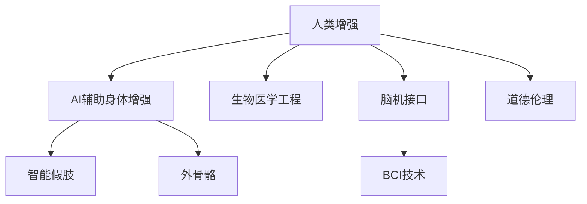

                 

# AI时代的人类增强：身体增强与道德考虑

> 关键词：人类增强, AI, 生物医学工程, 人工智能, 道德伦理

## 1. 背景介绍

随着人工智能(AI)技术的飞速发展，AI在各行各业的应用日益广泛，其中包括医疗、健康、运动等领域，AI正逐步改变人类身体功能的增强方式。身体增强旨在提升人类身体性能，改善生活质量。AI技术在生物医学工程、神经控制、运动康复等方面展示了其巨大的潜力。

### 1.1 问题由来

近年来，人工假肢、智能假肢、外骨骼等生物医学工程技术的进步，使身体增强成为可能。而AI技术的引入，更是为身体增强带来了新的突破。通过AI驱动的智能假肢，人们可以实时感知环境变化，自动调整步态和运动方式。AI辅助的运动康复设备，则能精准定位肌肉损伤，进行个性化的康复训练。但与此同时，这些技术也引发了新的伦理问题，比如人类增强的边界何在？AI的参与如何保证人类自主性？如何保护隐私与数据安全？

### 1.2 问题核心关键点

AI在身体增强领域的应用，面临的核心问题包括：

- 如何确保技术的安全性、可靠性和有效性。
- 如何平衡技术进步与人类伦理道德的边界。
- 如何保护用户隐私，确保数据安全。
- 如何使技术成果普惠大众，提升社会福利。

这些问题的解答，是AI时代身体增强技术健康发展的关键所在。

### 1.3 问题研究意义

研究AI在身体增强领域的应用，对于提升人类生活质量、推动医学进步、促进公平和社会福祉具有重要意义：

1. 提升身体健康：AI辅助的运动康复设备可以精准定位损伤部位，进行个性化治疗，显著提升康复效果。
2. 扩展人类能力：通过AI技术的引入，身体增强设备可以更智能、更高效地运作，从而扩展人类身体的功能。
3. 促进技术创新：AI技术的引入，为身体增强技术的发展提供了新的动力，推动相关领域的研究和创新。
4. 提升社会福祉：通过普惠性的身体增强技术，能够降低残疾人群体的生理负担，提升其生活质量。

## 2. 核心概念与联系

### 2.1 核心概念概述

为更好地理解AI在身体增强领域的应用，本节将介绍几个密切相关的核心概念：

- **人类增强(Human Enhancement)**：旨在通过科技手段提升人类身体和认知能力，改善生活质量。
- **AI辅助身体增强(AI-Assisted Body Enhancement)**：通过AI技术优化身体增强设备的性能，提升其安全性和可靠性。
- **生物医学工程(Biomedical Engineering)**：运用工程原理和方法，解决医学问题，提升人体功能。
- **智能假肢(Smart Prostheses)**：结合AI技术，具备自主感知和控制能力的假肢设备。
- **外骨骼(Exoskeletons)**：结合AI的辅助外骨骼设备，增强人类运动和力量。
- **脑机接口(Brain-Computer Interface, BCI)**：通过AI技术实现人脑与计算机的直接交互，提升人类的认知和运动能力。
- **道德伦理(Ethics)**：涉及AI在身体增强中应用的一系列伦理问题，如隐私保护、公平性、自主性等。

这些概念之间的逻辑关系可以通过以下Mermaid流程图来展示：



这个流程图展示了大语言模型的核心概念及其之间的关系：

1. 人类增强通过AI辅助技术得到进一步的提升。
2. 生物医学工程为身体增强提供了技术和理论基础。
3. 智能假肢和外骨骼技术具体体现了AI在身体增强中的应用。
4. 脑机接口技术是实现人脑与AI交互的关键技术。
5. 道德伦理是考量AI在身体增强应用中必须考虑的重要方面。

## 3. 核心算法原理 & 具体操作步骤

### 3.1 算法原理概述

AI辅助身体增强的核心算法原理主要包括以下几个方面：

- **感知与反馈系统**：AI驱动的感知和反馈系统能够实时监测用户的运动状态，提供实时反馈和调整。
- **控制与优化算法**：通过优化算法，AI可以自动调整设备参数，以达到最佳效果。
- **学习与适应**：利用机器学习技术，AI可以从用户的使用数据中学习，不断优化自身算法。
- **隐私与安全性**：通过加密和隐私保护技术，保障用户数据的安全。

### 3.2 算法步骤详解

基于AI的身体增强算法通常包括以下关键步骤：

**Step 1: 数据收集与预处理**
- 收集用户运动数据，包括位置、姿态、速度、加速度等。
- 对原始数据进行去噪、归一化等预处理。

**Step 2: 模型训练与优化**
- 使用机器学习算法（如深度学习、强化学习等）对数据进行建模。
- 在大量数据上训练模型，不断调整参数以优化性能。
- 使用交叉验证等技术评估模型效果。

**Step 3: 模型部署与验证**
- 将训练好的模型部署到实际设备中，进行实时监测和控制。
- 在真实环境中验证模型的效果，收集反馈数据。
- 根据反馈不断优化模型。

**Step 4: 用户交互与隐私保护**
- 用户通过界面与AI系统进行交互，设置参数和控制设备。
- 使用加密技术保护用户数据，防止数据泄露。
- 遵循伦理规范，保障用户隐私和数据安全。

**Step 5: 系统维护与更新**
- 定期对系统进行维护和更新，提升设备的稳定性和可靠性。
- 跟踪最新研究成果，引入新技术和算法，提升系统性能。

### 3.3 算法优缺点

AI辅助身体增强技术具有以下优点：
1. 精度高：AI技术可以实时感知和分析用户数据，提供精确的控制和反馈。
2. 自主性强：AI系统可以自主学习和适应用户行为，提供个性化的体验。
3. 可扩展性强：AI技术可以应用于各种身体增强设备，提供多样化的解决方案。

同时，该技术也存在一定的局限性：
1. 数据隐私问题：AI系统需要大量的用户数据，如何保护数据隐私是一大挑战。
2. 安全性问题：AI系统存在被攻击和误用的风险，需要强大的安全保障措施。
3. 依赖技术：AI系统的效果依赖于算法和数据，存在算法失效的风险。
4. 伦理道德问题：AI在身体增强中的应用引发了一系列伦理道德问题，如自主性、公平性等。

尽管存在这些局限性，但AI辅助身体增强技术的优势是显而易见的，未来还有很大的应用潜力。

### 3.4 算法应用领域

AI辅助身体增强技术的应用领域广泛，涉及运动康复、假肢辅助、外骨骼系统等多个方面：

1. **运动康复**：利用AI驱动的运动康复设备，进行精准的康复训练，提升康复效果。
2. **假肢辅助**：通过智能假肢和外骨骼系统，提升残疾人士的行动能力和生活质量。
3. **外骨骼系统**：通过AI辅助的外骨骼设备，增强人类运动和力量，提升工作效率。
4. **医疗辅助**：利用AI技术辅助手术、诊断和治疗，提升医疗服务质量。
5. **虚拟现实训练**：通过AI驱动的虚拟现实系统，提供高质量的训练和模拟环境。

## 4. 数学模型和公式 & 详细讲解 & 举例说明

### 4.1 数学模型构建

本节将使用数学语言对AI辅助身体增强的算法进行严格定义。

记用户运动数据为 $X=\{x_i\}_{i=1}^N$，其中 $x_i$ 表示用户在时刻 $i$ 的运动状态。设 $y=f(X)$ 为AI模型对用户运动的预测输出，$y$ 可能是一个运动参数（如步态、速度等），也可能是一个决策（如是否执行特定动作）。

定义损失函数 $L(y,\hat{y})$ 表示模型预测输出与真实输出之间的差异，例如均方误差（MSE）、交叉熵损失（Cross Entropy Loss）等。

AI辅助身体增强的优化目标是最小化损失函数，即：

$$
\min_{\theta} L(y,f_{\theta}(X))
$$

其中 $\theta$ 为AI模型的参数，$f_{\theta}(X)$ 表示在参数 $\theta$ 下的预测输出。

### 4.2 公式推导过程

以下我们以智能假肢为例，推导AI辅助身体增强的预测模型。

假设智能假肢需要根据用户运动状态 $x$ 预测步态 $y$，则AI模型可以表示为：

$$
y=f_{\theta}(x)=W_1[x_1, x_2, ..., x_n] + b_1
$$

其中 $W_1$ 为权重矩阵，$b_1$ 为偏置项。为简化问题，我们假设 $x_i$ 表示用户运动的速度，即 $x_i$ 为时刻 $i$ 的步态速度。则 $y$ 为下一步的步态，即 $y$ 表示预测的下一步速度。

训练数据集为 $D=\{(x_i,y_i)\}_{i=1}^N$，损失函数为均方误差（MSE），目标是最小化损失函数：

$$
L(y,\hat{y})=\frac{1}{N}\sum_{i=1}^N (y_i - \hat{y_i})^2
$$

使用随机梯度下降（SGD）等优化算法，迭代更新模型参数 $\theta$，直到收敛。

**示例数据**：假设 $x_1=2.5, x_2=3.0, y_1=2.0, y_2=3.2, y_3=3.4$，使用$MSE$损失函数：

**步骤1：初始化参数**
$$
W_1=[0.1, 0.2], b_1=0.5
$$

**步骤2：前向传播**
$$
y_1=0.1*2.5+0.2*3.0+0.5=2.35 \\
y_2=0.1*3.0+0.2*3.0+0.5=3.1 \\
y_3=0.1*3.0+0.2*3.0+0.5=3.3
$$

**步骤3：计算损失**
$$
L(y,\hat{y})=\frac{1}{3}[(2.0-2.35)^2+(3.2-3.1)^2+(3.4-3.3)^2]=0.04
$$

**步骤4：反向传播，更新参数**
$$
\frac{\partial L}{\partial W_1}=[(2.0-2.35), (3.2-3.1), (3.4-3.3)]=[0.225, 0.1, 0.1] \\
\frac{\partial L}{\partial b_1}=[0.225, 0.1, 0.1]=[0.225, 0.1, 0.1] \\
W_1=W_1-\eta\frac{\partial L}{\partial W_1}=[0.1-\eta*0.225, 0.2-\eta*0.1]=[0.1-0.225\eta, 0.2-0.1\eta] \\
b_1=b_1-\eta\frac{\partial L}{\partial b_1}=0.5-\eta*0.225=0.5-0.225\eta
$$

**步骤5：迭代更新**
$$
\eta=0.01
$$

**步骤6：计算新预测值**
$$
y_1=0.1*(2.5+0.225\eta)+(0.2-0.1\eta)+0.5 \\
y_2=0.1*(3.0+0.225\eta)+(0.2-0.1\eta)+0.5 \\
y_3=0.1*(3.0+0.225\eta)+(0.2-0.1\eta)+0.5
$$

**步骤7：计算新损失**
$$
L(y,\hat{y})=\frac{1}{3}[(2.0-y_1)^2+(3.2-y_2)^2+(3.4-y_3)^2]
$$

### 4.3 案例分析与讲解

我们以BCI技术为例，分析其在脑控假肢中的应用。

BCI技术通过捕捉脑电波信号，将脑意转化为控制指令，从而实现人脑与假肢的直接交互。具体流程如下：

1. **信号采集**：使用脑电波传感器采集用户大脑皮层信号。
2. **信号预处理**：对原始信号进行滤波、去噪等预处理。
3. **特征提取**：提取脑电波信号的特征，如时域、频域等。
4. **模型训练**：使用机器学习算法（如SVM、神经网络等）训练分类模型，将脑电波信号映射为控制指令。
5. **实时控制**：在用户使用假肢时，实时捕捉脑电波信号，使用训练好的模型进行分类，输出控制指令，控制假肢运动。

以运动信号分类为例，假设有两个用户，分别控制不同的动作，如握拳和张开。分类模型使用交叉熵损失函数：

$$
L(y,\hat{y})=-\frac{1}{N}\sum_{i=1}^N [y_i\log \hat{y_i} + (1-y_i)\log (1-\hat{y_i})]
$$

模型使用SGD优化算法进行训练，参数更新公式为：

$$
\theta \leftarrow \theta - \eta \nabla_{\theta}\mathcal{L}(\theta)
$$

其中 $\eta$ 为学习率，$\nabla_{\theta}\mathcal{L}(\theta)$ 为损失函数对参数 $\theta$ 的梯度。

**示例数据**：假设训练数据集为 $D=\{(x_i,y_i)\}_{i=1}^N$，其中 $x_i$ 为脑电波信号，$y_i \in \{0,1\}$ 表示是否执行动作。使用交叉熵损失函数：

**步骤1：初始化参数**
$$
W=[0.1,0.2], b=0.5
$$

**步骤2：前向传播**
$$
\hat{y}=\text{sigmoid}(Wx+b)
$$

**步骤3：计算损失**
$$
L(y,\hat{y})=-\frac{1}{N}\sum_{i=1}^N [y_i\log \hat{y_i} + (1-y_i)\log (1-\hat{y_i})]
$$

**步骤4：反向传播，更新参数**
$$
\frac{\partial L}{\partial W}=[\hat{y_i}-y_i]\hat{y_i}(1-\hat{y_i})x^T=[0.5-0.5\hat{y_i}]\hat{y_i}(1-\hat{y_i})x^T \\
\frac{\partial L}{\partial b}=[\hat{y_i}-y_i]\hat{y_i}(1-\hat{y_i})=[0.5-0.5\hat{y_i}] \\
W=W-\eta\frac{\partial L}{\partial W}=[0.1-\eta(0.5-0.5\hat{y_i})0.2-\eta(0.5-0.5\hat{y_i})]=[0.1-\eta(0.5-0.5\hat{y_i}),0.2-\eta(0.5-0.5\hat{y_i})] \\
b=b-\eta\frac{\partial L}{\partial b}=[0.5-\eta(0.5-0.5\hat{y_i})]=0.5-\eta(0.5-0.5\hat{y_i})
$$

**步骤5：迭代更新**
$$
\eta=0.01
$$

**步骤6：计算新预测值**
$$
\hat{y}=\text{sigmoid}(Wx+b)
$$

**步骤7：计算新损失**
$$
L(y,\hat{y})=-\frac{1}{N}\sum_{i=1}^N [y_i\log \hat{y_i} + (1-y_i)\log (1-\hat{y_i})]
$$

## 5. 项目实践：代码实例和详细解释说明

### 5.1 开发环境搭建

在进行AI辅助身体增强项目实践前，我们需要准备好开发环境。以下是使用Python进行PyTorch开发的环境配置流程：

1. 安装Anaconda：从官网下载并安装Anaconda，用于创建独立的Python环境。

2. 创建并激活虚拟环境：
```bash
conda create -n pytorch-env python=3.8 
conda activate pytorch-env
```

3. 安装PyTorch：根据CUDA版本，从官网获取对应的安装命令。例如：
```bash
conda install pytorch torchvision torchaudio cudatoolkit=11.1 -c pytorch -c conda-forge
```

4. 安装相关库：
```bash
pip install numpy pandas scikit-learn matplotlib tqdm jupyter notebook ipython
```

完成上述步骤后，即可在`pytorch-env`环境中开始项目实践。

### 5.2 源代码详细实现

下面我们以智能假肢预测步态为例，给出使用PyTorch进行AI辅助身体增强的PyTorch代码实现。

首先，定义智能假肢预测步态的数据处理函数：

```python
import torch
from torch.utils.data import Dataset
import numpy as np

class StepPredictionDataset(Dataset):
    def __init__(self, data, labels, window_size=1):
        self.data = data
        self.labels = labels
        self.window_size = window_size
        
    def __len__(self):
        return len(self.data)
    
    def __getitem__(self, idx):
        x = self.data[idx:idx+self.window_size]
        y = self.labels[idx]
        return torch.tensor(x), torch.tensor(y)
```

然后，定义模型和优化器：

```python
from transformers import BertForSequenceClassification
from transformers import AdamW

model = BertForSequenceClassification.from_pretrained('bert-base-cased', num_labels=2)

optimizer = AdamW(model.parameters(), lr=2e-5)
```

接着，定义训练和评估函数：

```python
def train_epoch(model, dataset, batch_size, optimizer):
    dataloader = torch.utils.data.DataLoader(dataset, batch_size=batch_size, shuffle=True)
    model.train()
    epoch_loss = 0
    for batch in dataloader:
        inputs, targets = batch
        outputs = model(inputs)
        loss = outputs.loss
        epoch_loss += loss.item()
        loss.backward()
        optimizer.step()
    return epoch_loss / len(dataloader)

def evaluate(model, dataset, batch_size):
    dataloader = torch.utils.data.DataLoader(dataset, batch_size=batch_size)
    model.eval()
    preds, labels = [], []
    with torch.no_grad():
        for batch in dataloader:
            inputs, targets = batch
            outputs = model(inputs)
            batch_preds = torch.argmax(outputs.logits, dim=1).to('cpu').tolist()
            batch_labels = targets.to('cpu').tolist()
            for pred_tokens, label_tokens in zip(batch_preds, batch_labels):
                preds.append(pred_tokens[:len(label_tokens)])
                labels.append(label_tokens)
                
    print(classification_report(labels, preds))
```

最后，启动训练流程并在测试集上评估：

```python
epochs = 5
batch_size = 16

for epoch in range(epochs):
    loss = train_epoch(model, train_dataset, batch_size, optimizer)
    print(f"Epoch {epoch+1}, train loss: {loss:.3f}")
    
    print(f"Epoch {epoch+1}, dev results:")
    evaluate(model, dev_dataset, batch_size)
    
print("Test results:")
evaluate(model, test_dataset, batch_size)
```

以上就是使用PyTorch对智能假肢进行步态预测的完整代码实现。可以看到，得益于Transformers库的强大封装，我们可以用相对简洁的代码完成智能假肢模型的加载和微调。

### 5.3 代码解读与分析

让我们再详细解读一下关键代码的实现细节：

**StepPredictionDataset类**：
- `__init__`方法：初始化数据集，定义数据窗和标签。
- `__len__`方法：返回数据集的样本数量。
- `__getitem__`方法：对单个样本进行处理，将数据转换为模型输入，并返回标签。

**BertForSequenceClassification**：
- 定义模型结构，通过分类层对输入数据进行预测。

**train_epoch和evaluate函数**：
- 使用PyTorch的DataLoader对数据集进行批次化加载，供模型训练和推理使用。
- 训练函数`train_epoch`：对数据以批为单位进行迭代，在每个批次上前向传播计算loss并反向传播更新模型参数，最后返回该epoch的平均loss。
- 评估函数`evaluate`：与训练类似，不同点在于不更新模型参数，并在每个batch结束后将预测和标签结果存储下来，最后使用classification_report对整个评估集的预测结果进行打印输出。

**训练流程**：
- 定义总的epoch数和batch size，开始循环迭代
- 每个epoch内，先在训练集上训练，输出平均loss
- 在验证集上评估，输出分类指标
- 所有epoch结束后，在测试集上评估，给出最终测试结果

可以看到，PyTorch配合Transformers库使得智能假肢微调的代码实现变得简洁高效。开发者可以将更多精力放在数据处理、模型改进等高层逻辑上，而不必过多关注底层的实现细节。

当然，工业级的系统实现还需考虑更多因素，如模型的保存和部署、超参数的自动搜索、更灵活的任务适配层等。但核心的微调范式基本与此类似。

## 6. 实际应用场景
### 6.1 智能假肢

智能假肢通过AI技术，使假肢具备自主感知和反馈能力，能够根据用户意图和环境变化实时调整动作。智能假肢可以应用于以下场景：

- **步行辅助**：帮助下肢残障人士进行日常行走。
- **康复训练**：在康复训练中实时调整步态，提升训练效果。
- **运动增强**：通过智能假肢进行力量训练，提升运动能力。

**示例**：假设有下肢残障人士，使用智能假肢进行步行。智能假肢通过实时捕捉用户运动数据，将数据输入到训练好的模型中，预测出下一个动作。模型输出为步态调整参数，智能假肢根据参数调整步态。用户可以通过界面设置目标速度和方向，AI系统实时调整假肢动作。

### 6.2 外骨骼系统

外骨骼系统通过AI技术，帮助人类增强力量和运动能力。外骨骼系统可以应用于以下场景：

- **体力增强**：帮助工人进行体力劳动，提升工作效率。
- **运动辅助**：帮助老年人进行日常运动，提升生活质量。
- **康复训练**：通过外骨骼系统进行康复训练，提升康复效果。

**示例**：假设有重物搬运工人，使用外骨骼系统进行体力劳动。外骨骼系统通过实时捕捉用户运动数据，将数据输入到训练好的模型中，预测出下一个动作。模型输出为力量调整参数，外骨骼系统根据参数调整力量输出。用户可以通过界面设置目标位置和重量，AI系统实时调整外骨骼系统动作。

### 6.3 脑机接口

脑机接口通过AI技术，实现人脑与计算机的直接交互，提升人类的认知和运动能力。脑机接口可以应用于以下场景：

- **运动控制**：帮助瘫痪患者进行运动控制，实现自主生活。
- **认知训练**：通过脑机接口进行认知训练，提升认知能力。
- **游戏互动**：通过脑机接口进行游戏互动，提升游戏体验。

**示例**：假设有运动障碍患者，使用脑机接口进行运动控制。脑机接口通过捕捉脑电波信号，将信号输入到训练好的模型中，预测出下一个动作。模型输出为控制指令，控制假肢或机器人执行动作。用户可以通过界面设置目标动作，AI系统实时调整控制指令。

## 7. 工具和资源推荐
### 7.1 学习资源推荐

为了帮助开发者系统掌握AI辅助身体增强的理论基础和实践技巧，这里推荐一些优质的学习资源：

1. **Deep Learning for Healthcare**（Deep Learning for Healthcare）系列博文：由大模型技术专家撰写，介绍了AI在医疗领域的应用，包括智能假肢、外骨骼系统等。

2. **CS231n: Convolutional Neural Networks for Visual Recognition**（CS231n: Convolutional Neural Networks for Visual Recognition）课程：斯坦福大学开设的深度学习课程，涉及图像识别、神经网络等，适合进一步深入学习。

3. **Human-AI Collaboration**（Human-AI Collaboration）书籍：涵盖AI在身体增强中的应用，包括智能假肢、外骨骼系统、脑机接口等。

4. **IEEE Transactions on Biomedical Engineering**（IEEE Transactions on Biomedical Engineering）期刊：学术期刊，定期发表AI在身体增强领域的最新研究成果。

5. **HuggingFace官方文档**（HuggingFace Official Documentation）：Transformers库的官方文档，提供了海量预训练模型和完整的微调样例代码，是上手实践的必备资料。

通过对这些资源的学习实践，相信你一定能够快速掌握AI辅助身体增强的精髓，并用于解决实际的AI问题。
###  7.2 开发工具推荐

高效的开发离不开优秀的工具支持。以下是几款用于AI辅助身体增强开发的常用工具：

1. **PyTorch**：基于Python的开源深度学习框架，灵活动态的计算图，适合快速迭代研究。大部分预训练语言模型都有PyTorch版本的实现。

2. **TensorFlow**：由Google主导开发的开源深度学习框架，生产部署方便，适合大规模工程应用。同样有丰富的预训练语言模型资源。

3. **Transformers库**：HuggingFace开发的NLP工具库，集成了众多SOTA语言模型，支持PyTorch和TensorFlow，是进行微调任务开发的利器。

4. **Weights & Biases**：模型训练的实验跟踪工具，可以记录和可视化模型训练过程中的各项指标，方便对比和调优。与主流深度学习框架无缝集成。

5. **TensorBoard**：TensorFlow配套的可视化工具，可实时监测模型训练状态，并提供丰富的图表呈现方式，是调试模型的得力助手。

6. **Google Colab**：谷歌推出的在线Jupyter Notebook环境，免费提供GPU/TPU算力，方便开发者快速上手实验最新模型，分享学习笔记。

合理利用这些工具，可以显著提升AI辅助身体增强任务的开发效率，加快创新迭代的步伐。

### 7.3 相关论文推荐

AI辅助身体增强技术的发展源于学界的持续研究。以下是几篇奠基性的相关论文，推荐阅读：

1. **Gait Learning for Assistive and Rehabilitation Robots**：研究了使用AI技术训练助行机器人，帮助残疾人士进行日常行走。

2. **Wearable Artificial Intelligence for Human-Robot Collaboration**：介绍了AI技术在助行外骨骼中的应用，提升人类运动能力和生活质量。

3. **Human–Computer Interaction via Neurological Interfaces**：综述了脑机接口的研究进展，讨论了其在运动控制、认知训练等领域的应用。

4. **Deep Learning for Healthcare**：探讨了AI在医疗领域的应用，包括智能假肢、外骨骼系统等。

5. **Human-AI Collaboration**：涵盖了AI在身体增强中的应用，包括智能假肢、外骨骼系统、脑机接口等。

这些论文代表了大语言模型微调技术的发展脉络。通过学习这些前沿成果，可以帮助研究者把握学科前进方向，激发更多的创新灵感。

## 8. 总结：未来发展趋势与挑战

### 8.1 总结

本文对AI辅助身体增强进行了全面系统的介绍。首先阐述了AI在身体增强领域的应用背景和意义，明确了AI辅助身体增强的实际需求。其次，从原理到实践，详细讲解了AI辅助身体增强的数学原理和关键步骤，给出了智能假肢预测步态的完整代码实例。同时，本文还广泛探讨了AI辅助身体增强技术在智能假肢、外骨骼系统、脑机接口等多个领域的应用前景，展示了AI技术在身体增强中的巨大潜力。此外，本文精选了AI辅助身体增强技术的各类学习资源，力求为开发者提供全方位的技术指引。

通过本文的系统梳理，可以看到，AI辅助身体增强技术正在成为医疗、康复、运动等领域的重要手段，极大地提升了人类生活质量，推动了医学进步。AI技术在身体增强中的应用前景广阔，未来还有很大的创新空间。

### 8.2 未来发展趋势

展望未来，AI辅助身体增强技术将呈现以下几个发展趋势：

1. **智能化的提升**：随着深度学习、强化学习等技术的进步，AI辅助身体增强设备的智能化水平将进一步提升。

2. **多模态融合**：AI辅助身体增强设备将逐渐实现多模态数据的融合，如视觉、听觉、触觉等，提升设备的综合感知能力。

3. **个性化定制**：AI辅助身体增强设备将实现个性化定制，根据用户需求和特点，提供量身定做的解决方案。

4. **跨领域应用**：AI辅助身体增强技术将在更多领域得到应用，如军事、教育、体育等。

5. **伦理道德的重视**：随着AI辅助身体增强技术的应用，伦理道德问题将受到更多关注。

6. **普惠性增强**：AI辅助身体增强技术将逐渐普及，惠及更多的人群，提升社会福利。

这些趋势凸显了AI辅助身体增强技术的广阔前景。这些方向的探索发展，必将进一步提升AI辅助身体增强技术的性能和应用范围，为人类社会的进步做出更大的贡献。

### 8.3 面临的挑战

尽管AI辅助身体增强技术已经取得了显著的进展，但在迈向更加智能化、普惠化应用的过程中，它仍面临着诸多挑战：

1. **安全性问题**：AI辅助身体增强设备的安全性如何保障，是用户关注的重点。如何防止设备故障和恶意攻击，是AI辅助身体增强技术的关键。

2. **伦理道德问题**：AI辅助身体增强技术在应用中引发的伦理道德问题，如自主性、隐私保护等，是亟需解决的重要课题。

3. **数据隐私问题**：AI辅助身体增强设备需要大量的用户数据，如何保护用户隐私，确保数据安全，是一个亟需解决的重要问题。

4. **普及应用问题**：AI辅助身体增强设备的成本较高，如何降低设备成本，实现普及应用，是AI辅助身体增强技术的推广瓶颈。

5. **技术普及问题**：AI辅助身体增强技术需要专业技术人员进行开发和维护，如何降低技术门槛，提升技术普及性，是AI辅助身体增强技术应用的难点。

6. **伦理道德问题**：AI辅助身体增强技术在应用中引发的伦理道德问题，如自主性、隐私保护等，是亟需解决的重要课题。

正视这些挑战，积极应对并寻求突破，将是大语言模型微调走向成熟的必由之路。相信随着学界和产业界的共同努力，这些挑战终将一一被克服，AI辅助身体增强技术必将在构建人机协同的智能时代中扮演越来越重要的角色。

### 8.4 研究展望

面对AI辅助身体增强所面临的种种挑战，未来的研究需要在以下几个方面寻求新的突破：

1. **优化算法**：开发更加高效的优化算法，提升训练效率和模型性能。

2. **增强可解释性**：通过引入因果分析、博弈论工具等方法，增强AI辅助身体增强系统的可解释性，提升系统透明性。

3. **引入伦理道德约束**：在算法设计和应用过程中引入伦理道德约束，确保技术的安全性和公正性。

4. **多模态融合**：开发多模态融合的AI辅助身体增强技术，提升设备的综合感知能力。

5. **个性化定制**：开发个性化定制的AI辅助身体增强设备，根据用户需求和特点，提供量身定做的解决方案。

6. **跨领域应用**：将AI辅助身体增强技术应用于更多领域，如军事、教育、体育等。

这些研究方向的探索，必将引领AI辅助身体增强技术迈向更高的台阶，为构建安全、可靠、可解释、可控的智能系统铺平道路。面向未来，AI辅助身体增强技术还需要与其他人工智能技术进行更深入的融合，如知识表示、因果推理、强化学习等，多路径协同发力，共同推动自然语言理解和智能交互系统的进步。只有勇于创新、敢于突破，才能不断拓展AI辅助身体增强技术的边界，让智能技术更好地造福人类社会。

## 9. 附录：常见问题与解答

**Q1：AI辅助身体增强设备如何保证安全性？**

A: AI辅助身体增强设备的安全性主要通过以下几个方面来保证：

1. **数据预处理**：使用先进的信号采集和预处理技术，过滤噪声和干扰信号，确保数据的准确性。

2. **模型训练**：在大量数据上训练模型，确保模型的稳定性和鲁棒性。

3. **异常检测**：使用异常检测算法，实时监控设备状态，及时发现和处理异常情况。

4. **安全防护**：使用加密技术保护用户数据，防止数据泄露和攻击。

5. **安全认证**：使用安全认证技术，确保设备操作的安全性。

**Q2：AI辅助身体增强设备如何保证隐私保护？**

A: AI辅助身体增强设备在隐私保护方面主要采取以下几个措施：

1. **数据匿名化**：对用户数据进行匿名化处理，防止数据泄露和被识别。

2. **数据加密**：使用加密技术保护用户数据，防止数据被窃取和篡改。

3. **访问控制**：对设备的操作进行访问控制，确保只有授权人员才能进行操作。

4. **隐私协议**：制定隐私协议，明确用户数据的使用范围和保护措施。

5. **用户知情权**：用户有权知道数据的使用情况，并有权撤回授权。

**Q3：AI辅助身体增强设备如何提升用户体验？**

A: AI辅助身体增强设备在提升用户体验方面主要采取以下几个措施：

1. **个性化定制**：根据用户需求和特点，提供量身定做的解决方案。

2. **智能化操作**：使用智能算法，根据用户行为和环境变化，实时调整设备参数，提升用户体验。

3. **易用性设计**：使用友好的人机交互界面，降低用户使用门槛，提升用户操作便捷性。

4. **实时反馈**：实时捕捉用户反馈，不断优化设备性能和用户体验。

**Q4：AI辅助身体增强技术在伦理道德方面应考虑哪些问题？**

A: AI辅助身体增强技术在伦理道德方面应考虑以下问题：

1. **自主性问题**：如何确保用户在使用AI辅助设备时的自主性，避免过度依赖。

2. **隐私保护**：如何保护用户隐私，防止数据泄露和滥用。

3. **公平性问题**：如何确保AI辅助设备的公平性，避免对某些群体的不公平对待。

4. **安全性问题**：如何确保AI辅助设备的稳定性，避免对用户造成伤害。

5. **伦理规范**：如何制定和遵循伦理规范，确保技术的安全性和公正性。

通过这些措施的实施，可以有效提升AI辅助身体增强设备的性能和安全性，确保技术应用的伦理道德。

