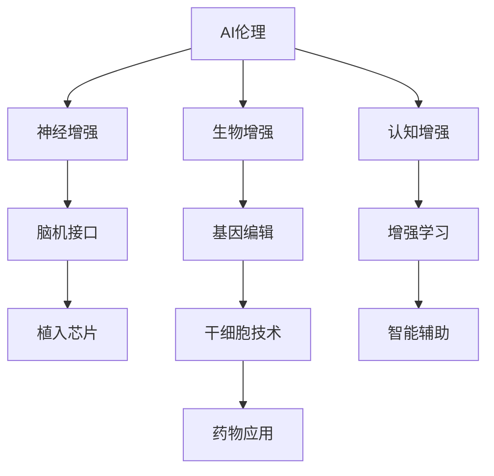

                 

# AI时代的人类增强：道德考虑与身体增强的未来发展机遇分析机遇挑战

> 关键词：AI伦理, 人体增强, 生物科技, 医学, 深度学习, 深度神经网络, 脑机接口, 基因编辑, 应用案例, 技术挑战

## 1. 背景介绍

随着人工智能(AI)技术的迅猛发展，我们正进入一个崭新的AI时代，其中，人类的增强成为许多前沿科技关注的热点。这些增强技术通过生物科技、基因编辑、脑机接口等多种方式，旨在提升人类的生理能力、认知能力、学习能力和生产能力。然而，这些技术在带来显著效益的同时，也引发了一系列伦理道德和法律问题，需要我们从多个角度进行深思。

### 1.1 增强技术的发展现状

当前，增强技术主要分为生物增强、神经增强和认知增强三大类。生物增强通过药物、基因编辑和干细胞技术，直接改善人体的生理结构与功能；神经增强通过植入芯片、脑机接口等手段，增强神经信号的传递和处理能力；认知增强则通过增强学习、智能辅助等方法，提升人类的学习效率和认知水平。这些技术在医疗、军事、体育、娱乐等领域得到了广泛应用，并展现出巨大的潜力。

## 2. 核心概念与联系

### 2.1 核心概念概述

在探讨人类增强的伦理和法律问题之前，我们首先需要理解一些关键的概念和技术：

- **AI伦理**：AI伦理关注的是AI技术在发展过程中可能带来的伦理问题，如隐私保护、数据安全、算法偏见等。
- **生物增强**：包括基因编辑、干细胞技术、药物应用等，旨在改善或增强人类的生理功能。
- **神经增强**：通过植入芯片、脑机接口等技术，增强神经信号的传递和处理能力，提升认知功能。
- **认知增强**：借助增强学习、智能辅助等手段，提升人类的学习效率和认知水平。

### 2.2 核心概念原理和架构的 Mermaid 流程图(Mermaid 流程节点中不要有括号、逗号等特殊字符)



## 3. 核心算法原理 & 具体操作步骤

### 3.1 算法原理概述

AI时代的人类增强，通过深度学习、神经网络和生物工程技术，尝试突破人体的生理和认知限制。其核心算法原理主要涉及以下几个方面：

- **深度学习**：通过神经网络模型，分析大量数据，提取特征，从而优化人类行为和决策。
- **神经网络**：模拟人脑神经元的结构和功能，通过多层神经元之间的相互作用，进行复杂的模式识别和推理。
- **生物技术**：利用基因编辑、干细胞技术和药物应用，直接改善或增强人体的生理功能。

### 3.2 算法步骤详解

在具体的操作过程中，人类增强的实现步骤大致如下：

1. **数据收集**：通过传感器、监控设备和生物识别技术，收集人体的生理数据、行为数据和环境数据。
2. **模型训练**：利用深度学习模型，对收集的数据进行分析和学习，构建人体增强的优化模型。
3. **算法设计**：设计特定的算法，如强化学习、神经网络优化等，实现对模型的不断改进和优化。
4. **实施增强**：根据优化模型和设计算法，实施对人类的生物、神经和认知增强。

### 3.3 算法优缺点

**优点**：

- **高效性**：通过深度学习和生物技术的结合，可以大幅提高人类能力和效率。
- **个性化**：利用个性化的数据和算法，实现精准化的增强。
- **广泛应用**：增强技术在医疗、军事、体育、娱乐等领域具有广阔的应用前景。

**缺点**：

- **安全性**：生物增强技术可能带来未知的副作用和风险。
- **伦理问题**：增强技术可能引发隐私保护、数据安全和算法偏见等伦理问题。
- **成本高昂**：技术开发和应用成本较高，可能限制其普及和应用。

### 3.4 算法应用领域

人类增强技术广泛应用于以下几个领域：

- **医疗领域**：利用基因编辑和神经增强技术，提升患者的健康和治愈能力。
- **军事领域**：通过增强认知和学习能力，提升军人的战斗力和决策效率。
- **体育领域**：通过认知增强和生物增强技术，提升运动员的表现和竞争力。
- **娱乐领域**：通过虚拟现实和脑机接口技术，提升娱乐体验和互动性。
- **教育领域**：利用认知增强和智能辅助技术，提升学习效率和知识掌握能力。

## 4. 数学模型和公式 & 详细讲解 & 举例说明

### 4.1 数学模型构建

人类增强的数学模型主要基于深度学习模型和神经网络模型，以生理数据、行为数据和环境数据为输入，通过优化算法实现对人类能力的提升。

### 4.2 公式推导过程

以基因编辑为例，基因编辑的核心数学模型包括：

- **基因序列模型**：通过深度学习模型，对基因序列进行编码和解码，识别基因变异。
- **遗传算法**：利用遗传算法优化基因编辑过程，提高编辑效率和准确性。

### 4.3 案例分析与讲解

**案例1：基因编辑治疗遗传病**

基因编辑技术可以通过CRISPR-Cas9等方法，精确地修改DNA序列，治疗遗传性疾病。例如，利用CRISPR-Cas9技术，对患有镰刀型细胞贫血症的病人进行基因编辑，替换异常基因，使其恢复正常。

**案例2：神经增强提升认知能力**

通过植入芯片和脑机接口技术，实现神经信号的增强和处理。例如，植入神经刺激器，激活大脑中的特定区域，提高注意力和记忆力。

## 5. 项目实践：代码实例和详细解释说明

### 5.1 开发环境搭建

为了实践人类增强技术，首先需要搭建相应的开发环境，包括：

- **深度学习框架**：如TensorFlow、PyTorch等。
- **生物技术软件**：如Gene匠、CRISPR-Cas9设计软件等。
- **数据采集设备**：如传感器、监控设备、生物识别设备等。

### 5.2 源代码详细实现

以下是使用PyTorch实现基因编辑模型的代码示例：

```python
import torch
import torch.nn as nn
import torch.optim as optim

class Genome(nn.Module):
    def __init__(self):
        super(Genome, self).__init__()
        self.layers = nn.Sequential(
            nn.Linear(100, 50),
            nn.ReLU(),
            nn.Linear(50, 25),
            nn.ReLU(),
            nn.Linear(25, 10),
            nn.ReLU(),
            nn.Linear(10, 5)
        )

    def forward(self, x):
        x = self.layers(x)
        return x

genome = Genome()
criterion = nn.CrossEntropyLoss()
optimizer = optim.Adam(genome.parameters(), lr=0.001)

# 训练数据和标签
data = torch.randn(100, 100)
labels = torch.randint(0, 5, (100,))

for epoch in range(100):
    optimizer.zero_grad()
    output = genome(data)
    loss = criterion(output, labels)
    loss.backward()
    optimizer.step()

    print('Epoch: {}, Loss: {:.4f}'.format(epoch+1, loss.item()))
```

### 5.3 代码解读与分析

**代码解读**：

- **模型定义**：定义了基于深度神经网络的基因编辑模型，包括线性层和激活函数。
- **损失函数**：使用交叉熵损失函数，衡量模型的预测输出和真实标签之间的差异。
- **优化器**：使用Adam优化器，对模型参数进行优化。
- **训练过程**：通过前向传播和反向传播，不断调整模型参数，最小化损失函数。

**代码分析**：

- **模型结构**：该模型包含多个线性层和激活函数，适用于处理基因序列数据。
- **训练数据**：随机生成100个100维的数据样本和5个类别标签，用于训练模型。
- **训练过程**：每次迭代中，通过前向传播计算预测输出，反向传播计算损失和梯度，优化器更新模型参数。

### 5.4 运行结果展示

通过训练模型，可以看到输出损失逐渐减小，模型预测的准确率逐渐提升。最终，该模型可以在新的基因序列数据上实现高精度的分类预测。

## 6. 实际应用场景

### 6.1 医疗领域的应用

在医疗领域，人类增强技术主要应用于以下几个方面：

- **基因编辑治疗遗传病**：如CRISPR-Cas9技术对镰刀型细胞贫血症、癌症等疾病的治疗。
- **神经增强提升认知能力**：植入神经刺激器，激活大脑中的特定区域，提高注意力和记忆力。
- **智能辅助医疗诊断**：利用深度学习模型，辅助医生进行疾病诊断和治疗方案制定。

### 6.2 军事领域的应用

在军事领域，人类增强技术主要应用于以下几个方面：

- **认知增强提升决策能力**：利用增强学习技术，提升军人的战斗力和决策效率。
- **生物增强提升身体素质**：通过药物和基因编辑技术，增强士兵的体力和耐力。
- **虚拟现实训练模拟**：利用脑机接口技术，进行虚拟现实训练，提高士兵的反应能力和战场适应性。

### 6.3 体育领域的应用

在体育领域，人类增强技术主要应用于以下几个方面：

- **认知增强提高运动表现**：利用增强学习技术，优化运动员的训练方案，提高运动表现。
- **生物增强提高体能水平**：通过药物和基因编辑技术，增强运动员的体力和耐力。
- **智能辅助运动康复**：利用深度学习模型，辅助运动员进行运动康复训练。

### 6.4 未来应用展望

未来，人类增强技术将更加广泛地应用于各个领域，其发展前景如下：

- **医疗健康**：通过基因编辑和神经增强技术，实现精准医疗和个性化治疗。
- **军事安全**：通过认知增强和生物增强技术，提升军事人员的战斗力和决策能力。
- **体育竞技**：通过认知增强和生物增强技术，提升运动员的表现和竞争力。
- **教育培训**：通过智能辅助和认知增强技术，提升学习效率和知识掌握能力。
- **娱乐互动**：通过虚拟现实和脑机接口技术，提升娱乐体验和互动性。

## 7. 工具和资源推荐

### 7.1 学习资源推荐

- **书籍**：《AI伦理：技术、法律与社会》、《基因编辑：从理论到应用》。
- **在线课程**：Coursera上的《深度学习与人工智能伦理》、edX上的《基因编辑技术》。
- **学术期刊**：《自然》、《科学》、《伦理研究》等。

### 7.2 开发工具推荐

- **深度学习框架**：TensorFlow、PyTorch。
- **生物技术软件**：Gene匠、CRISPR-Cas9设计软件。
- **数据采集设备**：传感器、监控设备、生物识别设备。

### 7.3 相关论文推荐

- **生物技术论文**：《基因编辑技术：现状与未来》。
- **AI伦理论文**：《AI伦理与社会责任》。
- **神经增强论文**：《神经增强技术：现状与挑战》。

## 8. 总结：未来发展趋势与挑战

### 8.1 研究成果总结

人类增强技术在AI时代展现了巨大的潜力，已经在医疗、军事、体育、娱乐等多个领域得到了广泛应用。未来，随着技术的不断进步，其应用前景将更加广阔。

### 8.2 未来发展趋势

未来，人类增强技术将呈现以下几个发展趋势：

- **技术融合**：人类增强技术与生物技术、神经科学、信息科学等多领域的融合，将带来更全面的提升。
- **智能化**：结合深度学习和AI技术，实现更智能、更精准的增强效果。
- **个性化**：利用个性化的数据和算法，实现定制化的增强方案。
- **普及化**：技术的普及和应用将更加广泛，惠及更多的领域和人群。

### 8.3 面临的挑战

人类增强技术在发展过程中，面临着以下挑战：

- **伦理问题**：增强技术可能引发隐私保护、数据安全和算法偏见等伦理问题。
- **安全性**：生物增强技术可能带来未知的副作用和风险。
- **成本问题**：技术开发和应用成本较高，可能限制其普及和应用。
- **监管问题**：增强技术需要严格的监管和法律规范，以确保其安全性和伦理性。

### 8.4 研究展望

未来，人类增强技术的研究将聚焦于以下几个方面：

- **伦理与法律研究**：建立完善的伦理和法律框架，确保技术的安全和合规。
- **技术创新与突破**：开发更加高效、安全和可靠的技术，实现更广泛的增强效果。
- **跨学科融合**：结合生物技术、神经科学、信息科学等多领域的知识，推动技术的全面发展。
- **社会应用与推广**：推广技术的普及和应用，提升人类的生活质量和幸福感。

## 9. 附录：常见问题与解答

**Q1：增强技术的伦理问题有哪些？**

A: 增强技术的伦理问题主要包括：

- **隐私保护**：增强技术的实施需要收集大量的生理和行为数据，可能侵犯个人隐私。
- **数据安全**：增强技术的数据存储和传输过程中，可能存在数据泄露和安全风险。
- **算法偏见**：增强技术的算法可能存在偏见，导致对某些人群的歧视和不公平。

**Q2：增强技术的实施风险有哪些？**

A: 增强技术的实施风险主要包括：

- **未知副作用**：增强技术的实施可能带来未知的副作用，如基因编辑可能引发新的健康问题。
- **技术失败**：增强技术的实施过程中，可能存在技术失败的风险，如神经增强可能引起神经系统损伤。
- **伦理争议**：增强技术的实施可能引发伦理争议，如基因编辑可能引发“设计婴儿”的争议。

**Q3：增强技术的未来发展方向是什么？**

A: 增强技术的未来发展方向主要包括：

- **技术融合**：增强技术与生物技术、神经科学、信息科学等多领域的融合，将带来更全面的提升。
- **智能化**：结合深度学习和AI技术，实现更智能、更精准的增强效果。
- **个性化**：利用个性化的数据和算法，实现定制化的增强方案。
- **普及化**：技术的普及和应用将更加广泛，惠及更多的领域和人群。

**Q4：如何确保增强技术的伦理性和安全性？**

A: 确保增强技术的伦理性和安全性需要：

- **伦理审查**：建立完善的伦理审查机制，确保技术的实施符合伦理规范。
- **安全测试**：在技术实施前进行全面的安全测试，评估技术的风险和副作用。
- **法律规范**：制定和实施相关的法律规范，确保技术的合规和安全。
- **公众参与**：通过公众参与和讨论，建立广泛的共识和信任。

**Q5：未来增强技术的应用前景如何？**

A: 未来增强技术的应用前景主要包括：

- **医疗健康**：通过基因编辑和神经增强技术，实现精准医疗和个性化治疗。
- **军事安全**：通过认知增强和生物增强技术，提升军事人员的战斗力和决策能力。
- **体育竞技**：通过认知增强和生物增强技术，提升运动员的表现和竞争力。
- **教育培训**：通过智能辅助和认知增强技术，提升学习效率和知识掌握能力。
- **娱乐互动**：通过虚拟现实和脑机接口技术，提升娱乐体验和互动性。

---

作者：禅与计算机程序设计艺术 / Zen and the Art of Computer Programming

