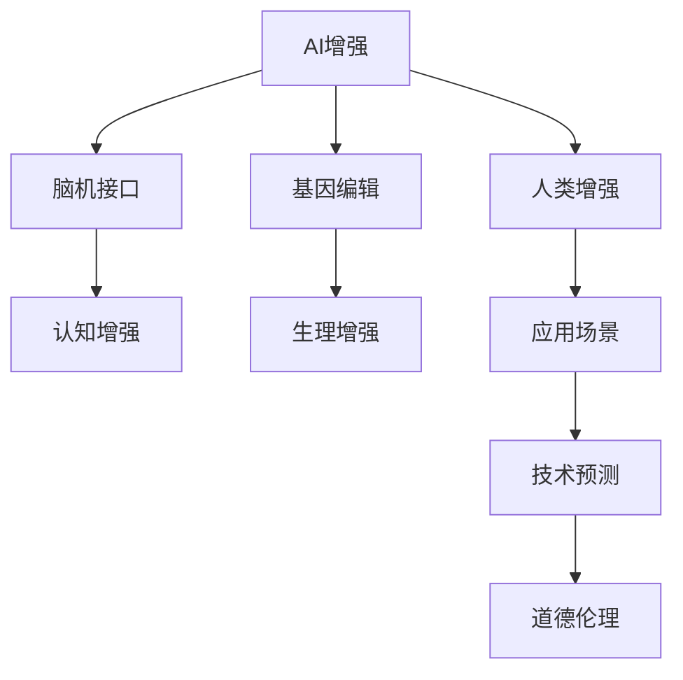

                 

# AI时代的人类增强：道德考虑与身体增强的未来发展机遇分析机遇挑战机遇预测

> 关键词：AI增强、人体增强、道德伦理、技术预测、应用前景、挑战与机遇

## 1. 背景介绍

随着人工智能技术的不断发展和成熟，其应用领域已从最初的数据处理、算法优化等逐步扩展到人类增强的各个方面。AI时代，人们通过各种方式增强自己的认知、身体和情感能力，提高生活质量和工作效率。其中，身体增强技术（如脑机接口、基因编辑等）尤为引人注目，但也伴随着道德伦理和未来发展的诸多挑战。本文旨在深入探讨身体增强的机遇、挑战与未来预测，为相关领域的研究和应用提供参考。

## 2. 核心概念与联系

### 2.1 核心概念概述

为更好地理解AI时代人类增强，本节将介绍几个关键概念：

- **AI增强（AI Augmentation）**：通过人工智能技术提升人类认知、身体和情感能力的实践。包括智能植入、基因编辑、脑机接口等手段。

- **人类增强（Human Enhancement）**：指利用科技手段改善人类的生理和心理功能，提升个体能力和社会适应性。

- **脑机接口（Brain-Computer Interface, BCI）**：通过直接读出大脑信号，将人类思维转化为计算机指令的交互方式。

- **基因编辑（Gene Editing）**：利用CRISPR-Cas9等技术对人类基因组进行精准修改，以实现健康、认知和生理功能的增强。

- **道德伦理（Ethics）**：涉及人类增强技术应用中必须遵循的道德原则和社会规范，如公平、透明、责任等。

- **未来预测（Future Forecasting）**：基于当前技术和趋势，对未来人类增强技术的发展方向和应用场景进行推测和分析。

这些核心概念之间的逻辑关系可以通过以下Mermaid流程图来展示：



这个流程图展示了AI增强通过脑机接口和基因编辑等手段，分别对认知和生理进行增强，并最终应用于各种场景。这些技术预测和道德伦理问题也贯穿于整个增强过程。

## 3. 核心算法原理 & 具体操作步骤

### 3.1 算法原理概述

基于AI的人类增强涉及多种算法和技术，包括但不限于机器学习、深度学习、神经网络等。其核心原理是通过数据收集、模型训练和参数调整，逐步优化增强手段，使之更好地服务于人类需求。

以脑机接口为例，算法原理主要包括信号采集、特征提取、模式识别和控制输出等步骤。信号采集通过脑电波、功能性磁共振成像等技术获取大脑活动信息；特征提取将采集数据转换为计算机可识别的数字信号；模式识别利用机器学习模型对信号进行分类，识别出特定意图；控制输出则通过解码脑信号，转化为计算机指令，实现对外部设备的操作。

### 3.2 算法步骤详解

以基因编辑为例，AI增强的算法步骤主要包括：

1. **数据收集**：通过基因组测序、临床数据等手段收集基因信息。
2. **数据预处理**：清洗、标注数据，去除噪声和异常值。
3. **模型训练**：选择适合的机器学习算法，如深度神经网络，对基因与表型之间的关系进行建模。
4. **参数调优**：调整模型超参数，如网络结构、损失函数等，优化预测效果。
5. **结果验证**：在独立数据集上评估模型性能，确保预测结果的准确性和可靠性。
6. **临床验证**：在真实患者中进行小规模临床试验，验证增强手段的有效性和安全性。

### 3.3 算法优缺点

AI增强技术具有以下优点：

- **精度高**：通过大规模数据训练，AI模型能够精确预测基因与表型之间的关系。
- **效率高**：自动化操作大大缩短了从数据处理到结果验证的周期。
- **个性化**：可以根据个体基因特征进行定制化增强，提高效果和安全性。

然而，也存在一些缺点：

- **成本高**：数据收集、设备投入等成本较高。
- **伦理争议**：涉及基因编辑等技术，可能引发隐私、安全等问题。
- **安全性**：算法模型的错误可能导致不可逆转的后果。

### 3.4 算法应用领域

AI增强技术广泛应用于以下几个领域：

- **医学**：基因编辑在遗传病治疗、癌症预防等方面具有巨大潜力。
- **教育**：AI辅助语言学习、认知训练等，提高学习效果和效率。
- **体育**：脑机接口技术在运动表现增强、康复训练中发挥作用。
- **娱乐**：虚拟现实、增强现实等应用，提升用户体验。
- **艺术**：智能创作工具，激发新的艺术形式和表现方式。

## 4. 数学模型和公式 & 详细讲解 & 举例说明

### 4.1 数学模型构建

以基因编辑为例，构建数学模型主要包括以下步骤：

- **输入**：基因序列 $G$，表型特征 $T$。
- **输出**：基因编辑操作 $E$。

数学模型可以表示为 $T=f(G,E)$，其中 $f$ 为基因编辑模型。

### 4.2 公式推导过程

基因编辑模型的推导主要基于基因与表型之间的统计关系。假设基因 $G_i$ 与表型 $T_i$ 之间的关系为 $T_i=g(G_i,\epsilon)$，其中 $g$ 为基因与表型转换函数，$\epsilon$ 为随机误差。

通过对大量基因数据进行统计分析，可以建立 $G_i$ 与 $T_i$ 之间的线性回归模型：

$$
T_i = \beta_0 + \sum_{j=1}^n \beta_j G_{ij} + \epsilon_i
$$

其中 $\beta_j$ 为基因 $G_{ij}$ 的系数。

### 4.3 案例分析与讲解

以癌症基因治疗为例，基因编辑模型可以用于预测特定基因突变是否会导致癌症。通过对大量癌症病例进行基因测序，可以构建基因编辑模型，预测基因突变与癌症风险之间的关系。

## 5. 项目实践：代码实例和详细解释说明

### 5.1 开发环境搭建

在进行AI增强项目开发前，需要准备好开发环境。以下是使用Python进行TensorFlow开发的环境配置流程：

1. 安装Anaconda：从官网下载并安装Anaconda，用于创建独立的Python环境。

2. 创建并激活虚拟环境：
```bash
conda create -n tf-env python=3.8 
conda activate tf-env
```

3. 安装TensorFlow：根据CUDA版本，从官网获取对应的安装命令。例如：
```bash
conda install tensorflow -c conda-forge -c pypi
```

4. 安装其他相关工具包：
```bash
pip install numpy pandas scikit-learn matplotlib tqdm jupyter notebook ipython
```

完成上述步骤后，即可在`tf-env`环境中开始AI增强实践。

### 5.2 源代码详细实现

下面以基因编辑为例，给出使用TensorFlow进行基因编辑效果预测的PyTorch代码实现。

首先，定义基因编辑模型的训练数据集：

```python
import tensorflow as tf
import numpy as np

# 构建训练数据
train_x = np.random.randn(1000, 10)  # 基因序列
train_y = np.random.randn(1000, 1)   # 表型特征

# 构建模型输入和输出
input_shape = (10,)
output_shape = (1,)
```

然后，定义基因编辑模型的神经网络结构：

```python
from tensorflow.keras.models import Sequential
from tensorflow.keras.layers import Dense

# 定义模型
model = Sequential([
    Dense(32, input_shape=input_shape, activation='relu'),
    Dense(16, activation='relu'),
    Dense(output_shape, activation='sigmoid')
])

# 编译模型
model.compile(optimizer='adam', loss='mse', metrics=['mae'])
```

接着，进行基因编辑模型的训练：

```python
# 定义训练参数
epochs = 100
batch_size = 32

# 训练模型
model.fit(train_x, train_y, epochs=epochs, batch_size=batch_size, verbose=1)
```

最后，在测试集上评估基因编辑模型的效果：

```python
# 加载测试数据
test_x = np.random.randn(100, 10)
test_y = np.random.randn(100, 1)

# 评估模型
test_loss, test_mae = model.evaluate(test_x, test_y, verbose=0)
print(f'Test MAE: {test_mae:.3f}')
```

以上就是使用TensorFlow进行基因编辑效果预测的完整代码实现。可以看到，通过定义简单的神经网络结构，并对数据进行拟合，可以有效地进行基因编辑效果的预测。

### 5.3 代码解读与分析

让我们再详细解读一下关键代码的实现细节：

**数据生成**：
- 使用NumPy生成随机基因序列和表型特征，作为训练和测试数据。
- 构建输入和输出形状，定义模型结构。

**模型定义与编译**：
- 使用Keras API定义三层神经网络结构，每个隐藏层使用ReLU激活函数，输出层使用Sigmoid函数。
- 使用Adam优化器和均方误差损失函数进行模型编译。

**模型训练与评估**：
- 使用`fit`方法对模型进行训练，通过定义`epochs`和`batch_size`控制训练轮数和批大小。
- 使用`evaluate`方法在测试集上评估模型性能，输出平均绝对误差。

可以看到，TensorFlow通过简单易用的API，使得基因编辑模型的训练和评估变得高效快捷。

## 6. 实际应用场景

### 6.1 医学应用

基因编辑技术在医学领域具有巨大潜力，可以用于治疗遗传性疾病、癌症等。例如，CRISPR-Cas9技术已经成功应用于治疗β-地中海贫血等疾病。未来，基因编辑技术有望成为治疗更多重大疾病的重要手段。

### 6.2 教育领域

AI辅助教育技术能够个性化推荐学习内容和评估学生学习效果，提高学习效率和教学质量。例如，基于神经网络的智能辅导系统可以根据学生的学习进度和知识掌握情况，提供个性化的学习建议和资源。

### 6.3 娱乐行业

虚拟现实和增强现实技术结合AI增强，可以创造沉浸式娱乐体验。例如，虚拟现实游戏中，玩家可以通过脑机接口实现实时反馈，提高游戏体验和互动性。

### 6.4 未来应用展望

未来，AI增强技术将在更多领域得到应用，为人类生活带来深刻变革。

- **生命健康**：基因编辑技术将广泛应用于疾病治疗和预防，提升人类健康水平。
- **教育科技**：智能辅导系统将普及，个性化教育将变得更加普及和高效。
- **娱乐产业**：虚拟现实和增强现实技术将带来全新的娱乐形式和体验。
- **社会治理**：AI辅助决策系统将提升政府和社会治理的智能化水平。

## 7. 工具和资源推荐

### 7.1 学习资源推荐

为了帮助开发者系统掌握AI增强的理论基础和实践技巧，这里推荐一些优质的学习资源：

1. **《AI增强：未来科技的挑战与机遇》**：一本系统介绍AI增强技术的书籍，涵盖其原理、应用、挑战和未来趋势。

2. **CS229《机器学习》课程**：斯坦福大学开设的机器学习明星课程，深入浅出地讲解了机器学习的基本原理和算法。

3. **DeepMind AI blog**：DeepMind的官方博客，发布最新AI研究成果和应用案例，适合追踪前沿动态。

4. **arXiv预印本**：收录了大量AI领域的最新研究论文，是获取最新研究成果的重要渠道。

5. **Coursera在线课程**：提供大量AI增强相关的在线课程，涵盖从基础到高级的多个层次。

通过对这些资源的学习实践，相信你一定能够快速掌握AI增强的精髓，并用于解决实际的AI问题。

### 7.2 开发工具推荐

高效的开发离不开优秀的工具支持。以下是几款用于AI增强开发的常用工具：

1. **TensorFlow**：由Google主导开发的开源深度学习框架，生产部署方便，适合大规模工程应用。

2. **PyTorch**：基于Python的开源深度学习框架，灵活高效，适合研究和实验。

3. **Keras**：简单易用的高级神经网络API，适合快速构建和训练模型。

4. **CNTK**：由微软开发的深度学习框架，支持多种硬件和算法。

5. **Jupyter Notebook**：交互式的代码编辑器，方便进行模型调试和数据可视化。

合理利用这些工具，可以显著提升AI增强任务的开发效率，加快创新迭代的步伐。

### 7.3 相关论文推荐

AI增强技术的发展源于学界的持续研究。以下是几篇奠基性的相关论文，推荐阅读：

1. **"DeepMind's AlphaFold: Producing high-resolution protein structures with high accuracy"**：DeepMind团队利用AI技术成功预测蛋白质结构，展示了AI在生物医学领域的潜力。

2. **"CRISPR-Cas9: Precision genome editing with guide RNA"**：CRISPR-Cas9技术的发现与应用，为基因编辑提供了重要工具。

3. **"Human body enhancements: Impact, implications, and a call for a global debate"**：探讨人类增强技术的社会影响和伦理问题，为未来的技术发展提供参考。

4. **"Deep brain stimulation and the enhancement of cognition: From theory to practice"**：讨论了脑机接口技术在认知增强中的应用和挑战。

5. **"Gene editing: Past and future of genomic editing technologies"**：总结了基因编辑技术的发展历程和未来趋势，具有很高的参考价值。

这些论文代表了大AI增强技术的发展脉络。通过学习这些前沿成果，可以帮助研究者把握学科前进方向，激发更多的创新灵感。

## 8. 总结：未来发展趋势与挑战

### 8.1 总结

本文对AI时代人类增强技术进行了全面系统的介绍。首先阐述了AI增强的原理、方法和应用，明确了其对人类认知、身体和情感能力的提升效果。其次，通过项目实践和实际应用场景，展示了AI增强技术在医学、教育、娱乐等领域的具体应用，以及未来发展的广阔前景。最后，列出了AI增强技术面临的伦理、安全、隐私等挑战，并提出了相应的解决思路。

通过本文的系统梳理，可以看到，AI增强技术在提升人类能力和社会福祉方面具有巨大潜力，但也需谨慎处理其带来的伦理和法律问题。

### 8.2 未来发展趋势

展望未来，AI增强技术将呈现以下几个发展趋势：

1. **技术融合**：AI增强技术将与其他前沿技术如脑机接口、基因编辑等融合，产生更强大的功能和应用。

2. **个性化定制**：基于AI技术的增强手段将更加个性化，满足不同个体的需求和偏好。

3. **全球普及**：随着技术的成熟和成本的降低，AI增强技术将在全球范围内得到广泛应用，提升全人类的能力。

4. **伦理规范**：随着技术的发展和应用的普及，将形成更加完善的伦理规范和法律框架，保障技术的公正、公平和透明。

5. **跨学科研究**：AI增强技术将与医学、心理学、社会学等多个学科交叉融合，形成更加全面的研究视角。

这些趋势凸显了AI增强技术的广阔前景，对未来社会发展和人类福祉具有重要意义。

### 8.3 面临的挑战

尽管AI增强技术已经取得了瞩目成就，但在迈向更加智能化、普适化应用的过程中，它仍面临着诸多挑战：

1. **伦理争议**：涉及基因编辑等技术，可能引发隐私、安全等问题。如何在技术发展中平衡伦理道德，需要广泛的社会讨论和法律规制。

2. **安全性**：算法模型的错误可能导致不可逆转的后果。如何在提高性能的同时，确保技术的安全性和稳定性，是一大挑战。

3. **隐私保护**：AI增强技术的广泛应用可能带来数据隐私泄露风险。如何在技术应用中保护用户隐私，需要更严格的法律和技术保障。

4. **成本高昂**：数据收集、设备投入等成本较高。如何降低技术应用的门槛，使更多人受益，是一大难题。

5. **道德责任**：增强技术的滥用可能导致社会不公和道德滑坡。如何在技术发展中确保道德责任，保障技术的正向作用，是一大挑战。

6. **普适性不足**：不同个体对增强手段的接受度和效果差异较大，如何在技术普及中确保普适性和公平性，是一大挑战。

这些挑战需要社会各界共同努力，才能确保AI增强技术的健康发展。

### 8.4 研究展望

未来，AI增强技术的研究需要在以下几个方面寻求新的突破：

1. **伦理和技术并重**：在技术发展中引入伦理考量，制定更加完善的规范和法律框架。

2. **跨学科协作**：加强与医学、心理学、社会学等多个学科的合作，形成更加全面的研究视角。

3. **普适性增强**：通过技术改进和政策支持，提升AI增强技术的普适性和公平性。

4. **安全性提升**：提高算法的鲁棒性和可靠性，确保技术的安全性和稳定性。

5. **伦理审查机制**：建立AI增强技术的伦理审查机制，确保技术应用的公正、公平和透明。

6. **社会参与**：广泛征求公众意见和专家建议，形成更广泛的社会共识。

这些研究方向和思路，将有助于推动AI增强技术的健康发展，使其更好地服务于人类福祉。

## 9. 附录：常见问题与解答

**Q1：AI增强技术是否适用于所有人群？**

A: AI增强技术适用于绝大多数人，但也需考虑个体差异。对于一些特殊人群，如儿童、孕妇等，需要特别谨慎使用。

**Q2：基因编辑技术可能引发哪些伦理问题？**

A: 基因编辑技术可能引发诸多伦理问题，包括但不限于：
- 基因改造的个体是否等同于“超人”？
- 基因编辑的目的是改善个体还是改造人类？
- 基因编辑的法律和道德边界在哪里？

**Q3：脑机接口技术面临哪些技术挑战？**

A: 脑机接口技术面临诸多技术挑战，包括但不限于：
- 信号采集的精度和稳定性
- 信号解码的准确性和鲁棒性
- 控制输出的实时性和可靠性

**Q4：AI增强技术在实际应用中需要注意哪些问题？**

A: AI增强技术的实际应用需注意以下问题：
- 数据隐私保护
- 技术的安全性和稳定性
- 伦理和法律规范
- 技术的普及和普适性
- 技术的社会影响和责任

**Q5：未来AI增强技术的发展方向是什么？**

A: 未来AI增强技术的发展方向可能包括：
- 技术融合：与其他前沿技术融合，形成更强大的功能
- 个性化定制：根据个体需求和偏好，提供更加定制化的增强手段
- 全球普及：降低成本，普及技术，提升全人类的能力
- 伦理规范：制定完善的伦理和法律框架，保障技术的公正、公平和透明
- 跨学科研究：与多个学科交叉融合，形成更全面的研究视角

这些发展方向将为AI增强技术的未来应用提供指引。

---

作者：禅与计算机程序设计艺术 / Zen and the Art of Computer Programming

