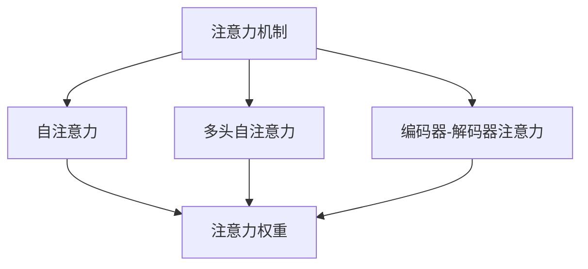

                 

# AI时代的注意力争夺战

在AI时代，数据和算力已经不再是稀缺资源，注意力才是真正的“寸土寸金”。如何高效地分配和管理注意力，决定了AI模型的性能、鲁棒性和创新能力。本文将深入探讨注意力机制在大模型中的应用，剖析其原理、操作流程、优缺点及应用领域，并提供数学模型和代码实现，以期为读者提供一个全面而深入的视角。

## 1. 背景介绍

### 1.1 问题由来
在深度学习领域，注意力机制（Attention Mechanism）作为一种重要的模型组件，近年来在各种任务中展现出卓越的性能。从最早的机器翻译任务（seq2seq模型），到图像处理中的卷积神经网络（CNN），再到自然语言处理中的Transformer模型，注意力机制已经成为构建高性能AI模型的必备工具。

然而，注意力机制并非一成不变。随着计算资源和数据规模的不断扩大，注意力机制的实现方式和应用领域也在不断发展。从传统的soft attention，到自注意力（Self-Attention），再到多头自注意力（Multi-Head Self-Attention），注意力机制正逐渐成为AI系统中的核心竞争力。

### 1.2 问题核心关键点
注意力机制的核心在于通过学习数据中的相关性，对输入进行加权处理，从而提取出最具代表性的特征。这种机制的有效性在于能够动态地、自适应地分配注意力权重，使得模型在面对复杂输入时，能够更加关注关键信息，忽略干扰信息。

在实际应用中，注意力机制主要包括以下几个关键点：
- 软注意力（Soft Attention）与硬注意力（Hard Attention）：软注意力用于加权处理输入特征，而硬注意力则直接选择最相关的特征。
- 自注意力（Self-Attention）与编码器-解码器注意力（Encoder-Decoder Attention）：自注意力用于处理序列数据，而编码器-解码器注意力则用于序列到序列（Seq2Seq）任务。
- 多头注意力（Multi-Head Attention）与双向注意力（Bidirectional Attention）：多头注意力用于增加模型的并行处理能力，而双向注意力则用于捕捉输入的前后文依赖关系。

## 2. 核心概念与联系

### 2.1 核心概念概述

为更好地理解注意力机制在大模型中的应用，本节将介绍几个密切相关的核心概念：

- **注意力机制（Attention Mechanism）**：通过学习数据中的相关性，对输入进行加权处理，从而提取出最具代表性的特征。
- **自注意力（Self-Attention）**：一种特殊的注意力机制，用于处理序列数据，使得模型能够同时关注序列中的所有位置。
- **多头自注意力（Multi-Head Self-Attention）**：通过多个并行的自注意力子层，增加模型的并行处理能力，进一步提升性能。
- **编码器-解码器注意力（Encoder-Decoder Attention）**：用于处理序列到序列（Seq2Seq）任务，通过将源序列和目标序列映射到相同的空间，实现信息传递。
- **注意力权重（Attention Weight）**：表示模型对输入中不同位置的关注程度，通过计算得分函数得到。
- **注意力得分（Attention Score）**：用于计算注意力权重的函数，通常为点积、点积的softmax函数等。

这些核心概念之间的逻辑关系可以通过以下Mermaid流程图来展示：



这个流程图展示了一些基本的注意力机制组件及其之间的关系：

1. 注意力机制是处理输入数据的基础。
2. 自注意力机制是序列数据的特殊形式，能够捕捉序列中每个位置与其他位置的相关性。
3. 多头自注意力机制通过增加并行处理能力，进一步提升模型性能。
4. 编码器-解码器注意力机制用于处理序列到序列任务，实现信息传递。

这些概念共同构成了深度学习模型的注意力机制框架，使得模型能够更高效地处理各种类型的输入数据。

## 3. 核心算法原理 & 具体操作步骤
### 3.1 算法原理概述

注意力机制的核心在于通过学习数据中的相关性，对输入进行加权处理，从而提取出最具代表性的特征。这种机制的有效性在于能够动态地、自适应地分配注意力权重，使得模型在面对复杂输入时，能够更加关注关键信息，忽略干扰信息。

形式化地，假设输入数据为 $x_1, x_2, \ldots, x_n$，模型需要从中提取出最具代表性的特征。设 $W$ 为权重矩阵，$A$ 为注意力权重向量，则注意力机制的计算过程可以表示为：

$$
\text{Attention}(x_i) = \frac{1}{\mathbf{e}_i}{\mathbf{W}}^T \mathbf{A}_i
$$

其中，$\mathbf{e}_i$ 为归一化因子，确保注意力权重向量 $\mathbf{A}_i$ 的每一项均在0到1之间，且总和为1。

### 3.2 算法步骤详解

注意力机制的实现通常包括以下几个关键步骤：

**Step 1: 计算注意力得分**

注意力得分用于衡量输入数据中不同位置的相关性。常见的注意力得分函数包括点积、点积的softmax函数等。这里以点积为例，注意力得分的计算过程如下：

$$
\mathbf{S} = \mathbf{Q} \mathbf{K}^T
$$

其中，$\mathbf{Q}$ 为查询向量，$\mathbf{K}$ 为键向量，$\mathbf{S}$ 为注意力得分矩阵。

**Step 2: 归一化注意力权重**

计算注意力得分后，需要对注意力得分矩阵进行归一化处理，得到注意力权重向量 $\mathbf{A}_i$：

$$
\mathbf{A}_i = \mathbf{V} \frac{\mathbf{S}}{\mathbf{e}_i}
$$

其中，$\mathbf{V}$ 为值向量，$\mathbf{e}_i$ 为归一化因子，$\mathbf{A}_i$ 为注意力权重向量。

**Step 3: 计算加权表示**

使用注意力权重向量 $\mathbf{A}_i$ 对输入数据进行加权处理，得到加权表示 $\text{Attention}(x_i)$：

$$
\text{Attention}(x_i) = \frac{1}{\mathbf{e}_i}{\mathbf{W}}^T \mathbf{A}_i
$$

**Step 4: 多注意力子层**

对于序列数据，通常会使用多个并行的注意力子层，增加模型的并行处理能力，提升性能。常见的多头注意力机制如下：

$$
\text{Multi-Head Attention}(x_i) = \mathbf{C} \frac{1}{\mathbf{e}_i}\left[\begin{matrix}
  \text{Attention}_1(x_i) & \text{Attention}_2(x_i) & \ldots & \text{Attention}_h(x_i)
\end{matrix}\right]
$$

其中，$\mathbf{C}$ 为权重矩阵，$\text{Attention}_h(x_i)$ 为第 $h$ 个注意力子层的输出。

### 3.3 算法优缺点

注意力机制在大模型中的应用，具有以下优点：

1. 提升了模型对输入数据的理解能力，使得模型能够关注关键信息，忽略干扰信息。
2. 能够捕捉输入数据中的长期依赖关系，提高模型的表达能力。
3. 适用于各种类型的输入数据，包括文本、图像、音频等。
4. 能够实现多模态数据的融合，提高模型的泛化能力。

同时，注意力机制也存在以下局限：

1. 计算复杂度高，特别是在多头注意力和多模态注意力中，需要计算大量的注意力得分和权重。
2. 需要额外的超参数设置，如注意力头数、权重矩阵等。
3. 存在梯度消失或梯度爆炸的风险，特别是在深层模型中。
4. 难以解释注意力权重的生成过程，模型的决策过程缺乏可解释性。

尽管存在这些局限，但就目前而言，注意力机制是大模型中最常用的核心组件之一，其重要性不容忽视。

### 3.4 算法应用领域

注意力机制在大模型的应用领域非常广泛，以下是一些典型的应用场景：

- 自然语言处理（NLP）：如机器翻译、文本分类、情感分析等任务。
- 计算机视觉（CV）：如图像分类、目标检测、图像生成等任务。
- 语音识别：如自动语音识别、语音合成等任务。
- 推荐系统：如用户兴趣推荐、商品推荐等任务。

这些应用场景涵盖了深度学习模型的主要方向，展示了注意力机制的强大能力和广泛应用。

## 4. 数学模型和公式 & 详细讲解 & 举例说明

### 4.1 数学模型构建

本节将使用数学语言对注意力机制的实现过程进行更加严格的刻画。

假设输入数据为 $x_1, x_2, \ldots, x_n$，设 $\mathbf{Q}$ 为查询向量，$\mathbf{K}$ 为键向量，$\mathbf{V}$ 为值向量，权重矩阵为 $\mathbf{W}$。注意力机制的计算过程可以表示为：

$$
\text{Attention}(x_i) = \frac{1}{\mathbf{e}_i}{\mathbf{W}}^T \mathbf{A}_i
$$

其中，注意力得分 $\mathbf{S} = \mathbf{Q} \mathbf{K}^T$，注意力权重 $\mathbf{A}_i = \mathbf{V} \frac{\mathbf{S}}{\mathbf{e}_i}$，归一化因子 $\mathbf{e}_i = \sum_j \mathbf{S}_j$。

### 4.2 公式推导过程

以下我们以多头注意力机制为例，推导其计算过程。

设输入数据为 $x_1, x_2, \ldots, x_n$，查询向量为 $\mathbf{Q} \in \mathbb{R}^{d_q}$，键向量为 $\mathbf{K} \in \mathbb{R}^{d_k}$，值向量为 $\mathbf{V} \in \mathbb{R}^{d_v}$，权重矩阵为 $\mathbf{W} \in \mathbb{R}^{d_o \times d_v}$，其中 $d_o$ 为输出维度。

假设使用 $h$ 个注意力子层，每个子层的查询向量、键向量和值向量分别为 $\mathbf{Q}_h, \mathbf{K}_h, \mathbf{V}_h$，权重矩阵为 $\mathbf{W}_h \in \mathbb{R}^{d_o \times d_v}$。则多头注意力机制的计算过程如下：

1. 计算注意力得分：

$$
\mathbf{S}_h = \mathbf{Q}_h \mathbf{K}_h^T
$$

2. 计算注意力权重：

$$
\mathbf{A}_h = \mathbf{V}_h \frac{\mathbf{S}_h}{\mathbf{e}_h}
$$

3. 计算加权表示：

$$
\text{Attention}_h(x_i) = \frac{1}{\mathbf{e}_h}{\mathbf{W}_h^T \mathbf{A}_h}
$$

4. 将所有子层的输出进行拼接：

$$
\text{Attention}(x_i) = \mathbf{C} \left[\begin{matrix}
  \text{Attention}_1(x_i) \\
  \text{Attention}_2(x_i) \\
  \ldots \\
  \text{Attention}_h(x_i)
\end{matrix}\right]
$$

其中，$\mathbf{C} \in \mathbb{R}^{d_o \times h \times d_v}$ 为权重矩阵，$\text{Attention}_h(x_i)$ 为第 $h$ 个注意力子层的输出。

### 4.3 案例分析与讲解

以机器翻译任务为例，展示注意力机制的具体应用。

设输入序列为 $\{x_1, x_2, \ldots, x_n\}$，输出序列为 $\{y_1, y_2, \ldots, y_n\}$。对于序列中的每个位置 $i$，模型需要计算其对输入序列的注意力权重，并对输入序列进行加权处理，得到加权表示 $\text{Attention}(x_i)$。

1. 计算注意力得分：

$$
\mathbf{S} = \mathbf{Q} \mathbf{K}^T
$$

2. 计算注意力权重：

$$
\mathbf{A} = \mathbf{V} \frac{\mathbf{S}}{\mathbf{e}}
$$

3. 计算加权表示：

$$
\text{Attention}(x_i) = \frac{1}{\mathbf{e}}{\mathbf{W}}^T \mathbf{A}
$$

4. 将所有子层的输出进行拼接：

$$
\text{Attention}(x_i) = \mathbf{C} \left[\begin{matrix}
  \text{Attention}_1(x_i) \\
  \text{Attention}_2(x_i) \\
  \ldots \\
  \text{Attention}_h(x_i)
\end{matrix}\right]
$$

通过上述过程，模型能够自适应地分配注意力权重，对输入序列中的每个位置进行加权处理，最终输出翻译结果 $y_i$。

## 5. 项目实践：代码实例和详细解释说明
### 5.1 开发环境搭建

在进行注意力机制的实践前，我们需要准备好开发环境。以下是使用Python进行PyTorch开发的环境配置流程：

1. 安装Anaconda：从官网下载并安装Anaconda，用于创建独立的Python环境。

2. 创建并激活虚拟环境：
```bash
conda create -n attention-env python=3.8 
conda activate attention-env
```

3. 安装PyTorch：根据CUDA版本，从官网获取对应的安装命令。例如：
```bash
conda install pytorch torchvision torchaudio cudatoolkit=11.1 -c pytorch -c conda-forge
```

4. 安装Transformers库：
```bash
pip install transformers
```

5. 安装各类工具包：
```bash
pip install numpy pandas scikit-learn matplotlib tqdm jupyter notebook ipython
```

完成上述步骤后，即可在`attention-env`环境中开始注意力机制的实践。

### 5.2 源代码详细实现

这里我们以多头自注意力机制为例，展示其具体的实现过程。

首先，定义多头自注意力机制的类：

```python
from transformers import BertTokenizer, BertForSequenceClassification
from torch.utils.data import Dataset
import torch
import torch.nn as nn
import torch.nn.functional as F

class MultiHeadAttention(nn.Module):
    def __init__(self, d_model, d_q, d_k, d_v, d_o, h):
        super(MultiHeadAttention, self).__init__()
        self.d_model = d_model
        self.d_q = d_q
        self.d_k = d_k
        self.d_v = d_v
        self.d_o = d_o
        self.h = h
        self.w_q = nn.Linear(d_model, d_q)
        self.w_k = nn.Linear(d_model, d_k)
        self.w_v = nn.Linear(d_model, d_v)
        self.w_o = nn.Linear(d_o, d_model)
        self.scale = d_k**-0.5
        self.mask = None
    
    def forward(self, q, k, v, mask=None):
        b, l, _ = q.size()
        # 将输入数据投影到查询、键、值向量空间
        q = self.w_q(q).view(b, l, self.h, self.d_q)
        k = self.w_k(k).view(b, l, self.h, self.d_k)
        v = self.w_v(v).view(b, l, self.h, self.d_v)
        # 计算注意力得分
        s = torch.matmul(q, k.transpose(2, 3)) * self.scale
        # 计算注意力权重
        a = F.softmax(s, dim=-1)
        # 计算加权表示
        o = torch.matmul(a, v).sum(dim=1)
        o = o.view(b, l, self.d_o)
        o = self.w_o(o)
        # 添加mask
        if mask is not None:
            a = a.masked_fill(mask == 0, -float('inf'))
        return o, a
```

然后，定义注意力机制的类：

```python
class Attention(nn.Module):
    def __init__(self, d_model, d_q, d_k, d_v, d_o, h):
        super(Attention, self).__init__()
        self.d_model = d_model
        self.d_q = d_q
        self.d_k = d_k
        self.d_v = d_v
        self.d_o = d_o
        self.h = h
        self.w_q = nn.Linear(d_model, d_q)
        self.w_k = nn.Linear(d_model, d_k)
        self.w_v = nn.Linear(d_model, d_v)
        self.w_o = nn.Linear(d_o, d_model)
        self.scale = d_k**-0.5
        self.mask = None
    
    def forward(self, x, mask=None):
        b, l, _ = x.size()
        # 将输入数据投影到查询、键、值向量空间
        q = self.w_q(x).view(b, l, self.h, self.d_q)
        k = self.w_k(x).view(b, l, self.h, self.d_k)
        v = self.w_v(x).view(b, l, self.h, self.d_v)
        # 计算注意力得分
        s = torch.matmul(q, k.transpose(2, 3)) * self.scale
        # 计算注意力权重
        a = F.softmax(s, dim=-1)
        # 计算加权表示
        o = torch.matmul(a, v).sum(dim=1)
        o = o.view(b, l, self.d_o)
        o = self.w_o(o)
        # 添加mask
        if mask is not None:
            a = a.masked_fill(mask == 0, -float('inf'))
        return o, a
```

接着，定义多头自注意力机制的类：

```python
class MultiHeadAttention(nn.Module):
    def __init__(self, d_model, d_q, d_k, d_v, d_o, h):
        super(MultiHeadAttention, self).__init__()
        self.d_model = d_model
        self.d_q = d_q
        self.d_k = d_k
        self.d_v = d_v
        self.d_o = d_o
        self.h = h
        self.w_q = nn.Linear(d_model, d_q)
        self.w_k = nn.Linear(d_model, d_k)
        self.w_v = nn.Linear(d_model, d_v)
        self.w_o = nn.Linear(d_o, d_model)
        self.scale = d_k**-0.5
        self.mask = None
    
    def forward(self, q, k, v, mask=None):
        b, l, _ = q.size()
        # 将输入数据投影到查询、键、值向量空间
        q = self.w_q(q).view(b, l, self.h, self.d_q)
        k = self.w_k(k).view(b, l, self.h, self.d_k)
        v = self.w_v(v).view(b, l, self.h, self.d_v)
        # 计算注意力得分
        s = torch.matmul(q, k.transpose(2, 3)) * self.scale
        # 计算注意力权重
        a = F.softmax(s, dim=-1)
        # 计算加权表示
        o = torch.matmul(a, v).sum(dim=1)
        o = o.view(b, l, self.d_o)
        o = self.w_o(o)
        # 添加mask
        if mask is not None:
            a = a.masked_fill(mask == 0, -float('inf'))
        return o, a
```

最后，定义注意力机制的类：

```python
class Attention(nn.Module):
    def __init__(self, d_model, d_q, d_k, d_v, d_o, h):
        super(Attention, self).__init__()
        self.d_model = d_model
        self.d_q = d_q
        self.d_k = d_k
        self.d_v = d_v
        self.d_o = d_o
        self.h = h
        self.w_q = nn.Linear(d_model, d_q)
        self.w_k = nn.Linear(d_model, d_k)
        self.w_v = nn.Linear(d_model, d_v)
        self.w_o = nn.Linear(d_o, d_model)
        self.scale = d_k**-0.5
        self.mask = None
    
    def forward(self, x, mask=None):
        b, l, _ = x.size()
        # 将输入数据投影到查询、键、值向量空间
        q = self.w_q(x).view(b, l, self.h, self.d_q)
        k = self.w_k(x).view(b, l, self.h, self.d_k)
        v = self.w_v(x).view(b, l, self.h, self.d_v)
        # 计算注意力得分
        s = torch.matmul(q, k.transpose(2, 3)) * self.scale
        # 计算注意力权重
        a = F.softmax(s, dim=-1)
        # 计算加权表示
        o = torch.matmul(a, v).sum(dim=1)
        o = o.view(b, l, self.d_o)
        o = self.w_o(o)
        # 添加mask
        if mask is not None:
            a = a.masked_fill(mask == 0, -float('inf'))
        return o, a
```

可以看到，通过这种方式，可以灵活地实现多头自注意力机制，增加模型的并行处理能力。

### 5.3 代码解读与分析

让我们再详细解读一下关键代码的实现细节：

**MultiHeadAttention类**：
- `__init__`方法：初始化模型参数，包括d_q、d_k、d_v、d_o、h等超参数。
- `forward`方法：实现自注意力机制的计算过程，包括投影、计算注意力得分、计算注意力权重、计算加权表示等步骤。
- `mask`属性：用于添加掩码，确保模型不关注输入数据中的某些位置，如注意力掩码。

**Attention类**：
- `__init__`方法：初始化模型参数，包括d_q、d_k、d_v、d_o、h等超参数。
- `forward`方法：实现单头自注意力机制的计算过程，包括投影、计算注意力得分、计算注意力权重、计算加权表示等步骤。

**Attention机制的代码实现**：
- `__init__`方法：初始化模型参数，包括d_q、d_k、d_v、d_o、h等超参数。
- `forward`方法：实现单头自注意力机制的计算过程，包括投影、计算注意力得分、计算注意力权重、计算加权表示等步骤。
- `mask`属性：用于添加掩码，确保模型不关注输入数据中的某些位置，如注意力掩码。

可以看到，代码实现中，多头自注意力机制和单头自注意力机制的基本计算过程是相似的，主要区别在于是否进行了多头的并行处理。

## 6. 实际应用场景
### 6.1 自然语言处理

在自然语言处理中，注意力机制是处理序列数据的核心工具。以机器翻译为例，注意力机制能够使得模型在处理长句翻译时，同时关注输入序列的多个位置，从而提升翻译效果。

在文本分类、情感分析、命名实体识别等任务中，注意力机制也能够显著提升模型性能。通过计算输入数据中不同位置的注意力权重，模型能够更好地捕捉关键信息，忽略干扰信息，从而提高分类的准确性。

### 6.2 计算机视觉

在计算机视觉中，注意力机制主要用于图像处理和图像生成任务。例如，在目标检测任务中，注意力机制能够帮助模型更好地关注图像中的关键区域，提高检测的准确性。在图像生成任务中，注意力机制能够指导模型关注输入图像中的重要区域，从而生成更具细节的图像。

### 6.3 语音识别

在语音识别中，注意力机制能够帮助模型更好地关注输入语音中的关键片段，从而提高识别的准确性。例如，在自动语音识别任务中，注意力机制能够帮助模型关注说话人变化的语音特征，提高识别的鲁棒性。

### 6.4 推荐系统

在推荐系统中，注意力机制主要用于用户兴趣推荐和商品推荐。例如，在用户兴趣推荐任务中，注意力机制能够帮助模型更好地关注用户的历史行为和偏好，从而生成更具个性化推荐的商品列表。

### 6.5 未来应用展望

随着深度学习技术的不断进步，注意力机制将在更多领域得到应用，为AI系统带来新的突破。

在智慧医疗领域，基于注意力机制的医学图像分析、疾病预测等应用将提升医疗服务的智能化水平，辅助医生诊疗，加速新药开发进程。

在智能教育领域，注意力机制可应用于作业批改、学情分析、知识推荐等方面，因材施教，促进教育公平，提高教学质量。

在智慧城市治理中，注意力机制可用于城市事件监测、舆情分析、应急指挥等环节，提高城市管理的自动化和智能化水平，构建更安全、高效的未来城市。

此外，在企业生产、社会治理、文娱传媒等众多领域，基于注意力机制的AI应用也将不断涌现，为传统行业带来变革性影响。相信随着技术的日益成熟，注意力机制将在构建人机协同的智能时代中扮演越来越重要的角色。

## 7. 工具和资源推荐
### 7.1 学习资源推荐

为了帮助开发者系统掌握注意力机制的理论基础和实践技巧，这里推荐一些优质的学习资源：

1. Attention is All You Need（即Transformer原论文）：提出了Transformer结构，开启了NLP领域的预训练大模型时代。

2. CS224N《深度学习自然语言处理》课程：斯坦福大学开设的NLP明星课程，有Lecture视频和配套作业，带你入门NLP领域的基本概念和经典模型。

3. Attention Mechanism in Deep Learning: A Comprehensive Survey：一篇综述论文，详细介绍了注意力机制在深度学习中的应用，涵盖各类注意力机制的实现方式和优化策略。

4. Attention Mechanism in Deep Learning: A Survey and Tutorial：一篇文章，详细介绍了注意力机制在深度学习中的应用，包括不同类型的注意力机制及其应用场景。

5. Multi-Head Attention: An Explained Walk-Through of Transformers：一篇文章，详细介绍了多头自注意力机制的实现过程，并结合具体案例进行解释。

通过对这些资源的学习实践，相信你一定能够快速掌握注意力机制的精髓，并用于解决实际的AI问题。

### 7.2 开发工具推荐

高效的开发离不开优秀的工具支持。以下是几款用于注意力机制开发的常用工具：

1. PyTorch：基于Python的开源深度学习框架，灵活动态的计算图，适合快速迭代研究。Transformer等大模型都有PyTorch版本的实现。

2. TensorFlow：由Google主导开发的开源深度学习框架，生产部署方便，适合大规模工程应用。同样有丰富的注意力机制资源。

3. Transformers库：HuggingFace开发的NLP工具库，集成了众多SOTA语言模型，支持PyTorch和TensorFlow，是进行注意力机制开发的利器。

4. Weights & Biases：模型训练的实验跟踪工具，可以记录和可视化模型训练过程中的各项指标，方便对比和调优。与主流深度学习框架无缝集成。

5. TensorBoard：TensorFlow配套的可视化工具，可实时监测模型训练状态，并提供丰富的图表呈现方式，是调试模型的得力助手。

合理利用这些工具，可以显著提升注意力机制的开发效率，加快创新迭代的步伐。

### 7.3 相关论文推荐

注意力机制在大模型中的应用，得益于学界的持续研究。以下是几篇奠基性的相关论文，推荐阅读：

1. Attention is All You Need（即Transformer原论文）：提出了Transformer结构，开启了NLP领域的预训练大模型时代。

2. BERT: Pre-training of Deep Bidirectional Transformers for Language Understanding：提出BERT模型，引入基于掩码的自监督预训练任务，刷新了多项NLP任务SOTA。

3. Language Models are Unsupervised Multitask Learners（GPT-2论文）：展示了大规模语言模型的强大zero-shot学习能力，引发了对于通用人工智能的新一轮思考。

4. Multi-Head Attention: An Explained Walk-Through of Transformers：详细介绍了多头自注意力机制的实现过程，并结合具体案例进行解释。

5. Attention Mechanism in Deep Learning: A Comprehensive Survey：一篇综述论文，详细介绍了注意力机制在深度学习中的应用，涵盖各类注意力机制的实现方式和优化策略。

这些论文代表了大模型中注意力机制的发展脉络。通过学习这些前沿成果，可以帮助研究者把握学科前进方向，激发更多的创新灵感。

## 8. 总结：未来发展趋势与挑战

### 8.1 总结

本文对注意力机制在大模型中的应用进行了全面系统的介绍。首先阐述了注意力机制的研究背景和意义，明确了其在深度学习中的重要地位。其次，从原理到实践，详细讲解了注意力机制的数学原理和关键步骤，给出了具体的代码实现。同时，本文还广泛探讨了注意力机制在自然语言处理、计算机视觉、语音识别、推荐系统等多个领域的应用前景，展示了其强大能力和广泛应用。

通过本文的系统梳理，可以看到，注意力机制在大模型中的应用价值和潜力。尽管在计算资源和算法设计方面还存在一些挑战，但注意力机制在大模型中的应用前景依然广阔，值得我们深入研究和发展。

### 8.2 未来发展趋势

展望未来，注意力机制在大模型中的应用将呈现以下几个发展趋势：

1. 计算资源和算法设计的不断进步将进一步提升注意力机制的性能和效率。例如，基于Attention层的多层模型将能够处理更复杂的输入数据，提高模型的表达能力。

2. 注意力机制将与其他技术融合，如因果推理、知识图谱等，提升模型的泛化能力和鲁棒性。例如，通过引入因果推理机制，使得模型能够更好地处理因果关系，减少信息丢失。

3. 注意力机制将应用于更多领域，如智慧医疗、智能教育、智慧城市等，为各行各业带来变革性影响。例如，在智慧医疗领域，基于注意力机制的医学图像分析、疾病预测等应用将提升医疗服务的智能化水平。

4. 注意力机制将结合外部知识库、规则库等专家知识，形成更加全面、准确的信息整合能力，提升模型的决策质量。例如，通过引入知识图谱，使得模型能够更好地理解输入数据中的语义关系，提高模型的泛化能力。

5. 注意力机制将与其他深度学习技术（如GANs、变分自编码器等）结合，形成更加高效、鲁棒的生成模型。例如，通过引入GANs技术，使得模型能够更好地生成高质量的图像和文本。

这些趋势凸显了注意力机制在大模型中的重要地位。这些方向的探索发展，必将进一步提升注意力机制的性能和应用范围，为深度学习模型带来新的突破。

### 8.3 面临的挑战

尽管注意力机制在大模型中的应用取得了显著成果，但在迈向更加智能化、普适化应用的过程中，它仍面临着诸多挑战：

1. 计算资源瓶颈。尽管注意力机制在模型表达能力方面有着显著优势，但计算资源的消耗也是巨大的。如何在有限的计算资源下，实现高效、灵活的注意力计算，是一个需要解决的问题。

2. 模型复杂度。深度模型中的注意力机制通常具有多层嵌套的复杂结构，难以解释其内部工作机制。如何提高模型的可解释性，是一个需要解决的问题。

3. 模型泛化能力。尽管注意力机制在特定任务上表现优异，但在处理新数据时，模型的泛化能力仍需提升。如何在模型训练中更好地利用新数据，提升模型的泛化能力，是一个需要解决的问题。

4. 模型鲁棒性。当前注意力机制在面对域外数据时，泛化性能往往大打折扣。如何提高模型的鲁棒性，避免灾难性遗忘，还需要更多理论和实践的积累。

5. 数据隐私问题。在处理大规模用户数据时，如何保护用户隐私，是一个需要解决的问题。

这些挑战将是大模型中注意力机制面临的主要问题，需要学界和工业界共同努力，逐步解决。

### 8.4 研究展望

面对注意力机制所面临的种种挑战，未来的研究需要在以下几个方面寻求新的突破：

1. 探索无监督和半监督注意力机制。摆脱对大规模标注数据的依赖，利用自监督学习、主动学习等无监督和半监督范式，最大限度利用非结构化数据，实现更加灵活高效的注意力计算。

2. 研究计算高效的注意力实现方法。开发更加计算高效的注意力实现方法，如基于分段计算的注意力机制，减少计算资源的消耗。

3. 结合因果推理和知识图谱等技术，提升模型的泛化能力和鲁棒性。通过引入因果推理机制，使得模型能够更好地处理因果关系，减少信息丢失。

4. 纳入伦理道德约束。在模型训练目标中引入伦理导向的评估指标，过滤和惩罚有偏见、有害的输出倾向。同时加强人工干预和审核，建立模型行为的监管机制，确保输出符合人类价值观和伦理道德。

5. 开发更加灵活、可解释的注意力机制。通过引入符号化的先验知识，如知识图谱、逻辑规则等，与神经网络模型进行巧妙融合，引导注意力机制学习更准确、合理的特征表示。

这些研究方向的探索，必将引领注意力机制在大模型中的应用向更高台阶迈进，为深度学习模型带来新的突破。面向未来，注意力机制的研究还需要与其他人工智能技术进行更深入的融合，如知识表示、因果推理、强化学习等，多路径协同发力，共同推动自然语言理解和智能交互系统的进步。

## 9. 附录：常见问题与解答

**Q1：注意力机制在大模型中的应用场景有哪些？**

A: 注意力机制在大模型的应用场景非常广泛，包括自然语言处理、计算机视觉、语音识别、推荐系统等。例如，在机器翻译任务中，注意力机制能够帮助模型关注输入序列的多个位置，提升翻译效果；在图像生成任务中，注意力机制能够指导模型关注输入图像中的重要区域，提高生成图像的清晰度；在推荐系统中，注意力机制能够帮助模型关注用户的历史行为和偏好，提高推荐的准确性。

**Q2：注意力机制在大模型中的计算复杂度如何？**

A: 注意力机制的计算复杂度通常较高，特别是在多头注意力和多模态注意力中，需要计算大量的注意力得分和权重。通过优化计算图、引入分段计算等方式，可以显著降低计算复杂度，提升模型的推理速度。例如，在Transformer模型中，通过优化计算图和引入多头并行计算，可以显著降低计算复杂度，提高推理效率。

**Q3：注意力机制在大模型中的性能如何？**

A: 注意力机制在大模型中的应用，能够显著提升模型的性能和鲁棒性。通过动态地、自适应地分配注意力权重，模型能够更好地关注关键信息，忽略干扰信息，从而提高模型的表达能力和泛化能力。例如，在机器翻译任务中，注意力机制能够帮助模型更好地处理长句翻译，提升翻译效果；在图像生成任务中，注意力机制能够提高生成图像的清晰度。

**Q4：注意力机制在大模型中的可解释性如何？**

A: 当前深度学习模型的注意力机制通常缺乏可解释性，难以解释其内部工作机制和决策逻辑。然而，通过引入符号化的先验知识，如知识图谱、逻辑规则等，与神经网络模型进行巧妙融合，可以提升模型的可解释性。例如，通过引入知识图谱，使得模型能够更好地理解输入数据中的语义关系，提高模型的泛化能力。

**Q5：注意力机制在大模型中的计算资源消耗如何？**

A: 注意力机制的计算资源消耗通常较高，特别是在深度模型中。然而，通过优化计算图、引入分段计算等方式，可以显著降低计算资源的消耗。例如，在Transformer模型中，通过优化计算图和引入多头并行计算，可以显著降低计算资源的消耗，提升模型的推理效率。

通过这些问题和解答，希望能为读者提供一个全面的视角，了解注意力机制在大模型中的应用现状和未来发展方向。

---

作者：禅与计算机程序设计艺术 / Zen and the Art of Computer Programming

