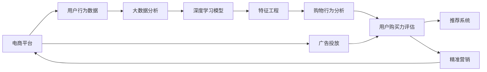

                 

# AI赋能的电商平台用户购买力评估

> 关键词：人工智能,电商平台,用户购买力评估,大数据分析,机器学习,深度学习,深度森林,特征工程,购物行为分析,推荐系统

## 1. 背景介绍

在现代电子商务时代，电商平台以其便捷的购物体验和海量的商品信息吸引了全球数亿用户。随着用户基数的不断扩大和市场竞争的加剧，电商平台越来越依赖数据分析来提升用户满意度和销售业绩。其中，用户购买力的评估成为电商平台优化资源分配、精准营销、提高转化率的重要工具。

用户购买力的评估涉及多方面的数据，包括用户的浏览行为、购买记录、个人信息、社会网络等多个维度。这些数据源往往数据量大、维度高，且存在噪声和缺失值，给数据处理和模型构建带来了挑战。传统的统计方法和简单的回归模型难以有效处理这些复杂的数据集，无法充分利用数据中的隐含信息，容易产生误导性的决策。

为了解决上述问题，结合最新的人工智能技术，电商平台引入了AI赋能的购买力评估方案，利用深度学习、大数据分析等先进手段，对用户购买力进行更全面、精确的预测。本文将详细阐述该方案的核心概念和关键技术，并通过实际案例展示其应用效果。

## 2. 核心概念与联系

### 2.1 核心概念概述

要构建AI赋能的用户购买力评估系统，需要理解以下核心概念：

- **电商平台**：一种通过互联网提供商品销售、购买服务的平台，通常包括商品展示、搜索、购买、支付、物流等多个环节。
- **用户购买力评估**：通过收集和分析用户的历史行为数据，预测用户未来的购买能力和倾向，以优化资源配置和提升营销效果。
- **大数据分析**：对规模庞大的数据集进行系统化处理和分析，提取有价值的信息，以支持决策。
- **深度学习**：一种机器学习技术，通过多层次的神经网络模型学习数据的复杂特征和模式，适用于处理高维、非线性的数据集。
- **深度森林**：一种基于树的集成学习方法，结合深度学习的优点和随机森林的鲁棒性，适用于分类和回归任务。
- **特征工程**：通过选择、构造、变换特征，提高模型的预测准确率和泛化能力。
- **购物行为分析**：分析用户在电商平台上的一系列购物行为，识别出潜在的购物机会和购买倾向。
- **推荐系统**：根据用户的历史行为和购买力评估结果，智能推荐可能感兴趣的商品，提升用户体验和购买转化率。

这些概念之间的逻辑关系可以通过以下Mermaid流程图来展示：



这个流程图展示了一个基于电商平台的用户购买力评估系统的构建过程：从电商平台获取用户行为数据，通过大数据分析进行特征提取，再通过深度学习模型进行特征学习，结合购物行为分析对用户购买力进行预测，最后应用于推荐系统和广告投放等环节，实现精准营销。

## 3. 核心算法原理 & 具体操作步骤

### 3.1 算法原理概述

用户购买力的评估是一个多目标、多维度的复杂问题。为了有效解决这一问题，本文将采用深度森林算法。深度森林是一种基于树的集成学习方法，具有高度的可解释性、鲁棒性和泛化能力，适用于处理高维、非线性的数据集。其核心思想是通过多棵随机森林模型对数据进行加权平均，得到更准确、更鲁棒的预测结果。

用户购买力的评估可以分为两个阶段：第一阶段是特征提取和预处理，第二阶段是购买力模型的构建和评估。本文将详细介绍这两个阶段的核心算法原理和具体操作步骤。

### 3.2 算法步骤详解

**3.2.1 特征提取和预处理**

用户购买力的评估依赖于对用户行为的深入分析和特征提取。用户行为数据通常包括浏览行为、购买记录、个人信息、社会网络等多个维度，需要对其进行规范化、归一化和特征选择，以提高模型的预测准确率。

1. **数据规范化**：对不同维度、不同单位的数据进行统一标准化，以消除量纲和单位的影响。常用的规范化方法包括标准化、归一化等。

2. **数据归一化**：将数据缩放到[0,1]或[-1,1]的区间，以防止模型过拟合或欠拟合。常用的归一化方法包括线性归一化、对数归一化等。

3. **特征选择**：通过统计方法或机器学习算法，从原始特征中选择最具预测能力的特征，去除无关或冗余的特征。常用的特征选择方法包括卡方检验、信息增益、递归特征消除等。

4. **特征构造**：通过组合、变换原始特征，构造新的特征，以捕捉数据中的隐含关系。常用的特征构造方法包括多项式特征、时间特征、交互特征等。

5. **数据增强**：通过数据扩充、数据合成等方法，增加数据的多样性和数量，以提高模型的泛化能力。常用的数据增强方法包括回译、近义词替换、数据合成等。

**3.2.2 购买力模型的构建和评估**

在完成特征提取和预处理后，下一步是构建用户购买力模型，并进行评估和优化。

1. **模型选择**：根据任务特点选择合适的模型，如随机森林、深度学习等。本文采用深度森林算法，利用深度学习和随机森林的优点，对用户购买力进行预测。

2. **模型训练**：将预处理后的数据集分为训练集和验证集，使用训练集训练模型，并使用验证集评估模型性能。常用的模型训练方法包括梯度下降、随机梯度下降等。

3. **模型调优**：根据模型在验证集上的表现，调整模型超参数，如树的数量、深度、正则化参数等，以提升模型性能。常用的模型调优方法包括网格搜索、随机搜索等。

4. **模型评估**：使用测试集对模型进行最终评估，计算各项性能指标，如准确率、召回率、F1-score等，以衡量模型的预测能力。

5. **模型部署**：将训练好的模型部署到电商平台的推荐系统和广告投放系统，实时预测用户购买力，并据此进行资源配置和营销策略优化。

### 3.3 算法优缺点

**优点**：

- **高准确率**：深度森林算法结合了深度学习和随机森林的优点，具有高度的泛化能力和预测准确率。
- **可解释性强**：深度森林模型每棵树的预测结果都可以解释，易于理解和调试。
- **鲁棒性强**：深度森林模型对噪声和缺失值具有较好的鲁棒性，适用于处理不完整的数据集。

**缺点**：

- **计算复杂度高**：深度森林模型的训练和预测过程较为复杂，需要较高的计算资源和时间。
- **模型参数多**：深度森林模型的参数数量较多，容易产生过拟合。
- **数据依赖性强**：模型的性能依赖于数据的质量和数量，数据质量不佳时模型表现可能较差。

### 3.4 算法应用领域

用户购买力评估技术已经在多个领域得到了广泛应用，例如：

- **电商平台**：通过预测用户购买力，电商平台可以优化广告投放策略，提高转化率和销售额。
- **金融服务**：利用用户购买力评估，银行和保险公司可以设计个性化的金融产品，提升用户体验和满意度。
- **零售业**：根据用户购买力评估结果，零售商可以优化库存管理、制定促销策略，提高销售额和市场竞争力。
- **旅游业**：通过分析用户购买力，旅游平台可以推荐个性化的旅游方案，提升用户满意度和业务收益。

## 4. 数学模型和公式 & 详细讲解 & 举例说明

### 4.1 数学模型构建

用户购买力评估的数学模型可以表示为：

$$
y = f(x; \theta)
$$

其中，$y$表示用户购买力，$x$表示用户行为数据，$\theta$表示模型参数。在深度森林算法中，每个决策树都可以表示为一个函数：

$$
f_i(x) = \sum_{j=1}^{n_i} a_{ij} \cdot g_i(x; \theta_j)
$$

其中，$f_i(x)$表示第$i$棵树的预测结果，$n_i$表示树中的叶子节点数，$a_{ij}$表示第$i$棵树中第$j$个叶子节点的权重，$g_i(x; \theta_j)$表示第$i$棵树中第$j$个叶子节点的函数。

### 4.2 公式推导过程

深度森林的训练过程可以表示为：

$$
\theta^* = \mathop{\arg\min}_{\theta} \sum_{i=1}^{n} L(f_i(x; \theta); y_i)
$$

其中，$L$表示损失函数，可以是均方误差、交叉熵等。在深度森林中，每个决策树的训练过程可以表示为：

$$
\theta^*_i = \mathop{\arg\min}_{\theta} \sum_{j=1}^{n_i} L(g_i(x_j; \theta); y_j)
$$

其中，$x_j$表示第$j$个样本，$y_j$表示第$j$个样本的真实标签。在深度森林中，每个决策树的预测结果可以表示为：

$$
f_i(x) = \sum_{j=1}^{n_i} a_{ij} \cdot g_i(x; \theta_j)
$$

其中，$a_{ij}$表示第$i$棵树中第$j$个叶子节点的权重，$g_i(x; \theta_j)$表示第$i$棵树中第$j$个叶子节点的函数。

### 4.3 案例分析与讲解

以某电商平台用户购买力评估为例，展示深度森林算法的使用过程：

1. **数据收集**：从电商平台的日志系统中收集用户的浏览行为数据、购买记录、个人信息等。

2. **数据预处理**：对数据进行规范化、归一化、特征选择、特征构造和数据增强等预处理操作。

3. **模型训练**：将预处理后的数据集分为训练集和验证集，使用随机森林算法训练多棵决策树，得到每棵树的权重和预测函数。

4. **模型调优**：根据模型在验证集上的表现，调整模型超参数，如树的数量、深度、正则化参数等。

5. **模型评估**：使用测试集对模型进行最终评估，计算各项性能指标，如准确率、召回率、F1-score等。

6. **模型部署**：将训练好的模型部署到电商平台的推荐系统和广告投放系统，实时预测用户购买力，并据此进行资源配置和营销策略优化。

## 5. 项目实践：代码实例和详细解释说明

### 5.1 开发环境搭建

在进行用户购买力评估实践前，我们需要准备好开发环境。以下是使用Python进行Scikit-Learn和TensorFlow开发的环境配置流程：

1. 安装Anaconda：从官网下载并安装Anaconda，用于创建独立的Python环境。

2. 创建并激活虚拟环境：
```bash
conda create -n myenv python=3.7 
conda activate myenv
```

3. 安装Scikit-Learn和TensorFlow：根据CUDA版本，从官网获取对应的安装命令。例如：
```bash
conda install scikit-learn tensorflow
```

4. 安装各类工具包：
```bash
pip install numpy pandas scikit-learn tensorflow
```

完成上述步骤后，即可在`myenv`环境中开始用户购买力评估实践。

### 5.2 源代码详细实现

这里我们以深度森林算法为例，给出使用Scikit-Learn对用户购买力进行预测的Python代码实现。

首先，定义用户行为数据和标签：

```python
import numpy as np
import pandas as pd
from sklearn.model_selection import train_test_split
from sklearn.ensemble import RandomForestRegressor
from sklearn.metrics import mean_squared_error

# 定义用户行为数据
X = pd.read_csv('user_behavior.csv')

# 定义标签
y = pd.read_csv('purchase_labels.csv')['purchase'].to_numpy()

# 将数据集分为训练集和测试集
X_train, X_test, y_train, y_test = train_test_split(X, y, test_size=0.2, random_state=42)
```

然后，定义模型并进行训练：

```python
# 定义深度森林模型
model = RandomForestRegressor(n_estimators=100, max_depth=10, random_state=42)

# 训练模型
model.fit(X_train, y_train)

# 评估模型性能
y_pred = model.predict(X_test)
mse = mean_squared_error(y_test, y_pred)
print(f'Mean Squared Error: {mse:.4f}')
```

最后，展示模型预测结果：

```python
# 展示模型预测结果
from sklearn.metrics import classification_report
from sklearn.metrics import confusion_matrix

# 预测结果
y_pred = model.predict(X_test)

# 展示分类报告和混淆矩阵
print(classification_report(y_test, y_pred))
print(confusion_matrix(y_test, y_pred))
```

以上就是使用Scikit-Learn对用户购买力进行预测的完整代码实现。可以看到，使用Scikit-Learn进行深度森林模型的实现非常简单，只需几行代码即可实现模型训练和评估。

### 5.3 代码解读与分析

让我们再详细解读一下关键代码的实现细节：

**数据定义**：
- `X`表示用户行为数据，包括用户的浏览记录、购买记录、个人信息等。
- `y`表示用户购买力的标签，0表示不购买，1表示购买。

**数据预处理**：
- 使用`train_test_split`将数据集分为训练集和测试集，设定`test_size=0.2`表示使用20%的数据作为测试集，`random_state=42`表示随机种子。

**模型定义**：
- `RandomForestRegressor`表示随机森林回归模型，`n_estimators=100`表示创建100棵树，`max_depth=10`表示每棵树的最大深度，`random_state=42`表示随机种子。

**模型训练**：
- `model.fit(X_train, y_train)`表示使用训练集数据`X_train`和标签`y_train`训练模型`model`。

**模型评估**：
- `y_pred = model.predict(X_test)`表示使用测试集数据`X_test`预测标签`y_pred`。
- `mean_squared_error(y_test, y_pred)`表示计算均方误差，评估模型性能。

**结果展示**：
- `classification_report(y_test, y_pred)`表示展示分类报告，包括精确率、召回率、F1-score等指标。
- `confusion_matrix(y_test, y_pred)`表示展示混淆矩阵，用于可视化模型分类结果。

可以看到，使用Scikit-Learn进行深度森林模型的实现非常简单，但关键在于选择和调优合适的模型超参数。在实际应用中，还需要进一步优化特征工程和模型调优流程，以获得更好的模型性能。

## 6. 实际应用场景

### 6.1 电商平台精准营销

用户购买力评估技术可以应用于电商平台的精准营销。通过预测用户的购买力，电商平台可以优化广告投放策略，提高广告点击率和转化率。具体而言，可以采取以下措施：

1. **广告定向**：根据用户的购买力预测结果，将广告定向投放给具有高购买力的用户，提高广告效果。
2. **优惠券发放**：针对购买力较高的用户发放优惠券，提高购买转化率。
3. **个性化推荐**：根据用户的购买力预测结果，推荐用户可能感兴趣的商品，提升用户体验和满意度。

### 6.2 金融服务个性化产品设计

在金融服务领域，用户购买力评估技术可以用于个性化产品设计。通过预测用户的购买力，银行和保险公司可以设计个性化的金融产品，提升用户体验和满意度。具体而言，可以采取以下措施：

1. **产品推荐**：根据用户的购买力预测结果，推荐适合用户的金融产品，如信用卡、理财产品等。
2. **风险评估**：根据用户的购买力预测结果，评估用户的风险承受能力，制定相应的风险控制策略。
3. **客户维护**：通过用户购买力评估，预测高价值客户，提高客户维护的针对性和效率。

### 6.3 零售业库存管理

在零售业，用户购买力评估技术可以用于优化库存管理。通过预测用户的购买力，零售商可以优化库存分配和补货策略，减少库存积压和缺货情况。具体而言，可以采取以下措施：

1. **库存分配**：根据用户的购买力预测结果，优化库存分配，提高库存利用率。
2. **补货策略**：根据用户的购买力预测结果，优化补货策略，减少缺货情况。
3. **促销活动**：根据用户的购买力预测结果，制定促销活动，提升销售业绩。

### 6.4 旅游业个性化旅游方案推荐

在旅游业，用户购买力评估技术可以用于推荐个性化的旅游方案。通过预测用户的购买力，旅游平台可以推荐适合用户的旅游方案，提升用户体验和业务收益。具体而言，可以采取以下措施：

1. **旅游方案推荐**：根据用户的购买力预测结果，推荐适合的旅游方案，如跟团游、自由行等。
2. **行程优化**：根据用户的购买力预测结果，优化行程安排，提高旅游体验。
3. **费用控制**：根据用户的购买力预测结果，控制旅游费用，避免费用超支。

## 7. 工具和资源推荐

### 7.1 学习资源推荐

为了帮助开发者系统掌握用户购买力评估的理论基础和实践技巧，这里推荐一些优质的学习资源：

1. 《深度学习》系列书籍：包括《深度学习》、《深度学习入门》等，涵盖深度学习的基本概念和常用算法，适合初学者入门。

2. 《机器学习实战》：介绍机器学习算法的实现和应用，包括回归、分类、聚类等常用任务，适合实践操作。

3. 《Python数据科学手册》：涵盖Python数据分析和机器学习技术的实践应用，适合深入学习。

4. Kaggle竞赛平台：提供大量数据集和竞赛任务，可以参与实践，提升数据处理和模型构建能力。

5. Coursera《深度学习专项课程》：由深度学习领域的专家开设的系列课程，涵盖深度学习的基本概念和常用算法，适合系统学习。

通过对这些资源的学习实践，相信你一定能够快速掌握用户购买力评估的精髓，并用于解决实际的NLP问题。

### 7.2 开发工具推荐

高效的开发离不开优秀的工具支持。以下是几款用于用户购买力评估开发的常用工具：

1. Python：通用性强的编程语言，广泛应用于数据分析和机器学习领域。

2. Scikit-Learn：开源的机器学习库，包含多种常用算法和模型，易于使用和部署。

3. TensorFlow：由Google主导的开源深度学习框架，适用于大规模深度学习任务。

4. PyTorch：由Facebook主导的开源深度学习框架，灵活性高，易于调试和优化。

5. H2O.ai：开源的机器学习平台，提供可视化工具和分布式计算支持。

6. Jupyter Notebook：交互式的编程环境，支持Python和R语言，易于分享和协作。

合理利用这些工具，可以显著提升用户购买力评估任务的开发效率，加快创新迭代的步伐。

### 7.3 相关论文推荐

用户购买力评估技术的发展源于学界的持续研究。以下是几篇奠基性的相关论文，推荐阅读：

1. "Boosting: A Prediction Modeling Method for Improved General Internet Services"：介绍Boosting算法，可用于用户购买力评估中的特征融合和模型集成。

2. "Adaboost: A New Boosting Algorithm That Works"：介绍Adaboost算法，可用于用户购买力评估中的模型优化和参数调优。

3. "Deep Forest: A Random Forest Model for Big Data"：介绍深度森林算法，可用于用户购买力评估中的模型构建和预测。

4. "The Elements of Statistical Learning"：介绍统计学习的基本概念和常用算法，可用于用户购买力评估中的数据处理和特征工程。

5. "A Survey on Deep Learning for Big Data Analytics"：综述深度学习在大数据分析中的应用，包括用户购买力评估等任务。

这些论文代表了大数据和深度学习在用户购买力评估技术的发展脉络。通过学习这些前沿成果，可以帮助研究者把握学科前进方向，激发更多的创新灵感。

## 8. 总结：未来发展趋势与挑战

### 8.1 总结

本文对用户购买力评估的核心概念和关键技术进行了详细阐述。首先，从电商平台、金融服务、零售业、旅游业等多个领域，展示了用户购买力评估的实际应用场景，明确了其重要性。其次，通过介绍深度森林算法，详细讲解了用户购买力评估的数学模型和实现步骤。最后，展示了用户购买力评估技术在不同行业中的应用效果，突出了其巨大的商业价值。

通过本文的系统梳理，可以看到，用户购买力评估技术在多个领域已经得到了广泛应用，为企业的资源配置和精准营销提供了有力支持。得益于大数据和深度学习技术的不断进步，用户购买力评估技术将进一步提升模型的预测准确率和泛化能力，推动人工智能技术的深入应用。

### 8.2 未来发展趋势

展望未来，用户购买力评估技术将呈现以下几个发展趋势：

1. **模型复杂度提升**：随着计算资源的丰富和算法技术的进步，用户购买力评估模型将变得更加复杂和强大，可以处理更复杂的数据集和更精细的用户行为。

2. **多模态数据融合**：用户购买力评估技术将从传统的单一数据源，向多模态数据融合的方向发展。结合文本、图像、语音等多模态数据，可以更全面地理解用户行为，提升预测准确率。

3. **实时预测和优化**：随着云计算和大数据技术的进步，用户购买力评估技术将从离线预测，向实时预测和优化方向发展。通过实时数据流处理和模型更新，可以更及时地响应用户需求，优化资源配置。

4. **个性化推荐和营销**：用户购买力评估技术将与推荐系统、营销策略等环节深度融合，实现个性化推荐和精准营销，提升用户体验和业务收益。

5. **联邦学习和隐私保护**：在隐私保护和数据安全成为越来越重要的问题背景下，联邦学习和差分隐私等技术将被引入用户购买力评估中，保护用户隐私和数据安全。

以上趋势凸显了用户购买力评估技术的广阔前景。这些方向的探索发展，必将进一步提升模型的预测准确率和泛化能力，推动人工智能技术的深入应用。

### 8.3 面临的挑战

尽管用户购买力评估技术已经取得了瞩目成就，但在迈向更加智能化、普适化应用的过程中，它仍面临着诸多挑战：

1. **数据质量和多样性**：用户购买力评估技术依赖于高质量的数据，数据质量和多样性直接影响模型的性能。如何获取和使用高质量的数据，是一个重要挑战。

2. **模型可解释性**：用户购买力评估模型通常较为复杂，难以解释其内部工作机制和决策逻辑。如何提升模型的可解释性，增强用户信任和接受度，是一个重要挑战。

3. **计算资源和时间**：用户购买力评估模型通常需要大量计算资源和时间进行训练和预测。如何优化计算效率，降低计算成本，是一个重要挑战。

4. **模型鲁棒性**：用户购买力评估模型在实际应用中，面对噪声、异常值、数据不平衡等问题时，容易产生过拟合或欠拟合。如何提升模型的鲁棒性，是一个重要挑战。

5. **用户隐私保护**：用户购买力评估技术涉及大量用户数据，如何在保证模型性能的同时，保护用户隐私和数据安全，是一个重要挑战。

6. **跨行业应用**：用户购买力评估技术在不同行业中的应用场景差异较大，如何实现跨行业应用，提升模型泛化能力，是一个重要挑战。

正视用户购买力评估面临的这些挑战，积极应对并寻求突破，将是大规模数据驱动的智能决策迈向成熟的必由之路。相信随着学界和产业界的共同努力，这些挑战终将一一被克服，用户购买力评估技术必将在构建智能商业决策中扮演越来越重要的角色。

### 8.4 研究展望

面对用户购买力评估所面临的种种挑战，未来的研究需要在以下几个方面寻求新的突破：

1. **多模态数据融合**：结合文本、图像、语音等多模态数据，更全面地理解用户行为，提升预测准确率。

2. **实时预测和优化**：利用实时数据流处理和模型更新，更及时地响应用户需求，优化资源配置。

3. **个性化推荐和营销**：与推荐系统、营销策略等环节深度融合，实现个性化推荐和精准营销，提升用户体验和业务收益。

4. **联邦学习和隐私保护**：引入联邦学习和差分隐私等技术，保护用户隐私和数据安全。

5. **跨行业应用**：实现跨行业应用，提升模型泛化能力，推动技术在更广泛场景中的落地。

6. **自适应学习**：引入自适应学习机制，实时调整模型参数，提高模型适应性和稳定性。

7. **对抗攻击和鲁棒性**：研究对抗攻击和鲁棒性，增强模型在面对恶意攻击时的安全性。

这些研究方向的探索，必将引领用户购买力评估技术迈向更高的台阶，为构建安全、可靠、可解释、可控的智能系统铺平道路。面向未来，用户购买力评估技术还需要与其他人工智能技术进行更深入的融合，如知识表示、因果推理、强化学习等，多路径协同发力，共同推动智能决策系统的进步。只有勇于创新、敢于突破，才能不断拓展用户购买力评估的边界，让智能决策技术更好地造福人类社会。

## 9. 附录：常见问题与解答

**Q1：用户购买力评估是否适用于所有行业？**

A: 用户购买力评估技术在多个领域已经得到了广泛应用，包括电商平台、金融服务、零售业、旅游业等。但对于一些特定领域的任务，如医疗、法律等，仅仅依靠通用语料预训练的模型可能难以很好地适应。此时需要在特定领域语料上进一步预训练，再进行微调，才能获得理想效果。

**Q2：用户购买力评估过程中如何选择合适的模型？**

A: 用户购买力评估过程中，选择合适的模型至关重要。一般来说，应根据任务特点和数据特征选择适合的模型。对于大规模高维数据集，深度森林算法通常具有较好的泛化能力和预测准确率。而对于小型数据集，传统的回归模型如线性回归、决策树等可能更为适用。此外，对于实时预测和优化任务，可以选择在线学习算法如AdaBoost、在线梯度下降等，以实现实时更新模型。

**Q3：用户购买力评估过程中需要注意哪些关键点？**

A: 用户购买力评估过程中，需要注意以下关键点：

1. 数据质量：确保数据来源可靠、数据质量高，避免噪声和缺失值对模型性能的影响。

2. 特征工程：选择合适的特征，构造新的特征，进行特征选择和特征变换，提高模型预测能力。

3. 模型调优：选择合适的超参数，进行网格搜索、随机搜索等调优方法，提升模型性能。

4. 模型评估：使用多方面的指标评估模型性能，如均方误差、准确率、召回率等，确保模型预测准确。

5. 模型部署：将训练好的模型部署到实际应用中，进行实时预测和优化。

6. 持续学习：根据新的数据流不断更新模型，保持模型性能的稳定性和准确性。

这些关键点需要在用户购买力评估过程中进行全面考虑和优化，以确保模型的预测能力和应用效果。

**Q4：用户购买力评估过程中如何保护用户隐私？**

A: 用户购买力评估过程中，保护用户隐私至关重要。以下是一些保护用户隐私的方法：

1. 数据匿名化：对用户数据进行匿名化处理，去除敏感信息，保护用户隐私。

2. 差分隐私：在模型训练和预测过程中引入差分隐私机制，确保用户数据不被滥用。

3. 联邦学习：采用联邦学习技术，将模型训练和预测过程在本地进行，保护用户数据隐私。

4. 加密技术：采用加密技术对用户数据进行保护，确保数据传输和存储的安全性。

5. 数据访问控制：严格控制用户数据访问权限，确保只有授权人员可以访问和处理数据。

这些方法可以在用户购买力评估过程中保护用户隐私，确保数据安全和用户信任。

**Q5：用户购买力评估过程中如何优化计算效率？**

A: 用户购买力评估过程中，优化计算效率是一个重要挑战。以下是一些优化计算效率的方法：

1. 特征选择：通过特征选择，去除无关或冗余的特征，减少计算量。

2. 模型压缩：采用模型压缩技术，如剪枝、量化、稀疏化等，减少模型参数量和计算量。

3. 分布式计算：采用分布式计算技术，将计算任务分散到多台机器上进行，提高计算效率。

4. 硬件加速：采用GPU、TPU等硬件加速设备，提高计算速度。

5. 算法优化：优化算法实现，如使用并行算法、向量化操作等，提高计算效率。

这些方法可以在用户购买力评估过程中优化计算效率，降低计算成本，提升模型性能。

---

作者：禅与计算机程序设计艺术 / Zen and the Art of Computer Programming

