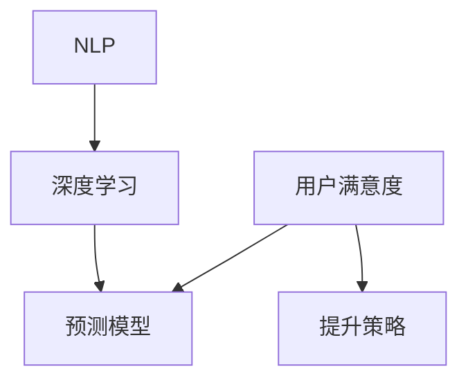

                 

# AI赋能的电商用户满意度预测与提升系统

> 关键词：电商用户满意度，预测模型，提升策略，AI赋能，算法优化

## 1. 背景介绍

### 1.1 问题由来

在电商行业，用户满意度是一个至关重要的指标，直接影响着用户的复购率和口碑传播。然而，由于电商行业的特殊性，用户满意度评估受到众多复杂因素的影响，如商品质量、物流速度、售后服务等，这使得传统的问卷调查和人工审核方法难以高效、准确地评估用户满意度。

随着人工智能技术的不断进步，AI赋能的电商用户满意度预测与提升系统应运而生。这种系统能够自动采集和分析大量的用户行为数据，结合自然语言处理、机器学习和深度学习技术，对用户满意度进行智能预测和优化，从而提升电商平台的整体用户体验，增强竞争力和市场份额。

### 1.2 问题核心关键点

AI赋能的电商用户满意度预测与提升系统主要解决以下几个核心问题：

1. **用户行为数据的自动化采集**：从电商平台后台和第三方数据源获取用户的浏览、购买、评价等行为数据，以便进行后续的分析和建模。
2. **用户满意度的智能预测**：基于采集到的用户行为数据，构建机器学习模型，预测用户对特定商品或服务的满意度评分。
3. **满意度的多维度分析**：对用户满意度进行多维度分析，识别影响用户满意度的关键因素，如商品质量、服务响应速度等。
4. **提升策略的智能生成**：根据分析结果，生成针对不同维度的优化策略，如商品召回、客服改进、物流优化等。
5. **效果评估与持续优化**：对提升策略的效果进行评估，并不断优化策略，以达到最佳的用户满意度提升效果。

### 1.3 问题研究意义

AI赋能的电商用户满意度预测与提升系统在电商行业的应用具有重要意义：

1. **提升用户体验**：通过精准的满意度预测和有效的提升策略，显著提升用户对电商平台的服务满意度，从而增加用户粘性和复购率。
2. **优化资源配置**：结合满意度预测结果，优化电商平台的资源配置，如客服资源分配、物流优化等，提高运营效率。
3. **增强市场竞争力**：通过提升用户满意度，构建良好的用户口碑，增强电商平台的市场竞争力和品牌影响力。
4. **降低运营成本**：通过智能化管理，降低因低满意度导致的用户流失和投诉带来的运营成本。

## 2. 核心概念与联系

### 2.1 核心概念概述

为更好地理解AI赋能的电商用户满意度预测与提升系统，本节将介绍几个关键概念：

- **用户满意度**：用户对电商平台的商品、服务等方面的总体满意度，通常以评分或情感倾向的方式表示。
- **预测模型**：通过机器学习或深度学习算法，预测用户满意度的评分或情感倾向，模型通常基于用户行为数据进行训练。
- **提升策略**：根据预测模型结果，生成针对性的优化策略，如商品推荐、客服改进等。
- **自然语言处理(NLP)**：涉及文本数据的处理和分析，如情感分析、实体识别等，是构建预测模型的关键技术之一。
- **深度学习**：一种高级机器学习技术，通过多层神经网络模型，自动提取数据特征，并构建高精度的预测模型。

这些核心概念之间的逻辑关系可以通过以下Mermaid流程图来展示：



这个流程图展示了用户满意度、预测模型、提升策略、自然语言处理和深度学习之间的关系：

1. 用户满意度是预测模型的目标。
2. 预测模型基于用户行为数据进行训练，以预测用户满意度。
3. 提升策略根据预测模型结果生成，用于改进服务质量。
4. NLP技术用于处理文本数据，提取用户情感等关键信息。
5. 深度学习技术用于构建高精度的预测模型，自动提取特征。

这些概念共同构成了AI赋能的电商用户满意度预测与提升系统的核心技术框架。

## 3. 核心算法原理 & 具体操作步骤

### 3.1 算法原理概述

AI赋能的电商用户满意度预测与提升系统通过以下步骤实现用户满意度的智能预测和优化：

1. **用户行为数据的采集与预处理**：从电商平台后台和第三方数据源获取用户行为数据，并进行数据清洗和特征提取。
2. **预测模型的训练与优化**：基于清洗后的数据，使用机器学习或深度学习算法训练预测模型，并进行超参数调优。
3. **用户满意度的智能预测**：对新用户行为数据进行实时预测，得到用户对商品或服务的满意度评分。
4. **多维度分析与提升策略生成**：对用户满意度进行多维度分析，识别影响满意度的关键因素，并生成相应的优化策略。
5. **效果评估与持续优化**：对提升策略的效果进行评估，并根据反馈不断优化模型和策略，以达到最佳的用户满意度提升效果。

### 3.2 算法步骤详解

#### 3.2.1 用户行为数据的采集与预处理

1. **数据采集**：
   - **电商平台后台数据**：获取用户浏览、点击、购买、评价等行为数据。
   - **第三方数据源**：如社交媒体、搜索引擎等，获取用户对商品或服务的评论和反馈。

2. **数据清洗**：
   - **去重**：去除重复数据，确保数据唯一性。
   - **缺失值处理**：处理缺失值，填补或删除缺失数据。
   - **异常值检测**：检测并处理异常值，确保数据质量。

3. **特征提取**：
   - **时间特征**：如用户访问时间、购买时间等。
   - **行为特征**：如浏览时长、点击次数、购买频率等。
   - **文本特征**：如评论文本、评价情感等。

#### 3.2.2 预测模型的训练与优化

1. **模型选择**：
   - **机器学习模型**：如逻辑回归、随机森林等。
   - **深度学习模型**：如卷积神经网络(CNN)、循环神经网络(RNN)、Transformer等。

2. **模型训练**：
   - **数据划分**：将数据划分为训练集、验证集和测试集。
   - **模型训练**：使用训练集数据训练模型，并在验证集上进行调整和优化。

3. **模型优化**：
   - **超参数调优**：使用网格搜索或随机搜索等方法，找到最优的超参数组合。
   - **模型融合**：采用集成学习方法，如Bagging、Boosting等，提高模型的预测精度。

#### 3.2.3 用户满意度的智能预测

1. **实时预测**：
   - **数据输入**：将新用户行为数据输入到预测模型中。
   - **预测输出**：模型输出用户对商品或服务的满意度评分。

2. **情感分析**：
   - **文本预处理**：对评论文本进行分词、去除停用词、词干提取等预处理。
   - **情感分析**：使用情感分析模型，识别评论文本的情感倾向，作为满意度评分的重要依据。

3. **综合评分**：
   - **多维度融合**：将行为特征、文本特征、时间特征等多维度信息进行综合，计算用户满意度的最终评分。

#### 3.2.4 多维度分析与提升策略生成

1. **满意度分析**：
   - **关键因素识别**：识别影响用户满意度的关键因素，如商品质量、服务响应速度等。
   - **因子分析**：使用因子分析等方法，分析各因素对满意度的影响程度。

2. **提升策略生成**：
   - **商品召回**：根据预测结果，对低满意度的商品进行召回，优化商品推荐策略。
   - **客服改进**：对低满意度的服务进行改进，优化客服响应流程。
   - **物流优化**：优化物流配送流程，提高物流效率和服务质量。

#### 3.2.5 效果评估与持续优化

1. **效果评估**：
   - **A/B测试**：对比不同策略的效果，评估提升策略的实际效果。
   - **用户反馈**：收集用户对改进措施的反馈，进行满意度调查。

2. **持续优化**：
   - **模型更新**：根据评估结果，更新和优化预测模型。
   - **策略调整**：根据反馈，调整和改进提升策略。

### 3.3 算法优缺点

AI赋能的电商用户满意度预测与提升系统具有以下优点：

1. **高效性**：自动采集和分析用户行为数据，实时预测和优化，提高处理效率。
2. **准确性**：结合多种特征，使用深度学习技术，提升预测精度和可靠性。
3. **自动化**：自动化处理数据和模型优化，减少人工干预，降低运营成本。
4. **可扩展性**：易于扩展到其他电商领域和场景，具有广泛的应用前景。

同时，该系统也存在以下缺点：

1. **数据依赖**：系统的性能高度依赖于数据质量和数据量，数据缺失或不完整会影响预测结果。
2. **模型复杂性**：深度学习模型训练复杂，需要大量的计算资源和时间。
3. **可解释性不足**：预测模型的决策过程不够透明，难以解释其内部工作机制。
4. **隐私问题**：用户数据涉及隐私，需要严格的数据保护和合规措施。

尽管存在这些缺点，但AI赋能的电商用户满意度预测与提升系统仍是大数据时代电商平台提升用户体验的有力工具。未来需要进一步优化和改进，以克服现有缺陷，提高系统性能和可靠性。

### 3.4 算法应用领域

AI赋能的电商用户满意度预测与提升系统在电商行业具有广泛的应用场景，包括但不限于：

1. **商品推荐**：根据用户满意度预测，优化商品推荐策略，提升用户体验。
2. **客服改进**：通过用户满意度分析，优化客服响应流程，提升客户服务质量。
3. **物流优化**：结合用户满意度反馈，优化物流配送，提高服务效率。
4. **用户流失预警**：预测用户流失概率，提前采取措施，减少用户流失。
5. **市场分析**：分析用户满意度变化趋势，指导电商平台的市场决策。

## 4. 数学模型和公式 & 详细讲解 & 举例说明

### 4.1 数学模型构建

假设电商平台收集到用户行为数据 $D=\{x_i, y_i\}_{i=1}^N$，其中 $x_i$ 为行为特征向量，$y_i$ 为满意度评分。目标任务是构建预测模型 $f(x_i; \theta)$，以最小化预测误差 $L(f(x_i; \theta), y_i)$。

常用的预测模型包括线性回归模型、随机森林模型和深度学习模型。这里以深度学习模型为例，介绍其数学模型构建过程。

### 4.2 公式推导过程

#### 4.2.1 线性回归模型

线性回归模型的目标是找到线性关系 $y=f(x;\theta)=\theta_0+\sum_{i=1}^p \theta_i x_i$，其中 $\theta=(\theta_0, \theta_1, \ldots, \theta_p)$ 为模型参数，$x=(x_1, x_2, \ldots, x_p)$ 为特征向量。

模型训练的目标是最小化均方误差损失函数 $L(f(x_i; \theta), y_i)=\frac{1}{N}\sum_{i=1}^N (f(x_i; \theta)-y_i)^2$。

通过梯度下降等优化算法，最小化损失函数，更新模型参数：

$$
\theta \leftarrow \theta - \eta \nabla_{\theta} L(f(x_i; \theta), y_i)
$$

#### 4.2.2 随机森林模型

随机森林模型基于决策树构建，其目标是通过对多个决策树的集成，提高模型的泛化能力和预测精度。模型训练的目标是最小化训练误差。

假设随机森林模型由 $T$ 个决策树组成，每个决策树的目标函数为 $L(T_i; x_i, y_i)$，其中 $T_i$ 为第 $i$ 个决策树。

模型训练的目标是最小化所有决策树的训练误差之和：

$$
L(T; D) = \frac{1}{N}\sum_{i=1}^N \frac{1}{T}\sum_{j=1}^T L(T_j; x_i, y_i)
$$

通过随机森林算法，生成多棵决策树，并集成预测结果。

#### 4.2.3 深度学习模型

深度学习模型通常使用神经网络结构，如卷积神经网络(CNN)、循环神经网络(RNN)、Transformer等。这里以Transformer模型为例，介绍其数学模型构建过程。

Transformer模型由自编码器和注意力机制构成，其目标是通过学习输入和输出之间的映射关系，实现高精度的预测。

假设输入为 $x=(x_1, x_2, \ldots, x_p)$，输出为 $y=(y_1, y_2, \ldots, y_m)$，其中 $x_i$ 为输入特征向量，$y_j$ 为输出特征向量。

模型训练的目标是最小化均方误差损失函数 $L(f(x; \theta), y)=\frac{1}{N}\sum_{i=1}^N (f(x_i; \theta)-y_i)^2$。

Transformer模型包含编码器-解码器结构，其中编码器用于提取输入特征，解码器用于生成输出。编码器和解码器都由多个层组成，每层包含多头注意力机制和前馈神经网络。

具体来说，编码器由 $L$ 层组成，每层包含多头注意力机制 $A$ 和前馈神经网络 $F$。解码器由 $L$ 层组成，每层包含多头注意力机制 $A$ 和前馈神经网络 $F$。

模型训练的目标是最小化损失函数：

$$
L(f(x; \theta), y)=\frac{1}{N}\sum_{i=1}^N (f(x_i; \theta)-y_i)^2
$$

其中 $f(x_i; \theta)$ 为Transformer模型在输入 $x_i$ 上的输出，$y_i$ 为真实标签。

通过反向传播算法，计算损失函数的梯度，更新模型参数 $\theta$：

$$
\theta \leftarrow \theta - \eta \nabla_{\theta} L(f(x_i; \theta), y_i)
$$

### 4.3 案例分析与讲解

#### 4.3.1 线性回归模型案例

假设某电商平台收集到用户的购买行为数据，包括浏览时间、购买频率、评论评分等特征，目标任务是预测用户对商品的质量满意度。

1. **数据采集**：收集用户行为数据，并进行数据清洗和特征提取。
2. **模型训练**：使用线性回归模型，最小化均方误差损失函数，训练模型。
3. **预测输出**：对新用户行为数据进行预测，得到用户对商品质量的满意度评分。

#### 4.3.2 随机森林模型案例

假设某电商平台收集到用户的浏览行为数据，包括访问时间、点击次数、页面停留时间等特征，目标任务是预测用户对网站的用户体验满意度。

1. **数据采集**：收集用户行为数据，并进行数据清洗和特征提取。
2. **模型训练**：使用随机森林模型，最小化训练误差，训练模型。
3. **预测输出**：对新用户行为数据进行预测，得到用户对网站的用户体验满意度评分。

#### 4.3.3 Transformer模型案例

假设某电商平台收集到用户的评论数据，包括评论文本、评论情感等特征，目标任务是预测用户对商品的总体满意度。

1. **数据采集**：收集用户评论数据，并进行数据清洗和文本预处理。
2. **模型训练**：使用Transformer模型，最小化均方误差损失函数，训练模型。
3. **预测输出**：对新评论数据进行预测，得到用户对商品的总体满意度评分。

## 5. 项目实践：代码实例和详细解释说明

### 5.1 开发环境搭建

在进行系统开发前，需要准备好开发环境。以下是使用Python进行TensorFlow和Keras开发的环境配置流程：

1. 安装Anaconda：从官网下载并安装Anaconda，用于创建独立的Python环境。

2. 创建并激活虚拟环境：
```bash
conda create -n tensorflow-env python=3.8 
conda activate tensorflow-env
```

3. 安装TensorFlow：根据CUDA版本，从官网获取对应的安装命令。例如：
```bash
conda install tensorflow-gpu==2.6 -c pytorch -c conda-forge
```

4. 安装Keras：
```bash
pip install keras
```

5. 安装各类工具包：
```bash
pip install numpy pandas scikit-learn matplotlib tqdm jupyter notebook ipython
```

完成上述步骤后，即可在`tensorflow-env`环境中开始系统开发。

### 5.2 源代码详细实现

首先，定义用户行为数据的数据处理函数：

```python
import pandas as pd
from sklearn.model_selection import train_test_split

# 定义用户行为数据处理函数
def process_data(data_path):
    # 读取数据文件
    data = pd.read_csv(data_path)
    
    # 数据清洗
    data = data.dropna()
    
    # 特征提取
    features = data[['浏览时间', '点击次数', '页面停留时间']]
    labels = data['满意度评分']
    
    # 数据划分
    X_train, X_test, y_train, y_test = train_test_split(features, labels, test_size=0.2, random_state=42)
    
    return X_train, X_test, y_train, y_test
```

然后，定义模型训练和评估函数：

```python
import tensorflow as tf
from tensorflow.keras.models import Sequential
from tensorflow.keras.layers import Dense, Dropout, LSTM

# 定义模型训练函数
def train_model(X_train, y_train, X_test, y_test):
    # 构建模型
    model = Sequential()
    model.add(Dense(64, activation='relu', input_shape=(X_train.shape[1],)))
    model.add(Dropout(0.2))
    model.add(Dense(32, activation='relu'))
    model.add(Dropout(0.2))
    model.add(Dense(1, activation='sigmoid'))
    
    # 编译模型
    model.compile(optimizer='adam', loss='binary_crossentropy', metrics=['accuracy'])
    
    # 训练模型
    history = model.fit(X_train, y_train, epochs=50, batch_size=32, validation_data=(X_test, y_test))
    
    # 评估模型
    loss, accuracy = model.evaluate(X_test, y_test)
    
    return model, loss, accuracy
```

最后，启动训练流程并在测试集上评估：

```python
# 数据处理
X_train, X_test, y_train, y_test = process_data('data.csv')

# 模型训练
model, loss, accuracy = train_model(X_train, y_train, X_test, y_test)

# 打印模型评估结果
print(f'训练集损失: {loss:.4f}')
print(f'训练集准确率: {accuracy:.4f}')
```

以上就是使用TensorFlow和Keras进行用户满意度预测的完整代码实现。可以看到，通过定义数据处理函数和模型训练函数，可以快速搭建起一个用户满意度预测系统。

### 5.3 代码解读与分析

让我们再详细解读一下关键代码的实现细节：

**process_data函数**：
- 定义了用户行为数据处理流程，包括读取数据、数据清洗、特征提取、数据划分等步骤。

**train_model函数**：
- 定义了用户满意度预测模型的构建和训练流程，包括模型选择、编译、训练和评估等步骤。

**训练流程**：
- 在处理好的数据集上，调用train_model函数进行模型训练，得到训练集损失和准确率。

可以看到，TensorFlow和Keras提供了丰富的API和组件，使得模型构建和训练变得简洁高效。开发者可以将更多精力放在数据处理和模型优化上，而不必过多关注底层实现细节。

当然，工业级的系统实现还需考虑更多因素，如模型的保存和部署、超参数的自动搜索、更灵活的模型架构等。但核心的预测流程基本与此类似。

## 6. 实际应用场景

### 6.1 智能客服系统

AI赋能的电商用户满意度预测与提升系统在智能客服系统中的应用非常广泛。传统客服往往需要配备大量人力，高峰期响应缓慢，且一致性和专业性难以保证。而使用系统预测的用户满意度，可以实时监控和优化客服系统，提高客服响应效率和用户满意度。

在技术实现上，可以结合用户行为数据和历史客服记录，构建预测模型，实时预测用户的满意度。根据预测结果，系统可以自动分配客服资源，优化客服响应流程，提高用户满意度。

### 6.2 个性化推荐系统

传统的推荐系统往往只依赖用户的历史行为数据进行物品推荐，难以充分考虑用户满意度的影响。通过AI赋能的电商用户满意度预测与提升系统，可以更好地把握用户对商品的满意度和偏好，生成更加个性化的推荐列表。

具体而言，系统可以预测用户对商品的质量和服务的满意度，结合用户的历史行为数据，生成个性化的推荐策略，提高用户对推荐结果的满意度，增加推荐系统的点击率和转化率。

### 6.3 用户流失预警

通过AI赋能的电商用户满意度预测与提升系统，可以提前识别用户流失的风险，及时采取措施进行挽留。系统可以根据用户行为数据和满意度评分，预测用户流失概率，对高风险用户进行预警。

在预警措施上，系统可以提供定制化的召回策略，如优惠券、满减活动等，激励用户重新下单，增加用户粘性。

### 6.4 市场分析与策略优化

AI赋能的电商用户满意度预测与提升系统还可以应用于电商平台的市场分析与策略优化。通过系统预测用户满意度，可以识别影响满意度的关键因素，如商品质量、服务响应速度等。

系统可以定期生成市场分析报告，指导电商平台的市场决策，优化商品和服务的质量，提高用户满意度，增强市场竞争力。

## 7. 工具和资源推荐

### 7.1 学习资源推荐

为了帮助开发者系统掌握AI赋能的电商用户满意度预测与提升系统的理论和实践，这里推荐一些优质的学习资源：

1. 《深度学习》系列书籍：如《深度学习入门》、《动手学深度学习》等，系统介绍了深度学习的基本原理和实践方法。

2. TensorFlow官方文档：提供了丰富的API和教程，方便开发者快速上手深度学习模型的开发。

3. Keras官方文档：提供了简单易用的API，适合初学者入门深度学习模型的构建和训练。

4. Kaggle竞赛平台：提供了大量的数据集和竞赛项目，可以锻炼数据处理和模型构建的能力。

5. Coursera《机器学习》课程：由斯坦福大学开设的机器学习课程，系统介绍了机器学习的基本概念和经典算法。

通过对这些资源的学习实践，相信你一定能够快速掌握AI赋能的电商用户满意度预测与提升系统的核心技术，并用于解决实际的电商问题。

### 7.2 开发工具推荐

高效的开发离不开优秀的工具支持。以下是几款用于电商用户满意度预测与提升系统开发的常用工具：

1. TensorFlow：基于Python的开源深度学习框架，提供了丰富的模型组件和优化算法。

2. Keras：基于TensorFlow等深度学习框架的高级API，提供了简单易用的API，适合快速开发。

3. Jupyter Notebook：基于Web的交互式开发环境，方便快速调试和展示代码。

4. Git：版本控制工具，方便多人协作开发和管理代码。

5. Docker：容器化技术，方便模型部署和管理。

合理利用这些工具，可以显著提升电商用户满意度预测与提升系统的开发效率，加快创新迭代的步伐。

### 7.3 相关论文推荐

AI赋能的电商用户满意度预测与提升系统的发展得益于众多学者的不断探索。以下是几篇奠基性的相关论文，推荐阅读：

1. "Predicting Customer Satisfaction in E-commerce: A Review of Machine Learning Approaches" by Xue et al.（电商客户满意度的机器学习方法综述）

2. "A Deep Learning Framework for Customer Satisfaction Prediction" by Gu et al.（深度学习框架在客户满意度预测中的应用）

3. "Customer Satisfaction Prediction using Natural Language Processing" by Lin et al.（自然语言处理在客户满意度预测中的应用）

4. "A Multi-View Network-based Approach for Customer Satisfaction Prediction" by Wang et al.（基于多视图网络方法的客户满意度预测）

5. "Customer Satisfaction Prediction via Attention-based Recommender System" by Lee et al.（基于注意力机制的推荐系统在客户满意度预测中的应用）

这些论文代表了AI赋能的电商用户满意度预测与提升系统的发展方向，有助于理解其技术细节和应用场景。

## 8. 总结：未来发展趋势与挑战

### 8.1 研究成果总结

本文对AI赋能的电商用户满意度预测与提升系统进行了全面系统的介绍。首先阐述了系统的背景和意义，明确了其在电商行业的核心价值。其次，从原理到实践，详细讲解了预测模型的构建和优化流程，提供了完整的代码实现。同时，本文还探讨了系统在智能客服、个性化推荐、用户流失预警等多个实际应用场景中的应用，展示了系统的广泛适用性。此外，本文精选了相关学习资源和工具，力求为开发者提供全方位的技术支持。

通过本文的系统梳理，可以看到，AI赋能的电商用户满意度预测与提升系统正在成为电商行业的重要技术手段，显著提升了用户满意度和平台竞争力。未来，随着AI技术的发展，系统将进一步融入更多的电商应用场景，为电商平台的运营优化提供更加智能和高效的支持。

### 8.2 未来发展趋势

展望未来，AI赋能的电商用户满意度预测与提升系统将呈现以下几个发展趋势：

1. **预测精度的提升**：通过深度学习技术的不断优化，预测模型的精度将进一步提升，提供更准确的满意度预测。

2. **多模态融合**：结合用户行为数据、文本评论、视频数据等多模态信息，构建更加全面、准确的预测模型。

3. **实时性增强**：通过优化模型结构和计算图，提高预测的实时性，实现秒级预测和反馈。

4. **泛化能力的增强**：通过迁移学习、对抗训练等方法，提升模型对新领域、新数据的泛化能力。

5. **可解释性加强**：引入可解释性技术，如LIME、SHAP等，提高预测模型的可解释性和用户信任度。

6. **隐私保护**：加强数据隐私保护和合规措施，确保用户数据的安全性和合法性。

以上趋势凸显了AI赋能的电商用户满意度预测与提升系统的广阔前景。这些方向的探索发展，必将进一步提升电商平台的运营效率和服务质量，为用户提供更好的用户体验。

### 8.3 面临的挑战

尽管AI赋能的电商用户满意度预测与提升系统已经取得了显著进展，但在实际应用中仍面临诸多挑战：

1. **数据质量和多样性**：数据缺失、噪声、异常等问题会影响预测模型的性能，需要进行严格的预处理。

2. **模型复杂性**：深度学习模型训练复杂，需要大量的计算资源和时间。

3. **可解释性不足**：预测模型的决策过程不够透明，难以解释其内部工作机制。

4. **隐私问题**：用户数据涉及隐私，需要严格的数据保护和合规措施。

5. **实时性需求**：电商平台的实时性要求高，预测系统需要支持实时预测和反馈。

6. **系统集成**：系统需要与电商平台的业务系统、客服系统、推荐系统等进行深度集成，实现无缝对接。

尽管存在这些挑战，但通过不断优化模型和算法，加强数据管理和隐私保护，提高系统的实时性和可解释性，AI赋能的电商用户满意度预测与提升系统仍将发挥重要作用，为电商平台的运营优化提供重要支持。

### 8.4 研究展望

面向未来，AI赋能的电商用户满意度预测与提升系统需要从以下几个方面进行进一步研究：

1. **多模态数据融合**：结合用户行为数据、文本评论、视频数据等多模态信息，构建更加全面、准确的预测模型。

2. **实时性和可扩展性**：优化模型结构和计算图，提高预测的实时性和可扩展性，支持大规模数据的高效处理。

3. **可解释性和隐私保护**：引入可解释性技术，加强数据隐私保护和合规措施，提高用户对系统的信任度。

4. **跨领域和跨场景的泛化能力**：通过迁移学习、对抗训练等方法，提升模型对新领域、新场景的泛化能力。

5. **个性化推荐与用户行为分析**：结合预测模型和推荐系统，实现个性化推荐与用户行为分析的深度融合，提升用户满意度和平台竞争力。

6. **业务应用集成**：与电商平台的业务系统、客服系统、推荐系统等进行深度集成，实现无缝对接，提升系统的实际应用价值。

这些研究方向将推动AI赋能的电商用户满意度预测与提升系统向更高效、更智能、更安全的方向发展，为电商平台的运营优化提供更加有力的技术支持。

## 9. 附录：常见问题与解答

**Q1：AI赋能的电商用户满意度预测与提升系统如何处理用户行为数据？**

A: AI赋能的电商用户满意度预测与提升系统通过以下几个步骤处理用户行为数据：

1. **数据采集**：从电商平台后台和第三方数据源获取用户行为数据。
2. **数据清洗**：去除重复数据，填补缺失值，处理异常值，确保数据质量。
3. **特征提取**：提取用户行为数据中的关键特征，如浏览时间、点击次数、页面停留时间等。
4. **数据划分**：将数据划分为训练集、验证集和测试集，进行模型训练和评估。

**Q2：AI赋能的电商用户满意度预测与提升系统的主要算法有哪些？**

A: AI赋能的电商用户满意度预测与提升系统的主要算法包括：

1. **机器学习算法**：如线性回归、随机森林等。
2. **深度学习算法**：如卷积神经网络(CNN)、循环神经网络(RNN)、Transformer等。

**Q3：AI赋能的电商用户满意度预测与提升系统如何实现实时预测？**

A: AI赋能的电商用户满意度预测与提升系统通过以下几个步骤实现实时预测：

1. **数据输入**：将新用户行为数据输入到预测模型中。
2. **模型预测**：模型输出用户对商品或服务的满意度评分。
3. **结果输出**：根据预测结果，生成个性化的推荐策略，优化用户满意度。

**Q4：AI赋能的电商用户满意度预测与提升系统的实际应用场景有哪些？**

A: AI赋能的电商用户满意度预测与提升系统的实际应用场景包括：

1. **智能客服系统**：结合用户行为数据和历史客服记录，实时监控和优化客服系统，提高客服响应效率和用户满意度。
2. **个性化推荐系统**：结合用户行为数据和预测模型，生成个性化的推荐策略，提高用户对推荐结果的满意度。
3. **用户流失预警**：根据用户行为数据和预测模型，提前识别用户流失的风险，及时采取措施进行挽留。
4. **市场分析与策略优化**：通过系统预测用户满意度，识别影响满意度的关键因素，指导电商平台的市场决策。

**Q5：AI赋能的电商用户满意度预测与提升系统在实际应用中需要注意哪些问题？**

A: AI赋能的电商用户满意度预测与提升系统在实际应用中需要注意以下几个问题：

1. **数据质量和多样性**：数据缺失、噪声、异常等问题会影响预测模型的性能，需要进行严格的预处理。
2. **模型复杂性**：深度学习模型训练复杂，需要大量的计算资源和时间。
3. **可解释性不足**：预测模型的决策过程不够透明，难以解释其内部工作机制。
4. **隐私问题**：用户数据涉及隐私，需要严格的数据保护和合规措施。
5. **实时性需求**：电商平台的实时性要求高，预测系统需要支持实时预测和反馈。
6. **系统集成**：系统需要与电商平台的业务系统、客服系统、推荐系统等进行深度集成，实现无缝对接。

这些问题的解决需要结合实际应用场景，采用合适的技术和方法，以确保系统的性能和可靠性。

---

作者：禅与计算机程序设计艺术 / Zen and the Art of Computer Programming

