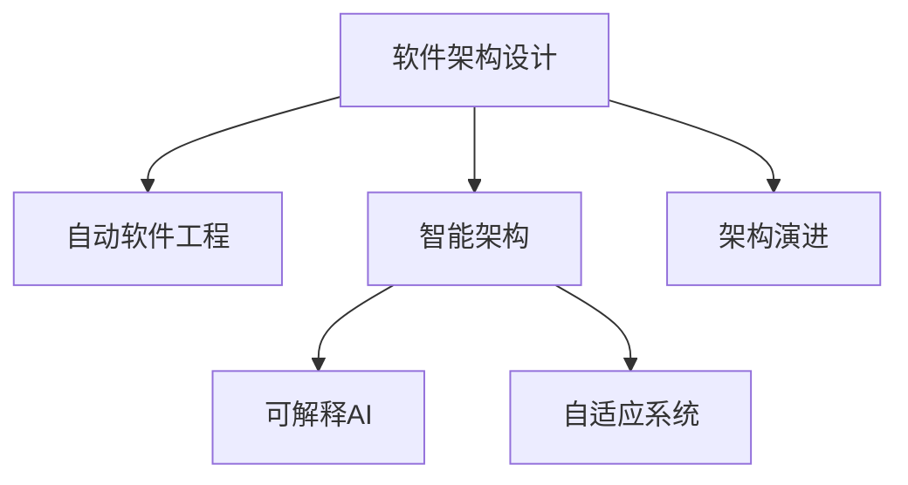

                 

## 1. 背景介绍

随着软件行业的快速发展和云计算、人工智能等新技术的不断涌现，软件架构设计的重要性日益凸显。良好的软件架构不仅能提升系统的性能、可靠性和可维护性，还能加速应用开发，降低后续运维成本。然而，面对日益复杂多变的业务需求，如何设计出高效、可扩展、易维护的软件架构，一直是软件工程师和架构师面临的巨大挑战。

AI技术的快速发展，为软件架构设计提供了新的思路和工具。通过借助AI的预测、优化、自适应等能力，软件架构设计可以更加自动化、智能化，从而实现更高效的解决方案。本文旨在探讨如何利用AI技术辅助软件架构设计与优化，帮助开发者在复杂多变的场景中设计出更加高效、灵活、稳定的软件系统。

## 2. 核心概念与联系

### 2.1 核心概念概述

为更好地理解AI辅助的软件架构设计与优化方法，本节将介绍几个密切相关的核心概念：

- **软件架构设计**：指通过规划和设计系统组件的组织结构、数据流、接口等，满足业务需求并提升系统性能。
- **自动软件工程(AutoSE)**：利用AI技术，实现软件架构的自动化设计、优化和评估，提升设计效率和设计质量。
- **智能架构**：结合AI技术和人工经验，形成能自适应环境变化、自我修复的软件架构。
- **可解释AI(Explainable AI)**：使AI模型具备可解释性，帮助理解其决策过程，提升系统的透明度和可控性。
- **自适应系统**：指能通过监控和反馈机制自动调整自身行为的系统，提升系统的响应速度和鲁棒性。
- **架构演进**：指通过自动化的优化和重构，不断调整和改进软件架构，适应新需求和环境变化。

这些核心概念之间的逻辑关系可以通过以下Mermaid流程图来展示：



这个流程图展示了大语言模型的核心概念及其之间的关系：

1. 软件架构设计是基础，利用AI技术可以辅助自动化。
2. 智能架构和自适应系统可以进一步提升系统灵活性和鲁棒性。
3. 可解释AI可以帮助理解系统的决策过程，提升系统的透明性和可控性。
4. 架构演进可以持续改进软件架构，适应新需求和环境变化。

## 3. 核心算法原理 & 具体操作步骤

### 3.1 算法原理概述

利用AI辅助软件架构设计与优化，本质上是将AI的预测、优化、自适应等能力融入到软件架构的各个环节中。其核心思想是：通过数据分析和模型训练，预测系统在不同场景下的性能表现，识别性能瓶颈和改进点，自动生成和优化软件架构方案。

形式化地，假设待设计或优化的软件架构为 $\mathcal{A}$，设计目标为 $O$，性能指标为 $M$。则设计优化的目标是最小化性能指标，即：

$$
\mathcal{A}^* = \mathop{\arg\min}_{\mathcal{A}} M(\mathcal{A}, O)
$$

其中 $M(\mathcal{A}, O)$ 表示在目标 $O$ 下，架构 $\mathcal{A}$ 的性能指标。

AI辅助设计的过程通常包括以下几个步骤：

1. **数据采集**：收集系统历史运行数据，提取影响性能的关键指标。
2. **模型训练**：基于采集到的数据，训练机器学习模型预测系统性能，生成架构优化建议。
3. **方案生成**：自动生成多种架构方案，并基于模型预测性能进行排序。
4. **方案评估**：评估每种方案的性能指标，选择最优方案。
5. **方案部署**：部署选定的架构方案，监控系统性能，持续优化。

### 3.2 算法步骤详解

基于AI的软件架构设计与优化，一般包括以下关键步骤：

**Step 1: 数据采集与预处理**
- 收集系统运行的历史数据，包括但不限于代码结构、模块依赖、调用关系、资源消耗等。
- 对数据进行清洗、归一化、特征提取等预处理，为后续模型训练做准备。

**Step 2: 模型训练与优化**
- 选择合适的机器学习模型，如回归模型、决策树、神经网络等，训练预测系统性能。
- 设置模型参数和超参数，如学习率、正则化强度、隐层神经元数量等。
- 使用交叉验证、网格搜索等方法优化模型性能，减少过拟合风险。

**Step 3: 方案生成与评估**
- 基于模型预测性能，自动生成多种架构方案。
- 对每种方案进行性能评估，考虑指标如响应时间、吞吐量、资源利用率等。
- 通过比对评估结果，选择最优方案。

**Step 4: 方案部署与监控**
- 部署选定的架构方案，监控系统性能，获取实时反馈数据。
- 根据反馈数据，进一步优化架构方案，形成新的预测模型。
- 循环迭代，持续提升系统性能。

### 3.3 算法优缺点

利用AI辅助软件架构设计与优化的算法，具有以下优点：

1. **自动化设计**：通过模型预测和方案生成，自动完成架构设计和优化，减少人为干预。
2. **性能提升**：利用大数据和先进算法，能够挖掘系统性能瓶颈，优化架构设计，提升系统性能。
3. **效率提高**：自动化设计和优化过程减少了人工调试和优化的时间，提升开发和优化效率。
4. **灵活性增强**：自动化的优化过程可以实时响应环境变化，提升系统的灵活性和鲁棒性。

同时，该方法也存在一些局限性：

1. **数据依赖性强**：AI辅助设计的效果很大程度上依赖于数据的质量和完备性，获取高质量数据成本较高。
2. **模型泛化能力**：模型的泛化能力不足，面对新场景或新问题，预测效果可能不理想。
3. **模型复杂度高**：训练和优化模型本身需要大量计算资源，成本较高。
4. **解释性不足**：AI模型的决策过程难以解释，难以理解其内部工作机制。
5. **安全性问题**：依赖于数据的AI系统可能面临数据泄露和隐私保护问题。

尽管存在这些局限性，但就目前而言，利用AI辅助设计的方法仍是提升软件架构设计和优化效率的重要手段。未来相关研究的重点在于如何进一步降低数据依赖，提高模型的泛化能力，同时兼顾可解释性和伦理安全性等因素。

### 3.4 算法应用领域

利用AI辅助软件架构设计与优化的方法，已经在软件开发和系统优化等多个领域得到了广泛应用，具体包括：

- **软件自动化测试**：利用机器学习预测测试用例的覆盖率和效果，生成自动化的测试方案。
- **代码生成与重构**：基于模型预测代码的质量和可维护性，自动生成或重构代码，提升开发效率。
- **微服务架构优化**：对微服务架构进行性能预测和方案优化，提升服务之间的协同和效率。
- **容器编排与调度**：通过AI预测容器的资源需求和调度策略，优化容器编排和资源利用。
- **大数据架构设计**：结合机器学习模型和大数据技术，设计高效的大数据处理架构。
- **云计算平台优化**：利用AI技术对云资源进行预测和优化，提升云平台的性能和成本效益。

除了上述这些经典应用外，AI辅助设计的方法还在更多场景中得到应用，如系统安全加固、应用性能监控、智能运维等，为软件系统的自动化设计和优化提供了新的方向。随着AI技术的不断发展，相信利用AI辅助设计的方法将在更多领域得到应用，进一步推动软件工程的智能化发展。

## 4. 数学模型和公式 & 详细讲解

### 4.1 数学模型构建

本节将使用数学语言对利用AI辅助软件架构设计与优化过程进行更加严格的刻画。

记待优化的软件架构为 $\mathcal{A}$，设计目标为 $O$，性能指标为 $M$。假设系统运行的历史数据为 $\{(x_i, y_i)\}_{i=1}^N$，其中 $x_i$ 表示输入（如模块依赖关系、调用链等），$y_i$ 表示输出（如响应时间、资源消耗等）。

定义性能指标函数 $M(\mathcal{A}, O)$ 为：

$$
M(\mathcal{A}, O) = \frac{1}{N} \sum_{i=1}^N |y_i - f(x_i, \mathcal{A}, O)|
$$

其中 $f(x_i, \mathcal{A}, O)$ 表示在架构 $\mathcal{A}$ 下，输入 $x_i$ 对应的系统响应。

AI辅助设计的过程可以通过构建预测模型 $F(\mathcal{A}, O)$ 来实现。预测模型 $F(\mathcal{A}, O)$ 的训练目标是最小化预测误差：

$$
\mathop{\arg\min}_{F} \frac{1}{N} \sum_{i=1}^N |y_i - F(x_i, \mathcal{A}, O)|
$$

一旦预测模型 $F(\mathcal{A}, O)$ 训练完成，即可基于模型预测生成多种架构方案，并进行评估。

### 4.2 公式推导过程

以下我们以响应时间预测为例，推导机器学习模型（如线性回归模型）的训练和预测过程。

假设响应时间 $y_i$ 与模块依赖关系 $x_i$ 之间存在线性关系，预测模型为：

$$
y_i = f(x_i, \mathcal{A}, O) = \mathbf{w}^T \mathbf{x}_i + b
$$

其中 $\mathbf{w}$ 为权重向量，$b$ 为偏置项。模型训练的目标是最小化预测误差：

$$
\mathop{\arg\min}_{\mathbf{w}, b} \frac{1}{N} \sum_{i=1}^N (y_i - f(x_i, \mathcal{A}, O))^2
$$

利用梯度下降等优化算法求解上述目标函数，得到最优权重向量 $\mathbf{w}^*$ 和偏置项 $b^*$。预测响应时间时，输入新的模块依赖关系 $x$，得到预测响应时间 $y^* = \mathbf{w}^T \mathbf{x} + b^*$。

### 4.3 案例分析与讲解

以一个简单的API调用网络为例，假设网络中包含3个模块 $A$、$B$、$C$，模块间依赖关系为 $A \rightarrow B \rightarrow C$。根据以往数据，我们发现模块 $A$ 对响应时间的影响最大，模块 $C$ 对响应时间的影响最小。

为了优化网络响应时间，我们可以利用AI模型对不同模块位置和数量的组合进行预测和评估。例如，当将模块 $A$ 和 $B$ 互换位置时，模型的预测响应时间降低了5%。基于这种模型预测结果，我们可以快速生成多种架构方案，并进行评估和选择。

## 5. 项目实践：代码实例和详细解释说明

### 5.1 开发环境搭建

在进行AI辅助软件架构设计与优化实践前，我们需要准备好开发环境。以下是使用Python进行TensorFlow开发的环境配置流程：

1. 安装Anaconda：从官网下载并安装Anaconda，用于创建独立的Python环境。

2. 创建并激活虚拟环境：
```bash
conda create -n tf-env python=3.8 
conda activate tf-env
```

3. 安装TensorFlow：根据CUDA版本，从官网获取对应的安装命令。例如：
```bash
conda install tensorflow -c conda-forge
```

4. 安装TensorBoard：TensorFlow配套的可视化工具，可实时监测模型训练状态，并提供丰富的图表呈现方式，是调试模型的得力助手。
```bash
conda install tensorboard
```

5. 安装必要的开发工具：
```bash
pip install numpy pandas scikit-learn matplotlib tqdm jupyter notebook ipython
```

完成上述步骤后，即可在`tf-env`环境中开始实践。

### 5.2 源代码详细实现

下面我们以预测API调用响应时间为示例，给出使用TensorFlow进行性能预测的PyTorch代码实现。

首先，定义模型：

```python
import tensorflow as tf

model = tf.keras.Sequential([
    tf.keras.layers.Dense(32, activation='relu', input_shape=(3,)),
    tf.keras.layers.Dense(1)
])
```

然后，定义数据集和性能指标：

```python
dataset = tf.data.Dataset.from_tensor_slices((x_train, y_train)).batch(32)

mse = tf.keras.losses.MeanSquaredError()
optimizer = tf.keras.optimizers.Adam()
```

接着，定义训练和评估函数：

```python
@tf.function
def train_step(x, y):
    with tf.GradientTape() as tape:
        y_pred = model(x)
        loss = mse(y_pred, y)
    grads = tape.gradient(loss, model.trainable_variables)
    optimizer.apply_gradients(zip(grads, model.trainable_variables))
    return loss

@tf.function
def evaluate_step(x, y):
    y_pred = model(x)
    loss = mse(y_pred, y)
    return loss
```

最后，启动训练流程并在测试集上评估：

```python
epochs = 100
batch_size = 32

for epoch in range(epochs):
    total_loss = 0
    for batch in dataset:
        x_batch, y_batch = batch
        loss = train_step(x_batch, y_batch)
        total_loss += loss

    print(f"Epoch {epoch+1}, training loss: {total_loss/len(dataset)}")

print(f"Epoch {epoch+1}, test loss: {evaluate_step(x_test, y_test).numpy()}")
```

以上就是使用TensorFlow进行性能预测的完整代码实现。可以看到，TensorFlow提供了强大的工具和接口，使得模型训练和性能预测的过程变得简洁高效。

### 5.3 代码解读与分析

让我们再详细解读一下关键代码的实现细节：

**定义模型**：
- 使用TensorFlow的Sequential模型，定义包含两个全连接层的神经网络。

**定义数据集**：
- 使用from_tensor_slices方法将数据集转换为TensorFlow数据集，并进行批处理。

**定义性能指标**：
- 使用MeanSquaredError作为性能指标，用于衡量预测值与真实值之间的差距。

**训练和评估函数**：
- 使用tf.function装饰函数，利用TensorFlow的图编译技术提升运行效率。
- 在训练函数中，使用GradientTape记录梯度，并使用Adam优化器更新模型参数。
- 在评估函数中，直接计算预测值与真实值之间的误差，返回评估结果。

**训练流程**：
- 循环迭代epoch，在每个epoch中对整个数据集进行训练。
- 计算每个epoch的平均训练损失。
- 在训练完成后，对测试集进行评估，输出测试损失。

## 6. 实际应用场景

### 6.1 智能编排与调度

利用AI辅助设计的方法，可以对云计算平台进行智能编排和调度，提升资源利用率和系统性能。

在实践中，可以收集容器编排的历史数据，包括容器实例数、资源需求、调度策略等。在此基础上训练机器学习模型，预测不同容器编排方案的资源利用率和调度效率。模型训练完成后，系统根据实时负载数据自动生成和优化容器编排方案，从而实现智能编排和调度。

例如，当某应用负载突增时，AI系统能够自动检测并调整资源分配策略，避免资源浪费和性能瓶颈。这种智能编排和调度方法，能够有效提升云计算平台的资源利用率和应用性能。

### 6.2 应用程序性能监控

利用AI辅助设计的方法，可以对应用性能进行实时监控和预测，帮助开发者快速定位和解决问题。

在实践中，可以收集应用运行的历史数据，包括请求处理时间、响应时间、错误率等。在此基础上训练机器学习模型，预测应用在不同负载和环境下的性能表现。模型训练完成后，系统根据实时负载数据进行性能预测，并生成性能瓶颈报告。

例如，当某应用响应时间异常升高时，AI系统能够快速定位问题节点，并提出优化建议，帮助开发者快速解决问题。这种基于AI的应用性能监控方法，能够大幅提升应用运维效率和问题处理速度。

### 6.3 自动化测试与优化

利用AI辅助设计的方法，可以对测试用例进行智能生成和优化，提升测试覆盖率和测试效率。

在实践中，可以收集测试用例的历史数据，包括测试结果、用例覆盖率、执行时间等。在此基础上训练机器学习模型，预测不同测试用例组合的覆盖率和执行效率。模型训练完成后，系统根据测试需求自动生成和优化测试用例，从而实现自动化测试。

例如，当某应用新增功能时，AI系统能够自动生成覆盖新功能的测试用例，并优化测试流程，提升测试覆盖率和测试效率。这种基于AI的自动化测试方法，能够大幅提升应用开发和测试效率。

### 6.4 未来应用展望

随着AI技术的不断发展，利用AI辅助设计的方法将在更多领域得到应用，为软件开发和系统优化提供新的思路。

在智慧城市治理中，利用AI技术对交通流量进行实时监控和预测，智能调整交通信号灯，提升道路通行效率和安全性。

在智能制造中，利用AI技术对生产设备进行性能预测和优化，提升生产效率和设备利用率。

在医疗系统中，利用AI技术对患者数据进行预测和分析，辅助医生进行诊断和治疗，提升医疗服务质量。

此外，在教育、金融、农业等众多领域，利用AI辅助设计的方法也将不断涌现，为各行各业带来新的突破。相信随着AI技术的日益成熟，利用AI辅助设计的方法必将在软件开发和系统优化中发挥更大的作用，推动人工智能技术的广泛应用。

## 7. 工具和资源推荐

### 7.1 学习资源推荐

为了帮助开发者系统掌握AI辅助软件架构设计与优化理论基础和实践技巧，这里推荐一些优质的学习资源：

1. 《深度学习》系列书籍：由著名深度学习专家Ian Goodfellow、Yoshua Bengio、Aaron Courville合著，系统介绍了深度学习的原理和应用。
2. Coursera《机器学习》课程：斯坦福大学开设的著名课程，涵盖机器学习的基本理论和实际应用，适合初学者入门。
3. Kaggle竞赛平台：通过参与开源数据集竞赛，提升数据处理和机器学习建模能力，实战经验丰富。
4. GitHub开源项目：通过学习开源项目代码，理解实际应用中的架构设计和优化方法。
5. TensorFlow官方文档：提供了全面的API文档和教程，适合深入学习TensorFlow模型构建和训练。

通过对这些资源的学习实践，相信你一定能够快速掌握AI辅助设计的方法，并用于解决实际的软件开发和系统优化问题。

### 7.2 开发工具推荐

高效的开发离不开优秀的工具支持。以下是几款用于AI辅助软件架构设计与优化的常用工具：

1. TensorFlow：由Google主导开发的开源深度学习框架，生产部署方便，适合大规模工程应用。
2. PyTorch：基于Python的开源深度学习框架，灵活动态的计算图，适合快速迭代研究。
3. Jupyter Notebook：基于Web的交互式编程环境，支持多种语言和工具，方便快速实验和迭代。
4. Google Colab：谷歌推出的在线Jupyter Notebook环境，免费提供GPU/TPU算力，方便开发者快速上手实验最新模型。
5. Visual Studio Code：功能强大的编程IDE，支持多种语言和工具集，适合集成开发环境。
6. Jenkins：开源的自动化部署和持续集成工具，适合企业级应用部署和管理。

合理利用这些工具，可以显著提升AI辅助设计任务的开发效率，加快创新迭代的步伐。

### 7.3 相关论文推荐

AI辅助软件架构设计与优化技术的发展源于学界的持续研究。以下是几篇奠基性的相关论文，推荐阅读：

1. "An AI-Driven Dynamic Software Architecture Evolution Approach"：介绍了AI技术在动态软件架构演进中的应用。
2. "Predictive Analytics for Software Architecture Evaluation"：探讨了如何利用机器学习预测软件架构的性能和风险。
3. "Automated Design of Software Architectures"：综述了自动化软件架构设计的最新进展和挑战。
4. "Soft Architecture Design for Cloud Computing"：介绍了利用AI技术对云计算平台进行优化和设计的方法。
5. "Automated Testing and Debugging of Distributed Systems"：介绍了如何利用AI技术对分布式系统进行自动化测试和调试。

这些论文代表了大语言模型微调技术的发展脉络。通过学习这些前沿成果，可以帮助研究者把握学科前进方向，激发更多的创新灵感。

## 8. 总结：未来发展趋势与挑战

### 8.1 研究成果总结

本文对利用AI辅助软件架构设计与优化的技术进行了全面系统的介绍。首先阐述了AI辅助设计在软件架构优化中的重要性，明确了其通过AI预测、优化、自适应等能力，实现更高效、更智能的架构设计的独特价值。其次，从原理到实践，详细讲解了AI辅助设计的过程，包括数据采集、模型训练、方案生成、方案评估和方案部署等关键步骤，给出了具体的代码实例和分析。同时，本文还广泛探讨了AI辅助设计方法在智能编排、性能监控、自动化测试等多个领域的应用前景，展示了其在软件开发和系统优化中的巨大潜力。

通过本文的系统梳理，可以看到，利用AI辅助设计的方法正在成为软件开发和系统优化中的重要工具。这些方法能够自动完成预测和优化过程，提升设计效率和设计质量，减轻人工干预负担，加速应用开发和系统优化进程。未来，伴随AI技术的进一步发展和普及，利用AI辅助设计的方法必将在更多领域得到应用，进一步推动软件工程的智能化发展。

### 8.2 未来发展趋势

展望未来，利用AI辅助设计的方法将呈现以下几个发展趋势：

1. **智能化程度提升**：随着深度学习模型的不断发展，AI辅助设计将更加智能化，能够处理更复杂的数据和场景。
2. **自适应能力增强**：利用AI技术实现架构的自适应调整，能够快速响应环境变化，提升系统的灵活性和鲁棒性。
3. **多模态融合**：结合文本、图像、视频等多种数据源，实现更全面、更准确的性能预测和方案生成。
4. **人机协同设计**：利用AI和人类专家的协同工作，提升设计质量和效率，实现更好的设计结果。
5. **持续学习机制**：通过持续学习机制，系统能够不断更新和优化，适应新需求和环境变化。
6. **自动化优化**：结合自动化测试、优化工具，实现从设计到部署的全链路自动化，提升整体开发效率。

这些趋势凸显了利用AI辅助设计方法的广阔前景。这些方向的探索发展，必将进一步提升软件系统的性能和可维护性，为软件开发和系统优化带来新的突破。

### 8.3 面临的挑战

尽管利用AI辅助设计的方法已经取得了显著进展，但在迈向更加智能化、普适化应用的过程中，它仍面临诸多挑战：

1. **数据依赖性强**：AI辅助设计的效果很大程度上依赖于数据的质量和完备性，获取高质量数据成本较高。
2. **模型泛化能力不足**：模型的泛化能力不足，面对新场景或新问题，预测效果可能不理想。
3. **模型复杂度高**：训练和优化模型本身需要大量计算资源，成本较高。
4. **解释性不足**：AI模型的决策过程难以解释，难以理解其内部工作机制。
5. **安全性问题**：依赖于数据的AI系统可能面临数据泄露和隐私保护问题。

尽管存在这些局限性，但就目前而言，利用AI辅助设计的方法仍是提升软件架构设计和优化效率的重要手段。未来相关研究的重点在于如何进一步降低数据依赖，提高模型的泛化能力，同时兼顾可解释性和伦理安全性等因素。

### 8.4 研究展望

面对利用AI辅助设计所面临的种种挑战，未来的研究需要在以下几个方面寻求新的突破：

1. **探索无监督和半监督设计方法**：摆脱对大规模标注数据的依赖，利用自监督学习、主动学习等无监督和半监督范式，最大限度利用非结构化数据，实现更加灵活高效的架构设计。
2. **研究多模态融合方法**：结合文本、图像、视频等多种数据源，实现更全面、更准确的性能预测和方案生成。
3. **引入更多先验知识**：将符号化的先验知识，如知识图谱、逻辑规则等，与神经网络模型进行巧妙融合，引导设计过程学习更准确、合理的架构设计。
4. **结合因果分析和博弈论工具**：将因果分析方法引入架构设计，识别出设计决策的关键特征，增强设计结果的因果性和逻辑性。借助博弈论工具刻画人机交互过程，主动探索并规避设计的脆弱点，提高系统稳定性。
5. **纳入伦理道德约束**：在架构设计目标中引入伦理导向的评估指标，过滤和惩罚有偏见、有害的设计方案，确保设计过程和结果符合人类价值观和伦理道德。

这些研究方向的探索，必将引领利用AI辅助设计的方法迈向更高的台阶，为构建安全、可靠、可解释、可控的智能系统铺平道路。面向未来，利用AI辅助设计的方法还需要与其他人工智能技术进行更深入的融合，如知识表示、因果推理、强化学习等，多路径协同发力，共同推动自然语言理解和智能交互系统的进步。只有勇于创新、敢于突破，才能不断拓展架构设计的边界，让智能技术更好地造福人类社会。

## 9. 附录：常见问题与解答

**Q1：如何选择合适的AI辅助设计工具？**

A: 选择合适的AI辅助设计工具需要考虑以下几个方面：
1. 工具的易用性和文档完备性：工具是否易于上手，文档是否详细，能否快速解决问题。
2. 工具的计算能力和资源支持：工具是否支持高效的计算资源（如GPU、TPU），是否能提供足够的计算资源支持。
3. 工具的扩展性和可定制性：工具是否支持模块化设计，是否易于扩展和定制，能否满足特定需求。
4. 工具的社区支持和活跃度：工具是否有活跃的社区支持，是否能获取最新的功能和更新。
5. 工具的稳定性与可靠性：工具是否稳定可靠，是否支持高可用性和高可扩展性。

综合考虑以上因素，选择合适的AI辅助设计工具。

**Q2：AI辅助设计在架构优化的过程中有哪些具体步骤？**

A: AI辅助设计在架构优化的过程中一般包括以下具体步骤：
1. 数据采集：收集系统运行的历史数据，提取影响性能的关键指标。
2. 模型训练：选择合适的机器学习模型，如回归模型、决策树、神经网络等，训练预测系统性能。
3. 方案生成：基于模型预测性能，自动生成多种架构方案。
4. 方案评估：对每种方案进行性能评估，考虑指标如响应时间、吞吐量、资源利用率等。
5. 方案部署：部署选定的架构方案，监控系统性能，持续优化。

**Q3：AI辅助设计在实际应用中需要注意哪些问题？**

A: AI辅助设计在实际应用中需要注意以下几个问题：
1. 数据质量：获取高质量的数据是AI辅助设计的前提，数据清洗和预处理是关键步骤。
2. 模型泛化：AI模型需要具有良好的泛化能力，能够处理新场景和数据。
3. 可解释性：AI模型的决策过程需要具备可解释性，方便理解和调试。
4. 安全性：依赖于数据的AI系统需要考虑数据泄露和隐私保护问题，确保系统安全。
5. 模型效率：AI模型的训练和优化需要考虑计算资源和时间成本，确保模型高效运行。
6. 系统鲁棒性：AI辅助设计需要考虑系统的鲁棒性和容错能力，确保系统稳定可靠。

这些问题的解决需要结合实际应用场景，不断优化和改进AI辅助设计方法。

**Q4：AI辅助设计在性能优化中的优势是什么？**

A: AI辅助设计在性能优化中的优势包括：
1. 自动化预测和优化：AI技术能够自动化预测系统性能，自动优化架构设计，减少人工干预。
2. 快速迭代：AI辅助设计能够快速迭代和优化，提升开发和优化效率。
3. 实时监控：AI技术能够实时监控系统性能，快速定位和解决问题。
4. 多场景适用：AI辅助设计能够适应不同场景和需求，提升系统灵活性和鲁棒性。
5. 数据驱动：AI辅助设计依赖于数据驱动，能够根据实际数据优化系统。
6. 智能决策：AI辅助设计能够利用智能算法和模型，提升决策的科学性和准确性。

这些优势使得AI辅助设计在性能优化中具备显著的竞争力和优势。

**Q5：AI辅助设计在架构演进中的应用场景有哪些？**

A: AI辅助设计在架构演进中的应用场景包括：
1. 系统负载优化：利用AI预测系统负载，智能调整资源分配，优化系统性能。
2. 应用故障预测：利用AI预测应用故障，提前进行维护，避免故障影响业务。
3. 应用迁移和重构：利用AI预测应用迁移和重构的收益和风险，辅助决策。
4. 系统重构优化：利用AI评估系统重构方案，选择最优方案，优化系统结构。
5. 应用架构演变：利用AI预测应用架构演变趋势，辅助设计未来架构。

这些应用场景展示了AI辅助设计在架构演进中的广泛应用，能够提升系统性能和可维护性。

---

作者：禅与计算机程序设计艺术 / Zen and the Art of Computer Programming

