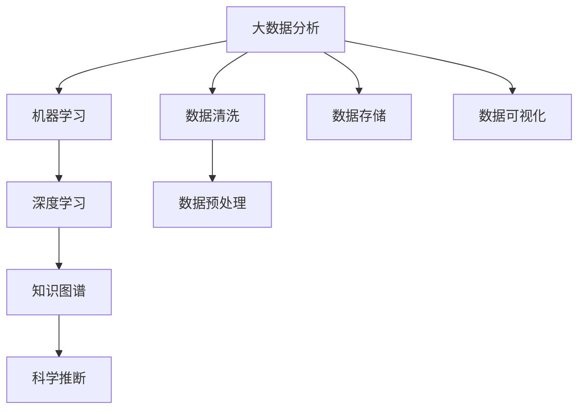

                 

# AI辅助科研：加速科学发现的新范式

> 关键词：人工智能,科研加速,科学发现,数据分析,机器学习,深度学习,知识图谱,科学推断

## 1. 背景介绍

### 1.1 问题由来
科学研究的本质是探索未知，揭示自然规律。然而，传统的科研方法往往依赖于人类智慧和经验，面对复杂、多维的科学问题，耗时长、成本高、效率低。随着人工智能（AI）技术的迅猛发展，越来越多的科研机构和学者开始探索将AI技术融入科研，通过智能化工具加速科学发现，提升科研效率，推动科学进步。

### 1.2 问题核心关键点
AI辅助科研的核心在于利用大数据分析和机器学习、深度学习等前沿技术，挖掘数据中的隐含信息和规律，提出科学假设，进行科学推断，加速科学发现。具体而言，AI在科研中的应用主要体现在以下几个方面：

1. **数据分析与处理**：通过自动化数据清洗和预处理，利用大数据分析技术挖掘数据中的潜在信息。
2. **科学假设生成**：通过统计分析和机器学习模型，生成科学假设并预测未来科学发现。
3. **科学推断验证**：利用知识图谱和推理引擎，验证假设，提供证据支持。
4. **科研辅助决策**：提供数据驱动的决策建议，帮助科研人员做出更准确的科研规划。
5. **科学可视化**：利用图形界面和互动技术，展示复杂数据和分析结果，增强科研的可理解性和可操作性。

### 1.3 问题研究意义
AI辅助科研的实践，对于提升科研效率、降低研究成本、推动科学进步具有重要意义：

1. **加速科研进程**：通过自动化和智能化的数据分析与处理，显著缩短科研周期，快速迭代科研思路。
2. **降低研究成本**：减少人力物力投入，降低数据处理和计算成本，使更多资金投入到创新研究中。
3. **提高科研质量**：通过AI的深度学习和大数据分析能力，发现新的科学规律，提出创新假设，提升科研工作的质量和深度。
4. **拓展科研边界**：AI技术能够处理海量数据和复杂问题，帮助科研人员突破传统思维限制，发现新的研究方向和可能性。
5. **提升科研可理解性**：通过可视化工具，使复杂科研过程和结果更加直观，便于沟通和分享。

## 2. 核心概念与联系

### 2.1 核心概念概述

为更好地理解AI辅助科研方法，本节将介绍几个密切相关的核心概念：

- **人工智能（AI）**：利用计算机技术和算法，使计算机具备人类智能的某些能力，如学习、推理、决策等。
- **大数据分析**：通过先进的数据处理技术和算法，从大规模数据中提取有价值的信息和知识。
- **机器学习**：一种数据驱动的算法，通过学习历史数据，预测未来结果或提取数据中的规律。
- **深度学习**：一种神经网络架构，模拟人脑处理信息的方式，能够处理非线性、高维度数据。
- **知识图谱**：一种表示知识的关系型数据结构，用于描述实体、关系和属性之间的复杂网络。
- **科学推断**：通过逻辑推理和统计分析，验证科学假设，推断新的科学结论。

这些核心概念之间的逻辑关系可以通过以下Mermaid流程图来展示：



这个流程图展示了大数据分析、机器学习、深度学习、知识图谱和科学推断之间的相互关系：

1. 大数据分析通过数据清洗和预处理，为机器学习和深度学习提供高质量数据。
2. 机器学习和深度学习从数据中学习规律，提供数据驱动的科学假设。
3. 知识图谱用于表示和组织数据中的实体关系，支持科学推断。
4. 科学推断通过逻辑推理和统计分析，验证假设，推断新的科学结论。

## 3. 核心算法原理 & 具体操作步骤
### 3.1 算法原理概述

AI辅助科研的算法原理主要基于机器学习和深度学习技术，利用大数据分析和知识图谱技术，构建数据驱动的科学发现模型。其核心思想是通过自动化和智能化的数据分析与处理，生成科学假设，验证假设，加速科学发现。

形式化地，假设有一组实验数据 $D=\{(x_i, y_i)\}_{i=1}^N$，其中 $x_i$ 为实验条件，$y_i$ 为实验结果。目标是找到一个函数 $f(x)$，使得 $y_i = f(x_i)$。通过机器学习和深度学习技术，模型可以自动学习 $f(x)$ 的参数，并泛化到新数据上。

### 3.2 算法步骤详解

AI辅助科研的算法步骤一般包括以下几个关键环节：

**Step 1: 数据准备与预处理**
- 收集实验数据，并进行清洗和预处理。
- 将数据划分为训练集、验证集和测试集。
- 应用数据增强技术，如噪声注入、变换扩充等，丰富训练集。

**Step 2: 选择模型与训练**
- 根据任务特点，选择合适的机器学习或深度学习模型。
- 利用训练集数据，使用梯度下降等优化算法训练模型。
- 应用正则化技术，如L2正则、Dropout、Early Stopping等，防止过拟合。
- 使用交叉验证技术，评估模型性能，选择最优模型。

**Step 3: 假设生成与验证**
- 利用训练好的模型，生成科学假设。
- 应用知识图谱技术，验证假设的合理性。
- 使用科学推断技术，验证假设的正确性。

**Step 4: 结果解释与迭代**
- 对结果进行可视化展示，增强可理解性。
- 分析结果，提出新的科学假设。
- 重复上述步骤，迭代优化。

### 3.3 算法优缺点

AI辅助科研的算法具有以下优点：
1. 加速科研进程。通过自动化和智能化的数据分析与处理，显著缩短科研周期。
2. 提高科研质量。利用大数据分析和深度学习技术，发现新的科学规律，提出创新假设。
3. 降低研究成本。减少人力物力投入，降低数据处理和计算成本。
4. 提升科研可理解性。通过可视化工具，使复杂科研过程和结果更加直观，便于沟通和分享。

同时，该算法也存在一定的局限性：
1. 依赖高质量数据。算法的性能很大程度上取决于数据的质量和数量，高质量数据的获取成本较高。
2. 模型复杂度较高。深度学习模型通常需要大量计算资源，对硬件要求较高。
3. 可解释性不足。模型的决策过程通常缺乏可解释性，难以对其推理逻辑进行分析和调试。
4. 可能引入偏差。机器学习模型可能会学习到数据中的偏差和噪声，影响结果的可靠性。

尽管存在这些局限性，但就目前而言，AI辅助科研的算法仍是最主流的研究范式。未来相关研究的重点在于如何进一步降低算法对数据的要求，提高模型的少样本学习和跨领域迁移能力，同时兼顾可解释性和伦理安全性等因素。

### 3.4 算法应用领域

AI辅助科研的算法已经在诸多科学领域得到了应用，包括：

- 生物医学：利用机器学习分析基因数据，发现新药靶点和疾病机制。
- 环境科学：通过大数据分析，监测气候变化和环境污染。
- 天文学：应用深度学习技术，分析观测数据，发现新星系和黑洞。
- 化学与材料科学：利用知识图谱和科学推断，预测分子结构和反应路径。
- 社会科学：通过文本分析和情感分析，研究人类行为和社会现象。
- 物理学：应用机器学习技术，模拟和预测物理现象。

除了上述这些经典领域外，AI辅助科研的方法也在不断拓展到更多场景中，如智能制造、智能交通、智能能源等，为科学研究和技术创新带来新的突破。

## 4. 数学模型和公式 & 详细讲解 & 举例说明

### 4.1 数学模型构建

本节将使用数学语言对AI辅助科研的算法进行更加严格的刻画。

假设有一组实验数据 $D=\{(x_i, y_i)\}_{i=1}^N$，其中 $x_i \in \mathcal{X}$，$y_i \in \mathcal{Y}$。定义模型 $f(x)$ 的损失函数为 $L(f)$，表示模型预测值与真实值之间的差异。模型的目标是最小化损失函数：

$$
\min_{f} L(f) = \sum_{i=1}^N L(f(x_i), y_i)
$$

其中 $L(f(x_i), y_i)$ 表示模型在数据点 $(x_i, y_i)$ 上的损失。常见的损失函数包括均方误差、交叉熵损失等。

### 4.2 公式推导过程

以下我们以均方误差损失函数为例，推导机器学习模型的训练过程。

假设模型 $f(x)$ 为线性回归模型，形式为 $f(x) = \theta_0 + \sum_{i=1}^n \theta_i x_i$。其中 $\theta = (\theta_0, \theta_1, \dots, \theta_n)$ 为模型参数。均方误差损失函数为：

$$
L(f) = \frac{1}{2N} \sum_{i=1}^N (y_i - f(x_i))^2
$$

为了最小化损失函数，应用梯度下降算法，对模型参数 $\theta$ 进行优化：

$$
\theta_{k+1} = \theta_k - \eta \nabla_{\theta}L(f)
$$

其中 $\eta$ 为学习率，$\nabla_{\theta}L(f)$ 为损失函数对参数 $\theta$ 的梯度，可通过反向传播算法高效计算。

### 4.3 案例分析与讲解

**案例：基因组数据分析**

在生物医学领域，基因组数据分析是一个典型的AI辅助科研应用。通过对海量基因序列数据的分析，科学家们试图揭示基因与疾病之间的关系，发现新的药物靶点。

具体而言，可以收集大量的基因表达数据和疾病标签，利用机器学习模型（如随机森林、支持向量机等）对数据进行训练，生成疾病与基因表达的关系模型。然后，利用知识图谱技术，构建基因与疾病之间的关联网络，验证模型的合理性。最后，通过科学推断技术，预测新的基因与疾病的关系，发现潜在的药物靶点。

这个案例展示了AI辅助科研的完整流程：数据准备、模型训练、假设验证、结果解释与迭代。

## 5. 项目实践：代码实例和详细解释说明
### 5.1 开发环境搭建

在进行AI辅助科研实践前，我们需要准备好开发环境。以下是使用Python进行TensorFlow开发的环境配置流程：

1. 安装Anaconda：从官网下载并安装Anaconda，用于创建独立的Python环境。

2. 创建并激活虚拟环境：
```bash
conda create -n tf-env python=3.7
conda activate tf-env
```

3. 安装TensorFlow：根据CUDA版本，从官网获取对应的安装命令。例如：
```bash
pip install tensorflow
```

4. 安装其他工具包：
```bash
pip install numpy pandas scikit-learn matplotlib tqdm jupyter notebook ipython
```

完成上述步骤后，即可在`tf-env`环境中开始科研实践。

### 5.2 源代码详细实现

下面我们以基因组数据分析为例，给出使用TensorFlow对随机森林模型进行科研数据分析的PyTorch代码实现。

首先，定义数据处理函数：

```python
import numpy as np
from sklearn.model_selection import train_test_split
from sklearn.ensemble import RandomForestClassifier

class GeneDataLoader(Dataset):
    def __init__(self, gene_data, labels):
        self.gene_data = gene_data
        self.labels = labels
        
    def __len__(self):
        return len(self.gene_data)
    
    def __getitem__(self, index):
        return self.gene_data[index], self.labels[index]
        
def gene_data_loader(data, labels, batch_size=32):
    train_data, test_data, train_labels, test_labels = train_test_split(data, labels, test_size=0.2)
    train_dataset = GeneDataLoader(train_data, train_labels)
    test_dataset = GeneDataLoader(test_data, test_labels)
    
    train_loader = DataLoader(train_dataset, batch_size=batch_size, shuffle=True)
    test_loader = DataLoader(test_dataset, batch_size=batch_size, shuffle=False)
    
    return train_loader, test_loader
```

然后，定义模型和优化器：

```python
from tensorflow.keras.models import Sequential
from tensorflow.keras.layers import Dense
from tensorflow.keras.optimizers import Adam

model = Sequential()
model.add(Dense(64, input_dim=5000, activation='relu'))
model.add(Dense(64, activation='relu'))
model.add(Dense(1, activation='sigmoid'))

optimizer = Adam(learning_rate=0.001)
```

接着，定义训练和评估函数：

```python
from tensorflow.keras.utils import to_categorical
from sklearn.metrics import accuracy_score

def train_model(model, train_loader, optimizer, epochs=10):
    model.compile(optimizer=optimizer, loss='binary_crossentropy', metrics=['accuracy'])
    model.fit(train_loader, epochs=epochs)
    return model

def evaluate_model(model, test_loader):
    test_loss, test_accuracy = model.evaluate(test_loader)
    return test_loss, test_accuracy
```

最后，启动训练流程并在测试集上评估：

```python
train_loader, test_loader = gene_data_loader(gene_data, labels)

model = train_model(model, train_loader, optimizer)
test_loss, test_accuracy = evaluate_model(model, test_loader)

print(f'Test loss: {test_loss:.4f}')
print(f'Test accuracy: {test_accuracy:.4f}')
```

以上就是使用TensorFlow对随机森林模型进行基因组数据分析的完整代码实现。可以看到，TensorFlow提供了强大的API，方便开发者快速搭建和训练模型。

### 5.3 代码解读与分析

让我们再详细解读一下关键代码的实现细节：

**GeneDataLoader类**：
- `__init__`方法：初始化基因数据和标签。
- `__len__`方法：返回数据集的样本数量。
- `__getitem__`方法：对单个样本进行处理，返回基因数据和标签。

**train_model和evaluate_model函数**：
- `train_model`函数：对模型进行训练，返回训练后的模型。
- `evaluate_model`函数：在测试集上评估模型的性能，返回测试损失和准确率。

**训练流程**：
- 定义训练集和测试集，使用`DataLoader`封装数据。
- 定义模型架构和优化器。
- 调用`train_model`函数训练模型。
- 使用`evaluate_model`函数在测试集上评估模型。
- 输出模型测试结果。

可以看到，TensorFlow提供了灵活的API和强大的可视化工具，可以方便地进行科研数据分析和模型训练。

当然，工业级的系统实现还需考虑更多因素，如模型的保存和部署、超参数的自动搜索、更灵活的任务适配层等。但核心的科研数据分析和模型训练过程基本与此类似。

## 6. 实际应用场景
### 6.1 生物医学研究

AI辅助科研在生物医学领域有着广泛的应用，主要集中在基因组数据分析、药物研发和疾病预测等方面。通过利用机器学习和深度学习技术，科学家们可以从海量基因数据中提取有价值的信息，发现新的疾病机制和药物靶点，加速新药开发进程。

具体应用包括：

- **基因表达分析**：利用随机森林、支持向量机等模型，分析基因表达数据，发现不同基因之间的关联。
- **药物靶点预测**：通过深度学习模型，预测基因与疾病的关系，发现潜在的药物靶点。
- **疾病预测与诊断**：利用知识图谱技术，构建疾病与基因之间的关联网络，预测患病风险。

这些应用不仅提高了科研效率，还为个性化医疗提供了可能，提升了患者的生活质量。

### 6.2 环境保护

AI辅助科研在环境保护领域的应用，主要体现在气候变化监测、环境污染预警和生态系统保护等方面。通过数据分析和机器学习技术，科学家们可以实时监测环境数据，预测气候变化趋势，保护生态环境。

具体应用包括：

- **气候变化监测**：利用大数据分析技术，监测全球气候变化趋势，预测极端气候事件。
- **环境污染预警**：通过机器学习模型，预测大气、水质等环境指标的变化趋势，预警污染事件。
- **生态系统保护**：利用知识图谱技术，构建生态系统中的物种和环境之间的关系网络，预测物种变化趋势。

这些应用有助于科学家们更早地发现环境问题，采取有效措施，保护生态环境。

### 6.3 新材料研发

新材料研发是推动科技进步的重要领域，传统的材料研发过程复杂且耗时较长。通过AI辅助科研，科学家们可以加速新材料的发现和验证，提升研发效率。

具体应用包括：

- **材料结构预测**：利用机器学习模型，预测材料的结构参数，发现新的材料设计方案。
- **性能模拟**：通过深度学习模型，模拟材料的物理和化学性质，预测材料性能。
- **应用场景评估**：利用知识图谱技术，评估新材料在特定场景下的适用性。

这些应用不仅提高了材料研发的效率，还为新能源、电子信息等领域提供了新的材料选择，推动了科技的进步。

### 6.4 未来应用展望

随着AI技术的不断进步，AI辅助科研的应用场景将更加广泛，涉及的领域也将更加深入。未来，AI辅助科研可能在前沿科学领域（如量子物理、宇宙学等）和跨学科领域（如生物-信息融合、医学-工程融合等）发挥更大的作用。

AI辅助科研的发展趋势包括：

1. **多模态数据融合**：利用图像、视频、音频等多模态数据，提升科研数据的丰富性和多样性。
2. **跨领域知识整合**：将不同领域的专业知识与AI技术结合，推动交叉学科的发展。
3. **自动化和智能化**：通过自动化工具和智能化算法，简化科研工作流程，提高科研效率。
4. **知识图谱和推理引擎**：构建知识图谱和推理引擎，支持更加复杂和深层次的科学推理。
5. **数据共享和开放**：推动科研数据共享和开放，促进科研合作和创新。

这些趋势将推动AI辅助科研技术不断进步，为科学研究和技术创新带来新的突破。

## 7. 工具和资源推荐
### 7.1 学习资源推荐

为了帮助开发者系统掌握AI辅助科研的理论基础和实践技巧，这里推荐一些优质的学习资源：

1. **TensorFlow官方文档**：TensorFlow的官方文档，提供了详尽的API指南和实践案例，是学习和使用TensorFlow的必备资源。
2. **Keras官方文档**：Keras的官方文档，提供了简单易懂的API介绍和应用案例，适合初学者入门。
3. **机器学习实战（书籍）**：一本经典的机器学习入门书籍，涵盖了机器学习的核心概念和实战技巧，适合初学者和进阶学习者。
4. **Deep Learning（书籍）**：一本介绍深度学习理论和实践的权威书籍，适合有一定基础的读者深入学习。
5. **Nature机器学习综述（文章）**：Nature发表的机器学习综述文章，提供了机器学习领域的最新进展和未来趋势，适合科研人员参考。

通过对这些资源的学习实践，相信你一定能够快速掌握AI辅助科研的理论基础和实践技巧。

### 7.2 开发工具推荐

高效的开发离不开优秀的工具支持。以下是几款用于AI辅助科研开发的常用工具：

1. **TensorFlow**：由Google主导开发的开源深度学习框架，生产部署方便，适合大规模工程应用。
2. **Keras**：基于TensorFlow的高层API，简单易用，适合初学者和快速原型开发。
3. **Scikit-learn**：Python的机器学习库，提供了丰富的算法和工具，适合数据处理和模型训练。
4. **Pandas**：Python的数据处理库，提供了高效的数据处理和分析功能。
5. **Matplotlib和Seaborn**：Python的图形界面库，提供了丰富的数据可视化功能。

合理利用这些工具，可以显著提升AI辅助科研的开发效率，加快创新迭代的步伐。

### 7.3 相关论文推荐

AI辅助科研的研究源于学界的持续研究。以下是几篇奠基性的相关论文，推荐阅读：

1. **DeepMind AlphaFold：从PDB到药物设计**：DeepMind利用深度学习技术预测蛋白质结构，为药物设计提供了新的可能。
2. **TensorFlow 2.0 with Keras**：介绍TensorFlow 2.0和Keras的使用方法，提供了详细的实践案例。
3. **知识图谱在科学研究中的应用**：探讨知识图谱在科学研究中的应用，介绍了一些典型的应用案例。
4. **深度学习在物理学中的应用**：介绍深度学习在物理学中的应用，提供了一些具体的应用案例和算法。
5. **机器学习在生物医学中的应用**：介绍机器学习在生物医学中的应用，提供了一些具体的应用案例和算法。

这些论文代表了大数据科学与机器学习在科研中的应用现状和发展方向，通过学习这些前沿成果，可以帮助研究者把握学科前进方向，激发更多的创新灵感。

## 8. 总结：未来发展趋势与挑战

### 8.1 总结

本文对AI辅助科研方法进行了全面系统的介绍。首先阐述了AI辅助科研的背景和意义，明确了AI技术在加速科学发现方面的独特价值。其次，从原理到实践，详细讲解了AI辅助科研的数学模型和关键步骤，给出了科研数据分析和模型训练的完整代码实例。同时，本文还广泛探讨了AI辅助科研在生物医学、环境保护、新材料研发等多个领域的应用前景，展示了AI辅助科研的广阔潜力。此外，本文精选了AI辅助科研的相关学习资源，力求为读者提供全方位的技术指引。

通过本文的系统梳理，可以看到，AI辅助科研方法正在成为科学研究的重要范式，极大地拓展了科研工作的效率和深度，推动了科学技术的进步。未来，伴随AI技术的持续演进，科研领域的自动化和智能化水平将进一步提升，为科学研究和技术创新带来新的突破。

### 8.2 未来发展趋势

展望未来，AI辅助科研技术将呈现以下几个发展趋势：

1. **多模态数据融合**：利用图像、视频、音频等多模态数据，提升科研数据的丰富性和多样性，推动多模态科研的发展。
2. **跨领域知识整合**：将不同领域的专业知识与AI技术结合，推动交叉学科的发展，开拓新的研究方向。
3. **自动化和智能化**：通过自动化工具和智能化算法，简化科研工作流程，提高科研效率，推动科研工作的智能化。
4. **知识图谱和推理引擎**：构建知识图谱和推理引擎，支持更加复杂和深层次的科学推理，推动科学发现。
5. **数据共享和开放**：推动科研数据共享和开放，促进科研合作和创新，推动科研工作的透明化和开放化。

这些趋势将推动AI辅助科研技术不断进步，为科学研究和技术创新带来新的突破。

### 8.3 面临的挑战

尽管AI辅助科研技术已经取得了瞩目成就，但在迈向更加智能化、普适化应用的过程中，它仍面临着诸多挑战：

1. **数据质量问题**：高质量数据的获取成本较高，数据质量和多样性问题仍需进一步解决。
2. **模型复杂度**：深度学习模型通常需要大量计算资源，对硬件要求较高，模型复杂度较高。
3. **可解释性不足**：模型的决策过程通常缺乏可解释性，难以对其推理逻辑进行分析和调试。
4. **模型鲁棒性**：模型面对域外数据时，泛化性能往往大打折扣，模型鲁棒性有待提高。
5. **伦理与安全**：AI辅助科研涉及敏感数据和隐私问题，模型偏见和误用问题需引起重视。

尽管存在这些挑战，但通过不断的技术进步和规范制定，AI辅助科研必将克服这些难题，为科学研究和技术创新带来更大的推动力。

### 8.4 研究展望

面对AI辅助科研所面临的挑战，未来的研究需要在以下几个方面寻求新的突破：

1. **提高数据质量**：探索数据增强和数据清洗技术，提高数据质量和多样性。
2. **降低模型复杂度**：开发更加高效和轻量级的模型，降低计算资源消耗。
3. **增强模型可解释性**：引入可解释性算法，增强模型的决策过程的可理解性。
4. **提升模型鲁棒性**：引入对抗样本和鲁棒性训练技术，提高模型的泛化能力。
5. **规范伦理与安全**：制定数据隐私保护和模型公平性规范，确保科研工作的伦理和安全。

这些研究方向的探索，必将引领AI辅助科研技术迈向更高的台阶，为科学研究和技术创新带来新的突破。面向未来，AI辅助科研技术还需要与其他人工智能技术进行更深入的融合，如知识表示、因果推理、强化学习等，多路径协同发力，共同推动科学研究和技术创新。只有勇于创新、敢于突破，才能不断拓展AI辅助科研的边界，让智能技术更好地造福人类社会。

## 9. 附录：常见问题与解答

**Q1：AI辅助科研是否适用于所有科研领域？**

A: AI辅助科研在绝大多数科研领域都有应用潜力，尤其是对于数据量较大、计算需求较高的领域。但对于一些理论性较强、数据稀疏的领域，AI辅助科研的效果可能有限。因此，科研人员需要根据具体领域的特点，选择合适的AI技术应用。

**Q2：AI辅助科研是否能够替代人类科研工作？**

A: AI辅助科研可以显著提高科研效率，但无法完全替代人类科研工作。人类科研人员在提出科学假设、设计实验、解释结果等方面具有不可替代的优势。AI辅助科研应被视为科研工作的重要辅助工具，与人类科研人员协同工作，共同推动科学进步。

**Q3：AI辅助科研的数据质量和多样性问题如何解决？**

A: 数据质量和多样性问题可以通过数据增强、数据清洗、数据预处理等技术解决。具体而言，可以应用噪声注入、数据扩充、数据平衡等技术，提高数据质量和多样性，确保AI模型的可靠性和泛化能力。

**Q4：AI辅助科研的模型复杂度和计算资源问题如何解决？**

A: 降低模型复杂度和计算资源消耗是AI辅助科研的重要研究方向。可以通过模型裁剪、量化加速、模型并行等技术，降低模型的复杂度，提高计算效率。同时，合理使用云计算和分布式计算资源，也可以缓解计算资源不足的问题。

**Q5：AI辅助科研的可解释性问题如何解决？**

A: 增强AI模型的可解释性是当前研究的热点之一。可以通过引入可解释性算法，如LIME、SHAP等，对模型的决策过程进行解释和可视化，增强模型的透明性和可理解性。

这些研究方向的探索，必将引领AI辅助科研技术迈向更高的台阶，为科学研究和技术创新带来新的突破。

