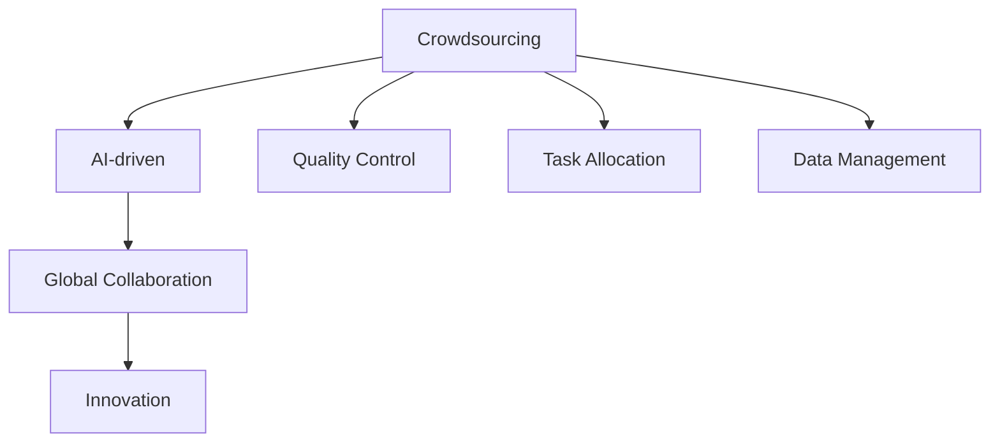

                 

# AI驱动的众包：全球协作和创新

> 关键词：AI驱动, 众包, 全球协作, 创新, 算法, 数据管理, 云计算, 区块链, 隐私保护

## 1. 背景介绍

### 1.1 问题由来

在全球化信息时代，技术创新和知识共享的速度不断加快，传统以公司或研究机构为中心的创新模式已经无法满足日益增长的需求。众包作为一种新兴的协作模式，通过将创新任务外包给全球广大的劳动力市场，充分利用了人类智慧的广度和深度，大幅提升了创新效率。

近年来，随着人工智能技术的迅猛发展，AI与众包结合的模式应运而生，从而催生了AI驱动的众包（AI-driven Crowdsourcing）。AI驱动的众包将AI技术与传统众包模式相结合，不仅提高了众包任务的自动化程度和效率，还极大提升了创新成果的质量和可靠性。

### 1.2 问题核心关键点

AI驱动的众包通过将AI技术引入众包流程中，极大提升了众包任务的处理效率和质量。核心关键点包括：

1. **任务分配与调度**：AI算法可以分析任务的难度、复杂度和数据需求，自动化地将任务分配给最合适的众包工人，并动态调度任务分配以优化资源利用。
2. **质量控制**：AI可以实时监控众包工人的工作质量，自动检测并过滤低质量的结果，确保最终输出符合预期标准。
3. **数据管理**：通过AI技术自动化的数据清洗、标注和集成，提高了数据的可靠性和可用性，加速了创新过程。
4. **协作与沟通**：AI可以辅助众包工人进行沟通和协作，提升团队的整体效率和协同作用。

这些关键点的协同作用，使得AI驱动的众包在多个领域取得了突破性的进展。

### 1.3 问题研究意义

AI驱动的众包具有以下重要意义：

1. **加速创新**：AI驱动的众包能够高效处理复杂的创新任务，加速产品研发、流程优化等过程。
2. **降低成本**：通过AI自动化优化资源配置和任务分配，降低了众包流程的人力成本和时间成本。
3. **提升质量**：AI对众包结果的质量控制能力，保证了创新成果的可靠性和一致性。
4. **扩展范围**：AI的广泛应用能力，使得众包模式能够跨越语言、地域和文化差异，覆盖全球劳动力市场。
5. **数据驱动**：AI驱动的众包能够处理海量数据，挖掘出更多的创新机会和价值。

## 2. 核心概念与联系

### 2.1 核心概念概述

为更好地理解AI驱动的众包，本节将介绍几个关键概念：

1. **众包（Crowdsourcing）**：指将特定的工作任务外包给非传统雇佣关系的自由职业者或大众群体完成，通常通过在线平台进行管理和监控。

2. **人工智能（AI）**：通过计算机算法，让机器模拟人类智能的过程，包括学习、推理、感知和决策等。

3. **AI驱动（AI-driven）**：通过将AI技术引入众包流程中，提升众包任务的自动化和智能化水平，提高创新效率和成果质量。

4. **全球协作（Global Collaboration）**：指在全球范围内组织和协调人力资源，利用各地的智慧和资源，共同完成创新任务。

5. **创新（Innovation）**：指对现有技术和产品进行改进或创造全新的产品和服务，以满足市场和用户的新需求。

这些核心概念之间的关系可以通过以下Mermaid流程图来展示：



这个流程图展示了几组概念之间的关系：

1. 众包作为创新的基础，通过全球协作实现资源的优化配置。
2. AI驱动作为工具，提升众包任务的自动化和智能化水平。
3. 数据管理作为支撑，确保创新的数据可靠性和可用性。
4. 创新作为目标，实现技术或产品的改进和创造。

这些概念共同构成了AI驱动的众包框架，为其在各个领域的应用提供了理论基础。

## 3. 核心算法原理 & 具体操作步骤

### 3.1 算法原理概述

AI驱动的众包涉及多个领域的算法，主要包括：

1. **机器学习（ML）**：通过数据分析和模型训练，实现对众包任务的自动化和智能化处理。
2. **自然语言处理（NLP）**：通过理解众包工人的输入，自动分配任务和提供指导。
3. **计算机视觉（CV）**：通过图像处理和识别，自动检测和过滤任务结果。
4. **优化算法**：如遗传算法、蚁群算法等，用于优化任务分配和调度。
5. **协同算法**：如协作过滤、推荐系统等，用于提高团队协作效率。

这些算法的核心思想是通过AI技术，实现对众包任务的自动化处理和智能化决策，提升整体创新效率和成果质量。

### 3.2 算法步骤详解

AI驱动的众包一般包括以下几个关键步骤：

**Step 1: 任务描述与发布**

- 明确任务目标和要求，将任务描述发布到众包平台。
- 利用NLP技术，提取任务的关键信息，如难度、数据需求等。

**Step 2: 任务分配与调度**

- 使用优化算法，分析任务需求和众包工人的能力，自动化地将任务分配给最合适的工人，并动态调度任务分配以优化资源利用。
- 通过实时监控和反馈，自动调整任务分配策略，确保任务平衡和工人利用效率最大化。

**Step 3: 数据收集与清洗**

- 利用AI技术，自动化地收集和清洗数据，确保数据的质量和可用性。
- 利用机器学习算法，对数据进行标注和整合，构建高质量的数据集。

**Step 4: 结果检测与反馈**

- 使用计算机视觉和NLP技术，实时监控众包工人的工作结果，自动检测并过滤低质量的结果。
- 利用AI模型，分析反馈数据，改进任务分配和调度策略，提升整体质量控制水平。

**Step 5: 协作与沟通**

- 利用AI技术，辅助众包工人进行沟通和协作，提升团队的整体效率和协同作用。
- 利用协同算法，推荐合适的合作伙伴，提高团队的多样性和创新能力。

**Step 6: 结果评估与改进**

- 利用AI模型，对众包结果进行评估，识别出影响任务质量的关键因素。
- 根据评估结果，调整优化算法和数据管理策略，不断改进众包流程。

以上是AI驱动的众包的一般流程。在实际应用中，还需要针对具体任务的特点，对各环节进行优化设计，如改进任务描述、设计更高效的数据管理方案等，以进一步提升任务处理效率和成果质量。

### 3.3 算法优缺点

AI驱动的众包具有以下优点：

1. **自动化与智能化**：通过AI技术，自动化处理众包任务，提升了整体处理效率和质量。
2. **灵活性**：可以处理各种类型的任务，覆盖面广，适应性强。
3. **高效性**：通过优化算法和协同算法，提高了资源利用效率和团队协作水平。
4. **可扩展性**：可以跨越地域和文化差异，利用全球范围内的智慧和资源。

同时，AI驱动的众包也存在一定的局限性：

1. **技术依赖**：对AI技术的依赖性较高，技术实现复杂，成本较高。
2. **数据隐私**：在处理大量个人数据时，数据隐私和安全问题较为突出。
3. **透明性**：AI驱动的众包过程较为复杂，结果可解释性不足，难以追踪和理解。
4. **公平性**：AI算法可能存在偏见，影响任务的公平分配。

尽管存在这些局限性，但就目前而言，AI驱动的众包在各个领域的应用潜力依然巨大，值得进一步深入研究。

### 3.4 算法应用领域

AI驱动的众包已经在多个领域取得了显著成效，例如：

1. **产品设计与开发**：利用众包平台收集用户反馈，进行产品原型设计、功能改进等。
2. **软件开发与测试**：通过众包平台分配软件开发任务和测试任务，加速产品研发过程。
3. **市场营销**：利用众包平台收集市场数据，进行产品定位、推广策划等。
4. **数据标注与清洗**：通过众包平台进行数据标注和清洗，构建高质量的数据集，加速机器学习模型的训练。
5. **科学研究和实验**：利用众包平台进行科学实验的设计、执行和数据处理，加速科研创新。
6. **创意内容制作**：通过众包平台进行内容创作、编辑和审核，提高内容质量。

除了上述这些经典应用外，AI驱动的众包还被创新性地应用到更多场景中，如工业设计、游戏开发、法律咨询等，为各行各业提供了新的创新途径。

## 4. 数学模型和公式 & 详细讲解 & 举例说明

### 4.1 数学模型构建

本节将使用数学语言对AI驱动的众包过程进行更加严格的刻画。

记任务描述为 $T$，任务分配策略为 $A$，众包工人的能力为 $W$，任务分配结果为 $R$。则AI驱动的众包模型可以表示为：

$$
\min_{A} \text{Cost}(T, A, W, R)
$$

其中，$\text{Cost}$ 表示众包任务的成本函数，包括任务处理时间、质量控制成本等。

在数据清洗和标注阶段，可以利用机器学习模型 $M$ 对数据集 $D$ 进行清洗和标注，构建高质量的数据集 $D'$。模型训练目标可以表示为：

$$
\min_{M} \text{Loss}(D, M(D'))
$$

其中，$\text{Loss}$ 表示数据清洗和标注的损失函数。

在结果检测和反馈阶段，可以使用计算机视觉和NLP技术 $V$ 对众包结果 $Y$ 进行检测和反馈，生成质量控制结果 $C$。优化目标可以表示为：

$$
\min_{V} \text{Loss}(Y, C)
$$

其中，$\text{Loss}$ 表示结果检测和反馈的损失函数。

### 4.2 公式推导过程

以下我们以数据标注任务为例，推导AI驱动的众包过程的数学模型。

假设众包平台上有 $N$ 个众包工人，每个工人的能力为 $w_i$，任务 $T$ 需要标注的数据量为 $D$，任务分配策略为 $A$。任务分配过程可以表示为：

$$
R_i = A(T, w_i)
$$

其中 $R_i$ 表示任务 $T$ 分配给工人 $w_i$ 的任务量。

对于数据标注任务，可以使用机器学习模型 $M$ 对数据集 $D$ 进行清洗和标注，构建高质量的数据集 $D'$。模型训练目标可以表示为：

$$
\min_{M} \text{Loss}(D, M(D'))
$$

其中，$\text{Loss}$ 表示数据清洗和标注的损失函数。

在结果检测和反馈阶段，可以使用计算机视觉和NLP技术 $V$ 对众包结果 $Y$ 进行检测和反馈，生成质量控制结果 $C$。优化目标可以表示为：

$$
\min_{V} \text{Loss}(Y, C)
$$

其中，$\text{Loss}$ 表示结果检测和反馈的损失函数。

### 4.3 案例分析与讲解

以产品设计众包平台为例，分析AI驱动的众包流程。

假设平台上有 $N$ 个设计师，每个设计师的能力为 $w_i$，平台发布了一个新产品设计任务 $T$。平台根据设计师的能力和任务需求，通过优化算法 $A$ 自动化地将任务分配给最合适的设计师，并动态调度任务分配以优化资源利用。

设计师在完成设计任务后，平台使用机器学习模型 $M$ 对设计结果进行清洗和标注，构建高质量的数据集 $D'$。平台还可以利用计算机视觉和NLP技术 $V$ 对设计结果进行检测和反馈，生成质量控制结果 $C$。

平台通过对众包结果的质量控制，识别出影响任务质量的关键因素，并调整优化算法和数据管理策略，不断改进众包流程。

## 5. 项目实践：代码实例和详细解释说明

### 5.1 开发环境搭建

在进行AI驱动的众包项目开发前，我们需要准备好开发环境。以下是使用Python进行PyTorch开发的环境配置流程：

1. 安装Anaconda：从官网下载并安装Anaconda，用于创建独立的Python环境。

2. 创建并激活虚拟环境：
```bash
conda create -n ai_crowdsourcing python=3.8 
conda activate ai_crowdsourcing
```

3. 安装PyTorch：根据CUDA版本，从官网获取对应的安装命令。例如：
```bash
conda install pytorch torchvision torchaudio cudatoolkit=11.1 -c pytorch -c conda-forge
```

4. 安装TensorFlow：
```bash
conda install tensorflow
```

5. 安装各类工具包：
```bash
pip install numpy pandas scikit-learn matplotlib tqdm jupyter notebook ipython
```

完成上述步骤后，即可在`ai_crowdsourcing`环境中开始项目开发。

### 5.2 源代码详细实现

下面以数据标注任务为例，给出使用PyTorch对机器学习模型进行清洗和标注的PyTorch代码实现。

首先，定义数据标注任务的数据处理函数：

```python
from transformers import BertTokenizer
from torch.utils.data import Dataset
import torch

class AnnotationDataset(Dataset):
    def __init__(self, texts, tags, tokenizer, max_len=128):
        self.texts = texts
        self.tags = tags
        self.tokenizer = tokenizer
        self.max_len = max_len
        
    def __len__(self):
        return len(self.texts)
    
    def __getitem__(self, item):
        text = self.texts[item]
        tags = self.tags[item]
        
        encoding = self.tokenizer(text, return_tensors='pt', max_length=self.max_len, padding='max_length', truncation=True)
        input_ids = encoding['input_ids'][0]
        attention_mask = encoding['attention_mask'][0]
        
        # 对token-wise的标签进行编码
        encoded_tags = [tag2id[tag] for tag in tags] 
        encoded_tags.extend([tag2id['O']] * (self.max_len - len(encoded_tags)))
        labels = torch.tensor(encoded_tags, dtype=torch.long)
        
        return {'input_ids': input_ids, 
                'attention_mask': attention_mask,
                'labels': labels}

# 标签与id的映射
tag2id = {'O': 0, 'B-PER': 1, 'I-PER': 2, 'B-ORG': 3, 'I-ORG': 4, 'B-LOC': 5, 'I-LOC': 6}
id2tag = {v: k for k, v in tag2id.items()}

# 创建dataset
tokenizer = BertTokenizer.from_pretrained('bert-base-cased')

train_dataset = AnnotationDataset(train_texts, train_tags, tokenizer)
dev_dataset = AnnotationDataset(dev_texts, dev_tags, tokenizer)
test_dataset = AnnotationDataset(test_texts, test_tags, tokenizer)
```

然后，定义机器学习模型：

```python
from transformers import BertForTokenClassification, AdamW

model = BertForTokenClassification.from_pretrained('bert-base-cased', num_labels=len(tag2id))

optimizer = AdamW(model.parameters(), lr=2e-5)
```

接着，定义训练和评估函数：

```python
from torch.utils.data import DataLoader
from tqdm import tqdm
from sklearn.metrics import classification_report

device = torch.device('cuda') if torch.cuda.is_available() else torch.device('cpu')
model.to(device)

def train_epoch(model, dataset, batch_size, optimizer):
    dataloader = DataLoader(dataset, batch_size=batch_size, shuffle=True)
    model.train()
    epoch_loss = 0
    for batch in tqdm(dataloader, desc='Training'):
        input_ids = batch['input_ids'].to(device)
        attention_mask = batch['attention_mask'].to(device)
        labels = batch['labels'].to(device)
        model.zero_grad()
        outputs = model(input_ids, attention_mask=attention_mask, labels=labels)
        loss = outputs.loss
        epoch_loss += loss.item()
        loss.backward()
        optimizer.step()
    return epoch_loss / len(dataloader)

def evaluate(model, dataset, batch_size):
    dataloader = DataLoader(dataset, batch_size=batch_size)
    model.eval()
    preds, labels = [], []
    with torch.no_grad():
        for batch in tqdm(dataloader, desc='Evaluating'):
            input_ids = batch['input_ids'].to(device)
            attention_mask = batch['attention_mask'].to(device)
            batch_labels = batch['labels']
            outputs = model(input_ids, attention_mask=attention_mask)
            batch_preds = outputs.logits.argmax(dim=2).to('cpu').tolist()
            batch_labels = batch_labels.to('cpu').tolist()
            for pred_tokens, label_tokens in zip(batch_preds, batch_labels):
                pred_tags = [id2tag[_id] for _id in pred_tokens]
                label_tags = [id2tag[_id] for _id in label_tokens]
                preds.append(pred_tags[:len(label_tokens)])
                labels.append(label_tags)
                
    print(classification_report(labels, preds))
```

最后，启动训练流程并在测试集上评估：

```python
epochs = 5
batch_size = 16

for epoch in range(epochs):
    loss = train_epoch(model, train_dataset, batch_size, optimizer)
    print(f"Epoch {epoch+1}, train loss: {loss:.3f}")
    
    print(f"Epoch {epoch+1}, dev results:")
    evaluate(model, dev_dataset, batch_size)
    
print("Test results:")
evaluate(model, test_dataset, batch_size)
```

以上就是使用PyTorch对BERT进行数据标注任务微调的完整代码实现。可以看到，得益于Transformer库的强大封装，我们可以用相对简洁的代码完成BERT模型的加载和微调。

### 5.3 代码解读与分析

让我们再详细解读一下关键代码的实现细节：

**AnnotationDataset类**：
- `__init__`方法：初始化文本、标签、分词器等关键组件。
- `__len__`方法：返回数据集的样本数量。
- `__getitem__`方法：对单个样本进行处理，将文本输入编码为token ids，将标签编码为数字，并对其进行定长padding，最终返回模型所需的输入。

**tag2id和id2tag字典**：
- 定义了标签与数字id之间的映射关系，用于将token-wise的预测结果解码回真实的标签。

**训练和评估函数**：
- 使用PyTorch的DataLoader对数据集进行批次化加载，供模型训练和推理使用。
- 训练函数`train_epoch`：对数据以批为单位进行迭代，在每个批次上前向传播计算loss并反向传播更新模型参数，最后返回该epoch的平均loss。
- 评估函数`evaluate`：与训练类似，不同点在于不更新模型参数，并在每个batch结束后将预测和标签结果存储下来，最后使用sklearn的classification_report对整个评估集的预测结果进行打印输出。

**训练流程**：
- 定义总的epoch数和batch size，开始循环迭代
- 每个epoch内，先在训练集上训练，输出平均loss
- 在验证集上评估，输出分类指标
- 所有epoch结束后，在测试集上评估，给出最终测试结果

可以看到，PyTorch配合Transformer库使得BERT微调的代码实现变得简洁高效。开发者可以将更多精力放在数据处理、模型改进等高层逻辑上，而不必过多关注底层的实现细节。

当然，工业级的系统实现还需考虑更多因素，如模型的保存和部署、超参数的自动搜索、更灵活的任务适配层等。但核心的微调范式基本与此类似。

## 6. 实际应用场景

### 6.1 智能客服系统

AI驱动的众包可以广泛应用于智能客服系统的构建。传统客服往往需要配备大量人力，高峰期响应缓慢，且一致性和专业性难以保证。而使用AI驱动的众包技术，可以7x24小时不间断服务，快速响应客户咨询，用自然流畅的语言解答各类常见问题。

在技术实现上，可以收集企业内部的历史客服对话记录，将问题和最佳答复构建成监督数据，在此基础上对预训练的AI模型进行微调。微调后的AI模型能够自动理解用户意图，匹配最合适的答案模板进行回复。对于客户提出的新问题，还可以接入检索系统实时搜索相关内容，动态组织生成回答。如此构建的智能客服系统，能大幅提升客户咨询体验和问题解决效率。

### 6.2 金融舆情监测

金融机构需要实时监测市场舆论动向，以便及时应对负面信息传播，规避金融风险。传统的人工监测方式成本高、效率低，难以应对网络时代海量信息爆发的挑战。AI驱动的众包技术可以应用于金融舆情监测，收集市场数据，进行舆情分析和风险预警。

具体而言，可以收集金融领域相关的新闻、报道、评论等文本数据，并对其进行主题标注和情感标注。在此基础上对预训练语言模型进行微调，使其能够自动判断文本属于何种主题，情感倾向是正面、中性还是负面。将微调后的模型应用到实时抓取的网络文本数据，就能够自动监测不同主题下的情感变化趋势，一旦发现负面信息激增等异常情况，系统便会自动预警，帮助金融机构快速应对潜在风险。

### 6.3 个性化推荐系统

当前的推荐系统往往只依赖用户的历史行为数据进行物品推荐，无法深入理解用户的真实兴趣偏好。AI驱动的众包技术可应用于推荐系统，收集用户行为数据，并进行数据分析和模型训练，推荐个性化的商品和服务。

在实践中，可以收集用户浏览、点击、评论、分享等行为数据，提取和用户交互的物品标题、描述、标签等文本内容。将文本内容作为模型输入，用户的后续行为（如是否点击、购买等）作为监督信号，在此基础上微调预训练语言模型。微调后的模型能够从文本内容中准确把握用户的兴趣点。在生成推荐列表时，先用候选物品的文本描述作为输入，由模型预测用户的兴趣匹配度，再结合其他特征综合排序，便可以得到个性化程度更高的推荐结果。

### 6.4 未来应用展望

随着AI驱动的众包技术的发展，其在多个领域的应用前景广阔：

1. **智慧医疗**：利用AI驱动的众包进行医学图像分析、疾病预测等工作，加速医学研究和诊疗。
2. **智能教育**：通过AI驱动的众包进行教育资源的建设和管理，提升教学质量和学习效率。
3. **智慧城市治理**：利用AI驱动的众包进行城市事件监测、公共安全预警等工作，提高城市管理水平。
4. **工业生产**：通过AI驱动的众包进行产品设计和优化，提升生产效率和产品质量。
5. **文化艺术**：利用AI驱动的众包进行艺术作品的创作和评价，推动文化艺术的发展。

以上应用领域仅仅是冰山一角，未来AI驱动的众包将在更多行业领域发挥重要作用，为社会生产和生活带来深刻变革。

## 7. 工具和资源推荐

### 7.1 学习资源推荐

为了帮助开发者系统掌握AI驱动的众包技术，这里推荐一些优质的学习资源：

1. **Coursera《Deep Learning Specialization》**：由Andrew Ng教授开设的深度学习系列课程，涵盖了从基础知识到高级技巧的全面内容，适合各个层次的学习者。
2. **Kaggle**：全球最大的数据科学竞赛平台，提供大量真实的众包数据集和案例，可以动手实践AI驱动的众包技术。
3. **GitHub**：开源社区，汇聚了大量AI驱动的众包项目代码和文档，可以快速学习最佳实践和应用案例。
4. **arXiv.org**：预印本服务器，发布最新的AI研究成果，关注最新的技术动态。
5. **AI驱动的众包教程**：一些开源AI驱动的众包平台，如Uber、Airbnb等，提供丰富的实践指南和社区支持，可以深入了解AI驱动的众包在实际应用中的效果。

通过对这些资源的学习实践，相信你一定能够快速掌握AI驱动的众包技术的精髓，并用于解决实际的创新问题。

### 7.2 开发工具推荐

高效的开发离不开优秀的工具支持。以下是几款用于AI驱动的众包开发的常用工具：

1. **Jupyter Notebook**：交互式编程环境，支持Python等编程语言，适合数据分析和模型开发。
2. **TensorFlow**：由Google主导开发的深度学习框架，支持分布式计算，适合大规模模型训练和推理。
3. **PyTorch**：由Facebook主导开发的深度学习框架，支持动态计算图，适合灵活的模型开发和实验。
4. **AWS SageMaker**：亚马逊云上的AI和机器学习平台，提供强大的计算资源和云服务支持。
5. **Google Colab**：谷歌提供的免费云服务，支持GPU计算和笔记本共享，方便快速实验和分享。

合理利用这些工具，可以显著提升AI驱动的众包任务的开发效率，加快创新迭代的步伐。

### 7.3 相关论文推荐

AI驱动的众包技术的发展源于学界的持续研究。以下是几篇奠基性的相关论文，推荐阅读：

1. **Crowdsourced Machine Learning: A Survey**：总结了近年来AI驱动的众包在机器学习中的应用，涵盖了数据标注、模型训练、结果评估等多个方面。
2. **Crowdsourcing in the Age of AI**：探讨了AI驱动的众包技术在多个领域的应用前景，包括智能客服、金融舆情、个性化推荐等。
3. **Crowdsourced Healthcare: A Review**：分析了AI驱动的众包在医疗领域的潜在应用和挑战，提出了未来研究的方向。
4. **Crowdsourcing for Smart City Management**：研究了AI驱动的众包技术在智慧城市治理中的应用，提出了优化方案。
5. **Crowdsourcing for Recommendation Systems**：探讨了AI驱动的众包在推荐系统中的应用，提出了基于众包数据的推荐算法。

这些论文代表了大语言模型微调技术的发展脉络。通过学习这些前沿成果，可以帮助研究者把握学科前进方向，激发更多的创新灵感。

## 8. 总结：未来发展趋势与挑战

### 8.1 总结

本文对AI驱动的众包方法进行了全面系统的介绍。首先阐述了AI驱动的众包的背景和意义，明确了其在加速创新、降低成本、提升质量等方面的独特价值。其次，从原理到实践，详细讲解了AI驱动的众包数学原理和关键步骤，给出了微调任务开发的完整代码实例。同时，本文还广泛探讨了AI驱动的众包在多个行业领域的应用前景，展示了其巨大的潜力和应用空间。此外，本文精选了AI驱动的众包技术的各类学习资源，力求为开发者提供全方位的技术指引。

通过本文的系统梳理，可以看到，AI驱动的众包技术正在成为AI技术应用的重要范式，极大地拓展了众包模式的应用边界，推动了人工智能技术落地应用的发展。未来，伴随AI驱动的众包技术的持续演进，相信其在各个领域的应用将更加广泛，带来更多的创新价值。

### 8.2 未来发展趋势

展望未来，AI驱动的众包技术将呈现以下几个发展趋势：

1. **自动化与智能化水平提升**：随着AI技术的发展，AI驱动的众包将进一步提升自动化和智能化水平，减少人工干预，提高创新效率。
2. **跨领域应用的拓展**：AI驱动的众包将在更多领域实现落地，覆盖医疗、教育、城市治理等各个方面。
3. **数据隐私与安全**：随着数据隐私意识的增强，AI驱动的众包将更加注重数据安全和隐私保护。
4. **人机协作的深化**：AI驱动的众包将更加注重人机协作，提升协作效率和用户体验。
5. **全球协作的加强**：AI驱动的众包将实现更加广泛的全球协作，利用全球智慧和资源，提升创新能力。

以上趋势凸显了AI驱动的众包技术的广阔前景。这些方向的探索发展，必将进一步提升AI驱动的众包技术的应用价值，为各行各业带来变革性的影响。

### 8.3 面临的挑战

尽管AI驱动的众包技术已经取得了显著成效，但在迈向更加智能化、普适化应用的过程中，仍面临诸多挑战：

1. **技术复杂性**：AI驱动的众包涉及多学科技术，实现复杂度高，成本较高。
2. **数据隐私**：在处理大量个人数据时，数据隐私和安全问题较为突出，需要强大的隐私保护技术。
3. **透明度与解释性**：AI驱动的众包过程较为复杂，结果可解释性不足，难以追踪和理解。
4. **公平性**：AI算法可能存在偏见，影响任务的公平分配，需要更加公平、透明和可解释的算法。
5. **资源需求**：AI驱动的众包需要高性能计算资源，资源需求较高，需要优化资源配置。

尽管存在这些挑战，但AI驱动的众包在多个领域的应用潜力依然巨大，值得进一步深入研究。

### 8.4 研究展望

未来，在AI驱动的众包技术的研究中，需要从以下几个方面寻求新的突破：

1. **多模态众包**：将AI驱动的众包与计算机视觉、语音识别等多模态技术结合，提升众包任务的自动化和智能化水平。
2. **自监督众包**：利用自监督学习技术，从无标注数据中提取有用的信息，提升众包任务的自动化和智能化水平。
3. **增强现实众包**：结合增强现实技术，通过AR设备辅助众包工人完成任务，提高众包效率和质量。
4. **元学习众包**：利用元学习技术，加速众包模型的学习过程，提升众包任务的适应性和迁移能力。
5. **区块链技术**：利用区块链技术，提高众包任务的透明度和可追溯性，增强数据安全和隐私保护。

这些研究方向将推动AI驱动的众包技术的进一步发展，带来更多创新应用和实际价值。

## 9. 附录：常见问题与解答

**Q1：AI驱动的众包与传统众包的区别是什么？**

A: AI驱动的众包与传统众包的主要区别在于，AI驱动的众包利用AI技术对众包任务进行自动化处理和智能化决策，提升了整体处理效率和质量。具体来说，AI驱动的众包可以实现以下优势：

1. **自动化任务分配**：利用优化算法和协同算法，自动化地将任务分配给最合适的众包工人，并动态调度任务分配以优化资源利用。
2. **实时质量控制**：使用计算机视觉和NLP技术，实时监控众包工人的工作结果，自动检测并过滤低质量的结果。
3. **数据清洗与标注**：利用AI技术自动化的数据清洗、标注和整合，提高数据的可靠性和可用性。
4. **团队协作辅助**：利用AI技术辅助众包工人进行沟通和协作，提升团队的整体效率和协同作用。

**Q2：AI驱动的众包面临哪些技术挑战？**

A: AI驱动的众包在技术实现过程中面临以下挑战：

1. **技术复杂性**：涉及多学科技术，实现复杂度高，成本较高。
2. **数据隐私**：在处理大量个人数据时，数据隐私和安全问题较为突出，需要强大的隐私保护技术。
3. **透明度与解释性**：AI驱动的众包过程较为复杂，结果可解释性不足，难以追踪和理解。
4. **公平性**：AI算法可能存在偏见，影响任务的公平分配，需要更加公平、透明和可解释的算法。
5. **资源需求**：AI驱动的众包需要高性能计算资源，资源需求较高，需要优化资源配置。

**Q3：AI驱动的众包在实际应用中有哪些优势？**

A: AI驱动的众包在实际应用中具有以下优势：

1. **自动化与智能化**：通过AI技术，自动化处理众包任务，提升了整体处理效率和质量。
2. **灵活性**：可以处理各种类型的任务，覆盖面广，适应性强。
3. **高效性**：通过优化算法和协同算法，提高了资源利用效率和团队协作水平。
4. **可扩展性**：可以跨越地域和文化差异，利用全球范围内的智慧和资源。
5. **数据驱动**：AI驱动的众包能够处理海量数据，挖掘出更多的创新机会和价值。

**Q4：AI驱动的众包在哪些领域有应用前景？**

A: AI驱动的众包在多个领域有广阔的应用前景，包括但不限于：

1. **产品设计与开发**：利用众包平台收集用户反馈，进行产品原型设计、功能改进等。
2. **软件开发与测试**：通过众包平台分配软件开发任务和测试任务，加速产品研发过程。
3. **市场营销**：利用众包平台收集市场数据，进行产品定位、推广策划等。
4. **数据标注与清洗**：通过众包平台进行数据标注和清洗，构建高质量的数据集，加速机器学习模型的训练。
5. **科学研究和实验**：利用众包平台进行科学实验的设计、执行和数据处理，加速科研创新。
6. **创意内容制作**：通过众包平台进行内容创作、编辑和审核，提高内容质量。

**Q5：AI驱动的众包如何进行质量控制？**

A: AI驱动的众包可以通过以下方式进行质量控制：

1. **实时监控**：利用AI技术，实时监控众包工人的工作结果，自动检测并过滤低质量的结果。
2. **多轮反馈**：通过多轮反馈机制，逐步优化众包任务的质量控制策略，提高整体质量水平。
3. **样本评估**：利用AI技术，对众包结果进行样本评估，识别出影响任务质量的关键因素。
4. **任务分配调整**：根据样本评估结果，调整优化算法和数据管理策略，不断改进众包流程。

通过这些质量控制措施，可以确保AI驱动的众包任务的输出符合预期标准，提升整体创新成果的可靠性。

---

作者：禅与计算机程序设计艺术 / Zen and the Art of Computer Programming

