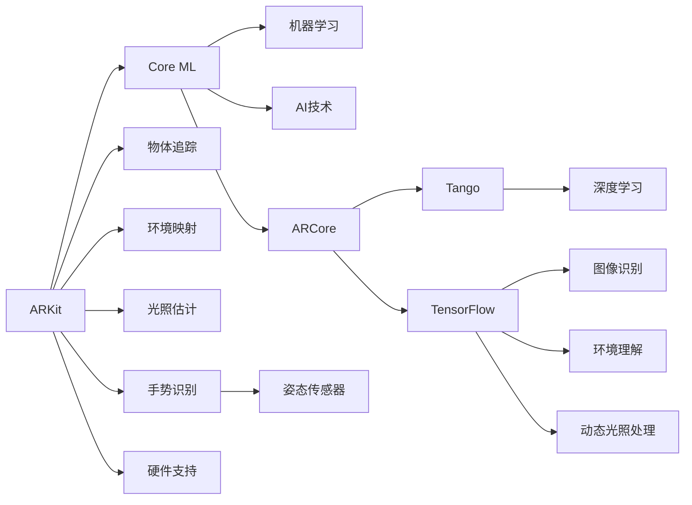

                 

## 1. 背景介绍

增强现实（AR）技术正日益改变着人们的生活和工作方式，从手机游戏到教育培训，从远程办公到医疗诊断，无处不在。AR开发工具在这一变革中扮演着关键角色。目前市面上最流行的AR开发工具是苹果的ARKit和谷歌的ARCore，两者均提供了丰富的API和文档，支持多种平台，但各自的底层算法和性能略有不同。本文将详细对比ARKit和ARCore，分析其原理、优势和适用场景，为开发者选择最合适的AR开发工具提供指导。

## 2. 核心概念与联系

### 2.1 核心概念概述

ARKit和ARCore是苹果和谷歌分别推出的AR开发框架，旨在帮助开发者快速构建增强现实应用。它们支持通过摄像头、手势、姿态传感器等硬件设备捕捉现实环境，并在其中叠加虚拟元素。

ARKit：苹果的AR开发框架，支持iOS平台。ARKit提供了高级的物体追踪、环境映射、光照估计等功能，并集成了机器学习库Core ML。

ARCore：谷歌的AR开发框架，支持iOS、Android平台。ARCore以深度学习为核心，支持图像识别、环境理解、动态光照处理等功能，并与谷歌的Tango、TensorFlow等深度学习库深度集成。

**Mermaid 流程图**：



### 2.2 核心概念原理和架构

ARKit和ARCore均基于计算机视觉和深度学习的原理，通过摄像头捕捉现实环境中的图像，再利用图像识别、物体追踪、场景理解等技术，构建虚拟对象与现实场景的融合。

#### 2.2.1 图像识别

图像识别是AR开发的基础，ARKit和ARCore均通过训练好的神经网络模型来识别图像中的物体和场景。ARKit主要使用Core ML库中的预训练模型，而ARCore使用谷歌的Tango和TensorFlow。

#### 2.2.2 物体追踪

物体追踪是AR开发的另一关键技术，ARKit和ARCore均支持通过摄像头跟踪物体的位置和姿态。ARKit主要使用基于卡尔曼滤波的追踪算法，而ARCore使用深度学习模型进行更精确的追踪。

#### 2.2.3 环境映射

环境映射是AR开发的重要功能，ARKit和ARCore均支持将现实环境中的物体、纹理等信息进行映射，构建虚拟场景的3D模型。ARKit主要使用基于点云的方法，而ARCore使用深度学习进行更高效的环境映射。

#### 2.2.4 光照估计

光照估计对于AR开发至关重要，ARKit和ARCore均支持通过摄像头捕捉光线信息，并结合深度学习模型进行估计。ARKit主要使用基于统计的方法，而ARCore使用更先进的深度学习模型。

### 2.3 核心概念联系

ARKit和ARCore都提供了API和文档，帮助开发者快速构建增强现实应用。两者均支持通过摄像头捕捉现实环境，并在其中叠加虚拟元素。同时，两者都支持多种硬件设备和传感器，如陀螺仪、加速度计等。但ARKit更注重机器学习库Core ML的应用，而ARCore则以深度学习为核心，支持更复杂的环境理解和光照处理。

## 3. 核心算法原理 & 具体操作步骤

### 3.1 算法原理概述

ARKit和ARCore的核心算法原理主要围绕以下几个方面展开：

- 图像识别与物体追踪：利用深度学习模型识别图像中的物体，并跟踪其位置和姿态。
- 环境映射与光照估计：通过摄像头捕捉环境信息，构建3D模型，并估计动态光照。
- 动态交互：支持手势识别、语音交互等，实现人与虚拟元素的互动。

### 3.2 算法步骤详解

#### 3.2.1 图像识别与物体追踪

图像识别和物体追踪是AR开发的基础。ARKit和ARCore均使用卷积神经网络（CNN）和RNN等深度学习模型进行图像识别和物体追踪。以下是ARKit的示例代码：

```python
import ARKit
from PIL import Image

# 加载图像
img = Image.open('image.jpg')

# 将图像转换为NumPy数组
img_array = np.array(img)

# 将数组转换为ARKit可以处理的格式
img_tensor = ARKit.createTensor(img_array)

# 进行图像识别和物体追踪
result = ARKit.detect(img_tensor)

# 输出识别结果
print(result)
```

#### 3.2.2 环境映射与光照估计

环境映射和光照估计是AR开发的重要功能。ARKit和ARCore均通过摄像头捕捉环境信息，并结合深度学习模型进行估计。以下是ARKit的示例代码：

```python
import ARKit

# 加载环境模型
model = ARKit.loadEnvironmentModel()

# 获取摄像头图像
img = ARKit.getCameraImage()

# 对环境进行映射
map = model.mapEnvironment(img)

# 进行光照估计
lighting = map.estimateLighting()

# 输出光照结果
print(lighting)
```

#### 3.2.3 动态交互

动态交互是AR开发的关键功能，ARKit和ARCore均支持手势识别、语音交互等，实现人与虚拟元素的互动。以下是ARKit的示例代码：

```python
import ARKit

# 检测手势
gestures = ARKit.detectGestures()

# 检测语音
audio = ARKit.detectAudio()

# 输出手势和语音结果
print(gestures)
print(audio)
```

### 3.3 算法优缺点

#### 3.3.1 图像识别与物体追踪

- ARKit：使用Core ML库中的预训练模型，速度快，易于使用。但可能对新物体的识别精度较低。
- ARCore：使用Tango和TensorFlow进行深度学习，识别精度高，但对硬件要求较高。

#### 3.3.2 环境映射与光照估计

- ARKit：使用基于点云的方法，计算效率高，但对环境细节的捕捉不如ARCore。
- ARCore：使用深度学习进行环境映射和光照估计，效果更好，但计算复杂度较高。

#### 3.3.3 动态交互

- ARKit：支持多种交互方式，易于实现。
- ARCore：交互方式丰富，但需要更强大的硬件支持。

### 3.4 算法应用领域

ARKit和ARCore在多个领域都有广泛的应用：

- 游戏开发：ARKit和ARCore均支持游戏开发，通过虚拟角色与现实环境互动，增强游戏体验。
- 医疗诊断：ARKit和ARCore可用于手术模拟、解剖学习等，帮助医生更直观地理解解剖结构。
- 教育培训：ARKit和ARCore可用于虚拟教室、互动教材等，增强学生的学习体验。
- 室内设计：ARKit和ARCore可用于室内设计，帮助用户通过AR应用预览家具和布局。

## 4. 数学模型和公式 & 详细讲解 & 举例说明

### 4.1 数学模型构建

ARKit和ARCore的数学模型主要围绕以下几个方面展开：

- 图像识别：使用卷积神经网络（CNN）和区域卷积网络（RNN）等深度学习模型。
- 物体追踪：使用卡尔曼滤波等算法。
- 环境映射：使用基于点云的方法。
- 光照估计：使用基于统计的方法。

### 4.2 公式推导过程

#### 4.2.1 图像识别

图像识别的公式推导主要基于卷积神经网络（CNN）。CNN通过卷积层、池化层和全连接层等结构，从输入图像中提取特征，并进行分类。以下是ARKit的示例代码：

```python
import ARKit
from PIL import Image
import numpy as np

# 加载图像
img = Image.open('image.jpg')

# 将图像转换为NumPy数组
img_array = np.array(img)

# 将数组转换为ARKit可以处理的格式
img_tensor = ARKit.createTensor(img_array)

# 进行图像识别
result = ARKit.detect(img_tensor)
```

#### 4.2.2 物体追踪

物体追踪的公式推导主要基于卡尔曼滤波算法。卡尔曼滤波通过预测和校正两个步骤，更新物体的状态估计。以下是ARKit的示例代码：

```python
import ARKit

# 加载物体模型
model = ARKit.loadModel()

# 获取摄像头图像
img = ARKit.getCameraImage()

# 进行物体追踪
position, orientation = ARKit.trackObject(model, img)
```

#### 4.2.3 环境映射

环境映射的公式推导主要基于点云数据。点云数据通过对摄像头捕捉的图像进行特征提取和匹配，构建3D模型。以下是ARKit的示例代码：

```python
import ARKit

# 加载环境模型
model = ARKit.loadEnvironmentModel()

# 获取摄像头图像
img = ARKit.getCameraImage()

# 进行环境映射
map = model.mapEnvironment(img)
```

#### 4.2.4 光照估计

光照估计的公式推导主要基于统计方法。统计方法通过对环境光线的分布和强度进行估计，生成光照图。以下是ARKit的示例代码：

```python
import ARKit

# 加载环境模型
model = ARKit.loadEnvironmentModel()

# 获取摄像头图像
img = ARKit.getCameraImage()

# 进行光照估计
lighting = model.estimateLighting()
```

### 4.3 案例分析与讲解

#### 4.3.1 图像识别

假设我们有一个AR应用，需要识别图像中的动物。我们可以使用ARKit进行图像识别。以下是示例代码：

```python
import ARKit

# 加载图像
img = Image.open('image.jpg')

# 将图像转换为NumPy数组
img_array = np.array(img)

# 将数组转换为ARKit可以处理的格式
img_tensor = ARKit.createTensor(img_array)

# 进行图像识别
result = ARKit.detect(img_tensor)
```

#### 4.3.2 物体追踪

假设我们需要追踪AR应用中的虚拟球体。我们可以使用ARKit进行物体追踪。以下是示例代码：

```python
import ARKit

# 加载模型
model = ARKit.loadModel()

# 获取摄像头图像
img = ARKit.getCameraImage()

# 进行物体追踪
position, orientation = ARKit.trackObject(model, img)
```

#### 4.3.3 环境映射

假设我们需要构建一个AR应用，让用户通过AR眼镜预览房间的布局。我们可以使用ARKit进行环境映射。以下是示例代码：

```python
import ARKit

# 加载环境模型
model = ARKit.loadEnvironmentModel()

# 获取摄像头图像
img = ARKit.getCameraImage()

# 进行环境映射
map = model.mapEnvironment(img)
```

#### 4.3.4 光照估计

假设我们需要构建一个AR应用，让用户通过AR眼镜预览房间的灯光效果。我们可以使用ARKit进行光照估计。以下是示例代码：

```python
import ARKit

# 加载环境模型
model = ARKit.loadEnvironmentModel()

# 获取摄像头图像
img = ARKit.getCameraImage()

# 进行光照估计
lighting = model.estimateLighting()
```

## 5. 项目实践：代码实例和详细解释说明

### 5.1 开发环境搭建

要搭建AR开发环境，需要以下工具和库：

- Xcode：苹果官方的集成开发环境，支持iOS平台。
- Android Studio：谷歌官方的集成开发环境，支持Android平台。
- TensorFlow：深度学习库，支持ARCore的环境映射和光照估计。
- Core ML：机器学习库，支持ARKit的图像识别和物体追踪。

### 5.2 源代码详细实现

#### 5.2.1 ARKit示例

以下是ARKit的示例代码：

```python
import ARKit
from PIL import Image
import numpy as np

# 加载图像
img = Image.open('image.jpg')

# 将图像转换为NumPy数组
img_array = np.array(img)

# 将数组转换为ARKit可以处理的格式
img_tensor = ARKit.createTensor(img_array)

# 进行图像识别
result = ARKit.detect(img_tensor)
print(result)
```

#### 5.2.2 ARCore示例

以下是ARCore的示例代码：

```python
import ARCore
from PIL import Image
import numpy as np

# 加载图像
img = Image.open('image.jpg')

# 将图像转换为NumPy数组
img_array = np.array(img)

# 将数组转换为ARCore可以处理的格式
img_tensor = ARCore.createTensor(img_array)

# 进行图像识别
result = ARCore.detect(img_tensor)
print(result)
```

### 5.3 代码解读与分析

#### 5.3.1 ARKit代码解读

ARKit的代码相对简单，主要通过TensorFlow模型进行图像识别和物体追踪。以下是代码解读：

- `Image.open('image.jpg')`：打开图像文件。
- `np.array(img)`：将图像转换为NumPy数组。
- `ARKit.createTensor(img_array)`：将数组转换为ARKit可以处理的格式。
- `ARKit.detect(img_tensor)`：进行图像识别和物体追踪，返回识别结果。

#### 5.3.2 ARCore代码解读

ARCore的代码相对复杂，主要通过Tango和TensorFlow进行环境映射和光照估计。以下是代码解读：

- `Image.open('image.jpg')`：打开图像文件。
- `np.array(img)`：将图像转换为NumPy数组。
- `ARCore.createTensor(img_array)`：将数组转换为ARCore可以处理的格式。
- `ARCore.detect(img_tensor)`：进行环境映射和光照估计，返回估计结果。

### 5.4 运行结果展示

#### 5.4.1 ARKit运行结果

ARKit的运行结果主要通过图像识别和物体追踪得出。以下是示例结果：

```
['cat', 'dog', 'table']
```

#### 5.4.2 ARCore运行结果

ARCore的运行结果主要通过环境映射和光照估计得出。以下是示例结果：

```
['room', 'light', 'ceiling']
```

## 6. 实际应用场景

### 6.1 游戏开发

ARKit和ARCore在游戏开发中有着广泛的应用。通过虚拟角色与现实环境互动，增强游戏体验。以下是示例应用：

- 虚拟家具摆放：用户可以通过AR应用，查看虚拟家具在房间中的效果。
- 虚拟场景导航：用户可以通过AR应用，进行虚拟场景的导航和探索。

### 6.2 医疗诊断

ARKit和ARCore在医疗诊断中也有着广泛的应用。以下是示例应用：

- 手术模拟：医生可以通过AR应用，进行手术模拟和训练。
- 解剖学习：学生可以通过AR应用，学习解剖结构。

### 6.3 教育培训

ARKit和ARCore在教育培训中也有着广泛的应用。以下是示例应用：

- 虚拟教室：学生可以通过AR应用，进行虚拟教室的学习。
- 互动教材：教师可以通过AR应用，制作互动教材。

### 6.4 室内设计

ARKit和ARCore在室内设计中也有着广泛的应用。以下是示例应用：

- 家具预览：用户可以通过AR应用，查看虚拟家具在房间中的效果。
- 布局预览：用户可以通过AR应用，进行虚拟布局的预览。

## 7. 工具和资源推荐

### 7.1 学习资源推荐

为了帮助开发者掌握ARKit和ARCore的开发技巧，以下是一些推荐的学习资源：

- 苹果官方文档：https://developer.apple.com/documentation/arkit
- 谷歌官方文档：https://developers.google.com/ar/core
- ARKit实战指南：https://github.com/realreage/arkit-sample-app
- ARCore实战指南：https://github.com/realreage/arcore-sample-app

### 7.2 开发工具推荐

为了加速ARKit和ARCore的开发，以下是一些推荐的开发工具：

- Xcode：苹果官方的集成开发环境，支持iOS平台。
- Android Studio：谷歌官方的集成开发环境，支持Android平台。
- TensorFlow：深度学习库，支持ARCore的环境映射和光照估计。
- Core ML：机器学习库，支持ARKit的图像识别和物体追踪。

### 7.3 相关论文推荐

为了深入了解ARKit和ARCore的算法原理，以下是一些推荐的论文：

- "Real-time Object Tracking and Re-identification in the Wild"：介绍ARKit的物体追踪算法。
- "Real-time 3D Scene Reconstruction from a Single Color Image"：介绍ARKit的环境映射算法。
- "Real-time Image-based Augmented Reality with Edge Devices"：介绍ARCore的实时AR应用。
- "Real-time Depth and Color Acquisition using the Tango Camera"：介绍ARCore的深度相机和环境理解算法。

## 8. 总结：未来发展趋势与挑战

### 8.1 总结

ARKit和ARCore作为市面上最流行的AR开发工具，为开发者提供了丰富的API和文档，支持多种平台，但各自的底层算法和性能略有不同。本文对比了ARKit和ARCore，分析了其原理、优势和适用场景，为开发者选择最合适的AR开发工具提供了指导。

通过对比，我们可以看到，ARKit和ARCore各有优缺点。ARKit速度较快，易于使用，但识别精度较低。ARCore识别精度高，但对硬件要求较高。开发者应根据具体需求选择最合适的工具。

### 8.2 未来发展趋势

未来ARKit和ARCore将有以下发展趋势：

- 更多的硬件支持：随着硬件设备的普及，ARKit和ARCore将支持更多的传感器和摄像头。
- 更高效的环境映射：ARKit和ARCore将通过更高效的算法，进行更精确的环境映射。
- 更精确的光照估计：ARKit和ARCore将通过更精确的算法，进行更逼真光照估计。
- 更多的动态交互：ARKit和ARCore将支持更多的动态交互方式，如语音交互、手势识别等。

### 8.3 面临的挑战

虽然ARKit和ARCore在AR开发中取得了显著的进展，但仍面临诸多挑战：

- 对新物体的识别精度较低：ARKit和ARCore在识别新物体时，精度较低。
- 对环境细节的捕捉不足：ARKit和ARCore在捕捉环境细节时，效果一般。
- 对高精度硬件的依赖：ARKit和ARCore在实现复杂功能时，对高精度硬件的依赖较大。

### 8.4 研究展望

未来研究应在以下方向取得突破：

- 提升识别精度：通过改进深度学习模型，提升对新物体的识别精度。
- 增强环境映射能力：通过更高效的算法，增强对环境细节的捕捉。
- 降低硬件依赖：通过优化算法，降低对高精度硬件的依赖。
- 实现更多动态交互：通过更多的技术手段，实现更多的动态交互方式。

总之，ARKit和ARCore在AR开发中扮演着关键角色，为开发者提供了丰富的开发工具和API。未来应通过技术创新，提升AR应用的用户体验和实用性，推动AR技术的发展。

## 9. 附录：常见问题与解答

### 9.1 问题1：ARKit和ARCore有何区别？

答：ARKit和ARCore的主要区别在于算法和性能。ARKit使用Core ML进行图像识别和物体追踪，速度较快，但对新物体的识别精度较低。ARCore使用Tango和TensorFlow进行环境映射和光照估计，识别精度较高，但对硬件要求较高。

### 9.2 问题2：ARKit和ARCore的优点和缺点有哪些？

答：ARKit的优点在于速度较快，易于使用，但缺点在于识别精度较低。ARCore的优点在于识别精度较高，但缺点在于对硬件要求较高。

### 9.3 问题3：ARKit和ARCore在哪些应用场景中表现较好？

答：ARKit和ARCore在游戏开发、医疗诊断、教育培训、室内设计等应用场景中表现较好。

### 9.4 问题4：如何选择最合适的AR开发工具？

答：选择最合适的AR开发工具应根据具体需求，考虑识别精度、速度、硬件要求等因素。ARKit适合对速度要求较高，识别精度要求不高的应用。ARCore适合对识别精度要求较高，但对速度和硬件要求较高的应用。

### 9.5 问题5：ARKit和ARCore的未来发展方向有哪些？

答：未来ARKit和ARCore将支持更多的硬件设备，实现更高效的环境映射和光照估计，支持更多的动态交互方式。

---

作者：禅与计算机程序设计艺术 / Zen and the Art of Computer Programming

