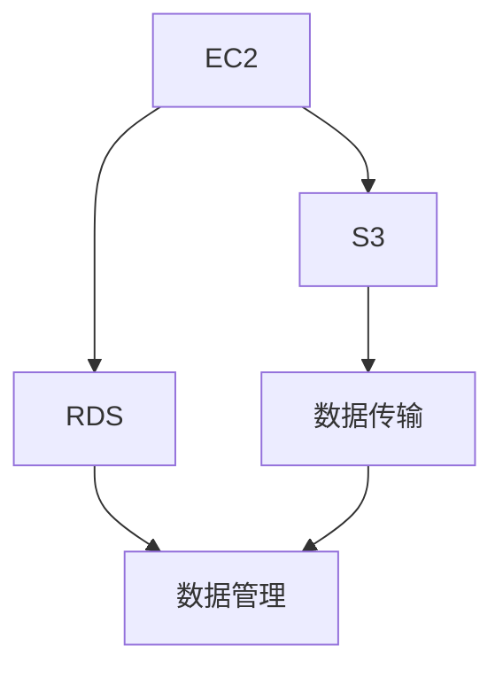

                 

# AWS 云服务：EC2、S3 和 RDS

> 关键词：云服务,EC2, S3, RDS, 服务器, 存储, 数据库, AWS, 计算, 存储, 数据库服务

## 1. 背景介绍

### 1.1 问题由来
随着云计算技术的迅猛发展，越来越多的企业开始采用云服务来满足其计算、存储和数据库需求。AWS（Amazon Web Services）作为全球领先的云服务提供商，提供了一系列丰富的云服务产品，包括计算、存储和数据库服务等，满足了各类企业的各种需求。

在云计算的各类服务中，EC2（Elastic Compute Cloud）、S3（Simple Storage Service）和RDS（Relational Database Service）是AWS最受用户欢迎的三大核心服务，广泛应用于各种规模的业务场景，从简单的Web应用开发到复杂的企业级数据处理，均能提供强大的支撑。

### 1.2 问题核心关键点
在实际应用中，选择合适的云服务产品并充分利用其各项特性，对于提高企业的计算、存储和数据处理效率，降低IT基础设施的运营成本至关重要。本文将详细介绍AWS的EC2、S3和RDS服务，帮助你全面掌握它们的核心功能、架构特点及其应用场景，以便在实际开发中能够更好地选择和使用这些服务。

## 2. 核心概念与联系

### 2.1 核心概念概述

为更好地理解AWS的EC2、S3和RDS服务，本节将介绍几个密切相关的核心概念：

- **EC2**：AWS的计算服务，提供高度可扩展的云虚拟服务器，企业可以按需购买虚拟机（VM）实例，快速构建和部署应用程序。

- **S3**：AWS的对象存储服务，提供高效、低成本、可扩展的存储解决方案，用于存储、检索和共享任意类型的文件。

- **RDS**：AWS的关系型数据库服务，提供易于扩展、高度可靠且性能优异的托管关系型数据库，支持多种数据库引擎，包括MySQL、PostgreSQL等。

这三个服务虽然功能不同，但彼此之间有着紧密的联系。它们均通过AWS的统一管理界面进行管理和操作，可以无缝集成，形成一个完整的云计算解决方案。同时，这三个服务均利用了AWS的云原生特性，如弹性扩展、高可用性和跨区域部署等，从而提供高性能和可靠性的保障。

这些核心概念之间的逻辑关系可以通过以下Mermaid流程图来展示：



这个流程图展示了她之间的关系：

1. **EC2**：作为计算资源的基础，能够提供计算能力。
2. **S3**：用于存储和管理数据，支持数据的传输和共享。
3. **RDS**：用于管理和管理数据库服务，支持数据的查询和处理。
4. **数据传输**：EC2、S3和RDS之间的数据流和同步。
5. **数据管理**：三个服务共同完成数据的存储、处理和管理。

这些核心概念共同构成了AWS的云服务体系，为企业提供了一个全方位、一体化的云平台。

## 3. 核心算法原理 & 具体操作步骤
### 3.1 算法原理概述

EC2、S3和RDS服务虽然功能不同，但都基于云计算的分布式架构进行设计，具备云原生的特点，如弹性扩展、高可用性、跨区域部署等。下面我们将分别介绍它们的算法原理和具体操作步骤。

### 3.2 算法步骤详解

**EC2服务算法步骤详解：**

1. **创建虚拟机实例**：用户通过AWS控制台或API创建EC2虚拟机实例，选择所需的计算资源（CPU、内存、存储等）、操作系统（Linux、Windows等）和实例类型（标准、内存优化、计算优化等）。

2. **配置实例**：设置实例的网络、安全组、存储和密钥对等配置信息。

3. **启动实例**：实例启动后，用户可以连接到实例进行操作或部署应用程序。

4. **实例管理**：通过AWS控制台或API对实例进行监控、维护和升级，如更换实例类型、扩容存储等。

**S3服务算法步骤详解：**

1. **创建存储桶**：用户通过AWS控制台或API创建S3存储桶，指定存储桶名称和区域。

2. **上传文件**：用户将文件上传到存储桶，可以设置文件访问权限和生命周期规则。

3. **文件管理**：通过AWS控制台或API对存储桶中的文件进行管理，如删除、复制、更新等。

4. **访问文件**：用户可以通过HTTPS协议访问S3文件，设置访问权限和访问控制列表。

**RDS服务算法步骤详解：**

1. **创建数据库实例**：用户通过AWS控制台或API创建RDS数据库实例，选择所需的数据库引擎（MySQL、PostgreSQL等）和实例类型。

2. **配置数据库**：设置数据库的存储、字符集、连接规则等配置信息。

3. **连接数据库**：通过AWS控制台或API连接到RDS数据库，进行数据的读取和写入操作。

4. **数据库管理**：通过AWS控制台或API对数据库进行监控、备份和升级，如自动备份、备份到S3等。

### 3.3 算法优缺点

**EC2服务的优缺点：**

- **优点**：
  - 灵活的计算资源配置：用户可以根据实际需求灵活配置计算资源。
  - 高度可扩展性：实例可以根据需要进行动态扩展或缩减。
  - 灵活的存储选项：可以选择不同的存储类型和性能。
- **缺点**：
  - 运行成本较高：对于计算密集型任务，运行成本可能较高。
  - 系统管理和维护：需要用户自行进行系统配置和维护。

**S3服务的优缺点：**

- **优点**：
  - 高可用性和数据持久性：数据自动跨可用区域进行备份和复制。
  - 高度可扩展性：可以存储海量的数据。
  - 易用性和灵活性：支持多种访问方式和权限管理。
- **缺点**：
  - 数据传输成本：大量数据传输会增加成本。
  - 数据保护：需要用户自行进行数据加密和备份。

**RDS服务的优缺点：**

- **优点**：
  - 自动扩展和高可用性：支持自动扩展和高可用性。
  - 自动备份和数据持久性：数据自动备份到S3。
  - 丰富的数据库引擎支持：支持多种数据库引擎。
- **缺点**：
  - 价格较高：对于高并发的读写操作，价格较高。
  - 数据库配置和管理：需要用户自行进行数据库配置和管理。

### 3.4 算法应用领域

EC2、S3和RDS服务广泛应用于各类业务场景，涵盖以下多个领域：

- **Web应用开发**：通过EC2和RDS构建Web应用的基础架构，提供高可用性和弹性扩展能力。
- **大数据处理**：利用S3存储海量数据，通过EC2和RDS进行数据查询和分析。
- **企业级应用**：通过EC2和RDS搭建企业级应用的基础平台，支持复杂的企业级数据处理。
- **物联网（IoT）**：通过EC2和S3存储和管理物联网设备产生的数据，通过RDS进行数据分析和决策。
- **内容交付网络（CDN）**：利用S3和EC2构建高效的内容交付网络，提供低延迟、高可用性内容服务。
- **区块链应用**：通过S3和RDS存储和管理区块链数据，利用EC2进行计算和处理。

这些应用场景展示了EC2、S3和RDS服务在云计算领域的广泛应用，为企业提供了强大的计算、存储和数据库支持。

## 4. 数学模型和公式 & 详细讲解 & 举例说明

### 4.1 数学模型构建

AWS的EC2、S3和RDS服务基于云计算的分布式架构进行设计，其核心思想是将计算、存储和数据库资源抽象为服务，用户通过API接口进行操作和访问。下面我们将使用数学模型来描述这些服务的核心算法。

### 4.2 公式推导过程

**EC2服务的核心算法：**

- **计算资源配置**：EC2服务通过配置虚拟机实例，提供计算资源。
  - 公式：$VM_{Instance} = CPU + Memory + Storage + Disk + Network$
  - 说明：VM实例的计算能力由CPU和内存决定，存储和磁盘用于存储数据，网络用于数据传输。

**S3服务的核心算法：**

- **数据存储和传输**：S3服务通过存储桶存储数据，提供高效的数据传输。
  - 公式：$Data_{Stored} = Storage_{Bucket} \times Size_{File} \times Count_{Files}$
  - 说明：数据存储量由存储桶大小、文件大小和文件数量决定。

**RDS服务的核心算法：**

- **数据库实例管理**：RDS服务通过配置数据库实例，提供关系型数据库支持。
  - 公式：$DB_{Instance} = CPU + Memory + Storage + Backup_{Frequency} \times Storage_{Backup}$
  - 说明：数据库实例的计算能力由CPU和内存决定，存储用于数据持久化，备份频率和备份存储量影响数据安全。

### 4.3 案例分析与讲解

**案例1：Web应用开发**

- **需求**：构建一个高可扩展、高可用性的Web应用。
- **解决方案**：
  - 使用EC2创建多个虚拟机实例，用于部署Web应用。
  - 使用S3存储Web应用所需的文件和静态资源。
  - 使用RDS存储Web应用的数据库信息，并提供数据存储和查询。
- **分析**：通过EC2和RDS的弹性扩展和高可用性特性，确保Web应用的稳定性和扩展性；S3提供高效的数据存储和传输，降低数据管理成本。

**案例2：大数据处理**

- **需求**：处理海量数据并进行分析。
- **解决方案**：
  - 使用EC2创建多个虚拟机实例，用于数据处理和计算。
  - 使用S3存储海量数据，确保数据持久性和高可用性。
  - 使用RDS存储处理后的数据，并支持数据查询和分析。
- **分析**：EC2和RDS提供高效的数据处理和分析能力，S3提供稳定的数据存储和备份，确保数据的完整性和可靠性。

## 5. 项目实践：代码实例和详细解释说明

### 5.1 开发环境搭建

在开始项目实践前，需要搭建好开发环境，以下是AWS EC2、S3和RDS服务的开发环境搭建流程：

1. **创建AWS账户**：访问AWS官网，注册并创建一个AWS账户。

2. **安装AWS CLI**：在本地安装AWS CLI，使用`pip install awscli`命令进行安装。

3. **配置AWS CLI**：通过`aws configure`命令，输入AWS账户信息和Region（如us-west-2），设置默认的Access Key ID和Secret Access Key。

4. **创建EC2实例**：通过AWS控制台或AWS CLI创建EC2实例，设置所需的计算资源和配置信息。

5. **创建S3桶**：通过AWS控制台或AWS CLI创建S3桶，设置存储桶名称和区域。

6. **创建RDS实例**：通过AWS控制台或AWS CLI创建RDS实例，选择所需的数据库引擎和实例类型。

完成上述步骤后，即可在本地搭建好AWS EC2、S3和RDS服务的开发环境。

### 5.2 源代码详细实现

下面是使用AWS CLI创建EC2、S3和RDS服务的Python代码示例：

**创建EC2实例：**

```python
import boto3

ec2 = boto3.resource('ec2')

instance = ec2.create_instances(
    ImageId='ami-0c55b159cbfafe1f0', # 选择适当的AMI
    MinCount=1,
    MaxCount=1,
    InstanceType='t2.micro',
    KeyName='my-key-pair'
)

print("EC2 instance created:", instance[0].id)
```

**创建S3桶：**

```python
import boto3

s3 = boto3.client('s3')

response = s3.create_bucket(
    Bucket='my-bucket', # 指定存储桶名称
    CreateBucketConfiguration={
        'LocationConstraint': 'us-west-2' # 指定存储桶区域
    }
)

print("S3 bucket created:", response['Location'])
```

**创建RDS实例：**

```python
import boto3

rds = boto3.client('rds')

response = rds.create_db_instance(
    DBInstanceIdentifier='my-instance', # 指定实例名称
    DBInstanceClass='db.t2.micro', # 指定实例类型
    Engine='mysql', # 指定数据库引擎
    MasterUsername='root', # 指定数据库用户名
    MasterUserPassword='my-password', # 指定数据库密码
    AllocatedStorage=5 # 指定存储容量
)

print("RDS instance created:", response['DBInstance']['DBInstanceIdentifier'])
```

### 5.3 代码解读与分析

通过以上代码，我们可以看到使用AWS CLI创建EC2、S3和RDS实例的完整流程。这些代码分别通过AWS CLI的`create_instances`、`create_bucket`和`create_db_instance`方法，创建了EC2实例、S3桶和RDS实例，并打印了实例的ID、位置和名称。

在实际应用中，用户可以根据实际需求调整创建实例的参数，如实例类型、存储容量、数据库引擎等。此外，AWS CLI还提供更多操作和配置选项，用户可以根据需要进一步扩展其功能。

### 5.4 运行结果展示

创建EC2实例、S3桶和RDS实例后，用户可以通过AWS控制台或AWS CLI进行进一步的操作和配置，如启动实例、上传文件、连接数据库等。以下是一些常见的运行结果展示：

- **EC2实例启动后**：
  - 在AWS控制台或AWS CLI查看实例状态，显示已启动。
  - 使用SSH工具连接到实例，进行系统配置和应用程序部署。

- **S3文件上传后**：
  - 在AWS控制台或AWS CLI查看文件状态，显示已上传。
  - 设置文件的访问权限和生命周期规则，确保数据安全。

- **RDS数据库连接后**：
  - 在AWS控制台或AWS CLI查看数据库状态，显示已启动。
  - 使用SQL工具连接数据库，进行数据查询和写入操作。

通过这些运行结果，用户可以直观地了解AWS EC2、S3和RDS服务的实际操作和效果。

## 6. 实际应用场景

### 6.1 智能客服系统

在智能客服系统中，EC2和RDS服务可以用于搭建高可扩展、高可靠性的后台基础设施，S3服务可以用于存储和管理大量的客户数据和聊天记录。通过EC2和RDS的弹性扩展和高可用性特性，确保系统的稳定性和扩展性；S3提供稳定的数据存储和备份，确保数据的完整性和可靠性。

### 6.2 金融舆情监测

在金融舆情监测系统中，EC2和RDS服务可以用于搭建实时数据处理和分析的基础平台，S3服务可以用于存储和管理大量的金融新闻、报道和评论数据。通过EC2和RDS的计算能力和存储能力，快速处理和分析海量数据，识别舆情变化趋势，提供实时预警和决策支持。

### 6.3 个性化推荐系统

在个性化推荐系统中，EC2和RDS服务可以用于搭建高可用性的推荐引擎和数据存储平台，S3服务可以用于存储和管理用户行为数据和物品信息。通过EC2和RDS的高可用性和弹性扩展特性，确保推荐引擎的稳定性和扩展性；S3提供稳定的数据存储和备份，确保数据的完整性和可靠性。

### 6.4 未来应用展望

未来，随着云计算技术的进一步发展和成熟，AWS的EC2、S3和RDS服务将变得更加强大和灵活。以下是对其未来应用展望：

- **更强大的计算能力**：随着CPU和内存技术的提升，EC2的计算能力将进一步增强。
- **更高效的数据存储**：随着存储技术的进步，S3的存储容量和速度将进一步提升。
- **更丰富的数据库引擎**：随着数据库技术的演进，RDS将支持更多的数据库引擎和功能。
- **更强大的弹性扩展和故障恢复能力**：通过自动扩展和备份机制，确保服务的稳定性和可靠性。

## 7. 工具和资源推荐

### 7.1 学习资源推荐

为了帮助开发者深入理解AWS的EC2、S3和RDS服务，以下是一些优质的学习资源：

1. **AWS官方文档**：AWS的官方文档提供了详细的服务介绍、API接口和最佳实践指南，是学习AWS服务的必备资料。

2. **《AWS云服务指南》**：这是一本由AWS工程师撰写的实用指南，详细介绍了AWS的各类服务和最佳实践。

3. **AWS认证课程**：AWS提供了多层次的认证课程，涵盖从基础到高级的各类课程，帮助开发者系统掌握AWS服务。

4. **AWS社区**：AWS的社区提供了大量的技术文章、教程和讨论组，是开发者交流和学习的好去处。

5. **AWS YouTube频道**：AWS的官方YouTube频道提供了大量的视频教程和演示，帮助开发者更好地理解AWS服务。

通过学习这些资源，开发者可以全面掌握AWS的EC2、S3和RDS服务，提高开发效率和质量。

### 7.2 开发工具推荐

以下是几款常用的AWS EC2、S3和RDS服务开发工具：

1. **AWS CLI**：AWS CLI是AWS提供的命令行工具，方便开发者通过命令行操作AWS服务。

2. **AWS SDKs**：AWS提供多语言的SDK（软件开发工具包），包括Python、Java、C#等，方便开发者使用不同编程语言操作AWS服务。

3. **AWS Management Console**：AWS的管理控制台提供了直观的界面，方便开发者进行服务配置和管理。

4. **AWS CloudFormation**：AWS CloudFormation是AWS提供的服务，可以自动化管理AWS资源，方便开发者快速搭建和部署基础设施。

5. **AWS Lambda**：AWS Lambda是AWS提供的无服务器计算服务，方便开发者编写和运行代码。

这些工具为开发者提供了便利的操作和管理方式，提高了开发效率和体验。

### 7.3 相关论文推荐

以下是几篇关于AWS EC2、S3和RDS服务的经典论文，推荐阅读：

1. **《EC2: Elastic Compute Cloud》**：介绍了AWS EC2服务的核心设计和功能。

2. **《S3: Simple Storage Service》**：介绍了AWS S3服务的核心设计和功能。

3. **《RDS: Relational Database Service》**：介绍了AWS RDS服务的核心设计和功能。

4. **《AWS EC2 Performance Optimization》**：介绍了AWS EC2实例性能优化的最佳实践。

5. **《AWS S3: Achieving High Scalability with S3》**：介绍了AWS S3服务的高可扩展性和数据持久性。

这些论文代表了大规模云服务的发展趋势和技术细节，帮助开发者深入理解AWS的EC2、S3和RDS服务，提供了丰富的实践经验和创新思路。

## 8. 总结：未来发展趋势与挑战

### 8.1 总结

本文对AWS的EC2、S3和RDS服务进行了全面系统的介绍。首先阐述了这三个服务在云计算中的核心作用和应用场景，明确了它们在云计算中的重要地位。其次，从原理到实践，详细讲解了这三个服务的核心功能和操作步骤，给出了服务操作的完整代码示例。同时，本文还广泛探讨了这三个服务在多个行业领域的应用前景，展示了其在云计算中的广泛应用。

通过本文的系统梳理，可以看到，AWS的EC2、S3和RDS服务在云计算中扮演着重要角色，为企业提供了强大的计算、存储和数据库支持。未来，随着云计算技术的持续演进，这些服务将变得更加强大和灵活，满足企业各种业务场景的需求。

### 8.2 未来发展趋势

展望未来，AWS的EC2、S3和RDS服务将呈现以下几个发展趋势：

1. **更强大的计算能力**：随着CPU和内存技术的提升，EC2的计算能力将进一步增强。

2. **更高效的数据存储**：随着存储技术的进步，S3的存储容量和速度将进一步提升。

3. **更丰富的数据库引擎**：随着数据库技术的演进，RDS将支持更多的数据库引擎和功能。

4. **更强大的弹性扩展和故障恢复能力**：通过自动扩展和备份机制，确保服务的稳定性和可靠性。

5. **更强大的安全性**：通过更严格的安全策略和监控机制，确保数据和服务的安全性。

6. **更丰富的服务集成和扩展性**：与其他AWS服务进行更紧密的集成和扩展，提供更全面的云解决方案。

以上趋势凸显了AWS的EC2、S3和RDS服务在云计算中的持续发展和创新，将为企业提供更加强大和灵活的云服务支持。

### 8.3 面临的挑战

尽管AWS的EC2、S3和RDS服务已经取得了巨大的成功，但在其发展过程中仍然面临一些挑战：

1. **成本控制**：随着业务规模的扩大，云计算服务的成本也可能逐渐增加。如何有效控制成本，是企业需要关注的重要问题。

2. **性能优化**：在高并发和大数据量的情况下，如何优化性能，确保服务的稳定性和可靠性，是一个重要挑战。

3. **安全性和合规性**：在云环境中，如何确保数据和服务的安全性，以及符合各种合规性要求，是一个重要的挑战。

4. **跨区域和跨账号的协同管理**：在多区域和多账号的环境中，如何有效管理和协调各账号和区域的服务，是一个挑战。

5. **开发和运维的复杂性**：随着服务种类和数量的增加，如何简化开发和运维流程，是一个挑战。

### 8.4 研究展望

面对AWS的EC2、S3和RDS服务面临的挑战，未来的研究需要在以下几个方面寻求新的突破：

1. **更高效的成本控制策略**：通过更精细的资源管理和调度，优化云计算服务的成本。

2. **更优化的性能优化算法**：开发更高效的算法和架构，提高服务的稳定性和扩展性。

3. **更强大的安全性和合规性保障**：通过更严格的安全策略和监控机制，确保数据和服务的安全性。

4. **更灵活的跨区域和跨账号管理**：开发更灵活的管理工具和策略，确保各账号和区域的服务协同工作。

5. **更简单的开发和运维流程**：开发更自动化和智能化的开发和运维工具，提高开发和运维效率。

这些研究方向的探索，将推动AWS的EC2、S3和RDS服务迈向更高的成熟度，为企业提供更强大和灵活的云服务支持。

## 9. 附录：常见问题与解答

**Q1：AWS的EC2、S3和RDS服务是否适用于所有业务场景？**

A: 是的，AWS的EC2、S3和RDS服务适用于各种规模和类型的业务场景，包括Web应用开发、大数据处理、企业级应用、物联网（IoT）、内容交付网络（CDN）、区块链应用等。

**Q2：AWS的EC2、S3和RDS服务的定价策略是什么？**

A: AWS的EC2、S3和RDS服务采用按需付费的定价策略，根据使用的资源和功能，按时间或按使用量进行计费。用户可以根据实际需求选择最适合的定价策略。

**Q3：AWS的EC2、S3和RDS服务在安全性方面有哪些保障？**

A: AWS的EC2、S3和RDS服务提供了一系列的安全保障措施，包括数据加密、身份认证、访问控制、审计日志等。用户可以通过设置安全策略和监控机制，确保数据和服务的安全性。

**Q4：AWS的EC2、S3和RDS服务是否支持跨区域部署？**

A: 是的，AWS的EC2、S3和RDS服务支持跨区域部署，用户可以根据实际需求选择最合适的区域进行部署。同时，AWS提供了跨区域数据同步和复制功能，确保数据的一致性和可靠性。

**Q5：AWS的EC2、S3和RDS服务是否支持多账号管理？**

A: 是的，AWS的EC2、S3和RDS服务支持多账号管理，用户可以在不同的AWS账号之间进行资源共享和协同工作。AWS提供了跨账号的身份认证和访问控制机制，确保资源的可靠性和安全性。

通过这些常见问题的解答，可以帮助开发者更好地理解AWS的EC2、S3和RDS服务，确保在实际应用中能够充分利用其功能和特性。

---

作者：禅与计算机程序设计艺术 / Zen and the Art of Computer Programming

