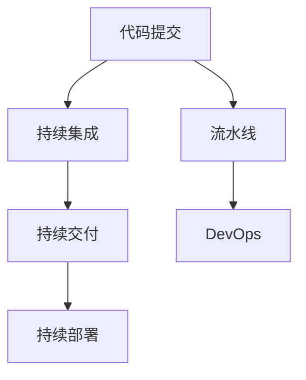
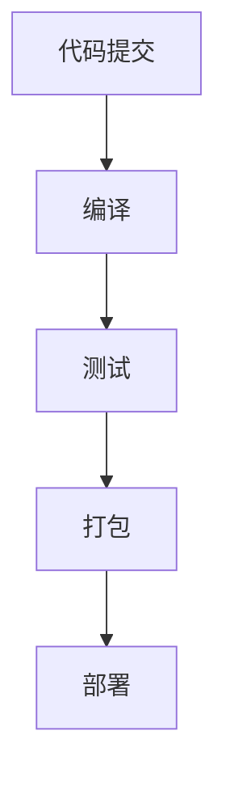

                 

# CI/CD管道：自动化软件交付流程

> 关键词：CI/CD, 自动化软件交付, 流水线, 持续集成, 持续交付, DevOps

## 1. 背景介绍

在当今快速变化的数字化时代，软件交付效率和质量是企业核心竞争力的重要体现。为了提高软件交付的速度和稳定性，越来越多的企业开始采用CI/CD（Continuous Integration/Continuous Delivery）管道，实现了从代码提交到软件部署的一站式自动化流程。CI/CD管道不仅极大地提升了软件开发效率，还显著降低了人为操作风险，成为现代软件开发的标准实践。

### 1.1 问题由来
软件开发流程传统上包括需求分析、设计、编码、测试、部署和运维等多个环节。每个环节都需要人为操作和审核，且环节之间依赖性强，容易出现瓶颈和错误。而CI/CD管道通过自动化流程优化，极大提升了各环节的协作效率和交付质量。

### 1.2 问题核心关键点
CI/CD管道的核心思想是将软件开发流程自动化，通过流水线化的流程实现快速、可靠的软件交付。CI/CD的关键组件包括：

1. **代码提交**：开发者通过版本控制系统（如Git）提交代码变更。
2. **持续集成(Continuous Integration, CI)**：自动构建和测试代码变更，确保变更符合预期。
3. **持续交付(Continuous Delivery, CD)**：自动部署测试通过的代码变更，确保软件可以随时发布。
4. **持续部署(Continuous Deployment, CD)**：在生产环境自动部署代码变更，提供无人工介入的自动化部署。

CI/CD管道的构建需要整合多种工具和技术，如自动化构建工具、版本控制系统、测试框架、容器化技术、持续集成/持续部署平台等。其核心在于自动化和持续性，确保软件交付的快速、可靠和高效。

## 2. 核心概念与联系

### 2.1 核心概念概述

为了更好地理解CI/CD管道的工作原理和应用，本节将介绍几个密切相关的核心概念：

- **持续集成(Continuous Integration, CI)**：指在软件开发过程中，持续不断地集成代码变更，并通过自动化测试验证其正确性。CI的目标是快速发现和修复代码问题，确保代码的持续稳定。
- **持续交付(Continuous Delivery, CD)**：指在软件开发过程中，持续不断地构建、测试和准备软件发布。CD的目标是确保软件能够快速、可靠地发布到生产环境。
- **持续部署(Continuous Deployment, CD)**：指在软件交付过程中，自动将软件部署到生产环境。CD的目标是实现无人工干预的自动化部署，提升软件交付的速度和频率。
- **流水线(Pipeline)**：将CI/CD管道划分为多个步骤，按照顺序依次执行。流水线将各环节有机结合，形成自动化的软件交付流程。
- **DevOps**：一种文化和实践，强调开发和运维的协同合作，通过自动化流程提升软件交付效率和质量。

这些核心概念之间的逻辑关系可以通过以下Mermaid流程图来展示：



这个流程图展示了她各个核心概念及其之间的关系：

1. 代码提交是CI/CD管道的起点，触发后续的自动化流程。
2. 持续集成通过自动化构建和测试，确保代码变更的稳定性和质量。
3. 持续交付通过自动化构建、测试和发布，确保软件可以随时发布。
4. 持续部署通过自动化发布到生产环境，实现无人工干预的自动化部署。
5. DevOps文化通过自动化流程和协作机制，提升软件开发效率和质量。

这些核心概念共同构成了CI/CD管道的理论基础，使得软件交付过程更加高效、可靠。

## 3. 核心算法原理 & 具体操作步骤

### 3.1 算法原理概述

CI/CD管道的核心算法原理是通过流水线化的自动化流程，实现从代码提交到软件部署的全程自动化。其核心思想是利用自动化工具和技术，将软件开发过程中的各个环节连接起来，形成无缝衔接的流水线。

### 3.2 算法步骤详解

CI/CD管道的实现步骤一般包括：

1. **初始化配置**：在CI/CD平台如Jenkins、GitLab CI、Travis CI等上配置流水线环境，定义代码库、构建工具、测试框架、发布策略等。
2. **自动化构建**：通过CI工具自动化构建代码变更，生成可部署的包（如JAR、Docker镜像等）。
3. **自动化测试**：通过自动化测试工具（如JUnit、Selenium等）执行单元测试、集成测试和端到端测试，确保代码变更符合预期。
4. **自动化部署**：通过CD工具自动化将测试通过的代码变更部署到预定义的测试环境和生产环境。
5. **持续监控**：通过DevOps工具（如Prometheus、Grafana等）持续监控软件运行状态，及时发现和修复问题。

### 3.3 算法优缺点

CI/CD管道具有以下优点：

1. **提升开发效率**：通过自动化流程，CI/CD管道极大提升了软件开发效率，减少了人为操作带来的延误。
2. **提高软件质量**：通过自动化测试和持续监控，CI/CD管道能够快速发现和修复代码问题，确保软件质量稳定。
3. **降低部署风险**：通过自动化部署和持续监控，CI/CD管道能够避免人为操作带来的错误，减少部署风险。
4. **支持持续交付**：通过CI/CD管道，企业能够快速响应市场需求，实现软件的快速迭代和发布。

同时，CI/CD管道也存在以下缺点：

1. **初始化复杂**：搭建和配置CI/CD管道需要一定的技术门槛，初始化配置复杂。
2. **依赖工具较多**：实现CI/CD管道需要整合多种工具和技术，依赖关系复杂。
3. **维护成本高**：CI/CD管道需要定期维护和优化，以适应技术发展和业务需求的变化。
4. **扩展性差**：规模较大的企业，单个CI/CD管道的扩展性和灵活性不足，难以适应复杂多变的业务需求。

### 3.4 算法应用领域

CI/CD管道已经在多个行业和应用场景中得到了广泛的应用，例如：

1. **软件开发**：通过CI/CD管道，软件开发团队能够快速构建、测试和发布代码变更，提高软件开发效率。
2. **运维管理**：通过CI/CD管道，运维团队能够自动化部署和发布软件更新，确保系统稳定运行。
3. **云平台管理**：通过CI/CD管道，云平台能够自动化部署和管理虚拟机、容器、微服务等，提高资源利用率。
4. **企业应用集成**：通过CI/CD管道，企业能够自动化集成和管理多个应用系统，提升系统集成度和业务协同能力。
5. **移动应用开发**：通过CI/CD管道，移动应用开发团队能够快速构建、测试和发布应用更新，提升用户体验。

除了上述这些经典应用外，CI/CD管道还被创新性地应用到更多场景中，如自动化测试、自动化安全测试、自动化监控等，为软件开发和技术运维带来了新的突破。

## 4. 数学模型和公式 & 详细讲解 & 举例说明

### 4.1 数学模型构建

CI/CD管道的数学模型通常包括以下几个关键组成部分：

1. **代码提交模型**：定义代码提交的过程和规则，包括代码变更的数量、频率、依赖关系等。
2. **自动化构建模型**：定义自动化构建的流程和规则，包括编译、打包、测试等环节。
3. **自动化测试模型**：定义自动化测试的流程和规则，包括单元测试、集成测试、端到端测试等。
4. **自动化部署模型**：定义自动化部署的流程和规则，包括环境配置、部署策略、回滚机制等。
5. **持续监控模型**：定义持续监控的流程和规则，包括数据采集、告警策略、异常处理等。

这些模型可以抽象为数学公式，表示为状态转移图或流程图。

### 4.2 公式推导过程

以自动化构建模型为例，推导其数学公式。假设CI/CD管道中定义了一个自动化构建的流程，包括三个阶段：编译、测试、打包。每个阶段的输入和输出可以表示为向量形式，如下：

$$
\text{编译输入} = \{x_1, x_2, x_3\}
$$
$$
\text{编译输出} = \{y_1, y_2\}
$$
$$
\text{测试输入} = \{y_1, x_4\}
$$
$$
\text{测试输出} = \{y_3, y_4\}
$$
$$
\text{打包输入} = \{y_3, y_4\}
$$
$$
\text{打包输出} = \{z_1, z_2\}
$$

其中，$x_i$ 表示输入参数，$y_i$ 表示中间结果，$z_i$ 表示最终输出。根据上述输入输出关系，可以推导出自动化构建的数学公式：

$$
f(x_1, x_2, x_3) = (y_1, y_2)
$$
$$
f(y_1, x_4) = (y_3, y_4)
$$
$$
f(y_3, y_4) = (z_1, z_2)
$$

通过以上公式，我们可以清晰地定义自动化构建的每个环节的输入输出关系，进一步优化流程和提高效率。

### 4.3 案例分析与讲解

假设某软件开发团队使用Jenkins搭建CI/CD管道，其自动化构建流程如下：

1. **编译**：使用Maven编译Java代码，生成编译结果。
2. **测试**：使用JUnit执行单元测试，生成测试结果。
3. **打包**：使用Maven打包生成JAR包，上传至 Nexus。

该流程可以表示为状态转移图，如下所示：



在状态转移图中，每个节点表示一个步骤，箭头表示数据流向。通过这种图形化的方式，我们可以清晰地看到整个自动化构建流程，便于管理和优化。

## 5. 项目实践：代码实例和详细解释说明

### 5.1 开发环境搭建

在进行CI/CD管道实践前，我们需要准备好开发环境。以下是使用Jenkins搭建CI/CD管道的环境配置流程：

1. **安装Jenkins**：从官网下载Jenkins，并根据操作系统要求进行安装。
2. **安装插件**：安装必要的插件，如Pipeline插件、Git插件、Maven插件等。
3. **配置代码库**：在Jenkins中添加代码仓库，并配置SCM（版本控制系统）如Git。
4. **配置构建流程**：在Jenkins中定义Pipeline脚本，描述自动化构建的流程和规则。
5. **配置测试框架**：在Pipeline脚本中集成测试框架，如JUnit、Selenium等。
6. **配置部署流程**：在Pipeline脚本中集成自动化部署流程，如Jenkins Pipeline插件、Maven等。

完成上述步骤后，即可在Jenkins上搭建完整的CI/CD管道，实现从代码提交到自动化部署的自动化流程。

### 5.2 源代码详细实现

下面我们以Jenkins Pipeline为例，给出构建自动化构建、测试、部署流程的PyTorch代码实现。

首先，定义Pipeline脚本：

```groovy
pipeline {
    agent any
    stages {
        stage('编译') {
            steps {
                sh 'mvn clean package'
            }
        }
        stage('测试') {
            steps {
                sh 'mvn test'
            }
        }
        stage('部署') {
            steps {
                sh 'mvn package'
                sh 'mvn deploy:deploy-file -Durl=file://${URL}/webapp/ -DartifactId=${ArtifactId} -Dversion=${Version}'
            }
        }
    }
}
```

其中，Pipeline脚本描述了三个阶段的构建流程，包括编译、测试、部署。每个阶段通过执行具体的shell命令完成对应的任务。

然后，在Jenkins上配置Pipeline脚本，并关联代码库。通过Pipeline脚本的定义，Jenkins能够自动执行整个构建流程，实现从代码提交到部署的自动化交付。

### 5.3 代码解读与分析

让我们再详细解读一下关键代码的实现细节：

**Pipeline脚本**：
- `pipeline`：定义Jenkins Pipeline
- `agent any`：指定使用任意可用的agent执行Pipeline脚本
- `stages`：定义Pipeline的阶段，包括编译、测试、部署
- `stage`：定义每个阶段的构建流程，通过`steps`属性指定具体执行命令
- `sh`：执行shell命令，用于编译、测试、部署等任务

**构建流程**：
- 编译阶段：通过`mvn clean package`命令编译Java代码，生成编译结果。
- 测试阶段：通过`mvn test`命令执行JUnit单元测试，生成测试结果。
- 部署阶段：通过`mvn package`命令打包生成JAR包，通过`mvn deploy:deploy-file`命令将JAR包部署到远程仓库。

通过以上代码实现，我们能够清晰地看到整个自动化构建流程，理解每个阶段的构建任务和执行命令。

### 5.4 运行结果展示

运行Pipeline脚本后，我们可以在Jenkins的控制台看到构建结果，包括编译、测试、部署等每个阶段的输出信息。如果构建失败，Jenkins会生成详细的错误报告，帮助我们定位问题。

以下是一个典型的Pipeline运行结果展示：

```plaintext
[Pipeline] [start] Starting a new Jenkins session for Pipeline.
[Pipeline] [start] Running step: sh mvn clean package
[Pipeline] [sh] mvn clean package
[Pipeline] [sh] echo mvn clean package ...
[Pipeline] [start] Running step: sh mvn test
[Pipeline] [sh] mvn test
[Pipeline] [sh] echo mvn test ...
[Pipeline] [start] Running step: sh mvn package
[Pipeline] [sh] mvn package
[Pipeline] [sh] echo mvn package ...
[Pipeline] [start] Running step: sh mvn deploy:deploy-file -Durl=file://${URL}/webapp/ -DartifactId=${ArtifactId} -Dversion=${Version}
[Pipeline] [sh] mvn deploy:deploy-file -Durl=file://${URL}/webapp/ -DartifactId=${ArtifactId} -Dversion=${Version}
[Pipeline] [sh] echo mvn deploy:deploy-file -Durl=file://${URL}/webapp/ -DartifactId=${ArtifactId} -Dversion=${Version} ...
[Pipeline] [end] Finished: SUCCESS
```

通过上述结果，我们可以看到整个自动化构建流程的执行过程和输出信息，帮助我们对构建结果进行分析和优化。

## 6. 实际应用场景

### 6.1 智能客服系统

基于CI/CD管道的智能客服系统，能够实现从代码提交到软件部署的全流程自动化。通过CI/CD管道，智能客服系统能够快速响应市场变化，持续优化系统功能，提升用户满意度。

在技术实现上，智能客服系统可以基于微服务架构进行构建，每个服务模块独立部署和迭代。通过CI/CD管道，每个服务模块可以独立进行构建、测试和部署，快速响应用户需求。

### 6.2 金融交易系统

金融交易系统对稳定性和实时性要求极高，任何小的代码变更都可能影响系统的稳定运行。通过CI/CD管道，金融交易系统能够实现代码变更的快速自动化部署和测试，确保系统始终处于稳定状态。

具体而言，金融交易系统可以将代码变更通过版本控制系统提交到CI/CD管道，自动触发构建、测试和部署流程。在测试阶段，通过自动化测试框架对代码变更进行严格测试，确保变更不会影响系统稳定性。在部署阶段，通过自动化部署流程将测试通过的变更快速部署到生产环境，实现无人工干预的自动化部署。

### 6.3 移动应用开发

移动应用开发通常需要频繁的迭代和发布，通过CI/CD管道，移动应用开发团队能够实现代码变更的快速构建、测试和部署，提升开发效率和用户体验。

具体而言，移动应用开发团队可以通过Git等版本控制系统提交代码变更，自动触发CI/CD管道的构建和测试流程。在测试阶段，通过自动化测试框架对代码变更进行严格测试，确保变更不会影响应用性能和稳定性。在部署阶段，通过自动化部署流程将测试通过的变更快速部署到应用商店，实现应用的快速迭代和发布。

### 6.4 未来应用展望

随着CI/CD管道的发展，其在更多领域的应用前景将更加广阔。未来，CI/CD管道将与更多前沿技术进行融合，如容器化技术、云平台、DevOps、机器学习等，进一步提升软件交付的效率和质量。

1. **容器化技术**：通过容器化技术，CI/CD管道能够实现应用的快速部署和迁移，提升系统的可扩展性和可靠性。
2. **云平台**：通过云平台，CI/CD管道能够实现应用的自动扩缩容和弹性伸缩，提升系统的资源利用率。
3. **DevOps**：通过DevOps文化和技术，CI/CD管道能够实现开发和运维的协同合作，提升系统的交付效率和质量。
4. **机器学习**：通过机器学习技术，CI/CD管道能够实现代码质量评估和问题预测，提升开发和运维的智能化水平。

总之，未来的CI/CD管道将更加智能化、自动化，为软件开发和系统运维带来更多的创新和突破。

## 7. 工具和资源推荐

### 7.1 学习资源推荐

为了帮助开发者系统掌握CI/CD管道的理论基础和实践技巧，这里推荐一些优质的学习资源：

1. **《Jenkins权威指南》**：详细介绍Jenkins的安装、配置、使用等方面的内容，是Jenkins学习的入门必读书籍。
2. **《DevOps实践指南》**：涵盖DevOps文化、工具、流程等方面的内容，深入浅出地介绍了DevOps的核心理念和实践。
3. **《CI/CD管道实战》**：通过实例讲解CI/CD管道的搭建和优化，涵盖Jenkins、GitLab CI、Travis CI等主流工具的使用。
4. **《持续交付的实践与模式》**：介绍持续交付的理论基础和实践模式，帮助理解CI/CD管道的核心思想和应用场景。

通过对这些资源的学习实践，相信你一定能够快速掌握CI/CD管道的精髓，并用于解决实际的开发和运维问题。

### 7.2 开发工具推荐

高效的开发离不开优秀的工具支持。以下是几款用于CI/CD管道开发的常用工具：

1. **Jenkins**：Jenkins是一款开源的持续集成工具，支持多种版本控制系统、构建工具、测试框架等，是CI/CD管道的主流选择。
2. **GitLab CI**：GitLab CI是一款基于GitLab的持续集成工具，支持CI/CD管道的搭建和优化，适合团队协作和版本管理。
3. **Travis CI**：Travis CI是一款基于云端的持续集成工具，支持多种编程语言和构建工具，是开源项目的常用选择。
4. **CircleCI**：CircleCI是一款基于云端的持续集成工具，支持多种编程语言和构建工具，支持自动部署和发布。
5. **Jenkins Pipeline**：Jenkins Pipeline是Jenkins的扩展插件，支持Pipeline脚本的编写和执行，能够实现复杂的自动化流程。

合理利用这些工具，可以显著提升CI/CD管道的开发效率，加快创新迭代的步伐。

### 7.3 相关论文推荐

CI/CD管道的技术发展源于学界的持续研究。以下是几篇奠基性的相关论文，推荐阅读：

1. **《Continuous Integration for Software Evolution》**：提出持续集成方法，通过频繁的代码提交和集成测试，提升软件开发质量。
2. **《Continuous Delivery: Reliable Software Releases through Automation》**：介绍持续交付的实现方法，通过自动化构建、测试和部署，确保软件可靠发布。
3. **《Pipeline As Code: The Automation-Driven DevOps Revolution》**：介绍Pipeline As Code的概念和实现方法，通过代码化的Pipeline脚本，提升CI/CD管道的可维护性和可扩展性。
4. **《Automating the Boring Stuff with Jenkins》**：详细介绍Jenkins的安装、配置、使用等方面的内容，是Jenkins学习的入门必读书籍。

这些论文代表了大规模软件开发和交付的理论基础，通过学习这些前沿成果，可以帮助研究者把握学科前进方向，激发更多的创新灵感。

## 8. 总结：未来发展趋势与挑战

### 8.1 研究成果总结

本文对CI/CD管道进行了全面系统的介绍。首先阐述了CI/CD管道的背景和核心思想，明确了管道在软件开发中的重要性。其次，从原理到实践，详细讲解了CI/CD管道的数学模型和关键步骤，给出了CI/CD管道搭建的完整代码实例。同时，本文还广泛探讨了CI/CD管道在智能客服、金融交易、移动应用等领域的实际应用前景，展示了管道的巨大潜力。此外，本文精选了CI/CD管道的各类学习资源，力求为读者提供全方位的技术指引。

通过本文的系统梳理，可以看到，CI/CD管道已经成为现代软件开发的标准实践，极大地提升了软件交付的速度和质量。未来，伴随CI/CD管道的发展，软件开发将更加高效、可靠和智能化。

### 8.2 未来发展趋势

展望未来，CI/CD管道将呈现以下几个发展趋势：

1. **容器化技术的普及**：通过容器化技术，CI/CD管道能够实现应用的快速部署和迁移，提升系统的可扩展性和可靠性。
2. **云平台的广泛应用**：通过云平台，CI/CD管道能够实现应用的自动扩缩容和弹性伸缩，提升系统的资源利用率。
3. **DevOps文化的深入**：通过DevOps文化和技术，CI/CD管道能够实现开发和运维的协同合作，提升系统的交付效率和质量。
4. **机器学习的融合**：通过机器学习技术，CI/CD管道能够实现代码质量评估和问题预测，提升开发和运维的智能化水平。
5. **微服务架构的普及**：通过微服务架构，CI/CD管道能够实现系统的模块化和可扩展性，提升系统的灵活性和可靠性。

以上趋势凸显了CI/CD管道的广阔前景。这些方向的探索发展，必将进一步提升软件开发和系统运维的效率和质量，为数字化时代带来更多创新和突破。

### 8.3 面临的挑战

尽管CI/CD管道已经取得了瞩目成就，但在迈向更加智能化、普适化应用的过程中，它仍面临着诸多挑战：

1. **初始化复杂**：搭建和配置CI/CD管道需要一定的技术门槛，初始化配置复杂。
2. **依赖工具较多**：实现CI/CD管道需要整合多种工具和技术，依赖关系复杂。
3. **维护成本高**：CI/CD管道需要定期维护和优化，以适应技术发展和业务需求的变化。
4. **扩展性差**：规模较大的企业，单个CI/CD管道的扩展性和灵活性不足，难以适应复杂多变的业务需求。
5. **安全性和可靠性**：CI/CD管道在部署和发布过程中，需要考虑代码变更的安全性和可靠性，避免潜在的安全漏洞。

正视CI/CD管道面临的这些挑战，积极应对并寻求突破，将是其走向成熟的必由之路。相信随着学界和产业界的共同努力，这些挑战终将一一被克服，CI/CD管道必将在构建人机协同的智能时代中扮演越来越重要的角色。

### 8.4 研究展望

面对CI/CD管道所面临的种种挑战，未来的研究需要在以下几个方面寻求新的突破：

1. **自动化流程优化**：开发更加高效、灵活的自动化流程，降低CI/CD管道的配置和维护成本。
2. **工具链整合优化**：通过整合多种工具和技术，构建更加统一、高效的CI/CD管道。
3. **多云平台支持**：支持多种云平台和容器编排技术，提升CI/CD管道的扩展性和可靠性。
4. **安全和可靠性保障**：通过代码扫描、漏洞检测等技术，提升CI/CD管道部署和发布的安全性和可靠性。
5. **智能化和自动化**：引入机器学习、人工智能技术，提升CI/CD管道的智能化水平，实现自动化的预测和优化。

这些研究方向的探索，必将引领CI/CD管道技术迈向更高的台阶，为软件开发和系统运维带来更多的创新和突破。面向未来，CI/CD管道需要与其他人工智能技术进行更深入的融合，如知识表示、因果推理、强化学习等，多路径协同发力，共同推动软件开发技术的进步。只有勇于创新、敢于突破，才能不断拓展CI/CD管道的边界，让智能技术更好地造福人类社会。

## 9. 附录：常见问题与解答

**Q1：CI/CD管道是否适用于所有软件开发项目？**

A: CI/CD管道适用于大多数软件开发项目，特别是对于需要频繁迭代和发布的项目。但对于一些规模较小、需求变化较少的项目，CI/CD管道的复杂性和维护成本可能较高。在实际应用中，需要根据具体项目的特点进行选择。

**Q2：如何选择合适的CI/CD工具？**

A: 选择合适的CI/CD工具需要考虑多个因素，如项目规模、技术栈、团队规模、需求变化等。一般来说，可以从以下几个方面进行评估：
1. 工具的兼容性和支持度：确保CI/CD工具支持项目中使用的编程语言、框架、库等。
2. 工具的易用性和学习成本：选择简单易用、文档齐全的工具，降低团队的学习成本。
3. 工具的扩展性和可定制性：选择可扩展、可定制的工具，能够满足不同业务需求。
4. 工具的稳定性和可靠性：选择稳定可靠的工具，避免频繁出现故障和停机。

**Q3：如何降低CI/CD管道的维护成本？**

A: 降低CI/CD管道的维护成本需要从以下几个方面进行优化：
1. 自动化流程优化：设计高效、灵活的自动化流程，减少人工操作和手动干预。
2. 工具链整合优化：通过整合多种工具和技术，构建统一、高效的CI/CD管道。
3. 持续监控和反馈：通过持续监控和反馈机制，及时发现和修复问题，避免出现瓶颈和故障。
4. 自动化测试和部署：通过自动化测试和部署，减少人为操作带来的错误，提升系统的可靠性和稳定性。
5. 持续学习和改进：通过持续学习和改进，不断优化CI/CD管道的性能和效率。

**Q4：CI/CD管道在部署和发布过程中需要注意哪些问题？**

A: 在部署和发布过程中，CI/CD管道需要注意以下问题：
1. 环境一致性：确保部署和发布环境与测试环境一致，避免环境差异带来的问题。
2. 数据迁移：在部署和发布过程中，需要考虑数据的迁移和备份，确保数据的完整性和可用性。
3. 版本控制：通过版本控制工具，确保每次部署和发布的版本唯一性，避免回滚和冲突。
4. 安全性和合规性：在部署和发布过程中，需要考虑代码变更的安全性和合规性，避免潜在的安全漏洞和合规问题。
5. 监控和告警：在部署和发布后，需要进行持续监控和告警，确保系统的稳定性和可靠性。

这些因素的综合考虑，有助于保障CI/CD管道在部署和发布过程中的稳定性和可靠性。

**Q5：如何实现CI/CD管道的微服务和模块化？**

A: 实现CI/CD管道的微服务和模块化，需要从以下几个方面进行优化：
1. 微服务设计：根据业务需求和系统架构，设计合理的微服务模块，每个微服务独立构建、测试和部署。
2. 容器化技术：通过容器化技术，实现微服务的快速部署和迁移，提升系统的可扩展性和可靠性。
3. 自动化流程优化：设计高效、灵活的自动化流程，减少人工操作和手动干预。
4. 持续监控和反馈：通过持续监控和反馈机制，及时发现和修复问题，避免出现瓶颈和故障。
5. 版本控制：通过版本控制工具，确保每次部署和发布的版本唯一性，避免回滚和冲突。

通过以上优化措施，可以实现CI/CD管道的微服务和模块化，提升系统的灵活性和可靠性。

总之，CI/CD管道已经成为现代软件开发的标准实践，极大地提升了软件交付的速度和质量。未来，伴随CI/CD管道的发展，软件开发将更加高效、可靠和智能化。面向未来，CI/CD管道需要与其他人工智能技术进行更深入的融合，如知识表示、因果推理、强化学习等，多路径协同发力，共同推动软件开发技术的进步。只有勇于创新、敢于突破，才能不断拓展CI/CD管道的边界，让智能技术更好地造福人类社会。

---

作者：禅与计算机程序设计艺术 / Zen and the Art of Computer Programming

