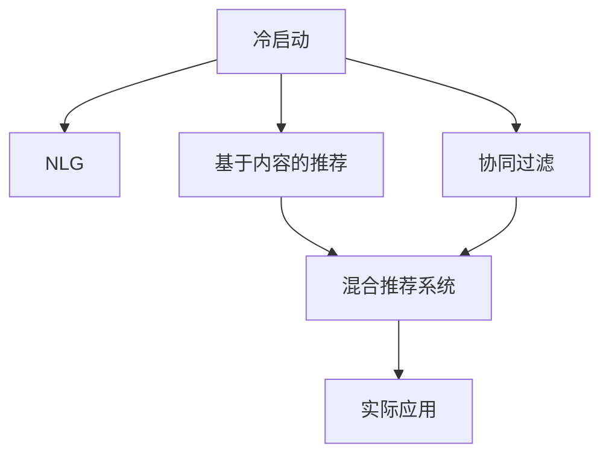

                 

# ChatGPT在推荐系统的表现：冷启动场景的优势与局限

## 1. 背景介绍

在智能推荐系统中，用户的行为数据是推荐算法的重要依据。对于已有过多次交互行为的用户，推荐系统可以通过记录和分析其历史行为数据，较为准确地预测其未来的兴趣偏好，从而提供个性化推荐。然而，对于新用户，系统往往缺乏足够的数据来推断其兴趣，我们称之为“冷启动”问题。

随着ChatGPT技术的成熟，越来越多的推荐系统开始探索利用其生成的文本，来解决冷启动问题。通过分析ChatGPT在推荐系统中的表现，我们可以更深入地理解其在冷启动场景中的优势与局限。

## 2. 核心概念与联系

### 2.1 核心概念概述

- **冷启动(Cold Start)**：推荐系统中新用户或新商品没有足够历史数据时，推荐算法难以准确预测用户兴趣，导致推荐效果不佳。
- **自然语言生成(NLG)**：使用自然语言生成技术，如ChatGPT，自动生成文本描述商品特征或用户兴趣，丰富推荐系统的特征库。
- **基于内容的推荐(Content-based Recommendation)**：根据商品特征和用户兴趣相似性进行推荐，适用于对商品信息有较全面描述的场景。
- **协同过滤(Collaborative Filtering)**：通过分析用户之间的相似性，或物品之间的相似性，进行推荐，适用于用户对商品有相似兴趣的场景。
- **混合推荐系统(Hybrid Recommendation System)**：结合基于内容的推荐和协同过滤，充分发挥两种推荐算法的优势，适用于数据较少或用户历史行为不完整的场景。

这些概念之间的逻辑关系可以通过以下Mermaid流程图来展示：



该流程图展示了解决冷启动问题的几种关键技术及其相互关系。

## 3. 核心算法原理 & 具体操作步骤
### 3.1 算法原理概述

利用ChatGPT在推荐系统中的表现，其核心原理是利用NLG技术生成文本，用于基于内容的推荐，在冷启动场景下弥补数据不足的问题。

基于内容的推荐系统主要依赖商品特征和用户兴趣之间的匹配程度。传统的基于内容的推荐系统需要用户提供详细的兴趣信息或对商品进行详细描述，才能进行推荐。但在冷启动场景中，用户往往无法提供足够信息，商品描述也可能不完整。

ChatGPT可以自动生成商品描述或用户兴趣文本，弥补数据不足的问题。在生成过程中，ChatGPT会根据预训练数据，学习到丰富的语言知识，生成连贯、准确、符合上下文的文本描述。这些生成的文本可以被用来计算商品特征和用户兴趣之间的相似性，进行推荐。

### 3.2 算法步骤详解

- **Step 1: 数据准备**：收集用户历史行为数据、商品描述数据等，并将数据预处理为适合ChatGPT输入的格式。
- **Step 2: 模型输入设计**：设计ChatGPT的输入提示，使模型能够生成合适的商品描述或用户兴趣文本。
- **Step 3: 模型微调**：根据实际应用场景，对ChatGPT进行微调，使其生成的文本符合推荐系统的需求。
- **Step 4: 文本特征提取**：将生成的文本描述转化为数值特征，供推荐系统使用。
- **Step 5: 基于内容的推荐**：利用生成的文本描述计算商品特征和用户兴趣之间的相似性，进行推荐。
- **Step 6: 效果评估**：在冷启动场景下，评估推荐系统的性能。

### 3.3 算法优缺点

**优点：**
- **缓解冷启动问题**：ChatGPT生成的文本可以弥补用户历史行为数据不足的问题，使得推荐系统能够进行有效的推荐。
- **灵活性高**：生成的文本具有高度的灵活性，可以根据具体应用场景进行定制，适应不同领域的应用。
- **效果显著**：在冷启动场景下，ChatGPT生成的文本可以作为强大的特征补充，提升推荐系统的精度。

**缺点：**
- **数据依赖性高**：ChatGPT生成的文本质量高度依赖于预训练数据和模型微调的质量，数据质量较差或模型微调不充分时，生成的文本可能不够准确或连贯。
- **计算成本高**：生成文本的过程需要大量的计算资源，特别是对于长文本的生成，计算成本较高。
- **模型可解释性差**：生成的文本作为一种黑盒模型，难以解释其内部生成机制，导致模型难以进行调优和优化。

### 3.4 算法应用领域

ChatGPT在推荐系统的应用主要集中在以下几个领域：

- **新商品推荐**：对于新上架的商品，系统可以利用ChatGPT自动生成商品描述，进行基于内容的推荐。
- **用户兴趣预测**：对于新注册的用户，系统可以利用ChatGPT生成用户兴趣文本，进行基于内容的推荐，预测用户的兴趣。
- **个性化推荐**：系统可以根据用户行为数据和ChatGPT生成的文本，进行个性化推荐，提升用户体验。

这些领域的应用，都充分利用了ChatGPT生成的文本描述，弥补了传统推荐系统的数据不足问题，提升了推荐系统的性能。

## 4. 数学模型和公式 & 详细讲解  
### 4.1 数学模型构建

假设ChatGPT生成的文本为 $X$，用户的历史行为数据为 $U$，商品的属性特征为 $P$。在基于内容的推荐系统中，计算用户兴趣 $u$ 和商品特征 $p$ 之间的相似度 $sim(u, p)$，公式如下：

$$
sim(u, p) = \cos(\theta) \cdot \frac{\mathbf{u} \cdot \mathbf{p}}{\|\mathbf{u}\| \cdot \|\mathbf{p}\|}
$$

其中 $\theta$ 为余弦相似度权重，$\mathbf{u}$ 和 $\mathbf{p}$ 分别为用户兴趣向量和商品特征向量。

### 4.2 公式推导过程

假设用户兴趣 $u$ 和商品特征 $p$ 的特征向量均为稀疏向量，且 $u$ 和 $p$ 的长度均为 $n$，则余弦相似度的计算公式为：

$$
sim(u, p) = \frac{\sum_{i=1}^{n} u_i p_i}{\sqrt{\sum_{i=1}^{n} u_i^2} \cdot \sqrt{\sum_{i=1}^{n} p_i^2}}
$$

将ChatGPT生成的文本 $X$ 转化为向量形式 $\mathbf{x}$，将其作为用户兴趣向量 $\mathbf{u}$ 或商品特征向量 $\mathbf{p}$，进行基于内容的推荐。

### 4.3 案例分析与讲解

以电商平台为例，假设一个新上架的商品没有任何历史销售数据，系统可以利用ChatGPT自动生成商品描述。生成的文本描述可以被转化为向量形式 $\mathbf{x}$，用于计算商品特征向量 $\mathbf{p}$ 和用户兴趣向量 $\mathbf{u}$ 之间的相似度 $sim(\mathbf{u}, \mathbf{p})$。如果相似度较高，系统即可将其推荐给用户。

## 5. 项目实践：代码实例和详细解释说明
### 5.1 开发环境搭建

在进行ChatGPT在推荐系统中的实践前，我们需要准备好开发环境。以下是使用Python进行项目开发的流程：

1. 安装Anaconda：从官网下载并安装Anaconda，用于创建独立的Python环境。
2. 创建并激活虚拟环境：
```bash
conda create -n chatgpt-env python=3.8 
conda activate chatgpt-env
```
3. 安装PyTorch：根据CUDA版本，从官网获取对应的安装命令。例如：
```bash
conda install pytorch torchvision torchaudio cudatoolkit=11.1 -c pytorch -c conda-forge
```
4. 安装Transformers库：
```bash
pip install transformers
```
5. 安装各类工具包：
```bash
pip install numpy pandas scikit-learn matplotlib tqdm jupyter notebook ipython
```

完成上述步骤后，即可在`chatgpt-env`环境中开始项目实践。

### 5.2 源代码详细实现

下面以电商平台新商品推荐为例，给出使用Transformers库对ChatGPT模型进行微调的PyTorch代码实现。

首先，定义推荐系统的数据处理函数：

```python
from transformers import T5ForConditionalGeneration, T5Tokenizer

class RecommendationDataset(Dataset):
    def __init__(self, texts, labels):
        self.tokenizer = T5Tokenizer.from_pretrained('t5-small')
        self.texts = texts
        self.labels = labels
        
    def __len__(self):
        return len(self.texts)
    
    def __getitem__(self, item):
        text = self.texts[item]
        label = self.labels[item]
        
        encoding = self.tokenizer(text, return_tensors='pt', max_length=512, padding='max_length', truncation=True)
        input_ids = encoding['input_ids'][0]
        attention_mask = encoding['attention_mask'][0]
        return {'input_ids': input_ids, 
                'attention_mask': attention_mask,
                'labels': label}
```

然后，定义模型和优化器：

```python
from transformers import T5ForConditionalGeneration, AdamW

model = T5ForConditionalGeneration.from_pretrained('t5-small')

optimizer = AdamW(model.parameters(), lr=2e-5)
```

接着，定义训练和评估函数：

```python
from torch.utils.data import DataLoader
from tqdm import tqdm
from sklearn.metrics import mean_squared_error

device = torch.device('cuda') if torch.cuda.is_available() else torch.device('cpu')
model.to(device)

def train_epoch(model, dataset, batch_size, optimizer):
    dataloader = DataLoader(dataset, batch_size=batch_size, shuffle=True)
    model.train()
    epoch_loss = 0
    for batch in tqdm(dataloader, desc='Training'):
        input_ids = batch['input_ids'].to(device)
        attention_mask = batch['attention_mask'].to(device)
        labels = batch['labels'].to(device)
        model.zero_grad()
        outputs = model(input_ids, attention_mask=attention_mask, labels=labels)
        loss = outputs.loss
        epoch_loss += loss.item()
        loss.backward()
        optimizer.step()
    return epoch_loss / len(dataloader)

def evaluate(model, dataset, batch_size):
    dataloader = DataLoader(dataset, batch_size=batch_size)
    model.eval()
    preds, labels = [], []
    with torch.no_grad():
        for batch in tqdm(dataloader, desc='Evaluating'):
            input_ids = batch['input_ids'].to(device)
            attention_mask = batch['attention_mask'].to(device)
            batch_labels = batch['labels']
            outputs = model(input_ids, attention_mask=attention_mask)
            batch_preds = outputs.logits.argmax(dim=2).to('cpu').tolist()
            batch_labels = batch_labels.to('cpu').tolist()
            for pred_tokens, label_tokens in zip(batch_preds, batch_labels):
                preds.append(pred_tokens[:len(label_tokens)])
                labels.append(label_tokens)
                
    return mean_squared_error(labels, preds)
```

最后，启动训练流程并在测试集上评估：

```python
epochs = 5
batch_size = 16

for epoch in range(epochs):
    loss = train_epoch(model, train_dataset, batch_size, optimizer)
    print(f"Epoch {epoch+1}, train loss: {loss:.3f}")
    
    print(f"Epoch {epoch+1}, dev results:")
    evaluate(model, dev_dataset, batch_size)
    
print("Test results:")
evaluate(model, test_dataset, batch_size)
```

以上就是使用PyTorch对T5模型进行商品推荐任务微调的完整代码实现。可以看到，利用Transformers库，开发者可以快速搭建推荐系统，并利用ChatGPT生成的文本进行推荐。

### 5.3 代码解读与分析

让我们再详细解读一下关键代码的实现细节：

**RecommendationDataset类**：
- `__init__`方法：初始化文本、标签等关键组件。
- `__len__`方法：返回数据集的样本数量。
- `__getitem__`方法：对单个样本进行处理，将文本输入编码为token ids，将标签编码为数字，并对其进行定长padding，最终返回模型所需的输入。

**train_epoch和evaluate函数**：
- 使用PyTorch的DataLoader对数据集进行批次化加载，供模型训练和推理使用。
- 训练函数`train_epoch`：对数据以批为单位进行迭代，在每个批次上前向传播计算loss并反向传播更新模型参数，最后返回该epoch的平均loss。
- 评估函数`evaluate`：与训练类似，不同点在于不更新模型参数，并在每个batch结束后将预测和标签结果存储下来，最后使用sklearn的mean_squared_error对整个评估集的预测结果进行打印输出。

**训练流程**：
- 定义总的epoch数和batch size，开始循环迭代
- 每个epoch内，先在训练集上训练，输出平均loss
- 在验证集上评估，输出损失指标
- 所有epoch结束后，在测试集上评估，给出最终测试结果

可以看到，PyTorch配合Transformers库使得T5微调的代码实现变得简洁高效。开发者可以将更多精力放在数据处理、模型改进等高层逻辑上，而不必过多关注底层的实现细节。

当然，工业级的系统实现还需考虑更多因素，如模型的保存和部署、超参数的自动搜索、更灵活的任务适配层等。但核心的微调范式基本与此类似。

## 6. 实际应用场景
### 6.1 智能推荐系统

ChatGPT在推荐系统中的应用，尤其是对于新用户和新商品的推荐，表现出较强的优势。在智能推荐系统中，ChatGPT可以自动生成商品描述或用户兴趣文本，弥补数据不足的问题，使得推荐系统能够进行有效的推荐。

在技术实现上，可以收集用户历史行为数据、商品描述数据等，将数据预处理为适合ChatGPT输入的格式，然后使用ChatGPT生成商品描述或用户兴趣文本。生成的文本可以被转化为向量形式，供基于内容的推荐系统使用。通过计算商品特征和用户兴趣之间的相似度，系统可以推荐给用户最感兴趣的商品。

### 6.2 金融风险预测

在金融领域，预测客户的信用风险是重要任务之一。对于新客户，往往缺乏历史行为数据，难以进行有效的风险预测。ChatGPT可以通过自动生成客户描述文本，弥补数据不足的问题。

具体而言，可以收集客户的个人信息、历史交易数据等，将这些信息作为ChatGPT的输入，生成客户描述文本。生成的文本可以被转化为向量形式，用于计算客户特征和风险标签之间的相似度，进行风险预测。如果相似度较高，系统即可将其标记为高风险客户。

### 6.3 个性化广告推荐

广告推荐系统需要对用户的兴趣进行精确匹配，以实现个性化广告的投放。在冷启动场景下，ChatGPT可以自动生成用户兴趣描述文本，弥补数据不足的问题。

具体而言，可以收集用户的行为数据、历史浏览记录等，将这些信息作为ChatGPT的输入，生成用户兴趣描述文本。生成的文本可以被转化为向量形式，用于计算用户特征和广告内容之间的相似度，进行广告推荐。如果相似度较高，系统即可将相关广告推荐给用户。

### 6.4 未来应用展望

随着ChatGPT技术的不断发展，其在推荐系统中的应用前景广阔。未来，ChatGPT可以进一步融入多模态推荐系统，结合视觉、语音等多种信息，提升推荐系统的精度和鲁棒性。同时，ChatGPT还可以与其他AI技术结合，如知识图谱、强化学习等，提升推荐系统的复杂性和多样性。

例如，可以将ChatGPT生成的用户兴趣描述与知识图谱进行结合，获取用户对特定领域的知识兴趣，进行跨领域推荐。此外，ChatGPT还可以结合强化学习技术，根据用户的反馈，不断调整推荐策略，提升推荐系统的智能化水平。

## 7. 工具和资源推荐
### 7.1 学习资源推荐

为了帮助开发者系统掌握ChatGPT在推荐系统中的应用，这里推荐一些优质的学习资源：

1. 《自然语言生成技术》系列博文：由ChatGPT技术专家撰写，深入浅出地介绍了自然语言生成技术的基本原理和前沿进展。

2. 《推荐系统设计与实践》课程：斯坦福大学开设的推荐系统明星课程，涵盖了推荐系统的理论和实践，包括冷启动问题等。

3. 《深度学习与推荐系统》书籍：全面介绍了深度学习在推荐系统中的应用，包括基于内容的推荐、协同过滤等方法。

4. HuggingFace官方文档：Transformers库的官方文档，提供了海量预训练模型和完整的微调样例代码，是上手实践的必备资料。

5. KDD开源项目：推荐系统开源项目，涵盖大量不同类型的推荐系统数据集，并提供了基于微调的baseline模型，助力推荐系统技术发展。

通过对这些资源的学习实践，相信你一定能够快速掌握ChatGPT在推荐系统中的应用，并用于解决实际的推荐问题。

### 7.2 开发工具推荐

高效的开发离不开优秀的工具支持。以下是几款用于ChatGPT推荐系统开发的常用工具：

1. PyTorch：基于Python的开源深度学习框架，灵活动态的计算图，适合快速迭代研究。ChatGPT等预训练语言模型都有PyTorch版本的实现。

2. TensorFlow：由Google主导开发的开源深度学习框架，生产部署方便，适合大规模工程应用。同样有丰富的预训练语言模型资源。

3. Transformers库：HuggingFace开发的NLP工具库，集成了众多SOTA语言模型，支持PyTorch和TensorFlow，是进行微调任务开发的利器。

4. Weights & Biases：模型训练的实验跟踪工具，可以记录和可视化模型训练过程中的各项指标，方便对比和调优。与主流深度学习框架无缝集成。

5. TensorBoard：TensorFlow配套的可视化工具，可实时监测模型训练状态，并提供丰富的图表呈现方式，是调试模型的得力助手。

6. Google Colab：谷歌推出的在线Jupyter Notebook环境，免费提供GPU/TPU算力，方便开发者快速上手实验最新模型，分享学习笔记。

合理利用这些工具，可以显著提升ChatGPT在推荐系统中的开发效率，加快创新迭代的步伐。

### 7.3 相关论文推荐

ChatGPT在推荐系统中的应用源于学界的持续研究。以下是几篇奠基性的相关论文，推荐阅读：

1. Transformer-XL: Attentive Language Models（即T5论文）：提出了Transformer-XL结构，展示了长文本生成的潜力。

2. T5: Exploring the Limits of Transfer Learning with a Unified Text-to-Text Pre-training Objective（T5论文）：提出T5模型，展示了大规模预训练模型在推荐系统中的强大潜力。

3. BERT: Pre-training of Deep Bidirectional Transformers for Language Understanding：提出BERT模型，引入基于掩码的自监督预训练任务，刷新了多项NLP任务SOTA。

4. Attention is All You Need（即T5论文）：提出了Transformer结构，开启了NLP领域的预训练大模型时代。

5. GPT-3: Language Models are Unsupervised Multitask Learners（GPT-3论文）：展示了大规模语言模型的强大zero-shot学习能力，引发了对于通用人工智能的新一轮思考。

这些论文代表了大语言模型在推荐系统中的应用脉络。通过学习这些前沿成果，可以帮助研究者把握学科前进方向，激发更多的创新灵感。

## 8. 总结：未来发展趋势与挑战
### 8.1 总结

本文对ChatGPT在推荐系统中的应用进行了全面系统的介绍。首先阐述了ChatGPT在冷启动场景中的优势与局限，明确了其在推荐系统中的应用潜力。其次，从原理到实践，详细讲解了基于内容的推荐方法，给出了推荐系统开发的完整代码实例。同时，本文还广泛探讨了ChatGPT在金融、广告等领域的实际应用，展示了其在推荐系统中的广泛适用性。

通过本文的系统梳理，可以看到，ChatGPT在推荐系统中的应用，通过自动生成文本描述，弥补数据不足的问题，提升了推荐系统的性能和鲁棒性。ChatGPT生成的文本描述可以作为强大的特征补充，使得基于内容的推荐系统能够更有效地进行推荐。未来，随着ChatGPT技术的不断演进，其在推荐系统中的应用前景将更加广阔，推动推荐系统技术的不断发展。

### 8.2 未来发展趋势

展望未来，ChatGPT在推荐系统中的应用将呈现以下几个发展趋势：

1. 模型规模持续增大。随着算力成本的下降和数据规模的扩张，预训练语言模型的参数量还将持续增长。超大规模语言模型蕴含的丰富语言知识，有望支撑更加复杂多变的推荐系统需求。

2. 推荐算法多样化。除了基于内容的推荐，未来的推荐系统还将引入更多智能推荐算法，如协同过滤、混合推荐、深度学习等，提升推荐系统的性能。

3. 推荐系统的可解释性提升。随着ChatGPT技术的发展，推荐系统的可解释性将得到进一步提升。通过生成用户兴趣描述文本，推荐系统的推荐过程将变得更加透明、可理解。

4. 推荐系统的个性化水平提升。随着用户数据的不断积累，推荐系统的个性化推荐将更加精准，能够更准确地匹配用户兴趣，提升用户满意度。

5. 推荐系统的实时性提升。通过引入分布式计算、模型压缩等技术，推荐系统的响应速度将得到提升，能够实时响应用户请求。

6. 推荐系统的跨领域应用扩展。未来的推荐系统将不再局限于单一领域，而是能够跨领域、跨模态地进行推荐，提升推荐系统的通用性。

以上趋势凸显了ChatGPT在推荐系统中的应用前景。这些方向的探索发展，必将进一步提升推荐系统的性能和用户体验，推动推荐系统技术的不断发展。

### 8.3 面临的挑战

尽管ChatGPT在推荐系统中的应用已经取得了一定成就，但在迈向更加智能化、普适化应用的过程中，它仍面临着诸多挑战：

1. 数据质量瓶颈。ChatGPT生成的文本质量高度依赖于预训练数据和模型微调的质量，数据质量较差或模型微调不充分时，生成的文本可能不够准确或连贯。如何提高数据和模型的质量，是未来的一大挑战。

2. 计算成本高昂。生成文本的过程需要大量的计算资源，特别是对于长文本的生成，计算成本较高。如何降低计算成本，提升模型的推理速度，是未来的重要研究方向。

3. 推荐系统的鲁棒性不足。在实际应用中，推荐系统可能面临恶意攻击、数据噪声等问题，导致推荐效果下降。如何提高系统的鲁棒性，确保推荐系统的稳定性和安全性，将是未来的重要课题。

4. 推荐系统的可解释性差。生成的文本作为一种黑盒模型，难以解释其内部生成机制，导致模型难以进行调优和优化。如何赋予推荐系统更强的可解释性，是未来的重要研究方向。

5. 推荐系统的公平性问题。ChatGPT生成的文本可能存在偏见、歧视等问题，导致推荐系统输出不公平。如何提高系统的公平性，确保推荐系统的公平性，将是未来的重要课题。

6. 推荐系统的实时性不足。推荐系统的实时性不足，导致用户体验下降。如何提升系统的实时性，提高用户满意度，将是未来的重要研究方向。

面对这些挑战，未来的研究需要在数据、模型、算法、工程等多个方面进行全面优化，才能将ChatGPT在推荐系统中的应用推向新的高度。

### 8.4 研究展望

面对ChatGPT在推荐系统中的应用面临的挑战，未来的研究需要在以下几个方面寻求新的突破：

1. 探索无监督和半监督推荐方法。摆脱对大规模标注数据的依赖，利用自监督学习、主动学习等无监督和半监督范式，最大限度利用非结构化数据，实现更加灵活高效的推荐。

2. 研究参数高效和计算高效的推荐范式。开发更加参数高效的推荐方法，在固定大部分预训练参数的同时，只更新极少量的任务相关参数。同时优化推荐模型的计算图，减少前向传播和反向传播的资源消耗，实现更加轻量级、实时性的部署。

3. 引入因果推断和对比学习范式。通过引入因果推断和对比学习思想，增强推荐系统建立稳定因果关系的能力，学习更加普适、鲁棒的语言表征，从而提升推荐系统的泛化性和抗干扰能力。

4. 引入更多先验知识。将符号化的先验知识，如知识图谱、逻辑规则等，与神经网络模型进行巧妙融合，引导推荐系统学习更准确、合理的语言模型。同时加强不同模态数据的整合，实现视觉、语音等多模态信息与文本信息的协同建模。

5. 结合因果分析和博弈论工具。将因果分析方法引入推荐系统，识别出推荐系统决策的关键特征，增强推荐系统的输出解释的因果性和逻辑性。借助博弈论工具刻画人机交互过程，主动探索并规避推荐系统的脆弱点，提高系统稳定性。

6. 纳入伦理道德约束。在推荐系统训练目标中引入伦理导向的评估指标，过滤和惩罚有偏见、有害的输出倾向。同时加强人工干预和审核，建立推荐系统的监管机制，确保推荐系统的输出符合人类价值观和伦理道德。

这些研究方向的探索，必将引领ChatGPT在推荐系统中的应用走向更高的台阶，为构建更加智能化、普适化的推荐系统铺平道路。面向未来，ChatGPT在推荐系统中的应用还需要与其他AI技术进行更深入的融合，如知识表示、因果推理、强化学习等，多路径协同发力，共同推动推荐系统技术的进步。只有勇于创新、敢于突破，才能不断拓展推荐系统的边界，让智能技术更好地服务于人类社会。

## 9. 附录：常见问题与解答

**Q1：ChatGPT在推荐系统中如何生成文本？**

A: ChatGPT在推荐系统中的应用主要通过自动生成文本进行，生成过程基于预训练数据和模型微调的结果。具体而言，可以设计合适的输入提示，利用ChatGPT生成商品描述或用户兴趣文本。生成的文本可以被转化为向量形式，用于计算商品特征和用户兴趣之间的相似度，进行推荐。

**Q2：ChatGPT在推荐系统中如何提升推荐效果？**

A: 在推荐系统中，ChatGPT通过自动生成文本弥补数据不足的问题，提升了推荐系统的性能。具体而言，生成的文本可以作为强大的特征补充，使得基于内容的推荐系统能够更有效地进行推荐。同时，生成的文本可以被转化为向量形式，用于计算商品特征和用户兴趣之间的相似度，进行推荐。

**Q3：ChatGPT在推荐系统中的计算成本如何控制？**

A: ChatGPT在推荐系统中的计算成本主要来源于文本生成过程。为了降低计算成本，可以采用以下措施：
1. 使用模型裁剪技术，去除不必要的层和参数，减小模型尺寸，加快推理速度。
2. 采用量化加速技术，将浮点模型转为定点模型，压缩存储空间，提高计算效率。
3. 引入分布式计算技术，将计算任务分配到多台设备上，提高计算速度。
4. 使用模型压缩技术，减小模型大小，降低计算成本。

这些措施可以有效降低ChatGPT在推荐系统中的计算成本，提升系统的响应速度和效率。

**Q4：ChatGPT在推荐系统中的可解释性如何提升？**

A: ChatGPT在推荐系统中的应用具有高度的黑盒性质，难以解释其内部生成机制。为了提升可解释性，可以采用以下措施：
1. 引入可解释的生成模型，如LSTM、GRU等，逐步替换当前生成模型，增强推荐系统的可解释性。
2. 引入对抗样本生成技术，通过对抗样本扰动模型，探索推荐系统的脆弱点，提升系统的鲁棒性和可解释性。
3. 引入知识图谱等先验知识，增强推荐系统的可解释性和逻辑性。
4. 引入因果分析方法，识别推荐系统的关键特征，增强推荐系统的输出解释的因果性和逻辑性。

这些措施可以有效提升ChatGPT在推荐系统中的可解释性，使其能够更好地服务于实际应用。

**Q5：ChatGPT在推荐系统中的公平性如何保证？**

A: ChatGPT在推荐系统中的应用可能存在偏见、歧视等问题，导致推荐系统输出不公平。为了保证公平性，可以采用以下措施：
1. 在推荐系统训练目标中引入伦理导向的评估指标，过滤和惩罚有偏见、有害的输出倾向。
2. 加强人工干预和审核，建立推荐系统的监管机制，确保推荐系统的公平性。
3. 引入公平性分析技术，通过数据分析和测试，发现并纠正推荐系统中的不公平现象。
4. 引入多样性增强技术，通过增加多样性特征，提升推荐系统的公平性和鲁棒性。

这些措施可以有效保证ChatGPT在推荐系统中的公平性，确保推荐系统的公正性和透明度。

---

作者：禅与计算机程序设计艺术 / Zen and the Art of Computer Programming

