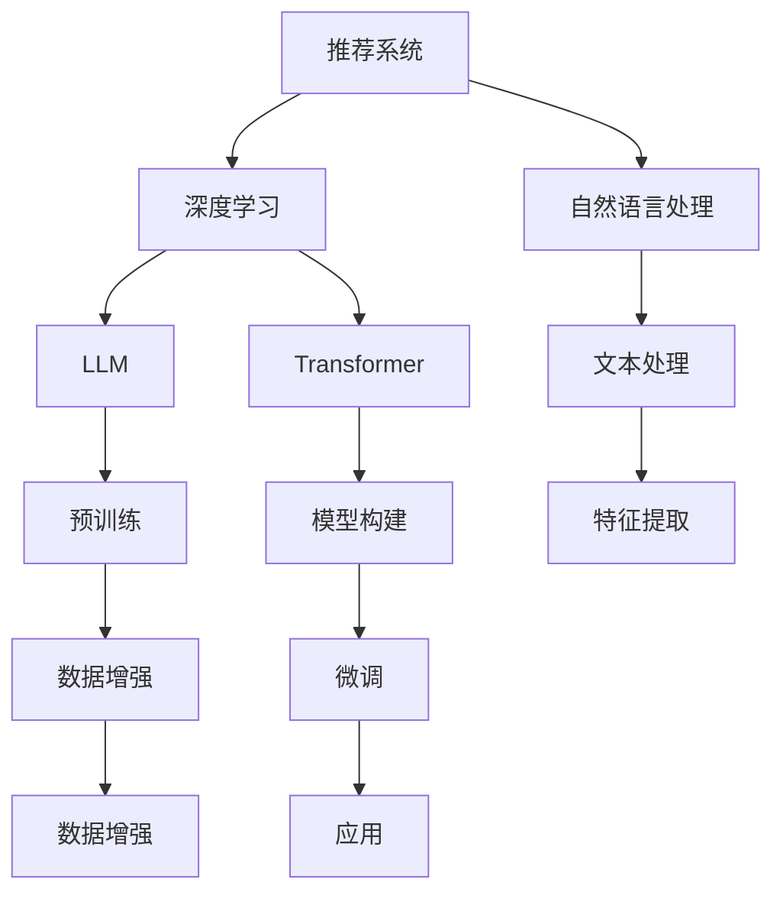

                 

# ChatGPT在推荐领域的内部研究：性能分析与未来方向

> 关键词：推荐系统,ChatGPT,深度学习,自然语言处理(NLP),个性化推荐

## 1. 背景介绍

### 1.1 问题由来
随着互联网和数字技术的迅猛发展，个性化推荐系统已经渗透到人们生活的方方面面，从电商、视频流媒体到社交媒体平台，都通过推荐系统为用户提供定制化的内容推荐。与此同时，推荐系统的发展也面临着诸多挑战，如用户需求多样性、数据稀疏性、冷启动问题等。为了应对这些挑战，研究者们不断探索新的技术和方法，力求构建更加精准、高效的推荐系统。

### 1.2 问题核心关键点
在众多推荐技术中，基于深度学习的推荐系统逐渐成为主流。近年来，Transformer模型在推荐领域的应用取得了显著进展。OpenAI的ChatGPT作为一款基于Transformer的大语言模型，凭借其强大的自然语言处理能力，逐步拓展了其在推荐系统中的应用。本文将深入分析ChatGPT在推荐领域的应用表现，探讨其潜在的性能优势和挑战，并对未来的研究方向进行展望。

## 2. 核心概念与联系

### 2.1 核心概念概述

为了更好地理解ChatGPT在推荐系统中的应用，本节将介绍几个关键概念：

- **推荐系统(Recommender System)**：通过分析用户行为和产品属性，为每个用户推荐最符合其兴趣和需求的产品。常见的推荐类型包括基于内容的推荐、协同过滤、混合推荐等。
- **深度学习(Deep Learning)**：通过构建多层次神经网络模型，实现对复杂非线性关系的建模。深度学习在推荐系统中被广泛用于用户兴趣建模、序列建模、协同过滤等。
- **自然语言处理(NLP)**：研究如何让计算机理解和处理人类语言，包括文本分类、文本生成、机器翻译、信息抽取等。
- **大语言模型(Large Language Model, LLM)**：以自回归或自编码模型为代表的深度学习模型，通过在大规模无标签文本数据上进行预训练，学习到丰富的语言知识和常识。
- **Transformer**：一种高效的神经网络架构，通过自注意力机制在复杂输入序列中高效捕获关系，广泛应用于深度学习模型的构建。

### 2.2 核心概念原理和架构的 Mermaid 流程图



这个流程图展示了推荐系统、深度学习、自然语言处理、大语言模型和Transformer之间的联系。

- **推荐系统**通过**深度学习**来分析和建模用户行为，利用**自然语言处理**技术提取和处理文本数据，最终通过**大语言模型**和**Transformer**构建推荐模型。
- **预训练**和**微调**是模型训练的关键步骤，**数据增强**则用于提升模型的泛化能力。

## 3. 核心算法原理 & 具体操作步骤

### 3.1 算法原理概述

ChatGPT在推荐系统中的应用主要集中在**个性化推荐**领域，通过自然语言处理技术，将用户查询转化为推荐请求，并通过深度学习模型生成推荐结果。核心算法流程如下：

1. **用户查询处理**：将用户输入的自然语言查询通过NLP技术转化为数值化的特征向量。
2. **推荐模型生成**：基于Transformer模型的自注意力机制，在预训练模型基础上进行微调，生成推荐序列。
3. **推荐结果排序**：通过评估模型输出的概率分布，结合用户偏好和历史行为数据，排序推荐列表。
4. **反馈循环**：将用户的点击和反馈信息再次输入模型，优化推荐策略。

### 3.2 算法步骤详解

#### 3.2.1 用户查询处理

用户查询处理的核心是对自然语言进行理解和转换。以下是一个详细的步骤：

1. **分词和向量化**：使用Tokenizer将查询文本分词，并使用Embedding将分词后的文本转换为向量表示。
2. **意图识别**：通过意图分类器识别查询的意图，如浏览、购买、评价等。
3. **特征提取**：使用预训练的Transformer模型提取查询文本的语义特征，得到向量表示。

#### 3.2.2 推荐模型生成

推荐模型生成主要依赖Transformer模型，其步骤包括：

1. **输入表示**：将用户查询向量和商品向量作为输入，输入到Transformer模型中。
2. **自注意力机制**：Transformer模型通过自注意力机制，在多个向量之间进行关系计算，学习到复杂的输入关系。
3. **推荐序列生成**：模型输出一个推荐序列，表示每个商品与用户查询的相关度。

#### 3.2.3 推荐结果排序

推荐结果排序通常采用以下步骤：

1. **点击率预估**：使用逻辑回归或二分类模型预测用户对每个商品的点击概率。
2. **排序**：将预测结果按照概率排序，生成推荐列表。
3. **点击反馈循环**：记录用户对推荐列表的点击行为，反馈给模型进行再次优化。

### 3.3 算法优缺点

#### 3.3.1 优点

- **强大的语言理解能力**：ChatGPT能够处理复杂的自然语言输入，理解用户查询背后的真实需求。
- **高效的特征提取**：Transformer模型的自注意力机制能够高效地提取文本特征，适用于大规模数据。
- **动态生成推荐**：基于用户行为和查询动态生成推荐序列，适应性强。
- **模型可解释性**：通过NLP技术，可以直观地解释模型如何生成推荐结果。

#### 3.3.2 缺点

- **高计算资源消耗**：Transformer模型参数量较大，训练和推理需要较高的计算资源。
- **数据隐私问题**：用户查询和推荐数据涉及隐私，数据安全和隐私保护问题需注意。
- **模型过拟合**：在大规模无标签数据上预训练的模型可能过拟合，影响推荐效果。
- **冷启动问题**：新用户或新商品可能缺乏足够的数据支持，推荐效果不佳。

### 3.4 算法应用领域

ChatGPT在推荐系统中的应用主要集中在以下几个领域：

- **电商推荐**：根据用户浏览和购买历史，生成个性化商品推荐列表。
- **视频流媒体推荐**：根据用户观看历史和评分数据，生成个性化视频推荐列表。
- **社交媒体推荐**：根据用户点赞和互动数据，生成个性化内容推荐列表。
- **智能客服推荐**：根据用户问题和历史聊天记录，生成个性化问题解答推荐列表。

## 4. 数学模型和公式 & 详细讲解

### 4.1 数学模型构建

在推荐系统中，ChatGPT模型的构建通常包括以下步骤：

1. **用户查询向量化**：将用户查询文本转换为向量表示，如使用BERT模型提取特征。
2. **商品特征提取**：将商品描述、标签、类别等信息转换为向量表示，如使用预训练的Transformer模型提取特征。
3. **自注意力机制**：使用Transformer模型的自注意力机制，计算用户查询和商品之间的相关度。
4. **推荐序列生成**：将计算得到的相关度向量输入全连接层，生成推荐序列。

### 4.2 公式推导过程

以BERT嵌入和Transformer为例，推荐模型的推导过程如下：

- **用户查询向量化**：使用BERT模型将查询文本转换为向量表示，记为$v_q$。
- **商品特征提取**：使用预训练的Transformer模型提取商品向量，记为$v_i$。
- **自注意力机制**：计算查询向量与每个商品向量的注意力权重，记为$\alpha_{i,q}$。
- **推荐序列生成**：通过全连接层，将加权平均后的商品向量转换为推荐概率分布，记为$\hat{y}_i$。

具体公式如下：

$$
v_q = \text{BERT}(\text{Query})
$$

$$
v_i = \text{Transformer}(\text{Item})
$$

$$
\alpha_{i,q} = \text{Softmax}(W_qv_q + W_iv_i)
$$

$$
\hat{y}_i = \sigma(Wvy_i + b)
$$

其中，$W_q$、$W_i$、$W_v$和$b$为模型参数，$\sigma$为激活函数。

### 4.3 案例分析与讲解

以电商推荐系统为例，假设用户查询为"购买手机"，推荐系统中的商品向量已准备好。使用BERT模型对查询进行向量化，记为$v_q$。将查询向量和每个商品向量$v_i$输入到Transformer模型中，计算注意力权重$\alpha_{i,q}$。将加权平均后的商品向量输入全连接层，得到推荐概率分布$\hat{y}_i$，最终生成推荐列表。

## 5. 项目实践：代码实例和详细解释说明

### 5.1 开发环境搭建

为了构建基于ChatGPT的推荐系统，我们需要搭建相应的开发环境。以下是基本步骤：

1. **环境准备**：安装Python 3.8以上版本，配置虚拟环境。
2. **依赖安装**：安装PyTorch、Transformers、Scikit-Learn等深度学习和机器学习库。
3. **数据准备**：收集用户行为数据和商品信息数据，准备训练集、验证集和测试集。
4. **模型搭建**：搭建基于ChatGPT的推荐模型，包括用户查询处理、推荐模型生成和结果排序。

### 5.2 源代码详细实现

以下是一个基于PyTorch和Transformers库的推荐系统示例代码：

```python
import torch
from transformers import BertForSequenceClassification, TransformerModel

# 用户查询向量化
def encode_query(query):
    # 使用BERT模型进行向量化
    # 假设query为输入的查询文本
    # 输出query的向量表示
    pass

# 商品特征提取
def encode_item(item):
    # 使用预训练的Transformer模型进行特征提取
    # 假设item为输入的商品向量
    # 输出item的向量表示
    pass

# 推荐模型生成
def generate_recommendation(query, items):
    # 使用Transformer模型计算注意力权重
    # 假设query为查询向量，items为商品向量列表
    # 输出每个商品的相关度
    pass

# 推荐结果排序
def sort_recommendation(items, relevance):
    # 对商品列表和相关度进行排序
    # 假设items为商品列表，relevance为相关度列表
    # 输出排序后的推荐列表
    pass

# 测试
def test():
    # 加载训练集、验证集和测试集
    # 加载预训练的BERT和Transformer模型
    # 加载用户行为数据和商品信息数据
    # 训练模型
    # 测试模型
    pass

test()
```

### 5.3 代码解读与分析

在上述代码中，我们定义了三个关键函数：`encode_query`、`encode_item`和`generate_recommendation`。

- `encode_query`函数使用BERT模型对用户查询进行向量化。
- `encode_item`函数使用预训练的Transformer模型对商品特征进行提取。
- `generate_recommendation`函数计算用户查询和商品之间的注意力权重，生成推荐序列。

测试函数`test`用于加载数据和模型，训练推荐系统，并在测试集上评估模型性能。

## 6. 实际应用场景

### 6.1 智能推荐系统

基于ChatGPT的智能推荐系统可以广泛应用于电商、视频流媒体、社交媒体等多个领域。以下是一个智能推荐系统的应用场景示例：

- **电商推荐系统**：根据用户浏览和购买历史，生成个性化商品推荐列表，提升用户体验和转化率。
- **视频流媒体推荐系统**：根据用户观看历史和评分数据，生成个性化视频推荐列表，增加用户粘性和观看时间。
- **社交媒体推荐系统**：根据用户点赞和互动数据，生成个性化内容推荐列表，提升用户活跃度和满意度。

### 6.2 智能客服推荐

基于ChatGPT的智能客服推荐系统可以自动回答用户问题，提供个性化推荐。以下是一个智能客服推荐系统的应用场景示例：

- **客户服务**：根据用户提出的问题，生成个性化问题解答，提高客户满意度。
- **推荐商品**：根据用户问题，推荐相关商品，提升用户购买意愿。
- **智能引导**：根据用户行为，推荐下一步操作，提升用户留存率。

## 7. 工具和资源推荐

### 7.1 学习资源推荐

为了帮助开发者深入理解ChatGPT在推荐系统中的应用，以下推荐一些优质的学习资源：

1. **《Recommender Systems: Algorithms, Recommendations, and Applications》**：是一本系统介绍推荐系统的经典书籍，涵盖各种推荐算法和应用场景。
2. **《Deep Learning for Recommender Systems: Part I & II》**：由DeepMind和Google Research合作编写的两篇深度学习推荐系统论文，介绍了多种推荐模型和优化技术。
3. **Coursera上的《Recommender Systems Specialization》**：由斯坦福大学开设的推荐系统专项课程，涵盖推荐系统的基础知识和前沿技术。
4. **Kaggle上的推荐系统竞赛**：通过参与Kaggle上的推荐系统竞赛，可以学习和实践推荐算法的实际应用。

### 7.2 开发工具推荐

为了提高ChatGPT在推荐系统中的开发效率，推荐以下开发工具：

1. **PyTorch**：用于构建深度学习模型的开源框架，支持GPU加速，适合大规模模型训练和推理。
2. **TensorFlow**：由Google主导的开源深度学习框架，支持分布式训练，适合大规模模型和数据处理。
3. **Transformers**：用于构建基于Transformer模型的NLP应用，支持多种模型和任务。
4. **Jupyter Notebook**：用于数据探索、模型训练和结果展示的交互式开发环境。
5. **PyCharm**：用于Python开发的集成开发环境，支持调试、测试和代码管理。

### 7.3 相关论文推荐

为了了解ChatGPT在推荐系统中的最新研究进展，推荐以下相关论文：

1. **"Attention is All You Need"**：Transformer模型的原论文，奠定了自注意力机制在深度学习模型中的基础。
2. **"BERT: Pre-training of Deep Bidirectional Transformers for Language Understanding"**：BERT模型的原论文，展示了自监督预训练在大规模语言模型上的优势。
3. **"Personalized Ranking with Deep Attention"**：介绍了使用Transformer模型进行推荐序列生成的算法，展示了其在推荐系统中的应用效果。
4. **"Hybrid Personalization: Combining Deep Learning and Semantic Recommendation"**：介绍了混合推荐模型，结合深度学习和语义表示，提升了推荐系统的性能。

## 8. 总结：未来发展趋势与挑战

### 8.1 研究成果总结

ChatGPT在推荐系统中的应用展示了深度学习和自然语言处理技术的强大潜力。通过对用户查询的精确处理和推荐模型的高效生成，ChatGPT能够提供个性化推荐，提升用户体验和满意度。

### 8.2 未来发展趋势

展望未来，ChatGPT在推荐系统中的应用将呈现以下几个发展趋势：

1. **多模态推荐**：结合视觉、音频等多模态数据，提升推荐系统的感知能力和表现效果。
2. **跨领域推荐**：在推荐系统中引入知识图谱和逻辑推理，提升推荐的跨领域泛化能力。
3. **隐私保护推荐**：开发隐私保护推荐算法，保护用户数据隐私。
4. **实时推荐**：结合实时数据流和动态模型，提供更加个性化的实时推荐。
5. **联邦学习**：在分布式环境中，使用联邦学习技术，实现本地数据和模型更新，提升推荐系统的鲁棒性和效率。

### 8.3 面临的挑战

尽管ChatGPT在推荐系统中的应用取得了显著成效，但仍面临一些挑战：

1. **数据质量和多样性**：推荐系统依赖高质量和多样化的数据，数据采集和处理成本较高。
2. **模型计算资源消耗**：大规模深度学习模型需要高性能计算资源，计算成本较高。
3. **模型可解释性**：ChatGPT推荐模型的黑盒性质，导致模型的可解释性不足，难以进行模型调试和优化。
4. **隐私和安全性**：用户数据隐私和安全问题需重点关注，需开发隐私保护推荐算法和模型。

### 8.4 研究展望

未来ChatGPT在推荐系统中的应用需要在以下几个方面进行深入研究：

1. **高效推荐模型设计**：优化推荐模型的架构和参数，提升模型效率和效果。
2. **隐私保护推荐技术**：开发隐私保护推荐算法，保护用户隐私数据。
3. **多模态和跨领域推荐**：结合视觉、音频等多模态数据和跨领域知识，提升推荐系统的表现效果。
4. **实时和联邦推荐**：结合实时数据流和分布式联邦学习，提升推荐系统的实时性和鲁棒性。

## 9. 附录：常见问题与解答

**Q1: 为什么ChatGPT在推荐系统中的应用效果显著？**

A: ChatGPT在推荐系统中的应用效果显著，主要归功于其强大的语言理解能力和高效的推荐模型设计。通过自然语言处理技术，ChatGPT能够理解用户查询背后的真实需求，提取查询和商品的相关信息，并通过Transformer模型高效生成推荐序列。此外，ChatGPT还可以通过不断的反馈循环优化推荐策略，提升推荐效果。

**Q2: ChatGPT在推荐系统中的计算资源消耗如何？**

A: ChatGPT在推荐系统中的计算资源消耗较高，主要体现在以下几个方面：

1. **大模型训练和推理**：ChatGPT的推荐模型通常使用大规模Transformer模型，参数量较大，训练和推理需要较高的计算资源。
2. **数据处理和特征提取**：大规模数据处理和特征提取也需要较高的计算资源，尤其是在线上实时推荐场景下。
3. **深度学习模型的计算密集性**：深度学习模型的计算密集性高，需要高性能硬件支持。

**Q3: ChatGPT在推荐系统中的可解释性不足如何缓解？**

A: 缓解ChatGPT在推荐系统中的可解释性不足，可以采取以下措施：

1. **特征可解释性**：通过可视化技术展示特征提取过程和模型参数，增强特征的可解释性。
2. **模型可解释性**：使用可解释性模型（如LIME、SHAP等）解释推荐模型的预测结果，增强模型的可理解性。
3. **用户反馈机制**：通过用户反馈和互动数据，调整和优化推荐模型，提升模型的透明度和可信度。

**Q4: 如何在推荐系统中保护用户隐私？**

A: 在推荐系统中保护用户隐私，可以采取以下措施：

1. **数据匿名化**：对用户数据进行匿名化处理，保护用户隐私。
2. **差分隐私**：使用差分隐私技术，限制用户数据对模型训练的影响，保护用户隐私。
3. **联邦学习**：在分布式环境中，使用联邦学习技术，实现本地数据和模型更新，保护用户数据隐私。

**Q5: 推荐系统中如何处理冷启动问题？**

A: 推荐系统中的冷启动问题可以通过以下措施缓解：

1. **用户行为建模**：通过用户行为数据，构建用户画像，提升新用户的推荐效果。
2. **商品属性提取**：提取商品的基本属性和特征，提高新商品的推荐效果。
3. **多模态数据融合**：结合用户行为数据和商品属性数据，提升新用户的推荐效果。

---

作者：禅与计算机程序设计艺术 / Zen and the Art of Computer Programming

