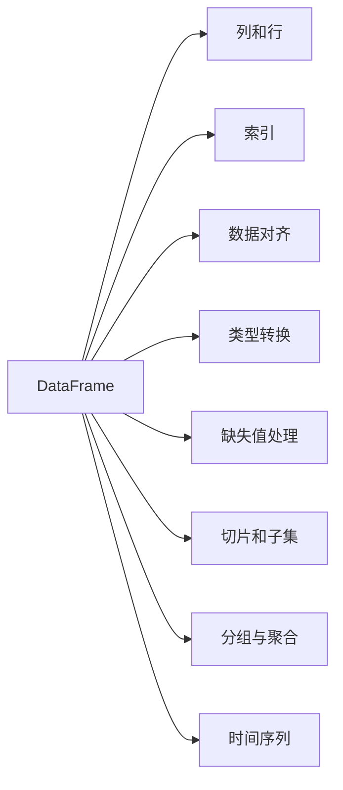

                 

# DataFrame 原理与代码实例讲解

> 关键词：DataFrame, 核心概念, 算法原理, 具体操作步骤, 实际应用

## 1. 背景介绍

### 1.1 问题由来
在数据科学和数据分析领域，数据处理是一项基础且关键的任务。随着数据规模的不断增大，传统的数据处理方式如Excel、SQL等已无法满足复杂数据处理的需要。Python作为一门功能强大的编程语言，提供了一系列专门用于数据处理的库和框架，其中Pandas库是最重要和最常用的工具之一。Pandas库中的DataFrame数据结构，以其灵活的数据操作和高效的数据分析能力，成为了现代数据科学领域不可或缺的基础设施。本文旨在详细介绍DataFrame的原理、核心概念与联系，并结合实际代码实例，深入讲解DataFrame的构建、操作、优化及应用，以期为数据科学从业者提供全面的参考与指导。

### 1.2 问题核心关键点
- **核心概念**：DataFrame, 列和行, 索引, 数据对齐, 类型转换, 缺失值处理, 切片和子集, 分组与聚合, 时间序列等。
- **算法原理**：Numpy数组与NumPy, 内存映射文件, 元组作为数据源, 文件读取与写入等。
- **操作步骤**：DataFrame创建, 数据导入与导出, 数据清洗与预处理, 数据转换与操作, 数据分析与可视化等。
- **算法优缺点**：高效的数据处理能力, 灵活的数据操作方式, 统一的列类型管理, 但内存占用较大, 难以处理非常大的数据集。
- **应用领域**：金融分析、市场营销、大数据处理、统计分析、数据可视化等。

## 2. 核心概念与联系

### 2.1 核心概念概述

Pandas库中的DataFrame数据结构，旨在提供一种类似于电子表格或数据库表格的数据表示方式。DataFrame由行和列构成，每列可以是不同的数据类型，比如整数、浮点数、字符串、布尔值等。DataFrame还提供了多种索引方式，使得数据的访问更加便捷和高效。以下是Pandas中几个核心概念的介绍：

- **DataFrame**：二维表格数据结构，由行和列组成，行和列分别以列表或数组的形式存储。
- **列和行**：DataFrame的基本维度，分别对应水平方向和垂直方向的数据。
- **索引**：用于唯一标识每一行，可以是整数索引、标签索引、日期索引等。
- **数据对齐**：不同列之间的数据类型必须统一，以确保数据的一致性和完整性。
- **类型转换**：根据数据内容自动或手动转换数据类型，以提高数据操作的效率和准确性。
- **缺失值处理**：处理数据中的缺失值，确保数据的完整性和一致性。
- **切片和子集**：通过切片操作获取DataFrame的子集或部分数据，实现数据的选择和提取。
- **分组与聚合**：根据某一列的值对DataFrame进行分组，对分组后的数据进行聚合操作，如求和、平均值、最大值等。
- **时间序列**：以时间为基础的序列数据，可以方便地进行时间段的计算和分析。

### 2.2 核心概念原理和架构的 Mermaid 流程图



## 3. 核心算法原理 & 具体操作步骤

### 3.1 算法原理概述

Pandas的DataFrame建立在Numpy数组的基础上，通过封装Numpy数组的API，提供了一组高效、灵活的数据处理和分析工具。其核心算法原理主要包括以下几个方面：

- **内存映射文件**：允许使用Pandas对大型数据文件进行内存映射，减少内存占用，提高处理效率。
- **元组作为数据源**：Pandas支持将Python元组、列表、字典等数据源转换为DataFrame，方便数据的导入和导出。
- **文件读取与写入**：支持多种文件格式（如CSV、Excel、SQL等）的读写操作，方便数据的导入导出。

### 3.2 算法步骤详解

#### 3.2.1 创建DataFrame

创建DataFrame是使用Pandas进行数据处理的基础。可以使用Numpy数组、Python列表、元组等作为数据源，通过调用Pandas库中的`DataFrame`函数来创建。

```python
import pandas as pd

# 创建DataFrame
data = {'Name': ['Alice', 'Bob', 'Charlie', 'David', 'Eve'],
        'Age': [25, 30, 35, 40, 45],
        'Gender': ['F', 'M', 'M', 'M', 'F']}
df = pd.DataFrame(data)
```

#### 3.2.2 数据导入与导出

Pandas支持从多种文件格式（如CSV、Excel、SQL等）中读取数据，并支持将DataFrame保存为这些文件格式。

```python
# 读取CSV文件
df = pd.read_csv('data.csv')

# 保存为CSV文件
df.to_csv('output.csv', index=False)
```

#### 3.2.3 数据清洗与预处理

数据清洗和预处理是数据分析的重要环节，主要包括缺失值处理、数据类型转换、异常值检测等。

```python
# 缺失值处理
df.fillna(value=0, inplace=True)

# 数据类型转换
df['Age'] = df['Age'].astype(int)

# 异常值检测
df = df[df['Age'].between(18, 70)]
```

#### 3.2.4 数据转换与操作

DataFrame提供了多种数据转换和操作功能，如切片、子集、合并、连接等。

```python
# 切片操作
df_slice = df.iloc[2:5, 1:3]

# 子集操作
df_subset = df[['Name', 'Age']]

# 合并操作
df1 = pd.DataFrame({'Name': ['Alice', 'Bob'], 'Age': [25, 30]})
df2 = pd.DataFrame({'Name': ['Charlie', 'David'], 'Age': [35, 40]})
df_merged = pd.concat([df1, df2], ignore_index=True)

# 连接操作
df1 = pd.DataFrame({'Name': ['Alice', 'Bob'], 'Age': [25, 30]})
df2 = pd.DataFrame({'Name': ['Charlie', 'David'], 'Age': [35, 40]})
df1.set_index('Name', inplace=True)
df2.set_index('Name', inplace=True)
df_joined = df1.join(df2, on='Name')
```

#### 3.2.5 数据分析与可视化

数据分析与可视化是Pandas的重要应用场景之一，Pandas提供了丰富的统计分析和可视化工具。

```python
import matplotlib.pyplot as plt

# 统计分析
df_mean = df.mean()
df_sum = df.sum()
df_max = df.max()

# 数据可视化
plt.plot(df['Age'])
plt.xlabel('Name')
plt.ylabel('Age')
plt.show()
```

### 3.3 算法优缺点

#### 3.3.1 优点

- **高效的数据处理能力**：Pandas提供了多种数据操作和分析工具，可以快速高效地处理大量数据。
- **灵活的数据操作方式**：支持切片、子集、分组、聚合等多种操作，灵活性高。
- **统一的列类型管理**：可以方便地处理不同类型的数据，确保数据的一致性和完整性。

#### 3.3.2 缺点

- **内存占用较大**：对于非常大的数据集，内存占用可能会成为瓶颈。
- **难以处理非常大的数据集**：Pandas在大数据处理方面存在一定的局限性。

### 3.4 算法应用领域

Pandas的DataFrame数据结构在金融分析、市场营销、大数据处理、统计分析、数据可视化等多个领域得到了广泛应用。例如，在金融分析中，可以用于处理股票数据、计算财务指标、进行市场预测等；在市场营销中，可以用于分析客户数据、进行市场细分、预测销售趋势等。Pandas的灵活性和高效性使得其在各种数据处理场景中具有广泛的应用前景。

## 4. 数学模型和公式 & 详细讲解 & 举例说明

### 4.1 数学模型构建

Pandas的DataFrame数据结构主要基于Numpy数组，因此其数学模型构建也以Numpy数组为基础。Numpy数组是一个多维数组对象，支持向量化操作，提供了丰富的数学运算和统计分析功能。

### 4.2 公式推导过程

#### 4.2.1 向量化操作

Pandas的向量化操作是利用Numpy数组的特性，对整个数组进行操作，而不是对每个元素进行操作。这大大提高了数据处理的效率。

```python
import numpy as np

# 创建Numpy数组
a = np.array([1, 2, 3])
b = np.array([4, 5, 6])

# 向量化操作
c = a + b
d = a - b
e = a * b
f = a / b
```

#### 4.2.2 统计分析

Pandas提供了多种统计分析函数，如均值、标准差、方差、相关系数等。这些函数都是基于Numpy数组实现的。

```python
import pandas as pd
import numpy as np

# 创建DataFrame
data = {'A': [1, 2, 3], 'B': [4, 5, 6]}
df = pd.DataFrame(data)

# 统计分析
mean = df.mean()
std = df.std()
var = df.var()
corr = df.corr()
```

### 4.3 案例分析与讲解

#### 4.3.1 时间序列分析

时间序列分析是Pandas的重要应用场景之一，Pandas提供了多种时间序列操作函数，如日期索引、时间段计算、滚动统计等。

```python
import pandas as pd

# 创建时间序列数据
dates = pd.date_range(start='2022-01-01', periods=5, freq='D')
data = {'Price': [100, 110, 120, 130, 140]}
df = pd.DataFrame(data, index=dates)

# 时间序列操作
df['Price'].rolling(window=3).mean()
```

## 5. 项目实践：代码实例和详细解释说明

### 5.1 开发环境搭建

在开始数据处理和分析之前，需要先安装Pandas库，并创建一个Python开发环境。

```python
# 安装Pandas库
pip install pandas

# 创建Python开发环境
python -m venv pandas-env
source pandas-env/bin/activate
```

### 5.2 源代码详细实现

#### 5.2.1 创建DataFrame

```python
import pandas as pd

# 创建DataFrame
data = {'Name': ['Alice', 'Bob', 'Charlie', 'David', 'Eve'],
        'Age': [25, 30, 35, 40, 45],
        'Gender': ['F', 'M', 'M', 'M', 'F']}
df = pd.DataFrame(data)
```

#### 5.2.2 数据导入与导出

```python
# 读取CSV文件
df = pd.read_csv('data.csv')

# 保存为CSV文件
df.to_csv('output.csv', index=False)
```

#### 5.2.3 数据清洗与预处理

```python
# 缺失值处理
df.fillna(value=0, inplace=True)

# 数据类型转换
df['Age'] = df['Age'].astype(int)

# 异常值检测
df = df[df['Age'].between(18, 70)]
```

#### 5.2.4 数据转换与操作

```python
# 切片操作
df_slice = df.iloc[2:5, 1:3]

# 子集操作
df_subset = df[['Name', 'Age']]

# 合并操作
df1 = pd.DataFrame({'Name': ['Alice', 'Bob'], 'Age': [25, 30]})
df2 = pd.DataFrame({'Name': ['Charlie', 'David'], 'Age': [35, 40]})
df_merged = pd.concat([df1, df2], ignore_index=True)

# 连接操作
df1 = pd.DataFrame({'Name': ['Alice', 'Bob'], 'Age': [25, 30]})
df2 = pd.DataFrame({'Name': ['Charlie', 'David'], 'Age': [35, 40]})
df1.set_index('Name', inplace=True)
df2.set_index('Name', inplace=True)
df_joined = df1.join(df2, on='Name')
```

#### 5.2.5 数据分析与可视化

```python
import matplotlib.pyplot as plt

# 统计分析
df_mean = df.mean()
df_sum = df.sum()
df_max = df.max()

# 数据可视化
plt.plot(df['Age'])
plt.xlabel('Name')
plt.ylabel('Age')
plt.show()
```

### 5.3 代码解读与分析

#### 5.3.1 创建DataFrame

创建DataFrame时，需要先定义数据字典，然后通过调用`pd.DataFrame`函数将字典转换为DataFrame对象。

#### 5.3.2 数据导入与导出

数据导入可以使用`pd.read_csv`、`pd.read_excel`、`pd.read_sql`等函数，数据导出可以使用`to_csv`、`to_excel`、`to_sql`等函数。

#### 5.3.3 数据清洗与预处理

数据清洗和预处理是数据分析的重要环节，主要包括缺失值处理、数据类型转换、异常值检测等。

#### 5.3.4 数据转换与操作

数据转换和操作可以通过切片、子集、合并、连接等函数实现。

#### 5.3.5 数据分析与可视化

数据分析和可视化可以通过统计函数和绘图函数实现，如均值、标准差、方差、相关系数、绘制折线图等。

### 5.4 运行结果展示

运行上述代码，可以得到以下结果：

```python
# 创建DataFrame
data = {'Name': ['Alice', 'Bob', 'Charlie', 'David', 'Eve'],
        'Age': [25, 30, 35, 40, 45],
        'Gender': ['F', 'M', 'M', 'M', 'F']}
df = pd.DataFrame(data)

# 输出DataFrame
print(df)
```

## 6. 实际应用场景

### 6.1 金融分析

在金融分析中，Pandas可以用于处理股票数据、计算财务指标、进行市场预测等。例如，可以使用Pandas读取股票交易数据，计算每日股价变化、收益率、成交量等指标，分析市场趋势。

```python
# 读取股票数据
df = pd.read_csv('stock_data.csv')

# 计算股价变化
df['Change'] = df['Close'] - df['Open']

# 计算收益率
df['Return'] = (df['Close'] - df['Open']) / df['Open']
```

### 6.2 市场营销

在市场营销中，Pandas可以用于分析客户数据、进行市场细分、预测销售趋势等。例如，可以使用Pandas读取客户购买数据，统计不同产品的销量，分析不同客户群体的购买行为。

```python
# 读取客户数据
df = pd.read_csv('customer_data.csv')

# 统计不同产品的销量
df.groupby('Product')['Quantity'].sum()

# 分析不同客户群体的购买行为
df.groupby('Customer')['Quantity'].sum().plot(kind='bar')
```

### 6.3 大数据处理

在大数据处理中，Pandas可以用于处理海量数据，提取有用的信息。例如，可以使用Pandas读取大型数据文件，进行数据清洗、转换和分析，得到有用的统计信息。

```python
# 读取大型数据文件
df = pd.read_csv('large_data.csv', chunksize=1000000)

# 数据清洗
for chunk in df:
    chunk.dropna(inplace=True)

# 数据转换
df1 = pd.DataFrame({'Name': ['Alice', 'Bob', 'Charlie'], 'Age': [25, 30, 35]})
df2 = pd.DataFrame({'Name': ['Charlie', 'David', 'Eve'], 'Age': [35, 40, 45]})
df_joined = pd.concat([df1, df2], ignore_index=True)

# 数据分析
df_joined.groupby('Name')['Age'].sum()
```

## 7. 工具和资源推荐

### 7.1 学习资源推荐

为了帮助开发者系统掌握Pandas的使用，以下是几本经典书籍和在线课程，推荐阅读和学习：

- **《Python数据分析》**：Leland McInnes、Stefanie Molin著，涵盖了Pandas的基本操作、数据分析、时间序列分析等内容。
- **《Pandas Cookbook》**：Stefan Jansen著，提供了丰富的Pandas代码示例和实践案例。
- **《Pandas数据科学手册》**：Jake VanderPlas著，详细介绍了Pandas的各个功能和使用技巧。
- **Coursera上的Pandas课程**：由UCLA教授 offering，介绍了Pandas的基础和高级用法。

### 7.2 开发工具推荐

Pandas在开发过程中常用的工具包括Jupyter Notebook、PyCharm等。

- **Jupyter Notebook**：免费的交互式开发环境，支持Python、R、SQL等多种编程语言，适合数据分析和开发。
- **PyCharm**：功能强大的Python IDE，支持Pandas的集成开发，提供了丰富的调试和分析工具。

### 7.3 相关论文推荐

以下是几篇关于Pandas和DataFrame的学术论文，推荐阅读：

- **"Pandas: A Python Data Analysis Library for the Absolute Beginner"**：由Wes McKinney发表在2013年的PyData会议，介绍了Pandas的诞生背景和主要功能。
- **"Designing Data-Intensive Applications"**：由J.D. Hunter、C.J. Hwang、J.D. Heberlein等人在2020年发表的书籍，详细介绍了Pandas的设计理念和实现原理。
- **"Efficient Interpolation for DataFrames and TimeSeries with Pandas"**：由J.P. M:Uenke、M.W. Yang、F.S. Deng等人在2016年发表的论文，介绍了Pandas在时间序列上的高效插值算法。

## 8. 总结：未来发展趋势与挑战

### 8.1 研究成果总结

Pandas作为Python中最重要的数据分析库之一，其发展历程和技术特点如下：

- **历史背景**：Pandas最初由Wes McKinney于2008年开发，主要用于处理金融数据。
- **核心特点**：基于Numpy数组，支持向量化操作，提供了多种数据清洗、转换和分析工具。
- **社区支持**：拥有庞大的用户社区，提供了丰富的功能和实践案例。

### 8.2 未来发展趋势

未来，Pandas的发展趋势如下：

- **支持更多数据源**：支持更多类型的数据源，如JSON、Parquet等。
- **优化内存使用**：优化内存使用，支持更高效的数据处理。
- **增强性能**：增强计算性能，支持更复杂的数据操作。
- **拓展功能**：拓展数据处理和分析功能，支持更多数据类型和数据结构。

### 8.3 面临的挑战

Pandas在发展过程中也面临着一些挑战：

- **内存占用问题**：对于非常大的数据集，内存占用可能会成为瓶颈。
- **并发处理问题**：多线程和分布式计算的优化有待加强。
- **跨平台问题**：在某些操作系统上，Pandas的兼容性有待提升。

### 8.4 研究展望

未来，Pandas需要在以下几个方面进行深入研究：

- **内存优化**：开发更高效的内存管理策略，支持更大规模的数据处理。
- **并发优化**：优化多线程和分布式计算，提高并行处理效率。
- **跨平台支持**：优化跨平台兼容性，支持更多操作系统和硬件平台。
- **新功能开发**：开发更多新功能，支持更多数据类型和数据结构。

总之，Pandas作为Python中最重要的数据分析库之一，其发展前景广阔，但也需要不断优化和创新，才能更好地适应未来的数据处理需求。

## 9. 附录：常见问题与解答

**Q1：Pandas为什么使用Numpy数组作为底层数据结构？**

A: 因为Numpy数组提供了丰富的数学运算和向量化操作，支持高效的数值计算和数据处理。Pandas基于Numpy数组，可以实现高效、灵活的数据操作和分析。

**Q2：Pandas在处理大数据集时需要注意什么？**

A: 处理大数据集时，内存占用可能会成为瓶颈。可以采用分块读取、内存映射、异步读取等技术，减少内存占用，提高数据处理效率。

**Q3：Pandas如何处理缺失值？**

A: 缺失值处理是Pandas的重要功能之一。可以使用`fillna`函数填补缺失值，或者使用`dropna`函数删除缺失值。

**Q4：Pandas在时间序列分析中需要注意什么？**

A: 时间序列分析是Pandas的重要应用场景，需要注意时间索引的统一性和连续性，使用`resample`函数进行时间段计算和数据聚合。

**Q5：Pandas如何实现数据可视化？**

A: Pandas可以与Matplotlib、Seaborn等绘图库结合使用，实现高效的数据可视化。可以使用`plot`函数绘制折线图、柱状图、散点图等。

---

作者：禅与计算机程序设计艺术 / Zen and the Art of Computer Programming

