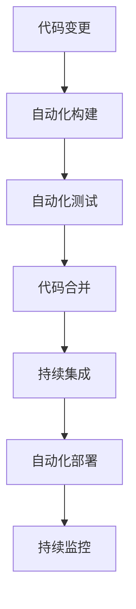

                 

# DevOps实践：自动化部署和持续集成

## 1. 背景介绍

### 1.1 问题由来
随着企业数字化转型的加速，软件开发流程变得日益复杂和多样化。传统的“瀑布式”开发模式无法应对快速变化的市场需求，必须引入更加敏捷、高效、协同的软件交付机制。DevOps应运而生，通过自动化和持续集成(CI)、持续部署(CD)、持续监控(CM)等关键实践，极大地提升了软件开发的效率和质量。

然而，DevOps实践并非万能药，它也面临着诸多挑战：
1. 自动化水平不足。自动化工具和流程不完善，导致许多环节仍然依赖人工操作。
2. 协作和沟通不充分。不同团队和部门之间缺乏有效沟通，难以协同工作。
3. 持续交付难以实现。缺少自动化测试和部署，版本迭代周期较长，新功能上线缓慢。
4. 安全问题突出。自动化流程和系统漏洞增加了信息安全风险，尤其在关键应用中。
5. 数据孤岛问题严重。各业务系统的数据难以整合，跨系统交互困难。

为解决上述问题，DevOps引入了自动化部署和持续集成的理念。通过构建自动化流水线和持续集成管道，使得软件的构建、测试、部署等环节能够高效协同，提升开发效率和软件质量。

### 1.2 问题核心关键点
DevOps自动化部署和持续集成的核心在于：
1. 自动化流程和工具链。通过自动化脚本和工具链，实现构建、测试、部署等环节的无缝衔接，减少人工操作。
2. 持续集成和交付。通过持续集成，确保代码变更能够及时、频繁地集成到主干分支，减少故障和冲突。通过持续部署，快速、安全地将代码部署到生产环境。
3. 持续监控和反馈。通过实时监控和反馈，及时发现和解决问题，确保软件质量和安全。

本节将从核心概念入手，深入探讨DevOps自动化部署和持续集成背后的原理和架构。

## 2. 核心概念与联系

### 2.1 核心概念概述

为更好地理解DevOps自动化部署和持续集成方法，本节将介绍几个关键概念及其联系：

- **自动化部署**：指将软件的构建、测试和部署过程自动化，减少人工操作，提升效率和质量。通常使用CI/CD工具链实现。
- **持续集成**：指在开发过程中频繁、小步地将代码变更集成到主干分支，并进行构建、测试，以确保新代码能够及时稳定地集成到系统中。
- **持续交付**：指在软件交付过程中，通过自动化流水线确保代码变更能够快速、安全地部署到生产环境。
- **持续监控**：指对软件运行状态进行实时监控，收集性能数据和日志信息，以便及时发现和解决问题。

这些概念通过一系列自动化工具和流程，形成了一个完整的DevOps管道，确保软件交付过程的高效、安全和稳定。

### 2.2 核心概念原理和架构的 Mermaid 流程图

以下是一个简化的DevOps自动化部署和持续集成流程的Mermaid流程图：



这个流程图展示了DevOps管道的基本流程：

1. 开发人员提交代码变更(A)。
2. CI服务器接收到变更，自动进行构建和测试(B)。
3. 测试通过后，代码被合并到主干分支(D)。
4. 持续集成触发新的构建和测试(E)，确保新变更稳定。
5. 自动化部署将代码部署到测试或生产环境(F)。
6. 持续监控实时收集系统数据(G)，进行实时分析和报警。

这些环节通过CI/CD工具链紧密连接，形成了一个高效、可控的软件交付机制。

## 3. 核心算法原理 & 具体操作步骤
### 3.1 算法原理概述

DevOps自动化部署和持续集成的核心算法原理在于自动化流程的构建和优化。通过设计自动化流程，使得软件的构建、测试、部署等环节能够自动衔接，减少人工干预，提升整体效率。

### 3.2 算法步骤详解

以下是DevOps自动化部署和持续集成的一般步骤：

1. **环境配置**：
   - 配置开发、测试、生产等不同环境，设置所需的软件、硬件、依赖库等。
   - 配置CI/CD工具链，如Jenkins、GitLab CI/CD、Travis CI等。

2. **代码变更检测**：
   - 通过Git、SVN等版本控制系统，检测开发人员提交的代码变更。
   - 触发自动化流程，将变更推送到CI服务器。

3. **自动化构建**：
   - 使用构建工具如Maven、Gradle、Docker等，将代码构建为可部署的包或镜像。
   - 在CI服务器上执行构建脚本，确保构建过程无故障。

4. **自动化测试**：
   - 执行单元测试、集成测试、端到端测试等。
   - 测试框架如JUnit、Selenium、Cypress等，可以方便地集成到CI流程中。

5. **代码合并**：
   - 通过代码合并策略如Git Merge、Git Pull Request等，将通过测试的变更合并到主干分支。
   - 自动更新文档、配置等辅助文件，确保代码变更的完整性。

6. **持续集成**：
   - 对新变更进行持续集成，确保代码能够频繁、稳定地集成到系统中。
   - 自动部署到测试环境，进行进一步测试和验证。

7. **持续部署**：
   - 通过自动化流水线，将代码部署到生产环境。
   - 部署工具如Jenkins Pipeline、CircleCI、Ansible等，可以灵活地实现部署任务。

8. **持续监控**：
   - 收集系统性能、日志、异常等信息，进行实时监控。
   - 监控工具如Prometheus、ELK Stack、Grafana等，可以方便地集成到CI/CD流程中。

### 3.3 算法优缺点

DevOps自动化部署和持续集成具有以下优点：
1. 提升开发效率。自动化流程减少了人工操作，加快了代码变更的集成和部署速度。
2. 提升软件质量。自动化测试和构建确保了代码的稳定性和可靠性。
3. 提升协作效率。自动化流程减少了人为干预，减少了团队间的沟通成本。
4. 提升安全性和稳定性。持续监控和自动化流程确保了代码变更的安全性和稳定性。

同时，该方法也存在一定的局限性：
1. 需要投入较多时间和资源。自动化流程的设计和维护需要时间和资源投入，特别是初期的部署。
2. 对环境配置要求较高。自动化流程依赖于稳定、一致的环境配置，环境配置复杂可能导致自动化失败。
3. 难以处理复杂场景。自动化流程可能难以处理复杂的依赖关系、配置变更等。

尽管如此，DevOps自动化部署和持续集成仍然是目前主流的软件交付机制，广泛应用于企业级软件开发中。

### 3.4 算法应用领域

DevOps自动化部署和持续集成方法广泛应用于软件开发、运维、测试等各个环节，具体应用领域包括：

- 软件开发：从需求分析到部署上线，通过自动化流程确保代码变更高效、稳定地交付。
- 测试自动化：通过自动化测试脚本和工具，快速验证新功能的稳定性和可靠性。
- 运维自动化：通过自动化部署和监控，快速响应生产环境中的问题，确保系统稳定运行。
- 持续集成：在敏捷开发中频繁集成新变更，快速验证和交付功能。

## 4. 数学模型和公式 & 详细讲解 & 举例说明

### 4.1 数学模型构建

本节将使用数学语言对DevOps自动化部署和持续集成的流程进行更加严格的刻画。

假设软件开发的流程从代码变更开始，直到最终部署到生产环境。我们可以构建如下数学模型：

1. **代码变更**：令 $x$ 表示代码变更，$x_{i-1}$ 表示上一个变更，$x_i$ 表示当前变更。
2. **构建过程**：令 $f(x_i)$ 表示代码变更 $x_i$ 的构建过程，$f(x_{i-1})$ 表示上一个变更的构建过程。
3. **测试过程**：令 $g(x_i)$ 表示代码变更 $x_i$ 的测试过程，$g(x_{i-1})$ 表示上一个变更的测试过程。
4. **部署过程**：令 $h(x_i)$ 表示代码变更 $x_i$ 的部署过程，$h(x_{i-1})$ 表示上一个变更的部署过程。
5. **监控过程**：令 $m(x_i)$ 表示代码变更 $x_i$ 的监控过程，$m(x_{i-1})$ 表示上一个变更的监控过程。

### 4.2 公式推导过程

以代码构建和测试为例，推导自动化流程的数学公式。

假设代码变更 $x_i$ 的构建和测试过程如下：
- 构建过程 $f(x_i)$ 需要 $t_{build}$ 时间。
- 测试过程 $g(x_i)$ 需要 $t_{test}$ 时间。
- 上一个变更 $x_{i-1}$ 的构建和测试过程分别为 $f(x_{i-1})$ 和 $g(x_{i-1})$。

则构建和测试的总时间 $T$ 可以表示为：
$$
T = f(x_i) + g(x_i) = t_{build} + t_{test}
$$

假设构建和测试过程存在依赖关系，例如 $x_i$ 依赖于 $x_{i-1}$，则构建和测试的依赖关系可以表示为：
$$
f(x_i) = g(x_{i-1})
$$

通过上述公式，我们可以计算出不同变更的构建和测试时间，从而优化自动化流程。

### 4.3 案例分析与讲解

假设某软件开发流程如下：

- 开发人员提交代码变更。
- CI服务器触发构建和测试。
- 构建时间 $t_{build}=30$ 分钟，测试时间 $t_{test}=20$ 分钟。
- 第一个变更 $x_1$ 需要 $f(x_1)=g(x_0)$，第二个变更 $x_2$ 需要 $f(x_2)=g(x_1)$。

通过上述公式，可以计算出各变更的构建和测试时间：

- 第一个变更 $x_1$：
  - 构建时间：$t_{build}=30$ 分钟
  - 测试时间：$t_{test}=20$ 分钟
  - 总时间：$T_1 = 30 + 20 = 50$ 分钟

- 第二个变更 $x_2$：
  - 构建时间：$t_{build}=30$ 分钟
  - 测试时间：$t_{test}=20$ 分钟
  - 总时间：$T_2 = 30 + 20 = 50$ 分钟

通过优化构建和测试流程，可以减少总的执行时间。例如，在构建和测试过程中加入缓存机制，可以显著提升效率。

## 5. 项目实践：代码实例和详细解释说明

### 5.1 开发环境搭建

在进行DevOps自动化部署和持续集成实践前，我们需要准备好开发环境。以下是使用Jenkins进行CI/CD环境配置的步骤：

1. 安装Jenkins Server：从官网下载并安装Jenkins Server，根据操作系统不同选择不同的安装方法。
2. 安装Jenkins Plugins：Jenkins支持丰富的插件，可以方便地集成各种CI/CD工具和流程。

   ```bash
   java -jar jenkins.war --httpPort=8080 --httpPortNumber=8080
   ```

3. 配置Jenkins Pipeline：在Jenkins中配置Pipeline脚本，定义构建、测试、部署等任务。

   ```groovy
   pipeline {
       agent any
       stages {
           stage('Build') {
               steps {
                   sh 'mvn clean install'
               }
           }
           stage('Test') {
               steps {
                   sh 'mvn test'
               }
           }
           stage('Deploy') {
               steps {
                   sh 'mvn spring-boot:run'
               }
           }
       }
   }
   ```

完成上述步骤后，即可在Jenkins中进行CI/CD实践。

### 5.2 源代码详细实现

这里我们以一个简单的Spring Boot项目为例，展示Jenkins Pipeline的实现步骤。

首先，创建Pipeline脚本：

```groovy
pipeline {
    agent any

    stages {
        stage('Build') {
            steps {
                sh 'mvn clean install'
            }
        }
        stage('Test') {
            steps {
                sh 'mvn test'
            }
        }
        stage('Deploy') {
            steps {
                sh 'mvn spring-boot:run'
            }
        }
    }
}
```

接着，在Jenkins中配置Pipeline：

1. 选择Pipeline配置，创建Pipeline配置。
2. 输入Pipeline脚本路径，选择Pipeline类型。
3. 设置构建触发器，如代码变更、定时任务等。
4. 配置构建环境，如JDK版本、Maven依赖等。
5. 运行Pipeline，查看构建日志。

### 5.3 代码解读与分析

让我们再详细解读一下关键代码的实现细节：

**Pipeline脚本**：
- `pipeline`关键字表示定义Pipeline。
- `agent any`表示可以使用任何类型的Agent进行构建。
- `stages`关键字表示定义构建阶段。
- `sh`关键字表示执行Shell命令，执行构建、测试和部署任务。

**构建任务**：
- `mvn clean install`表示执行Maven命令，清理工作空间并安装项目依赖。

**测试任务**：
- `mvn test`表示执行Maven命令，运行测试用例，生成测试报告。

**部署任务**：
- `mvn spring-boot:run`表示执行Maven命令，启动Spring Boot应用程序。

通过上述步骤，我们可以看到Jenkins Pipeline的灵活性和高效性。通过定义Pipeline脚本，可以实现从构建到部署的自动化流程，显著提升软件开发效率和质量。

## 6. 实际应用场景

### 6.1 持续集成和持续部署

持续集成和持续部署是DevOps的核心实践之一。通过自动化构建和部署，可以确保代码变更能够频繁、稳定地集成和部署到系统中，提升软件开发效率和软件质量。

假设某公司开发一个电商网站，其持续集成和持续部署流程如下：

1. 开发人员提交代码变更。
2. CI服务器触发构建和测试。
3. 构建时间 $t_{build}=30$ 分钟，测试时间 $t_{test}=20$ 分钟。
4. 第一个变更 $x_1$ 需要 $f(x_1)=g(x_0)$，第二个变更 $x_2$ 需要 $f(x_2)=g(x_1)$。

通过上述公式，可以计算出各变更的构建和测试时间：

- 第一个变更 $x_1$：
  - 构建时间：$t_{build}=30$ 分钟
  - 测试时间：$t_{test}=20$ 分钟
  - 总时间：$T_1 = 30 + 20 = 50$ 分钟

- 第二个变更 $x_2$：
  - 构建时间：$t_{build}=30$ 分钟
  - 测试时间：$t_{test}=20$ 分钟
  - 总时间：$T_2 = 30 + 20 = 50$ 分钟

通过优化构建和测试流程，可以减少总的执行时间。例如，在构建和测试过程中加入缓存机制，可以显著提升效率。

### 6.2 持续监控和反馈

持续监控和反馈是DevOps的关键环节之一，通过实时监控和反馈，可以及时发现和解决问题，确保系统稳定运行。

假设某公司开发一个金融系统，其持续监控和反馈流程如下：

1. 开发人员提交代码变更。
2. CI服务器触发构建和测试。
3. 构建时间 $t_{build}=30$ 分钟，测试时间 $t_{test}=20$ 分钟。
4. 第一个变更 $x_1$ 需要 $f(x_1)=g(x_0)$，第二个变更 $x_2$ 需要 $f(x_2)=g(x_1)$。
5. 系统监控工具Prometheus实时监控系统性能和日志信息。

通过上述公式，可以计算出各变更的构建和测试时间：

- 第一个变更 $x_1$：
  - 构建时间：$t_{build}=30$ 分钟
  - 测试时间：$t_{test}=20$ 分钟
  - 总时间：$T_1 = 30 + 20 = 50$ 分钟

- 第二个变更 $x_2$：
  - 构建时间：$t_{build}=30$ 分钟
  - 测试时间：$t_{test}=20$ 分钟
  - 总时间：$T_2 = 30 + 20 = 50$ 分钟

通过优化监控和反馈流程，可以快速响应系统问题。例如，在系统出现异常时，监控工具可以自动触发告警，通知相关团队进行处理。

## 7. 工具和资源推荐

### 7.1 学习资源推荐

为了帮助开发者系统掌握DevOps自动化部署和持续集成的理论基础和实践技巧，这里推荐一些优质的学习资源：

1. DevOps实践指南：由AWS官方编写，全面介绍了DevOps自动化部署和持续集成的最佳实践。

2. Jenkins用户手册：Jenkins官方文档，详细介绍了Jenkins的安装、配置和脚本编写。

3. Kubernetes官方文档：Kubernetes官方文档，介绍了Kubernetes的部署和监控实践。

4. Docker实战指南：Docker官方文档，介绍了Docker的部署和容器化实践。

5. DevOps高级编程：某知名IT培训机构的高级课程，系统讲解了DevOps的自动化部署和持续集成实践。

通过对这些资源的学习实践，相信你一定能够快速掌握DevOps自动化部署和持续集成的精髓，并用于解决实际的开发问题。

### 7.2 开发工具推荐

高效的开发离不开优秀的工具支持。以下是几款用于DevOps自动化部署和持续集成的常用工具：

1. Jenkins：基于Java的开源自动化服务器，支持丰富的插件，方便集成各种CI/CD工具。

2. GitLab CI/CD：GitLab提供的CI/CD工具，支持Kubernetes、Jenkins Pipeline等多种集成方式。

3. CircleCI：基于Cloud的CI/CD工具，支持多种编程语言和框架，方便快速集成。

4. Docker：容器化技术，可以方便地打包和管理应用，支持跨平台部署。

5. Ansible：自动化运维工具，支持自动化配置和部署，方便快速部署和监控应用。

6. Prometheus：开源监控系统，可以实时监控系统性能和日志信息，方便快速定位问题。

合理利用这些工具，可以显著提升DevOps自动化部署和持续集成的开发效率，加快创新迭代的步伐。

### 7.3 相关论文推荐

DevOps自动化部署和持续集成技术的发展源于学界的持续研究。以下是几篇奠基性的相关论文，推荐阅读：

1. Automated Deployments for Large-Scale Software: Overview and Survey：介绍了自动化部署的基本概念和实践，详细描述了DevOps的自动化部署流程。

2. Modeling and Evaluation of Continuous Integration in Software Development：研究了CI的模型和评估方法，提供了CI流程优化的方法。

3. Managing Software Configuration with Continuous Integration and Continuous Deployment：介绍了CI/CD的基本概念和实践，提供了配置和部署管理的最佳实践。

4. Continuous Delivery: The Reliable, Deployable, Scalable, Secure Application CICD CI DevOps Pipeline：介绍了CI/CD的自动化流程和工具链，提供了工具链集成的最佳实践。

这些论文代表了大规模软件开发的最新进展，通过学习这些前沿成果，可以帮助研究者把握学科前进方向，激发更多的创新灵感。

## 8. 总结：未来发展趋势与挑战

### 8.1 总结

本文对DevOps自动化部署和持续集成方法进行了全面系统的介绍。首先阐述了DevOps自动化部署和持续集成的背景和意义，明确了其在提升软件开发效率和质量方面的独特价值。其次，从核心概念入手，详细讲解了自动化部署和持续集成的数学模型和关键步骤，给出了DevOps自动化部署和持续集成的完整代码实例。同时，本文还广泛探讨了DevOps自动化部署和持续集成在软件开发、测试、运维等环节的应用前景，展示了DevOps范式的巨大潜力。

通过本文的系统梳理，可以看到，DevOps自动化部署和持续集成在软件开发中的应用已经相当成熟，广泛应用于企业级软件开发中。未来，伴随DevOps技术的持续演进，结合云计算、容器化、容器编排等技术，DevOps必将在更广阔的领域中发挥更大的作用，推动软件开发自动化和智能化进程。

### 8.2 未来发展趋势

展望未来，DevOps自动化部署和持续集成技术将呈现以下几个发展趋势：

1. 云计算和大数据融合。DevOps与云计算、大数据技术的结合，可以更好地支持自动化部署和持续监控，提升软件交付的效率和质量。

2. 微服务架构支持。DevOps在微服务架构中的应用，可以更好地支持模块化、可扩展的软件开发，提升系统性能和可靠性。

3. 容器化技术普及。Docker、Kubernetes等容器化技术的普及，可以更好地支持自动化部署和运维，提升系统的稳定性和扩展性。

4. 持续交付和持续部署。持续交付和持续部署成为DevOps的核心实践，可以更好地支持敏捷开发和快速交付。

5. 持续监控和反馈。持续监控和反馈成为DevOps的关键环节，可以更好地支持系统稳定运行和快速故障定位。

以上趋势凸显了DevOps自动化部署和持续集成技术的广阔前景。这些方向的探索发展，必将进一步提升软件开发自动化和智能化水平，为软件企业的数字化转型提供有力支持。

### 8.3 面临的挑战

尽管DevOps自动化部署和持续集成技术已经取得了瞩目成就，但在迈向更加智能化、普适化应用的过程中，它仍面临着诸多挑战：

1. 集成和协作问题。不同团队和部门之间的协作和集成仍然存在障碍，缺乏统一的标准和规范。

2. 复杂性问题。复杂的系统架构和业务需求，导致自动化流程的设计和维护变得困难。

3. 安全问题。自动化流程和系统漏洞增加了信息安全风险，尤其在关键应用中。

4. 技术栈和工具链问题。不同技术栈和工具链之间的集成和兼容问题，导致自动化流程的复杂性增加。

5. 文化问题。组织文化对DevOps的接受度不高，导致DevOps实践难以落地。

尽管如此，DevOps自动化部署和持续集成仍然是目前主流的软件交付机制，广泛应用于企业级软件开发中。

### 8.4 研究展望

面对DevOps自动化部署和持续集成所面临的种种挑战，未来的研究需要在以下几个方面寻求新的突破：

1. 提升集成和协作效率。通过制定统一的标准和规范，促进团队和部门之间的协作和集成。

2. 简化自动化流程设计。通过工具链集成和自动化脚本，简化自动化流程的设计和维护。

3. 提升系统安全性。通过技术手段和管理机制，提升系统的安全性和稳定性。

4. 优化技术栈和工具链。通过工具链选择和集成优化，提升自动化流程的兼容性和效率。

5. 提升组织文化。通过培训和实践，提升组织对DevOps的接受度和理解。

这些研究方向的探索，必将引领DevOps自动化部署和持续集成技术迈向更高的台阶，为软件企业的数字化转型提供有力支持。相信随着DevOps技术的持续演进，结合云计算、容器化、容器编排等技术，DevOps必将在更广阔的领域中发挥更大的作用，推动软件开发自动化和智能化进程。

## 9. 附录：常见问题与解答

**Q1：DevOps和CI/CD有何区别？**

A: DevOps是一个更广泛的概念，包含了CI/CD、持续监控、自动化测试、自动化运维等多个环节。CI/CD是DevOps的核心实践之一，通过自动化构建和部署，确保代码变更能够频繁、稳定地集成和部署到系统中。

**Q2：如何优化CI/CD流程？**

A: 可以通过以下方法优化CI/CD流程：
1. 引入缓存机制，减少重复构建和测试时间。
2. 优化测试策略，采用单元测试、集成测试、端到端测试等多种方式，提升测试覆盖率。
3. 引入自动化测试工具，如JUnit、Selenium、Cypress等，提升测试效率。
4. 优化配置管理，通过配置文件和环境变量等方式，减少配置复杂度。
5. 引入持续集成和持续部署工具，如Jenkins、GitLab CI/CD、CircleCI等，提升流程自动化水平。

**Q3：如何保证CI/CD流程的稳定性？**

A: 可以通过以下方法保证CI/CD流程的稳定性：
1. 引入自动化测试，确保代码变更稳定性和可靠性。
2. 引入持续集成和持续部署，确保代码变更能够频繁、稳定地集成和部署。
3. 引入持续监控和反馈，实时监控系统性能和日志信息，及时发现和解决问题。
4. 引入自动化运维工具，如Ansible、Puppet等，自动化部署和运维操作。
5. 引入版本控制工具，如Git、SVN等，确保代码变更的完整性和可追溯性。

这些方法可以显著提升CI/CD流程的稳定性和可靠性，确保系统高效、稳定地运行。

---

作者：禅与计算机程序设计艺术 / Zen and the Art of Computer Programming

