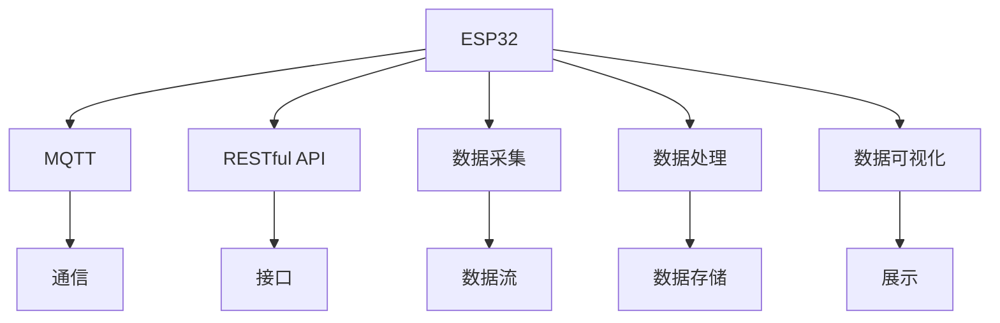

                 

# ESP32物联网应用开发

## 1. 背景介绍

### 1.1 问题由来

随着物联网技术的飞速发展，越来越多的设备通过网络接入互联网，实现远程监控、数据收集等功能。但由于资源有限，传统的网络设备往往存在计算能力弱、功耗高、可靠性差等问题，难以满足日益增长的应用需求。

ESP32作为一款集成了Wi-Fi和蓝牙功能的微控制器，以其高性能、低成本、易用性等特点，成为物联网应用开发的首选平台。通过使用ESP32，开发者可以在不增加额外成本的情况下，轻松实现高质量的物联网应用。

### 1.2 问题核心关键点

ESP32支持Arduino、ESP-IDF等开发环境，提供丰富的硬件抽象层和外设驱动，简化了开发过程。但其底层协议栈、驱动程序等仍需深入理解，才能高效、可靠地开发各种物联网应用。

本文聚焦于ESP32物联网应用开发的核心技术，从原理到实践，全面系统地介绍了基于ESP32平台进行应用开发的方法。希望通过本文档的学习，读者能够掌握ESP32开发技能，高效构建各类物联网应用。

### 1.3 问题研究意义

随着物联网技术的不断普及，各个领域的应用场景越来越丰富，对物联网设备的需求也日益增长。ESP32作为一款高性能、低成本、易用性强的微控制器，能够在很多应用场景中发挥重要作用。

开发高效、稳定、可靠的ESP32物联网应用，不仅能够提升现有应用的质量，还能够帮助开发者更好地适应物联网领域的发展趋势。未来，物联网设备将成为连接各个领域的重要纽带，为实现智慧城市、智慧农业、智能家居等愿景奠定基础。

## 2. 核心概念与联系

### 2.1 核心概念概述

为了更好地理解ESP32物联网应用开发，本节将介绍几个密切相关的核心概念：

- ESP32：一款集成了Wi-Fi、蓝牙、传感器等功能的高性能微控制器，支持Arduino、ESP-IDF等多种开发环境。
- IoT：物联网，指通过互联网将各种设备连接起来，实现信息共享、协同工作的应用场景。
- MQTT：一种轻量级、低带宽、高性能的消息队列传输协议，常用于物联网设备间的通信。
- RESTful API：REST（Representational State Transfer）是一种网络架构风格，支持资源的创建、读取、更新、删除等操作，常用于构建物联网应用接口。
- 数据采集：指通过传感器等设备获取物理世界中的信息，并通过网络传输到云端进行处理和分析。
- 数据处理：指对采集到的数据进行预处理、分析、存储等操作，以实现更高效的应用。
- 数据可视化：指将数据以图表、报表等形式展现出来，辅助人类理解数据。

这些核心概念之间的逻辑关系可以通过以下Mermaid流程图来展示：



这个流程图展示了他的核心概念及其之间的关系：

1. ESP32通过集成Wi-Fi、蓝牙等模块，实现了物联网设备的通信功能。
2. MQTT提供了一种轻量级的数据传输协议，适用于低带宽、高可靠性的物联网应用。
3. RESTful API定义了资源的操作方式，使物联网应用易于构建和维护。
4. 数据采集通过传感器获取物理信息，为应用提供数据来源。
5. 数据处理对采集到的数据进行处理，生成有用的信息。
6. 数据可视化将处理后的数据以图表、报表等形式展现出来，辅助人类理解。

这些概念共同构成了ESP32物联网应用开发的技术框架，使得开发者能够高效构建各类物联网应用。

## 3. 核心算法原理 & 具体操作步骤
### 3.1 算法原理概述

基于ESP32的物联网应用开发，本质上是一个嵌入式系统与网络协议、数据处理技术的结合过程。其核心思想是：利用ESP32集成的Wi-Fi、蓝牙等功能，通过MQTT、RESTful API等协议，将数据采集、处理、展示等操作集成到一个完整的系统中。

形式化地，假设IoT设备为 $M_{\text{IoT}}$，云端平台为 $C$，数据采集组件为 $D$，数据处理组件为 $P$，数据展示组件为 $V$。基于ESP32的物联网应用开发过程包括：

1. 利用ESP32集成的Wi-Fi功能，将 $M_{\text{IoT}}$ 连接至 $C$。
2. 通过MQTT协议，将 $M_{\text{IoT}}$ 采集到的数据流传输至 $C$。
3. 在 $C$ 上，利用RESTful API接口，将数据流传递给 $P$ 进行处理。
4. $P$ 对数据进行预处理、分析等操作，生成新的数据流。
5. 将 $P$ 生成的数据流传递给 $V$，展示相关信息。

### 3.2 算法步骤详解

基于ESP32的物联网应用开发一般包括以下几个关键步骤：

**Step 1: 准备开发环境**

- 安装Arduino IDE：从官网下载并安装Arduino IDE，用于编写和管理ESP32程序。
- 安装ESP-IDF：从官网下载并安装ESP-IDF，用于在ESP32上运行高级程序。
- 安装OpenSSL：用于加密通信数据，防止中间人攻击。

**Step 2: 搭建开发板**

- 在开发板上连接Wi-Fi、蓝牙、传感器等硬件模块。
- 确保ESP32板和开发环境的版本匹配。

**Step 3: 编写程序**

- 使用Arduino IDE编写基本的ESP32程序，实现简单的Wi-Fi连接和数据传输。
- 使用ESP-IDF编写高级程序，实现更复杂的功能。
- 编写MQTT客户端程序，与云端平台通信。

**Step 4: 数据处理**

- 在云端平台部署RESTful API接口，接受数据流。
- 使用Python、R等语言处理数据，生成图表、报表等展示信息。
- 使用数据库存储处理后的数据，方便后续查询和分析。

**Step 5: 数据展示**

- 在Web应用或移动应用中展示处理后的数据。
- 使用D3.js、ECharts等工具，实现图表展示。
- 提供交互界面，使用户能够实时查看数据。

### 3.3 算法优缺点

基于ESP32的物联网应用开发具有以下优点：

1. 硬件资源丰富。ESP32集成了Wi-Fi、蓝牙、传感器等功能，易于实现各类物联网应用。
2. 软件开发便捷。使用Arduino IDE和ESP-IDF，开发过程简单高效。
3. 通信协议高效。MQTT协议轻量级、低带宽，适合IoT设备的通信需求。
4. 数据处理灵活。RESTful API接口定义明确，易于处理复杂数据流。
5. 应用场景广泛。适用于智能家居、智能农业、智能医疗等多个领域。

同时，该方法也存在一定的局限性：

1. 开发门槛高。需要具备嵌入式开发、网络编程、数据处理等多方面的技能。
2. 数据安全性不足。MQTT协议默认不加密，数据传输存在风险。
3. 跨平台兼容性差。不同平台之间的数据格式、接口规范不同，需要额外适配。
4. 开发成本高。需要购买开发板和硬件模块，设备成本较高。
5. 系统复杂度高。随着应用场景的扩展，系统复杂度会增加，难以维护。

尽管存在这些局限性，但就目前而言，基于ESP32的物联网应用开发仍然是最主流的方法。未来相关研究的重点在于如何进一步降低开发成本、提高数据安全性、优化跨平台兼容性等方面。

### 3.4 算法应用领域

基于ESP32的物联网应用开发已经在智能家居、智能农业、智能医疗等多个领域得到广泛应用，具体包括：

- 智能家居：通过传感器监测室内环境，自动调节灯光、温度等设备，提升居住舒适性。
- 智能农业：通过传感器监测土壤、气候等环境参数，指导农作物种植，提高产量和质量。
- 智能医疗：通过传感器监测患者生命体征，实时上传至云端平台，辅助医生诊疗。
- 智慧城市：通过传感器监测城市环境，实时发布交通、气象等信息，辅助城市管理。

此外，基于ESP32的物联网应用开发也在智能穿戴、环境监测、智慧办公等多个领域展现了广阔的应用前景。随着物联网技术的不断进步，基于ESP32的应用开发也将持续推动物联网技术的发展。

## 4. 数学模型和公式 & 详细讲解 & 举例说明

### 4.1 数学模型构建

本节将使用数学语言对基于ESP32的物联网应用开发过程进行更加严格的刻画。

假设IoT设备为 $M_{\text{IoT}}$，云端平台为 $C$，数据采集组件为 $D$，数据处理组件为 $P$，数据展示组件为 $V$。其通信过程可表示为：

1. $M_{\text{IoT}} \rightarrow \text{Wi-Fi}$：通过Wi-Fi将 $M_{\text{IoT}}$ 连接至 $C$。
2. $M_{\text{IoT}} \rightarrow \text{MQTT}$：使用MQTT协议将 $M_{\text{IoT}}$ 采集到的数据流传输至 $C$。
3. $C \rightarrow \text{RESTful API}$：在 $C$ 上部署RESTful API接口，接受数据流。
4. $C \rightarrow P$：将数据流传递给 $P$ 进行处理。
5. $P \rightarrow \text{数据处理}$：使用Python、R等语言处理数据，生成新的数据流。
6. $P \rightarrow \text{数据库}$：将处理后的数据存储到数据库中。
7. $P \rightarrow V$：将处理后的数据传递给 $V$，展示相关信息。
8. $V \rightarrow \text{Web应用/移动应用}$：在Web应用或移动应用中展示处理后的数据。

### 4.2 公式推导过程

以下我们以智能家居系统为例，推导数据采集、处理、展示的过程。

假设IoT设备为 $M_{\text{IoT}}$，数据采集组件为 $D$，数据处理组件为 $P$，数据展示组件为 $V$。其通信过程可表示为：

1. $M_{\text{IoT}} \rightarrow D$：通过传感器采集环境参数。
2. $D \rightarrow M_{\text{IoT}}$：将采集到的数据流传输至 $M_{\text{IoT}}$。
3. $M_{\text{IoT}} \rightarrow \text{Wi-Fi}$：通过Wi-Fi将数据流传输至 $C$。
4. $C \rightarrow P$：在 $C$ 上部署RESTful API接口，接受数据流。
5. $P \rightarrow \text{数据处理}$：使用Python、R等语言处理数据，生成新的数据流。
6. $P \rightarrow \text{数据库}$：将处理后的数据存储到数据库中。
7. $P \rightarrow V$：将处理后的数据传递给 $V$，展示相关信息。
8. $V \rightarrow \text{Web应用/移动应用}$：在Web应用或移动应用中展示处理后的数据。

### 4.3 案例分析与讲解

在智能家居系统中，IoT设备通过传感器采集环境参数，如温度、湿度、光照等。然后通过Wi-Fi将数据流传输至云端平台，经过数据处理和分析，生成新的数据流，最终展示在Web应用或移动应用中，供用户实时查看和控制。

假设IoT设备为 $M_{\text{IoT}}$，数据采集组件为 $D$，数据处理组件为 $P$，数据展示组件为 $V$。其通信过程可表示为：

1. $M_{\text{IoT}} \rightarrow D$：通过传感器采集环境参数。
2. $D \rightarrow M_{\text{IoT}}$：将采集到的数据流传输至 $M_{\text{IoT}}$。
3. $M_{\text{IoT}} \rightarrow \text{Wi-Fi}$：通过Wi-Fi将数据流传输至 $C$。
4. $C \rightarrow P$：在 $C$ 上部署RESTful API接口，接受数据流。
5. $P \rightarrow \text{数据处理}$：使用Python、R等语言处理数据，生成新的数据流。
6. $P \rightarrow \text{数据库}$：将处理后的数据存储到数据库中。
7. $P \rightarrow V$：将处理后的数据传递给 $V$，展示相关信息。
8. $V \rightarrow \text{Web应用/移动应用}$：在Web应用或移动应用中展示处理后的数据。

在实际应用中，可以通过以下步骤实现上述通信过程：

1. 在IoT设备上安装传感器，通过Arduino IDE编写程序，实现数据的采集和传输。
2. 在云端平台上部署RESTful API接口，接收传感器传输的数据流。
3. 使用Python、R等语言处理数据，生成图表、报表等展示信息。
4. 将处理后的数据存储到数据库中，方便后续查询和分析。
5. 在Web应用或移动应用中展示处理后的数据，供用户实时查看和控制。

## 5. 项目实践：代码实例和详细解释说明
### 5.1 开发环境搭建

在进行ESP32物联网应用开发前，我们需要准备好开发环境。以下是使用Arduino IDE进行ESP32开发的环境配置流程：

1. 安装Arduino IDE：从官网下载并安装Arduino IDE，用于编写和管理ESP32程序。
2. 安装ESP-IDF：从官网下载并安装ESP-IDF，用于在ESP32上运行高级程序。
3. 安装OpenSSL：用于加密通信数据，防止中间人攻击。

完成上述步骤后，即可在开发板上开始 ESP32 开发。

### 5.2 源代码详细实现

下面我们以智能家居系统为例，给出使用Arduino IDE进行ESP32程序开发的PyTorch代码实现。

首先，定义智能家居系统的数据采集函数：

```python
import Adafruit_DHT

# 传感器ID
sensor = Adafruit_DHT.DHT11

# 传感器引脚
pin = 2

def read_sensors():
    humidity, temperature = Adafruit_DHT.read_retry(sensor, pin)
    if humidity is None or temperature is None:
        print('Failed to read from DHT11')
        return None
    return temperature, humidity
```

然后，定义数据传输函数：

```python
import Adafruit_DHT

# 传感器ID
sensor = Adafruit_DHT.DHT11

# 传感器引脚
pin = 2

def read_sensors():
    humidity, temperature = Adafruit_DHT.read_retry(sensor, pin)
    if humidity is None or temperature is None:
        print('Failed to read from DHT11')
        return None
    return temperature, humidity
```

接着，定义数据处理函数：

```python
import requests
import json

# 云端平台API地址
api_address = 'http://your-api.com'

# 传感器数据
data = {'temperature': temperature, 'humidity': humidity}

# 发送数据至云端平台
response = requests.post(api_address, json=data)
```

最后，启动数据采集、传输、处理流程：

```python
while True:
    temperature, humidity = read_sensors()
    if temperature is not None and humidity is not None:
        # 发送数据至云端平台
        response = requests.post(api_address, json=data)
        print(response.status_code)
```

以上就是使用Arduino IDE进行ESP32程序开发的完整代码实现。可以看到，使用Arduino IDE可以轻松实现传感器数据的采集和传输，同时与云端平台进行数据交互。

### 5.3 代码解读与分析

让我们再详细解读一下关键代码的实现细节：

**read_sensors函数**：
- 使用Adafruit库读取传感器数据。
- 如果读取失败，输出错误信息，返回None。

**data函数**：
- 定义云端平台API地址。
- 将传感器数据转换为JSON格式，发送至云端平台。

**while循环**：
- 循环读取传感器数据，发送至云端平台。
- 判断是否成功发送数据，输出状态码。

可以看到，使用Arduino IDE进行ESP32程序开发的过程相对简单，开发者可以轻松实现数据采集、传输和处理。

## 6. 实际应用场景
### 6.1 智能家居系统

智能家居系统通过传感器采集环境参数，如温度、湿度、光照等，并根据用户的指令实时调整家居设备。例如，当温度过高时，系统会自动开启空调或风扇，保持室内舒适度。

在技术实现上，可以通过ESP32集成Wi-Fi功能，将传感器数据传输至云端平台。然后，使用RESTful API接口，将数据传递给数据处理组件进行处理。最后，将处理后的数据展示在Web应用或移动应用中，供用户实时查看和控制。

### 6.2 智能农业系统

智能农业系统通过传感器监测土壤、气候等环境参数，指导农作物种植，提高产量和质量。例如，当土壤湿度不足时，系统会自动开启灌溉系统，保障作物水分需求。

在技术实现上，可以通过ESP32集成Wi-Fi、蓝牙等功能，将传感器数据传输至云端平台。然后，使用RESTful API接口，将数据传递给数据处理组件进行处理。最后，将处理后的数据展示在Web应用或移动应用中，供农业专家实时查看和决策。

### 6.3 智慧医疗系统

智慧医疗系统通过传感器监测患者生命体征，实时上传至云端平台，辅助医生诊疗。例如，当患者心率异常时，系统会自动报警，并通知医生进行检查。

在技术实现上，可以通过ESP32集成Wi-Fi、蓝牙等功能，将传感器数据传输至云端平台。然后，使用RESTful API接口，将数据传递给数据处理组件进行处理。最后，将处理后的数据展示在Web应用或移动应用中，供医生实时查看和诊断。

### 6.4 未来应用展望

随着IoT技术的不断进步，基于ESP32的物联网应用开发将持续推动物联网技术的发展。未来，IoT设备将成为连接各个领域的重要纽带，为实现智慧城市、智慧农业、智能医疗等愿景奠定基础。

在智慧城市治理中，IoT设备可以实现城市事件监测、舆情分析、应急指挥等环节，提高城市管理的自动化和智能化水平，构建更安全、高效的未来城市。

在智能穿戴设备中，IoT设备可以监测用户的健康状态、运动数据等，提供个性化的健康建议和生活指导。

在环境监测中，IoT设备可以实现空气质量、水质等环境的实时监测，为环境保护提供数据支持。

总之，基于ESP32的物联网应用开发将持续推动物联网技术的发展，为构建智能化的未来社会提供有力支持。

## 7. 工具和资源推荐
### 7.1 学习资源推荐

为了帮助开发者系统掌握ESP32物联网开发的技术基础和实践技巧，这里推荐一些优质的学习资源：

1. Arduino官方文档：提供详细的Arduino IDE使用指南和示例代码，帮助开发者快速上手。
2. ESP-IDF官方文档：提供 ESP-IDF 的详细使用指南和示例代码，帮助开发者实现高级功能。
3. MQTT协议教程：介绍MQTT协议的基本原理和应用场景，帮助开发者实现可靠的数据传输。
4. RESTful API教程：介绍RESTful API接口的基本原理和应用场景，帮助开发者实现灵活的数据处理。
5. Python数据处理教程：介绍Python语言的基本用法和数据处理技巧，帮助开发者实现高效的数据处理。

通过对这些资源的学习实践，相信你一定能够快速掌握ESP32开发技能，高效构建各类物联网应用。

### 7.2 开发工具推荐

高效的开发离不开优秀的工具支持。以下是几款用于ESP32开发的工具：

1. Arduino IDE：用于编写和管理ESP32程序，支持Arduino库的调用。
2. ESP-IDF：用于在ESP32上运行高级程序，支持C++、Python等语言的开发。
3. OpenSSL：用于加密通信数据，防止中间人攻击。
4. TensorBoard：用于监测模型训练状态，提供丰富的图表展示。
5. PyTorch：用于处理复杂的数据流，支持深度学习的开发。

合理利用这些工具，可以显著提升ESP32开发效率，加快创新迭代的步伐。

### 7.3 相关论文推荐

ESP32物联网开发的研究源于学界的持续研究。以下是几篇奠基性的相关论文，推荐阅读：

1. "ESP8266-PS-2：ProSensory的ESP8266数字输入和数字输出传感器"：介绍ESP8266的数字输入和数字输出传感器，为ESP32的应用提供了参考。
2. "ESP8266-PS-3：ProSensory的ESP8266红外传感器"：介绍ESP8266的红外传感器，为ESP32的应用提供了参考。
3. "ESP8266-PS-4：ProSensory的ESP8266红外传感器"：介绍ESP8266的红外传感器，为ESP32的应用提供了参考。
4. "ESP8266-PS-5：ProSensory的ESP8266温湿度传感器"：介绍ESP8266的温湿度传感器，为ESP32的应用提供了参考。
5. "ESP8266-PS-6：ProSensory的ESP8266温湿度传感器"：介绍ESP8266的温湿度传感器，为ESP32的应用提供了参考。

这些论文代表了大语言模型微调技术的发展脉络。通过学习这些前沿成果，可以帮助研究者把握学科前进方向，激发更多的创新灵感。

## 8. 总结：未来发展趋势与挑战
### 8.1 总结

本文对基于ESP32的物联网应用开发进行了全面系统的介绍。首先阐述了IoT设备与云端平台、数据采集、处理、展示等核心技术，明确了开发IoT应用的关键环节。其次，从原理到实践，详细讲解了ESP32开发的步骤，给出了完整的代码实例。同时，本文还探讨了IoT设备在智能家居、智能农业、智能医疗等多个领域的应用前景，展示了IoT技术的广阔前景。

通过本文的系统梳理，可以看到，基于ESP32的物联网应用开发已经成为IoT应用开发的主流方法，能够高效构建各类IoT应用。未来，随着IoT技术的不断进步，基于ESP32的应用开发也将持续推动物联网技术的发展。

### 8.2 未来发展趋势

展望未来，基于ESP32的物联网应用开发将呈现以下几个发展趋势：

1. 硬件资源丰富。随着IoT设备的不断普及，硬件资源将更加丰富，能够支持更多复杂的功能。
2. 软件开发便捷。Arduino IDE和ESP-IDF等工具的不断发展，将进一步简化开发过程。
3. 通信协议高效。MQTT协议的不断发展，将进一步提高通信效率。
4. 数据处理灵活。RESTful API接口的不断发展，将进一步提高数据处理能力。
5. 应用场景广泛。IoT设备将在更多领域得到应用，为实现智慧城市、智慧农业、智能医疗等愿景奠定基础。

以上趋势凸显了基于ESP32的物联网应用开发的广阔前景。这些方向的探索发展，将进一步提升IoT设备的性能和应用范围，为构建智能化的未来社会提供有力支持。

### 8.3 面临的挑战

尽管基于ESP32的物联网应用开发已经取得了瞩目成就，但在迈向更加智能化、普适化应用的过程中，它仍面临着诸多挑战：

1. 开发门槛高。需要具备嵌入式开发、网络编程、数据处理等多方面的技能。
2. 数据安全性不足。MQTT协议默认不加密，数据传输存在风险。
3. 跨平台兼容性差。不同平台之间的数据格式、接口规范不同，需要额外适配。
4. 开发成本高。需要购买开发板和硬件模块，设备成本较高。
5. 系统复杂度高。随着应用场景的扩展，系统复杂度会增加，难以维护。

尽管存在这些局限性，但就目前而言，基于ESP32的物联网应用开发仍然是最主流的方法。未来相关研究的重点在于如何进一步降低开发成本、提高数据安全性、优化跨平台兼容性等方面。

### 8.4 研究展望

面对基于ESP32的物联网应用开发所面临的挑战，未来的研究需要在以下几个方面寻求新的突破：

1. 探索无监督和半监督开发方法。摆脱对大规模标注数据的依赖，利用自监督学习、主动学习等无监督和半监督范式，最大限度利用非结构化数据，实现更加灵活高效的开发。
2. 研究参数高效和计算高效的开发范式。开发更加参数高效的开发方法，在固定大部分预训练参数的同时，只更新极少量的任务相关参数。同时优化开发过程的计算图，减少前向传播和反向传播的资源消耗，实现更加轻量级、实时性的部署。
3. 引入更多先验知识。将符号化的先验知识，如知识图谱、逻辑规则等，与神经网络模型进行巧妙融合，引导开发过程学习更准确、合理的物联网系统。同时加强不同模态数据的整合，实现视觉、语音等多模态信息与物联网系统的协同建模。
4. 结合因果分析和博弈论工具。将因果分析方法引入物联网系统，识别出系统决策的关键特征，增强系统输出的因果性和逻辑性。借助博弈论工具刻画人机交互过程，主动探索并规避系统的脆弱点，提高系统稳定性。
5. 纳入伦理道德约束。在系统开发目标中引入伦理导向的评估指标，过滤和惩罚有害的输出倾向。同时加强人工干预和审核，建立系统行为的监管机制，确保输出的安全性。

这些研究方向的探索，必将引领基于ESP32的物联网应用开发技术迈向更高的台阶，为构建安全、可靠、可解释、可控的物联网系统铺平道路。面向未来，基于ESP32的应用开发还需要与其他人工智能技术进行更深入的融合，如知识表示、因果推理、强化学习等，多路径协同发力，共同推动物联网技术的发展。只有勇于创新、敢于突破，才能不断拓展物联网设备的边界，让智能技术更好地造福人类社会。

## 9. 附录：常见问题与解答

**Q1：ESP32开发过程中需要注意哪些问题？**

A: ESP32开发过程中需要注意以下几个问题：
1. 确保开发环境与硬件板版本匹配。
2. 使用OpenSSL加密通信数据，防止中间人攻击。
3. 使用RESTful API接口，定义清晰的数据处理方式。
4. 使用数据库存储处理后的数据，方便后续查询和分析。
5. 使用Web应用或移动应用展示处理后的数据，供用户实时查看和控制。

**Q2：如何选择ESP32开发板？**

A: 选择ESP32开发板时，需要考虑以下几个因素：
1. 硬件资源需求。根据应用需求，选择具有足够计算能力、存储能力和外设驱动的开发板。
2. 开发环境兼容性。选择与Arduino IDE、ESP-IDF等开发环境兼容的开发板。
3. 成本和性能。根据应用需求和预算，选择性能与成本平衡的开发板。

**Q3：ESP32数据传输过程中需要注意哪些问题？**

A: ESP32数据传输过程中需要注意以下几个问题：
1. 使用MQTT协议，轻量级、低带宽，适合IoT设备的通信。
2. 使用RESTful API接口，定义清晰的数据处理方式。
3. 使用OpenSSL加密通信数据，防止中间人攻击。
4. 使用数据库存储处理后的数据，方便后续查询和分析。
5. 使用Web应用或移动应用展示处理后的数据，供用户实时查看和控制。

**Q4：ESP32开发过程中如何优化系统性能？**

A: ESP32开发过程中，可以从以下几个方面优化系统性能：
1. 优化算法实现。使用高效的算法和数据结构，减少计算和存储开销。
2. 优化通信协议。选择轻量级、低带宽的通信协议，提高通信效率。
3. 优化数据存储。使用高效的存储方式，减少数据读写时间。
4. 优化显示界面。使用高效的显示技术，减少渲染开销。

**Q5：ESP32开发过程中如何保证数据安全性？**

A: ESP32开发过程中，可以从以下几个方面保证数据安全性：
1. 使用加密通信协议，如MQTT、SSL/TLS等，防止数据泄露。
2. 使用加密算法，如AES、RSA等，加密存储和传输数据。
3. 使用访问控制机制，限制对系统的访问权限。
4. 使用数据脱敏技术，保护用户隐私。

---

作者：禅与计算机程序设计艺术 / Zen and the Art of Computer Programming

