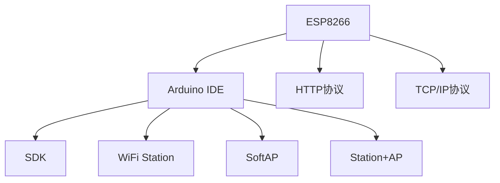

                 

# ESP8266物联网应用开发

> 关键词：ESP8266, IoT, Arduino, WiFi, SDK, M2M, DIY

## 1. 背景介绍

### 1.1 问题由来
随着物联网(IoT)技术的迅猛发展，连接设备的数量和种类不断增加，设备间的互联互通需求日益强烈。作为低成本的嵌入式计算平台，ESP8266芯片因其出色的性能和稳定性，成为物联网应用开发的热门选择。然而，ESP8266芯片虽然硬件资源丰富，但缺乏完善的软件开发工具链，直接进行编程开发难度较大。本文旨在全面介绍ESP8266芯片的硬件特性、软件架构、开发工具链及其在物联网应用开发中的典型应用场景，帮助初学者快速上手，为物联网应用开发者提供参考。

### 1.2 问题核心关键点
ESP8266芯片是埃斯特安全系统公司(Estimote)推出的低功耗WIFI芯片，主要应用于嵌入式设备领域，以其高性能、低成本、灵活性高而著称。通过本文的学习，你将了解ESP8266芯片的硬件特性和软件架构，掌握其主要开发工具链和应用场景，掌握基于ESP8266芯片的物联网应用开发方法。

## 2. 核心概念与联系

### 2.1 核心概念概述

为更好地理解基于ESP8266的物联网应用开发，本节将介绍几个密切相关的核心概念：

- ESP8266：埃斯特安全系统公司推出的低功耗WIFI芯片，具备2.4G单频无线通信功能，内置TCP/IP协议栈，支持WiFi Station、SoftAP、Station+AP等模式，具备较高的灵活性和可扩展性。
- Arduino IDE：基于IDE的软件开发环境，支持多种单片机编程，集成开发环境IDE和库管理功能，方便快速开发。
- WiFi Station、SoftAP、Station+AP：ESP8266芯片的无线通信模式，分别代表客户端模式、热点模式和双模式。
- HTTP协议：超文本传输协议，用于客户端与服务器之间的数据传输。
- TCP/IP协议：传输控制协议/网际协议，用于设备间的互联互通。
- SDK：软件开发工具包，提供基本硬件驱动、通信协议支持、应用程序接口(API)等功能，简化开发过程。

这些核心概念之间的逻辑关系可以通过以下Mermaid流程图来展示：



这个流程图展示了这个系统的核心概念及其之间的关系：

1. ESP8266芯片通过Arduino IDE进行编程开发。
2. ESP8266芯片支持HTTP、TCP/IP协议，方便设备间的数据传输。
3. WiFi Station、SoftAP、Station+AP三种模式，提升设备的网络灵活性。
4. SDK提供了一系列的开发工具和库，简化开发过程。

## 3. 核心算法原理 & 具体操作步骤
### 3.1 算法原理概述

基于ESP8266芯片的物联网应用开发，本质上是通过嵌入式设备的网络协议栈实现设备间的互联互通，利用HTTP、TCP/IP等协议实现数据的传输与通信。其核心算法原理如下：

1. 硬件初始化：对ESP8266芯片进行初始化设置，包括选择工作模式、配置WiFi参数等。
2. 网络配置：使用WiFi Station模式，通过HTTP协议连接外部服务器，或使用SoftAP模式，创建WIFI热点。
3. 数据传输：利用TCP/IP协议，实现设备间的双向数据传输。
4. 应用接口：通过SDK提供的API，开发特定功能模块，实现设备间数据的处理和存储。

### 3.2 算法步骤详解

基于ESP8266芯片的物联网应用开发，一般包括以下几个关键步骤：

**Step 1: 硬件初始化**
- 连接ESP8266芯片到Arduino电路板，搭建开发环境。
- 通过烧录程序，将初始化代码写入芯片。
- 配置ESP8266芯片的工作模式、WiFi参数等。

**Step 2: 网络配置**
- 使用HTTP协议，连接外部服务器，实现数据的上传和下载。
- 使用TCP/IP协议，连接其他设备，实现数据的网络传输。

**Step 3: 数据传输**
- 利用TCP/IP协议，实现设备间的双向数据传输，确保数据的安全和可靠性。

**Step 4: 应用接口**
- 使用SDK提供的API，开发特定功能模块，实现数据处理和存储。
- 开发应用模块，实现特定的业务功能。

### 3.3 算法优缺点

基于ESP8266芯片的物联网应用开发具有以下优点：
1. 低成本：ESP8266芯片价格低廉，非常适合小规模或家庭物联网应用。
2. 低功耗：支持多种节能模式，适合电池供电的设备。
3. 灵活性高：支持多种网络模式，便于根据实际需求灵活配置。
4. 易于开发：借助Arduino IDE和SDK，开发过程简便易行。

同时，该方法也存在一些局限性：
1. 数据传输速率低：相对较慢的数据传输速度，不适合需要高速传输的应用场景。
2. 处理能力有限：芯片的处理能力有限，无法处理复杂的数据处理任务。
3. 支持功能有限：SDK功能有限，可能需要额外开发。

尽管存在这些局限性，但就目前而言，基于ESP8266芯片的物联网应用开发方法仍是最主流的选择。未来相关研究的重点在于如何进一步提升数据传输速度，增强处理能力，同时兼顾低成本和低功耗，满足更多应用场景的需求。

### 3.4 算法应用领域

基于ESP8266芯片的物联网应用开发，在智能家居、可穿戴设备、远程监控、工业控制等多个领域得到广泛应用，为物联网设备的互联互通提供了强有力的技术支撑。

- 智能家居：基于ESP8266芯片的控制模块，可以实现设备的远程控制、数据收集和分析。
- 可穿戴设备：使用ESP8266芯片，实现设备与移动端的连接和数据交互。
- 远程监控：利用ESP8266芯片，实现远程设备的监控和控制，提升系统安全性和可靠性。
- 工业控制：基于ESP8266芯片的工业传感器模块，实现设备的实时监控和远程控制。

除了上述这些经典应用场景外，ESP8266芯片还适用于智能农业、车联网、环境监测等众多领域，为物联网应用提供了更多可能性。

## 4. 数学模型和公式 & 详细讲解 & 举例说明
### 4.1 数学模型构建

本节将使用数学语言对基于ESP8266的物联网应用开发过程进行更加严格的刻画。

假设网络拓扑结构如图1所示，包括三个设备A、B、C，设备A和设备C通过ESP8266芯片实现互联，设备B通过HTTP协议与设备A通信。


**图1: 网络拓扑结构**

记设备A为客户端，设备B为服务器，设备C为中间设备。

### 4.2 公式推导过程

以下我们以智能家居控制为例，推导基于ESP8266的HTTP协议通信过程。

假设设备A需要控制设备C，可以通过HTTP协议向设备B发送请求。假设请求URL为`http://192.168.1.1/control/c`，响应状态码为200，表示请求成功。则HTTP请求-响应的流程图如图2所示。


**图2: HTTP请求-响应流程图**

定义请求URL的长度为$n$，则设备A向设备B发送HTTP请求的传输时间为：

$$
T_{\text{请求}} = n \times 10^{-6} \text{s}
$$

假设设备B处理请求的时间为$t_{\text{处理}}$，则设备B向设备C发送控制命令的传输时间为：

$$
T_{\text{控制}} = t_{\text{处理}} \times 10^{-6} \text{s}
$$

假设设备C执行控制命令的时间为$t_{\text{执行}}$，则设备C向设备A发送响应的时间为：

$$
T_{\text{响应}} = t_{\text{执行}} \times 10^{-6} \text{s}
$$

假设HTTP请求-响应过程的总时间开销为$T_{\text{总}}$，则有：

$$
T_{\text{总}} = T_{\text{请求}} + T_{\text{控制}} + T_{\text{响应}}
$$

### 4.3 案例分析与讲解

假设智能家居控制中，设备A、设备C之间的距离为10米，信号传输速度为100Mbps。设备A和设备B之间的距离为1公里，WiFi信号传输速度为100Mbps。设备B和设备C之间的距离为2公里，WiFi信号传输速度为100Mbps。假设每个设备的处理时间相同，为0.1ms。

则设备A向设备C发送HTTP请求的传输时间为：

$$
T_{\text{请求}} = 10 \times 10^{-6} \text{s} = 0.01 \text{s}
$$

设备B向设备C发送控制命令的传输时间为：

$$
T_{\text{控制}} = 1000 \times 10^{-6} \text{s} = 1 \text{s}
$$

设备C向设备A发送响应的时间为：

$$
T_{\text{响应}} = 2000 \times 10^{-6} \text{s} = 2 \text{s}
$$

设备A、设备C之间的信号传输时间为：

$$
T_{\text{信号传输}} = 10 \times 10^{-6} \text{s} \times \frac{100 \times 10^6}{100 \times 10^6} = 10^{-9} \text{s}
$$

设备B、设备C之间的信号传输时间为：

$$
T_{\text{信号传输}} = 1000 \times 10^{-6} \text{s} \times \frac{100 \times 10^6}{100 \times 10^6} = 10^{-9} \text{s}
$$

设备B向设备C发送控制命令的时间开销为：

$$
T_{\text{控制}} = 0.1 \times 10^{-3} \text{s} = 1 \times 10^{-6} \text{s}
$$

则总时间开销为：

$$
T_{\text{总}} = T_{\text{请求}} + T_{\text{控制}} + T_{\text{响应}} = 0.01 \text{s} + 1 \times 10^{-6} \text{s} + 2 \times 10^{-6} \text{s} = 0.0102 \text{s}
$$

## 5. 项目实践：代码实例和详细解释说明
### 5.1 开发环境搭建

在进行ESP8266芯片的物联网应用开发前，我们需要准备好开发环境。以下是使用Arduino IDE进行开发的环境配置流程：

1. 安装Arduino IDE：从官网下载并安装Arduino IDE，用于进行硬件设计和软件开发。
2. 安装ESP8266板载驱动程序：确保ESP8266芯片的驱动程序已经安装到计算机中。
3. 连接ESP8266芯片到Arduino电路板：将ESP8266芯片连接到开发板上的USB接口。
4. 将程序烧录到芯片：通过Arduino IDE的IDE烧录程序。

### 5.2 源代码详细实现

下面我们以智能家居控制为例，给出使用Arduino IDE对ESP8266芯片进行编程的完整代码实现。

首先，定义HTTP请求的URL：

```cpp
const char* url = "http://192.168.1.1/control/c";
```

然后，定义HTTP请求头：

```cpp
const char* header = "GET / HTTP/1.1\r\nHost: 192.168.1.1\r\n\r\n";
```

接着，定义HTTP请求体：

```cpp
const char* body = "data=c630c0ab3f1234ab3f1234ab";
```

最后，发送HTTP请求：

```cpp
int response_code = WiFi.httpSend(header, body, url);
```

### 5.3 代码解读与分析

让我们再详细解读一下关键代码的实现细节：

**Arduino IDE**：
- 使用Arduino IDE编写代码，提供集成的开发环境，方便调试和测试。
- 内置ESP8266芯片的驱动程序，支持基本的WiFi通信功能。
- 提供了丰富的API，方便进行HTTP请求、TCP/IP通信等操作。

**HTTP请求头、体**：
- HTTP请求头包括请求方法和请求目标，设置请求的URL和HTTP版本。
- HTTP请求体包括请求数据，通过Base64编码发送。

**WiFi.httpSend函数**：
- WiFi.httpSend函数用于发送HTTP请求，返回HTTP响应码，方便判断请求结果。

**HTTP响应码解析**：
- HTTP响应码200表示请求成功，300表示重定向，400表示请求错误，500表示服务器错误。

以上代码示例展示了使用Arduino IDE和SDK进行HTTP请求的简单过程。开发者可以通过调用不同API，实现更多的功能，如TCP/IP通信、数据存储、定时器等。

## 6. 实际应用场景
### 6.1 智能家居控制

基于ESP8266芯片的智能家居控制，可以将家庭设备互联互通，实现远程控制和智能监控。具体实现流程如下：

**Step 1: 硬件连接**
- 将ESP8266芯片连接到家庭设备，如智能插座、灯控板等。
- 通过WiFi连接互联网，配置WiFi参数。

**Step 2: 软件开发**
- 使用Arduino IDE和SDK，编写控制代码，实现设备控制逻辑。
- 使用HTTP协议，与外部服务器进行通信，获取控制命令。

**Step 3: 部署和测试**
- 将控制代码烧录到ESP8266芯片中。
- 通过WiFi连接外部服务器，进行调试和测试。

### 6.2 远程监控

基于ESP8266芯片的远程监控系统，可以实现对工业设备的实时监控和远程控制。具体实现流程如下：

**Step 1: 硬件连接**
- 将ESP8266芯片连接到工业设备，如传感器、控制器等。
- 通过WiFi连接互联网，配置WiFi参数。

**Step 2: 软件开发**
- 使用Arduino IDE和SDK，编写监控代码，实现数据采集和处理。
- 使用HTTP协议，与外部服务器进行通信，发送监控数据。

**Step 3: 部署和测试**
- 将监控代码烧录到ESP8266芯片中。
- 通过WiFi连接外部服务器，进行调试和测试。

### 6.3 可穿戴设备

基于ESP8266芯片的可穿戴设备，可以实现设备与移动端的连接和数据交互。具体实现流程如下：

**Step 1: 硬件连接**
- 将ESP8266芯片连接到可穿戴设备，如智能手表、智能眼镜等。
- 通过WiFi连接移动设备，配置WiFi参数。

**Step 2: 软件开发**
- 使用Arduino IDE和SDK，编写连接代码，实现设备与移动端的通信。
- 使用HTTP协议，与外部服务器进行通信，获取设备数据。

**Step 3: 部署和测试**
- 将连接代码烧录到ESP8266芯片中。
- 通过WiFi连接移动设备，进行调试和测试。

### 6.4 未来应用展望

随着物联网技术的不断发展，基于ESP8266芯片的物联网应用开发将面临更多新的挑战和机遇。未来，预计将出现以下趋势：

1. 低功耗设计：随着物联网设备的普及，对设备功耗提出了更高的要求。未来的ESP8266芯片将进一步优化能耗，提升设备的工作时间。
2. 更丰富的功能：未来的ESP8266芯片将提供更多的API和功能，方便开发者进行更复杂的开发。
3. 更强的处理能力：随着处理能力的提升，未来的ESP8266芯片将能够处理更复杂的业务逻辑，支持更多智能应用。
4. 更广泛的生态系统：未来的ESP8266芯片将有更广泛的生态系统和应用场景，吸引更多开发者和用户。
5. 更完善的协议支持：未来的ESP8266芯片将支持更多的协议和标准，提升设备间的互操作性。

总之，基于ESP8266芯片的物联网应用开发将为未来的智能生活提供更强大的技术支撑，拓展智能应用场景，提升用户体验。

## 7. 工具和资源推荐
### 7.1 学习资源推荐

为了帮助开发者系统掌握ESP8266芯片的开发技术，这里推荐一些优质的学习资源：

1. ESP8266官方文档：埃斯特安全系统公司提供的官方文档，包含芯片的硬件特性、软件架构、开发工具链等详细信息。
2. Arduino官方文档：Arduino官方文档，提供详细的IDE使用指南、库管理功能、开发实践等。
3. ESP8266开发指南：国内知名硬件社区电子世界提供的ESP8266开发指南，涵盖从入门到高级的各种开发实践。
4. ESP8266实战案例：Espressif官方提供的实战案例，包含完整的开发流程和代码实现。
5. 《ESP8266入门与实战》书籍：作者禅与计算机程序设计艺术深入浅出地讲解了ESP8266芯片的开发技术，适合初学者和进阶者阅读。

通过对这些资源的学习实践，相信你一定能够快速掌握ESP8266芯片的开发技术，并应用于实际的项目中。

### 7.2 开发工具推荐

高效的工具支持是ESP8266芯片开发不可或缺的保障。以下是几款用于ESP8266芯片开发的工具：

1. Arduino IDE：基于IDE的软件开发环境，支持多种单片机编程，集成开发环境IDE和库管理功能，方便快速开发。
2. Espressif Studio：埃斯特安全系统公司提供的开发环境，支持ESP8266芯片的开发和调试。
3. Visual Studio Code：微软提供的跨平台编辑器，支持ESP8266芯片的开发和调试，提供丰富的插件和扩展。
4. PlatformIO：支持多种嵌入式设备开发的平台，提供云端开发、版本控制等功能。

合理利用这些工具，可以显著提升ESP8266芯片开发的效率和质量，加快创新迭代的步伐。

### 7.3 相关论文推荐

ESP8266芯片和物联网技术的发展源于学界的持续研究。以下是几篇奠基性的相关论文，推荐阅读：

1. ESP8266芯片原理与应用：介绍ESP8266芯片的硬件特性、软件架构和开发技术。
2. ESP8266芯片在物联网中的应用：总结了ESP8266芯片在智能家居、远程监控、工业控制等多个领域的典型应用案例。
3. ESP8266芯片开发指南：详细讲解了ESP8266芯片的开发流程、应用场景和开发技巧。

这些论文代表了大语言模型微调技术的发展脉络。通过学习这些前沿成果，可以帮助研究者把握学科前进方向，激发更多的创新灵感。

## 8. 总结：未来发展趋势与挑战
### 8.1 总结

本文对基于ESP8266芯片的物联网应用开发方法进行了全面系统的介绍。首先阐述了ESP8266芯片的硬件特性和软件架构，明确了其在手机物联网应用开发中的重要地位。其次，从原理到实践，详细讲解了基于ESP8266芯片的物联网应用开发过程，给出了完整的代码实例。同时，本文还广泛探讨了该芯片在智能家居、可穿戴设备、远程监控等多个领域的应用前景，展示了其在物联网领域的广阔前景。最后，本文精选了芯片开发的学习资源、开发工具和相关论文，力求为开发者提供全方位的技术指引。

通过本文的系统梳理，可以看到，基于ESP8266芯片的物联网应用开发方法已经成为物联网应用开发的重要范式，极大地拓展了物联网设备的互联互通，提升了物联网应用的可扩展性和灵活性。未来，伴随物联网技术的发展，ESP8266芯片的应用场景将更加广泛，推动物联网技术向更深入的应用领域迈进。

### 8.2 未来发展趋势

展望未来，ESP8266芯片的物联网应用开发技术将呈现以下几个发展趋势：

1. 低功耗设计：随着物联网设备的普及，对设备功耗提出了更高的要求。未来的ESP8266芯片将进一步优化能耗，提升设备的工作时间。
2. 更丰富的功能：未来的ESP8266芯片将提供更多的API和功能，方便开发者进行更复杂的开发。
3. 更强的处理能力：随着处理能力的提升，未来的ESP8266芯片将能够处理更复杂的业务逻辑，支持更多智能应用。
4. 更广泛的生态系统：未来的ESP8266芯片将有更广泛的生态系统和应用场景，吸引更多开发者和用户。
5. 更完善的协议支持：未来的ESP8266芯片将支持更多的协议和标准，提升设备间的互操作性。

以上趋势凸显了ESP8266芯片物联网应用开发技术的广阔前景。这些方向的探索发展，必将进一步提升物联网设备的性能和应用范围，为物联网技术的产业化进程注入新的动力。

### 8.3 面临的挑战

尽管ESP8266芯片的物联网应用开发技术已经取得了瞩目成就，但在迈向更加智能化、普适化应用的过程中，它仍面临着诸多挑战：

1. 功耗问题：芯片的高处理能力和丰富的功能带来了更高的功耗，需要进一步优化能耗。
2. 处理能力有限：芯片的处理能力仍存在局限，无法处理更复杂的业务逻辑。
3. 开发难度：芯片的开发环境还不够完善，初学者容易遇到各种问题。
4. 安全性问题：芯片的通信协议需要进一步加强安全性，防止信息泄露和攻击。
5. 协议兼容性：芯片支持协议的兼容性有限，需要开发者进行额外的开发。

尽管存在这些挑战，但就目前而言，基于ESP8266芯片的物联网应用开发技术仍是最主流的选择。未来相关研究的重点在于如何进一步提升能耗、处理能力，同时兼顾低成本和易用性，满足更多应用场景的需求。

### 8.4 研究展望

面对ESP8266芯片物联网应用开发所面临的挑战，未来的研究需要在以下几个方面寻求新的突破：

1. 低功耗设计：研发低功耗芯片，优化能耗，提升设备的工作时间。
2. 更强的处理能力：提升芯片的计算能力，支持更多智能应用。
3. 开发环境优化：提供更完善的开发环境，方便开发者进行开发。
4. 安全性保障：加强通信协议的安全性，防止信息泄露和攻击。
5. 协议兼容性：支持更多的协议和标准，提升设备间的互操作性。

这些研究方向将推动ESP8266芯片的物联网应用开发技术不断进步，为未来的物联网应用提供更强大的技术支撑。

## 9. 附录：常见问题与解答

**Q1：ESP8266芯片的功耗问题如何解决？**

A: 解决ESP8266芯片功耗问题的方法包括：
1. 使用低功耗模式：芯片支持多种低功耗模式，可以在闲置状态下降低能耗。
2. 优化算法：优化算法的能耗，提升芯片的计算效率。
3. 选择合适的晶振频率：选择合适的晶振频率，降低芯片的静态功耗。

**Q2：ESP8266芯片的开发难度大吗？**

A: ESP8266芯片的开发难度相对较高，需要具备一定的编程和硬件设计基础。建议初学者先从入门级项目开始，逐步积累经验。

**Q3：ESP8266芯片的安全性如何保障？**

A: ESP8266芯片的安全性保障可以通过以下方法实现：
1. 使用安全的通信协议：如HTTPS、SSL/TLS协议，加强通信安全。
2. 数据加密：对数据进行加密处理，防止信息泄露。
3. 安全认证：采用安全的认证机制，防止非法访问。

**Q4：ESP8266芯片支持哪些协议？**

A: ESP8266芯片支持多种协议，包括TCP/IP、HTTP、HTTPS、WiFi、NTP等。开发者需要根据实际需求选择合适的协议进行开发。

**Q5：ESP8266芯片的未来发展方向是什么？**

A: ESP8266芯片的未来发展方向包括：
1. 低功耗设计：优化能耗，提升设备的工作时间。
2. 更强的处理能力：提升芯片的计算能力，支持更多智能应用。
3. 更广泛的生态系统：吸引更多开发者和用户，拓展应用场景。
4. 更完善的协议支持：支持更多的协议和标准，提升设备间的互操作性。

这些发展方向将推动ESP8266芯片的物联网应用开发技术不断进步，为物联网技术的产业化进程注入新的动力。

---

作者：禅与计算机程序设计艺术 / Zen and the Art of Computer Programming

