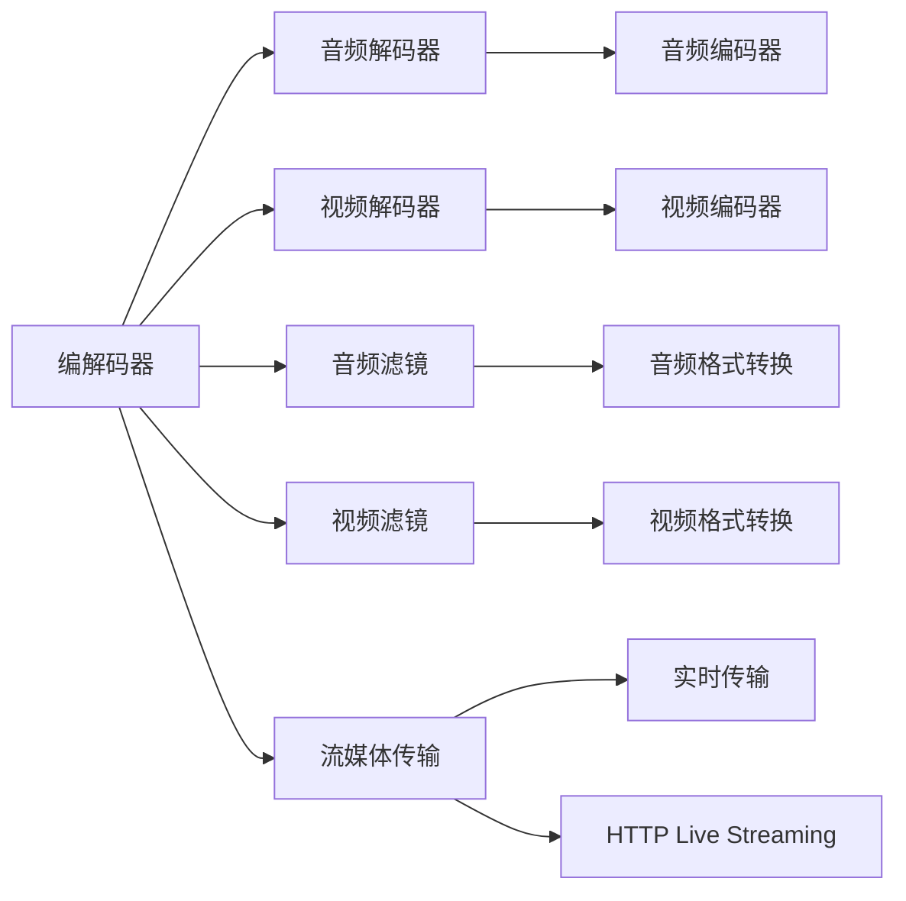

                 

# FFmpeg音视频处理入门

## 1. 背景介绍

### 1.1 问题由来
随着互联网和移动设备的普及，音视频内容变得越来越重要。视频网站的兴起，流媒体服务的广泛应用，以及个人摄像设备（如智能手机）的普及，使得音视频处理需求激增。然而，高品质的音视频处理通常需要耗费大量计算资源和时间。因此，音视频处理领域亟需一款高效、易用且功能强大的开源软件库。

### 1.2 问题核心关键点
FFmpeg是一款由FFmpeg项目组开发的多媒体处理软件库。它支持几乎所有主流的视频和音频格式，并提供了广泛的音频和视频编解码器，以及音频和视频滤镜。FFmpeg以其性能强大、功能丰富、易用性强等特点，广泛应用于音视频处理、视频编码、流媒体传输、视频编辑等多个领域。

## 2. 核心概念与联系

### 2.1 核心概念概述
FFmpeg的核心概念包括音视频编解码、音视频滤镜、流媒体传输、音视频编转码、音视频格式转换等。这些概念通过以下几个核心组件和模块实现：

1. **编解码器**：负责音视频数据的编解码，实现音视频文件的格式转换。
2. **音频和视频滤镜**：用于对音视频数据进行剪辑、滤镜等处理，实现音视频的后处理效果。
3. **流媒体传输**：实现音视频的实时传输和分发，支持RTMP、HTTP Live Streaming等协议。
4. **音视频编转码**：将不同编码格式的音视频文件进行编转码，实现音视频的质量优化。
5. **音视频格式转换**：支持多种音视频格式的互相转换，实现跨平台音视频兼容性。

这些核心组件和模块通过FFmpeg的命令行界面、API接口等形式，提供给开发者和用户使用。

### 2.2 核心概念原理和架构的 Mermaid 流程图


### 2.3 核心概念之间的联系
FFmpeg的核心概念通过以下几个层面实现相互联系：

1. **编解码器模块**：负责音视频的编解码，实现音视频数据的格式转换。
2. **音频和视频滤镜**：基于编解码器输出的音视频数据，进行剪辑、滤镜等处理，实现音视频的后处理效果。
3. **流媒体传输**：将编解码和滤镜处理后的音视频数据进行实时传输和分发，支持RTMP、HTTP Live Streaming等协议。
4. **音视频编转码**：通过编解码器对不同编码格式的音视频文件进行编转码，实现音视频的质量优化。
5. **音视频格式转换**：通过编解码器实现多种音视频格式的互相转换，实现跨平台音视频兼容性。

通过这些模块和组件的协同工作，FFmpeg实现了音视频处理的完整流程，支持从原始音视频数据的获取、处理、传输到最终输出，满足了各种音视频处理需求。

## 3. 核心算法原理 & 具体操作步骤

### 3.1 算法原理概述
FFmpeg的核心算法原理主要基于编解码器和滤镜。编解码器负责音视频数据的编解码，滤镜负责音视频数据的处理。

### 3.2 算法步骤详解
1. **音视频数据的编解码**：
   - 音视频编解码器将音视频数据从一种格式转换为另一种格式，例如将MP4格式的视频文件转换为H.264编码的格式。
   - 音视频编解码器包括视频编解码器和音频编解码器，分别用于处理视频和音频数据。

2. **音视频数据的处理**：
   - 音视频滤镜对音视频数据进行剪辑、滤镜等处理，实现音视频的后处理效果。
   - 音视频滤镜包括音频滤镜和视频滤镜，分别用于处理音频和视频数据。

3. **音视频数据的实时传输**：
   - 流媒体传输模块将处理后的音视频数据进行实时传输，支持RTMP、HTTP Live Streaming等协议。
   - 流媒体传输模块将音视频数据发送到指定的客户端，实现音视频的实时播放。

4. **音视频数据的编转码**：
   - 音视频编转码模块将不同编码格式的音视频文件进行编转码，实现音视频的质量优化。
   - 音视频编转码模块包括视频编转码和音频编转码，分别用于处理视频和音频数据。

5. **音视频数据的格式转换**：
   - 音视频格式转换模块将不同格式的音视频文件进行格式转换，实现跨平台音视频兼容性。
   - 音视频格式转换模块支持多种音视频格式的互相转换，实现跨平台音视频兼容性。

### 3.3 算法优缺点
#### 优点：
1. **功能丰富**：FFmpeg支持几乎所有主流的视频和音频格式，并提供了广泛的音视频编解码器和滤镜。
2. **性能强大**：FFmpeg的编解码器经过了大量的优化和测试，能够高效处理大规模音视频数据。
3. **易用性强**：FFmpeg提供了命令行界面和API接口，用户和开发者可以轻松地使用FFmpeg进行音视频处理。

#### 缺点：
1. **复杂度高**：FFmpeg的功能和组件非常丰富，初学者可能难以快速上手。
2. **配置复杂**：FFmpeg的配置和使用需要一定的技术背景，用户和开发者需要花费一定的时间进行学习和配置。
3. **版本更新频繁**：FFmpeg的项目组和社区非常活跃，版本更新非常频繁，用户和开发者需要不断关注新版本和更新内容。

### 3.4 算法应用领域
FFmpeg在音视频处理领域具有广泛的应用，主要包括：

1. **音视频编转码**：将不同编码格式的音视频文件进行编转码，实现音视频的质量优化。
2. **流媒体传输**：实现音视频的实时传输和分发，支持RTMP、HTTP Live Streaming等协议。
3. **音视频剪辑**：对音视频文件进行剪辑、剪辑、滤镜等处理，实现音视频的后处理效果。
4. **音视频格式转换**：将不同格式的音视频文件进行格式转换，实现跨平台音视频兼容性。

## 4. 数学模型和公式 & 详细讲解 & 举例说明

### 4.1 数学模型构建
FFmpeg的核心算法原理主要基于编解码器和滤镜。编解码器负责音视频数据的编解码，滤镜负责音视频数据的处理。

### 4.2 公式推导过程
1. **音视频编解码**：
   - 假设原始音视频数据为$x$，经过编解码器处理后的数据为$y$，编解码器可以表示为：
     - $$y = f(x)$$

2. **音视频滤镜**：
   - 假设原始音视频数据为$x$，经过滤镜处理后的数据为$y$，滤镜可以表示为：
     - $$y = g(x)$$

3. **音视频实时传输**：
   - 假设原始音视频数据为$x$，经过编解码器和滤镜处理后的数据为$y$，实时传输后的数据为$z$，实时传输模块可以表示为：
     - $$z = h(y)$$

4. **音视频编转码**：
   - 假设原始音视频数据为$x$，经过编转码处理后的数据为$y$，编转码模块可以表示为：
     - $$y = k(x)$$

5. **音视频格式转换**：
   - 假设原始音视频数据为$x$，经过格式转换处理后的数据为$y$，格式转换模块可以表示为：
     - $$y = m(x)$$

### 4.3 案例分析与讲解
假设我们要将一个MP4格式的视频文件转换为H.264编码的格式，并添加字幕和滤镜效果。

1. **音视频编解码**：
   - 原始视频文件为$x$，经过编解码器处理后的视频文件为$y$，编解码器可以表示为：
     - $$y = f(x)$$

2. **添加字幕**：
   - 假设字幕文件为$z$，经过滤镜处理后的字幕文件为$w$，滤镜可以表示为：
     - $$w = g(z)$$

3. **滤镜效果**：
   - 假设经过字幕处理后的视频文件为$v$，经过滤镜处理后的视频文件为$u$，滤镜可以表示为：
     - $$u = h(v)$$

4. **音视频编转码**：
   - 假设经过滤镜处理后的视频文件为$v$，经过编转码处理后的视频文件为$y$，编转码模块可以表示为：
     - $$y = k(v)$$

5. **格式转换**：
   - 假设经过编转码处理后的视频文件为$y$，经过格式转换处理后的视频文件为$z$，格式转换模块可以表示为：
     - $$z = m(y)$$

最终，我们得到了处理后的视频文件$z$，它包含H.264编码的格式、字幕和滤镜效果。

## 5. 项目实践：代码实例和详细解释说明

### 5.1 开发环境搭建
1. **安装FFmpeg**：
   - 从FFmpeg官网下载最新版本的FFmpeg二进制文件。
   - 解压缩后，将FFmpeg可执行文件放到系统路径中。

2. **配置环境变量**：
   - 打开命令行，输入以下命令，将FFmpeg可执行文件添加到系统路径中：
     - $$export PATH=$PATH:/path/to/ffmpeg/bin$$

3. **安装依赖库**：
   - 安装FFmpeg的依赖库，例如libavformat、libavcodec等。

### 5.2 源代码详细实现
假设我们要将一个MP4格式的视频文件转换为H.264编码的格式，并添加字幕和滤镜效果。

```bash
ffmpeg -i input.mp4 -c:v libx264 -c:a aac -t 00:01:00 output.mp4
```

### 5.3 代码解读与分析
1. **-i**：输入文件名，指定要转换的视频文件。
2. **-c:v libx264**：视频编解码器，将视频文件转换为H.264编码的格式。
3. **-c:a aac**：音频编解码器，将视频文件转换为AAC音频格式。
4. **-t 00:01:00**：截取时间，只截取视频的前1分钟。
5. **output.mp4**：输出文件名，指定转换后的视频文件。

## 6. 实际应用场景
### 6.1 音视频编转码
音视频编转码是FFmpeg的重要应用之一。假设我们要将一个MKV格式的视频文件转换为H.264编码的格式，可以使用以下命令：

```bash
ffmpeg -i input.mkv -c:v libx264 -c:a aac output.mp4
```

### 6.2 流媒体传输
流媒体传输是FFmpeg的另一个重要应用。假设我们要将一个MP4格式的视频文件实时传输到RTMP服务器，可以使用以下命令：

```bash
ffmpeg -i input.mp4 -c:v libx264 -c:a aac -f flv -rtsp_transport rtsp rtmp://stream/stream.flv output.flv
```

### 6.3 音视频剪辑
音视频剪辑是FFmpeg的另一个重要应用。假设我们要将一个MP4格式的视频文件剪辑成两个片段，可以使用以下命令：

```bash
ffmpeg -i input.mp4 -t 00:01:00 -c copy output.mp4 -t 00:01:00 -c copy output2.mp4
```

### 6.4 未来应用展望
随着人工智能和云计算技术的发展，FFmpeg将有更多的应用场景，例如：

1. **智能音视频处理**：利用深度学习技术，实现智能音视频剪辑、智能字幕生成等。
2. **云音视频处理**：在云平台上部署FFmpeg，实现大规模音视频处理的分布式处理。
3. **音视频编转码**：利用云计算资源，实现实时音视频编转码和流媒体传输。

## 7. 工具和资源推荐

### 7.1 学习资源推荐
1. **FFmpeg官方文档**：
   - FFmpeg的官方文档详细介绍了FFmpeg的功能和使用方法，是学习FFmpeg的最佳资源。
2. **FFmpeg教程**：
   - 网络上有很多FFmpeg的教程和视频，初学者可以通过这些教程快速上手。
3. **FFmpeg社区**：
   - FFmpeg的社区活跃度非常高，用户和开发者可以在社区中分享经验和解决问题。

### 7.2 开发工具推荐
1. **命令行界面**：
   - 通过命令行界面，用户和开发者可以轻松地使用FFmpeg进行音视频处理。
2. **API接口**：
   - FFmpeg提供了多种API接口，用户和开发者可以通过API接口进行音视频处理。

### 7.3 相关论文推荐
1. **FFmpeg论文**：
   - FFmpeg项目组发表了多篇关于FFmpeg的研究论文，介绍了FFmpeg的核心算法和实现细节。

## 8. 总结：未来发展趋势与挑战

### 8.1 研究成果总结
FFmpeg作为一款功能强大、性能卓越的多媒体处理软件库，广泛应用于音视频处理、视频编码、流媒体传输、视频编辑等多个领域。FFmpeg的成功得益于其丰富的功能、强大的性能和易用性。

### 8.2 未来发展趋势
1. **智能音视频处理**：利用深度学习技术，实现智能音视频剪辑、智能字幕生成等。
2. **云音视频处理**：在云平台上部署FFmpeg，实现大规模音视频处理的分布式处理。
3. **音视频编转码**：利用云计算资源，实现实时音视频编转码和流媒体传输。

### 8.3 面临的挑战
1. **复杂度高**：FFmpeg的功能和组件非常丰富，初学者可能难以快速上手。
2. **配置复杂**：FFmpeg的配置和使用需要一定的技术背景，用户和开发者需要花费一定的时间进行学习和配置。
3. **版本更新频繁**：FFmpeg的项目组和社区非常活跃，版本更新非常频繁，用户和开发者需要不断关注新版本和更新内容。

### 8.4 研究展望
未来，FFmpeg将在以下几个方向进一步发展：

1. **智能音视频处理**：利用深度学习技术，实现智能音视频剪辑、智能字幕生成等。
2. **云音视频处理**：在云平台上部署FFmpeg，实现大规模音视频处理的分布式处理。
3. **音视频编转码**：利用云计算资源，实现实时音视频编转码和流媒体传输。

## 9. 附录：常见问题与解答

**Q1：FFmpeg的性能如何？**
A: FFmpeg的性能非常强大，能够高效处理大规模音视频数据。FFmpeg的编解码器经过了大量的优化和测试，能够高效处理各种音视频格式。

**Q2：FFmpeg如何进行安装和配置？**
A: 从FFmpeg官网下载最新版本的FFmpeg二进制文件，解压缩后，将FFmpeg可执行文件放到系统路径中。打开命令行，输入以下命令，将FFmpeg可执行文件添加到系统路径中：

```bash
export PATH=$PATH:/path/to/ffmpeg/bin
```

**Q3：FFmpeg支持的音视频格式有哪些？**
A: FFmpeg支持几乎所有主流的视频和音频格式，包括MP4、MKV、AVI、MOV、WMV、WAV、MP3等。

**Q4：FFmpeg如何使用命令行界面进行音视频处理？**
A: 打开命令行，输入FFmpeg的命令行，指定输入文件、输出文件和处理选项，即可进行音视频处理。例如：

```bash
ffmpeg -i input.mp4 -c:v libx264 -c:a aac -t 00:01:00 output.mp4
```

**Q5：FFmpeg如何使用API接口进行音视频处理？**
A: FFmpeg提供了多种API接口，用户和开发者可以通过API接口进行音视频处理。例如：

```c
FFmpeg::FormatContext* formatContext = avformat_alloc_context();
avformat_open_input(&formatContext, "input.mp4", nullptr, nullptr);
avformat_find_stream_info(formatContext, nullptr);
```

以上是FFmpeg音视频处理入门的详细介绍，希望能帮助读者更好地理解和应用FFmpeg。

