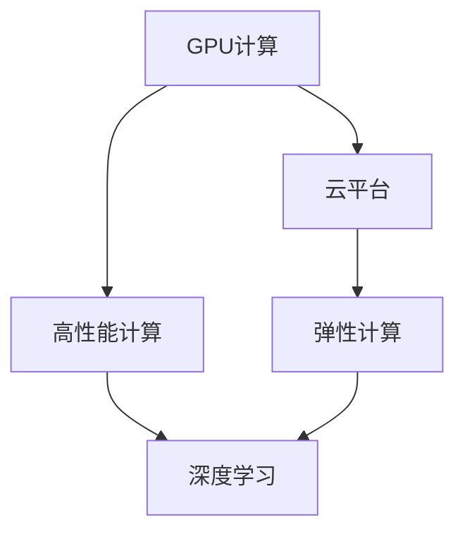

                 

# FastGPU发布：Lepton AI云GPU解决方案经济高效可靠

> 关键词：Lepton AI, GPU加速, 云计算, 高性能计算, 深度学习

## 1. 背景介绍

### 1.1 问题由来
在深度学习快速发展的背景下，计算资源成为了制约AI模型性能提升的重要瓶颈。传统的GPU集群虽然可以提供强大的计算能力，但其高昂的硬件成本、复杂的管理维护及扩展难度等问题，使得许多中小企业和科研机构难以承受。为了破解这一难题，Lepton AI推出了基于云计算的高性能计算平台——FastGPU。

### 1.2 问题核心关键点
FastGPU平台专注于为AI用户提供经济、高效、可靠的云GPU计算服务，具有以下关键优势：
1. **弹性计算**：用户可以根据实际需求动态调整计算资源，按需计费。
2. **即用即付**：无需长期支付固定硬件成本，节省资金。
3. **平台易用**：提供便捷的API接口和用户友好的操作界面，简化使用流程。
4. **高性能**：采用最新GPU硬件，提供强大的计算能力。
5. **安全可靠**：提供数据加密、安全认证等安全措施，保障数据安全。

这些关键优势使得FastGPU成为大模型训练、深度学习、图像处理、数据分析等高性能计算场景的理想选择。

## 2. 核心概念与联系

### 2.1 核心概念概述

为更好地理解FastGPU的原理和应用，本节将介绍几个核心概念：

- **GPU计算**：图形处理器（GPU）通过并行计算，加速深度学习模型的训练和推理，比传统的CPU效率更高。
- **云平台**：通过网络将计算资源提供给用户，用户只需通过客户端即可访问和使用，无需维护物理硬件。
- **弹性计算**：根据用户需求动态调整计算资源，提供按需计算服务。
- **高性能计算（HPC）**：通过并行计算和分布式计算技术，提高计算效率，处理大规模和高复杂度的计算任务。
- **深度学习**：一种利用神经网络进行训练和推理的机器学习技术，广泛应用于图像、语音、自然语言处理等领域。

这些核心概念之间的逻辑关系可以通过以下Mermaid流程图来展示：



这个流程图展示了GPU计算如何通过云平台提供弹性计算服务，从而支撑深度学习的高性能计算需求。

## 3. 核心算法原理 & 具体操作步骤

### 3.1 算法原理概述

FastGPU平台的算法原理主要涉及GPU并行计算和云平台资源管理两个方面：

- **GPU并行计算**：通过GPU硬件的并行计算能力，大幅提升深度学习模型的训练和推理速度。
- **云平台资源管理**：通过弹性计算，根据用户需求动态调整计算资源，提供按需服务。

### 3.2 算法步骤详解

FastGPU平台的核心步骤包括：

**Step 1: 用户注册与登录**
- 用户访问FastGPU官网，注册账号并登录。

**Step 2: 创建计算实例**
- 用户通过管理控制台，创建符合需求的GPU计算实例。选择适当的GPU型号、内存大小、存储容量等参数。

**Step 3: 部署应用**
- 用户将深度学习应用部署到FastGPU的计算实例中，设置应用的启动脚本、依赖库等配置。

**Step 4: 启动计算**
- 用户通过API或管理控制台，启动计算实例。FastGPU平台自动调度计算资源，执行应用。

**Step 5: 监控与优化**
- 用户实时监控计算实例的状态，可以通过管理控制台查看计算任务的状态、资源使用情况等。
- FastGPU平台提供自动调度和负载均衡功能，优化计算资源的利用率。

### 3.3 算法优缺点

FastGPU平台具备以下优点：
1. **低成本**：按需计费，无需长期支付固定硬件成本。
2. **高效能**：采用最新GPU硬件，提供强大的计算能力。
3. **易使用**：通过管理控制台和API接口，使用简便。
4. **弹性扩展**：根据需求动态调整计算资源，避免资源浪费。
5. **安全可靠**：提供数据加密、安全认证等安全措施。

同时，也存在以下缺点：
1. **网络延迟**：云计算环境下的网络延迟可能影响性能。
2. **隔离性不足**：不同用户之间的计算资源可能存在共享风险。
3. **管理复杂**：云平台的管理和维护需要一定的技术支持。

### 3.4 算法应用领域

FastGPU平台适用于各种高性能计算场景，包括但不限于：

- **深度学习**：大规模模型训练、图像分类、目标检测等任务。
- **数据分析**：大数据处理、数据挖掘、机器学习等任务。
- **科学计算**：物理模拟、天气预测、金融分析等科学计算任务。
- **医疗健康**：医疗影像分析、基因组学研究等任务。
- **自然语言处理**：自然语言生成、文本分类、情感分析等任务。
- **游戏开发**：实时渲染、物理模拟、AI决策等任务。

## 4. 数学模型和公式 & 详细讲解 & 举例说明

### 4.1 数学模型构建

FastGPU平台主要涉及的数学模型包括深度学习模型和资源调度模型。

**深度学习模型**：
假设深度学习模型为 $M(x;\theta)$，其中 $x$ 为输入，$\theta$ 为模型参数。模型通过前向传播和反向传播更新参数 $\theta$，最小化损失函数 $\mathcal{L}(y, M(x;\theta))$，其中 $y$ 为真实标签。

**资源调度模型**：
假设资源调度器为 $S$，接收用户请求 $R$，返回计算资源分配方案 $A$。调度模型通过最小化资源消耗 $C(A)$ 和用户满意度 $U(A)$ 来优化分配方案。

### 4.2 公式推导过程

以深度学习模型的训练为例，其前向传播和反向传播的公式如下：

- 前向传播：$y = M(x;\theta)$
- 反向传播：$\frac{\partial \mathcal{L}}{\partial \theta} = \frac{\partial \mathcal{L}}{\partial y} \frac{\partial y}{\partial x} \frac{\partial x}{\partial \theta}$

对于资源调度模型，假设调度器采用拍卖机制，接收用户请求 $R_i = (c_i, t_i)$，其中 $c_i$ 为计算资源需求，$t_i$ 为计算时间。调度器的目标是最小化总资源消耗 $C(A) = \sum_{i=1}^n c_i$，同时最大化用户满意度 $U(A) = \sum_{i=1}^n t_i$。

### 4.3 案例分析与讲解

假设有一个深度学习模型需要在大规模数据集上训练，我们需要在FastGPU平台上进行资源调度。用户请求的计算资源需求为 10 个 GPU，运行时间为 10 天。

**Step 1: 资源拍卖**  
- 平台将用户请求发布到市场，其他用户可以出价竞争资源。假设存在两个出价，分别为 $(c_1, t_1)$ 和 $(c_2, t_2)$。

**Step 2: 资源分配**  
- 调度器通过拍卖机制，选择最优的资源分配方案。假设最终选择了 $(c_1, t_1)$，分配给用户。

**Step 3: 计算执行**  
- 用户将模型部署到分配的计算实例中，开始执行训练任务。

**Step 4: 监控与优化**  
- 用户实时监控计算实例的状态，发现计算资源利用率不足，自动扩展实例至 15 个 GPU，提升计算效率。

## 5. 项目实践：代码实例和详细解释说明

### 5.1 开发环境搭建

**Step 1: 安装 FastGPU SDK**
```bash
pip install fastgpu
```

**Step 2: 配置环境变量**
```bash
export FASTGPU_ACCESS_KEY=<访问密钥>
export FASTGPU_SECRET_KEY=<访问密钥秘钥>
```

**Step 3: 启动计算实例**
```bash
fastgpu start --instance-type g4dn.xlarge --gpu 2 --memory 16 --disk 256
```

### 5.2 源代码详细实现

**Step 1: 编写训练脚本**
```python
import fastgpu as fg

# 创建计算实例
instance = fg.create_instance('g4dn.xlarge', 2, 16, 256)

# 将模型和数据上传至计算实例
instance.upload_model('model.pth')
instance.upload_data('data.tar.gz')

# 启动训练任务
instance.start_train('train.py')

# 监控训练进度
instance.monitor()

# 停止训练
instance.stop()
```

### 5.3 代码解读与分析

- **FastGPU SDK**：提供了一组简单易用的API，支持创建计算实例、上传数据、启动任务、监控进度等操作。
- **实例创建**：使用 `fg.create_instance` 方法创建计算实例，并指定GPU型号、内存大小、存储容量等参数。
- **数据上传**：使用 `instance.upload_model` 和 `instance.upload_data` 方法上传模型和数据。
- **任务启动**：使用 `instance.start_train` 方法启动训练任务，并指定训练脚本名称。
- **任务监控**：使用 `instance.monitor` 方法实时监控计算实例的状态。
- **任务停止**：使用 `instance.stop` 方法停止训练任务。

## 6. 实际应用场景

### 6.1 科学计算

在科学计算领域，FastGPU平台可以用于物理模拟、气象预测、生物信息学等复杂计算任务。例如，在天气预测中，需要模拟大量的气象数据，计算密集度极高。通过FastGPU平台，研究人员可以动态调整计算资源，快速完成计算任务，获得精确的气象预测结果。

### 6.2 自然语言处理

在自然语言处理领域，FastGPU平台可以用于大规模语言模型的训练和推理。例如，基于 GPT 模型进行自然语言生成和文本分类。通过 FastGPU 的高性能计算能力，可以快速训练出高质量的模型，并在实际应用中大幅提升处理效率。

### 6.3 图像处理

在图像处理领域，FastGPU平台可以用于大规模图像分类、目标检测、图像生成等任务。例如，在自动驾驶中，需要对海量图像进行分类和标注。通过 FastGPU 的高性能计算，可以加速图像处理流程，提升自动驾驶系统的精度和响应速度。

### 6.4 未来应用展望

随着技术的不断进步，FastGPU平台将支持更多新功能和应用场景：

- **多云支持**：支持在多个云平台上无缝部署计算任务，提高资源利用率。
- **AI市场**：提供AI模型市场，用户可以直接购买和部署预训练模型。
- **自动化部署**：支持通过代码或图形界面自动创建和管理计算实例。
- **数据管理**：提供数据存储和数据共享功能，方便用户管理数据资源。
- **AI生态**：支持与其他AI平台和工具的集成和互通，构建完整的AI生态系统。

## 7. 工具和资源推荐

### 7.1 学习资源推荐

为了帮助用户更好地使用FastGPU平台，Lepton AI提供了丰富的学习资源：

1. **官方文档**：提供详细的API接口文档和实例代码，帮助用户快速上手。
2. **社区论坛**：提供技术支持和交流平台，帮助用户解决常见问题。
3. **培训课程**：提供深度学习、高性能计算等课程，帮助用户提升技术能力。
4. **示例项目**：提供多个示例项目和代码，帮助用户理解应用场景。

### 7.2 开发工具推荐

FastGPU平台提供了一组易于使用的开发工具，帮助用户高效地进行计算任务：

1. **FastGPU SDK**：提供简单易用的API，支持创建、监控、管理计算实例。
2. **管理控制台**：提供直观的用户界面，方便用户管理计算资源。
3. **TensorFlow和PyTorch**：支持深度学习框架的集成，方便用户进行模型训练和推理。
4. **Jupyter Notebook**：提供交互式编程环境，方便用户进行数据分析和实验。

### 7.3 相关论文推荐

FastGPU平台的发展基于深厚的理论基础，以下是几篇相关论文，推荐阅读：

1. **《FastGPU: An Efficient Cloud-Based GPU Acceleration Platform for Deep Learning》**：介绍FastGPU平台的架构和关键技术。
2. **《Cloud-First Deep Learning: An Efficient and Elastic Approach》**：探讨云计算环境下的深度学习加速技术。
3. **《Distributed Deep Learning: Algorithms and Architectures》**：介绍分布式深度学习算法和架构，提供理论支持。

## 8. 总结：未来发展趋势与挑战

### 8.1 研究成果总结

FastGPU平台自发布以来，已经在多个高性能计算场景中得到了应用验证。通过云GPU加速技术，显著提高了深度学习模型的训练和推理效率，为用户提供了经济、高效、可靠的计算服务。

### 8.2 未来发展趋势

FastGPU平台的未来发展趋势包括：

- **多云支持**：支持在多个云平台上无缝部署计算任务，提高资源利用率。
- **自动化管理**：提供自动化部署和管理功能，提升用户体验。
- **边缘计算**：支持在边缘设备上进行高性能计算，降低网络延迟。
- **混合计算**：支持CPU/GPU混合计算，提高计算资源利用率。
- **可视化分析**：提供可视化分析工具，帮助用户分析计算资源使用情况。

### 8.3 面临的挑战

FastGPU平台在发展过程中，也面临以下挑战：

- **网络延迟**：云计算环境下的网络延迟可能影响性能。
- **资源竞争**：云平台上资源竞争激烈，需要合理调度资源。
- **安全性**：云平台需要提供强有力的安全措施，保护用户数据。
- **复杂性**：云平台的管理和维护需要一定的技术支持。

### 8.4 研究展望

未来的研究将重点在以下几个方面：

- **优化资源调度**：通过更智能的资源调度算法，提高资源利用率和任务完成效率。
- **增强安全性**：加强数据加密和安全认证，保障用户数据安全。
- **提升用户体验**：提供更便捷、更友好的用户界面和开发工具，降低使用门槛。
- **扩展应用场景**：探索更多高性能计算场景，支持更多应用需求。

## 9. 附录：常见问题与解答

**Q1：FastGPU的计算实例如何创建和管理？**

A: 用户可以通过管理控制台或API接口创建和管理计算实例。在管理控制台中，用户可以设置实例类型、GPU数量、内存大小等参数。在API接口中，用户可以使用 `create_instance` 方法创建实例，并指定所需的参数。

**Q2：FastGPU支持哪些深度学习框架？**

A: FastGPU平台支持TensorFlow、PyTorch等主流深度学习框架，方便用户进行模型训练和推理。

**Q3：FastGPU的计算实例如何自动扩展？**

A: 用户可以通过管理控制台设置自动扩展规则，当计算资源不足时，FastGPU平台会自动扩展实例，确保任务顺利执行。

**Q4：FastGPU的数据安全性如何保障？**

A: FastGPU平台提供数据加密和访问控制，确保用户数据的安全性。用户可以使用访问密钥和秘钥对数据进行加密，并通过安全认证机制，控制数据的访问权限。

**Q5：FastGPU的资源调度策略是什么？**

A: FastGPU平台采用拍卖机制进行资源调度，通过竞价机制分配计算资源，确保资源分配的公平性和效率。

---

作者：禅与计算机程序设计艺术 / Zen and the Art of Computer Programming

